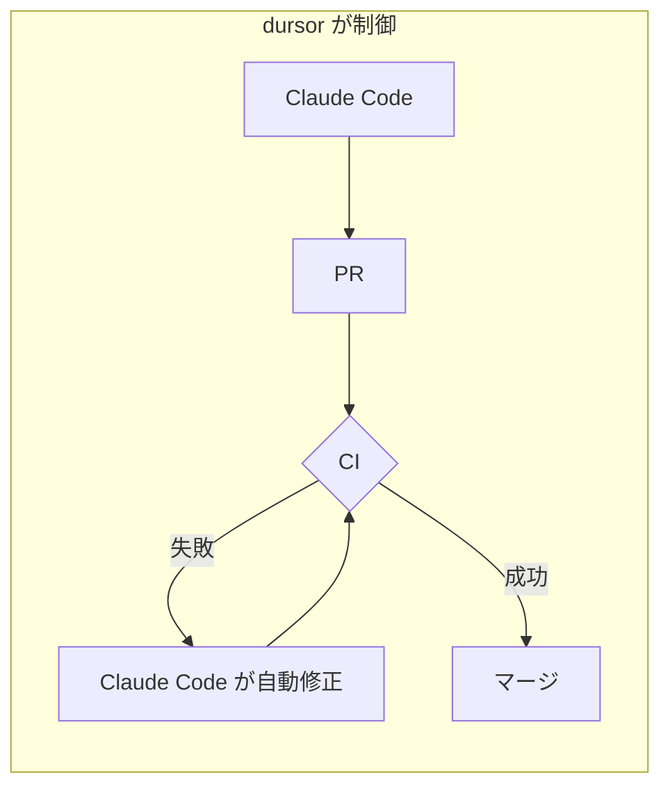
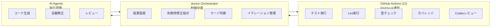
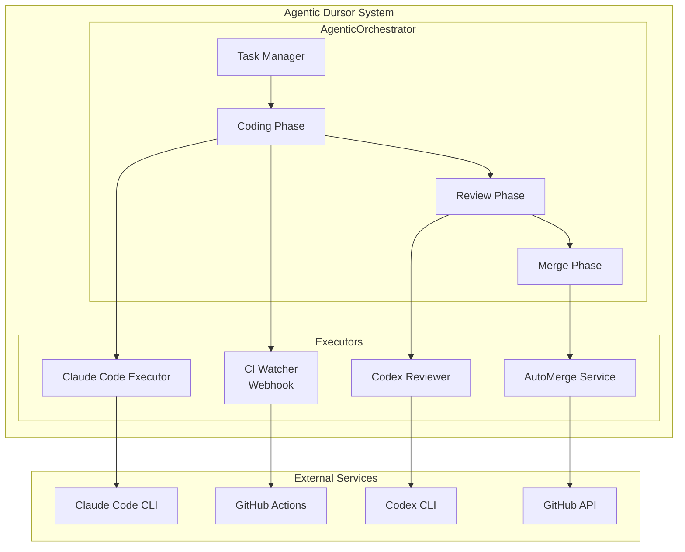
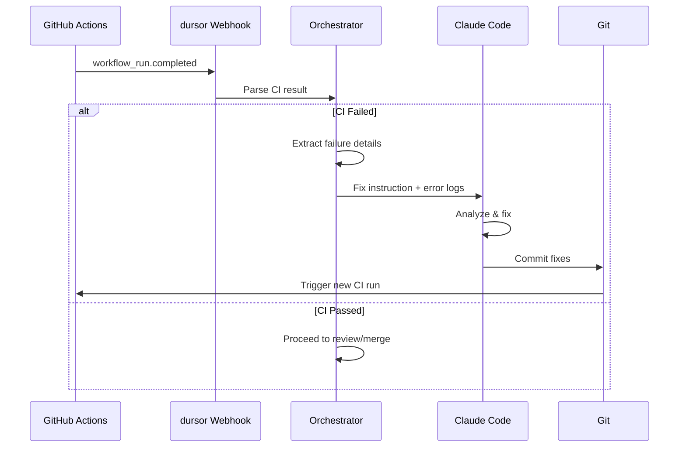
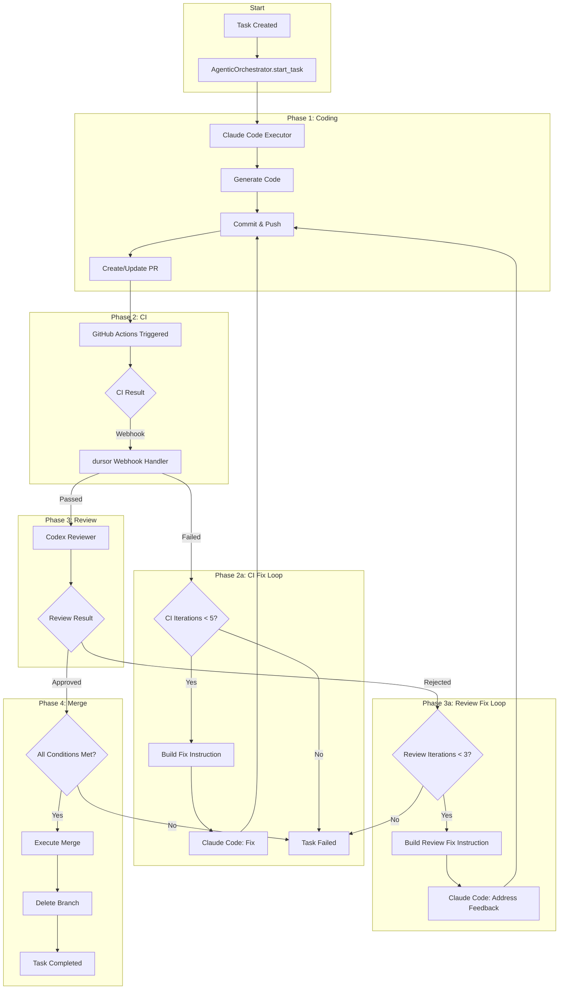
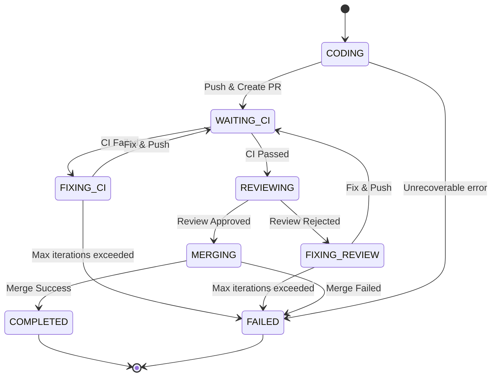

# Agentic Dursor - 自律的開発フロー設計

## 概要

dursor をコーディングエージェントが**人間の承認なしに自律的に開発を行える**システムとして設計する。

### 設計方針: 完全自律版 (Option B)

本設計は**完全自律**を目指す。CI失敗時も人間介入なしに自動修正を行う。



### 設計原則

1. **Human-out-of-the-loop**: 人間のApproveは不要、完全自動化
2. **Strict Merge Gates**: マージ条件を明確かつ厳格に定義
3. **Agent Specialization**: コーディング(Claude)とレビュー(Codex)を分離
4. **Fail-fast Feedback Loop**: CI/レビュー失敗を検知し自動修正
5. **dursor as Orchestrator**: CIはチェックのみ、dursorが全体を制御

---

## CIとdursorの責務分離

### 責務分担

| 担当 | 責務 | 実行場所 |
|------|------|----------|
| **GitHub Actions (CI)** | チェック実行、結果通知 | GitHub |
| **dursor Orchestrator** | 失敗検知、自動修正、マージ制御 | dursor API |



### なぜdursorがオーケストレーションするのか

CIだけでは実現できない機能：

| 機能 | CI単独 | dursor + CI |
|------|--------|-------------|
| テスト/Lint実行 | ✅ | ✅ |
| 失敗時の自動修正 | ❌ | ✅ |
| レビュー指摘への対応 | ❌ | ✅ |
| イテレーション管理 | ❌ | ✅ |
| コンテキスト維持 | ❌ | ✅ |
| 条件付きマージ | △ (GitHub機能) | ✅ (柔軟) |

---

## アーキテクチャ

### システム全体像



### Agent Role Distribution

| Agent | Tool | 責務 |
|-------|------|------|
| **Coder** | Claude Code CLI | コード生成、バグ修正、機能実装、CI失敗修正 |
| **Reviewer** | Codex CLI | コードレビュー、品質評価、改善提案 |
| **CI Watcher** | GitHub Webhook | CI結果監視、失敗検知、結果パース |
| **Merger** | GitHub API | マージ条件検証、自動マージ実行 |

---

## CI Webhook統合

### Webhook Flow



### GitHub Actions 設定

```yaml
# .github/workflows/ci.yml
name: CI

on:
  push:
    branches: [main]
  pull_request:
    branches: [main]

jobs:
  # ============================================
  # Backend Checks
  # ============================================
  backend-lint:
    runs-on: ubuntu-latest
    steps:
      - uses: actions/checkout@v4
      - uses: astral-sh/setup-uv@v4
      - run: uv python install 3.13
      - run: uv sync --extra dev
      - run: uv run ruff check src/
      - run: uv run ruff format --check src/

  backend-typecheck:
    runs-on: ubuntu-latest
    steps:
      - uses: actions/checkout@v4
      - uses: astral-sh/setup-uv@v4
      - run: uv python install 3.13
      - run: uv sync --extra dev
      - run: uv run mypy src/

  backend-test:
    runs-on: ubuntu-latest
    steps:
      - uses: actions/checkout@v4
      - uses: astral-sh/setup-uv@v4
      - run: uv python install 3.13
      - run: uv sync --extra dev
      - name: Run tests with coverage
        run: uv run pytest --cov=src --cov-report=json --cov-fail-under=80
      - name: Upload coverage
        uses: actions/upload-artifact@v4
        with:
          name: coverage-report
          path: coverage.json

  # ============================================
  # Frontend Checks
  # ============================================
  frontend-lint:
    runs-on: ubuntu-latest
    defaults:
      run:
        working-directory: apps/web
    steps:
      - uses: actions/checkout@v4
      - uses: actions/setup-node@v4
        with:
          node-version: 20
      - run: npm ci
      - run: npm run lint

  frontend-build:
    runs-on: ubuntu-latest
    defaults:
      run:
        working-directory: apps/web
    steps:
      - uses: actions/checkout@v4
      - uses: actions/setup-node@v4
        with:
          node-version: 20
      - run: npm ci
      - run: npm run build

  frontend-test:
    runs-on: ubuntu-latest
    defaults:
      run:
        working-directory: apps/web
    steps:
      - uses: actions/checkout@v4
      - uses: actions/setup-node@v4
        with:
          node-version: 20
      - run: npm ci
      - run: npm run test:e2e

  # ============================================
  # Codex Review (AI Code Review)
  # ============================================
  codex-review:
    runs-on: ubuntu-latest
    needs: [backend-lint, backend-typecheck, backend-test, frontend-lint, frontend-build]
    if: github.event_name == 'pull_request'
    steps:
      - uses: actions/checkout@v4
        with:
          fetch-depth: 0

      - name: Get changed files
        id: changed
        run: |
          echo "files=$(git diff --name-only origin/${{ github.base_ref }}...HEAD | tr '\n' ' ')" >> $GITHUB_OUTPUT

      - name: Setup Codex CLI
        run: |
          # Install Codex CLI (adjust based on actual installation method)
          npm install -g @openai/codex-cli

      - name: Run Codex Review
        id: review
        env:
          OPENAI_API_KEY: ${{ secrets.OPENAI_API_KEY }}
        run: |
          # Get the diff
          git diff origin/${{ github.base_ref }}...HEAD > changes.diff

          # Run Codex review
          codex review \
            --diff changes.diff \
            --output-format json \
            --min-score 0.75 \
            > review_result.json

          # Check result
          APPROVED=$(jq -r '.approved' review_result.json)
          SCORE=$(jq -r '.score' review_result.json)

          echo "approved=$APPROVED" >> $GITHUB_OUTPUT
          echo "score=$SCORE" >> $GITHUB_OUTPUT

          if [ "$APPROVED" != "true" ]; then
            echo "::error::Code review failed with score $SCORE"
            exit 1
          fi

      - name: Upload review result
        uses: actions/upload-artifact@v4
        with:
          name: codex-review
          path: review_result.json

  # ============================================
  # Security Scan
  # ============================================
  security-scan:
    runs-on: ubuntu-latest
    steps:
      - uses: actions/checkout@v4
      - name: Run security scan
        run: |
          # Check for secrets in code
          pip install detect-secrets
          detect-secrets scan --all-files --exclude-files '\.git/.*' > secrets.json

          # Fail if secrets found
          if [ $(jq '.results | length' secrets.json) -gt 0 ]; then
            echo "::error::Potential secrets detected in code"
            exit 1
          fi

  # ============================================
  # Final Gate (All checks must pass)
  # ============================================
  all-checks-passed:
    runs-on: ubuntu-latest
    needs: [backend-lint, backend-typecheck, backend-test, frontend-lint, frontend-build, frontend-test, codex-review, security-scan]
    steps:
      - run: echo "All checks passed!"

  # ============================================
  # Notify dursor (Webhook)
  # ============================================
  notify-dursor:
    runs-on: ubuntu-latest
    needs: [all-checks-passed]
    if: always()
    steps:
      - name: Notify dursor orchestrator
        env:
          DURSOR_WEBHOOK_URL: ${{ secrets.DURSOR_WEBHOOK_URL }}
          DURSOR_WEBHOOK_SECRET: ${{ secrets.DURSOR_WEBHOOK_SECRET }}
        run: |
          # Collect job results
          PAYLOAD=$(cat <<EOF
          {
            "event": "ci_completed",
            "repository": "${{ github.repository }}",
            "ref": "${{ github.ref }}",
            "sha": "${{ github.sha }}",
            "pr_number": ${{ github.event.pull_request.number || 'null' }},
            "workflow_run_id": ${{ github.run_id }},
            "conclusion": "${{ needs.all-checks-passed.result }}",
            "jobs": {
              "backend_lint": "${{ needs.backend-lint.result }}",
              "backend_typecheck": "${{ needs.backend-typecheck.result }}",
              "backend_test": "${{ needs.backend-test.result }}",
              "frontend_lint": "${{ needs.frontend-lint.result }}",
              "frontend_build": "${{ needs.frontend-build.result }}",
              "frontend_test": "${{ needs.frontend-test.result }}",
              "codex_review": "${{ needs.codex-review.result }}",
              "security_scan": "${{ needs.security-scan.result }}"
            }
          }
          EOF
          )

          # Calculate HMAC signature
          SIGNATURE=$(echo -n "$PAYLOAD" | openssl dgst -sha256 -hmac "$DURSOR_WEBHOOK_SECRET" | awk '{print $2}')

          # Send webhook
          curl -X POST "$DURSOR_WEBHOOK_URL/v1/webhooks/ci" \
            -H "Content-Type: application/json" \
            -H "X-Hub-Signature-256: sha256=$SIGNATURE" \
            -d "$PAYLOAD"
```

### Webhook Handler (dursor側)

```python
# apps/api/src/dursor_api/routes/webhooks.py

from fastapi import APIRouter, Request, HTTPException, Depends
from pydantic import BaseModel
import hmac
import hashlib

router = APIRouter(prefix="/v1/webhooks", tags=["webhooks"])


class CIWebhookPayload(BaseModel):
    event: str
    repository: str
    ref: str
    sha: str
    pr_number: int | None
    workflow_run_id: int
    conclusion: str  # "success" | "failure" | "cancelled"
    jobs: dict[str, str]  # job_name -> result


class JobFailure(BaseModel):
    job_name: str
    result: str
    error_log: str | None = None


@router.post("/ci")
async def handle_ci_webhook(
    request: Request,
    orchestrator: AgenticOrchestrator = Depends(get_orchestrator),
):
    """
    Receive CI completion webhook from GitHub Actions.
    Trigger auto-fix if CI failed.
    """
    # Verify signature
    signature = request.headers.get("X-Hub-Signature-256")
    body = await request.body()
    if not verify_signature(body, signature):
        raise HTTPException(status_code=401, detail="Invalid signature")

    payload = CIWebhookPayload.parse_raw(body)

    # Find associated task
    task = await orchestrator.find_task_by_pr(payload.pr_number)
    if not task:
        return {"status": "ignored", "reason": "No associated task found"}

    if payload.conclusion == "success":
        # All CI passed - proceed to merge
        await orchestrator.proceed_to_merge(task)
        return {"status": "proceeding_to_merge"}

    else:
        # CI failed - trigger auto-fix
        failed_jobs = [
            JobFailure(job_name=name, result=result)
            for name, result in payload.jobs.items()
            if result == "failure"
        ]

        # Fetch error logs from GitHub
        for job in failed_jobs:
            job.error_log = await fetch_job_logs(
                payload.workflow_run_id,
                job.job_name,
            )

        # Trigger Claude Code to fix
        await orchestrator.trigger_auto_fix(
            task=task,
            failed_jobs=failed_jobs,
            commit_sha=payload.sha,
        )

        return {
            "status": "auto_fix_triggered",
            "failed_jobs": [j.job_name for j in failed_jobs],
        }


def verify_signature(body: bytes, signature: str | None) -> bool:
    """Verify HMAC-SHA256 signature from GitHub"""
    if not signature:
        return False

    secret = settings.webhook_secret.encode()
    expected = "sha256=" + hmac.new(secret, body, hashlib.sha256).hexdigest()
    return hmac.compare_digest(expected, signature)


async def fetch_job_logs(workflow_run_id: int, job_name: str) -> str:
    """Fetch job logs from GitHub Actions API"""
    # Use GitHub API to get logs
    # GET /repos/{owner}/{repo}/actions/runs/{run_id}/jobs
    # GET /repos/{owner}/{repo}/actions/jobs/{job_id}/logs
    pass
```

---

## オーケストレーション詳細

### AgenticOrchestrator 完全実装

```python
# apps/api/src/dursor_api/services/agentic_orchestrator.py

from enum import Enum
from dataclasses import dataclass
from datetime import datetime, timedelta
import asyncio


class AgenticPhase(str, Enum):
    CODING = "coding"
    WAITING_CI = "waiting_ci"
    REVIEWING = "reviewing"
    FIXING_CI = "fixing_ci"
    FIXING_REVIEW = "fixing_review"
    MERGING = "merging"
    COMPLETED = "completed"
    FAILED = "failed"


@dataclass
class AgenticState:
    task_id: str
    phase: AgenticPhase
    iteration: int
    ci_iterations: int
    review_iterations: int
    started_at: datetime
    last_activity: datetime
    pr_number: int | None = None
    current_sha: str | None = None
    last_ci_result: dict | None = None
    last_review_result: ReviewResult | None = None
    error: str | None = None


class AgenticOrchestrator:
    """
    Orchestrates the full agentic development cycle.

    Flow:
    1. Coding (Claude Code)
    2. Wait for CI
    3. If CI fails → Fix and go to 2
    4. Review (Codex)
    5. If review rejects → Fix and go to 2
    6. Merge
    """

    def __init__(
        self,
        coder: ClaudeCodeExecutor,
        reviewer: ReviewerExecutor,
        merger: AutoMergeService,
        git_service: GitService,
        github_service: GitHubService,
        task_dao: TaskDAO,
        limits: IterationLimits,
    ):
        self.coder = coder
        self.reviewer = reviewer
        self.merger = merger
        self.git = git_service
        self.github = github_service
        self.task_dao = task_dao
        self.limits = limits

        # State management
        self._states: dict[str, AgenticState] = {}
        self._locks: dict[str, asyncio.Lock] = {}

    # =========================================
    # Public API
    # =========================================

    async def start_task(self, task: Task, instruction: str) -> AgenticState:
        """
        Start agentic execution for a task.
        """
        state = AgenticState(
            task_id=task.id,
            phase=AgenticPhase.CODING,
            iteration=0,
            ci_iterations=0,
            review_iterations=0,
            started_at=datetime.utcnow(),
            last_activity=datetime.utcnow(),
        )
        self._states[task.id] = state
        self._locks[task.id] = asyncio.Lock()

        # Start coding phase
        await self._run_coding_phase(task, instruction, state)

        return state

    async def handle_ci_result(
        self,
        task: Task,
        ci_result: CIResult,
    ) -> AgenticState:
        """
        Handle CI completion webhook.
        Called by webhook handler.
        """
        state = self._states.get(task.id)
        if not state:
            raise ValueError(f"No active agentic state for task {task.id}")

        async with self._locks[task.id]:
            state.last_ci_result = ci_result
            state.last_activity = datetime.utcnow()

            if ci_result.success:
                # CI passed - proceed to review
                state.phase = AgenticPhase.REVIEWING
                await self._run_review_phase(task, state)
            else:
                # CI failed - trigger fix
                state.ci_iterations += 1

                if state.ci_iterations > self.limits.max_ci_iterations:
                    state.phase = AgenticPhase.FAILED
                    state.error = "Exceeded max CI fix iterations"
                    return state

                state.phase = AgenticPhase.FIXING_CI
                await self._run_ci_fix_phase(task, ci_result, state)

            return state

    async def handle_review_result(
        self,
        task: Task,
        review_result: ReviewResult,
    ) -> AgenticState:
        """
        Handle review completion.
        """
        state = self._states.get(task.id)
        if not state:
            raise ValueError(f"No active agentic state for task {task.id}")

        async with self._locks[task.id]:
            state.last_review_result = review_result
            state.last_activity = datetime.utcnow()

            if review_result.approved and review_result.score >= self.limits.min_review_score:
                # Review passed - proceed to merge
                state.phase = AgenticPhase.MERGING
                await self._run_merge_phase(task, state)
            else:
                # Review rejected - trigger fix
                state.review_iterations += 1

                if state.review_iterations > self.limits.max_review_iterations:
                    state.phase = AgenticPhase.FAILED
                    state.error = "Exceeded max review fix iterations"
                    return state

                state.phase = AgenticPhase.FIXING_REVIEW
                await self._run_review_fix_phase(task, review_result, state)

            return state

    async def trigger_auto_fix(
        self,
        task: Task,
        failed_jobs: list[JobFailure],
        commit_sha: str,
    ):
        """
        Trigger Claude Code to fix CI failures.
        Called by webhook handler.
        """
        state = self._states.get(task.id)
        if not state:
            return

        # Build fix instruction from error logs
        instruction = self._build_ci_fix_instruction(failed_jobs)

        # Run Claude Code to fix
        await self._run_coding_phase(
            task,
            instruction,
            state,
            context={"fix_mode": True, "failed_jobs": failed_jobs},
        )

    async def proceed_to_merge(self, task: Task):
        """
        Proceed to merge phase after CI passes.
        """
        state = self._states.get(task.id)
        if not state:
            return

        # First run review if not done
        if state.phase == AgenticPhase.WAITING_CI:
            state.phase = AgenticPhase.REVIEWING
            await self._run_review_phase(task, state)

    # =========================================
    # Phase Implementations
    # =========================================

    async def _run_coding_phase(
        self,
        task: Task,
        instruction: str,
        state: AgenticState,
        context: dict | None = None,
    ):
        """Execute Claude Code for coding."""
        state.phase = AgenticPhase.CODING
        state.iteration += 1

        if state.iteration > self.limits.max_total_iterations:
            state.phase = AgenticPhase.FAILED
            state.error = "Exceeded max total iterations"
            return

        # Prepare workspace
        workspace = await self.git.prepare_workspace(task.repo_id)

        # Build instruction with context
        full_instruction = instruction
        if context and context.get("fix_mode"):
            full_instruction = self._enhance_instruction_with_context(
                instruction,
                context,
                state,
            )

        # Execute Claude Code
        result = await self.coder.execute(
            workspace_path=workspace.path,
            instruction=full_instruction,
            constraints=self._get_constraints(),
        )

        if not result.success:
            state.phase = AgenticPhase.FAILED
            state.error = f"Coding failed: {result.error}"
            return

        # Commit and push
        branch_name = f"agentic/{task.id}"
        await self.git.commit_and_push(
            workspace_path=workspace.path,
            branch=branch_name,
            message=f"[agentic] {result.summary}",
        )

        # Create or update PR
        if not state.pr_number:
            pr = await self.github.create_pr(
                title=f"[Agentic] {task.title}",
                body=self._build_pr_body(task, state),
                head=branch_name,
                base="main",
            )
            state.pr_number = pr.number
        else:
            # PR already exists, push updated code
            pass

        # Wait for CI
        state.phase = AgenticPhase.WAITING_CI
        state.current_sha = result.commit_sha

    async def _run_ci_fix_phase(
        self,
        task: Task,
        ci_result: CIResult,
        state: AgenticState,
    ):
        """Fix CI failures using Claude Code."""
        # Build fix instruction from CI errors
        instruction = self._build_ci_fix_instruction(ci_result.failed_jobs)

        await self._run_coding_phase(
            task,
            instruction,
            state,
            context={
                "fix_mode": True,
                "ci_result": ci_result,
            },
        )

    async def _run_review_phase(self, task: Task, state: AgenticState):
        """Execute Codex review."""
        state.phase = AgenticPhase.REVIEWING

        # Get the diff
        diff = await self.git.get_pr_diff(state.pr_number)

        # Run Codex review
        review_result = await self.reviewer.execute(
            workspace_path=await self.git.get_workspace_path(task.repo_id),
            patch=diff,
            context=ReviewContext(
                original_instruction=task.instruction,
                iteration=state.iteration,
            ),
        )

        # Handle review result
        await self.handle_review_result(task, review_result)

    async def _run_review_fix_phase(
        self,
        task: Task,
        review_result: ReviewResult,
        state: AgenticState,
    ):
        """Fix issues from code review."""
        # Build fix instruction from review feedback
        instruction = self._build_review_fix_instruction(review_result)

        await self._run_coding_phase(
            task,
            instruction,
            state,
            context={
                "fix_mode": True,
                "review_feedback": review_result,
            },
        )

    async def _run_merge_phase(self, task: Task, state: AgenticState):
        """Execute auto-merge."""
        state.phase = AgenticPhase.MERGING

        # Final condition check
        conditions_met = await self.merger.check_all_conditions(state.pr_number)

        if not conditions_met.can_merge:
            state.phase = AgenticPhase.FAILED
            state.error = f"Merge conditions not met: {conditions_met.failed}"
            return

        # Execute merge
        merge_result = await self.merger.merge(
            pr_number=state.pr_number,
            method="squash",
            delete_branch=True,
        )

        if merge_result.success:
            state.phase = AgenticPhase.COMPLETED
            await self._update_task_status(task, "completed")
        else:
            state.phase = AgenticPhase.FAILED
            state.error = f"Merge failed: {merge_result.error}"

    # =========================================
    # Helper Methods
    # =========================================

    def _build_ci_fix_instruction(self, failed_jobs: list[JobFailure]) -> str:
        """Build instruction for fixing CI failures."""
        parts = ["Fix the following CI failures:\n"]

        for job in failed_jobs:
            parts.append(f"\n## {job.job_name} (FAILED)\n")
            if job.error_log:
                parts.append(f"```\n{job.error_log}\n```\n")

        parts.append("""
Please:
1. Analyze each error carefully
2. Fix the root cause (not just the symptoms)
3. Ensure your fixes don't break other tests
4. Run the relevant checks locally before committing
""")

        return "".join(parts)

    def _build_review_fix_instruction(self, review: ReviewResult) -> str:
        """Build instruction for addressing review feedback."""
        parts = [f"Address the following code review feedback (score: {review.score}):\n"]

        if review.blocking_issues:
            parts.append("\n## Blocking Issues (MUST FIX)\n")
            for issue in review.blocking_issues:
                parts.append(f"- [{issue.severity}] {issue.file_path}")
                if issue.line_number:
                    parts.append(f":{issue.line_number}")
                parts.append(f"\n  {issue.description}\n")
                if issue.suggested_fix:
                    parts.append(f"  Suggested fix: {issue.suggested_fix}\n")

        if review.suggestions:
            parts.append("\n## Suggestions (SHOULD FIX)\n")
            for sugg in review.suggestions:
                parts.append(f"- [{sugg.priority}] {sugg.category}: {sugg.description}\n")

        return "".join(parts)

    def _enhance_instruction_with_context(
        self,
        instruction: str,
        context: dict,
        state: AgenticState,
    ) -> str:
        """Enhance instruction with iteration context."""
        parts = [instruction]

        if state.iteration > 1:
            parts.append(f"\n\n---\nThis is iteration {state.iteration}.")
            parts.append(f"CI fix attempts: {state.ci_iterations}")
            parts.append(f"Review fix attempts: {state.review_iterations}")

        if context.get("review_feedback"):
            review = context["review_feedback"]
            parts.append(f"\nPrevious review score: {review.score}")

        return "\n".join(parts)

    def _get_constraints(self) -> AgentConstraints:
        """Get agent constraints."""
        return AgentConstraints(
            forbidden_paths=[".git", ".env*", "*.key", "*.pem", "*.secret"],
            forbidden_commands=["git push --force", "rm -rf /", "DROP DATABASE"],
            max_files_changed=50,
        )
```

### Iteration Limits

```python
@dataclass
class IterationLimits:
    # Phase-specific limits
    max_ci_iterations: int = 5          # Max CI fix attempts
    max_review_iterations: int = 3      # Max review fix attempts
    max_total_iterations: int = 10      # Total iteration limit

    # Quality thresholds
    min_review_score: float = 0.75      # Minimum review score to pass

    # Timeouts
    timeout_minutes: int = 60           # Total timeout
    ci_wait_timeout_minutes: int = 15   # Max wait for CI
    coding_timeout_minutes: int = 30    # Max time for coding phase

    # Escalation (future: alert human)
    escalate_after_iterations: int = 7
```

---

## 開発フロー詳細

### Complete Flow Diagram



### Phase Transitions



---

## マージ条件 (Merge Gates)

### 必須条件 (All Must Pass)

| # | Condition | Description | Verification | Auto-fixable |
|---|-----------|-------------|--------------|--------------|
| 1 | **CI Green** | 全CIジョブがパス | GitHub Actions Status | ✅ Yes |
| 2 | **Codex Approved** | レビュースコア ≥ 0.75 | ReviewResult | ✅ Yes |
| 3 | **No Conflicts** | マージコンフリクトなし | git merge-tree | ⚠️ Sometimes |
| 4 | **Tests Pass** | 全テストがパス | pytest / npm test | ✅ Yes |
| 5 | **Type Check** | 型エラーなし | mypy / tsc | ✅ Yes |
| 6 | **Lint Clean** | Lintエラーなし | ruff / eslint | ✅ Yes |
| 7 | **Format Check** | フォーマット準拠 | ruff format / prettier | ✅ Yes |
| 8 | **Security Scan** | シークレット漏洩なし | detect-secrets | ✅ Yes |
| 9 | **Coverage ≥ 80%** | カバレッジ基準達成 | pytest-cov | ✅ Yes |
| 10 | **Review Score ≥ 0.75** | 品質スコア基準 | Codex output | ✅ Yes |

### Auto-fix Strategy

```python
FIX_STRATEGIES = {
    "backend_lint": "Run 'ruff check --fix' and 'ruff format'",
    "backend_typecheck": "Add type annotations, fix type errors",
    "backend_test": "Fix failing tests or update test expectations",
    "frontend_lint": "Run 'npm run lint -- --fix'",
    "frontend_build": "Fix TypeScript errors, missing imports",
    "frontend_test": "Fix failing E2E tests",
    "codex_review": "Address blocking issues from review feedback",
    "security_scan": "Remove hardcoded secrets, use environment variables",
    "coverage": "Add tests for uncovered code paths",
}
```

---

## API 拡張

### 新規エンドポイント

```yaml
# Agentic Task Execution
POST /v1/tasks/{task_id}/agentic:
  description: Start full agentic cycle
  request:
    instruction: string
    config: AgenticConfig (optional)
  response:
    agentic_run_id: string
    status: "started"

GET /v1/tasks/{task_id}/agentic/status:
  description: Get agentic execution status
  response:
    phase: AgenticPhase
    iteration: int
    ci_iterations: int
    review_iterations: int
    pr_number: int | null
    last_ci_result: CIResult | null
    last_review_result: ReviewResult | null
    error: string | null

POST /v1/tasks/{task_id}/agentic/cancel:
  description: Cancel agentic execution
  response:
    cancelled: boolean

# Webhook
POST /v1/webhooks/ci:
  description: Receive CI completion webhook
  headers:
    X-Hub-Signature-256: string
  request:
    event: string
    repository: string
    ref: string
    sha: string
    pr_number: int | null
    workflow_run_id: int
    conclusion: string
    jobs: dict[string, string]
  response:
    status: string
    action_taken: string | null
```

---

## 設定

### 環境変数

```bash
# Agentic Mode
DURSOR_AGENTIC_ENABLED=true
DURSOR_AGENTIC_AUTO_MERGE=true

# Iteration Limits
DURSOR_AGENTIC_MAX_TOTAL_ITERATIONS=10
DURSOR_AGENTIC_MAX_CI_ITERATIONS=5
DURSOR_AGENTIC_MAX_REVIEW_ITERATIONS=3
DURSOR_AGENTIC_TIMEOUT_MINUTES=60

# Quality Thresholds
DURSOR_REVIEW_MIN_SCORE=0.75
DURSOR_COVERAGE_THRESHOLD=80

# Webhook
DURSOR_WEBHOOK_SECRET=your-secret-here

# Merge
DURSOR_MERGE_METHOD=squash
DURSOR_MERGE_DELETE_BRANCH=true
```

---

## セキュリティ考慮事項

### 1. Webhook Verification

```python
def verify_webhook(request: Request) -> bool:
    signature = request.headers.get("X-Hub-Signature-256")
    if not signature:
        return False

    body = await request.body()
    expected = "sha256=" + hmac.new(
        settings.webhook_secret.encode(),
        body,
        hashlib.sha256
    ).hexdigest()

    return hmac.compare_digest(expected, signature)
```

### 2. Rate Limiting

```python
class AgenticRateLimits:
    max_concurrent_tasks: int = 5
    max_iterations_per_hour: int = 100
    max_api_calls_per_minute: int = 60
    cooldown_after_failure_seconds: int = 300
```

### 3. Forbidden Operations

```python
FORBIDDEN_PATTERNS = [
    r"(?i)(api[_-]?key|secret|password|token)\s*=\s*['\"][^'\"]+['\"]",
    r"sk-[a-zA-Z0-9]{48}",  # OpenAI
    r"ghp_[a-zA-Z0-9]{36}",  # GitHub PAT
    r"AKIA[0-9A-Z]{16}",    # AWS Access Key
]

FORBIDDEN_COMMANDS = [
    "git push --force",
    "git reset --hard",
    "rm -rf /",
    "DROP DATABASE",
    "chmod 777",
]
```

---

## 監視とログ

### Audit Log Schema

```sql
CREATE TABLE agentic_audit_log (
    id TEXT PRIMARY KEY,
    task_id TEXT NOT NULL,
    timestamp DATETIME NOT NULL,
    phase TEXT NOT NULL,
    action TEXT NOT NULL,
    agent TEXT,  -- "claude_code" | "codex" | "system"
    input_summary TEXT,
    output_summary TEXT,
    duration_ms INTEGER,
    success BOOLEAN,
    error TEXT,

    FOREIGN KEY (task_id) REFERENCES tasks(id)
);

CREATE INDEX idx_agentic_audit_task ON agentic_audit_log(task_id);
CREATE INDEX idx_agentic_audit_timestamp ON agentic_audit_log(timestamp);
```

### Metrics

```python
# Prometheus metrics
agentic_tasks_total = Counter("agentic_tasks_total", "Total agentic tasks", ["status"])
agentic_iterations = Histogram("agentic_iterations", "Iterations per task")
agentic_ci_fix_attempts = Histogram("agentic_ci_fix_attempts", "CI fix attempts per task")
agentic_review_fix_attempts = Histogram("agentic_review_fix_attempts", "Review fix attempts")
agentic_duration_seconds = Histogram("agentic_duration_seconds", "Task duration")
agentic_review_scores = Histogram("agentic_review_scores", "Review scores")
```

---

## 実装ロードマップ

### Phase 1: Foundation (Week 1-2)

- [ ] Webhook handler実装 (`routes/webhooks.py`)
- [ ] AgenticState モデル追加
- [ ] AgenticOrchestrator 基本実装
- [ ] CI fix instruction builder

### Phase 2: Review Integration (Week 3)

- [ ] ReviewerExecutor (Codex) 実装
- [ ] ReviewResult パーサー
- [ ] Review fix instruction builder
- [ ] Review API エンドポイント

### Phase 3: Merge Automation (Week 4)

- [ ] MergeGate 条件チェッカー
- [ ] AutoMergeService 実装
- [ ] GitHub API統合 (merge, delete branch)

### Phase 4: Polish (Week 5)

- [ ] Audit logging
- [ ] Metrics collection
- [ ] Error handling & recovery
- [ ] Documentation

---

## 関連ドキュメント

- [Architecture](./architecture.md)
- [Agent System](./agents.md)
- [Multi AI Coding Tool](./ai-coding-tool-multiple.md)
- [Git Operation Design](./git_operation_design.md)
