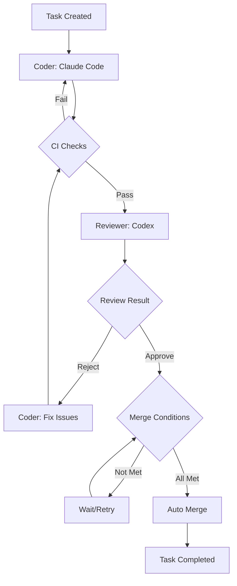
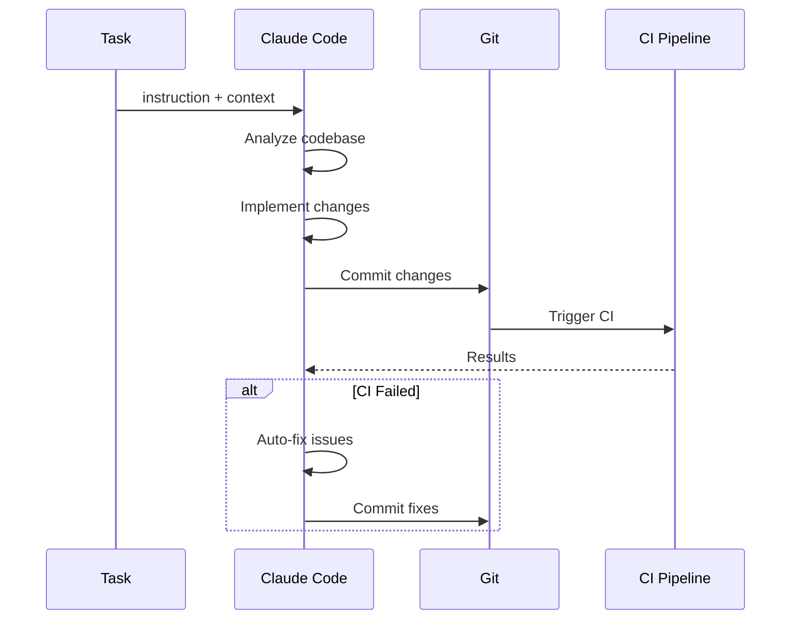
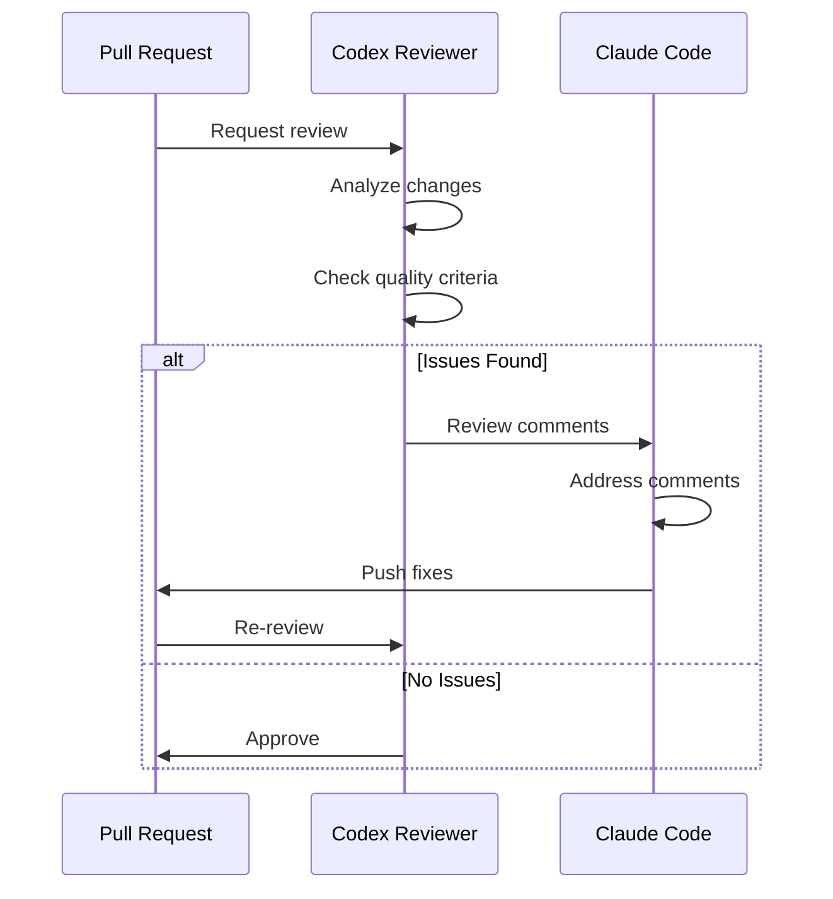
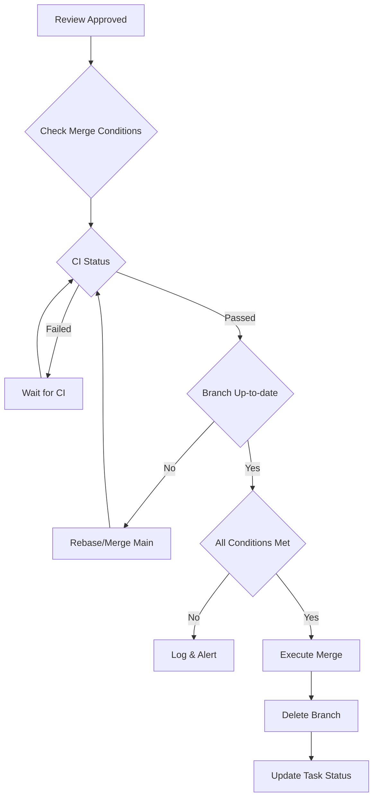
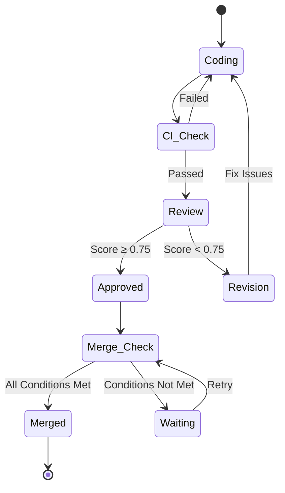
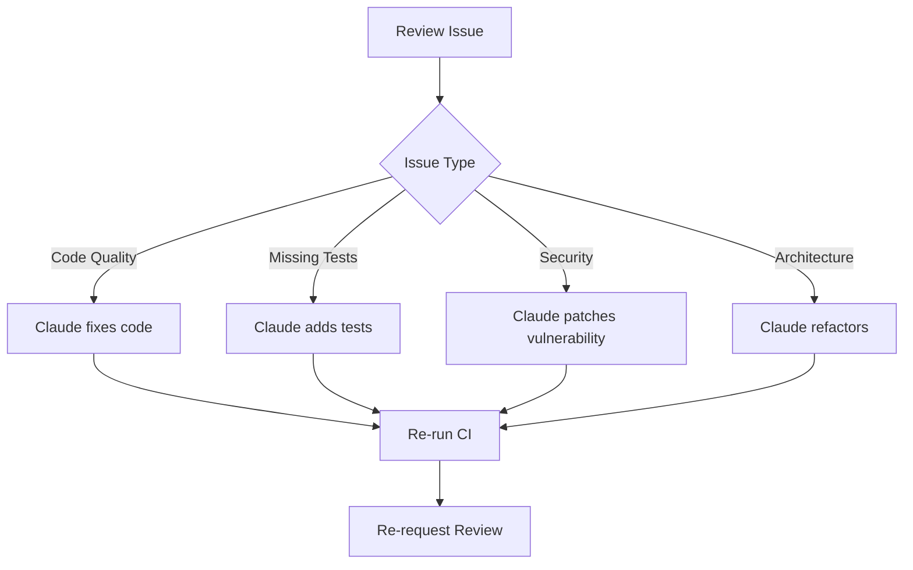

# Agentic Dursor - 自律的開発フロー設計

## 概要

dursor をコーディングエージェントが**人間の承認なしに自律的に開発を行える**システムとして設計する。

### 設計原則

1. **Human-out-of-the-loop**: 人間のApproveは不要、完全自動化
2. **Strict Merge Gates**: マージ条件を明確かつ厳格に定義
3. **Agent Specialization**: コーディングとレビューを異なるエージェントが担当
4. **Fail-fast Feedback Loop**: 問題を早期に検出し自動修正

---

## アーキテクチャ

### Agent Role Distribution

```
┌─────────────────────────────────────────────────────────────────┐
│                        Agentic Dursor                            │
├─────────────────────────────────────────────────────────────────┤
│                                                                  │
│  ┌─────────────┐    ┌─────────────┐    ┌─────────────┐          │
│  │   Coder     │    │  Reviewer   │    │   Merger    │          │
│  │ (Claude)    │───▶│  (Codex)    │───▶│  (System)   │          │
│  └─────────────┘    └─────────────┘    └─────────────┘          │
│        │                  │                   │                  │
│        │                  │                   │                  │
│        ▼                  ▼                   ▼                  │
│  ┌─────────────┐    ┌─────────────┐    ┌─────────────┐          │
│  │  Generate   │    │   Review    │    │ Auto-Merge  │          │
│  │   Code      │    │   & Score   │    │   to Main   │          │
│  └─────────────┘    └─────────────┘    └─────────────┘          │
│                                                                  │
└─────────────────────────────────────────────────────────────────┘
```

### エージェント役割

| Agent | Tool | 責務 |
|-------|------|------|
| **Coder** | Claude Code CLI | コード生成、バグ修正、機能実装 |
| **Reviewer** | Codex CLI | コードレビュー、品質評価、改善提案 |
| **Merger** | System (自動) | マージ条件検証、自動マージ実行 |

---

## 開発フロー

### 全体フロー



### Phase 1: Coding (Claude Code)



#### Claude Code の責務

1. **コード生成**: 指示に基づいてコードを実装
2. **テスト作成**: 実装に対応するテストを作成
3. **CI対応**: CI失敗時は自動修正
4. **ドキュメント更新**: 必要に応じてドキュメントを更新

#### Claude Code 制約

```yaml
constraints:
  max_iterations: 5          # 最大修正回数
  max_files_changed: 50      # 最大変更ファイル数
  forbidden_paths:
    - ".git"
    - ".env*"
    - "*.key"
    - "*.pem"
  forbidden_commands:
    - "git push --force"
    - "rm -rf"
    - "DROP TABLE"
```

### Phase 2: Review (Codex)



#### Codex Reviewer の責務

1. **コード品質評価**: 可読性、保守性、パフォーマンス
2. **セキュリティチェック**: 脆弱性、機密情報漏洩
3. **アーキテクチャ適合性**: 既存設計との整合性
4. **テストカバレッジ確認**: テストの網羅性
5. **改善提案**: 具体的な修正指示

#### Review Criteria (レビュー基準)

```python
class ReviewCriteria:
    # 必須 (Blocking)
    security_issues: bool = False      # セキュリティ問題なし
    breaking_changes: bool = False     # 意図しない破壊的変更なし
    test_coverage_met: bool = True     # テストカバレッジ基準達成
    lint_errors: bool = False          # Lint エラーなし
    type_errors: bool = False          # 型エラーなし

    # 推奨 (Non-blocking, but scored)
    code_quality_score: float          # 0.0 - 1.0
    documentation_score: float         # 0.0 - 1.0
    performance_score: float           # 0.0 - 1.0

    # 閾値
    min_quality_score: float = 0.7
    min_overall_score: float = 0.75
```

#### Review Result

```python
class ReviewResult:
    approved: bool                     # 承認/却下
    score: float                       # 総合スコア (0.0 - 1.0)
    blocking_issues: list[Issue]       # ブロッキング問題
    suggestions: list[Suggestion]      # 改善提案
    summary: str                       # レビューサマリー

class Issue:
    severity: Literal["critical", "major", "minor"]
    file_path: str
    line_number: int | None
    description: str
    suggested_fix: str | None

class Suggestion:
    category: Literal["performance", "readability", "security", "testing"]
    description: str
    priority: Literal["high", "medium", "low"]
```

### Phase 3: Auto-Merge



---

## マージ条件 (Merge Gates)

### 必須条件 (All Must Pass)

| # | Condition | Description | Verification |
|---|-----------|-------------|--------------|
| 1 | **CI Green** | 全CIチェックがパス | GitHub Actions Status |
| 2 | **Codex Approved** | Codexレビューが承認 | ReviewResult.approved == True |
| 3 | **No Conflicts** | マージコンフリクトなし | git merge --no-commit check |
| 4 | **Tests Pass** | 全テストがパス | pytest / npm test |
| 5 | **Type Check** | 型チェックパス | mypy / tsc |
| 6 | **Lint Clean** | Lintエラーなし | ruff / eslint |
| 7 | **Format Check** | フォーマット準拠 | ruff format / prettier |
| 8 | **Security Scan** | セキュリティ問題なし | Dependabot / custom scan |
| 9 | **Coverage Threshold** | カバレッジ基準達成 | ≥ 80% (configurable) |
| 10 | **Review Score** | レビュースコア基準達成 | ≥ 0.75 |

### 条件チェック実装

```python
class MergeCondition:
    name: str
    check: Callable[[], Awaitable[bool]]
    blocking: bool = True
    retry_count: int = 0
    max_retries: int = 3

class MergeGate:
    conditions: list[MergeCondition] = [
        MergeCondition(
            name="ci_green",
            check=check_ci_status,
            blocking=True,
        ),
        MergeCondition(
            name="codex_approved",
            check=check_codex_review,
            blocking=True,
        ),
        MergeCondition(
            name="no_conflicts",
            check=check_merge_conflicts,
            blocking=True,
        ),
        MergeCondition(
            name="tests_pass",
            check=run_tests,
            blocking=True,
            max_retries=2,
        ),
        MergeCondition(
            name="type_check",
            check=run_type_check,
            blocking=True,
        ),
        MergeCondition(
            name="lint_clean",
            check=run_lint,
            blocking=True,
        ),
        MergeCondition(
            name="security_scan",
            check=run_security_scan,
            blocking=True,
        ),
        MergeCondition(
            name="coverage_threshold",
            check=check_coverage,
            blocking=True,
        ),
        MergeCondition(
            name="review_score",
            check=check_review_score,
            blocking=True,
        ),
    ]

    async def evaluate_all(self) -> MergeGateResult:
        results = []
        for condition in self.conditions:
            passed = await condition.check()
            results.append(ConditionResult(
                name=condition.name,
                passed=passed,
                blocking=condition.blocking,
            ))

        all_blocking_passed = all(
            r.passed for r in results if r.blocking
        )
        return MergeGateResult(
            can_merge=all_blocking_passed,
            conditions=results,
        )
```

### Coverage Requirements

```yaml
coverage:
  backend:
    tool: pytest-cov
    threshold: 80%
    exclude:
      - "tests/*"
      - "migrations/*"
      - "__pycache__/*"

  frontend:
    tool: vitest / jest
    threshold: 75%
    exclude:
      - "*.test.ts"
      - "*.spec.ts"
      - "node_modules/*"
```

---

## フィードバックループ

### Coder-Reviewer Iteration



### Iteration Limits

```python
class IterationLimits:
    max_coding_iterations: int = 5       # CI失敗時の最大修正回数
    max_review_iterations: int = 3       # レビュー却下時の最大修正回数
    max_total_iterations: int = 10       # 全体の最大イテレーション数
    timeout_minutes: int = 60            # タイムアウト時間

    # エスカレーション
    escalate_after_iterations: int = 7   # 人間へエスカレーション
```

### Issue Resolution Flow



---

## 新規コンポーネント

### 1. ReviewerExecutor

```python
# apps/api/src/dursor_api/executors/reviewer_executor.py

class ReviewerExecutor(BaseExecutor):
    """Codex-based code review executor"""

    async def execute(
        self,
        workspace_path: str,
        patch: str,
        context: ReviewContext,
    ) -> ReviewResult:
        """
        Execute code review using Codex CLI.

        Args:
            workspace_path: Path to the repository
            patch: Unified diff to review
            context: Additional context (original instruction, etc.)

        Returns:
            ReviewResult with approval status and feedback
        """
        instruction = self._build_review_instruction(patch, context)

        result = await self._run_codex_cli(
            workspace_path=workspace_path,
            instruction=instruction,
        )

        return self._parse_review_result(result)

    def _build_review_instruction(
        self,
        patch: str,
        context: ReviewContext,
    ) -> str:
        return f"""
Review the following code changes and provide structured feedback.

## Original Task
{context.original_instruction}

## Changes (Unified Diff)
```diff
{patch}
```

## Review Checklist
1. Security issues (critical)
2. Breaking changes (critical)
3. Test coverage adequacy
4. Code quality and readability
5. Performance implications
6. Documentation needs

## Output Format
Respond with a JSON object:
{{
    "approved": boolean,
    "score": float (0.0-1.0),
    "blocking_issues": [...],
    "suggestions": [...],
    "summary": "..."
}}
"""
```

### 2. AutoMergeService

```python
# apps/api/src/dursor_api/services/auto_merge_service.py

class AutoMergeService:
    """Service for automatic PR merging"""

    def __init__(
        self,
        github_service: GitHubService,
        merge_gate: MergeGate,
    ):
        self.github = github_service
        self.merge_gate = merge_gate

    async def attempt_merge(self, pr_id: str) -> MergeAttemptResult:
        """
        Attempt to merge a PR if all conditions are met.

        Returns:
            MergeAttemptResult with status and details
        """
        # 1. Evaluate all merge conditions
        gate_result = await self.merge_gate.evaluate_all()

        if not gate_result.can_merge:
            return MergeAttemptResult(
                success=False,
                reason="Merge conditions not met",
                failed_conditions=gate_result.failed_conditions,
            )

        # 2. Check for conflicts
        has_conflicts = await self.github.check_conflicts(pr_id)
        if has_conflicts:
            # Attempt auto-rebase
            rebase_result = await self._attempt_rebase(pr_id)
            if not rebase_result.success:
                return MergeAttemptResult(
                    success=False,
                    reason="Merge conflicts could not be resolved",
                )

        # 3. Execute merge
        merge_result = await self.github.merge_pr(
            pr_id=pr_id,
            merge_method="squash",  # or "merge", "rebase"
            delete_branch=True,
        )

        return MergeAttemptResult(
            success=True,
            merge_sha=merge_result.sha,
        )

    async def _attempt_rebase(self, pr_id: str) -> RebaseResult:
        """Attempt to rebase the PR branch onto main"""
        pass
```

### 3. AgenticOrchestrator

```python
# apps/api/src/dursor_api/services/agentic_orchestrator.py

class AgenticOrchestrator:
    """
    Orchestrates the full agentic development cycle:
    Coding → Review → Merge
    """

    def __init__(
        self,
        coder: ClaudeCodeExecutor,
        reviewer: ReviewerExecutor,
        merger: AutoMergeService,
        limits: IterationLimits,
    ):
        self.coder = coder
        self.reviewer = reviewer
        self.merger = merger
        self.limits = limits

    async def run_task(self, task: Task) -> AgenticResult:
        """
        Run the full agentic cycle for a task.

        Returns when:
        - PR is merged successfully
        - Iteration limits exceeded
        - Unrecoverable error
        """
        iteration = 0

        while iteration < self.limits.max_total_iterations:
            iteration += 1

            # Phase 1: Coding
            code_result = await self._run_coding_phase(task)
            if not code_result.success:
                continue  # Retry coding

            # Phase 2: Create/Update PR
            pr = await self._ensure_pr(task, code_result)

            # Phase 3: Review
            review_result = await self._run_review_phase(pr)
            if not review_result.approved:
                # Feed review comments back to coder
                task.add_context("review_feedback", review_result)
                continue  # Retry with feedback

            # Phase 4: Merge
            merge_result = await self.merger.attempt_merge(pr.id)
            if merge_result.success:
                return AgenticResult(
                    success=True,
                    pr_merged=True,
                    merge_sha=merge_result.merge_sha,
                    iterations=iteration,
                )

        # Exceeded iteration limits
        return AgenticResult(
            success=False,
            reason="Exceeded iteration limits",
            iterations=iteration,
        )
```

---

## API 拡張

### 新規エンドポイント

```yaml
# Agentic Task Execution
POST /v1/tasks/{task_id}/agentic:
  description: Run full agentic cycle (code → review → merge)
  request:
    instruction: string
    auto_merge: boolean (default: true)
    iteration_limits: IterationLimits (optional)
  response:
    task_id: string
    status: "running" | "completed" | "failed"

GET /v1/tasks/{task_id}/agentic/status:
  description: Get agentic task status
  response:
    phase: "coding" | "reviewing" | "merging" | "completed" | "failed"
    iteration: int
    current_step: string
    logs: list[string]

# Review API
POST /v1/runs/{run_id}/review:
  description: Request Codex review for a run
  response:
    review_id: string
    status: "pending" | "in_progress"

GET /v1/reviews/{review_id}:
  description: Get review result
  response:
    approved: boolean
    score: float
    blocking_issues: list[Issue]
    suggestions: list[Suggestion]
    summary: string

# Auto-Merge API
POST /v1/prs/{pr_id}/auto-merge:
  description: Enable auto-merge for a PR
  request:
    conditions: list[MergeCondition] (optional)
  response:
    enabled: boolean
    status: "waiting" | "merging" | "merged"
```

---

## 設定

### 環境変数

```bash
# Agentic Mode Settings
DURSOR_AGENTIC_ENABLED=true
DURSOR_AGENTIC_AUTO_MERGE=true
DURSOR_AGENTIC_MAX_ITERATIONS=10
DURSOR_AGENTIC_TIMEOUT_MINUTES=60

# Review Settings
DURSOR_REVIEW_MIN_SCORE=0.75
DURSOR_REVIEW_REQUIRE_TESTS=true

# Merge Settings
DURSOR_MERGE_METHOD=squash  # squash, merge, rebase
DURSOR_MERGE_DELETE_BRANCH=true
DURSOR_MERGE_COVERAGE_THRESHOLD=80
```

### Task-level Configuration

```python
class AgenticConfig:
    """Per-task agentic configuration"""

    auto_merge: bool = True
    require_review: bool = True
    min_review_score: float = 0.75
    max_iterations: int = 10
    timeout_minutes: int = 60

    # Override merge conditions
    merge_conditions: list[str] | None = None
    skip_conditions: list[str] | None = None

    # Coverage requirements
    coverage_threshold: int = 80
    coverage_decrease_allowed: bool = False
```

---

## セキュリティ考慮事項

### 1. Secrets Protection

```python
# Prevent exposure of secrets in code/commits
forbidden_patterns = [
    r"(?i)(api[_-]?key|secret|password|token)\s*=\s*['\"][^'\"]+['\"]",
    r"(?i)bearer\s+[a-zA-Z0-9_-]+",
    r"sk-[a-zA-Z0-9]{48}",  # OpenAI API key pattern
    r"ghp_[a-zA-Z0-9]{36}",  # GitHub personal access token
]
```

### 2. Command Restrictions

```python
# Commands forbidden during agentic execution
forbidden_commands = [
    "git push --force",
    "git reset --hard",
    "rm -rf /",
    "DROP DATABASE",
    "chmod 777",
    "> /etc/passwd",
]
```

### 3. Rate Limiting

```python
class AgenticRateLimits:
    max_concurrent_tasks: int = 5
    max_iterations_per_hour: int = 100
    max_api_calls_per_minute: int = 60
    cooldown_after_failure: int = 300  # seconds
```

---

## 監視とログ

### Metrics

```python
class AgenticMetrics:
    # Task metrics
    tasks_started: Counter
    tasks_completed: Counter
    tasks_failed: Counter

    # Phase metrics
    coding_iterations: Histogram
    review_iterations: Histogram
    merge_attempts: Counter

    # Time metrics
    time_to_first_review: Histogram
    time_to_merge: Histogram
    total_task_duration: Histogram

    # Quality metrics
    average_review_score: Gauge
    coverage_delta: Histogram
```

### Audit Log

```python
class AgenticAuditLog:
    """Immutable audit log for agentic actions"""

    async def log(self, event: AgenticEvent):
        await self.store.append({
            "timestamp": datetime.utcnow(),
            "task_id": event.task_id,
            "action": event.action,
            "agent": event.agent,
            "input": event.input,
            "output": event.output,
            "duration_ms": event.duration_ms,
        })
```

---

## 実装ロードマップ

### Phase 1: Foundation

1. ReviewerExecutor 実装
2. ReviewResult モデル追加
3. Review API エンドポイント追加

### Phase 2: Merge Automation

1. MergeGate 条件チェッカー実装
2. AutoMergeService 実装
3. Auto-merge API エンドポイント追加

### Phase 3: Orchestration

1. AgenticOrchestrator 実装
2. フィードバックループ実装
3. Agentic API エンドポイント追加

### Phase 4: Monitoring

1. メトリクス収集実装
2. 監査ログ実装
3. ダッシュボード作成

---

## 制限事項 (v0.2)

1. **単一リポジトリ**: 1タスク = 1リポジトリのみ
2. **順次実行**: 複数タスクは順次処理（並列実行は v0.3）
3. **手動エスカレーション**: 制限超過時は手動介入必要
4. **GitHub のみ**: GitHub App 認証のみサポート

---

## 関連ドキュメント

- [Architecture](./architecture.md)
- [Agent System](./agents.md)
- [Multi AI Coding Tool](./ai-coding-tool-multiple.md)
- [Git Operation Design](./git_operation_design.md)
