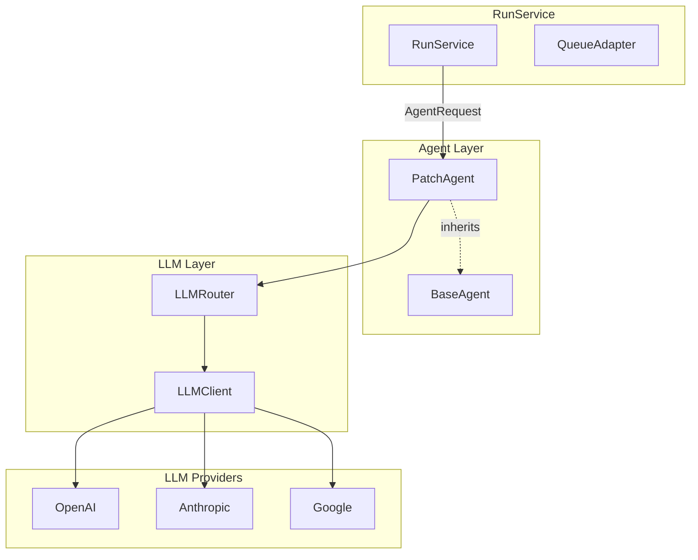
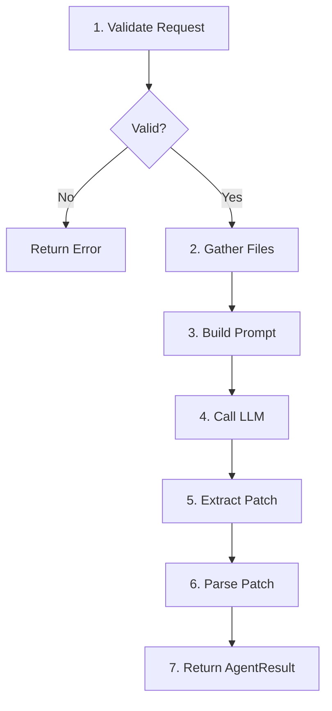
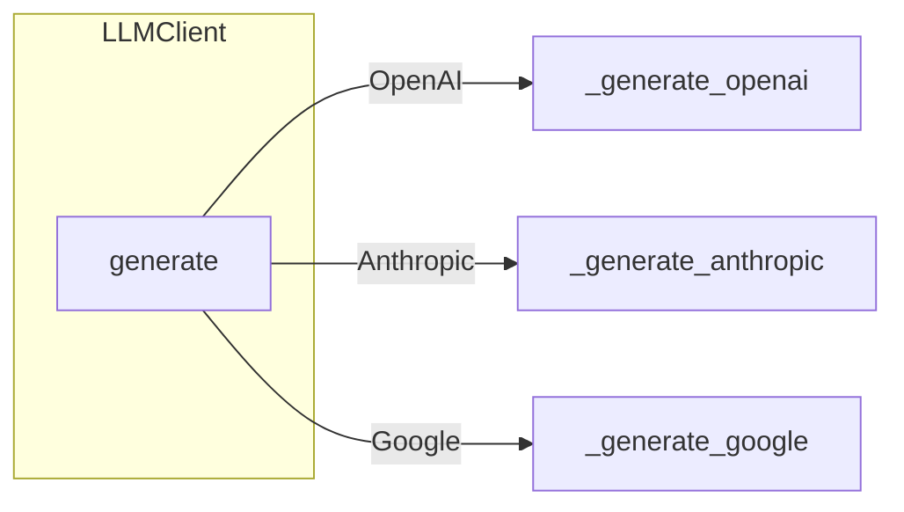
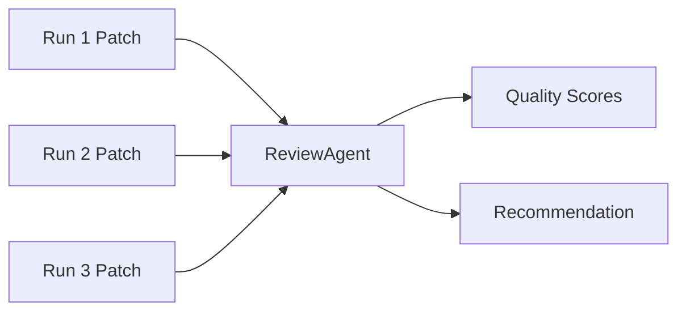

# Agent System

## Overview

dursor agents generate code changes (Unified diff) from natural language instructions.

## Architecture



## Agent Interface

### BaseAgent (Abstract Base Class)

```python
class BaseAgent(ABC):
    @abstractmethod
    async def run(self, request: AgentRequest) -> AgentResult:
        """Execute the agent"""
        pass

    def validate_request(self, request: AgentRequest) -> list[str]:
        """Validate the request"""
        pass
```

### AgentRequest (Input)

```python
class AgentRequest(BaseModel):
    workspace_path: str      # Working directory (cloned)
    base_ref: str           # Base branch/commit
    instruction: str        # Natural language instruction
    context: dict | None    # Additional context (optional)
    constraints: AgentConstraints  # Constraints

class AgentConstraints(BaseModel):
    max_files_changed: int | None  # Max files to change
    forbidden_paths: list[str]     # Forbidden path patterns (glob)
```

### AgentResult (Output)

```python
class AgentResult(BaseModel):
    summary: str              # Human-readable summary
    patch: str                # Unified diff (most important)
    files_changed: list[FileDiff]  # Changed files list
    logs: list[str]           # Operation logs
    warnings: list[str]       # Warnings

class FileDiff(BaseModel):
    path: str
    old_path: str | None      # For renames
    added_lines: int
    removed_lines: int
    patch: str                # This file's diff
```

## PatchAgent

### Processing Flow



### Detailed Steps

1. **Request Validation**
   - Check workspace_path exists
   - Verify instruction is not empty
   - Confirm base_ref exists

2. **File Collection**
   - Extract code files only (.py, .ts, .js, etc.)
   - Skip forbidden_paths
   - Size limits (100KB/file, 1MB total)
   - Maximum 100 files

3. **Prompt Construction**
   - System prompt (diff generation rules)
   - File contents
   - User instruction

4. **LLM Call**

5. **Patch Extraction**
   - Remove Markdown code blocks
   - Validate Unified diff format

6. **Patch Parsing**
   - Split by file
   - Count lines
   - Generate FileDiff list

7. **Return Result**

### System Prompt

```
You are a code editing assistant that generates unified diff patches.

Your task is to analyze the provided codebase and instruction,
then output ONLY a unified diff patch that implements the requested changes.

IMPORTANT RULES:
1. Output ONLY the unified diff patch - no explanations
2. Use standard unified diff format with --- and +++ headers
3. Each file change should be a separate diff hunk
4. Ensure the patch can be applied cleanly with `git apply`
5. Do not modify files in forbidden paths

Example output format:
--- a/src/file.py
+++ b/src/file.py
@@ -10,3 +10,4 @@
 def existing_function():
     pass
+
+def new_function():
+    return True
```

### File Collection Rules

```python
# Target extensions
code_extensions = {
    ".py", ".js", ".ts", ".tsx", ".jsx",
    ".java", ".go", ".rs", ".rb", ".php",
    ".c", ".cpp", ".h", ".hpp", ".cs",
    ".swift", ".kt", ".scala",
    ".vue", ".svelte", ".html", ".css",
    ".json", ".yaml", ".yml", ".toml",
    ".md", ".txt", ".sh", ".sql",
}

# Skip directories
skip_dirs = {
    "node_modules", "venv", ".venv",
    "__pycache__", "dist", "build", "target",
    ".git", ".svn", ".hg",
}

# Limits
MAX_FILES = 100
MAX_FILE_SIZE = 100_000  # 100KB
MAX_TOTAL_SIZE = 1_000_000  # 1MB
```

## LLMRouter

### Multi-Provider Support

```python
class LLMRouter:
    def get_client(self, config: LLMConfig) -> LLMClient:
        """Get client for config (cached)"""
        pass

class LLMClient:
    async def generate(
        self,
        messages: list[dict],
        system: str | None = None,
    ) -> str:
        """Call API based on provider"""
        pass
```

### Provider-Specific Implementations



#### OpenAI

```python
async def _generate_openai(self, messages, system):
    response = await self._openai_client.chat.completions.create(
        model=self.config.model_name,
        messages=[
            {"role": "system", "content": system},
            *messages,
        ],
        temperature=0.0,
        max_tokens=4096,
    )
    return response.choices[0].message.content
```

#### Anthropic

```python
async def _generate_anthropic(self, messages, system):
    response = await self._anthropic_client.messages.create(
        model=self.config.model_name,
        max_tokens=4096,
        system=system,
        messages=messages,
    )
    return "".join(block.text for block in response.content)
```

#### Google

```python
async def _generate_google(self, messages, system):
    # Via REST API (for async support)
    response = await client.post(
        f"https://generativelanguage.googleapis.com/v1beta/models/{model}:generateContent",
        json={
            "contents": contents,
            "systemInstruction": {"parts": [{"text": system}]},
        },
    )
    return response.json()["candidates"][0]["content"]["parts"][0]["text"]
```

## Adding New Agents

### 1. Inherit BaseAgent

```python
# apps/api/src/dursor_api/agents/new_agent.py

from dursor_api.agents.base import BaseAgent
from dursor_api.domain.models import AgentRequest, AgentResult

class NewAgent(BaseAgent):
    def __init__(self, llm_client: LLMClient):
        self.llm_client = llm_client

    async def run(self, request: AgentRequest) -> AgentResult:
        # Implementation
        pass
```

### 2. Use in RunService

```python
# apps/api/src/dursor_api/services/run_service.py

from dursor_api.agents.new_agent import NewAgent

# Inside _execute_run
agent = NewAgent(llm_client)  # or PatchAgent
result = await agent.run(request)
```

## Planned Extensions (v0.2)

### ReviewAgent (Comparison & Scoring)



```python
class ReviewAgent(BaseAgent):
    """Compare multiple runs and recommend the best one"""

    async def run(self, request: ReviewRequest) -> ReviewResult:
        # Compare patches from each Run
        # Assign quality scores
        # Generate recommendation reason
        pass
```

### CommandAgent (Command Execution)

```python
class CommandAgent(BaseAgent):
    """Execute commands in Docker sandbox"""

    async def run(self, request: CommandRequest) -> CommandResult:
        # Create Docker container
        # Execute command
        # Retrieve result
        pass
```

## Security Considerations

### Input Sanitization

```python
def validate_request(self, request: AgentRequest) -> list[str]:
    errors = []

    # Prevent path traversal
    if ".." in request.workspace_path:
        errors.append("Invalid workspace path")

    # Prevent huge inputs
    if len(request.instruction) > 10000:
        errors.append("Instruction too long")

    return errors
```

### Forbidden Paths

```python
def _is_forbidden(self, path: str, forbidden: list[str]) -> bool:
    for pattern in forbidden:
        if fnmatch.fnmatch(path, pattern):
            return True
        # Also check path components
        for part in Path(path).parts:
            if fnmatch.fnmatch(part, pattern):
                return True
    return False
```
