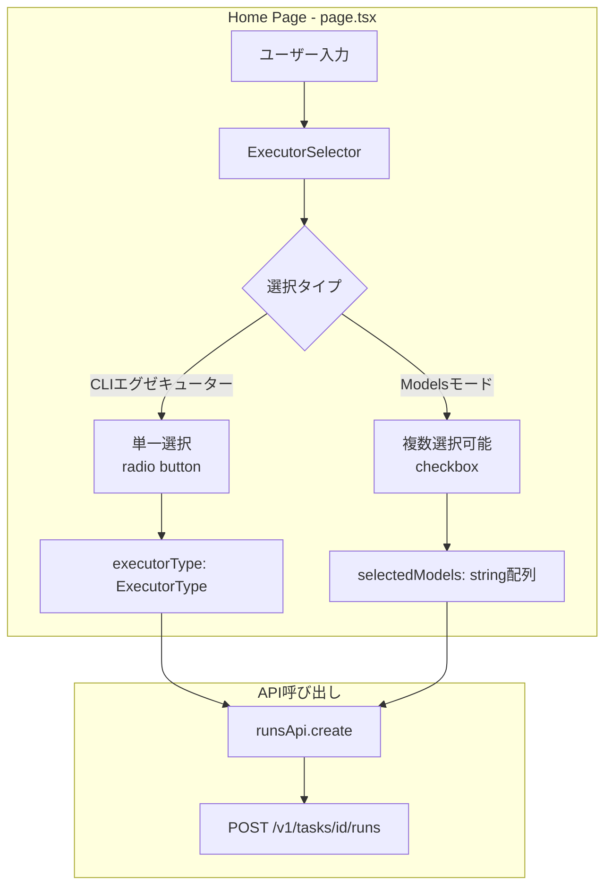
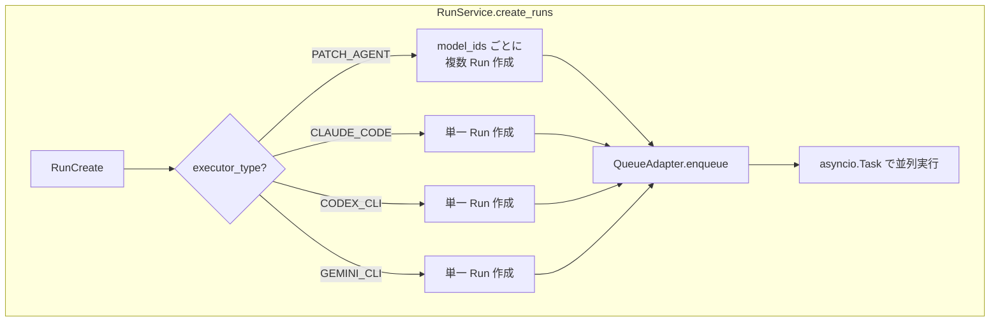
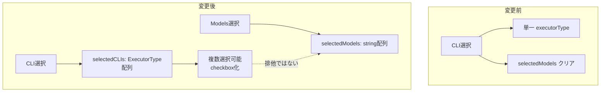
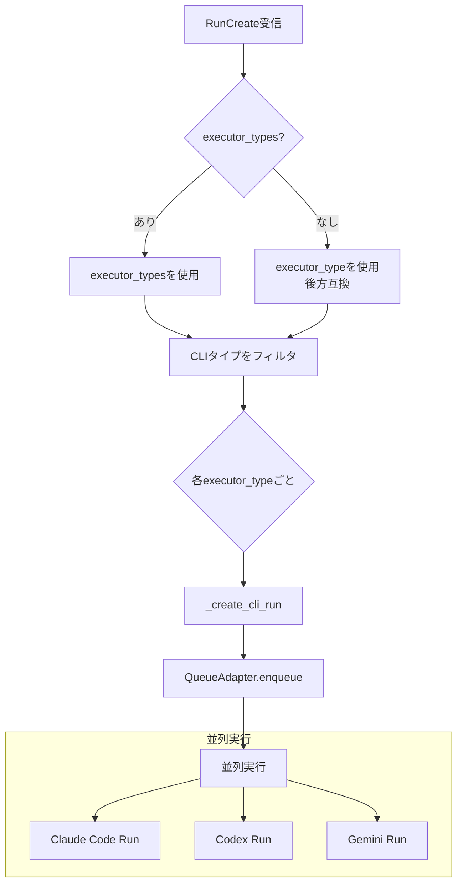
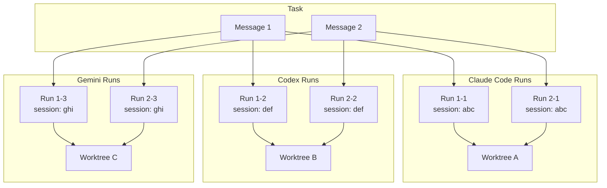
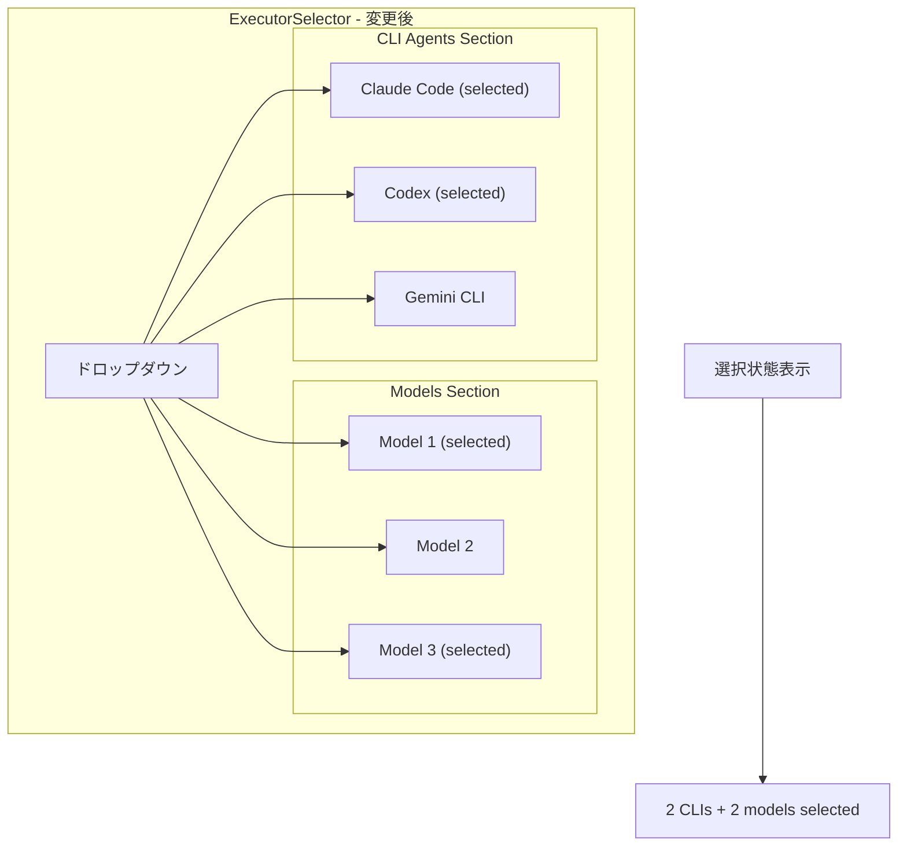
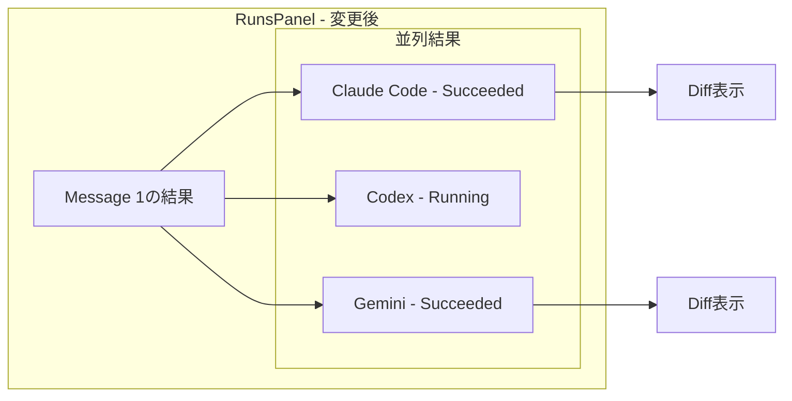

# Multi AI Coding Tool 並列実行機能 設計ドキュメント

## 概要

現在、tazuna のトップページで New Task を作成する際、AI Coding Tool（Claude Code, Codex, Gemini CLI）は1つしか選択できない。本機能では、複数の AI Coding Tool を同時に選択し、並列実行できるようにする。

### 期待される動作

1. ユーザーが複数の CLI エグゼキューターを選択可能
2. タスク開始時に、選択したすべての CLI エグゼキューターでランを並列実行
3. 各ランの結果を独立して表示・比較可能

---

## 現状分析

### フロントエンド構成



### バックエンド構成



### 現在の制限

| 項目 | 現状 | 課題 |
|------|------|------|
| CLI選択 | 単一選択（radio button） | 複数選択不可 |
| executor_type | 単一値 (`ExecutorType`) | 配列非対応 |
| Run作成 | CLIは1ランのみ | 複数CLI並列不可 |
| Executor Lock | 最初のRunのexecutor_typeで固定 | 複数executor混在不可 |

### 関連ファイル

| ファイル | 役割 |
|----------|------|
| `apps/web/src/components/ExecutorSelector.tsx` | エグゼキューター選択UI |
| `apps/web/src/app/page.tsx` | タスク作成ページ |
| `apps/web/src/types.ts` | TypeScript型定義 |
| `apps/api/src/tazuna_api/domain/models.py` | Pydanticモデル |
| `apps/api/src/tazuna_api/domain/enums.py` | Enum定義 |
| `apps/api/src/tazuna_api/services/run_service.py` | ラン作成・実行サービス |
| `apps/api/src/tazuna_api/routes/runs.py` | APIエンドポイント |

---

## 設計案

### アプローチ比較

| アプローチ | 概要 | メリット | デメリット |
|------------|------|----------|------------|
| **A: executor_types 配列** | RunCreate に `executor_types: list[ExecutorType]` を追加 | API1回で複数実行可能、一貫性あり | APIスキーマ変更、後方互換性 |
| **B: 複数API呼び出し** | フロントで選択CLI数だけAPIを呼ぶ | バックエンド変更最小 | フロントが複雑化、トランザクション問題 |
| **C: ハイブリッド** | 新API追加 `POST /v1/tasks/{id}/multi-runs` | 既存APIに影響なし | 2つのAPI管理が必要 |

### 推奨: アプローチA（executor_types 配列）

API の一貫性と将来の拡張性を考慮し、`executor_types` 配列を追加するアプローチを推奨。

---

## 詳細設計

### 1. データモデル変更

#### TypeScript (apps/web/src/types.ts)

```typescript
// Before
export interface RunCreate {
  instruction: string;
  model_ids?: string[];
  base_ref?: string;
  executor_type?: ExecutorType;  // 単一
  message_id?: string;
}

// After
export interface RunCreate {
  instruction: string;
  model_ids?: string[];
  base_ref?: string;
  executor_type?: ExecutorType;      // 後方互換性のため維持
  executor_types?: ExecutorType[];   // 新規追加: 複数CLI指定用
  message_id?: string;
}
```

#### Python (apps/api/src/tazuna_api/domain/models.py)

```python
# Before
class RunCreate(BaseModel):
    instruction: str
    model_ids: list[str] | None = None
    base_ref: str | None = None
    executor_type: ExecutorType = ExecutorType.PATCH_AGENT
    message_id: str | None = None

# After
class RunCreate(BaseModel):
    instruction: str
    model_ids: list[str] | None = None
    base_ref: str | None = None
    executor_type: ExecutorType = ExecutorType.PATCH_AGENT  # 後方互換
    executor_types: list[ExecutorType] | None = None  # 新規追加
    message_id: str | None = None
```

### 2. フロントエンド変更

#### ExecutorSelector.tsx の変更



#### 状態管理の変更

```typescript
// Before
const [executorType, setExecutorType] = useState<ExecutorType>('claude_code');

// After
const [selectedCLIs, setSelectedCLIs] = useState<ExecutorType[]>([]);
const [selectedModels, setSelectedModels] = useState<string[]>([]);

// 選択ロジック
const toggleCLI = (cli: ExecutorType) => {
  setSelectedCLIs(prev =>
    prev.includes(cli)
      ? prev.filter(c => c !== cli)
      : [...prev, cli]
  );
};
```

#### API呼び出しの変更

```typescript
// Before
if (isCLI) {
  await runsApi.create(task.id, {
    instruction: instruction,
    executor_type: executorType,
  });
}

// After
if (selectedCLIs.length > 0) {
  await runsApi.create(task.id, {
    instruction: instruction,
    executor_types: selectedCLIs,
  });
}
```

### 3. バックエンド変更

#### run_service.py の変更



#### create_runs メソッド変更概要

```python
async def create_runs(self, task_id: str, data: RunCreate) -> list[Run]:
    # executor_types が指定されていれば使用、なければ executor_type から変換
    executor_types = data.executor_types or [data.executor_type]

    runs = []

    # CLI エグゼキューターを抽出
    cli_executors = [e for e in executor_types if e != ExecutorType.PATCH_AGENT]

    # 各 CLI エグゼキューターに対して Run を作成
    for executor_type in cli_executors:
        run = await self._create_cli_run(
            task_id=task_id,
            repo=repo,
            instruction=data.instruction,
            base_ref=data.base_ref or repo.default_branch,
            executor_type=executor_type,
            message_id=data.message_id,
        )
        runs.append(run)

    # PATCH_AGENT が含まれる場合
    if ExecutorType.PATCH_AGENT in executor_types:
        # ... 既存の PATCH_AGENT 処理
        pass

    return runs
```

### 4. Executor Lock の扱い

現状、タスク内で最初に使われた executor_type にロックされる仕組みがある。複数 CLI 対応では以下の選択肢がある：

| 選択肢 | 説明 | 推奨 |
|--------|------|------|
| **A: ロック解除** | 各メッセージで自由に選択可能 | ❌ worktree/session 管理が複雑化 |
| **B: 初回選択セットでロック** | 最初に選んだ CLI セットを維持 | ⭕ シンプル、セッション継続可能 |
| **C: CLI ごとに独立管理** | 各 CLI が独立した worktree を持つ | ⭕ 柔軟性高い |

#### 推奨: 選択肢 C（CLI ごとに独立管理）

各 CLI が独立した worktree とセッションを持つ設計。これにより：
- 各 CLI が独自の変更履歴を持つ
- セッションの継続が可能
- 後から追加の CLI を選択することも可能



### 5. UI コンポーネント設計

#### 変更後の ExecutorSelector



#### Props インターフェース変更

```typescript
// Before
interface ExecutorSelectorProps {
  executorType: ExecutorType;
  selectedModels: string[];
  models: ModelProfile[];
  onExecutorChange: (executor: ExecutorType) => void;
  onModelToggle: (modelId: string) => void;
  onModelsChange: (modelIds: string[]) => void;
}

// After
interface ExecutorSelectorProps {
  selectedCLIs: ExecutorType[];       // 選択された CLI リスト
  selectedModels: string[];
  models: ModelProfile[];
  onCLIToggle: (cli: ExecutorType) => void;  // CLI トグル
  onCLIsChange: (clis: ExecutorType[]) => void;
  onModelToggle: (modelId: string) => void;
  onModelsChange: (modelIds: string[]) => void;
}
```

### 6. 結果表示の変更

複数 CLI の結果を比較表示できるよう、RunsPanel を拡張。



---

## 実装順序

### Phase 1: バックエンド対応

1. **models.py 変更**: `executor_types` フィールド追加
2. **run_service.py 変更**: 複数 CLI ラン作成ロジック
3. **routes/runs.py**: バリデーション調整
4. **テスト追加**: 複数 CLI 作成のユニットテスト

### Phase 2: フロントエンド対応

1. **types.ts 変更**: `RunCreate` 型更新
2. **ExecutorSelector.tsx 変更**: 複数選択 UI
3. **page.tsx 変更**: 状態管理と API 呼び出し
4. **ChatCodeView.tsx 変更**: 複数 CLI の継続対応

### Phase 3: 結果表示改善

1. **RunsPanel.tsx 変更**: 並列結果の表示
2. **比較ビュー**: 複数 CLI の差分比較機能（オプション）

---

## テスト計画

### バックエンド

| テスト項目 | 説明 |
|------------|------|
| 複数 CLI 作成 | executor_types に複数 CLI を指定して複数 Run が作成される |
| 後方互換性 | executor_type 単一指定でも動作する |
| 並列実行 | 各 Run が並列で実行される |
| worktree 独立 | 各 CLI が独立した worktree を持つ |

### フロントエンド

| テスト項目 | 説明 |
|------------|------|
| 複数 CLI 選択 | 複数の CLI をチェックボックスで選択可能 |
| 混在選択 | CLI と Models を同時に選択可能 |
| バリデーション | 何も選択していない場合は送信不可 |
| 結果表示 | 複数 Run の結果が正しく表示される |

---

## リスクと対策

| リスク | 影響 | 対策 |
|--------|------|------|
| worktree 増加 | ディスク使用量増加 | クリーンアップ機能の実装 |
| 並列実行負荷 | サーバーリソース圧迫 | 同時実行数の制限 |
| セッション管理複雑化 | バグ発生リスク | 各 executor ごとに独立管理 |
| UI 複雑化 | ユーザビリティ低下 | シンプルなデフォルト設定 |

---

## 参考：現在のコード構造

### ExecutorSelector.tsx 現在の CLI 選択処理

```typescript
// 現在は単一選択（radio button 風）
const handleCLISelect = useCallback(
  (type: ExecutorType) => {
    onExecutorChange(type);
    onModelsChange([]);  // Models をクリア
    setShowDropdown(false);
  },
  [onExecutorChange, onModelsChange]
);
```

### run_service.py 現在の CLI 作成処理

```python
if data.executor_type == ExecutorType.CLAUDE_CODE:
    run = await self._create_cli_run(
        task_id=task_id,
        repo=repo,
        instruction=data.instruction,
        base_ref=data.base_ref or repo.default_branch,
        executor_type=ExecutorType.CLAUDE_CODE,
        message_id=data.message_id,
    )
    runs.append(run)
# Codex, Gemini も同様の構造
```

---

## 結論

本機能により、ユーザーは複数の AI Coding Tool を同時に使用し、各ツールの出力を比較検討できるようになる。実装は Phase 1（バックエンド）→ Phase 2（フロントエンド）→ Phase 3（UI改善）の順で進め、後方互換性を維持しながら段階的に機能を追加する。
