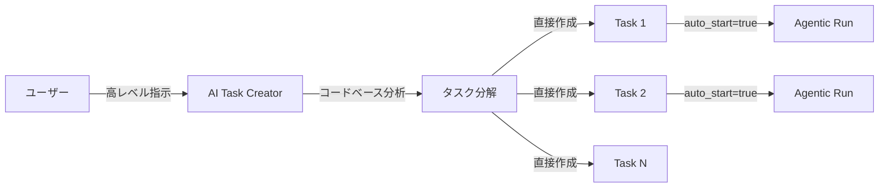

# AI タスク作成機能 設計ドキュメント

## 概要

AIが自律的にタスク（スレッド）を作成できる機能を追加する。既存の Breakdown（ヒアリング → Backlog → Task）とは異なり、AIが指示を分析してタスクを直接作成し、オプションでエージェント実行を自動開始できる。

## 既存機能との違い

| 機能 | 入力 | 出力 | 自動実行 |
|------|------|------|----------|
| **Manual Task** | ユーザーが手動入力 | 1 Task | ユーザーが開始 |
| **Breakdown** | ヒアリング文章 | BacklogItem（要人間レビュー） | なし |
| **AI Task Create（新規）** | 高レベル指示 | Task（直接作成） | 自動開始可能 |

## ユースケース



### ユースケース 1: プロジェクト機能追加
```
指示: 「認証機能を追加してほしい。ログイン・ログアウト・パスワードリセットが必要」
→ AI がコードベースを分析
→ Task 1: ログイン機能の実装
→ Task 2: ログアウト機能の実装
→ Task 3: パスワードリセット機能の実装
→ 各タスクに適切な instruction を設定
→ auto_start=true の場合、即座に並列実行開始
```

### ユースケース 2: フォローアップタスク
```
Agentic 実行完了後:
→ AI が「関連するテスト追加が必要」と判断
→ フォローアップ Task を自動作成
```

---

## API 設計

### `POST /v1/tasks/ai-create`

AI がコードベースを分析してタスクを作成する。バックグラウンドで実行し、ポーリングで結果を取得する。

**Request:**
```json
{
  "repo_id": "repo-id",
  "instruction": "認証機能を追加してほしい。ログイン・ログアウト・パスワードリセットが必要",
  "executor_type": "claude_code",
  "coding_mode": "semi_auto",
  "auto_start": false,
  "context": {
    "language": "ja"
  }
}
```

**Response (initial - RUNNING):**
```json
{
  "session_id": "session-123",
  "status": "running",
  "created_tasks": [],
  "summary": null,
  "error": null
}
```

### `GET /v1/tasks/ai-create/{session_id}`

セッションの結果を取得する。

**Response (completed):**
```json
{
  "session_id": "session-123",
  "status": "succeeded",
  "created_tasks": [
    {
      "id": "task-1",
      "title": "ログイン機能の実装",
      "instruction": "JWT認証を使用したログイン機能を実装する...",
      "coding_mode": "semi_auto",
      "auto_started": true
    }
  ],
  "summary": "コードベースを分析し、3つのタスクを作成しました",
  "codebase_analysis": {
    "files_analyzed": 45,
    "relevant_modules": ["auth", "api"],
    "tech_stack": ["FastAPI", "SQLite"]
  },
  "error": null
}
```

### `GET /v1/tasks/ai-create/{session_id}/logs`

ログをストリーミング取得（既存パターンと同様）。

**Response:**
```json
{
  "logs": [
    { "line_number": 1, "content": "Analyzing codebase...", "timestamp": 1234567890 }
  ],
  "is_complete": false,
  "total_lines": 1
}
```

---

## バックエンド実装

### ドメインモデル

```python
class AITaskCreateRequest(BaseModel):
    repo_id: str
    instruction: str
    executor_type: ExecutorType = ExecutorType.CLAUDE_CODE
    coding_mode: CodingMode = CodingMode.SEMI_AUTO
    auto_start: bool = False
    context: dict[str, Any] | None = None

class AICreatedTask(BaseModel):
    id: str
    title: str
    instruction: str
    coding_mode: CodingMode
    auto_started: bool

class AITaskCreateResponse(BaseModel):
    session_id: str
    status: BreakdownStatus  # reuse: pending/running/succeeded/failed
    created_tasks: list[AICreatedTask]
    summary: str | None = None
    codebase_analysis: CodebaseAnalysis | None = None
    error: str | None = None
```

### サービス: `AITaskCreatorService`

```
apps/api/src/zloth_api/services/ai_task_creator.py
```

**責務:**
1. CLI Executor を使ってコードベースを分析
2. 分析結果から Task オブジェクトを直接作成
3. `auto_start=true` の場合、Agentic 実行を開始

**BreakdownService との違い:**
- Breakdown: BacklogItem を作成（人間がレビュー → Task に昇格）
- AI Task Creator: Task を直接作成し、オプションで自動実行

### プロンプト設計

```
あなたはソフトウェア開発のタスク設計の専門家です。
以下の指示を分析し、コードベースを確認した上で、
独立して実行可能な開発タスクに分解してください。

## 指示
{instruction}

## 出力形式
`.zloth-ai-tasks.json` に以下の形式で出力:
{
  "codebase_analysis": { ... },
  "tasks": [
    {
      "title": "タスクのタイトル（50文字以内）",
      "instruction": "AIコーディングエージェントへの具体的な指示",
      "estimated_size": "small | medium | large"
    }
  ]
}

## ルール
1. 必ずコードを読んでからタスクを作成
2. 各タスクは1つのPRで完結する粒度
3. instruction は具体的に（ファイル名、関数名を含む）
4. 依存関係がある場合は instruction に記載
```

### ルート: `routes/ai_tasks.py`

```
POST /v1/tasks/ai-create       → start
GET  /v1/tasks/ai-create/{id}  → get result
GET  /v1/tasks/ai-create/{id}/logs → get logs
```

---

## フロントエンド実装

### TypeScript 型定義

```typescript
export interface AITaskCreateRequest {
  repo_id: string;
  instruction: string;
  executor_type: ExecutorType;
  coding_mode: CodingMode;
  auto_start: boolean;
  context?: Record<string, unknown>;
}

export interface AICreatedTask {
  id: string;
  title: string;
  instruction: string;
  coding_mode: CodingMode;
  auto_started: boolean;
}

export interface AITaskCreateResponse {
  session_id: string;
  status: BreakdownStatus;
  created_tasks: AICreatedTask[];
  summary: string | null;
  codebase_analysis: CodebaseAnalysis | null;
  error: string | null;
}
```

### API クライアント

```typescript
export const aiTasksApi = {
  create: (data: AITaskCreateRequest) =>
    fetchApi<AITaskCreateResponse>('/tasks/ai-create', {
      method: 'POST',
      body: JSON.stringify(data),
    }),

  getResult: (sessionId: string) =>
    fetchApi<AITaskCreateResponse>(`/tasks/ai-create/${sessionId}`),

  getLogs: (sessionId: string, fromLine: number = 0) =>
    fetchApi<BreakdownLogsResponse>(
      `/tasks/ai-create/${sessionId}/logs?from_line=${fromLine}`
    ),
};
```

### UI: ホームページに統合

既存のホームページの入力エリアに「AI Create Tasks」モードを追加:

```
┌───────────────────────────────────────────┐
│  [Single Task] | [AI Create Tasks]        │  ← タブ切り替え
├───────────────────────────────────────────┤
│  ┌─────────────────────────────────────┐  │
│  │ 認証機能を追加してほしい。          │  │
│  │ ログイン・ログアウト・パスワード    │  │
│  │ リセットが必要                      │  │
│  └─────────────────────────────────────┘  │
│                                           │
│  ☐ Auto-start execution                  │
│                                           │
│  [AI Create Tasks]                        │
└───────────────────────────────────────────┘
```

結果表示:
```
┌───────────────────────────────────────────┐
│  ✅ 3 tasks created                       │
│                                           │
│  📋 ログイン機能の実装           [View →]  │
│  📋 ログアウト機能の実装         [View →]  │
│  📋 パスワードリセット機能の実装 [View →]  │
│                                           │
│  [Done]                                   │
└───────────────────────────────────────────┘
```

---

## 実装順序

### Phase 1: バックエンド
1. ドメインモデル追加（`domain/models.py`）
2. `AITaskCreatorService` 実装
3. `routes/ai_tasks.py` 実装
4. DI 設定（`dependencies.py`）
5. ルーター登録（`main.py`, `routes/__init__.py`）
6. テスト追加

### Phase 2: フロントエンド
7. 型定義追加（`types.ts`）
8. API クライアント追加（`lib/api.ts`）
9. ホームページにタブ UI 追加
10. 結果表示コンポーネント

---

## テスト計画

### ユニットテスト

1. **AITaskCreatorService**
   - `start()`: セッションが作成され RUNNING ステータスが返ること
   - `get_result()`: 完了後に正しいレスポンスが返ること
   - JSON パースのエッジケース（不完全な JSON、空タスクリスト等）
   - Executor 選択のバリデーション（patch_agent は拒否）
   - Repository が見つからない場合のエラーハンドリング

2. **ルートテスト**
   - `POST /v1/tasks/ai-create`: リクエストバリデーション、正常レスポンス
   - `GET /v1/tasks/ai-create/{id}`: 存在しないセッション → 404
   - `GET /v1/tasks/ai-create/{id}/logs`: ログ取得

3. **統合テスト**
   - Task が実際に DB に作成されること
   - `auto_start=true` の場合に Agentic 実行が開始されること

### 手動テスト
- Claude Code CLI で実際にタスク作成を実行
- フロントエンドからの E2E フロー確認

---

## セキュリティ考慮事項

- 入力 instruction のサイズ制限（過大な入力を防止）
- AI が作成するタスク数の上限設定（デフォルト: 10）
- Forbidden paths チェックは既存の Executor が担保
- API キーは既存の暗号化メカニズムを使用
