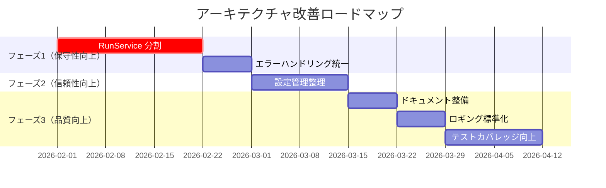

# アーキテクチャレビュー: 問題点と改善提案

このドキュメントは、`docs/architecture.md` および実装コードの分析に基づいて、現状のアーキテクチャの問題点を洗い出し、改善点を優先度付きで提示します。

## 前提条件

- **ローカルホスト運用**: 単一マシンでの実行を想定
- **シングルユーザー**: 認証・認可は現時点で不要
- **セルフホスト**: ユーザーが自身の環境で運用

## 分析対象

- `docs/architecture.md` - アーキテクチャ設計書
- `apps/api/src/zloth_api/` - バックエンド実装

---

## 問題点一覧

### 🔴 高優先度（Critical）

#### 1. サービス層の肥大化（God Class 問題）

**現状**: `RunService` が 1360行以上

```
run_service.py: 1360+ lines
- create_runs
- _create_cli_run
- _execute_cli_run
- _execute_patch_agent_run
- ワークスペース管理
- Git操作
- コミットメッセージ生成
- 差分解析
...
```

**問題点**:
- 単一責任原則（SRP）違反
- テストが困難
- 変更の影響範囲が広い
- 依存関係が複雑（13以上のコンストラクタ引数）

**改善案**:
1. **責務の分離**:
   - `RunExecutionService` - 実行ロジック
   - `WorkspaceManager` - ワークスペース管理
   - `DiffParser` - 差分解析
   - `CommitService` - コミット・プッシュ
2. **Facade パターン**の導入

**調査結果（2026-02）**:
- `RunService` 内の責務は「ワークスペース管理」「実行フロー」「コミット/プッシュ」「ログ/出力管理」など多岐に渡り、テスト分割が困難。
- まず切り出しやすい **ワークスペース管理** を独立サービス化することで、依存関係の整理と単体テスト化を優先するのが適切。

**対応計画**:
1. ワークスペース管理を `RunWorkspaceManager` に分離（既存ロジックの委譲）。
2. 実行フローを `RunExecutionService` に分離（CLI 実行、commit/push、diff/summary 生成）。
3. `RunService` は Facade として依存解決とオーケストレーションに集中。

**対応状況（完了）**:
- `RunWorkspaceManager` を新設し、ワークスペース再利用/作成/クリーンアップ処理を集約。
- `RunService` からワークスペース関連の処理を委譲し、責務の分離を開始。

---

### 🟡 中優先度（Important）

#### 2. エラーハンドリングの非一貫性

**現状**: カスタム例外階層は定義済み（`errors.py`）だが、一貫して使用されていない

```python
# errors.py - 定義済みの例外階層
class ZlothError(Exception): ...
class NotFoundError(ZlothError): ...     # 404
class ValidationError(ZlothError): ...   # 400
class ForbiddenError(ZlothError): ...    # 403
class ExternalServiceError(ZlothError): ... # 502
```

**問題箇所**:

| ファイル | 行番号 | 問題 |
|---------|--------|------|
| `services/pr_service.py` | 304, 308, 313 | `ValueError`を使用（`NotFoundError`にすべき） |
| `services/pr_service.py` | 1053-1082 | 同上 |
| `services/pr_service.py` | 191 | `RuntimeError`を使用（`ExternalServiceError`にすべき） |
| `services/repo_service.py` | 44 | 標準`PermissionError`を使用（`ForbiddenError`にすべき） |
| `services/worktree_service.py` | 46 | 同上 |
| `routes/models.py` | 52 | 手動で`HTTPException`変換（カスタム例外を伝播させるべき） |
| `routes/repos.py` | 21 | `Exception`の広範なキャッチ |

**問題点**:
- API呼び出し元でのエラーハンドリングが困難
- 一貫した HTTP ステータスコード返却が難しい
- `error_handling.py`のグローバルハンドラーが活用されていない

**改善案**:
1. 上記箇所を適切なカスタム例外に置き換え
2. ルートハンドラーでの手動try-catchを削除し、グローバルハンドラーに委譲

---

#### 3. 設定管理の二重化

**現状**: 環境変数（`config.py`）とDB（`user_preferences`テーブル）の二重管理

**環境変数で管理（`config.py`）**:
- インフラ設定: `host`, `port`, `debug`, `database_url`
- セキュリティ: `encryption_key`, GitHub App認証情報
- Agentic設定: `agentic_enabled`, `agentic_max_*_iterations`
- 通知設定: `notify_on_ready`, `notify_on_complete`, etc.
- マージ設定: `merge_method`, `merge_delete_branch`

**DBで管理（`user_preferences`テーブル）**:
- `default_repo_owner`, `default_repo_name`, `default_branch`
- `default_pr_creation_mode`, `default_coding_mode`
- `auto_generate_pr_description`, `enable_gating_status`

**問題箇所**:

| 設定 | 現在の場所 | あるべき場所 | 理由 |
|------|-----------|-------------|------|
| `notify_on_*` | 環境変数 | DB | ユーザーがUIから変更したい |
| `merge_method` | 環境変数 | DB | プロジェクトごとに変更したい |
| `review_min_score` | 環境変数 | DB | ワークフローに応じて変更したい |

**問題点**:
- どちらが優先されるか暗黙的（明文化されていない）
- 通知・マージ設定など、ユーザー設定にすべきものが環境変数にある
- 統一された設定アクセス層がない
- フロントエンド（`SettingsModal.tsx`）ではDB設定の一部しか公開されていない

**改善案**:
1. **設定の優先順位を明文化**:
   - 環境変数 > DB設定 > デフォルト値
2. 設定の種類を分類:
   - システム設定（インフラ/セキュリティ） → 環境変数のみ
   - ユーザー設定（ワークフロー/通知） → DBのみ
3. 統一された設定アクセス層（`SettingsService`）の導入

---

### 🟢 低優先度（Nice to Have）

#### 4. ドキュメントと実装の乖離

**現状**: `CLAUDE.md` と `architecture.md` で内容が異なる

| 項目 | CLAUDE.md | architecture.md |
|------|-----------|-----------------|
| ロードマップ | Review/Meta agent: 未完了 | Review統合: 完了 ✓ |
| ディレクトリ構造 | 古い構造（executors/, roles/ 未記載） | 新しい構造 |
| サービス一覧 | 基本的なもののみ | 詳細リスト |

**改善案**:
1. `CLAUDE.md` を Single Source of Truth (SSOT) として統一
2. `architecture.md` は詳細設計ドキュメントとして位置づけ

---

#### 5. ロギングの標準化不足

**現状**:
```python
# 異なるフォーマット
logger.info(f"[{run.id[:8]}] Starting run")
logger.warning(f"Push failed: {error}")
await self._log_output(run_id, "Starting execution...")
```

**改善案**:
1. 構造化ロギング（JSON形式）の導入
2. トレース ID の一貫した付与
3. ログレベルガイドラインの策定

---

#### 6. テストカバレッジの可視性

**現状**: テストカバレッジが不明

**改善案**:
1. `pytest-cov` による カバレッジ計測
2. CI での最低カバレッジ閾値設定（例: 80%）
3. カバレッジレポートの PR コメント自動投稿

---

## 改善ロードマップ（推奨順序）



---

## 優先度サマリー

| 優先度 | # | 問題 | 影響 | 工数見積 | 対応状況 |
|--------|---|------|------|----------|----------|
| 🔴 高 | 1 | RunService肥大化 | 保守性・テスト困難 | 中 | ✅ ワークスペース管理の切り出し完了 |
| 🟡 中 | 2 | エラーハンドリング非一貫性 | 信頼性 | 小 | 未対応 |
| 🟡 中 | 3 | 設定管理二重化 | 運用性 | 小 | 未対応 |
| 🟢 低 | 4 | ドキュメント乖離 | 開発効率 | 小 | 未対応 |
| 🟢 低 | 5 | ロギング標準化 | 運用性 | 小 | 未対応 |
| 🟢 低 | 6 | テストカバレッジ | 品質 | 中 | 未対応 |

---

## 付録: アーキテクチャ品質属性評価

| 品質属性 | 現状スコア | 目標スコア | 備考 |
|----------|------------|------------|------|
| **可用性** | ⭐⭐⭐⭐ | ⭐⭐⭐⭐ | SQLiteバックドジョブキューで改善済み |
| **保守性** | ⭐⭐ | ⭐⭐⭐⭐ | リファクタリングで改善 |
| **拡張性** | ⭐⭐⭐⭐ | ⭐⭐⭐⭐ | プラグイン構造は良好 |
| **テスト容易性** | ⭐⭐ | ⭐⭐⭐⭐ | DI改善・責務分離で対応 |
| **シンプルさ** | ⭐⭐⭐⭐ | ⭐⭐⭐⭐ | Clone モード統一で改善済み |

---

## 将来検討事項（マルチユーザー対応時）

以下はシングルユーザー前提では不要だが、将来的に検討が必要な項目:

- **認証・認可**: JWT/OAuth2.0, RBAC
- **データベース移行**: PostgreSQL への移行
- **分散キュー**: Redis + Celery
- **水平スケーリング**: 複数サーバー対応
