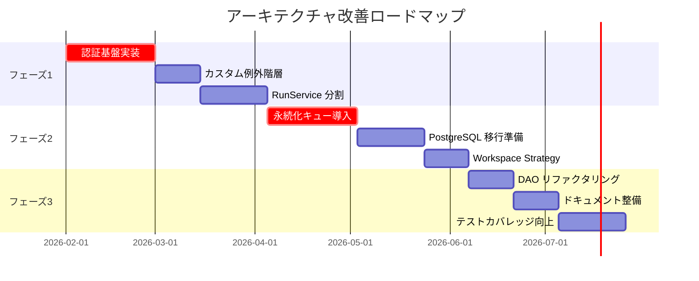

# アーキテクチャレビュー: 問題点と改善提案

このドキュメントは、`docs/architecture.md` および実装コードの分析に基づいて、現状のアーキテクチャの問題点を洗い出し、改善点を優先度付きで提示します。

## 分析対象

- `docs/architecture.md` - アーキテクチャ設計書
- `apps/api/src/zloth_api/` - バックエンド実装

---

## 問題点一覧

### 🔴 高優先度（Critical）

#### 1. インメモリキューによるデータロスリスク

**現状**:
```python
# roles/base_service.py, run_service.py
class RoleQueueAdapter:
    def __init__(self):
        self._tasks: dict[str, asyncio.Task[None]] = {}
        self._semaphore = asyncio.Semaphore(self._max_concurrent)
```

**問題点**:
- サーバー再起動時にキューの内容が完全に失われる
- 実行中のタスクが中断され、`RUNNING` 状態のまま放置される可能性
- 水平スケーリングが不可能（複数サーバー間でキュー共有不可）
- 障害復旧手段がない

**影響範囲**: Run, Review, Breakdown の全ての非同期実行

**改善案**:
1. **短期**: タスク開始前にステータスをDBに保存し、再起動時に復旧可能にする
2. **中期**: Redis + Celery または PostgreSQL の `pg_notify` による永続化キュー
3. **長期**: Kubernetes Job や AWS SQS などのマネージドサービス活用

---

#### 2. データベースのスケーラビリティ限界

**現状**: SQLite シングルファイル構成

**問題点**:
- 書き込みロックが発生し、並列実行時にボトルネック化
- データ量増加時のパフォーマンス劣化
- バックアップ・レプリケーションが困難
- 接続プーリングの制限

**改善案**:
1. **短期**: WAL モードの有効化、適切なインデックス追加
2. **中期**: PostgreSQL への移行（ロードマップ v0.3 に記載済み）
3. 移行用のマイグレーションツール準備

---

#### 3. 認証・認可機能の欠如

**現状**: 認証なしでAPIが公開されている

```python
# routes/runs.py - 認証なし
@router.post("/tasks/{task_id}/runs")
async def create_runs(...) -> RunsCreated:
```

**問題点**:
- APIキーが暗号化されていても、APIエンドポイント自体が無防備
- マルチユーザー環境で他者のタスク・データにアクセス可能
- 監査ログが不十分

**改善案**:
1. **短期**: API キーまたは JWT による基本認証
2. **中期**: OAuth 2.0 / OIDC 対応
3. **長期**: RBAC (Role-Based Access Control) 実装

---

#### 4. サービス層の肥大化（God Class 問題）

**現状**: `RunService` が 1360行以上

```
run_service.py: 1360+ lines
- create_runs
- _create_cli_run
- _execute_cli_run
- _execute_patch_agent_run
- ワークスペース管理
- Git操作
- コミットメッセージ生成
- 差分解析
...
```

**問題点**:
- 単一責任原則（SRP）違反
- テストが困難
- 変更の影響範囲が広い
- 依存関係が複雑（13以上のコンストラクタ引数）

**改善案**:
1. **責務の分離**:
   - `RunExecutionService` - 実行ロジック
   - `WorkspaceManager` - ワークスペース管理
   - `DiffParser` - 差分解析
   - `CommitService` - コミット・プッシュ
2. **Facade パターン**の導入

---

### 🟡 中優先度（Important）

#### 5. ワークスペース分離モードの複雑性

**現状**: Clone モードと Worktree モードの両方をサポート

```python
if self.use_clone_isolation:
    workspace_info = await self.workspace_service.create_workspace(...)
else:
    workspace_info = await self.git_service.create_worktree(...)
```

**問題点**:
- コード内に多数の条件分岐が散在
- テストケースが倍増
- バグが入りやすい
- ドキュメントとの整合性維持が困難

**改善案**:
1. **Strategy パターン**の適用
```python
class WorkspaceStrategy(Protocol):
    async def create(self, ...) -> WorkspaceInfo: ...
    async def cleanup(self, ...) -> None: ...

class CloneStrategy(WorkspaceStrategy): ...
class WorktreeStrategy(WorkspaceStrategy): ...
```
2. モード選択を起動時に固定し、実行時の分岐を排除

---

#### 6. DAO層の重複コード

**現状**: 各DAOに類似した `_row_to_model` メソッドが存在

```python
# 各DAOに同様のパターン
def _row_to_model(self, row: Any) -> Model:
    return Model(
        id=row["id"],
        field1=row["field1"],
        ...
    )
```

**問題点**:
- DRY原則違反
- SQLiteの `row` 型に依存した脆弱なコード
- 新規フィールド追加時の修正漏れリスク

**改善案**:
1. **Generic DAO パターン**の導入
2. Pydantic の `model_validate` を活用
3. ORM (SQLAlchemy + async) の検討

---

#### 7. エラーハンドリングの非一貫性

**現状**: 例外処理パターンが統一されていない

```python
# パターン1: ValueError
if not task:
    raise ValueError(f"Task not found: {task_id}")

# パターン2: None返却
async def get(self, id: str) -> Run | None:
    ...
    return None

# パターン3: ログのみ
except Exception as e:
    logger.warning(f"Failed: {e}")
```

**問題点**:
- API呼び出し元でのエラーハンドリングが困難
- 一貫した HTTP ステータスコード返却が難しい
- エラーメッセージの国際化対応が困難

**改善案**:
1. **カスタム例外階層**の定義
```python
class ZlothError(Exception): ...
class NotFoundError(ZlothError): ...
class ValidationError(ZlothError): ...
class ExecutionError(ZlothError): ...
```
2. FastAPI の例外ハンドラーで統一処理

---

#### 8. 設定管理の二重化

**現状**: 環境変数とDBの両方で設定を管理

```python
# config.py - 環境変数
settings.worktrees_dir

# user_preferences テーブル - DB
prefs.worktrees_dir
```

**問題点**:
- どちらが優先されるか不明瞭
- 設定変更のための再起動要否が不明
- テスト時のモック化が複雑

**改善案**:
1. **設定の優先順位を明文化**:
   - 環境変数 > DB設定 > デフォルト値
2. 設定の種類を分類:
   - システム設定 → 環境変数のみ
   - ユーザー設定 → DBのみ

---

### 🟢 低優先度（Nice to Have）

#### 9. ドキュメントと実装の乖離

**現状**: `CLAUDE.md` と `architecture.md` で内容が異なる

| 項目 | CLAUDE.md | architecture.md |
|------|-----------|-----------------|
| ロードマップ | Review/Meta agent: 未完了 | Review統合: 完了 ✓ |
| ディレクトリ構造 | 古い構造（executors/, roles/ 未記載） | 新しい構造 |
| サービス一覧 | 基本的なもののみ | 詳細リスト |

**改善案**:
1. `CLAUDE.md` を Single Source of Truth (SSOT) として統一
2. `architecture.md` は詳細設計ドキュメントとして位置づけ
3. CI で自動整合性チェック

---

#### 10. ロギングの標準化不足

**現状**:
```python
# 異なるフォーマット
logger.info(f"[{run.id[:8]}] Starting run")
logger.warning(f"Push failed: {error}")
await self._log_output(run_id, "Starting execution...")
```

**改善案**:
1. 構造化ロギング（JSON形式）の導入
2. トレース ID の一貫した付与
3. ログレベルガイドラインの策定

---

#### 11. テストカバレッジの可視性

**現状**: テストカバレッジが不明

**改善案**:
1. `pytest-cov` による カバレッジ計測
2. CI での最低カバレッジ閾値設定（例: 80%）
3. カバレッジレポートの PR コメント自動投稿

---

## 改善ロードマップ（推奨順序）



---

## 優先度サマリー

| 優先度 | 問題 | 影響 | 工数見積 |
|--------|------|------|----------|
| 🔴 高 | インメモリキュー | データロス | 中 |
| 🔴 高 | SQLiteスケーラビリティ | パフォーマンス | 大 |
| 🔴 高 | 認証・認可欠如 | セキュリティ | 中 |
| 🔴 高 | RunService肥大化 | 保守性 | 中 |
| 🟡 中 | ワークスペース複雑性 | 保守性 | 小 |
| 🟡 中 | DAO重複コード | 保守性 | 小 |
| 🟡 中 | エラーハンドリング | 信頼性 | 小 |
| 🟡 中 | 設定管理二重化 | 運用性 | 小 |
| 🟢 低 | ドキュメント乖離 | 開発効率 | 小 |
| 🟢 低 | ロギング標準化 | 運用性 | 小 |
| 🟢 低 | テストカバレッジ | 品質 | 中 |

---

## 付録: アーキテクチャ品質属性評価

| 品質属性 | 現状スコア | 目標スコア | 備考 |
|----------|------------|------------|------|
| **可用性** | ⭐⭐ | ⭐⭐⭐⭐ | キュー永続化で改善可 |
| **スケーラビリティ** | ⭐⭐ | ⭐⭐⭐⭐ | DB/キュー改善で対応 |
| **セキュリティ** | ⭐ | ⭐⭐⭐⭐ | 認証実装が必須 |
| **保守性** | ⭐⭐⭐ | ⭐⭐⭐⭐ | リファクタリングで改善 |
| **拡張性** | ⭐⭐⭐⭐ | ⭐⭐⭐⭐ | プラグイン構造は良好 |
| **テスト容易性** | ⭐⭐ | ⭐⭐⭐⭐ | DI改善で対応 |
