# アーキテクチャ v2: UI-API-Queue-Worker パターン

## 概要

本ドキュメントでは、zloth のスケーラブルなアーキテクチャとして **UI → API → Queue → Worker** パターンを定義する。このパターンにより、コンポーネント間の疎結合、水平スケーリング、耐障害性を実現する。

## アーキテクチャパターン

### 全体構成

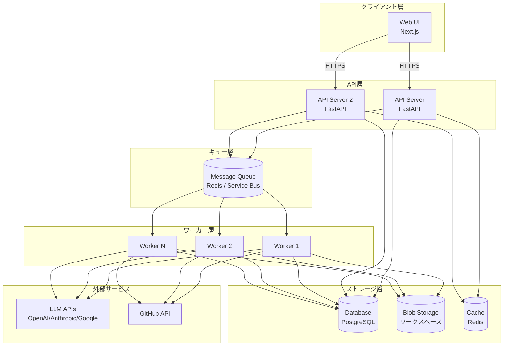

### コンポーネントの責務

| コンポーネント | 責務 | スケーリング戦略 |
|---------------|------|-----------------|
| **UI** | ユーザーインタラクション、リアルタイム表示 | CDN配信、静的ファイル |
| **API Server** | リクエスト処理、認証、ジョブ投入 | 水平スケール（ステートレス） |
| **Queue** | ジョブの永続化、配信保証、優先度管理 | マネージドサービス利用 |
| **Worker** | LLM呼び出し、コード生成、Git操作 | 水平スケール（並列処理） |
| **Database** | 永続データ保存 | リードレプリカ、シャーディング |
| **Cache** | セッション、一時データ | クラスタ構成 |
| **Blob Storage** | ワークスペース、大規模ファイル | オブジェクトストレージ |

---

## データフロー

### Run実行フロー

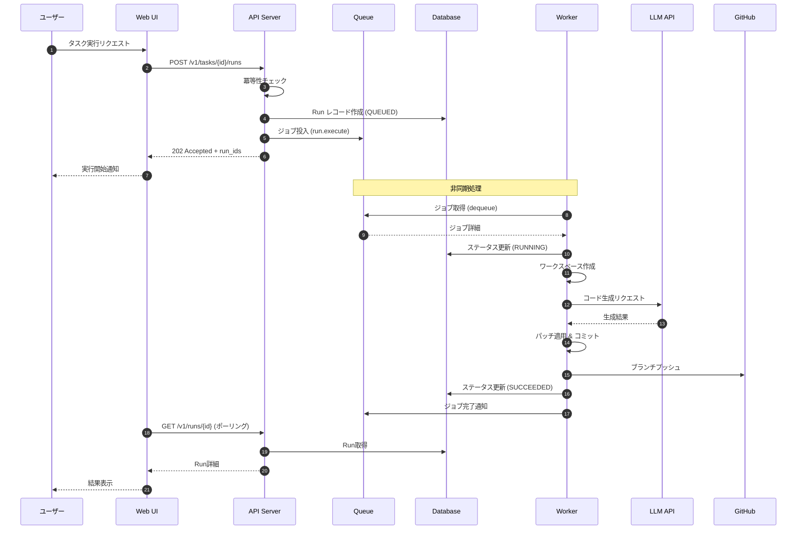

### リアルタイムログ配信

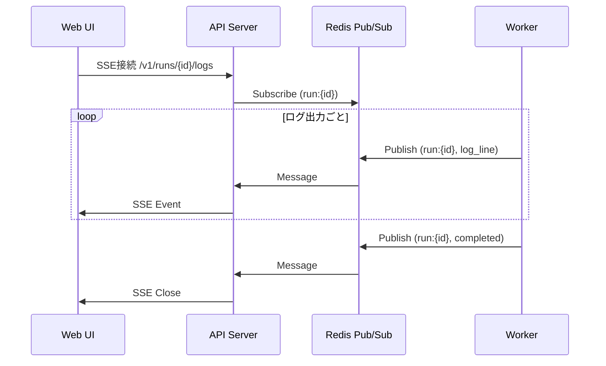

---

## コンポーネント詳細

### 1. API Server

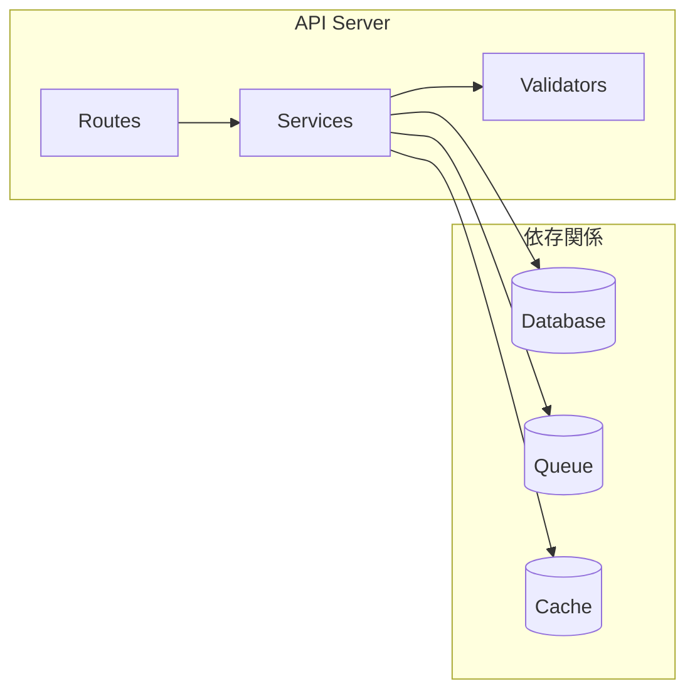

**設計原則**:
- **ステートレス**: セッション情報はCache/DBに保存
- **冪等性**: リクエストIDによる重複排除
- **バリデーション**: 入力検証をルート層で実施
- **非同期レスポンス**: 長時間処理は202 Acceptedで即時返却

**主要エンドポイント**:

| メソッド | パス | 説明 | 処理タイプ |
|---------|------|------|-----------|
| POST | /v1/tasks/{id}/runs | Run作成 | 非同期（Queue投入） |
| GET | /v1/runs/{id} | Run詳細取得 | 同期 |
| POST | /v1/runs/{id}/cancel | Runキャンセル | 同期（Queue操作） |
| GET | /v1/runs/{id}/logs | ログストリーム | SSE |

### 2. Message Queue

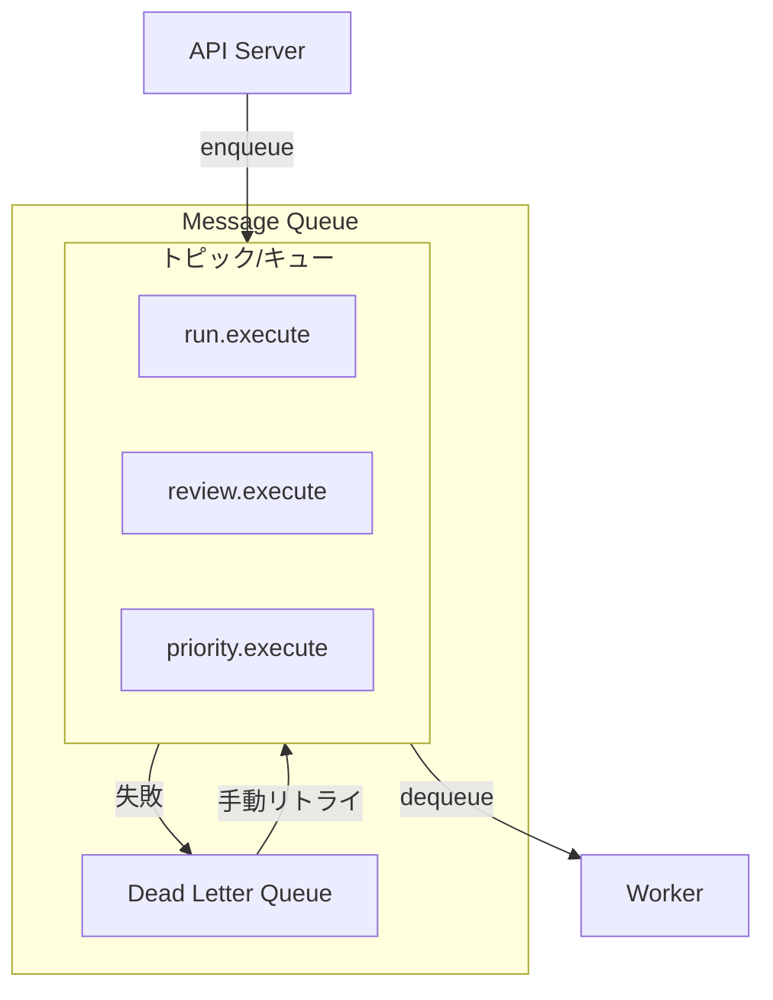

**キュー設計**:

| キュー名 | 用途 | 優先度 | 可視性タイムアウト |
|---------|------|--------|------------------|
| `run.execute` | コード生成ジョブ | 通常 | 10分 |
| `review.execute` | レビュージョブ | 通常 | 5分 |
| `priority.execute` | 優先ジョブ | 高 | 10分 |

**メッセージ構造**:
```json
{
  "id": "job_xxx",
  "kind": "run.execute",
  "ref_id": "run_yyy",
  "payload": {
    "task_id": "task_zzz",
    "instruction": "...",
    "model_id": "model_aaa"
  },
  "attempts": 0,
  "max_attempts": 3,
  "created_at": "2024-01-01T00:00:00Z",
  "available_at": "2024-01-01T00:00:00Z"
}
```

**配信保証**:
- **At-least-once**: 失敗時は再配信
- **可視性タイムアウト**: 処理中のジョブは他ワーカーから不可視
- **Dead Letter Queue**: 最大試行回数超過時に移動
- **遅延配信**: `available_at`による実行時刻指定

### 3. Worker

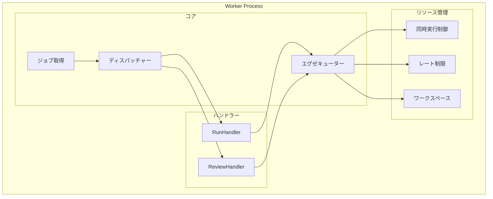

**Worker設計**:
```python
class Worker:
    """ワーカープロセス"""

    def __init__(
        self,
        queue: QueueBackend,
        handlers: dict[JobKind, JobHandler],
        max_concurrent: int = 4,
    ) -> None:
        self._queue = queue
        self._handlers = handlers
        self._semaphore = asyncio.Semaphore(max_concurrent)

    async def run(self) -> None:
        """メインループ"""
        while True:
            async with self._semaphore:
                job = await self._queue.dequeue(visibility_timeout=600)
                if job:
                    asyncio.create_task(self._process(job))
                else:
                    await asyncio.sleep(1)

    async def _process(self, job: Job) -> None:
        """ジョブ処理"""
        try:
            handler = self._handlers[job.kind]
            await handler.execute(job)
            await self._queue.complete(job.id)
        except Exception as e:
            await self._queue.fail(job.id, str(e), retry=job.attempts < job.max_attempts)
```

**リソース制御**:

| 制御 | 対象 | 設定例 |
|------|------|--------|
| 同時実行数 | ワーカー全体 | 4並列 |
| LLMレート制限 | プロバイダー別 | OpenAI: 10/min, Anthropic: 5/min |
| メモリ上限 | コンテナ | 4GB |
| タイムアウト | ジョブ単位 | 10分 |

---

## キュー抽象化

### インターフェース定義

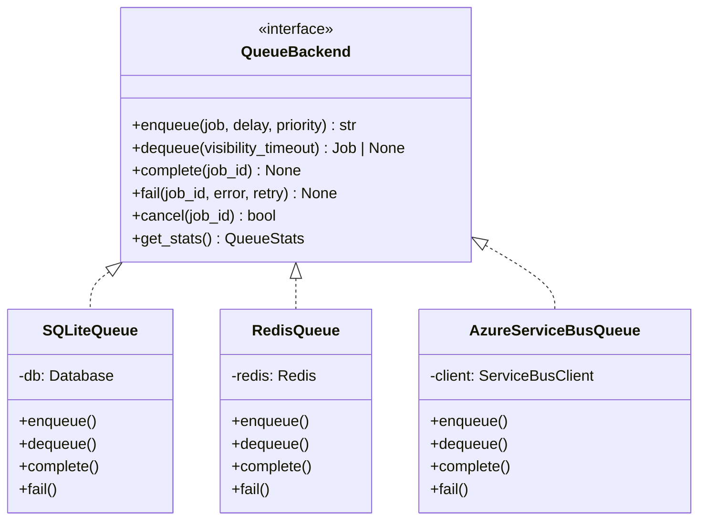

### 実装選択

| 環境 | 推奨実装 | 理由 |
|------|---------|------|
| ローカル開発 | SQLiteQueue | 依存なし、セットアップ不要 |
| 小規模本番 | RedisQueue | シンプル、低レイテンシ |
| Azure本番 | AzureServiceBusQueue | マネージド、高信頼性 |

---

## Azure構成

### アーキテクチャ概要

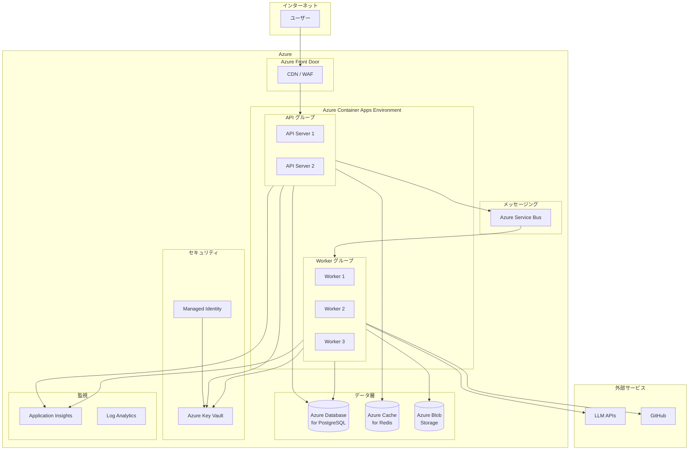

### Azureサービス構成

| コンポーネント | Azureサービス | SKU推奨 | 備考 |
|---------------|--------------|---------|------|
| **Web UI** | Static Web Apps / Blob + CDN | Standard | Next.js静的エクスポート |
| **API Server** | Container Apps | 0.5 vCPU, 1GB | オートスケール設定 |
| **Worker** | Container Apps | 1 vCPU, 2GB | KEDA連携でキュー駆動スケール |
| **Queue** | Service Bus | Standard | トピック + サブスクリプション |
| **Database** | Database for PostgreSQL | Flexible (Burstable B2s) | ゾーン冗長オプション |
| **Cache** | Cache for Redis | Basic C1 | セッション、Pub/Sub |
| **Blob Storage** | Blob Storage | Standard LRS | ワークスペース保存 |
| **Secret** | Key Vault | Standard | API キー、接続文字列 |
| **Monitoring** | Application Insights + Log Analytics | - | トレース、メトリクス、ログ |

### Container Apps 構成

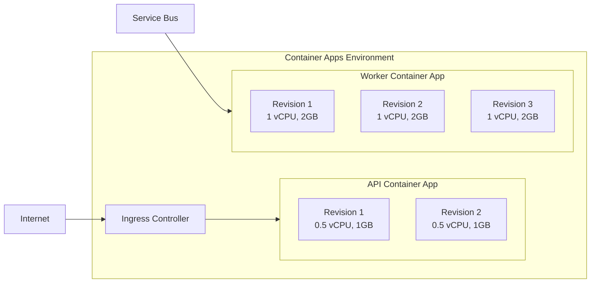

**API Container App設定**:
```yaml
# api-containerapp.yaml
properties:
  configuration:
    ingress:
      external: true
      targetPort: 8000
      transport: auto
    secrets:
      - name: database-url
        keyVaultUrl: https://zloth-kv.vault.azure.net/secrets/database-url
      - name: redis-url
        keyVaultUrl: https://zloth-kv.vault.azure.net/secrets/redis-url
  template:
    containers:
      - name: api
        image: zloth.azurecr.io/zloth-api:latest
        resources:
          cpu: 0.5
          memory: 1Gi
        env:
          - name: ZLOTH_DATABASE_URL
            secretRef: database-url
          - name: ZLOTH_REDIS_URL
            secretRef: redis-url
          - name: ZLOTH_WORKER_ENABLED
            value: "false"
    scale:
      minReplicas: 1
      maxReplicas: 10
      rules:
        - name: http-scaling
          http:
            metadata:
              concurrentRequests: "100"
```

**Worker Container App設定**:
```yaml
# worker-containerapp.yaml
properties:
  configuration:
    secrets:
      - name: servicebus-connection
        keyVaultUrl: https://zloth-kv.vault.azure.net/secrets/servicebus-connection
  template:
    containers:
      - name: worker
        image: zloth.azurecr.io/zloth-worker:latest
        resources:
          cpu: 1
          memory: 2Gi
        env:
          - name: ZLOTH_QUEUE_URL
            secretRef: servicebus-connection
          - name: ZLOTH_WORKER_ENABLED
            value: "true"
    scale:
      minReplicas: 0
      maxReplicas: 10
      rules:
        - name: queue-scaling
          custom:
            type: azure-servicebus
            metadata:
              queueName: run-execute
              messageCount: "5"
```

### Service Bus構成

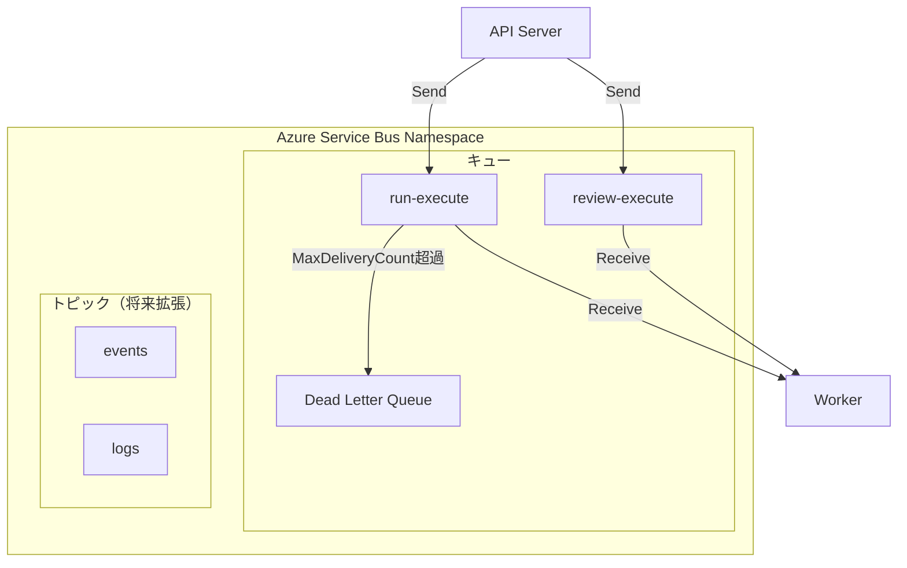

**キュー設定**:

| プロパティ | run-execute | review-execute |
|-----------|-------------|----------------|
| Max Size | 1GB | 1GB |
| Lock Duration | 5分 | 5分 |
| Max Delivery Count | 3 | 3 |
| Default TTL | 24時間 | 24時間 |
| Dead Lettering | 有効 | 有効 |

### データフロー（Azure版）

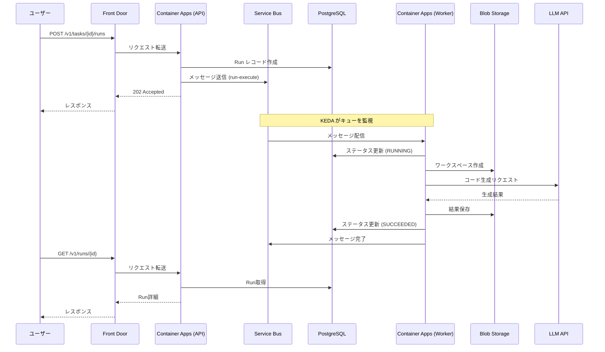

### ワークスペース管理（Blob Storage）

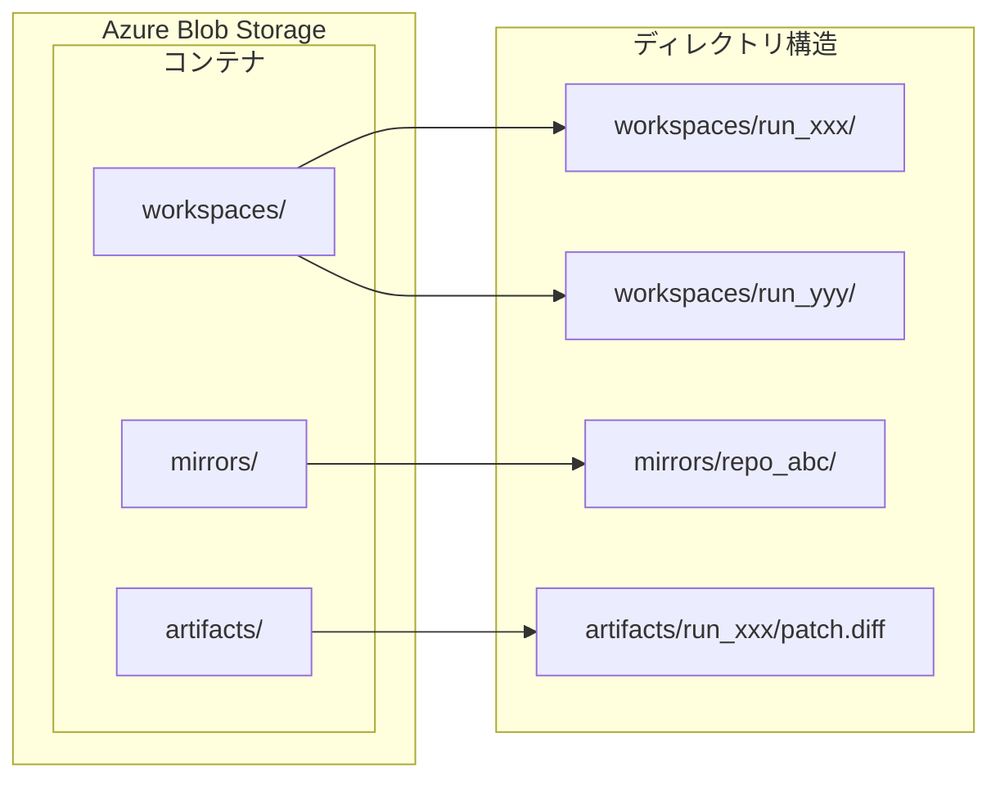

**Blob階層**:

| コンテナ | 用途 | ライフサイクル |
|---------|------|--------------|
| `workspaces/` | 実行中のワークスペース | Run完了後削除 |
| `mirrors/` | リポジトリミラー（共有） | 定期更新、永続保持 |
| `artifacts/` | 実行結果、パッチ | 30日後削除 |

### セキュリティ構成

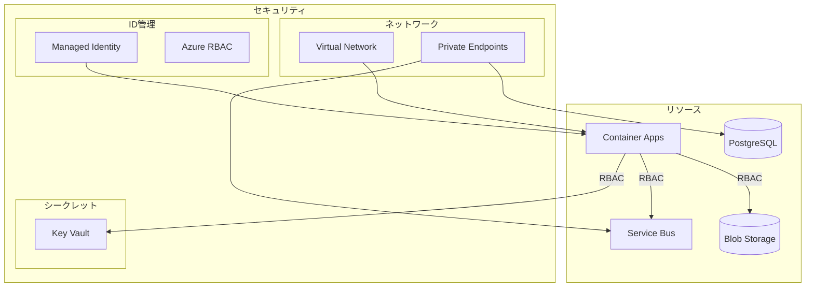

**セキュリティ設定**:

| 項目 | 設定 |
|------|------|
| 認証 | Managed Identity（パスワードレス） |
| シークレット管理 | Key Vault参照（Container Apps連携） |
| ネットワーク | VNet統合 + Private Endpoint |
| 暗号化 | TLS 1.3（転送時）、CMK（保存時） |
| 監査 | Azure Policy + Activity Log |

### 監視・アラート

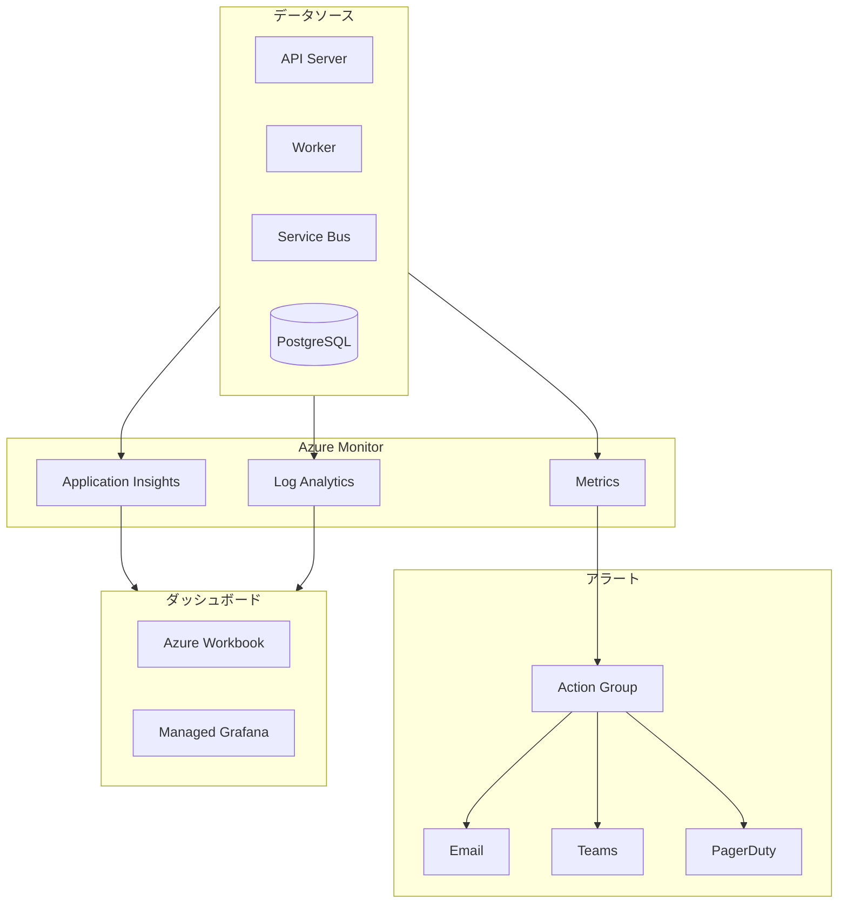

**監視メトリクス**:

| カテゴリ | メトリクス | アラート閾値 |
|---------|----------|-------------|
| API | レスポンスタイム p95 | > 2秒 |
| API | エラー率 | > 5% |
| Queue | メッセージ数 | > 100 |
| Queue | Dead Letter数 | > 10 |
| Worker | CPU使用率 | > 80% |
| Worker | メモリ使用率 | > 80% |
| Database | 接続数 | > 80% |
| Database | CPU使用率 | > 80% |

### コスト最適化

**推定月額コスト（小規模）**:

| サービス | SKU | 推定月額 |
|---------|-----|---------|
| Container Apps (API) | 0.5 vCPU × 2 | ¥5,000 |
| Container Apps (Worker) | 1 vCPU × 3 (avg) | ¥15,000 |
| PostgreSQL | Burstable B2s | ¥8,000 |
| Redis | Basic C1 | ¥5,000 |
| Service Bus | Standard | ¥3,000 |
| Blob Storage | 100GB | ¥2,000 |
| **合計** | | **¥38,000** |

**コスト削減策**:
- Worker の min replicas = 0（アイドル時はゼロスケール）
- PostgreSQL の自動一時停止（開発環境）
- Reserved Instances（本番環境）
- Blob のライフサイクル管理（30日後に Cool tier）

---

## 技術比較

### キュー: SQLite Queue vs Redis Queue

#### 概要

| 項目 | SQLite Queue | Redis Queue |
|------|-------------|-------------|
| **推奨環境** | ローカル開発 | 小規模本番 |
| **依存関係** | なし（セットアップ不要） | Redis サーバーが必要 |
| **レイテンシ** | 中程度 | 低い |
| **マルチプロセス** | 制限あり（ファイルロック） | 対応 |
| **水平スケール** | 不可 | 可能 |

#### 詳細比較

| 特性 | SQLite Queue | Redis Queue |
|------|-------------|-------------|
| **セットアップ** | 不要（ファイル作成のみ） | Redis サーバーのインストールが必要 |
| **並列 Worker** | 単一 Worker のみ推奨 | 複数 Worker 対応 |
| **Pub/Sub** | 非対応 | ネイティブ対応 |
| **リアルタイムログ** | ポーリングのみ | Pub/Sub で即時配信 |
| **永続化** | ファイルベース（自動） | RDB/AOF（設定必要） |
| **メモリ使用** | ディスクベース | インメモリ |

#### ユースケース別推奨

| ユースケース | 推奨 | 理由 |
|-------------|------|------|
| 個人開発・検証 | SQLite Queue | 依存なし、即座に利用可能 |
| チーム開発 | Redis Queue | 複数 Worker の並列実行 |
| ステージング | Redis Queue | 本番に近い構成 |
| 本番（Azure） | Service Bus | マネージド、高信頼性 |

### データベース: SQLite vs PostgreSQL

#### 概要

| 項目 | SQLite | PostgreSQL |
|------|--------|------------|
| **推奨環境** | ローカル開発・単一インスタンス | 本番・マルチインスタンス |
| **依存関係** | なし（ファイルベース） | サーバープロセスが必要 |
| **同時接続** | 制限あり（書き込みロック） | 高い同時接続に対応 |
| **水平スケール** | 不可 | リードレプリカ・シャーディング対応 |
| **運用コスト** | ゼロ | サーバー維持が必要 |

#### 詳細比較

| 特性 | SQLite | PostgreSQL |
|------|--------|------------|
| **セットアップ** | 不要（ファイル作成のみ） | サーバーインストール・設定が必要 |
| **接続方式** | ファイルアクセス | TCP/IP ネットワーク接続 |
| **書き込み並列性** | 単一ライター（ロック競合） | MVCC による高並列性 |
| **トランザクション分離** | SERIALIZABLE のみ | 複数レベル対応 |
| **JSON サポート** | 基本的 | JSONB（インデックス可能） |
| **全文検索** | FTS5 拡張 | ネイティブサポート |
| **バックアップ** | ファイルコピー | pg_dump / ストリーミングレプリケーション |
| **障害復旧** | 手動復旧 | WAL による自動復旧 |

#### パフォーマンス特性

| シナリオ | SQLite | PostgreSQL |
|---------|--------|------------|
| 読み取り（単一接続） | ◎ 非常に高速 | ○ 高速 |
| 読み取り（多数接続） | △ ロック競合 | ◎ 高いスループット |
| 書き込み（単一接続） | ◎ 高速 | ○ 高速 |
| 書き込み（並列） | × ボトルネック | ◎ 高並列対応 |
| 大規模データ（10GB+） | △ 性能劣化 | ◎ 安定 |

#### ユースケース別推奨

| ユースケース | 推奨 | 理由 |
|-------------|------|------|
| 個人開発・検証 | SQLite | ゼロ依存、即座に利用可能 |
| チーム開発 | PostgreSQL | 複数接続、並列書き込み対応 |
| ステージング | PostgreSQL | 本番に近い構成 |
| 本番（Azure） | Azure PostgreSQL | マネージド、高可用性 |

### 環境別構成まとめ

| 環境 | データベース | キュー | 備考 |
|------|------------|--------|------|
| ローカル開発 | SQLite | SQLite Queue | 依存ゼロ、即座に開始 |
| チーム開発 | SQLite or PostgreSQL | Redis Queue | Worker 並列実行 |
| ステージング | PostgreSQL | Redis Queue | 本番に近い構成 |
| 本番（小規模） | PostgreSQL | Redis Queue | シンプル、低コスト |
| 本番（Azure） | Azure PostgreSQL | Azure Service Bus | マネージド、高信頼性 |

### コスト比較

| 構成 | 月額コスト（概算） | 備考 |
|------|------------------|------|
| SQLite + SQLite Queue | ¥0 | ローカル開発向け |
| PostgreSQL + Redis（セルフホスト） | サーバー費用のみ | 小規模本番向け |
| Azure PostgreSQL + Service Bus | ¥11,000〜 | マネージド本番向け |

---

## 移行パス

### Phase 1: 現状 → キュー抽象化

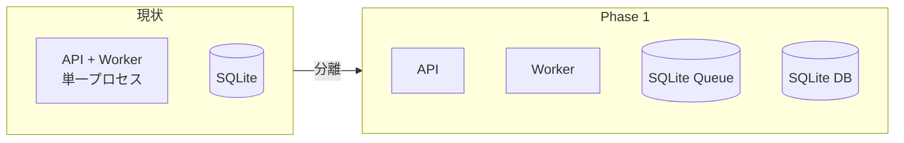

- API と Worker のプロセス分離
- 抽象キューインターフェース導入
- SQLite Queue 実装（既存互換）

### Phase 2: ローカル → Redis

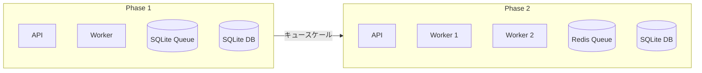

- Redis Queue 実装
- Worker 複数起動対応
- Pub/Sub によるリアルタイムログ配信

### Phase 3: SQLite → PostgreSQL

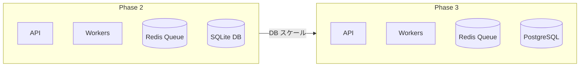

- PostgreSQL 移行
- 高い同時接続対応
- リードレプリカ・バックアップ対応

### Phase 4: オンプレ → Azure

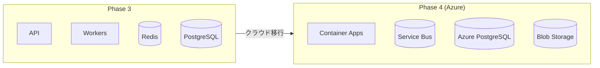

- Azure Service Bus Queue 実装
- Container Apps デプロイ
- マネージドサービス活用

---

## 環境変数

### 共通設定

| 変数 | 説明 | デフォルト |
|------|------|-----------|
| `ZLOTH_DATABASE_URL` | DB接続文字列 | `sqlite:///data/zloth.db` |
| `ZLOTH_QUEUE_URL` | キュー接続文字列 | `sqlite:///data/queue.db` |
| `ZLOTH_REDIS_URL` | Redis接続文字列 | なし |
| `ZLOTH_BLOB_URL` | Blob Storage URL | なし |

### API Server設定

| 変数 | 説明 | デフォルト |
|------|------|-----------|
| `ZLOTH_WORKER_ENABLED` | Worker起動有無 | `true` |
| `ZLOTH_API_PORT` | APIポート | `8000` |

### Worker設定

| 変数 | 説明 | デフォルト |
|------|------|-----------|
| `ZLOTH_WORKER_CONCURRENCY` | 同時実行数 | `4` |
| `ZLOTH_WORKER_POLL_INTERVAL` | ポーリング間隔(秒) | `1` |
| `ZLOTH_JOB_TIMEOUT` | ジョブタイムアウト(秒) | `600` |

### Azure固有設定

| 変数 | 説明 |
|------|------|
| `AZURE_SERVICEBUS_CONNECTION_STRING` | Service Bus接続文字列 |
| `AZURE_STORAGE_CONNECTION_STRING` | Blob Storage接続文字列 |
| `AZURE_KEYVAULT_URL` | Key Vault URL |

---

## まとめ

UI-API-Queue-Worker パターンにより、以下を実現する:

1. **疎結合**: 各コンポーネントが独立してスケール可能
2. **信頼性**: キューによる永続化、リトライ、Dead Letter対応
3. **スケーラビリティ**: Worker の水平スケール、KEDA連携
4. **可観測性**: Application Insights によるE2Eトレース
5. **セキュリティ**: Managed Identity、Key Vault、Private Endpoint

Azure構成では、Container Apps + Service Bus + PostgreSQL の組み合わせにより、マネージドサービスの利点を活かしつつ、オンプレミス環境との互換性を維持する。
