# アーキテクチャ設計

## システム概要

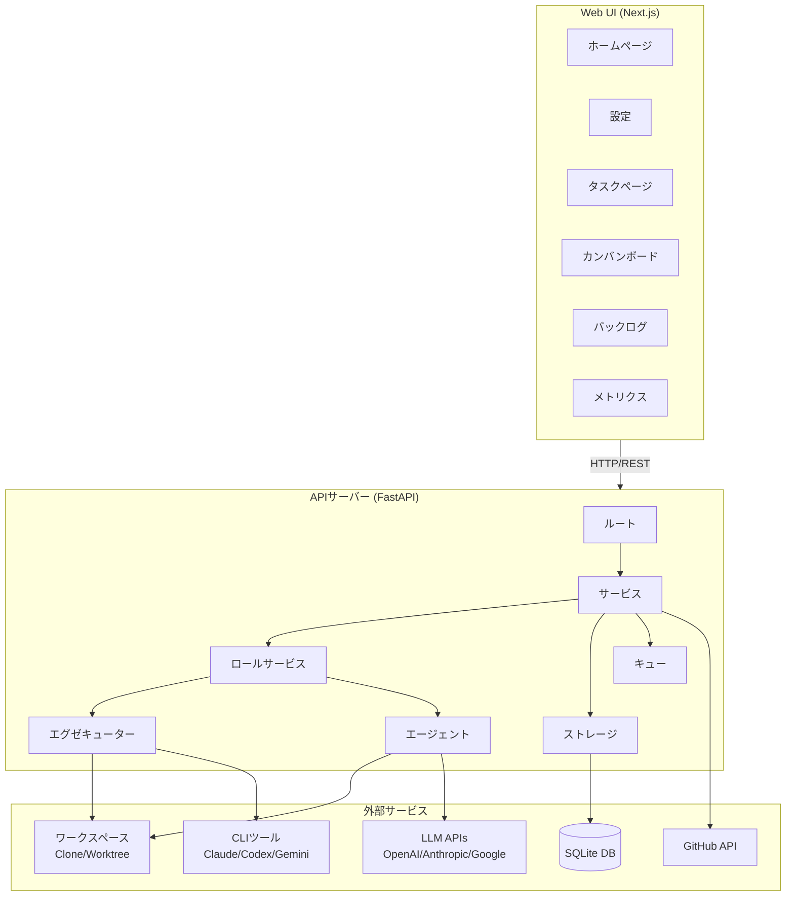

## レイヤーアーキテクチャ

### 1. ルートレイヤー (`routes/`)

HTTPリクエストを受信し、適切なサービスに委譲します。

```python
# 例: routes/runs.py
@router.post("/tasks/{task_id}/runs")
async def create_runs(
    task_id: str,
    data: RunCreate,
    run_service: RunService = Depends(get_run_service),
) -> RunsCreated:
    runs = await run_service.create_runs(task_id, data)
    return RunsCreated(run_ids=[r.id for r in runs])
```

**責務**:
- リクエストバリデーション (Pydantic)
- 認証/認可 (v0.2で予定)
- レスポンスフォーマット

**利用可能なエンドポイント**:
| カテゴリ | エンドポイント |
|----------|-----------|
| モデル | GET/POST/DELETE `/v1/models` |
| リポジトリ | POST `/v1/repos/clone` |
| タスク | GET/POST `/v1/tasks`, `/v1/tasks/{id}/messages` |
| 実行 | POST `/v1/tasks/{id}/runs`, GET `/v1/runs/{id}` |
| PR | POST `/v1/tasks/{id}/prs`, PUT `/v1/prs/{id}` |
| レビュー | POST `/v1/tasks/{id}/reviews`, GET `/v1/reviews/{id}` |
| 分解 | POST `/v1/breakdown` |
| カンバン | GET `/v1/kanban` |
| バックログ | GET/POST/PUT/DELETE `/v1/backlog` |

### 2. サービスレイヤー (`services/`)

ビジネスロジックを実装します。

```python
# 例: services/run_service.py
class RunService(BaseRoleService[Run, RunCreate, RunResult]):
    async def create_runs(self, task_id: str, data: RunCreate) -> list[Run]:
        # 1. タスクの存在確認
        # 2. 各モデルのRunレコード作成
        # 3. 実行キューに追加
        # 4. 実行リストを返却
```

**主要サービス**:
| サービス | 説明 |
|---------|-------------|
| `RunService` | 実装ロール - コード生成 |
| `ReviewService` | レビューロール - コードレビュー実行 |
| `BreakdownService` | 分解ロール - タスク分解 |
| `PRService` | プルリクエスト作成/管理 |
| `WorkspaceService` | クローンベースのワークスペース分離 |
| `GitService` | 一元化されたgit操作 |
| `JobWorker` | SQLiteバックドの永続ジョブキュー |
| `AgenticOrchestrator` | 自律的開発サイクル |
| `CIPollingService` | CIステータスポーリング |
| `GithubService` | GitHub API連携 |
| `CryptoService` | APIキー暗号化 |

### 3. ロールサービス (`roles/`)

すべてのAIロールは`BaseRoleService`を継承し、一貫した実行パターンを持ちます。

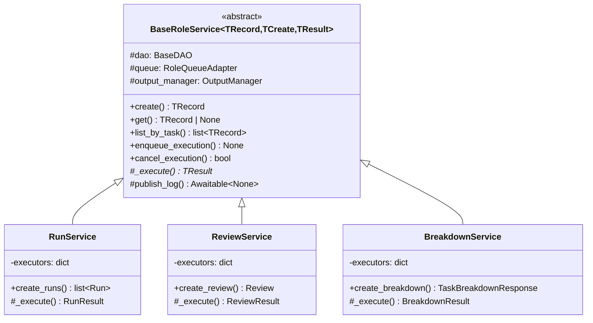

**ロールレジストリ**:
```python
# roles/registry.py
RoleRegistry.register("implementation", RunService)
RoleRegistry.register("review", ReviewService)
RoleRegistry.register("breakdown", BreakdownService)
```

### 4. エグゼキューターレイヤー (`executors/`)

コード生成のためのCLIツール連携。

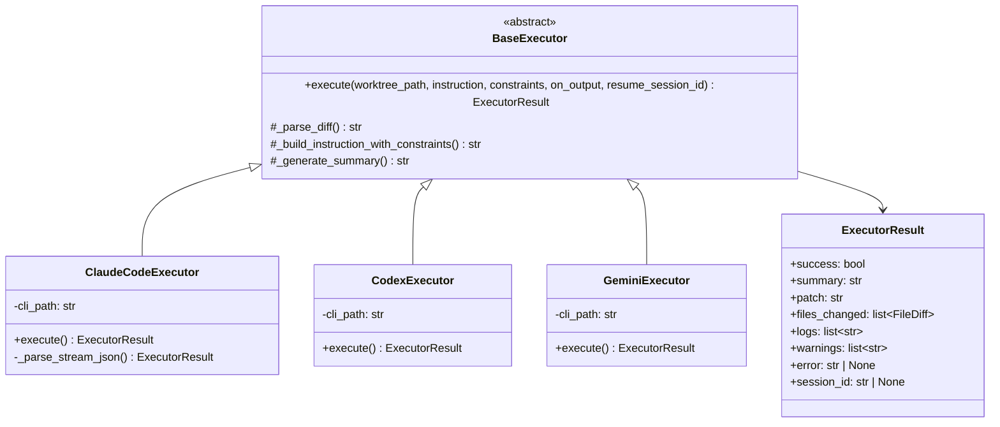

**エグゼキュータータイプ**:
| タイプ | ツール | 用途 |
|------|------|----------|
| `PATCH_AGENT` | LLM API | APIベースの直接パッチ生成 |
| `CLAUDE_CODE` | Claude Code CLI | セッション永続化対応のコード生成 |
| `CODEX_CLI` | Codex CLI | レビュー特化の操作 |
| `GEMINI_CLI` | Gemini CLI | マルチモーダルコード生成 |

### 5. エージェントレイヤー (`agents/`)

直接API呼び出しによるLLM連携とパッチ生成。

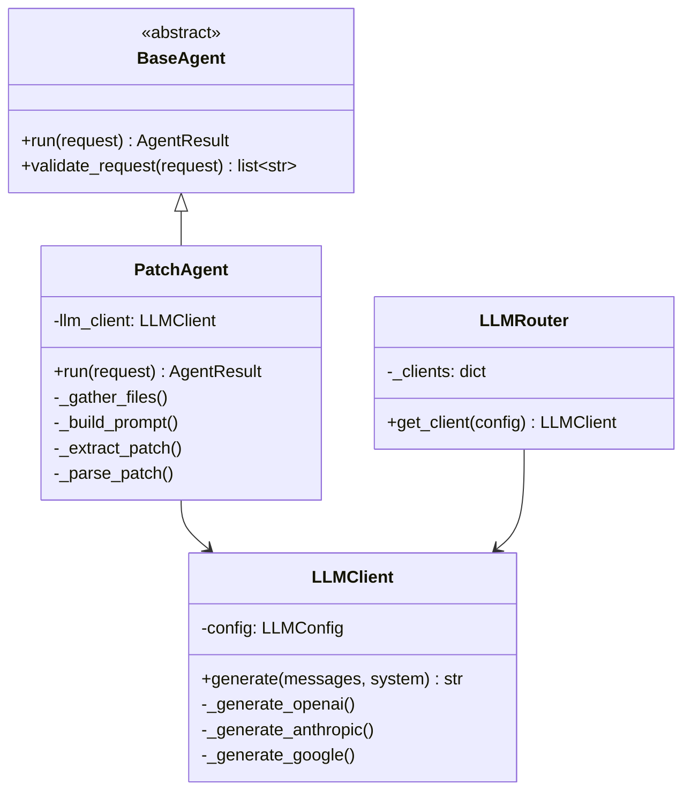

**エージェントインターフェース**:
```python
@dataclass
class AgentRequest:
    workspace_path: str      # 作業ディレクトリ
    base_ref: str           # ベースブランチ/コミット
    instruction: str        # 自然言語での指示
    context: dict | None    # 追加コンテキスト
    constraints: AgentConstraints  # 制約（禁止パス等）

@dataclass
class AgentResult:
    summary: str            # 人間が読める要約
    patch: str              # Unified diff
    files_changed: list     # 変更ファイルリスト
    logs: list[str]         # 操作ログ
    warnings: list[str]     # 警告

@dataclass
class AgentConstraints:
    max_files_changed: int | None
    forbidden_paths: list[str]      # .git, .env, *.key など
    forbidden_commands: list[str]   # git commit, push など
    allowed_git_commands: list[str] # git status, diff, log など

    def to_prompt(self) -> str:
        """制約をエージェントプロンプトに注入"""
```

### 6. ストレージレイヤー (`storage/`)

SQLiteによるデータ永続化。


## データフロー

### 1. Run作成から完了まで

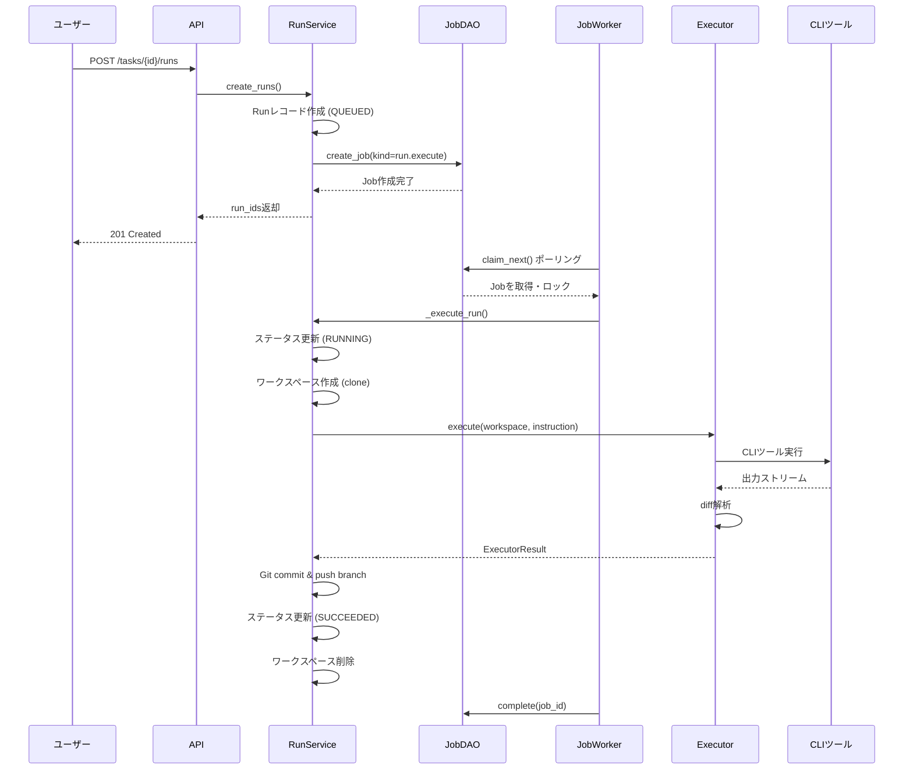

### 2. レビューフロー

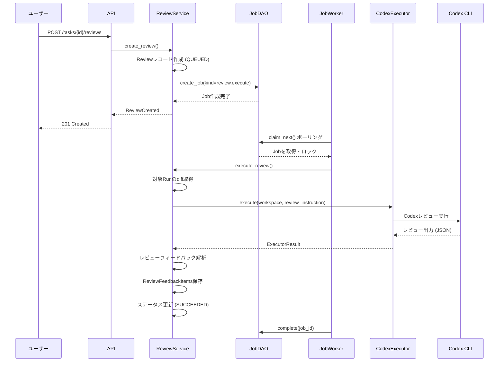

### 3. PR作成フロー

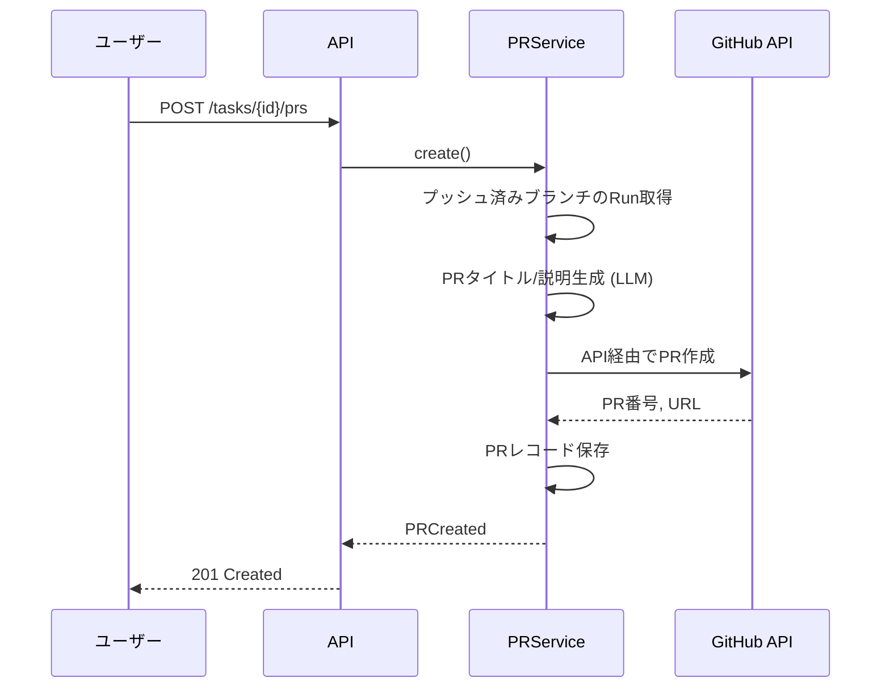

### 4. Agentic実行フロー

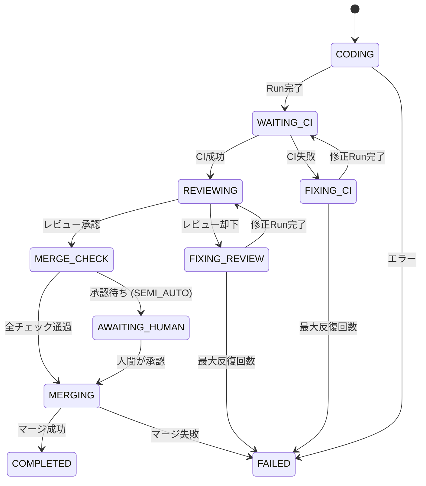

**コーディングモード**:
| モード | 説明 |
|------|-------------|
| `INTERACTIVE` | ユーザーが各ステップを制御 |
| `SEMI_AUTO` | CI/レビュー自動修正、マージは人間承認 |
| `FULL_AUTO` | コーディングからマージまで完全自律 |

## ワークスペース分離

### クローンベースワークスペース (デフォルト)

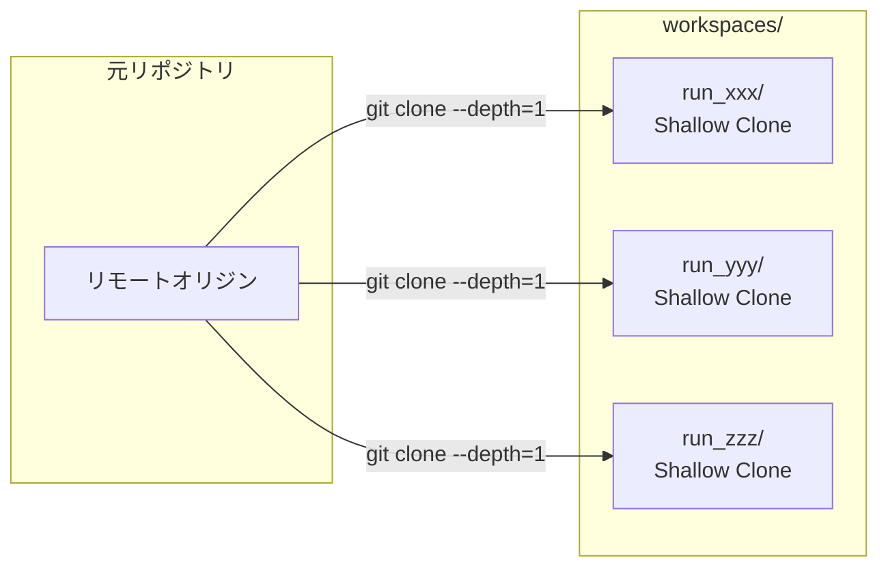

**メリット**:
- 親リポジトリの状態から独立
- リモート同期のサポートが良好
- worktreeロック問題なし
- Shallow clone (depth=1) で効率的

### Worktreeベースワークスペース (廃止)

Worktree方式は実装の複雑性・分岐増加の要因となるため、現在は **Clone方式に統一** されています。
互換のため設定値が残っている場合がありますが、Worktree方式の選択は無視されます。

## 並列実行モデル

### SQLiteバックドジョブキュー

```python
class JobWorker:
    """SQLiteに永続化されたジョブを処理するバックグラウンドワーカー"""

    def __init__(
        self,
        *,
        job_dao: JobDAO,
        handlers: Mapping[JobKind, JobHandler],
        max_concurrent: int | None = None,
        poll_interval_seconds: float = 1.0,
    ) -> None:
        self._job_dao = job_dao
        self._handlers = dict(handlers)
        self._semaphore = asyncio.Semaphore(max_concurrent)
        self._running: dict[str, asyncio.Task] = {}

    async def _run_loop(self) -> None:
        """キューに入ったジョブをポーリングして実行"""
        while not self._stop_event.is_set():
            job = await self._job_dao.claim_next(locked_by=self._worker_id)
            if job:
                task = asyncio.create_task(self._execute_job(job))
                self._running[job.id] = task
```

**特徴**:
- プロセス再起動後も生存（ジョブはSQLiteに永続化）
- セマフォベースの同時実行制御
- claim_next()によるジョブロック（競合回避）
- 完了タスクの自動クリーンアップ
- スタートアップリカバリー（前回クラッシュからの復旧）

**ジョブステータス遷移**:
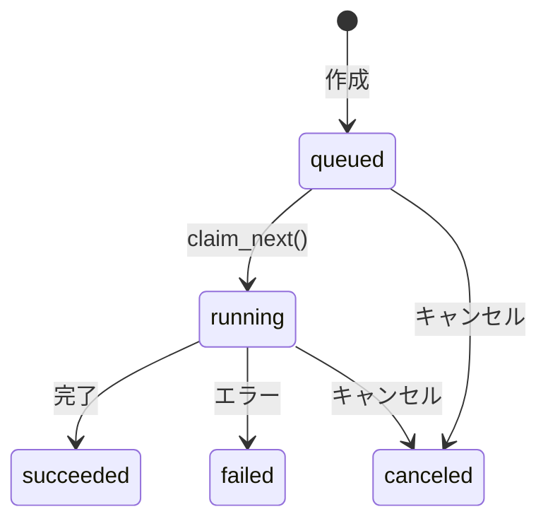

### スケーラビリティパス

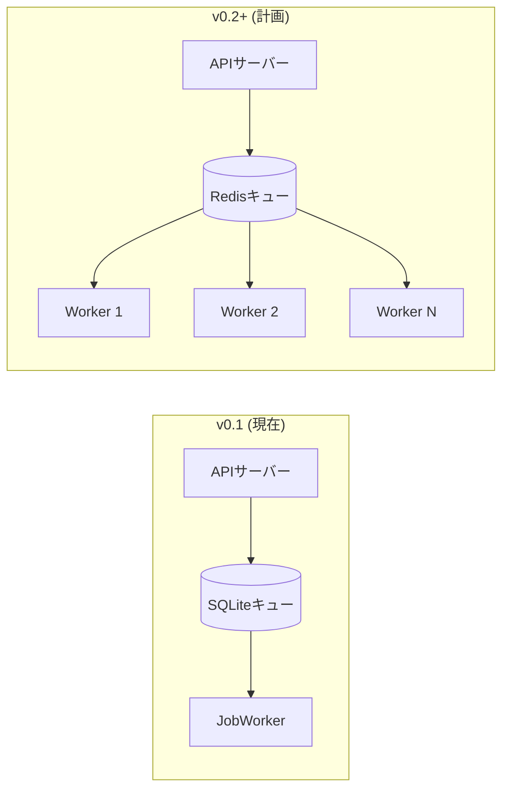

## セキュリティアーキテクチャ

### APIキー暗号化

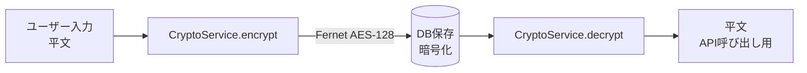

### 制約インジェクション

制約はエージェント/エグゼキューターのプロンプトに注入されます:

```python
# 制約の例
AgentConstraints(
    forbidden_paths=[".git", ".env", "*.secret", "*.key", "credentials.*"],
    forbidden_commands=["git commit", "git push", "rm -rf"],
    allowed_git_commands=["git status", "git diff", "git log", "git show"],
)

# プロンプトへの注入例:
# "以下のファイルを変更してはいけません: .git, .env, *.secret..."
# "以下のコマンドを実行してはいけません: git commit, git push, rm -rf..."
```

### オーケストレーターパターン

zlothがすべてのgit操作を管理し、エージェント/エグゼキューターはファイル編集のみを行います:

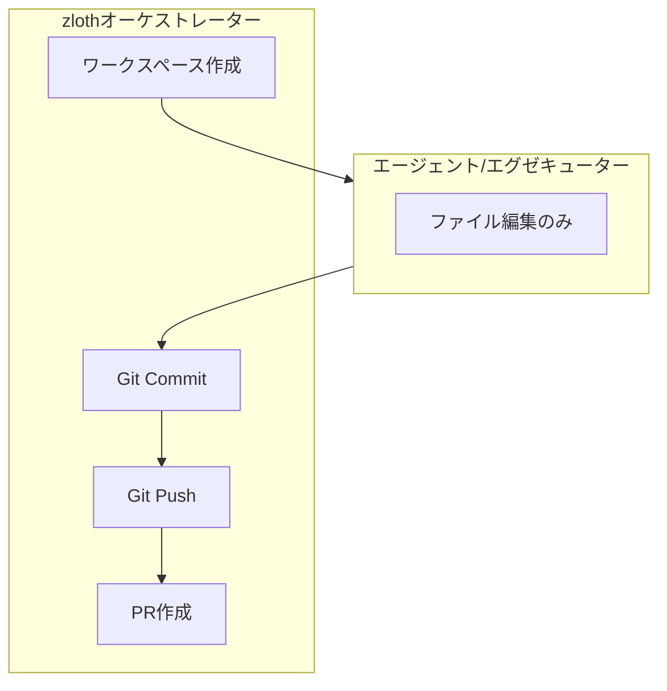

## エンティティ関係

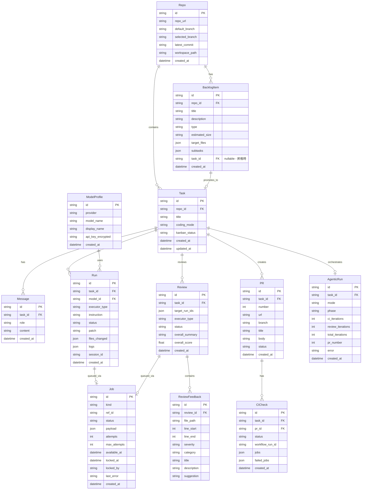

## ドメインEnum

### 実行ステータス
```python
class RoleExecutionStatus(str, Enum):
    QUEUED = "queued"       # キュー待ち
    RUNNING = "running"     # 実行中
    SUCCEEDED = "succeeded" # 成功
    FAILED = "failed"       # 失敗
    CANCELED = "canceled"   # キャンセル

# 後方互換性のためのエイリアス
RunStatus = RoleExecutionStatus
```

### エグゼキュータータイプ
```python
class ExecutorType(str, Enum):
    PATCH_AGENT = "patch_agent"    # 直接LLM API
    CLAUDE_CODE = "claude_code"    # Claude Code CLI
    CODEX_CLI = "codex"            # Codex CLI
    GEMINI_CLI = "gemini"          # Gemini CLI
```

### ジョブ種別
```python
class JobKind(str, Enum):
    RUN_EXECUTE = "run.execute"        # Run実行ジョブ
    REVIEW_EXECUTE = "review.execute"  # レビュー実行ジョブ
```

### ジョブステータス
```python
class JobStatus(str, Enum):
    QUEUED = "queued"       # キュー待ち
    RUNNING = "running"     # 実行中
    SUCCEEDED = "succeeded" # 成功
    FAILED = "failed"       # 失敗
    CANCELED = "canceled"   # キャンセル
```

### LLMプロバイダー
```python
class Provider(str, Enum):
    OPENAI = "openai"
    ANTHROPIC = "anthropic"
    GOOGLE = "google"
```

### コーディングモード
```python
class CodingMode(str, Enum):
    INTERACTIVE = "interactive"  # ユーザーが各ステップを制御
    SEMI_AUTO = "semi_auto"      # 自動修正、マージは人間承認
    FULL_AUTO = "full_auto"      # 完全自律
```

### レビュータイプ
```python
class ReviewSeverity(str, Enum):
    CRITICAL = "critical"  # 重大
    HIGH = "high"          # 高
    MEDIUM = "medium"      # 中
    LOW = "low"            # 低

class ReviewCategory(str, Enum):
    SECURITY = "security"              # セキュリティ
    BUG = "bug"                        # バグ
    PERFORMANCE = "performance"        # パフォーマンス
    MAINTAINABILITY = "maintainability" # 保守性
    BEST_PRACTICE = "best_practice"    # ベストプラクティス
    STYLE = "style"                    # スタイル
    DOCUMENTATION = "documentation"    # ドキュメント
    TEST = "test"                      # テスト
```

### カンバンステータス
```python
class TaskKanbanStatus(str, Enum):
    # 基本ステータス (DBに保存)
    BACKLOG = "backlog"    # バックログ
    TODO = "todo"          # 予定
    ARCHIVED = "archived"  # アーカイブ

    # 計算ステータス (動的)
    IN_PROGRESS = "in_progress"  # 実行中のRunあり
    IN_REVIEW = "in_review"      # アクティブなレビューあり
    GATING = "gating"            # CI/マージ待ち
    DONE = "done"                # PRマージ済み
```

## 設定

### 環境変数

| 変数 | 説明 | デフォルト |
|----------|-------------|---------|
| `ZLOTH_ENCRYPTION_KEY` | APIキー暗号化キー | 必須 |
| `ZLOTH_GITHUB_APP_ID` | GitHub App ID | - |
| `ZLOTH_GITHUB_APP_PRIVATE_KEY` | GitHub App秘密鍵 (base64) | - |
| `ZLOTH_GITHUB_APP_INSTALLATION_ID` | GitHub AppインストールID | - |
| `ZLOTH_DEBUG` | デバッグモード | `false` |
| `ZLOTH_LOG_LEVEL` | ログレベル | `INFO` |
| `ZLOTH_CLAUDE_CLI_PATH` | Claude Code CLIパス | `claude` |
| `ZLOTH_CODEX_CLI_PATH` | Codex CLIパス | `codex` |
| `ZLOTH_GEMINI_CLI_PATH` | Gemini CLIパス | `gemini` |
| `ZLOTH_WORKSPACES_DIR` | クローンワークスペースディレクトリ | `~/.zloth/workspaces` |
| `ZLOTH_WORKTREES_DIR` | Worktreeディレクトリ | `~/.zloth/worktrees` |
| `ZLOTH_DATA_DIR` | データベースディレクトリ | `~/.zloth/data` |
| `ZLOTH_USE_CLONE_BASED_WORKSPACES` | クローンベース分離を使用 | `true` |

### Agentic設定

| 設定 | 説明 | デフォルト |
|---------|-------------|---------|
| `max_ci_iterations` | CI修正の最大試行回数 | 3 |
| `max_review_iterations` | レビュー修正の最大試行回数 | 3 |
| `max_total_iterations` | 全体の最大反復回数 | 10 |
| `ci_polling_interval` | CIポーリング間隔（秒） | 30 |
| `ci_polling_timeout` | CIポーリングタイムアウト（分） | 30 |

## フロントエンドアーキテクチャ

### アプリ構造 (Next.js 14)

```
apps/web/src/
├── app/                    # App Router
│   ├── layout.tsx
│   ├── page.tsx           # ホーム（タスク一覧）
│   ├── tasks/             # タスク詳細ビュー
│   ├── repos/             # リポジトリ選択
│   ├── settings/          # 設定ページ
│   ├── kanban/            # カンバンボード
│   ├── backlog/           # バックログ管理
│   └── metrics/           # 開発メトリクス
├── components/
│   ├── ui/                # 基本UIコンポーネント
│   ├── ChatPanel.tsx      # メッセージ入力/表示
│   ├── RunsPanel.tsx      # Run一覧
│   ├── RunDetailPanel.tsx # Run詳細とdiff
│   ├── ReviewPanel.tsx    # コードレビュー表示
│   ├── DiffViewer.tsx     # シンタックスハイライト付きdiff
│   ├── BreakdownModal.tsx # タスク分解UI
│   ├── ExecutorSelector.tsx # エグゼキューター選択
│   └── ...
├── lib/
│   └── api.ts             # TypeScript APIクライアント
└── types.ts               # 型定義
```

### 主要コンポーネント

| コンポーネント | 説明 |
|-----------|-------------|
| `ChatPanel` | メッセージ履歴付き会話インターフェース |
| `RunsPanel` | ステータス付き並列Run一覧 |
| `RunDetailPanel` | Run出力、diffビューア、PRアクション |
| `ReviewPanel` | コードレビューフィードバック表示 |
| `DiffViewer` | シンタックスハイライト付きUnified diff |
| `ExecutorSelector` | エグゼキュータータイプ選択（Claude/Codex/Gemini） |
| `BreakdownModal` | タスク分解UI |
| `StreamingLogs` | リアルタイムログ表示 |

## ロードマップ

### v0.2
- [ ] Dockerサンドボックスでのコマンド実行
- [x] GitHub App認証
- [x] Agenticオーケストレーター（自律的開発サイクル）
- [x] コードレビュー統合
- [x] クローンベースワークスペース分離
- [x] SQLiteバックドの永続ジョブキュー
- [ ] マルチユーザーサポート

### v0.3
- [ ] 分散キュー (Redis/Celery)
- [ ] PostgreSQLサポート
- [ ] コストと予算管理
- [ ] ポリシーインジェクション
- [ ] WebhookベースCI連携
