# Architecture Design

## System Overview

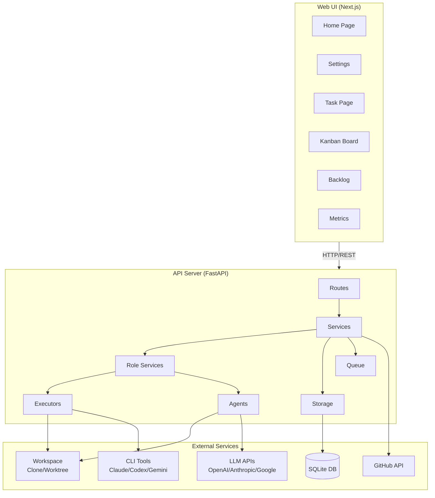

## Layer Architecture

### 1. Routes Layer (`routes/`)

Receives HTTP requests and delegates to appropriate services.

```python
# Example: routes/runs.py
@router.post("/tasks/{task_id}/runs")
async def create_runs(
    task_id: str,
    data: RunCreate,
    run_service: RunService = Depends(get_run_service),
) -> RunsCreated:
    runs = await run_service.create_runs(task_id, data)
    return RunsCreated(run_ids=[r.id for r in runs])
```

**Responsibilities**:
- Request validation (Pydantic)
- Authentication/Authorization (planned for v0.2)
- Response formatting

**Available Endpoints**:
| Category | Endpoints |
|----------|-----------|
| Models | GET/POST/DELETE `/v1/models` |
| Repos | POST `/v1/repos/clone` |
| Tasks | GET/POST `/v1/tasks`, `/v1/tasks/{id}/messages` |
| Runs | POST `/v1/tasks/{id}/runs`, GET `/v1/runs/{id}` |
| PRs | POST `/v1/tasks/{id}/prs`, PUT `/v1/prs/{id}` |
| Reviews | POST `/v1/tasks/{id}/reviews`, GET `/v1/reviews/{id}` |
| Breakdown | POST `/v1/breakdown` |
| Kanban | GET `/v1/kanban` |
| Backlog | GET/POST/PUT/DELETE `/v1/backlog` |

### 2. Services Layer (`services/`)

Implements business logic.

```python
# Example: services/run_service.py
class RunService(BaseRoleService[Run, RunCreate, RunResult]):
    async def create_runs(self, task_id: str, data: RunCreate) -> list[Run]:
        # 1. Verify task exists
        # 2. Create Run records for each model
        # 3. Enqueue for execution
        # 4. Return run list
```

**Core Services**:
| Service | Description |
|---------|-------------|
| `RunService` | Implementation role - code generation |
| `ReviewService` | Review role - code review execution |
| `BreakdownService` | Breakdown role - task decomposition |
| `PRService` | Pull request creation/management |
| `WorkspaceService` | Clone-based workspace isolation |
| `GitService` | Centralized git operations |
| `AgenticOrchestrator` | Autonomous development cycle |
| `CIPollingService` | CI status polling |
| `GithubService` | GitHub API integration |
| `CryptoService` | API key encryption |

### 3. Role Services (`roles/`)

All AI roles inherit from `BaseRoleService` for consistent execution patterns.

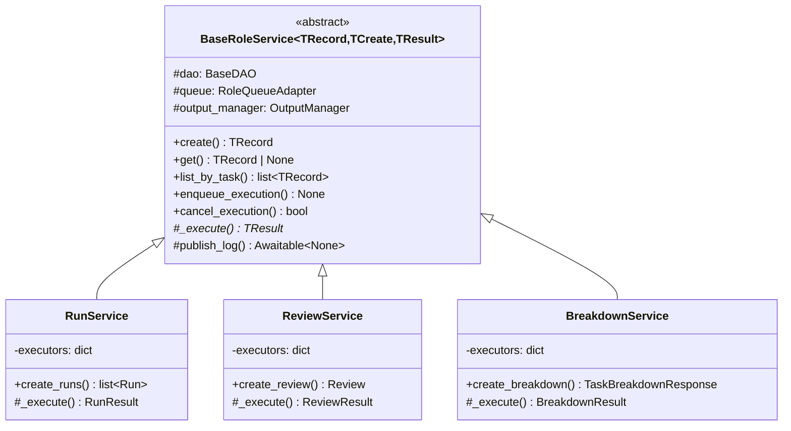

**Role Registry**:
```python
# roles/registry.py
RoleRegistry.register("implementation", RunService)
RoleRegistry.register("review", ReviewService)
RoleRegistry.register("breakdown", BreakdownService)
```

### 4. Executors Layer (`executors/`)

CLI tool integration for code generation.

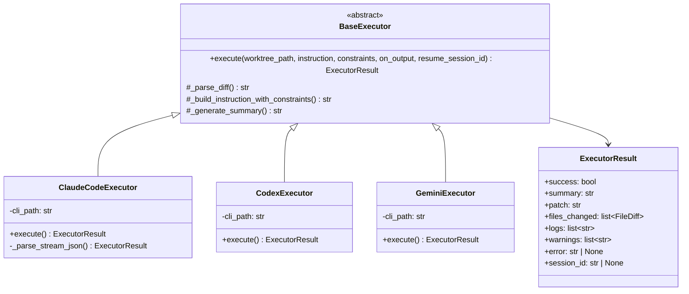

**Executor Types**:
| Type | Tool | Use Case |
|------|------|----------|
| `PATCH_AGENT` | LLM API | Direct API-based patch generation |
| `CLAUDE_CODE` | Claude Code CLI | Session-persistent code generation |
| `CODEX_CLI` | Codex CLI | Review-focused operations |
| `GEMINI_CLI` | Gemini CLI | Multi-modal code generation |

### 5. Agents Layer (`agents/`)

LLM interaction and patch generation via direct API calls.

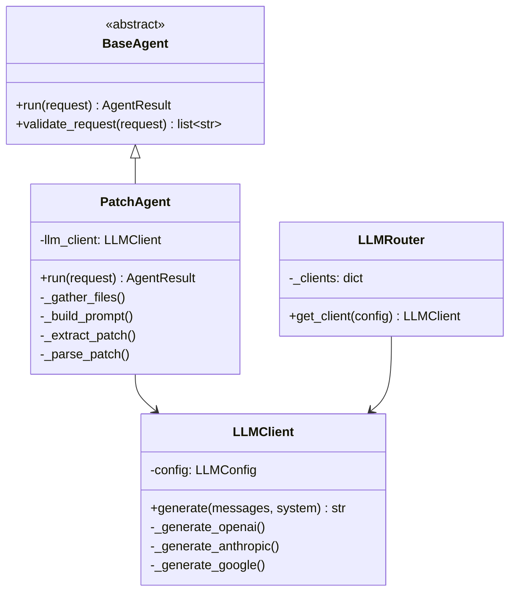

**Agent Interface**:
```python
@dataclass
class AgentRequest:
    workspace_path: str      # Working directory
    base_ref: str           # Base branch/commit
    instruction: str        # Natural language instruction
    context: dict | None    # Additional context
    constraints: AgentConstraints  # Constraints (forbidden paths, etc.)

@dataclass
class AgentResult:
    summary: str            # Human-readable summary
    patch: str              # Unified diff
    files_changed: list     # List of changed files
    logs: list[str]         # Operation logs
    warnings: list[str]     # Warnings

@dataclass
class AgentConstraints:
    max_files_changed: int | None
    forbidden_paths: list[str]      # .git, .env, *.key, etc.
    forbidden_commands: list[str]   # git commit, push, etc.
    allowed_git_commands: list[str] # git status, diff, log, etc.

    def to_prompt(self) -> str:
        """Inject constraints into agent prompt"""
```

### 6. Storage Layer (`storage/`)

Data persistence with SQLite.

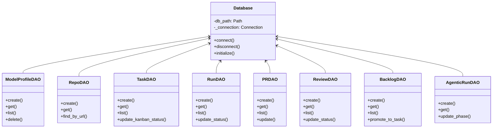

## Data Flow

### 1. Run Creation to Completion

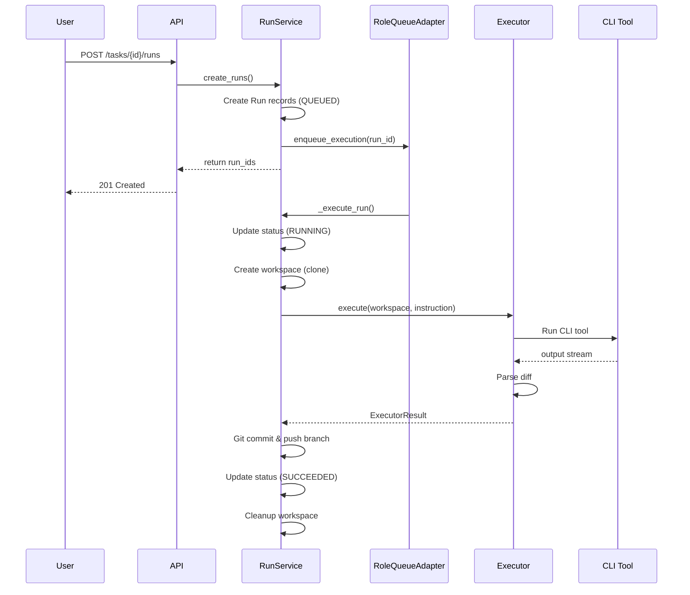

### 2. Review Flow

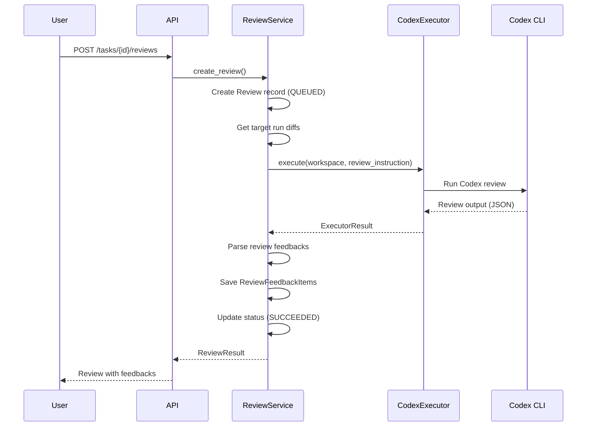

### 3. PR Creation Flow

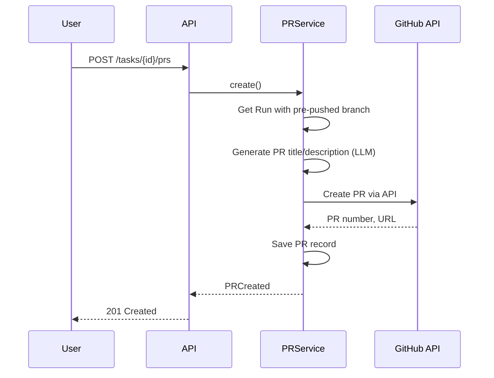

### 4. Agentic Execution Flow

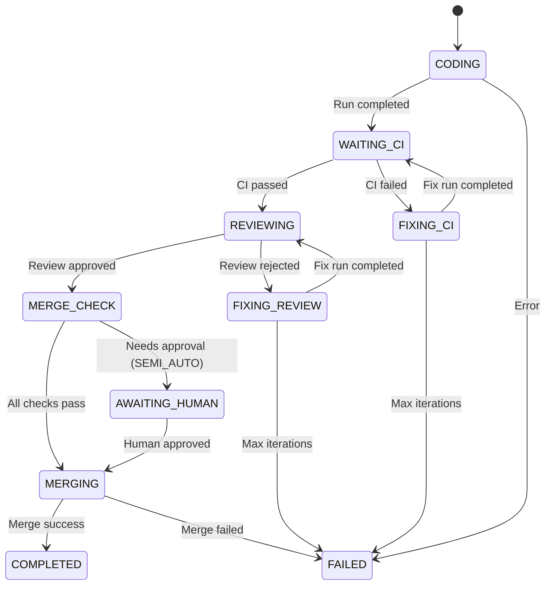

**Coding Modes**:
| Mode | Description |
|------|-------------|
| `INTERACTIVE` | User controls each step |
| `SEMI_AUTO` | Auto-fix CI/review, human approval for merge |
| `FULL_AUTO` | Fully autonomous from coding to merge |

## Workspace Isolation

### Clone-Based Workspaces (Default)

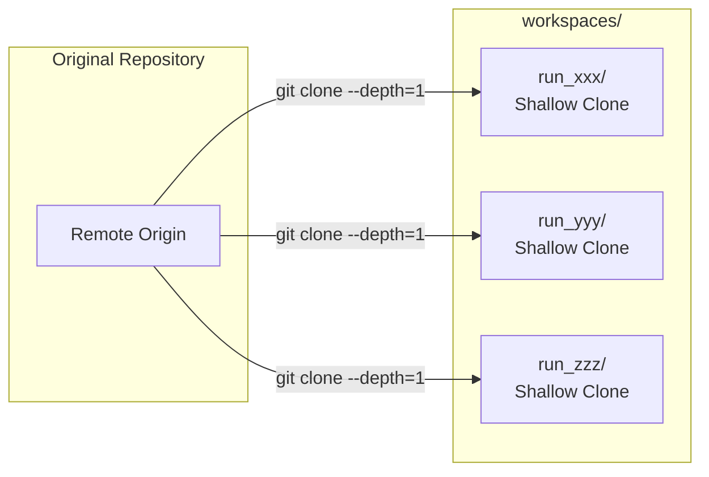

**Benefits**:
- Independent from parent repository state
- Better support for remote sync
- No worktree lock issues
- Shallow clone (depth=1) for efficiency

### Worktree-Based Workspaces (Alternative)

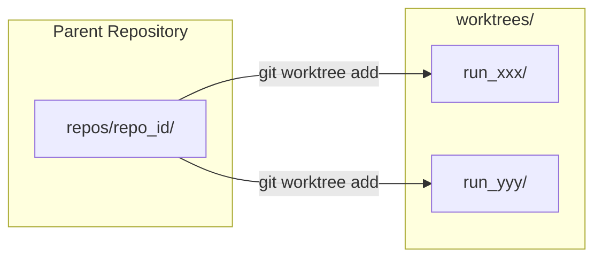

**Configuration**:
```python
# settings.py
use_clone_based_workspaces: bool = True  # Default: clone-based
workspaces_dir: Path   # For clones
worktrees_dir: Path    # For worktrees (separate to avoid inheriting CLAUDE.md)
```

## Parallel Execution Model

### Queue-Based Execution

```python
class RoleQueueAdapter:
    def __init__(self, max_concurrent: int = 5):
        self._semaphore = asyncio.Semaphore(max_concurrent)
        self._tasks: dict[str, asyncio.Task] = {}

    async def enqueue(self, id: str, coro: Callable) -> None:
        async with self._semaphore:
            task = asyncio.create_task(coro())
            self._tasks[id] = task

    def cancel(self, id: str) -> bool:
        if task := self._tasks.get(id):
            return task.cancel()
        return False
```

**Characteristics**:
- Semaphore-based concurrency control
- Configurable timeout enforcement
- Automatic cleanup of completed tasks
- In-memory for v0.1 (replaceable with Celery/Redis)

### Scalability Path

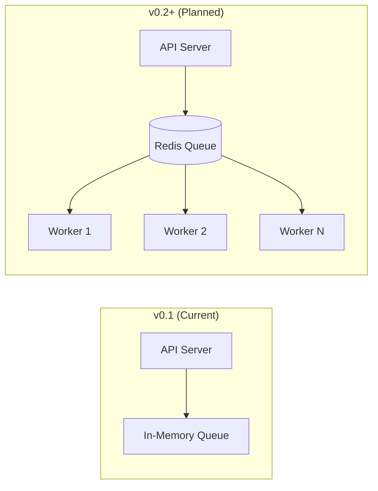

## Security Architecture

### API Key Encryption

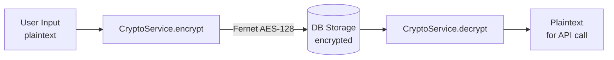

### Constraint Injection

Constraints are injected into agent/executor prompts:

```python
# Example constraints
AgentConstraints(
    forbidden_paths=[".git", ".env", "*.secret", "*.key", "credentials.*"],
    forbidden_commands=["git commit", "git push", "rm -rf"],
    allowed_git_commands=["git status", "git diff", "git log", "git show"],
)

# Injected into prompt as:
# "You MUST NOT modify files matching: .git, .env, *.secret..."
# "You MUST NOT execute: git commit, git push, rm -rf..."
```

### Orchestrator Pattern

zloth manages all git operations; agents/executors only edit files:

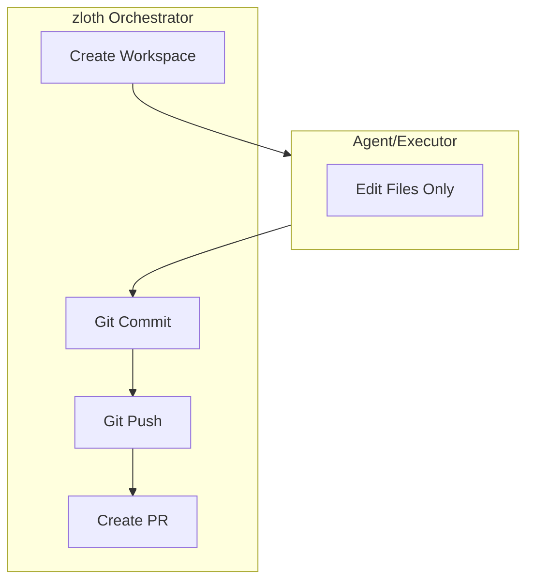

## Entity Relationships

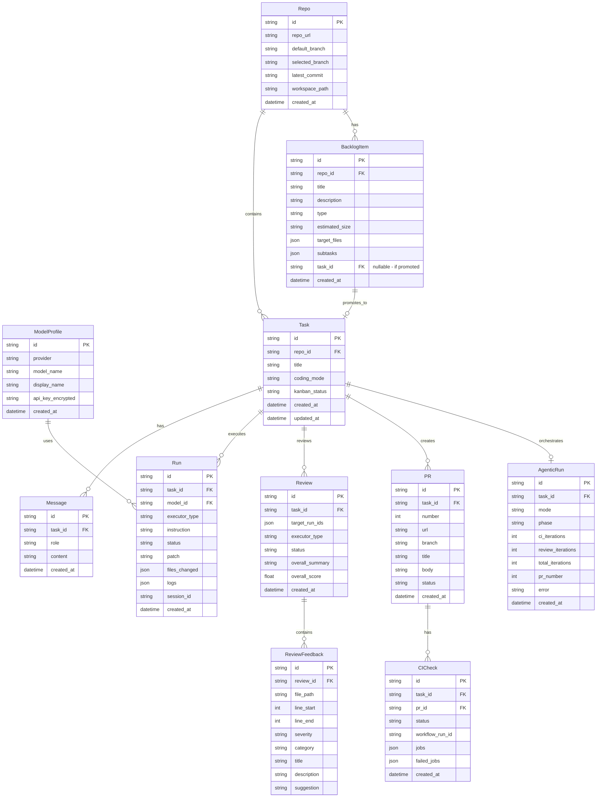

## Domain Enums

### Execution Status
```python
class RoleExecutionStatus(str, Enum):
    QUEUED = "queued"
    RUNNING = "running"
    SUCCEEDED = "succeeded"
    FAILED = "failed"
    CANCELED = "canceled"

# Alias for backward compatibility
RunStatus = RoleExecutionStatus
```

### Executor Types
```python
class ExecutorType(str, Enum):
    PATCH_AGENT = "patch_agent"    # Direct LLM API
    CLAUDE_CODE = "claude_code"    # Claude Code CLI
    CODEX_CLI = "codex"            # Codex CLI
    GEMINI_CLI = "gemini"          # Gemini CLI
```

### LLM Providers
```python
class Provider(str, Enum):
    OPENAI = "openai"
    ANTHROPIC = "anthropic"
    GOOGLE = "google"
```

### Coding Modes
```python
class CodingMode(str, Enum):
    INTERACTIVE = "interactive"  # User controls each step
    SEMI_AUTO = "semi_auto"      # Auto-fix, human approval for merge
    FULL_AUTO = "full_auto"      # Fully autonomous
```

### Review Types
```python
class ReviewSeverity(str, Enum):
    CRITICAL = "critical"
    HIGH = "high"
    MEDIUM = "medium"
    LOW = "low"

class ReviewCategory(str, Enum):
    SECURITY = "security"
    BUG = "bug"
    PERFORMANCE = "performance"
    MAINTAINABILITY = "maintainability"
    BEST_PRACTICE = "best_practice"
    STYLE = "style"
    DOCUMENTATION = "documentation"
    TEST = "test"
```

### Kanban Status
```python
class TaskKanbanStatus(str, Enum):
    # Base status (stored in DB)
    BACKLOG = "backlog"
    TODO = "todo"
    ARCHIVED = "archived"

    # Computed status (dynamic)
    IN_PROGRESS = "in_progress"  # Has running runs
    IN_REVIEW = "in_review"      # Has active review
    GATING = "gating"            # Waiting for CI/merge
    DONE = "done"                # PR merged
```

## Configuration

### Environment Variables

| Variable | Description | Default |
|----------|-------------|---------|
| `ZLOTH_ENCRYPTION_KEY` | API key encryption key | Required |
| `ZLOTH_GITHUB_APP_ID` | GitHub App ID | - |
| `ZLOTH_GITHUB_APP_PRIVATE_KEY` | GitHub App private key (base64) | - |
| `ZLOTH_GITHUB_APP_INSTALLATION_ID` | GitHub App installation ID | - |
| `ZLOTH_DEBUG` | Debug mode | `false` |
| `ZLOTH_LOG_LEVEL` | Log level | `INFO` |
| `ZLOTH_CLAUDE_CLI_PATH` | Claude Code CLI path | `claude` |
| `ZLOTH_CODEX_CLI_PATH` | Codex CLI path | `codex` |
| `ZLOTH_GEMINI_CLI_PATH` | Gemini CLI path | `gemini` |
| `ZLOTH_WORKSPACES_DIR` | Clone workspaces directory | `~/.zloth/workspaces` |
| `ZLOTH_WORKTREES_DIR` | Worktrees directory | `~/.zloth/worktrees` |
| `ZLOTH_DATA_DIR` | Database directory | `~/.zloth/data` |
| `ZLOTH_USE_CLONE_BASED_WORKSPACES` | Use clone-based isolation | `true` |

### Agentic Settings

| Setting | Description | Default |
|---------|-------------|---------|
| `max_ci_iterations` | Max CI fix attempts | 3 |
| `max_review_iterations` | Max review fix attempts | 3 |
| `max_total_iterations` | Max total iterations | 10 |
| `ci_polling_interval` | CI poll interval (seconds) | 30 |
| `ci_polling_timeout` | CI poll timeout (minutes) | 30 |

## Frontend Architecture

### App Structure (Next.js 14)

```
apps/web/src/
├── app/                    # App Router
│   ├── layout.tsx
│   ├── page.tsx           # Home (task list)
│   ├── tasks/             # Task detail view
│   ├── repos/             # Repository selection
│   ├── settings/          # Settings page
│   ├── kanban/            # Kanban board
│   ├── backlog/           # Backlog management
│   └── metrics/           # Development metrics
├── components/
│   ├── ui/                # Base UI components
│   ├── ChatPanel.tsx      # Message input/display
│   ├── RunsPanel.tsx      # Run list
│   ├── RunDetailPanel.tsx # Run details with diff
│   ├── ReviewPanel.tsx    # Code review display
│   ├── DiffViewer.tsx     # Syntax-highlighted diff
│   ├── BreakdownModal.tsx # Task decomposition
│   ├── ExecutorSelector.tsx # Executor selection
│   └── ...
├── lib/
│   └── api.ts             # TypeScript API client
└── types.ts               # Type definitions
```

### Key Components

| Component | Description |
|-----------|-------------|
| `ChatPanel` | Conversation interface with message history |
| `RunsPanel` | List of parallel runs with status |
| `RunDetailPanel` | Run output, diff viewer, PR actions |
| `ReviewPanel` | Code review feedback display |
| `DiffViewer` | Syntax-highlighted unified diff |
| `ExecutorSelector` | Select executor type (Claude/Codex/Gemini) |
| `BreakdownModal` | Task decomposition UI |
| `StreamingLogs` | Real-time log display |

## Roadmap

### v0.2
- [ ] Docker sandbox for command execution
- [x] GitHub App authentication
- [x] Agentic orchestrator (autonomous development cycle)
- [x] Code review integration
- [x] Clone-based workspace isolation
- [ ] Multi-user support

### v0.3
- [ ] Distributed queue (Redis/Celery)
- [ ] PostgreSQL support
- [ ] Cost and budget management
- [ ] Policy injection
- [ ] Webhook-based CI integration
