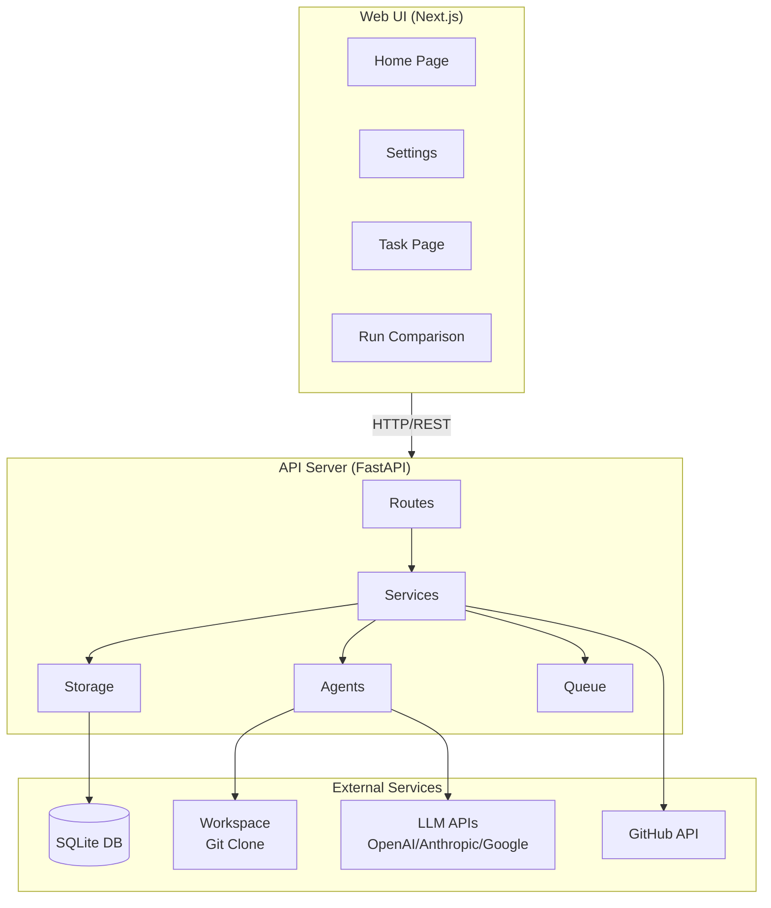
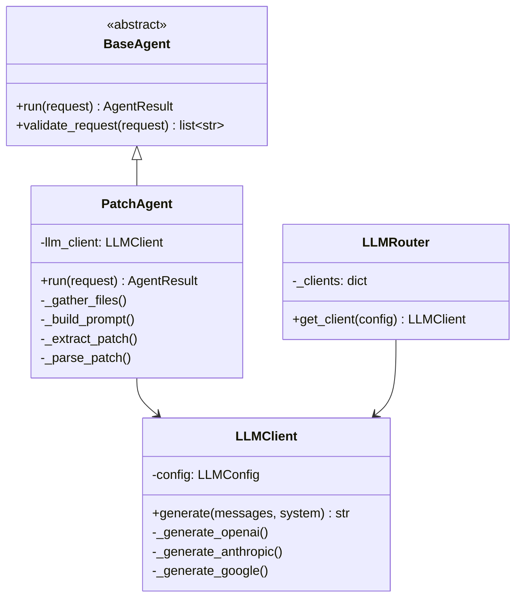
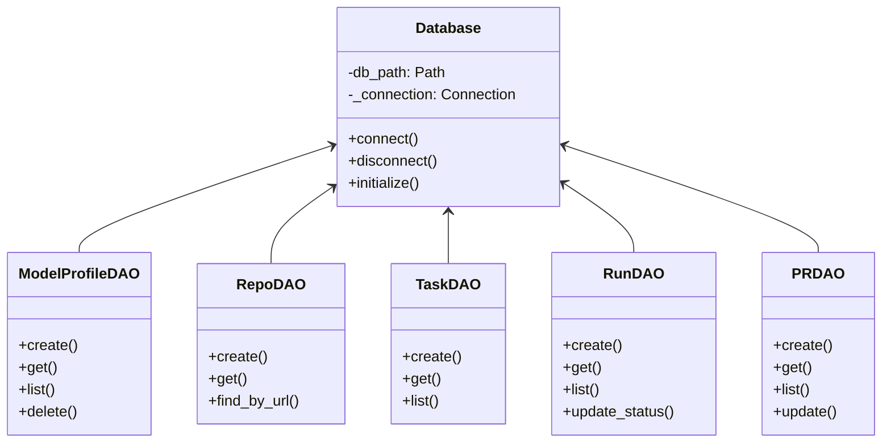
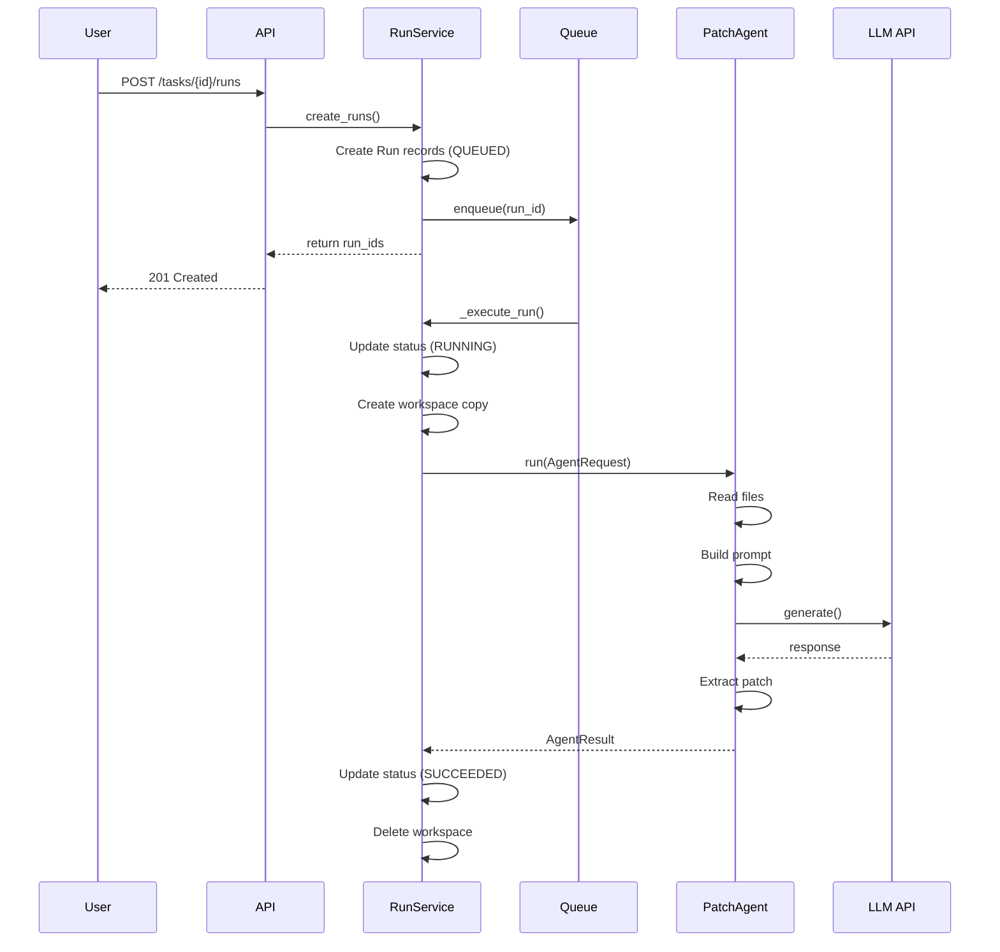
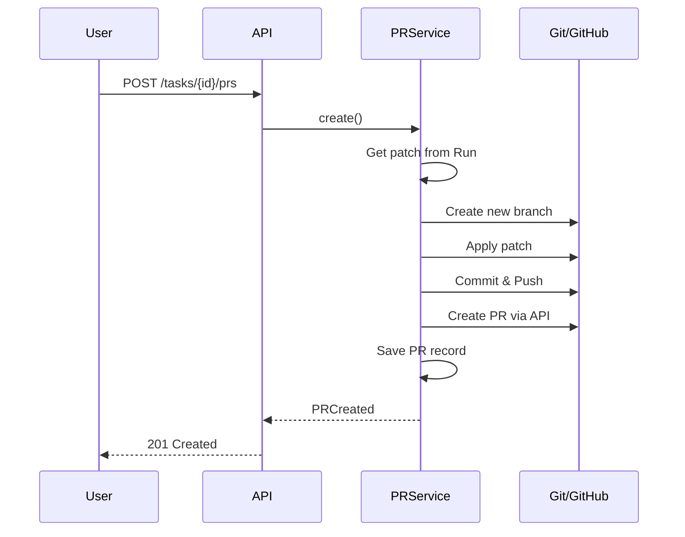
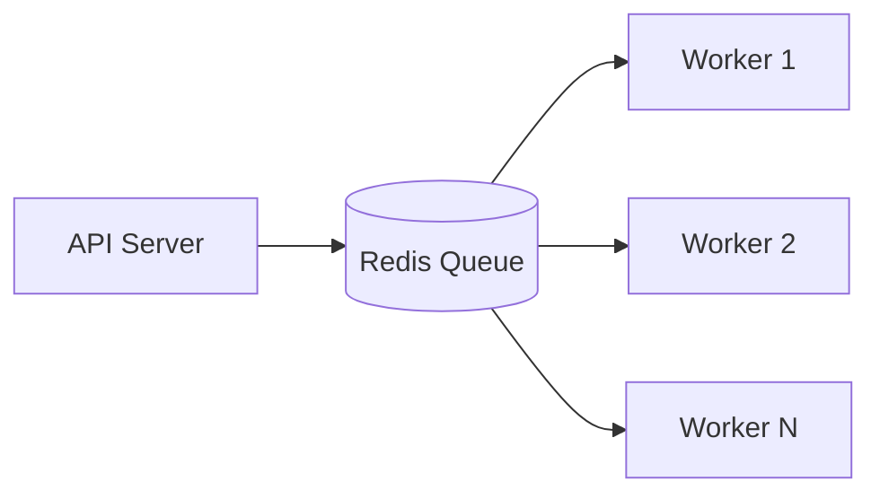
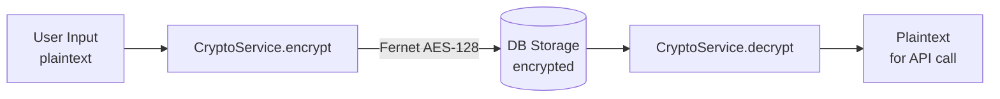
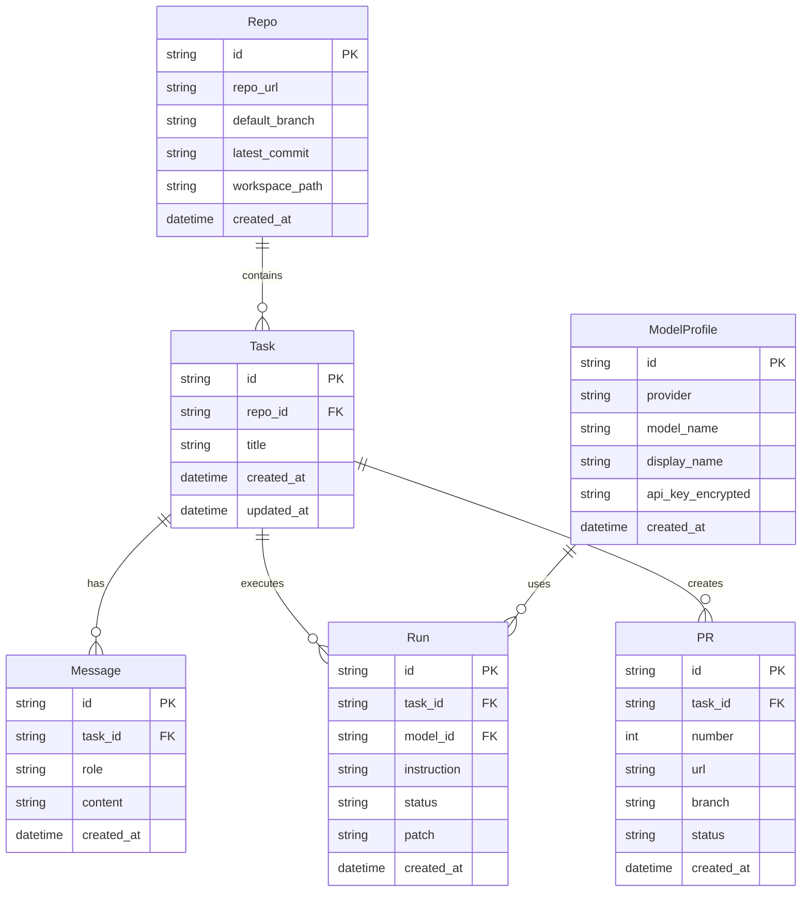

# Architecture Design

## System Overview



## Layer Architecture

### 1. Routes Layer (`routes/`)

Receives HTTP requests and delegates to appropriate services.

```python
# Example: routes/runs.py
@router.post("/tasks/{task_id}/runs")
async def create_runs(
    task_id: str,
    data: RunCreate,
    run_service: RunService = Depends(get_run_service),
) -> RunsCreated:
    runs = await run_service.create_runs(task_id, data)
    return RunsCreated(run_ids=[r.id for r in runs])
```

**Responsibilities**:
- Request validation (Pydantic)
- Authentication/Authorization (planned for v0.2)
- Response formatting

### 2. Services Layer (`services/`)

Implements business logic.

```python
# Example: services/run_service.py
class RunService:
    async def create_runs(self, task_id: str, data: RunCreate) -> list[Run]:
        # 1. Verify task exists
        # 2. Create Run records for each model
        # 3. Enqueue for execution
        # 4. Return run list
```

**Responsibilities**:
- Transaction management
- Domain logic
- Coordination of multiple DAOs

### 3. Agents Layer (`agents/`)

LLM interaction and patch generation.



### 4. Storage Layer (`storage/`)

Data persistence.



## Data Flow

### 1. Run Creation to Completion



### 2. PR Creation Flow



## Parallel Execution Model

### v0.1: In-Memory Queue

```python
class QueueAdapter:
    def __init__(self):
        self._tasks: dict[str, asyncio.Task] = {}

    def enqueue(self, run_id: str, coro: Callable) -> None:
        task = asyncio.create_task(coro())
        self._tasks[run_id] = task
```

**Characteristics**:
- Simple implementation
- Queue lost on server restart
- Operates within single process

### v0.2+: Distributed Queue (Planned)



## Security Architecture

### API Key Encryption



### Workspace Isolation

```
workspaces/
├── {repo_id}/           # Original clone
├── run_{run_id_1}/      # Run copy (deleted after execution)
├── run_{run_id_2}/
└── ...
```

### Forbidden Paths

```python
forbidden_paths = [
    ".git",
    ".env",
    "*.secret",
    "*.key",
    "credentials.*",
]
```

## Scalability Considerations

### Current (v0.1)
- Single process
- SQLite
- In-memory queue

### Future (v0.2+)
- Multiple workers
- PostgreSQL
- Redis/Celery

### Migration Path

```python
# Abstracted interface
class QueueAdapter(ABC):
    @abstractmethod
    def enqueue(self, run_id: str, coro: Callable) -> None: ...

    @abstractmethod
    def cancel(self, run_id: str) -> bool: ...

# v0.1 implementation
class InMemoryQueueAdapter(QueueAdapter): ...

# v0.2 implementation
class CeleryQueueAdapter(QueueAdapter): ...
```

## Entity Relationships


