# Azure Hosting Design for dursor

This document describes the architecture design for hosting dursor on Microsoft Azure.

## Executive Summary

dursor is currently designed as a single-instance, self-hosted application with SQLite persistence and in-memory state management. To deploy on Azure at scale, we need to convert stateful components to distributed alternatives, implement proper authentication, and leverage Azure-native services for reliability and scalability.

## Current Architecture Limitations

| Component | Current State | Cloud Issue |
|-----------|--------------|-------------|
| Database | SQLite (file-based) | No horizontal scaling, single-point-of-failure |
| Task Queue | In-memory asyncio.Task | Lost on restart, no distribution |
| Git Workspaces | Local filesystem | Not shareable across instances |
| Token Cache | In-memory dict | Lost on restart |
| Background Jobs | asyncio Tasks | Not persistent, no failover |
| Authentication | None | No multi-tenant support |

## Proposed Azure Architecture

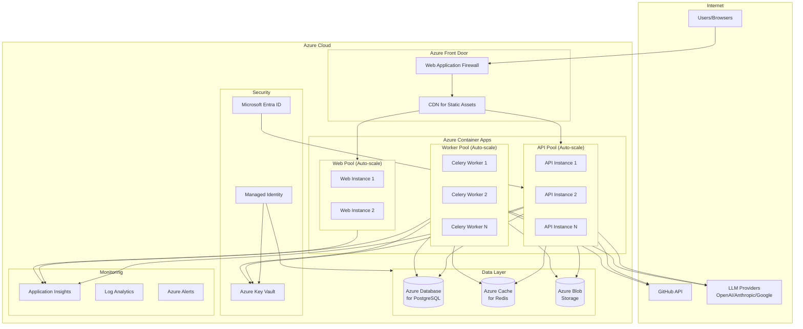

## Component Design

### 1. Compute Layer

#### Azure Container Apps

Recommended over Azure App Service for:
- Native container support
- Built-in auto-scaling with KEDA
- Simplified microservices deployment
- Cost-effective scale-to-zero capability

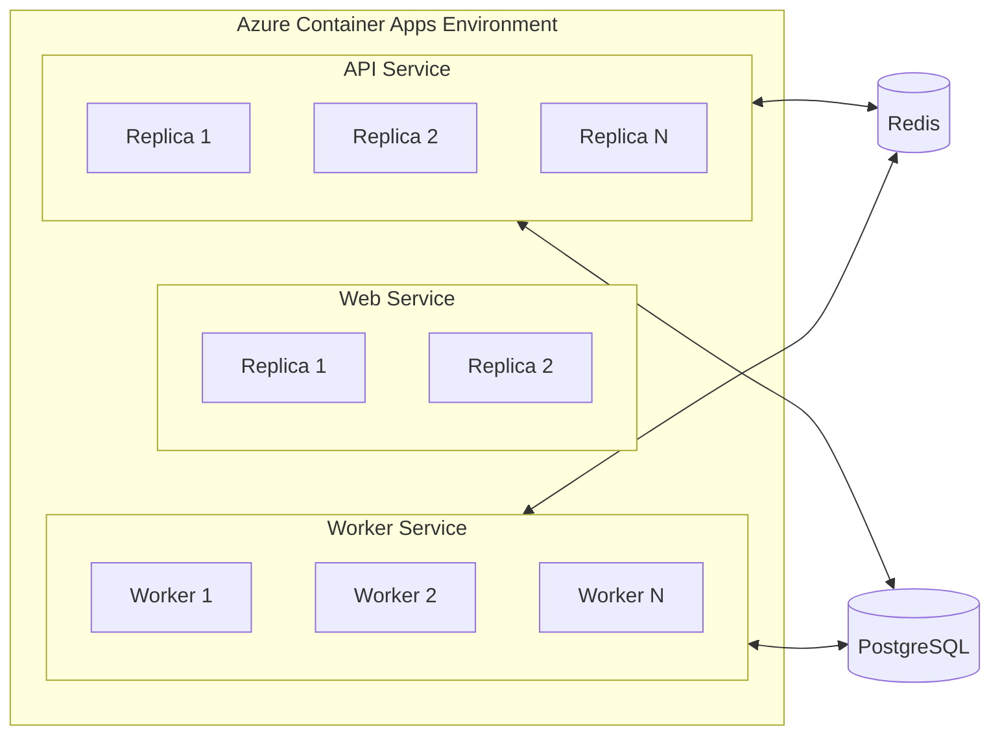

**Configuration:**

| Service | Min Replicas | Max Replicas | CPU | Memory | Scale Trigger |
|---------|-------------|--------------|-----|--------|---------------|
| API | 2 | 10 | 0.5 | 1Gi | HTTP requests |
| Web | 2 | 5 | 0.25 | 512Mi | HTTP requests |
| Worker | 1 | 20 | 1.0 | 2Gi | Redis queue length |

### 2. Database Layer

#### Azure Database for PostgreSQL - Flexible Server

Replace SQLite with PostgreSQL for:
- ACID compliance with horizontal read replicas
- Connection pooling (PgBouncer built-in)
- High availability with automatic failover
- Point-in-time restore

**Schema Migration:**

```sql
-- Key changes from SQLite to PostgreSQL

-- Use SERIAL instead of INTEGER PRIMARY KEY
CREATE TABLE tasks (
    id SERIAL PRIMARY KEY,  -- was: INTEGER PRIMARY KEY
    ...
);

-- Use JSONB instead of TEXT for JSON columns
ALTER TABLE runs
    ALTER COLUMN files_changed TYPE JSONB USING files_changed::JSONB,
    ALTER COLUMN logs TYPE JSONB USING logs::JSONB;

-- Add connection pooling support
-- Configure PgBouncer in Azure Portal
```

**Configuration:**

| Setting | Development | Production |
|---------|-------------|------------|
| SKU | Burstable B1ms | General Purpose D4s_v3 |
| Storage | 32 GB | 256 GB |
| Backup Retention | 7 days | 35 days |
| High Availability | Disabled | Zone-redundant |
| Read Replicas | 0 | 2 |

### 3. Caching Layer

#### Azure Cache for Redis

Replace in-memory caching with Redis for:
- Distributed session/token storage
- Task queue backend (Celery broker)
- Pub/sub for real-time updates
- Rate limiting

**Usage Pattern:**

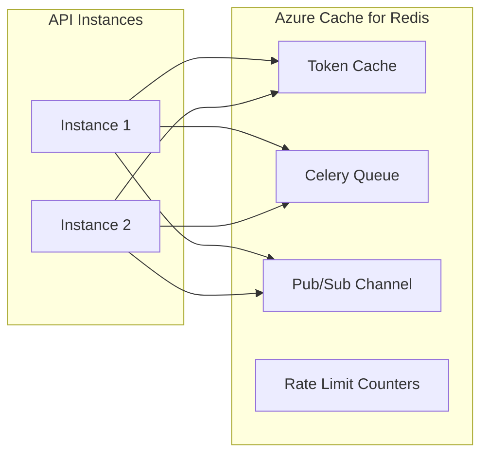

**Configuration:**

| Setting | Development | Production |
|---------|-------------|------------|
| SKU | Basic C0 | Premium P1 |
| Memory | 250 MB | 6 GB |
| Clustering | Disabled | Enabled (3 shards) |
| Geo-replication | No | Yes |

### 4. Storage Layer

#### Azure Blob Storage

Replace local filesystem for git workspaces with:
- Blob storage for repository archives
- Azure Files (SMB/NFS) for worktree mounts if needed
- Lifecycle management for cleanup

**Storage Strategy:**

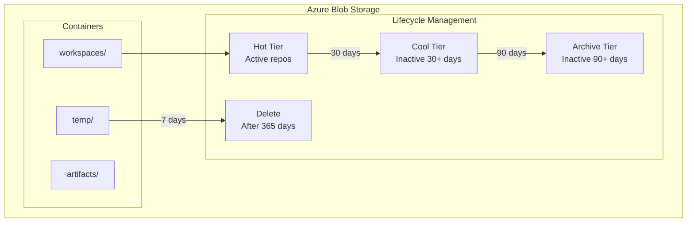

**Container Structure:**

```
dursor-storage/
├── workspaces/
│   └── {repo_uuid}/
│       └── repo.tar.gz          # Compressed repository
├── artifacts/
│   └── {run_id}/
│       └── patch.diff           # Generated patches
└── temp/
    └── {run_id}/
        └── worktree/            # Temporary worktree (Azure Files mount)
```

### 5. Task Queue Architecture

#### Celery + Redis

Replace in-memory asyncio queue with Celery for:
- Persistent task queue
- Distributed worker scaling
- Task retry and dead-letter handling
- Task result backend

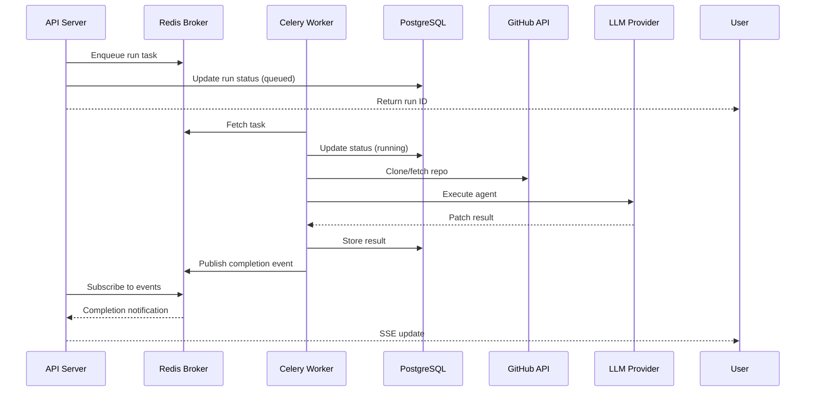

**Celery Configuration:**

```python
# celery_config.py
from celery import Celery

app = Celery(
    'dursor',
    broker='rediss://:password@dursor-redis.redis.cache.windows.net:6380/0',
    backend='rediss://:password@dursor-redis.redis.cache.windows.net:6380/1',
)

app.conf.update(
    task_serializer='json',
    accept_content=['json'],
    result_serializer='json',
    timezone='UTC',
    enable_utc=True,
    task_acks_late=True,
    task_reject_on_worker_lost=True,
    worker_prefetch_multiplier=1,
    task_routes={
        'dursor.tasks.run_agent': {'queue': 'agent'},
        'dursor.tasks.poll_ci': {'queue': 'polling'},
        'dursor.tasks.poll_pr': {'queue': 'polling'},
    },
)
```

### 6. Security Architecture

#### Microsoft Entra ID (Azure AD)

Implement authentication/authorization:

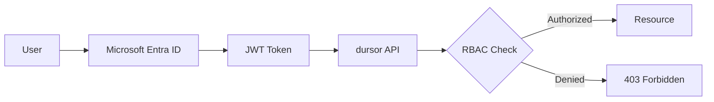

**Authentication Flow:**

1. User authenticates via Microsoft Entra ID
2. Receives JWT token with claims
3. API validates token on each request
4. RBAC determines resource access

**Role Definitions:**

| Role | Permissions |
|------|-------------|
| Admin | Full access, manage users, configure GitHub App |
| Developer | Create tasks, run agents, create PRs |
| Viewer | Read-only access to tasks and PRs |

#### Azure Key Vault

Store sensitive configuration:

| Secret | Purpose |
|--------|---------|
| `dursor-encryption-key` | API key encryption |
| `github-app-private-key` | GitHub App authentication |
| `postgresql-connection-string` | Database connection |
| `redis-connection-string` | Cache connection |

**Access Pattern:**

```python
from azure.identity import DefaultAzureCredential
from azure.keyvault.secrets import SecretClient

credential = DefaultAzureCredential()
client = SecretClient(
    vault_url="https://dursor-vault.vault.azure.net/",
    credential=credential
)

encryption_key = client.get_secret("dursor-encryption-key").value
```

### 7. Networking Architecture

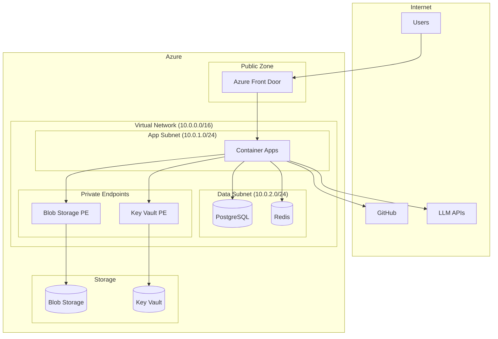

**Network Security:**

- Private endpoints for all Azure PaaS services
- Network Security Groups (NSG) restricting traffic
- Azure Front Door with WAF for DDoS protection
- Service tags for GitHub and LLM provider IPs

### 8. Monitoring and Observability

#### Application Insights

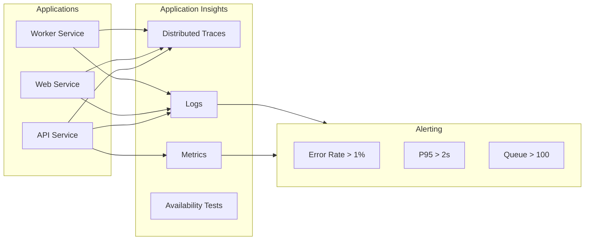

**Key Metrics:**

| Metric | Warning | Critical |
|--------|---------|----------|
| API Error Rate | > 1% | > 5% |
| API P95 Latency | > 2s | > 5s |
| Worker Queue Depth | > 50 | > 200 |
| Database Connections | > 80% | > 95% |
| Redis Memory | > 70% | > 90% |

### 9. Disaster Recovery

**Recovery Objectives:**

| Tier | RTO | RPO | Strategy |
|------|-----|-----|----------|
| Development | 4 hours | 24 hours | Single region, daily backups |
| Production | 15 minutes | 5 minutes | Multi-region, continuous replication |

**Backup Strategy:**

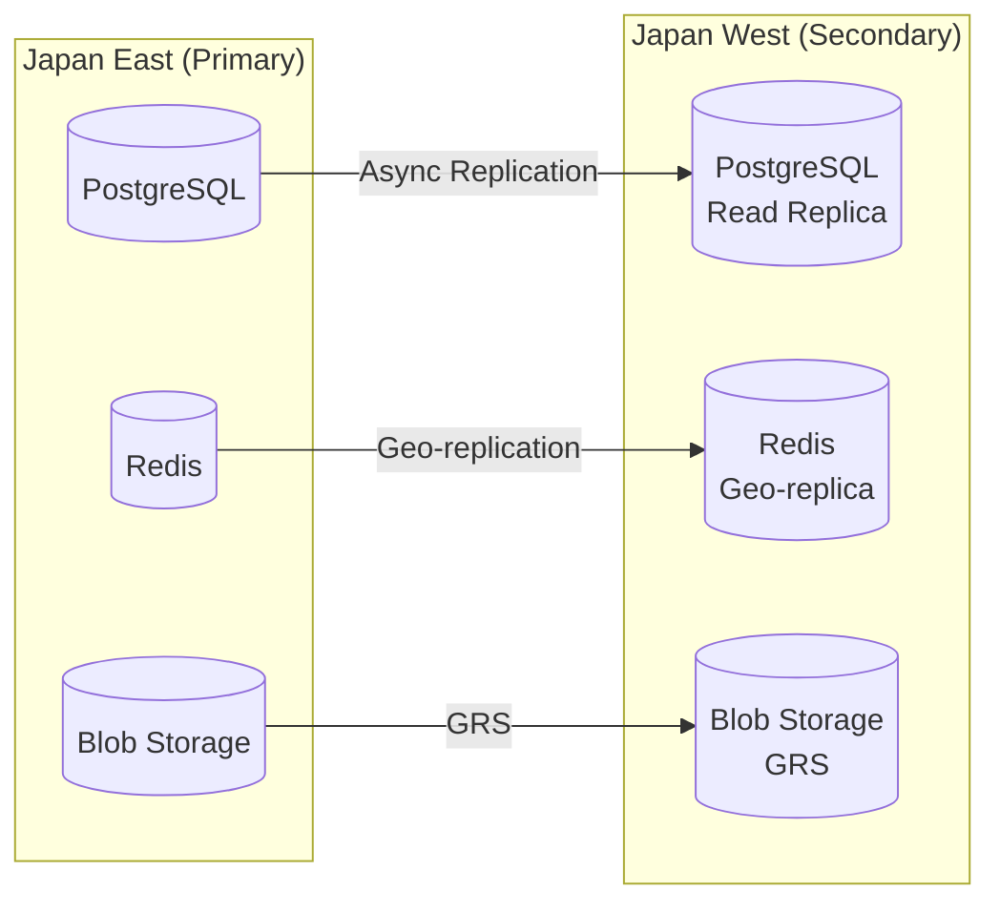

## Environment Configuration

### Development Environment

```yaml
# Container Apps - Development
api:
  minReplicas: 1
  maxReplicas: 2
  resources:
    cpu: 0.25
    memory: 512Mi

web:
  minReplicas: 1
  maxReplicas: 1
  resources:
    cpu: 0.25
    memory: 256Mi

worker:
  minReplicas: 1
  maxReplicas: 3
  resources:
    cpu: 0.5
    memory: 1Gi

# Database - Development
postgresql:
  sku: Burstable_B1ms
  storage: 32GB
  haEnabled: false

# Cache - Development
redis:
  sku: Basic_C0
```

### Production Environment

```yaml
# Container Apps - Production
api:
  minReplicas: 2
  maxReplicas: 10
  resources:
    cpu: 0.5
    memory: 1Gi

web:
  minReplicas: 2
  maxReplicas: 5
  resources:
    cpu: 0.25
    memory: 512Mi

worker:
  minReplicas: 2
  maxReplicas: 20
  resources:
    cpu: 1.0
    memory: 2Gi

# Database - Production
postgresql:
  sku: GeneralPurpose_D4s_v3
  storage: 256GB
  haEnabled: true
  readReplicas: 2

# Cache - Production
redis:
  sku: Premium_P1
  clustering: true
  geoReplication: true
```

## Cost Estimation

### Monthly Cost (JPY)

| Resource | Development | Production |
|----------|-------------|------------|
| Container Apps (API) | ¥5,000 | ¥30,000 |
| Container Apps (Web) | ¥3,000 | ¥15,000 |
| Container Apps (Worker) | ¥8,000 | ¥50,000 |
| PostgreSQL | ¥4,000 | ¥60,000 |
| Redis | ¥3,000 | ¥45,000 |
| Blob Storage | ¥1,000 | ¥10,000 |
| Azure Front Door | ¥5,000 | ¥20,000 |
| Key Vault | ¥500 | ¥2,000 |
| Application Insights | ¥2,000 | ¥15,000 |
| **Total** | **¥31,500** | **¥247,000** |

*Note: Estimates based on moderate usage. Actual costs vary by usage.*

## Migration Plan

### Phase 1: Database Migration

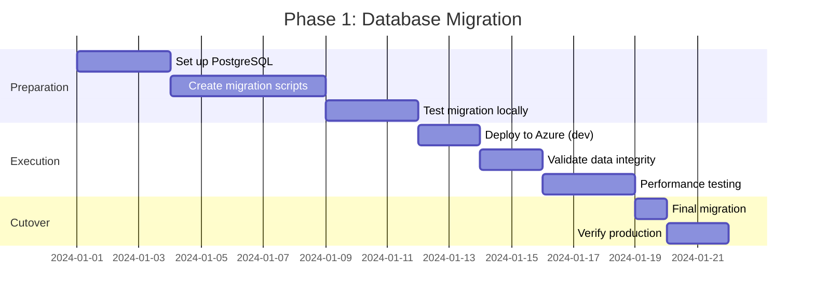

### Phase 2: Queue Migration

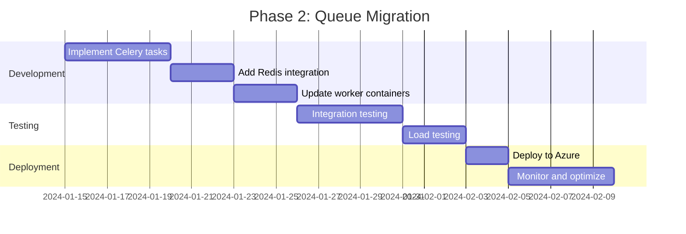

### Phase 3: Storage Migration

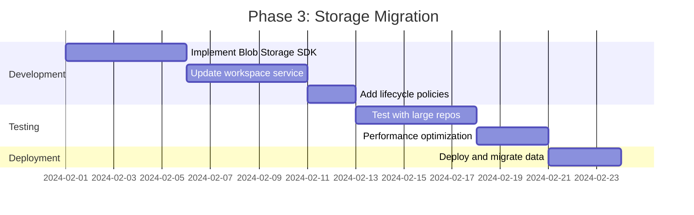

### Phase 4: Security Implementation

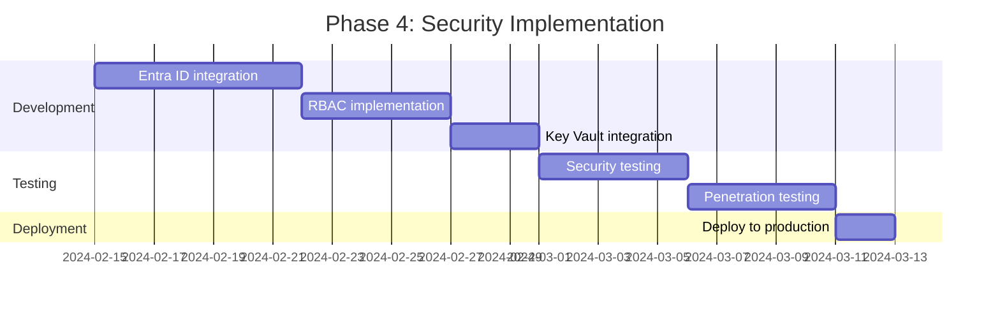

## Infrastructure as Code

### Bicep Template Structure

```
infra/
├── main.bicep                 # Main deployment
├── modules/
│   ├── container-apps.bicep   # Container Apps Environment
│   ├── postgresql.bicep       # PostgreSQL Flexible Server
│   ├── redis.bicep           # Azure Cache for Redis
│   ├── storage.bicep         # Blob Storage Account
│   ├── keyvault.bicep        # Key Vault
│   ├── frontdoor.bicep       # Front Door + WAF
│   ├── monitoring.bicep      # Application Insights
│   └── networking.bicep      # VNet + NSG
├── parameters/
│   ├── dev.bicepparam        # Development parameters
│   └── prod.bicepparam       # Production parameters
└── scripts/
    ├── deploy.sh             # Deployment script
    └── migrate-db.sh         # Database migration
```

### Sample Bicep (Container Apps)

```bicep
// modules/container-apps.bicep
param location string
param environmentName string
param apiImageTag string
param webImageTag string
param workerImageTag string

resource containerAppEnvironment 'Microsoft.App/managedEnvironments@2023-05-01' = {
  name: '${environmentName}-env'
  location: location
  properties: {
    daprAIConnectionString: applicationInsights.properties.ConnectionString
    vnetConfiguration: {
      infrastructureSubnetId: subnet.id
    }
  }
}

resource apiApp 'Microsoft.App/containerApps@2023-05-01' = {
  name: '${environmentName}-api'
  location: location
  properties: {
    managedEnvironmentId: containerAppEnvironment.id
    configuration: {
      ingress: {
        external: true
        targetPort: 8000
      }
      secrets: [
        {
          name: 'db-connection-string'
          keyVaultUrl: 'https://${keyVault.name}.vault.azure.net/secrets/postgresql-connection-string'
          identity: managedIdentity.id
        }
      ]
    }
    template: {
      containers: [
        {
          name: 'api'
          image: 'dursor.azurecr.io/api:${apiImageTag}'
          resources: {
            cpu: json('0.5')
            memory: '1Gi'
          }
          env: [
            {
              name: 'DATABASE_URL'
              secretRef: 'db-connection-string'
            }
          ]
        }
      ]
      scale: {
        minReplicas: 2
        maxReplicas: 10
        rules: [
          {
            name: 'http-scaling'
            http: {
              metadata: {
                concurrentRequests: '100'
              }
            }
          }
        ]
      }
    }
  }
}
```

## Conclusion

This design provides a scalable, secure, and cost-effective Azure deployment for dursor. Key benefits:

1. **Scalability**: Auto-scaling Container Apps with Celery workers handle variable load
2. **Reliability**: Multi-AZ PostgreSQL and Redis with automatic failover
3. **Security**: Entra ID authentication, Key Vault secrets, private endpoints
4. **Observability**: Full Application Insights integration with alerting
5. **Cost Efficiency**: Scale-to-zero capabilities minimize development costs

The migration can be executed incrementally, starting with database migration and progressively adding distributed components.
