# dursor Azure ホスティング設計書

本ドキュメントは dursor を Microsoft Azure 上にホスティングするためのアーキテクチャ設計を記載します。

## エグゼクティブサマリー

dursor は現在、SQLite による永続化とインメモリ状態管理を持つ単一インスタンス・セルフホスト型アプリケーションとして設計されています。Azure 上でスケーラブルにデプロイするには、ステートフルなコンポーネントを分散システム向けに置き換え、適切な認証を実装し、Azure ネイティブサービスを活用する必要があります。

## 現状アーキテクチャの課題

| コンポーネント | 現状 | クラウド移行時の課題 |
|--------------|------|---------------------|
| データベース | SQLite（ファイルベース） | 水平スケーリング不可、単一障害点 |
| タスクキュー | インメモリ asyncio.Task | 再起動で消失、分散不可 |
| Git ワークスペース | ローカルファイルシステム | インスタンス間で共有不可 |
| トークンキャッシュ | インメモリ dict | 再起動で消失 |
| バックグラウンドジョブ | asyncio Tasks | 永続化なし、フェイルオーバー不可 |
| 認証 | なし | マルチテナント非対応 |

## 技術選定: Azure マネージドサービス比較

dursor のクラウド移行にあたり、フロントエンド層、API 層、オーケストレーション層それぞれで利用可能な Azure マネージドサービスを包括的に比較します。

### フロントエンド層の技術選定

Next.js アプリケーション（apps/web）をホスティングするサービスの比較です。

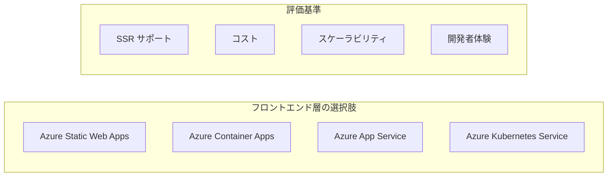

#### 比較表: フロントエンド層

| 観点 | Static Web Apps | Container Apps | App Service | AKS |
|-----|-----------------|----------------|-------------|-----|
| **Next.js SSR** | ○ ハイブリッド対応 | ◎ フルサポート | ◎ フルサポート | ◎ フルサポート |
| **デプロイ容易性** | ◎ GitHub 連携自動 | ○ コンテナビルド必要 | ○ 複数方式対応 | △ Helm/kubectl |
| **コールドスタート** | あり | 設定で回避可 | なし（Always On） | なし |
| **カスタムドメイン** | ◎ 無料 SSL | ◎ 無料 SSL | ○ 有料プランで対応 | ○ Ingress 設定 |
| **月額コスト（目安）** | 無料〜¥1,500 | ¥3,000〜 | ¥1,500〜¥15,000 | ¥15,000〜 |
| **スケーリング** | 自動 | KEDA 対応 | 手動/自動 | HPA/VPA |
| **リージョン配置** | グローバルエッジ | 単一リージョン | 単一リージョン | 単一リージョン |
| **運用負荷** | ◎ 最小 | ○ 低 | ○ 中 | △ 高 |
| **API 統合** | Functions 連携 | 同一環境内通信 | 同一 App Service Plan | Service mesh |

#### 各サービスの詳細評価

**Azure Static Web Apps**
```
メリット:
- 無料プランあり（個人/小規模向け）
- GitHub Actions との自動連携
- グローバル CDN 配信
- API として Azure Functions を統合可能
- カスタムドメイン + SSL 無料

デメリット:
- SSR の制限（一部機能非対応の可能性）
- ビルド時間制限あり
- 高度なサーバーサイド処理に不向き
```

**Azure Container Apps**
```
メリット:
- Next.js standalone モードのフルサポート
- API と同一環境で運用可能
- Dapr によるサービス間通信
- scale-to-zero でコスト最適化

デメリット:
- コンテナビルドが必要
- Static Web Apps より高コスト
- CDN は別途 Front Door が必要
```

**Azure App Service**
```
メリット:
- 成熟したプラットフォーム
- デプロイスロットによる Blue-Green デプロイ
- Always On でコールドスタートなし
- VNet 統合が容易

デメリット:
- コンテナ対応は制限あり
- スケーリングが Container Apps より柔軟性低
- 最小コストが高め
```

**Azure Kubernetes Service (AKS)**
```
メリット:
- 最大の柔軟性
- マルチクラウド対応（ポータビリティ）
- 高度なトラフィック制御

デメリット:
- 運用負荷が最も高い
- 小規模には過剰
- 学習コストが高い
```

#### フロントエンド層の推奨

| シナリオ | 推奨サービス | 理由 |
|---------|------------|------|
| **コスト最優先** | Static Web Apps | 無料プランあり、自動デプロイ |
| **フル機能 SSR** | Container Apps | Next.js の全機能対応、API と統合 |
| **エンタープライズ** | App Service | SLA 99.95%、デプロイスロット |
| **マルチクラウド** | AKS | Kubernetes 標準、ベンダー非依存 |

**dursor での推奨: Container Apps**

理由:
1. API 層と同一環境でシンプルな構成
2. Next.js standalone のフルサポート
3. 将来的なスケーリング対応
4. コスト効率（scale-to-zero）

---

### API 層の技術選定

FastAPI アプリケーション（apps/api）をホスティングするサービスの比較です。

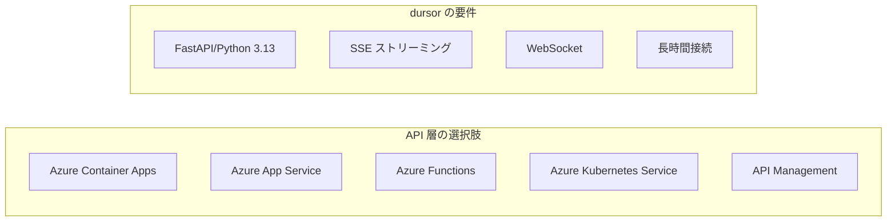

#### 比較表: API 層

| 観点 | Container Apps | App Service | Functions | AKS |
|-----|----------------|-------------|-----------|-----|
| **FastAPI 対応** | ◎ ネイティブ | ◎ ネイティブ | △ カスタムハンドラー | ◎ ネイティブ |
| **Python 3.13** | ◎ コンテナで自由 | ○ プレビュー対応 | △ 3.11 まで | ◎ コンテナで自由 |
| **SSE サポート** | ◎ 対応 | ◎ 対応 | △ 制限あり | ◎ 対応 |
| **WebSocket** | ◎ 対応 | ◎ 対応 | × 非対応 | ◎ 対応 |
| **リクエストタイムアウト** | 最大 4 分（延長可） | 230 秒 | 10 分（Premium） | 無制限 |
| **スケーリング** | ◎ KEDA | ○ 自動/手動 | ◎ イベント駆動 | ◎ HPA |
| **VNet 統合** | ◎ 標準 | ○ Premium で対応 | ○ Premium で対応 | ◎ 標準 |
| **月額コスト（目安）** | ¥5,000〜 | ¥8,000〜 | 実行時間課金 | ¥20,000〜 |
| **コンテナサポート** | ◎ ネイティブ | ○ Linux のみ | △ カスタムコンテナ | ◎ ネイティブ |
| **デバッグ容易性** | ○ ログストリーム | ◎ 豊富なツール | ○ ローカルデバッグ | △ 複雑 |

#### 各サービスの詳細評価

**Azure Container Apps**
```
メリット:
- Kubernetes ベースだが運用が簡単
- KEDA による柔軟なスケーリング
- Dapr 統合でサービス間通信が容易
- scale-to-zero 対応
- リビジョン管理による Blue-Green デプロイ

デメリット:
- App Service より新しく、一部機能が発展途上
- 診断ツールが App Service ほど充実していない
- Windows コンテナ非対応
```

**Azure App Service**
```
メリット:
- 最も成熟したPaaS
- 豊富な診断・監視ツール
- デプロイスロット（ステージング環境）
- 自動パッチ適用
- SLA 99.95%

デメリット:
- スケーリングの柔軟性が低い
- scale-to-zero 非対応（コスト効率悪い）
- コンテナサポートが Container Apps より限定的
```

**Azure Functions**
```
メリット:
- サーバーレスで運用負荷最小
- 実行時間課金でコスト効率
- イベント駆動アーキテクチャに最適
- Durable Functions との統合

デメリット:
- FastAPI との親和性が低い（カスタムハンドラー必要）
- WebSocket 非対応
- コールドスタート問題
- ステートフルな処理に不向き
```

**Azure Kubernetes Service (AKS)**
```
メリット:
- 最大の柔軟性と制御
- 複雑なマイクロサービスに対応
- Istio 等のサービスメッシュ
- マルチクラウドポータビリティ

デメリット:
- 運用負荷が最も高い
- 学習コストが高い
- 小〜中規模には過剰
```

#### API 層の推奨

| シナリオ | 推奨サービス | 理由 |
|---------|------------|------|
| **バランス重視** | Container Apps | FastAPI フルサポート、運用負荷低 |
| **安定性重視** | App Service | 成熟したプラットフォーム、豊富なツール |
| **コスト最優先** | Functions | 実行時間課金（ただし制限あり） |
| **大規模/複雑** | AKS | 最大の柔軟性、マイクロサービス |

**dursor での推奨: Container Apps**

理由:
1. FastAPI + Python 3.13 のネイティブサポート
2. SSE/WebSocket 対応（長時間エージェント実行の進捗通知）
3. KEDA による負荷連動スケーリング
4. フロントエンドと同一環境で構成がシンプル
5. Dapr でサービス間通信が容易

---

### オーケストレーション層の技術選定

長時間実行タスク（Claude Code/Codex: 5〜30 分）を管理するサービスの比較です。

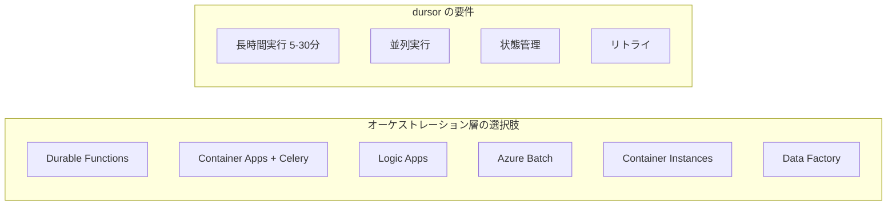

#### 比較表: オーケストレーション層

| 観点 | Durable Functions | Container Apps + Celery | Logic Apps | Azure Batch | ACI Direct |
|-----|-------------------|------------------------|------------|-------------|------------|
| **長時間実行** | Premium で無制限 | ◎ 無制限 | ○ 90日まで | ◎ 無制限 | ◎ 無制限 |
| **状態管理** | ◎ 自動永続化 | △ 自前実装 | ◎ 自動 | △ 自前実装 | × なし |
| **チェックポイント** | ◎ 組み込み | △ 自前実装 | ○ ワークフロー | × なし | × なし |
| **Fan-out/Fan-in** | ◎ 組み込み | ○ Celery group | ◎ 並列分岐 | ◎ タスク並列 | △ 手動管理 |
| **コンテナ実行** | △ カスタム必要 | ◎ ネイティブ | △ コネクタ経由 | ◎ ネイティブ | ◎ ネイティブ |
| **コスト（低負荷）** | ◎ 実行時間課金 | △ 常時起動コスト | ○ 実行回数課金 | ○ VM時間課金 | ◎ 秒単位課金 |
| **コスト（高負荷）** | △ 高額になりやすい | ○ 予測しやすい | △ 高額になりやすい | ◎ バッチ最適化 | ○ 予測しやすい |
| **リトライ機能** | ◎ 宣言的設定 | ○ Celery 設定 | ◎ 組み込み | ○ タスク設定 | × なし |
| **監視/可視化** | ◎ Durable Monitor | ○ Flower/カスタム | ◎ デザイナー | ○ Batch Explorer | △ 手動 |
| **学習コスト** | 中〜高 | 低〜中 | 低 | 中 | 低 |
| **ベンダーロックイン** | 高 | 低 | 高 | 中 | 低 |

#### 各サービスの詳細評価

**Azure Durable Functions**
```
メリット:
- オーケストレーションパターンの組み込みサポート
  - Fan-out/Fan-in（並列実行→集約）
  - Human Interaction（承認待ち）
  - Monitor（ポーリング）
  - Async HTTP API
- 自動チェックポイントとリプレイ
- Azure Storage による状態永続化
- 進捗クエリ API が標準提供

デメリット:
- Consumption プラン: 10分制限（Premium 必須）
- コンテナ実行にはカスタムハンドラーが必要
- コールドスタート問題（Premium で軽減）
- Azure 固有（ベンダーロックイン）

コスト例（Premium プラン）:
- 最小インスタンス: ¥15,000/月〜
- 実行時間: ¥0.000016/GB-秒
```

**Container Apps + Celery**
```
メリット:
- 標準的なアーキテクチャ（ポータビリティ）
- コンテナネイティブで CLI 実行が容易
- Redis/RabbitMQ など選択可能
- 実行時間制限なし
- コスト予測しやすい

デメリット:
- 状態管理を自前実装
- Redis/Celery の運用が必要
- 最小レプリカ分のコストが常時発生

コスト例:
- Worker (min 1): ¥8,000/月〜
- Redis (Basic): ¥3,000/月〜
```

**Azure Logic Apps**
```
メリット:
- ローコード/ノーコードでワークフロー構築
- 400+ のコネクタ（外部サービス連携）
- 視覚的なデザイナー
- Standard プランは VNet 統合可能

デメリット:
- プログラマティックな処理に不向き
- コンテナ実行が間接的
- 複雑なロジックは Expression で記述（可読性低）
- 高頻度実行でコスト増大

コスト例:
- アクション実行: ¥0.0025/回〜
- 高頻度: 月数万円になる可能性
```

**Azure Batch**
```
メリット:
- 大規模バッチ処理に最適化
- 低優先度 VM でコスト削減
- タスク依存関係の管理
- ジョブスケジューリング

デメリット:
- インタラクティブな処理に不向き
- VM プロビジョニングに時間がかかる
- リアルタイム性が低い

コスト例:
- VM 時間（D2s_v3）: ¥10/時間〜
- 低優先度: 最大 80% 割引
```

**Azure Container Instances (ACI) Direct**
```
メリット:
- 最もシンプルなコンテナ実行
- 秒単位課金
- 起動が高速（数秒）
- GPU 対応

デメリット:
- オーケストレーション機能なし
- 状態管理は完全に自前
- リトライ機能なし

コスト例:
- vCPU: ¥0.0015/秒
- メモリ: ¥0.00017/GB-秒
- 30分実行: 約¥3
```

#### オーケストレーションパターン比較

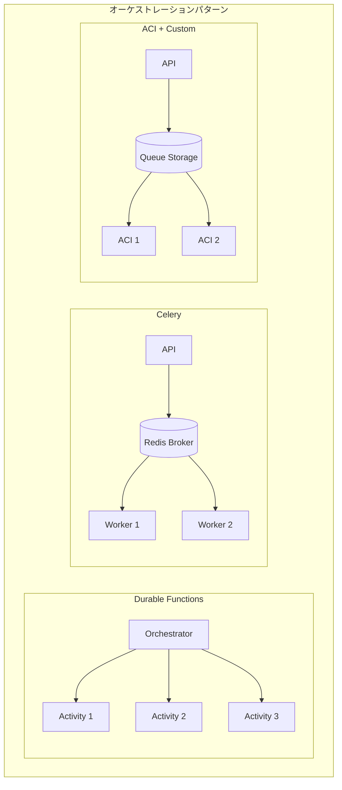

#### オーケストレーション層の推奨

| シナリオ | 推奨サービス | 理由 |
|---------|------------|------|
| **信頼性最優先** | Durable Functions | 自動状態管理、チェックポイント |
| **シンプルさ重視** | Container Apps + Celery | 標準的、学習コスト低 |
| **コスト最優先** | ACI Direct | 秒単位課金、実行時のみ |
| **ローコード** | Logic Apps | ビジュアルデザイナー |
| **大規模バッチ** | Azure Batch | バッチ処理最適化 |

**dursor での推奨: シナリオ別**

| dursor のユースケース | 推奨 |
|---------------------|------|
| **MVP/初期段階** | Container Apps + Celery |
| **本番運用（中規模）** | Durable Functions + ACI |
| **本番運用（大規模）** | Durable Functions + Azure Batch |

---

### 総合推奨アーキテクチャ

各層の選定結果を踏まえた推奨構成です。

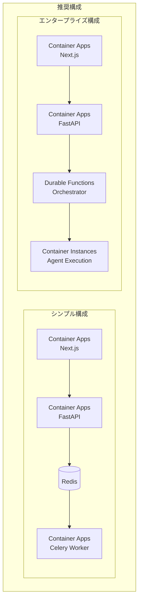

#### 構成別コスト比較（月額目安）

| 構成 | フロントエンド | API | オーケストレーション | 合計（開発） | 合計（本番） |
|-----|--------------|-----|-------------------|------------|------------|
| **シンプル** | Container Apps ¥3,000 | Container Apps ¥5,000 | Celery + Redis ¥11,000 | ¥19,000 | ¥80,000 |
| **エンタープライズ** | Container Apps ¥3,000 | Container Apps ¥5,000 | Durable Functions ¥15,000 | ¥23,000 | ¥120,000 |
| **最小コスト** | Static Web Apps ¥0 | Functions ¥1,000 | ACI Direct ¥2,000 | ¥3,000 | ¥30,000 |

#### 最終推奨

| 層 | 推奨サービス | 代替案 |
|----|------------|--------|
| **フロントエンド** | Azure Container Apps | Static Web Apps（コスト重視） |
| **API** | Azure Container Apps | App Service（安定性重視） |
| **オーケストレーション** | Durable Functions + ACI | Celery（シンプルさ重視） |

**選定理由サマリー:**

1. **Container Apps をベースに統一**: 運用の一貫性、Dapr によるサービス間通信
2. **Durable Functions でオーケストレーション**: 状態管理・リトライの組み込みサポート
3. **ACI でエージェント実行**: 分離環境、秒単位課金、長時間実行対応

## 提案する Azure アーキテクチャ

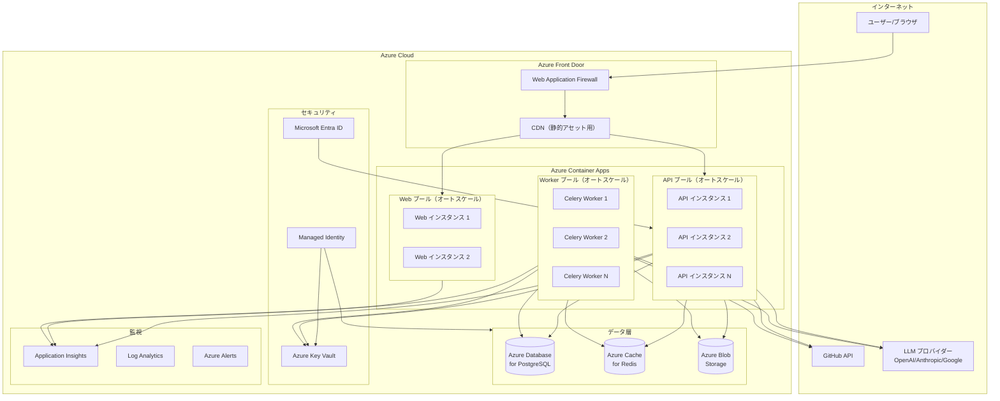

## コンポーネント設計

### 1. コンピュート層

#### Azure Container Apps

Azure App Service より推奨される理由：
- ネイティブコンテナサポート
- KEDA による組み込みオートスケーリング
- マイクロサービスデプロイの簡素化
- コスト効率の良い scale-to-zero 機能

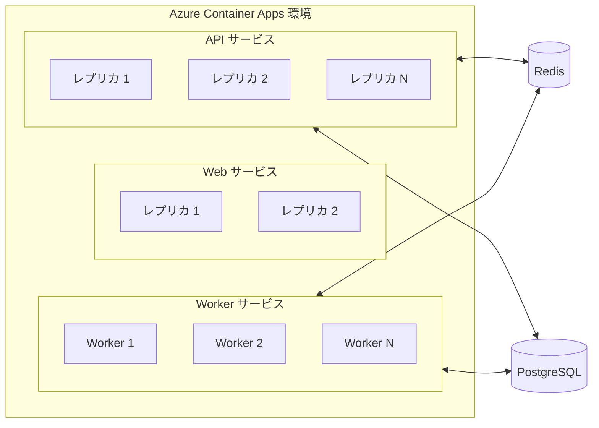

**構成:**

| サービス | 最小レプリカ | 最大レプリカ | CPU | メモリ | スケールトリガー |
|---------|------------|------------|-----|--------|----------------|
| API | 2 | 10 | 0.5 | 1Gi | HTTP リクエスト |
| Web | 2 | 5 | 0.25 | 512Mi | HTTP リクエスト |
| Worker | 1 | 20 | 1.0 | 2Gi | Redis キュー長 |

#### コンピュート選択: Container Apps vs Durable Functions

長時間実行タスク（Claude Code/Codex の 5〜30 分実行）を扱うにあたり、Azure Durable Functions も有力な候補です。以下で比較検討します。

**アーキテクチャ比較:**

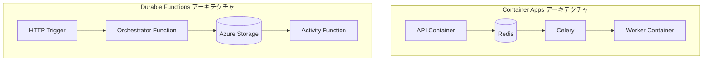

**詳細比較:**

| 観点 | Container Apps + Celery | Durable Functions |
|-----|------------------------|-------------------|
| **実行時間制限** | 無制限（Worker は常時起動） | Consumption: 10分 / Premium: 無制限 |
| **状態管理** | Redis + PostgreSQL で自前実装 | Azure Storage に自動永続化 |
| **チェックポイント** | 自前実装が必要 | 組み込み（自動リプレイ） |
| **リトライ/エラー処理** | Celery で設定 | 宣言的に設定可能 |
| **スケーリング** | KEDA ベース | 自動（イベント駆動） |
| **コールドスタート** | minReplicas > 0 で回避 | Premium プランで回避 |
| **CLI 実行** | ネイティブサポート | カスタムコンテナが必要 |
| **デバッグ容易性** | コンテナログ | Durable Functions Monitor |
| **コスト（低負荷時）** | 最小レプリカ分のコスト | Consumption は実行時間課金 |
| **コスト（高負荷時）** | 予測しやすい | スパイクで高額になる可能性 |
| **学習コスト** | 低（標準的なアーキテクチャ） | 中〜高（独自の概念） |

**Durable Functions の利点:**

1. **組み込みの状態管理**: オーケストレーター関数の状態は自動的に Azure Storage に永続化
2. **チェックポイント/リプレイ**: 長時間実行中に障害が発生しても自動復旧
3. **Fan-out/Fan-in パターン**: 複数モデル並列実行が宣言的に記述可能
4. **Human Interaction パターン**: 承認待ちなどのワークフローが組み込み
5. **インフラ管理の削減**: Redis/Celery のセットアップ不要

**Durable Functions の課題:**

1. **実行時間制限**: Consumption プランは 10 分制限（Premium 必須）
2. **コンテナ実行**: Claude Code CLI の実行にはカスタムコンテナが必要
3. **コールドスタート**: Premium でも初回起動に時間がかかる
4. **ベンダーロックイン**: Azure 固有の実装

**Durable Functions アーキテクチャ案:**

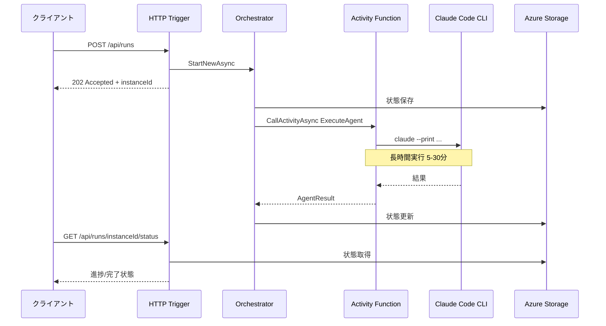

**Durable Functions 実装例:**

```python
# function_app.py
import azure.functions as func
import azure.durable_functions as df

app = func.FunctionApp()

# HTTP Trigger - タスク開始
@app.route(route="runs", methods=["POST"])
@app.durable_client_input(client_name="client")
async def start_run(req: func.HttpRequest, client: df.DurableOrchestrationClient):
    payload = req.get_json()
    instance_id = await client.start_new("agent_orchestrator", client_input=payload)
    return client.create_check_status_response(req, instance_id)

# Orchestrator - ワークフロー制御
@app.orchestration_trigger(context_name="context")
def agent_orchestrator(context: df.DurableOrchestrationContext):
    payload = context.get_input()

    # エージェント実行（長時間）
    result = yield context.call_activity("execute_agent", payload)

    # レビュー実行（オプション）
    if payload.get("enable_review"):
        review = yield context.call_activity("execute_review", result)
        result["review"] = review

    return result

# Activity - 実際の処理
@app.activity_trigger(input_name="payload")
async def execute_agent(payload: dict) -> dict:
    # Claude Code CLI 実行
    workspace_path = payload["workspace_path"]
    instruction = payload["instruction"]

    process = await asyncio.create_subprocess_exec(
        "claude", "--print", "--output-format", "json",
        "-p", instruction,
        cwd=workspace_path,
        stdout=asyncio.subprocess.PIPE,
        stderr=asyncio.subprocess.PIPE,
    )
    stdout, stderr = await process.communicate()

    return {
        "status": "completed",
        "patch": parse_result(stdout),
    }
```

**推奨: ハイブリッドアーキテクチャ**

dursor のユースケースでは、以下のハイブリッドアーキテクチャを推奨します：

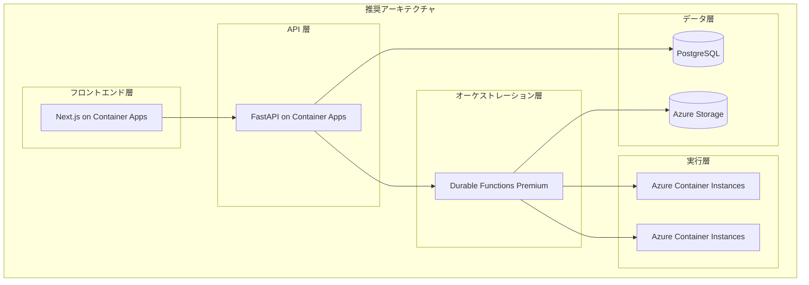

**ハイブリッドの利点:**

| コンポーネント | 選択 | 理由 |
|--------------|------|------|
| API サーバー | Container Apps | FastAPI の柔軟性、既存コードの活用 |
| Web フロントエンド | Container Apps | Next.js のネイティブサポート |
| タスクオーケストレーション | Durable Functions | 状態管理、リトライ、Fan-out の組み込みサポート |
| エージェント実行 | Container Instances (ACI) | 長時間実行、分離環境、コスト効率 |

**最終推奨:**

| シナリオ | 推奨 |
|---------|------|
| **シンプルさ重視** | Container Apps + Celery |
| **信頼性重視** | Durable Functions + ACI |
| **コスト重視（低負荷）** | Durable Functions Consumption |
| **バランス重視** | Container Apps (API) + Durable Functions (Orchestration) |

本設計書では **Container Apps + Celery** をベースラインとして記載していますが、信頼性や運用負荷の観点から **Durable Functions** への移行も検討に値します。特に以下の場合は Durable Functions を推奨：

- 複数エージェントの並列実行が多い
- 承認ワークフローが必要
- 障害時の自動復旧が重要
- Redis/Celery の運用コストを削減したい

### 2. データベース層

#### Azure Database for PostgreSQL - Flexible Server

SQLite を PostgreSQL に置き換える理由：
- 水平読み取りレプリカによる ACID 準拠
- コネクションプーリング（PgBouncer 組み込み）
- 自動フェイルオーバーによる高可用性
- ポイントインタイムリストア

**スキーママイグレーション:**

```sql
-- SQLite から PostgreSQL への主な変更点

-- INTEGER PRIMARY KEY の代わりに SERIAL を使用
CREATE TABLE tasks (
    id SERIAL PRIMARY KEY,  -- 旧: INTEGER PRIMARY KEY
    ...
);

-- TEXT の代わりに JSONB を使用（JSON カラム）
ALTER TABLE runs
    ALTER COLUMN files_changed TYPE JSONB USING files_changed::JSONB,
    ALTER COLUMN logs TYPE JSONB USING logs::JSONB;

-- コネクションプーリングサポートの追加
-- Azure Portal で PgBouncer を設定
```

**構成:**

| 設定 | 開発環境 | 本番環境 |
|-----|---------|---------|
| SKU | Burstable B1ms | General Purpose D4s_v3 |
| ストレージ | 32 GB | 256 GB |
| バックアップ保持期間 | 7 日 | 35 日 |
| 高可用性 | 無効 | ゾーン冗長 |
| 読み取りレプリカ | 0 | 2 |

### 3. キャッシュ層

#### Azure Cache for Redis

インメモリキャッシュを Redis に置き換える理由：
- 分散セッション/トークンストレージ
- タスクキューバックエンド（Celery ブローカー）
- リアルタイム更新のための Pub/Sub
- レート制限

**使用パターン:**

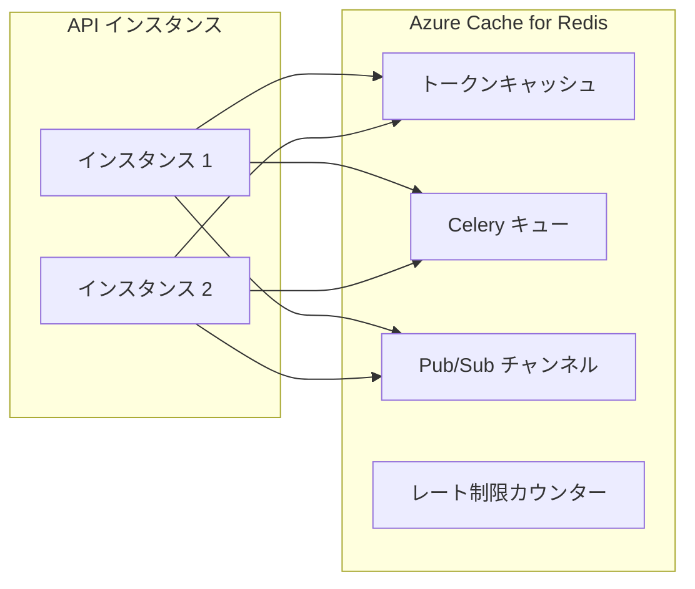

**構成:**

| 設定 | 開発環境 | 本番環境 |
|-----|---------|---------|
| SKU | Basic C0 | Premium P1 |
| メモリ | 250 MB | 6 GB |
| クラスタリング | 無効 | 有効（3 シャード） |
| Geo レプリケーション | なし | あり |

### 4. ストレージ層

#### Azure Blob Storage

ローカルファイルシステムを以下で置き換え：
- リポジトリアーカイブ用の Blob Storage
- worktree マウント用の Azure Files（SMB/NFS）（必要に応じて）
- クリーンアップのためのライフサイクル管理

**ストレージ戦略:**

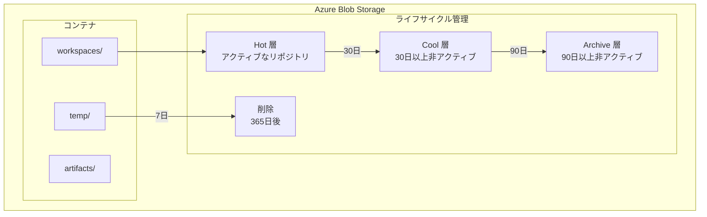

**コンテナ構造:**

```
dursor-storage/
├── workspaces/
│   └── {repo_uuid}/
│       └── repo.tar.gz          # 圧縮されたリポジトリ
├── artifacts/
│   └── {run_id}/
│       └── patch.diff           # 生成されたパッチ
└── temp/
    └── {run_id}/
        └── worktree/            # 一時的な worktree（Azure Files マウント）
```

### 5. 長時間実行タスクの非同期通信アーキテクチャ

Claude Code や Codex などの AI エージェントは実行に数分〜数十分かかるため、特別な非同期通信設計が必要です。

#### 課題

| 課題 | 説明 |
|-----|------|
| 実行時間 | Claude Code/Codex は 5〜30 分以上かかることがある |
| HTTP タイムアウト | Azure Front Door のデフォルトタイムアウトは 30 秒 |
| コネクション維持 | 長時間の HTTP 接続は不安定 |
| スケールアウト | 実行中にインスタンスが変わる可能性 |

#### 解決策: Celery + Redis Pub/Sub + SSE

**Container Apps は長時間実行タスクに対応可能です。** ただし、以下の設計パターンを採用する必要があります：

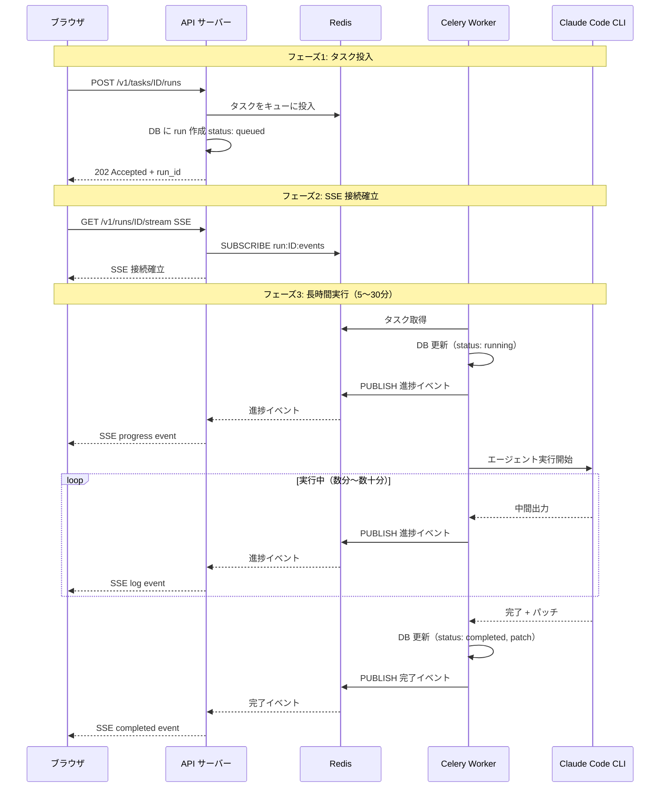

#### Azure Container Apps での SSE 設定

**重要:** Azure Container Apps は SSE（Server-Sent Events）をネイティブでサポートしています。

```yaml
# Container Apps Ingress 設定
ingress:
  external: true
  targetPort: 8000
  transport: http
  # SSE 用の設定
  clientRequestTimeout: 3600  # 1時間（SSE 接続用）
```

**Azure Front Door 設定:**

```bicep
// SSE 対応のための Front Door 設定
resource frontDoorRoute 'Microsoft.Cdn/profiles/afdEndpoints/routes@2023-05-01' = {
  properties: {
    originGroup: {
      id: originGroup.id
    }
    // SSE 用のタイムアウト延長
    forwardingProtocol: 'HttpOnly'
    // レスポンスタイムアウト: 最大 240 秒
    // ただし SSE は chunked なので実質無制限
  }
}
```

#### 代替案: WebSocket

SSE が不安定な場合は WebSocket を検討：

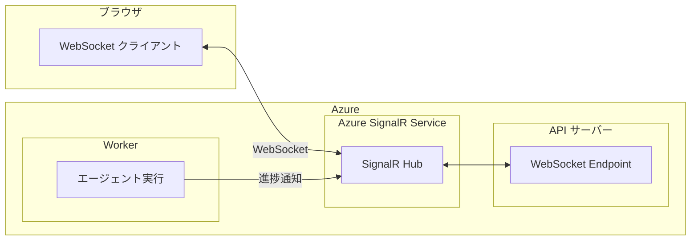

**Azure SignalR Service の利点:**
- マネージドな WebSocket インフラ
- 自動スケーリング
- 接続の永続化と再接続処理
- Container Apps との統合が容易

#### 推奨パターン: ハイブリッドアプローチ

```python
# routes/runs.py - 長時間実行タスクの SSE エンドポイント

from fastapi import APIRouter, Request
from fastapi.responses import StreamingResponse
import redis.asyncio as redis
import json

router = APIRouter()

@router.get("/v1/runs/{run_id}/stream")
async def stream_run_events(run_id: str, request: Request):
    """
    長時間実行タスクのリアルタイムストリーミング

    - Redis Pub/Sub でイベントを購読
    - SSE 形式でクライアントに配信
    - クライアント切断を検知して購読解除
    """
    async def event_generator():
        redis_client = redis.from_url("rediss://...")
        pubsub = redis_client.pubsub()
        await pubsub.subscribe(f"run:{run_id}:events")

        try:
            # 初期状態を送信
            run = await get_run(run_id)
            yield f"data: {json.dumps({'type': 'initial', 'status': run.status})}\n\n"

            # イベントストリーム
            async for message in pubsub.listen():
                if await request.is_disconnected():
                    break

                if message["type"] == "message":
                    event_data = json.loads(message["data"])
                    yield f"data: {json.dumps(event_data)}\n\n"

                    # 完了イベントで終了
                    if event_data.get("type") in ["completed", "failed", "cancelled"]:
                        break
        finally:
            await pubsub.unsubscribe(f"run:{run_id}:events")
            await redis_client.close()

    return StreamingResponse(
        event_generator(),
        media_type="text/event-stream",
        headers={
            "Cache-Control": "no-cache",
            "Connection": "keep-alive",
            "X-Accel-Buffering": "no",  # nginx バッファリング無効化
        }
    )
```

#### 接続断対応とリカバリー

長時間実行中に接続が切れた場合の対応：

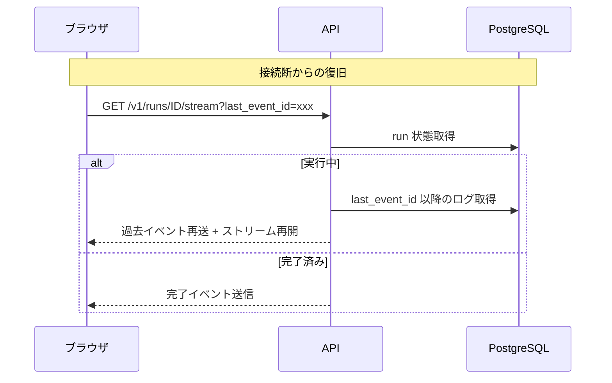

**実装のポイント:**

```python
# services/run_service.py

class RunService:
    async def get_events_since(self, run_id: str, last_event_id: str | None) -> list[dict]:
        """
        指定イベント以降のログを取得（SSE 再接続用）
        """
        run = await self.run_dao.get(run_id)
        if not run:
            raise ValueError(f"Run not found: {run_id}")

        # DB に保存されたログから last_event_id 以降を抽出
        logs = json.loads(run.logs or "[]")

        if last_event_id:
            # last_event_id 以降のログを返す
            found = False
            result = []
            for log in logs:
                if found:
                    result.append(log)
                if log.get("event_id") == last_event_id:
                    found = True
            return result

        return logs
```

#### Container Apps の制約と対策

| 制約 | 値 | 対策 |
|-----|-----|------|
| HTTP リクエストタイムアウト | 最大 240 秒 | SSE/WebSocket を使用 |
| アイドルタイムアウト | 4 分 | Keep-alive ping を送信 |
| インスタンス再起動 | 随時発生 | Redis で状態を永続化 |
| スケールイン | キュー空で発生 | 最小レプリカを 1 以上に |

**Keep-alive 実装:**

```python
async def event_generator():
    last_ping = time.time()

    async for message in pubsub.listen():
        # 30 秒ごとに ping を送信
        if time.time() - last_ping > 30:
            yield f": ping\n\n"  # SSE コメント（keep-alive）
            last_ping = time.time()

        # 通常のイベント処理
        if message["type"] == "message":
            yield f"data: {json.dumps(message['data'])}\n\n"
```

#### アーキテクチャ比較

| パターン | 長所 | 短所 | 推奨シナリオ |
|---------|------|------|------------|
| **SSE + Redis Pub/Sub** | シンプル、標準的、低コスト | 単方向のみ | ほとんどのケースで推奨 |
| **WebSocket + SignalR** | 双方向通信、高信頼性 | 追加コスト、複雑性 | インタラクティブ操作が必要な場合 |
| **ポーリング** | 最もシンプル | 遅延、リソース消費 | フォールバック用 |

**結論:** Container Apps は長時間実行タスクの非同期通信に対応可能です。SSE + Redis Pub/Sub パターンを採用し、適切な keep-alive とリカバリー機構を実装することで、数十分のエージェント実行でも安定した通信が可能です。

### 6. タスクキューアーキテクチャ

#### Celery + Redis

インメモリ asyncio キューを Celery に置き換える理由：
- 永続的なタスクキュー
- 分散ワーカースケーリング
- タスクリトライとデッドレター処理
- タスク結果バックエンド

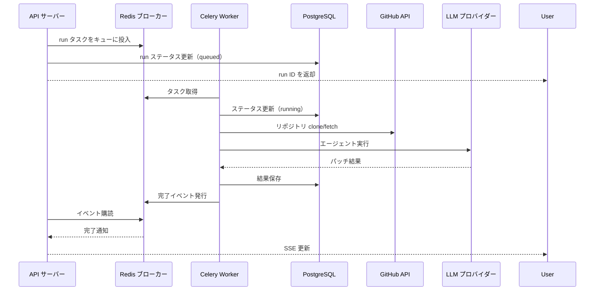

**Celery 設定:**

```python
# celery_config.py
from celery import Celery

app = Celery(
    'dursor',
    broker='rediss://:password@dursor-redis.redis.cache.windows.net:6380/0',
    backend='rediss://:password@dursor-redis.redis.cache.windows.net:6380/1',
)

app.conf.update(
    task_serializer='json',
    accept_content=['json'],
    result_serializer='json',
    timezone='UTC',
    enable_utc=True,
    task_acks_late=True,
    task_reject_on_worker_lost=True,
    worker_prefetch_multiplier=1,
    # 長時間実行タスク用の設定
    task_time_limit=3600,      # ハードリミット: 1時間
    task_soft_time_limit=3000, # ソフトリミット: 50分
    task_routes={
        'dursor.tasks.run_agent': {'queue': 'agent'},
        'dursor.tasks.poll_ci': {'queue': 'polling'},
        'dursor.tasks.poll_pr': {'queue': 'polling'},
    },
)
```

**長時間タスクの実装例:**

```python
# tasks/agent_tasks.py
from celery import shared_task
import redis.asyncio as redis

@shared_task(bind=True, max_retries=3)
def run_agent_task(self, run_id: str, workspace_path: str, instruction: str):
    """
    Claude Code/Codex エージェントを実行する長時間タスク

    - 実行時間: 5〜30分
    - Redis Pub/Sub で進捗を配信
    - DB に結果を保存
    """
    redis_client = redis.from_url("rediss://...")

    try:
        # 進捗通知
        async def publish_progress(message: str):
            await redis_client.publish(
                f"run:{run_id}:events",
                json.dumps({"type": "progress", "message": message})
            )

        # エージェント実行
        executor = ClaudeCodeExecutor(...)
        result = await executor.execute(
            workspace_path=workspace_path,
            instruction=instruction,
            progress_callback=publish_progress,
        )

        # 完了通知
        await redis_client.publish(
            f"run:{run_id}:events",
            json.dumps({
                "type": "completed",
                "patch": result.patch,
                "summary": result.summary,
            })
        )

        return {"status": "completed", "run_id": run_id}

    except Exception as e:
        # エラー通知
        await redis_client.publish(
            f"run:{run_id}:events",
            json.dumps({"type": "failed", "error": str(e)})
        )
        raise self.retry(exc=e, countdown=60)
```

### 7. セキュリティアーキテクチャ

#### Microsoft Entra ID (Azure AD)

認証・認可の実装：

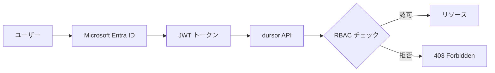

**認証フロー:**

1. ユーザーが Microsoft Entra ID で認証
2. クレーム付き JWT トークンを受け取る
3. API が各リクエストでトークンを検証
4. RBAC がリソースアクセスを決定

**ロール定義:**

| ロール | 権限 |
|-------|------|
| Admin | フルアクセス、ユーザー管理、GitHub App 設定 |
| Developer | タスク作成、エージェント実行、PR 作成 |
| Viewer | タスクと PR の読み取り専用アクセス |

#### Azure Key Vault

機密設定の保存：

| シークレット | 用途 |
|-------------|------|
| `dursor-encryption-key` | API キー暗号化 |
| `github-app-private-key` | GitHub App 認証 |
| `postgresql-connection-string` | データベース接続 |
| `redis-connection-string` | キャッシュ接続 |

**アクセスパターン:**

```python
from azure.identity import DefaultAzureCredential
from azure.keyvault.secrets import SecretClient

credential = DefaultAzureCredential()
client = SecretClient(
    vault_url="https://dursor-vault.vault.azure.net/",
    credential=credential
)

encryption_key = client.get_secret("dursor-encryption-key").value
```

### 8. ネットワークアーキテクチャ


**ネットワークセキュリティ:**

- すべての Azure PaaS サービスにプライベートエンドポイント
- トラフィックを制限するネットワークセキュリティグループ（NSG）
- DDoS 対策のための Azure Front Door + WAF
- GitHub と LLM プロバイダー IP 用のサービスタグ

### 9. 監視とオブザーバビリティ

#### Application Insights

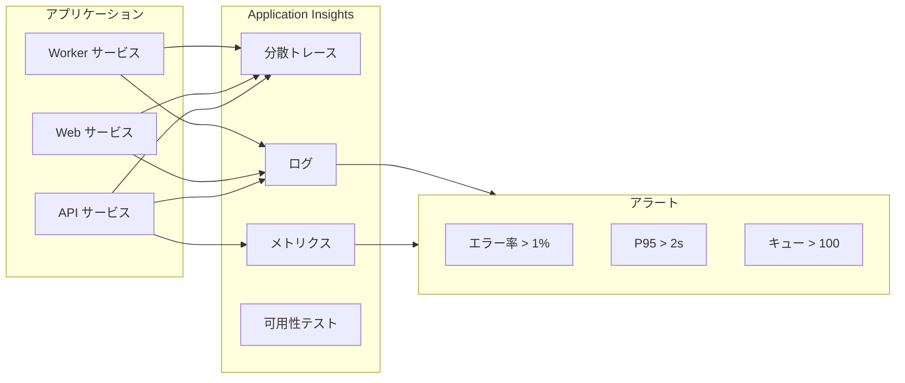

**主要メトリクス:**

| メトリクス | 警告 | クリティカル |
|-----------|------|------------|
| API エラー率 | > 1% | > 5% |
| API P95 レイテンシ | > 2s | > 5s |
| Worker キュー深度 | > 50 | > 200 |
| データベース接続数 | > 80% | > 95% |
| Redis メモリ | > 70% | > 90% |
| エージェント実行時間 | > 30分 | > 60分 |

### 10. 災害復旧

**復旧目標:**

| ティア | RTO | RPO | 戦略 |
|-------|-----|-----|------|
| 開発 | 4 時間 | 24 時間 | 単一リージョン、日次バックアップ |
| 本番 | 15 分 | 5 分 | マルチリージョン、継続的レプリケーション |

**バックアップ戦略:**

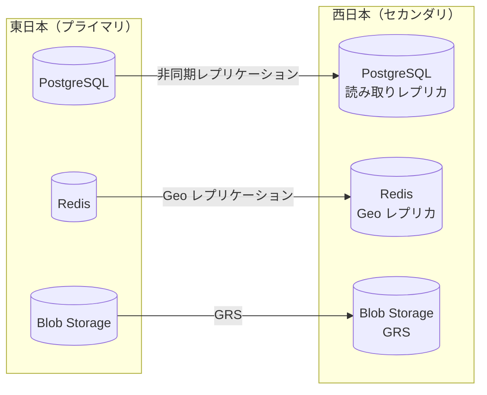

## 環境設定

### 開発環境

```yaml
# Container Apps - 開発
api:
  minReplicas: 1
  maxReplicas: 2
  resources:
    cpu: 0.25
    memory: 512Mi

web:
  minReplicas: 1
  maxReplicas: 1
  resources:
    cpu: 0.25
    memory: 256Mi

worker:
  minReplicas: 1
  maxReplicas: 3
  resources:
    cpu: 0.5
    memory: 1Gi

# Database - 開発
postgresql:
  sku: Burstable_B1ms
  storage: 32GB
  haEnabled: false

# Cache - 開発
redis:
  sku: Basic_C0
```

### 本番環境

```yaml
# Container Apps - 本番
api:
  minReplicas: 2
  maxReplicas: 10
  resources:
    cpu: 0.5
    memory: 1Gi

web:
  minReplicas: 2
  maxReplicas: 5
  resources:
    cpu: 0.25
    memory: 512Mi

worker:
  minReplicas: 2
  maxReplicas: 20
  resources:
    cpu: 1.0
    memory: 2Gi

# Database - 本番
postgresql:
  sku: GeneralPurpose_D4s_v3
  storage: 256GB
  haEnabled: true
  readReplicas: 2

# Cache - 本番
redis:
  sku: Premium_P1
  clustering: true
  geoReplication: true
```

## コスト見積もり

### 月額コスト（円）

| リソース | 開発 | 本番 |
|---------|------|------|
| Container Apps (API) | ¥5,000 | ¥30,000 |
| Container Apps (Web) | ¥3,000 | ¥15,000 |
| Container Apps (Worker) | ¥8,000 | ¥50,000 |
| PostgreSQL | ¥4,000 | ¥60,000 |
| Redis | ¥3,000 | ¥45,000 |
| Blob Storage | ¥1,000 | ¥10,000 |
| Azure Front Door | ¥5,000 | ¥20,000 |
| Key Vault | ¥500 | ¥2,000 |
| Application Insights | ¥2,000 | ¥15,000 |
| **合計** | **¥31,500** | **¥247,000** |

*注: 中程度の使用量に基づく見積もり。実際のコストは使用量により変動します。*

## マイグレーション計画

### フェーズ 1: データベースマイグレーション

```mermaid
gantt
    title フェーズ 1: データベースマイグレーション
    dateFormat  YYYY-MM-DD
    section 準備
    PostgreSQL セットアップ        :p1, 2024-01-01, 3d
    マイグレーションスクリプト作成  :p2, after p1, 5d
    ローカルでテスト               :p3, after p2, 3d
    section 実行
    Azure（開発）にデプロイ        :e1, after p3, 2d
    データ整合性検証              :e2, after e1, 2d
    パフォーマンステスト           :e3, after e2, 3d
    section カットオーバー
    最終マイグレーション           :c1, after e3, 1d
    本番検証                      :c2, after c1, 2d
```

### フェーズ 2: キューマイグレーション

```mermaid
gantt
    title フェーズ 2: キューマイグレーション
    dateFormat  YYYY-MM-DD
    section 開発
    Celery タスク実装             :d1, 2024-01-15, 5d
    Redis 統合                   :d2, after d1, 3d
    Worker コンテナ更新           :d3, after d2, 3d
    section テスト
    統合テスト                    :t1, after d3, 5d
    負荷テスト                    :t2, after t1, 3d
    section デプロイ
    Azure にデプロイ              :dep1, after t2, 2d
    監視と最適化                  :dep2, after dep1, 5d
```

### フェーズ 3: ストレージマイグレーション

```mermaid
gantt
    title フェーズ 3: ストレージマイグレーション
    dateFormat  YYYY-MM-DD
    section 開発
    Blob Storage SDK 実装         :d1, 2024-02-01, 5d
    ワークスペースサービス更新     :d2, after d1, 5d
    ライフサイクルポリシー追加     :d3, after d2, 2d
    section テスト
    大規模リポジトリでテスト       :t1, after d3, 5d
    パフォーマンス最適化          :t2, after t1, 3d
    section デプロイ
    デプロイとデータ移行           :dep1, after t2, 3d
```

### フェーズ 4: セキュリティ実装

```mermaid
gantt
    title フェーズ 4: セキュリティ実装
    dateFormat  YYYY-MM-DD
    section 開発
    Entra ID 統合                 :d1, 2024-02-15, 7d
    RBAC 実装                     :d2, after d1, 5d
    Key Vault 統合                :d3, after d2, 3d
    section テスト
    セキュリティテスト            :t1, after d3, 5d
    ペネトレーションテスト         :t2, after t1, 5d
    section デプロイ
    本番デプロイ                  :dep1, after t2, 2d
```

## Infrastructure as Code

### Bicep テンプレート構造

```
infra/
├── main.bicep                 # メインデプロイ
├── modules/
│   ├── container-apps.bicep   # Container Apps 環境
│   ├── postgresql.bicep       # PostgreSQL Flexible Server
│   ├── redis.bicep           # Azure Cache for Redis
│   ├── storage.bicep         # Blob Storage アカウント
│   ├── keyvault.bicep        # Key Vault
│   ├── frontdoor.bicep       # Front Door + WAF
│   ├── monitoring.bicep      # Application Insights
│   └── networking.bicep      # VNet + NSG
├── parameters/
│   ├── dev.bicepparam        # 開発パラメータ
│   └── prod.bicepparam       # 本番パラメータ
└── scripts/
    ├── deploy.sh             # デプロイスクリプト
    └── migrate-db.sh         # データベースマイグレーション
```

### サンプル Bicep（Container Apps）

```bicep
// modules/container-apps.bicep
param location string
param environmentName string
param apiImageTag string
param webImageTag string
param workerImageTag string

resource containerAppEnvironment 'Microsoft.App/managedEnvironments@2023-05-01' = {
  name: '${environmentName}-env'
  location: location
  properties: {
    daprAIConnectionString: applicationInsights.properties.ConnectionString
    vnetConfiguration: {
      infrastructureSubnetId: subnet.id
    }
  }
}

resource apiApp 'Microsoft.App/containerApps@2023-05-01' = {
  name: '${environmentName}-api'
  location: location
  properties: {
    managedEnvironmentId: containerAppEnvironment.id
    configuration: {
      ingress: {
        external: true
        targetPort: 8000
        // SSE 用のタイムアウト設定
        clientRequestTimeout: 3600
      }
      secrets: [
        {
          name: 'db-connection-string'
          keyVaultUrl: 'https://${keyVault.name}.vault.azure.net/secrets/postgresql-connection-string'
          identity: managedIdentity.id
        }
      ]
    }
    template: {
      containers: [
        {
          name: 'api'
          image: 'dursor.azurecr.io/api:${apiImageTag}'
          resources: {
            cpu: json('0.5')
            memory: '1Gi'
          }
          env: [
            {
              name: 'DATABASE_URL'
              secretRef: 'db-connection-string'
            }
          ]
        }
      ]
      scale: {
        minReplicas: 2
        maxReplicas: 10
        rules: [
          {
            name: 'http-scaling'
            http: {
              metadata: {
                concurrentRequests: '100'
              }
            }
          }
        ]
      }
    }
  }
}

resource workerApp 'Microsoft.App/containerApps@2023-05-01' = {
  name: '${environmentName}-worker'
  location: location
  properties: {
    managedEnvironmentId: containerAppEnvironment.id
    configuration: {
      // Worker は外部 ingress 不要
      secrets: [
        {
          name: 'redis-connection-string'
          keyVaultUrl: 'https://${keyVault.name}.vault.azure.net/secrets/redis-connection-string'
          identity: managedIdentity.id
        }
      ]
    }
    template: {
      containers: [
        {
          name: 'worker'
          image: 'dursor.azurecr.io/worker:${workerImageTag}'
          resources: {
            cpu: json('1.0')
            memory: '2Gi'
          }
          env: [
            {
              name: 'CELERY_BROKER_URL'
              secretRef: 'redis-connection-string'
            }
          ]
        }
      ]
      scale: {
        minReplicas: 1
        maxReplicas: 20
        rules: [
          {
            name: 'queue-scaling'
            custom: {
              type: 'redis'
              metadata: {
                listName: 'celery'
                listLength: '10'
              }
            }
          }
        ]
      }
    }
  }
}
```

## まとめ

本設計は、dursor の Azure デプロイにおいてスケーラブル、セキュア、かつコスト効率の良いアーキテクチャを提供します。

**主なポイント:**

1. **スケーラビリティ**: Celery ワーカーを持つオートスケーリング Container Apps が変動負荷に対応
2. **信頼性**: 自動フェイルオーバーを持つマルチ AZ PostgreSQL と Redis
3. **セキュリティ**: Entra ID 認証、Key Vault シークレット、プライベートエンドポイント
4. **オブザーバビリティ**: アラート付きの完全な Application Insights 統合
5. **コスト効率**: scale-to-zero 機能により開発コストを最小化
6. **長時間実行タスク対応**: SSE + Redis Pub/Sub により、数十分のエージェント実行でも安定した非同期通信が可能

**Container Apps は長時間実行タスクの非同期通信に適しています。** SSE と Redis Pub/Sub を組み合わせることで、Claude Code や Codex の長時間実行（5〜30分）を適切にハンドリングできます。追加の複雑性が必要な場合は、Azure SignalR Service による WebSocket 対応も選択肢となります。

マイグレーションはデータベースマイグレーションから開始し、段階的に分散コンポーネントを追加していくことで実行できます。
