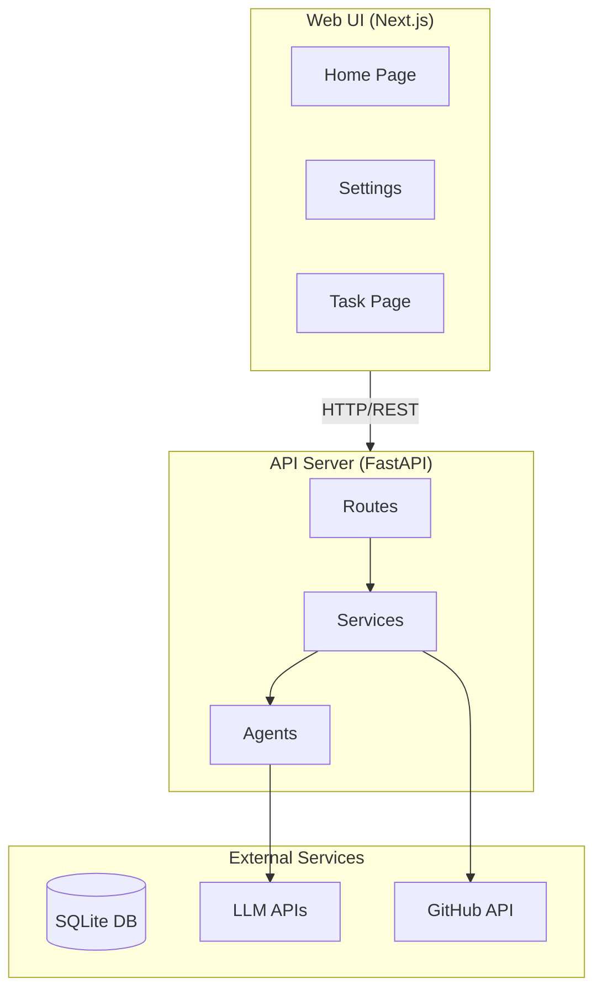

# zloth: 寝ている間にナマケモノがコードを書いてくれる、セルフホスト型AIコーディングエージェント

## はじめに

最近、AIコーディングツールが急速に普及しています。GitHub Copilot、Cursor、Claude Code、Codex CLI...選択肢は増える一方です。しかし、これらのツールを使っていて、こんな不満を感じたことはありませんか？

- 「複数のAIモデルを試したいけど、切り替えが面倒...」
- 「CLIツールは便利だけど、チャット形式でコードを育てたい」
- 「自分のAPIキーを使いたいけど、クラウドサービスは心配」
- 「どのモデルが自分のタスクに最適か、比較したい」

そんな悩みを解決するために生まれたのが **zloth** です。

## zlothとは？

**zloth**（ゾロス / ズロス）は、セルフホスト可能なマルチモデル並列実行AIコーディングエージェントです。

### 名前の由来

```
Zloth = Zzz (眠り) + Sloth (ナマケモノ)
```

コンセプトは「**ユーザーが寝ている間にナマケモノが働く**」。

「Sloth」の綴りを少し変えることで、検索性を高めつつ、ハッカーっぽい響きを持たせました。怠け者のナマケモノが、あなたの代わりに夜通しコードを書いてくれる——そんなイメージです。

## zlothの特徴

### 1. マルチモデル並列実行

zlothの最大の特徴は、**同じタスクを複数のAIモデルで同時に実行できる**ことです。

```
┌─────────────────────────────────────────────┐
│              あなたの指示                    │
│  「ユーザーフォームにバリデーションを追加して」  │
└────────────────────┬────────────────────────┘
                     │
         ┌───────────┼───────────┐
         ▼           ▼           ▼
    ┌─────────┐ ┌─────────┐ ┌─────────┐
    │ GPT-4o  │ │ Claude  │ │ Gemini  │
    └────┬────┘ └────┬────┘ └────┬────┘
         │           │           │
         ▼           ▼           ▼
    ┌─────────┐ ┌─────────┐ ┌─────────┐
    │ Patch A │ │ Patch B │ │ Patch C │
    └─────────┘ └─────────┘ └─────────┘
```

3つのモデルが生成したパッチを並べて比較し、最も良いものを選んでPRを作成できます。

### 2. BYO API Key（自分のAPIキーを使用）

zlothは完全にセルフホスト型です。OpenAI、Anthropic、Google—いずれのAPIキーも自分で用意して使います。

- APIキーはFernet（AES-128）で暗号化して保存
- データは自分のサーバー内に留まる
- 月額課金なし、使った分だけ

### 3. 会話駆動のPR開発

単発のコード生成ではなく、**チャット形式で対話しながらPRを育てる**ワークフローを実現します。

```
You: 「ログイン機能を追加して」
          ↓
zloth: [パッチ生成]
          ↓
You: 「パスワードのバリデーションも追加して」
          ↓
zloth: [パッチ更新]
          ↓
You: 「いい感じ！PRを作成して」
          ↓
zloth: [PR作成] → GitHub PR #123
```

### 4. Visual Diff Viewer

複数モデルの出力を**サイドバイサイドで比較**できます。どのモデルがどんなアプローチを取ったか、一目瞭然です。

## 誰のためのツール？

zlothは以下のような人に最適です：

### Web UIでチャットしたい人

- CLIツールでのAI会話に疲れた
- IDEでのAI支援コーディングより、シンプルなチャットが好み
- 直感的なWebインターフェースでコード生成したい

### ローカルで動かしたい人

- 自分のAPI キーを使いたい
- コードやデータをクラウドに送りたくない
- 自分のインフラで完結させたい

### 複数モデルを比較したい人

- 「このタスクはClaudeが得意？GPT-4が得意？」を実際に試したい
- 最適なモデルを選んでコスト最適化したい
- モデルごとのアプローチの違いを学びたい

## 他のツールとの比較

|  | zloth | Cursor Cloud | Cursor IDE | AI CLI | AI Cloud |
|---|:---:|:---:|:---:|:---:|:---:|
| Web UI | ✅ | ✅ | ❌ | ❌ | ✅ |
| ローカル実行 | ✅ | ❌ | ✅ | ✅ | ❌ |
| マルチモデル | ✅ | ✅ | ✅ | ❌ | ❌ |
| BYO API Key | ✅ | ❌ | ✅ | ✅ | ❌ |
| OSS | ✅ | ❌ | ❌ | ✅ | ❌ |

zlothは、**Web UI + ローカル実行 + マルチモデル + BYO API Key + OSS**をすべて満たす唯一のソリューションです。

## アーキテクチャ



### 技術スタック

- **Backend**: FastAPI (Python 3.13+)
- **Frontend**: Next.js 15 (React 19, TypeScript, Tailwind CSS)
- **Database**: SQLite (aiosqlite)
- **LLM**: OpenAI, Anthropic, Google Generative AI
- **CLI連携**: Claude Code, Codex, Gemini CLI

## クイックスタート

### 1. リポジトリをクローン

```bash
git clone https://github.com/hampen2929/zloth.git
cd zloth
```

### 2. 環境設定

```bash
cp .env.example .env
# .envを編集してZLOTH_ENCRYPTION_KEYを設定
```

### 3. Dockerで起動

```bash
docker compose up -d --build
```

### 4. ブラウザでアクセス

```
http://localhost:3000
```

## 使い方の流れ

1. **Settings**でAPIキーを登録（OpenAI, Anthropic, Google）
2. **Home**でGitHubリポジトリのURLを入力してクローン
3. **並列実行するモデル**を選択
4. **自然言語で指示**を入力（例：「READMEにインストール手順を追加して」）
5. **各モデルの出力を比較**してベストなものを選択
6. **PRを作成**

## セキュリティ

zlothはセキュリティを重視して設計されています：

- **APIキーの暗号化**: Fernet（AES-128）で保存時に暗号化
- **ワークスペース分離**: タスクごとに独立したワークスペース
- **禁止パス**: `.git`、`.env`、認証情報ファイルへのアクセスをブロック
- **ローカル実行**: データは自分のサーバー内に留まる

## ロードマップ

### v0.2（予定）
- Dockerサンドボックスでのコマンド実行（テスト、リント）
- レビュー/メタエージェント（複数出力の自動評価）
- PRコメントからの再実行トリガー

### v0.3（予定）
- マルチユーザーサポート
- コスト追跡と予算管理
- ポリシーインジェクション（MISRA準拠など）

## コントリビューション

zlothはApache License 2.0でオープンソースとして公開されています。

バグ報告や機能リクエストは[GitHub Issues](https://github.com/hampen2929/zloth/issues)で受け付けています。

> **Note**: このプロジェクトは主にAI支援コーディングで開発されています。プルリクエストはレビュー・マージされない可能性があります。アイデアやバグを見つけた場合は、PRではなくIssueを開いてください。

## まとめ

zlothは、「寝ている間にナマケモノがコードを書いてくれる」というコンセプトのもと、以下の価値を提供します：

- 🦥 **マルチモデル並列実行**で最適な出力を選択
- 🔐 **セルフホスト**でデータを自分の手元に
- 💬 **会話駆動**でPRを育てるワークフロー
- 🔑 **BYO API Key**で自分のキーを使用
- 🆓 **OSS**で完全無料

AIコーディングツールの選択肢が増える中、zlothは「自分でコントロールできる」「複数モデルを比較できる」という独自のポジションを提供します。

ぜひ試してみてください！

---

**GitHub**: https://github.com/hampen2929/zloth

**License**: Apache License 2.0

**Star**: ⭐ If you find zloth useful, please give us a star!
