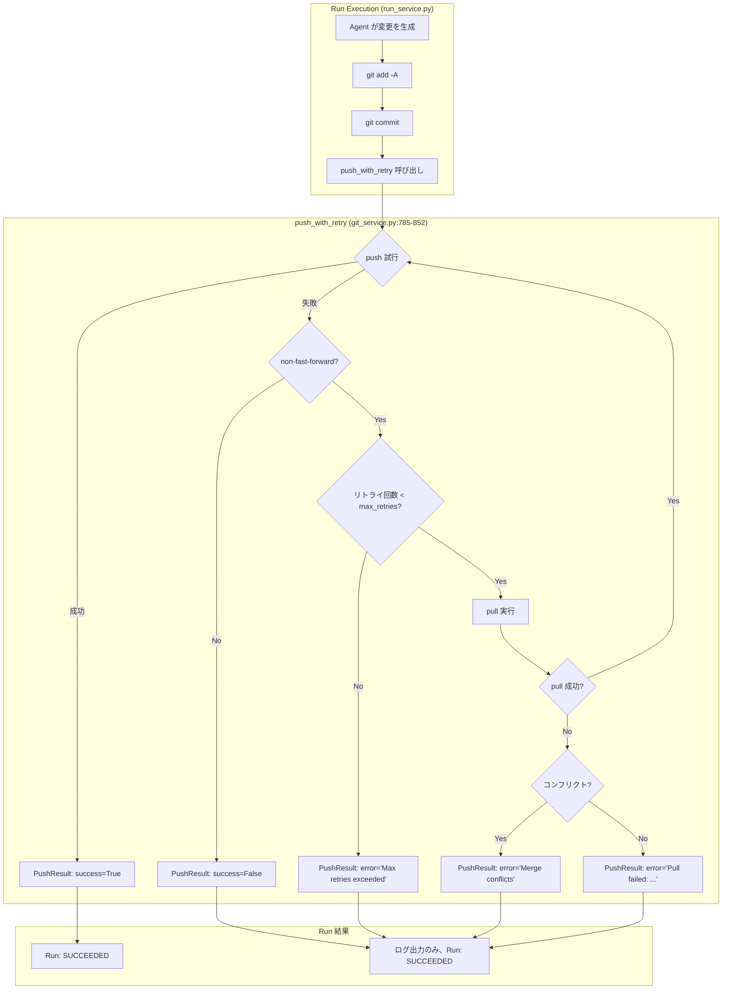
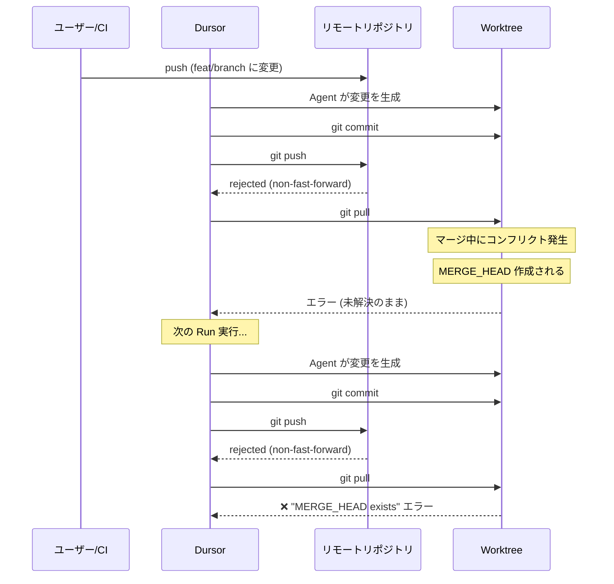
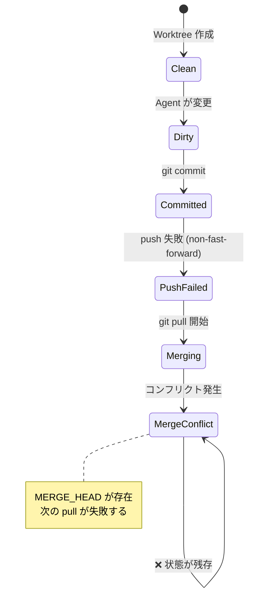
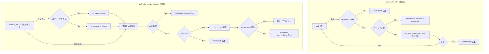
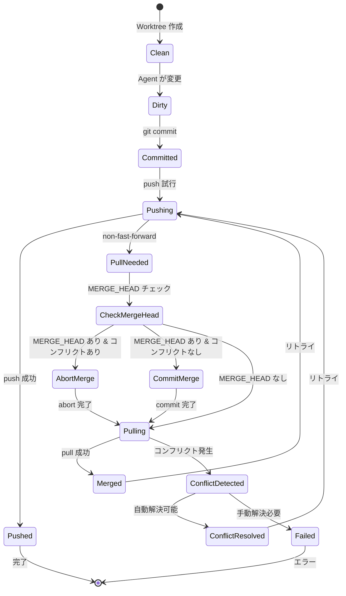

# Branch Pull/Push Policy

このドキュメントは、Dursor における Git ブランチの pull/push 操作の仕様、現状の問題点、および解決案を記述します。

## 目次

1. [概要](#概要)
2. [現状の実装](#現状の実装)
3. [問題点](#問題点)
4. [解決案](#解決案)
5. [状態遷移と条件分岐](#状態遷移と条件分岐)
6. [実装詳細](#実装詳細)

---

## 概要

Dursor では、AI エージェント（Claude Code, Codex, Gemini）が生成した変更をリモートリポジトリにプッシュし、PR を作成します。この過程で、リモートブランチが他の作業者やCIによって更新されている場合、push が失敗する可能性があります。

### 関連ファイル

| ファイル | 役割 |
|----------|------|
| `apps/api/src/dursor_api/services/git_service.py` | Git 操作の中核サービス |
| `apps/api/src/dursor_api/services/run_service.py` | Run 実行時の push 呼び出し |
| `apps/api/src/dursor_api/services/pr_service.py` | PR 作成時の push 確認 |

---

## 現状の実装

### Push/Pull フロー



### pull() メソッドの現状

```mermaid
flowchart TD
    A[pull 開始] --> B[認証URL設定]
    B --> C[git pull origin branch]
    C -->|成功| D[PullResult: success=True]
    C -->|失敗| E{エラー種別判定}
    E -->|"CONFLICT" or "Automatic merge failed"| F[コンフリクトファイル取得]
    F --> G[PullResult: has_conflicts=True]
    E -->|その他のエラー| H[PullResult: success=False, error=エラー文]
```

### 現状のデータ構造

```python
@dataclass
class PullResult:
    success: bool
    has_conflicts: bool = False
    conflict_files: list[str] = field(default_factory=list)
    error: str | None = None

@dataclass
class PushResult:
    success: bool
    error: str | None = None
    required_pull: bool = False
```

---

## 問題点

### 問題1: MERGE_HEAD 状態の未処理

#### 発生シナリオ



#### エラーメッセージ

```
Pull failed: Cmd('git') failed due to: exit code(128)
  cmdline: git pull origin feat/yuya/be2f1d15
  stderr: 'error: You have not concluded your merge (MERGE_HEAD exists).
hint: Please, commit your changes before merging.
fatal: Exiting because of unfinished merge.'
```

#### 原因

現在の `pull()` メソッドは以下のエラーパターンのみを処理:

| 検出パターン | 処理 |
|-------------|------|
| `"CONFLICT"` | `has_conflicts=True` を返す |
| `"Automatic merge failed"` | `has_conflicts=True` を返す |
| **`"MERGE_HEAD exists"`** | **未処理（一般エラーとして返す）** |

### 問題2: マージ状態の残存

Worktree が再利用される場合、以前の未完了マージ状態が残り、後続の操作を阻害します。



### 問題3: Push失敗時の Run ステータス

現状では push が失敗しても Run は `SUCCEEDED` としてマークされます。これにより:

- ユーザーは Run が成功したと思い込む
- PR 作成時に初めてエラーに気づく
- デバッグが困難

---

## 解決案

### 方針

1. **MERGE_HEAD 状態を検出・処理する**
2. **未完了マージを自動的に解決する**
3. **リトライロジックを強化する**

### 解決後のフロー



### 状態遷移（解決後）



---

## 状態遷移と条件分岐

### Git 状態の種類

| 状態 | 検出方法 | 説明 |
|------|----------|------|
| Clean | `git status --porcelain` が空 | 変更なし |
| Dirty | `git status --porcelain` が非空 | 未コミットの変更あり |
| MERGE_HEAD | `.git/MERGE_HEAD` が存在 | マージ進行中 |
| REBASE_HEAD | `.git/REBASE_HEAD` が存在 | リベース進行中 |
| Conflict | `git diff --name-only --diff-filter=U` が非空 | 未解決コンフリクトあり |

### 条件分岐マトリクス

#### Pull 実行前の状態チェック

| MERGE_HEAD | コンフリクト | アクション |
|------------|-------------|-----------|
| なし | - | 通常の pull を実行 |
| あり | なし | マージをコミットしてから pull |
| あり | あり | マージを abort してから pull |

#### Pull 結果の処理

| 結果 | アクション |
|------|-----------|
| 成功 | push をリトライ |
| コンフリクト発生 | コンフリクトファイルをログに記録し、abort して失敗を返す |
| その他のエラー | エラーを返す |

#### Push 結果の処理

| 結果 | Run ステータス | 次のアクション |
|------|---------------|---------------|
| 成功 | SUCCEEDED | PR 作成可能 |
| non-fast-forward | - | pull してリトライ |
| 権限エラー (403) | FAILED | GitHubPermissionError |
| その他のエラー | SUCCEEDED (ログのみ) | PR 作成時にリトライ |

---

## 実装詳細

### 新規メソッド

#### 1. `has_merge_in_progress()`

```python
async def has_merge_in_progress(self, repo_path: Path) -> bool:
    """Check if there's an unfinished merge (MERGE_HEAD exists).

    Args:
        repo_path: Path to the repository.

    Returns:
        True if MERGE_HEAD exists.
    """
    merge_head = repo_path / ".git" / "MERGE_HEAD"
    return merge_head.exists()
```

#### 2. `has_unresolved_conflicts()`

```python
async def has_unresolved_conflicts(self, repo_path: Path) -> list[str]:
    """Get list of files with unresolved merge conflicts.

    Args:
        repo_path: Path to the repository.

    Returns:
        List of file paths with conflicts, empty if none.
    """
    def _check() -> list[str]:
        repo = git.Repo(repo_path)
        try:
            unmerged = repo.git.diff("--name-only", "--diff-filter=U")
            if unmerged:
                return unmerged.strip().split("\n")
        except Exception:
            pass
        return []

    loop = asyncio.get_event_loop()
    return await loop.run_in_executor(None, _check)
```

#### 3. `resolve_unfinished_merge()`

```python
async def resolve_unfinished_merge(
    self,
    repo_path: Path,
    strategy: Literal["abort", "commit"] = "abort",
) -> tuple[bool, str | None]:
    """Resolve an unfinished merge state.

    Args:
        repo_path: Path to the repository.
        strategy:
            - "abort": Abort the merge and return to pre-merge state
            - "commit": Commit the merge (only if no conflicts)

    Returns:
        Tuple of (success, error_message).
    """
    def _resolve() -> tuple[bool, str | None]:
        repo = git.Repo(repo_path)

        # Check for conflicts
        try:
            unmerged = repo.git.diff("--name-only", "--diff-filter=U")
            has_conflicts = bool(unmerged and unmerged.strip())
        except Exception:
            has_conflicts = False

        if strategy == "commit":
            if has_conflicts:
                return False, "Cannot commit merge with unresolved conflicts"
            try:
                repo.git.commit("-m", "Merge remote-tracking branch")
                return True, None
            except Exception as e:
                return False, str(e)

        elif strategy == "abort":
            try:
                repo.git.merge("--abort")
                return True, None
            except Exception as e:
                return False, str(e)

        return False, f"Unknown strategy: {strategy}"

    loop = asyncio.get_event_loop()
    return await loop.run_in_executor(None, _resolve)
```

### 修正メソッド

#### `pull()` の修正

```python
async def pull(
    self,
    repo_path: Path,
    branch: str | None = None,
    auth_url: str | None = None,
) -> PullResult:
    """Pull from remote with conflict detection and MERGE_HEAD handling.

    This method handles the following scenarios:
    1. Normal pull (no existing merge state)
    2. MERGE_HEAD exists without conflicts -> commit and pull
    3. MERGE_HEAD exists with conflicts -> abort and pull
    """
    # Handle existing MERGE_HEAD state
    if await self.has_merge_in_progress(repo_path):
        conflict_files = await self.has_unresolved_conflicts(repo_path)

        if conflict_files:
            logger.warning(
                f"Found unfinished merge with conflicts in {len(conflict_files)} files, "
                "aborting merge"
            )
            success, error = await self.resolve_unfinished_merge(repo_path, "abort")
        else:
            logger.info("Found unfinished merge without conflicts, committing")
            success, error = await self.resolve_unfinished_merge(repo_path, "commit")

        if not success:
            return PullResult(
                success=False,
                error=f"Failed to resolve unfinished merge: {error}",
            )

    # Proceed with normal pull
    # ... (existing pull logic)
```

#### `push_with_retry()` の修正

```python
async def push_with_retry(
    self,
    repo_path: Path,
    branch: str,
    auth_url: str | None = None,
    max_retries: int = 2,
) -> PushResult:
    """Push to remote with automatic retry on non-fast-forward errors.

    Enhanced to handle MERGE_HEAD states during pull.
    """
    required_pull = False

    for attempt in range(max_retries + 1):
        try:
            await self.push(repo_path, branch=branch, auth_url=auth_url)
            return PushResult(success=True, required_pull=required_pull)
        except Exception as e:
            error_str = str(e).lower()

            is_non_ff = any(
                pattern in error_str
                for pattern in [
                    "non-fast-forward",
                    "[rejected]",
                    "failed to push some refs",
                    "updates were rejected",
                    "fetch first",
                ]
            )

            if not is_non_ff or attempt >= max_retries:
                return PushResult(success=False, error=str(e), required_pull=required_pull)

            logger.info(
                f"Push rejected (non-fast-forward), pulling and retrying "
                f"(attempt {attempt + 1}/{max_retries})"
            )

            # Pull with MERGE_HEAD handling (改善点)
            pull_result = await self.pull(repo_path, branch=branch, auth_url=auth_url)
            required_pull = True

            if not pull_result.success:
                if pull_result.has_conflicts:
                    # Abort merge and report conflict
                    await self.resolve_unfinished_merge(repo_path, "abort")
                    return PushResult(
                        success=False,
                        error=f"Merge conflicts in: {', '.join(pull_result.conflict_files)}",
                        required_pull=True,
                    )
                return PushResult(
                    success=False,
                    error=f"Pull failed: {pull_result.error}",
                    required_pull=True,
                )

    return PushResult(success=False, error="Max retries exceeded", required_pull=required_pull)
```

### 変更ファイル一覧

| ファイル | 変更内容 |
|----------|----------|
| `apps/api/src/dursor_api/services/git_service.py` | `has_merge_in_progress()`, `has_unresolved_conflicts()`, `resolve_unfinished_merge()` 追加 |
| `apps/api/src/dursor_api/services/git_service.py` | `pull()` の修正（MERGE_HEAD 処理追加） |
| `apps/api/src/dursor_api/services/git_service.py` | `push_with_retry()` の修正（コンフリクト時の abort 追加） |

### テストケース

| ケース | 初期状態 | 期待結果 |
|--------|----------|----------|
| 正常 push | Clean | 成功 |
| non-fast-forward → pull 成功 | Clean | 成功（required_pull=True） |
| non-fast-forward → pull コンフリクト | Clean | 失敗（abort 済み、conflict_files 報告） |
| MERGE_HEAD あり（コンフリクトなし）→ push | MERGE_HEAD | 成功（自動 commit 後） |
| MERGE_HEAD あり（コンフリクトあり）→ push | MERGE_HEAD + Conflict | 成功（abort 後 pull 成功の場合）または 失敗 |
| 権限エラー | Clean | GitHubPermissionError |

---

## 参考情報

### Git コマンドリファレンス

| コマンド | 用途 |
|----------|------|
| `git merge --abort` | 進行中のマージを中止 |
| `git diff --name-only --diff-filter=U` | 未解決コンフリクトのファイル一覧 |
| `git status --porcelain` | 機械可読な status 出力 |
| `ls .git/MERGE_HEAD` | マージ進行中かチェック |

### 関連ドキュメント

- [docs/git_operation_design.md](./git_operation_design.md) - Git 操作設計
- [CLAUDE.md](../CLAUDE.md) - 開発コンテキスト
