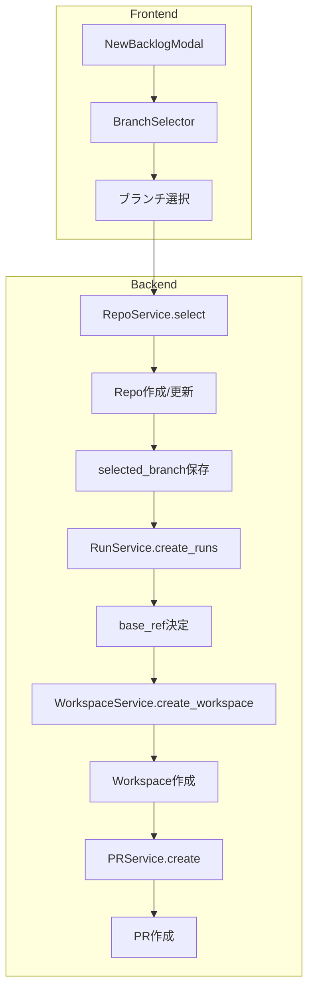
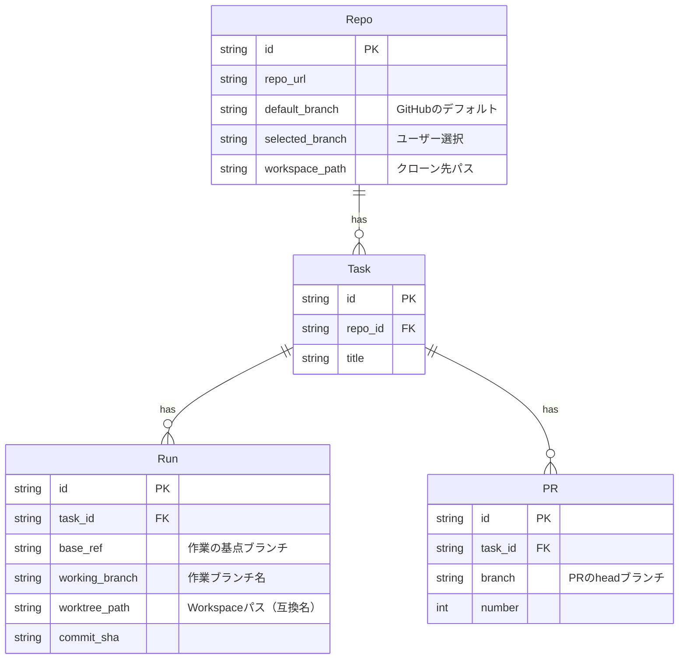
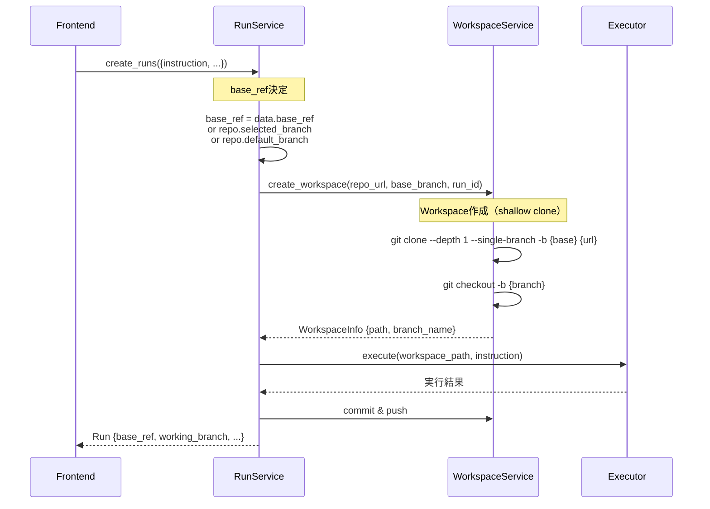
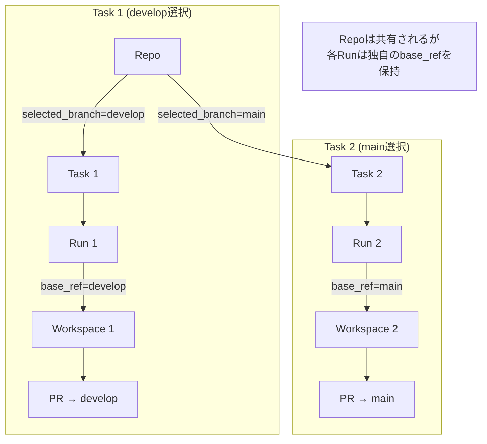

# ブランチ選択とワークスペース管理

このドキュメントでは、zlothにおけるブランチ選択からワークスペース作成、PR作成までのフローを説明します。

> 注: 旧仕様では「git worktree」による分離をサポートしていましたが、現在は **Clone方式に統一** されています。
> DBフィールド名などに `worktree_*` が残っている場合がありますが、互換のための名称であり、実体は clone ワークスペースです。

## 概要

zlothでは、ユーザーが選択したブランチを基点として作業を行います。各Runは独立したCloneワークスペースで実行され、ブランチ情報は`Run.base_ref`に保存されます。



## エンティティ関係



## ディレクトリ構成

```
workspaces/
├── {workspace_uuid}/                # メインリポジトリのクローン
│   ├── .git/
│   ├── src/
│   └── ...
│
└── run_{run_id}/                    # Run のCloneワークスペース（shallow clone）
    ├── .git/
    └── [作業ファイル]
```

## データフロー

### 1. ブランチ選択（フロントエンド）


**関連ファイル:**
- `apps/web/src/components/NewBacklogModal.tsx`
- `apps/web/src/components/BranchSelector.tsx`

### 2. リポジトリ選択（バックエンド）


**関連ファイル:**
- `apps/api/src/zloth_api/services/repo_service.py` (select メソッド)
- `apps/api/src/zloth_api/routes/repos.py`

### 3. Run作成とWorkspace



**base_ref の優先順位:**
1. `data.base_ref` - API呼び出し時に明示的に指定された場合
2. `repo.selected_branch` - ユーザーがBacklog作成時に選択したブランチ
3. `repo.default_branch` - GitHubのデフォルトブランチ

**関連ファイル:**
- `apps/api/src/zloth_api/services/run_service.py` (create_runs メソッド)
- `apps/api/src/zloth_api/services/workspace_service.py` (create_workspace メソッド)

### 4. PR作成


**重要:** PRのベースブランチは`run.base_ref`を使用します。これにより、Run作成時に選択されていたブランチが正しくPRのベースになります。

**関連ファイル:**
- `apps/api/src/zloth_api/services/pr_service.py`

## ブランチ命名規則

作業ブランチは以下の形式で生成されます：

```
{prefix}/{short_run_id}
```

- `prefix`: ユーザー設定（デフォルト: `zloth`）
- `short_run_id`: Run IDの先頭8文字

例: `zloth/a1b2c3d4`

## 複数タスクでの挙動



**重要なポイント:**
- 同じリポジトリに対して複数のタスクを作成可能
- 各タスクで異なるブランチを選択可能
- `Repo.selected_branch`は最新の選択で上書きされる
- しかし、各`Run.base_ref`はRun作成時の値を保持
- PR作成時は`run.base_ref`を使用するため、正しいベースブランチが設定される

## トラブルシューティング

### PRのベースブランチが意図と異なる

**原因:** 古いバージョンでは`repo.default_branch`を使用していたため、後から作成したタスクのブランチ選択が影響していた。

**解決:** `run.base_ref`を使用するように修正済み

### Workspaceの作成に失敗する

**確認事項:**
1. ベースブランチがリモートに存在するか
2. `workspaces/`ディレクトリの書き込み権限
3. 既存の `run_{run_id}` ディレクトリが壊れていないか（必要ならクリーンアップ）

**関連ログ:**
```python
logger.info(f"Creating clone-based workspace for run {run_id[:8]}")
```

## 関連ファイル一覧

| カテゴリ | ファイル | 役割 |
|---------|----------|------|
| Frontend | `apps/web/src/components/NewBacklogModal.tsx` | Backlog作成UI |
| Frontend | `apps/web/src/components/BranchSelector.tsx` | ブランチ選択コンポーネント |
| Backend | `apps/api/src/zloth_api/services/repo_service.py` | リポジトリ管理 |
| Backend | `apps/api/src/zloth_api/services/run_service.py` | Run実行管理 |
| Backend | `apps/api/src/zloth_api/services/git_service.py` | Git操作（push/retry 等） |
| Backend | `apps/api/src/zloth_api/services/pr_service.py` | PR作成・更新 |
| Domain | `apps/api/src/zloth_api/domain/models.py` | Repo, Run, PR モデル定義 |
