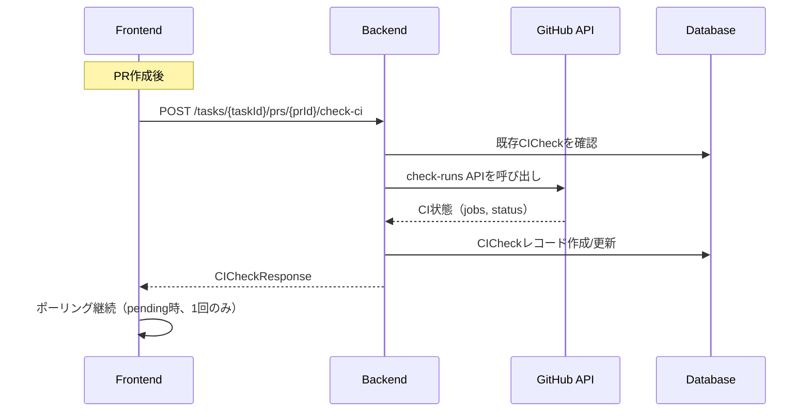

# Check CI 機能の現状分析と改善計画

このドキュメントでは、「Check CI」機能の現状の挙動、問題点、およびあるべき姿との乖離を分析し、改善計画をまとめます。

## 1. あるべき姿（期待される動作）

1. **PRが作成されていない場合は`Check CI`は実行しない**
2. **PRが作成済みの場合はImplementation後にCheck CIを実行**
3. **PRのCIが実行になったらTaskの`Check CI`もそれを追従して実行する**
4. **Taskに紐づく実行されている`Check CI`の数は1つ**
5. **ずっと`Pending`の状態ではあるべきではない**
6. **`Check CI`が更新するたびにボトムまで強制的にスクロールされるべきではない**
7. **`Check CI`がTask内に連投されるべきではなく、同一のSHAの`Check CI`があればそれに対して更新を行う**

## 2. 現状のアーキテクチャ

### 2.1 バックエンド構成

```
apps/api/src/zloth_api/
├── services/
│   ├── ci_check_service.py    # CI状態チェックのコアロジック
│   ├── ci_polling_service.py  # CI状態のポーリング（Agentic用、ci_checks未更新）
│   └── metrics_service.py     # メトリクス集計
├── routes/
│   ├── prs.py                 # PR関連エンドポイント（CI checkを含む）
│   └── webhooks.py            # GitHub Webhook（agentic状態のみ更新）
└── storage/
    └── dao.py                 # CICheckDAO（データ永続化、一意制約なし）
```

### 2.2 フロントエンド構成

```
apps/web/src/
├── components/
│   ├── ChatCodeView.tsx       # メインUI（CI check表示・制御）
│   └── CIResultCard.tsx       # CI結果表示コンポーネント
└── lib/
    └── api.ts                 # APIクライアント（ciChecksApi）
```

### 2.3 現状の実装フロー

#### 手動 Check CI
- `POST /tasks/{task_id}/prs/{pr_id}/check-ci` → `CICheckService.check_ci`
- 参照: `apps/api/src/zloth_api/routes/prs.py`, `services/ci_check_service.py`

#### 自動 Check CI（gating 有効時のみ）
- PR 作成 / 更新 / 手動同期時に `_trigger_ci_check_if_enabled` が実行
- `enable_gating_status` が OFF の場合は動かない
- **`runs` が実行中の場合は defer されるが、完了後の再実行の仕組みが無い**
- 参照: `apps/api/src/zloth_api/routes/prs.py`

#### CI 状態取得
- `CICheckService.check_ci` が GitHub API を叩き、`ci_checks` を作成/更新
- 重複抑止は「PR+SHA の既存レコード探索 + in-memory cooldown」
- **cooldown が in-memory のため、マルチプロセス/多台構成では抑止が効かない**
- 参照: `apps/api/src/zloth_api/services/ci_check_service.py`

#### Agentic の CI ポーリング
- `CIPollingService` は Agentic の状態遷移のみ更新（**`ci_checks` テーブルは未更新**）
- 参照: `apps/api/src/zloth_api/services/ci_polling_service.py`, `services/agentic_orchestrator.py`

#### Metrics の Pending CI
- `ci_checks` の `status='pending'` を単純集計
- 参照: `apps/api/src/zloth_api/storage/dao.py#get_realtime_metrics`

### 2.4 データフロー



### 2.5 フロントエンドのCI追従ロジック

- `ciChecksApi.list()` で Task 全体の `ci_checks` を取得
- `pending` を検知すると **1 回だけ** `check-ci` を叩く（再ポーリングしない）
- `lastTriggeredCICheckRef` が同一 SHA の再実行を抑止
- 自動スクロールは `messages / runs / reviews` 変化で常に発火

## 3. 問題点の詳細分析

### 3.1 CI Checkの連投・重複問題

**問題箇所**: `CICheckService.check_ci()` と `CICheckDAO`

**現状の動作**:
- `check_ci()`は毎回新しいCICheckレコードを作成する可能性がある
- SHAベースの重複チェックは存在するが、タイミングによっては重複が発生する

**コード参照** (`ci_check_service.py:146-181`):
```python
# 既存チェックの検索ロジック
existing = None
if sha:
    existing = await self.ci_check_dao.get_by_pr_and_sha(pr_id, sha)
    if not existing:
        pending_without_sha = await self.ci_check_dao.get_latest_pending_by_pr_id(pr_id)
        if pending_without_sha and pending_without_sha.sha is None:
            existing = pending_without_sha
else:
    existing = await self.ci_check_dao.get_latest_pending_by_pr_id(pr_id)
```

**問題点**:
1. **DB に一意制約がない**: `(pr_id, sha)` の組み合わせに一意制約がないため、並行リクエストで複数行が作成される
2. **cooldown が in-memory**: マルチプロセス/多台構成では抑止が効かない
3. SHAがNoneの場合、新しいpendingレコードが作成され続ける可能性
4. クールダウン（30秒）は同一SHA+PR組み合わせのみに適用

### 3.2 Pending状態が継続する問題

**問題箇所**: フロントエンドのポーリングロジックと、サーバ側のCI追従欠如

**現状の動作** (`ChatCodeView.tsx:512-559`):
```typescript
useEffect(() => {
    if (!prResult?.pr_id || !ciChecks) return;
    if (checkingCI) return;

    const pendingCheck = ciChecks.find(
      (c) => c.status === 'pending' && c.pr_id === prResult.pr_id
    );

    if (pendingCheck) {
      const checkKey = pendingCheck.sha || pendingCheck.id;
      if (lastTriggeredCICheckRef.current === checkKey) {
        return;  // 同じチェックは再トリガーしない
      }
      // ...
    }
}
```

**問題点**:
1. `lastTriggeredCICheckRef`により、一度トリガーされたCIチェックは再度トリガーされない
2. GitHub APIがCI未開始状態を返し続ける場合、永続的にpendingのまま
3. タイムアウト処理がフロントエンド/バックエンド両方にない
4. **サーバ側でのCI状態追従がない**: フロントエンドの「1回だけ」トリガーに依存

### 3.3 実装後のCI自動実行問題

**問題箇所**: `prs.py`の`_trigger_ci_check_if_enabled()`

**現状の動作**:
```python
async def _trigger_ci_check_if_enabled(
    task_id: str,
    pr_id: str,
    ci_check_service: CICheckService,
    user_preferences_dao: UserPreferencesDAO,
    run_dao: RunDAO | None = None,
) -> None:
    # enable_gating_statusが有効な場合のみトリガー
    prefs = await user_preferences_dao.get()
    if not prefs or not prefs.enable_gating_status:
        return
    
    # runs が実行中の場合は defer
    if run_dao:
        runs = await run_dao.list(task_id)
        running_runs = [r for r in runs if r.status in (RunStatus.RUNNING, RunStatus.QUEUED)]
        if running_runs:
            return  # defer されるが、再実行の仕組みが無い
```

**問題点**:
1. `enable_gating_status`が無効の場合、自動CIチェックは行われない
2. 実装（Run）完了後ではなく、PR作成/更新時のみトリガー
3. PRが既に存在する場合の実装完了後の自動CIチェックがない
4. **runs 実行中で defer された場合、完了後の再実行キューが無い**

### 3.4 スクロール問題

**問題箇所**: `ChatCodeView.tsx:116-118`

**現状の動作**:
```typescript
// Auto-scroll to bottom
useEffect(() => {
  messagesEndRef.current?.scrollIntoView({ behavior: 'smooth' });
}, [messages, runs, reviews]);  // ciChecksは含まれていないが...
```

**問題点**:
1. 依存配列に`ciChecks`はないが、`timeline`の再計算によりコンポーネントが再レンダリングされる
2. `timeline`にCI Checkが含まれており、更新時にスクロールが発生する可能性
3. **`runs` のポーリング更新（2s間隔）だけでも `scrollIntoView` が発火**
4. ユーザーが画面の途中を見ている時も強制的に下端に移動してしまう

### 3.5 Metricsの不整合

**問題箇所**: `MetricsDAO.get_realtime_metrics()`

**現状の動作** (`dao.py:2544-2550`):
```python
# Pending CI checks
ci_query = f"""
    SELECT COUNT(*) as count
    FROM ci_checks
    WHERE status = 'pending'{repo_filter}
"""
```

**問題点**:
1. すべてのpending CIチェックをカウント
2. 古いpendingレコードが残っている場合、実際のアクティブタスク数と乖離
3. 重複レコードがあると膨張する

### 3.6 PR の CI と Task の CI 記録の不連動

**問題箇所**: `routes/webhooks.py`, `CIPollingService`

**現状の動作**:
- GitHub Webhook (`workflow_run`, `check_run`) は agentic 状態のみ更新
- `CIPollingService` も Agentic の状態遷移のみ更新し、`ci_checks` テーブルは未更新

**問題点**:
1. GitHub 側で CI が完了しても、`ci_checks` テーブルに反映されない
2. Agentic モード以外では Webhook/Polling による自動更新がない
3. フロントエンドの手動チェックに完全依存

### 3.7 Task の `latest_ci_status` が不正確になる問題

**問題箇所**: `TaskDAO.list_with_aggregates` 内サブクエリ

**現状の動作**:
```sql
LEFT JOIN (
    SELECT c1.pr_id, c1.status as latest_ci_status
    FROM ci_checks c1
    WHERE c1.created_at = (
        SELECT MAX(c2.created_at)
        FROM ci_checks c2
        WHERE c2.pr_id = c1.pr_id
    )
) ci ON p.latest_pr_id = ci.pr_id
```

**問題点**:
1. `created_at` の最新を参照しているため、更新の競合や重複があるとズレる
2. `updated_at` ではなく `created_at` を使っているため、更新後の状態が反映されない可能性

## 4. 改善計画

### Phase 1: 重複作成の防止（必須）

#### 4.1.1 DB に一意制約を追加

```sql
-- schema.sql に追加
CREATE UNIQUE INDEX IF NOT EXISTS idx_ci_checks_pr_sha 
ON ci_checks(pr_id, sha) WHERE sha IS NOT NULL;
```

#### 4.1.2 CICheckDAO の改善（UPSERT対応）

```python
# 新しいメソッド追加
async def upsert_for_sha(
    self,
    task_id: str,
    pr_id: str,
    sha: str,
    status: str,
    jobs: dict[str, str] | None = None,
    failed_jobs: list[CIJobResult] | None = None,
) -> CICheck:
    """SHA用のCI Checkを作成または更新する（UPSERT）。
    
    Returns:
        作成または更新されたCICheck
    """
    now = now_iso()
    
    await self.db.connection.execute(
        """
        INSERT INTO ci_checks (id, task_id, pr_id, status, sha, jobs, failed_jobs, created_at, updated_at)
        VALUES (?, ?, ?, ?, ?, ?, ?, ?, ?)
        ON CONFLICT(pr_id, sha) DO UPDATE SET
            status = excluded.status,
            jobs = excluded.jobs,
            failed_jobs = excluded.failed_jobs,
            updated_at = excluded.updated_at
        """,
        (
            generate_id(),
            task_id,
            pr_id,
            status,
            sha,
            json.dumps(jobs or {}),
            json.dumps([fj.model_dump() for fj in (failed_jobs or [])]),
            now,
            now,
        ),
    )
    await self.db.connection.commit()
    
    return await self.get_by_pr_and_sha(pr_id, sha)
```

#### 4.1.3 CICheckService の改善

```python
async def check_ci(self, task_id: str, pr_id: str, force: bool = False) -> CICheckResponse:
    # ... PRとTask検証 ...
    
    # GitHub APIからSHAを取得
    ci_data = await self._build_ci_data(pr.number, repo_full_name)
    sha = ci_data.get("sha")
    
    if not sha:
        # SHAが取得できない場合はエラー
        raise ValueError("Could not determine PR head SHA")
    
    # 古いpendingを無効化（新しいSHAが検出された場合）
    await self._supersede_old_pending_checks(pr_id, sha)
    
    # UPSERT で重複を防止
    ci_check = await self.ci_check_dao.upsert_for_sha(
        task_id=task_id,
        pr_id=pr_id,
        sha=sha,
        status=self._derive_status_from_jobs(ci_data.get("jobs", {})),
        jobs=ci_data.get("jobs"),
        failed_jobs=ci_data.get("failed_jobs"),
    )
    
    return CICheckResponse(ci_check=ci_check, is_complete=ci_check.status in ("success", "failure", "error"))

async def _supersede_old_pending_checks(self, pr_id: str, new_sha: str) -> None:
    """新しいSHAが検出されたら、古いpendingを無効化"""
    await self.ci_check_dao.supersede_pending_except_sha(pr_id, new_sha)
```

#### 4.1.4 CICheckDAO に supersede メソッド追加

```python
async def supersede_pending_except_sha(self, pr_id: str, sha: str) -> int:
    """指定SHA以外のpendingチェックをsupersededに遷移"""
    cursor = await self.db.connection.execute(
        """
        UPDATE ci_checks 
        SET status = 'superseded', updated_at = ?
        WHERE pr_id = ? AND status = 'pending' AND sha != ?
        """,
        (now_iso(), pr_id, sha),
    )
    await self.db.connection.commit()
    return cursor.rowcount
```

### Phase 2: サーバ側CI追従とタイムアウト処理

#### 4.2.1 CICheck テーブルに追従用カラムを追加

```sql
-- schema.sql に追加
ALTER TABLE ci_checks ADD COLUMN next_check_at TEXT;
ALTER TABLE ci_checks ADD COLUMN check_count INTEGER DEFAULT 0;
```

#### 4.2.2 バックエンド: サーバ側ポーリングジョブ

```python
# services/ci_check_poller.py (新規作成)
CI_CHECK_TIMEOUT_MINUTES = 60  # 1時間でタイムアウト
CI_CHECK_MAX_ATTEMPTS = 360    # 10秒間隔で最大360回（1時間）
CI_CHECK_INTERVAL_SECONDS = 10

class CICheckPoller:
    """サーバ側でpending CIをポーリングするバックグラウンドサービス"""
    
    async def poll_pending_checks(self) -> None:
        """pendingのCIチェックを定期的に更新"""
        pending_checks = await self.ci_check_dao.list_pending_due_for_check()
        
        for check in pending_checks:
            try:
                # タイムアウトチェック
                if check.check_count >= CI_CHECK_MAX_ATTEMPTS:
                    await self.ci_check_dao.update(
                        id=check.id,
                        status="timeout",
                    )
                    continue
                
                # GitHub APIで状態更新
                await self.ci_check_service.check_ci(
                    check.task_id, check.pr_id, force=True
                )
                
                # 次回チェック時刻を設定
                next_check = datetime.utcnow() + timedelta(seconds=CI_CHECK_INTERVAL_SECONDS)
                await self.ci_check_dao.update_next_check(
                    id=check.id,
                    next_check_at=next_check,
                    increment_count=True,
                )
            except Exception as e:
                logger.warning(f"CI check poll failed for {check.id}: {e}")
```

#### 4.2.3 CICheckDAO にポーリング用メソッド追加

```python
async def list_pending_due_for_check(self) -> list[CICheck]:
    """チェック予定時刻を過ぎたpendingチェックを取得"""
    now = now_iso()
    cursor = await self.db.connection.execute(
        """
        SELECT * FROM ci_checks 
        WHERE status = 'pending' 
        AND (next_check_at IS NULL OR next_check_at <= ?)
        ORDER BY created_at ASC
        LIMIT 50
        """,
        (now,),
    )
    rows = await cursor.fetchall()
    return [self._row_to_model(row) for row in rows]

async def update_next_check(
    self, id: str, next_check_at: datetime, increment_count: bool = False
) -> None:
    """次回チェック時刻を更新"""
    if increment_count:
        await self.db.connection.execute(
            """
            UPDATE ci_checks 
            SET next_check_at = ?, check_count = check_count + 1, updated_at = ?
            WHERE id = ?
            """,
            (next_check_at.isoformat(), now_iso(), id),
        )
    else:
        await self.db.connection.execute(
            "UPDATE ci_checks SET next_check_at = ?, updated_at = ? WHERE id = ?",
            (next_check_at.isoformat(), now_iso(), id),
        )
    await self.db.connection.commit()
```

#### 4.2.4 フロントエンド: ポーリング継続化

```typescript
// ChatCodeView.tsx
// サーバ側ポーリングが導入されれば、フロントエンドは表示のみに専念
// SWR の refreshInterval で定期的に ci_checks を取得するだけでOK

const { data: ciChecks, mutate: mutateCIChecks } = useSWR<CICheck[]>(
  `ci-checks-${taskId}`,
  () => ciChecksApi.list(taskId),
  { refreshInterval: hasPendingCIChecks ? 5000 : 0 }  // pending時は5秒間隔で取得
);
```

### Phase 3: 実装後の自動CIチェック + GitHub Webhook連携

#### 4.3.1 Run完了時のCIチェックトリガー

```python
# run_service.py の _execute_cli_run 完了時
async def _execute_cli_run(self, ...):
    # ... 既存の実行ロジック ...
    
    # 成功時、PRが存在すればCIチェックをトリガー
    if commit_sha:
        await self._trigger_ci_check_after_implementation(run.task_id)

async def _trigger_ci_check_after_implementation(self, task_id: str) -> None:
    """実装完了後にCIチェックをトリガー"""
    from zloth_api.dependencies import get_ci_check_service, get_pr_dao
    
    pr_dao = await get_pr_dao()
    prs = await pr_dao.list(task_id)
    
    if not prs:
        return  # PRなしの場合はスキップ
    
    latest_pr = prs[0]  # 最新のPR
    if latest_pr.status != "open":
        return
    
    ci_check_service = await get_ci_check_service()
    await ci_check_service.check_ci(task_id, latest_pr.id)
```

#### 4.3.2 defer された CI チェックの再実行キュー

```python
# prs.py の _trigger_ci_check_if_enabled 改善
async def _trigger_ci_check_if_enabled(
    task_id: str,
    pr_id: str,
    ci_check_service: CICheckService,
    user_preferences_dao: UserPreferencesDAO,
    run_dao: RunDAO | None = None,
) -> None:
    # ... 既存チェック ...
    
    # runs が実行中の場合は defer して再実行キューに登録
    if run_dao:
        runs = await run_dao.list(task_id)
        running_runs = [r for r in runs if r.status in (RunStatus.RUNNING, RunStatus.QUEUED)]
        if running_runs:
            # 遅延トリガーとしてキューに登録
            await ci_check_service.schedule_deferred_check(task_id, pr_id)
            return
```

#### 4.3.3 GitHub Webhook で ci_checks を更新

```python
# routes/webhooks.py に追加
@router.post("/ci")
async def handle_ci_webhook(
    request: Request,
    ci_check_service: CICheckService = Depends(get_ci_check_service),
) -> dict[str, str]:
    """GitHub workflow_run / check_run イベントを処理"""
    payload = await request.json()
    event_type = request.headers.get("X-GitHub-Event")
    
    if event_type in ("workflow_run", "check_run"):
        sha = payload.get("head_sha") or payload.get("check_run", {}).get("head_sha")
        repo_full_name = payload.get("repository", {}).get("full_name")
        
        if sha and repo_full_name:
            # 該当する ci_checks を更新
            await ci_check_service.update_by_sha_from_webhook(sha, payload)
    
    return {"status": "ok"}
```

### Phase 4: スクロール動作の修正

#### 4.4.1 isAtBottom 判定による条件付きスクロール

```typescript
// ChatCodeView.tsx

// ユーザーが下端付近にいるかどうかを判定
const containerRef = useRef<HTMLDivElement>(null);
const [isAtBottom, setIsAtBottom] = useState(true);

// スクロール位置を監視
const handleScroll = useCallback(() => {
  if (!containerRef.current) return;
  
  const { scrollTop, scrollHeight, clientHeight } = containerRef.current;
  // 下端から50px以内ならisAtBottom=true
  const atBottom = scrollHeight - scrollTop - clientHeight < 50;
  setIsAtBottom(atBottom);
}, []);

useEffect(() => {
  const container = containerRef.current;
  if (!container) return;
  
  container.addEventListener('scroll', handleScroll);
  return () => container.removeEventListener('scroll', handleScroll);
}, [handleScroll]);

// 新規メッセージ/新規Run完了時のみスクロール（ユーザーが下端にいる場合）
const prevMessagesLength = useRef(messages.length);
const prevRunsCompleted = useRef<Set<string>>(new Set());

useEffect(() => {
  // 新しいメッセージが追加された場合
  const isNewMessage = messages.length > prevMessagesLength.current;
  prevMessagesLength.current = messages.length;
  
  // 新しいRunが完了した場合
  const completedRuns = runs.filter(r => 
    r.status === 'succeeded' || r.status === 'failed'
  );
  const newlyCompleted = completedRuns.some(r => !prevRunsCompleted.current.has(r.id));
  prevRunsCompleted.current = new Set(completedRuns.map(r => r.id));
  
  // 下端にいる場合、または新しいメッセージ/完了があった場合のみスクロール
  if (isAtBottom && (isNewMessage || newlyCompleted)) {
    messagesEndRef.current?.scrollIntoView({ behavior: 'smooth' });
  }
}, [messages, runs, isAtBottom]);

// CI Check更新ではスクロールしない（上記のeffectに含めない）
```

#### 4.4.2 ユーザー入力時の強制スクロール

```typescript
// ユーザーが送信した時は常に下端にスクロール
const handleSubmit = async (e: React.FormEvent) => {
  e.preventDefault();
  // ... 既存ロジック ...
  
  // 送信後は下端にスクロール
  setTimeout(() => {
    messagesEndRef.current?.scrollIntoView({ behavior: 'smooth' });
  }, 100);
};
```

### Phase 5: PRなしの場合のCI Check防止

#### 4.5.1 フロントエンドでのガード

```typescript
// ChatCodeView.tsx

// Check CIボタンはPRが存在する場合のみ表示
{prResult?.pr_id && (
  <Button
    onClick={onCheckCI}
    disabled={checkingCI}
    isLoading={checkingCI}
  >
    Check CI
  </Button>
)}
```

#### 4.5.2 バックエンドでのガード

```python
# ci_check_service.py
async def check_ci(self, task_id: str, pr_id: str, force: bool = False) -> CICheckResponse:
    # PRの存在確認（既存）
    pr = await self.pr_dao.get(pr_id)
    if not pr:
        raise ValueError(f"PR not found: {pr_id}")
    
    # PRがオープンでない場合はスキップ
    if pr.status != "open":
        raise ValueError(f"PR is not open (status: {pr.status})")
```

## 5. 実装優先度

| Priority | Phase | 説明 | 影響範囲 | 工数目安 |
|----------|-------|------|----------|----------|
| P0 | 4.1 | 重複作成の防止（DB一意制約 + UPSERT） | Backend | 中 |
| P0 | 4.5 | PRなしのCI Check防止 | Frontend/Backend | 小 |
| P1 | 4.2 | サーバ側CI追従とタイムアウト | Backend | 大 |
| P1 | 4.4 | スクロール動作の修正（isAtBottom判定） | Frontend | 小 |
| P2 | 4.3 | 実装後の自動CIチェック + Webhook連携 | Backend | 大 |

## 6. テスト計画

### 6.1 ユニットテスト

```python
# test_ci_check_service.py
async def test_no_duplicate_ci_checks_for_same_sha():
    """同一SHAに対して重複したCI Checkが作成されないこと（並行リクエスト）"""
    pass

async def test_ci_check_timeout():
    """タイムアウト後にステータスが適切に更新されること"""
    pass

async def test_ci_check_requires_pr():
    """PRが存在しない場合はエラーになること"""
    pass

async def test_old_pending_superseded():
    """新しいSHA検出時に古いpendingがsupersededになること"""
    pass

async def test_server_side_polling():
    """サーバ側ポーリングでpending CIが更新されること"""
    pass

async def test_deferred_ci_check_requeue():
    """runs実行中にdeferされたCI checkが完了後に再実行されること"""
    pass
```

### 6.2 E2Eテスト

```typescript
// check_ci.spec.ts
test('CI check is not duplicated for same SHA', async () => {
  // 同じPRに対して複数回Check CIを実行
  // CI Checkが1つだけ表示されることを確認
});

test('CI check polling stops after timeout', async () => {
  // pendingのCI checkがタイムアウト後に停止することを確認
});

test('scroll does not jump when CI updates', async () => {
  // ユーザーが画面中央を見ている時、CI更新でスクロールしないこと
});

test('scroll to bottom on new message', async () => {
  // 新しいメッセージ送信時は下端にスクロールすること
});
```

## 7. まとめ

### 現状の問題

| # | 問題 | 根本原因 |
|---|------|----------|
| 1 | CI Checkの連投・重複 | DB一意制約なし、in-memory cooldown |
| 2 | Pending状態の長期継続 | サーバ側追従なし、フロントエンドの1回だけトリガー |
| 3 | 自動CI実行の欠如 | PR作成/更新時のみ、Run完了時のトリガーなし |
| 4 | PR CI との不連動 | Webhook/Polling が ci_checks 未更新 |
| 5 | Metrics の不整合 | 古いpendingの累積、重複レコード |
| 6 | 強制スクロール | isAtBottom判定なし、runs更新で発火 |
| 7 | latest_ci_status 不正確 | created_at参照、重複・競合でズレ |

### 改善の方向性

1. **トリガーの統一**: Run完了時にPRがあれば自動CI check
2. **サーバ側追従**: pendingの間はサーバ側でポーリング（`next_check_at`）
3. **重複防止**: DB一意制約 + UPSERT + 古いpendingの`superseded`遷移
4. **Webhook連携**: `workflow_run`/`check_run`イベントで`ci_checks`を更新
5. **UX改善**: `isAtBottom`判定、新規メッセージ/Run完了時のみスクロール

### 参照ファイル一覧

| 区分 | ファイル | 役割 |
|------|----------|------|
| Backend | `services/ci_check_service.py` | CI状態チェックのコアロジック |
| Backend | `services/ci_polling_service.py` | Agentic用ポーリング（ci_checks未更新） |
| Backend | `routes/prs.py` | PR関連エンドポイント、自動トリガー |
| Backend | `routes/webhooks.py` | GitHub Webhook（agentic状態のみ） |
| Backend | `storage/dao.py` | CICheckDAO（一意制約なし） |
| Frontend | `components/ChatCodeView.tsx` | CI表示・制御、スクロール |
| Frontend | `components/CIResultCard.tsx` | CI結果表示 |
| Frontend | `lib/api.ts` | ciChecksApi |
