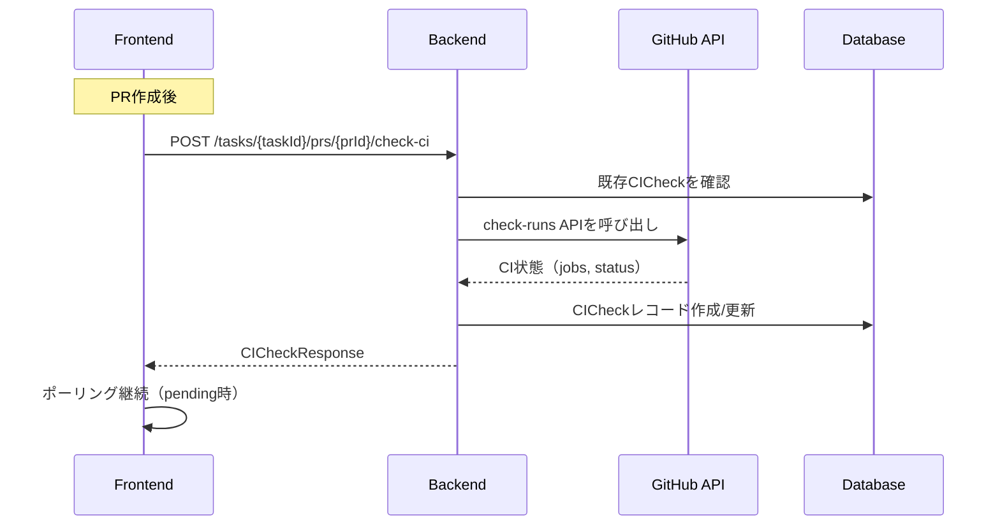

# Check CI 機能の現状分析と改善計画

このドキュメントでは、「Check CI」機能の現状の挙動、問題点、およびあるべき姿との乖離を分析し、改善計画をまとめます。

## 1. あるべき姿（期待される動作）

1. **PRが作成されていない場合は`Check CI`は実行しない**
2. **PRが作成済みの場合はImplementation後にCheck CIを実行**
3. **PRのCIが実行になったらTaskの`Check CI`もそれを追従して実行する**
4. **Taskに紐づく実行されている`Check CI`の数は1つ**
5. **ずっと`Pending`の状態ではあるべきではない**
6. **`Check CI`が更新するたびにボトムまで強制的にスクロールされるべきではない**
7. **`Check CI`がTask内に連投されるべきではなく、同一のSHAの`Check CI`があればそれに対して更新を行う**

## 2. 現状のアーキテクチャ

### 2.1 バックエンド構成

```
apps/api/src/zloth_api/
├── services/
│   ├── ci_check_service.py    # CI状態チェックのコアロジック
│   ├── ci_polling_service.py  # CI状態のポーリング（Agentic用）
│   └── metrics_service.py     # メトリクス集計
├── routes/
│   └── prs.py                 # PR関連エンドポイント（CI checkを含む）
└── storage/
    └── dao.py                 # CICheckDAO（データ永続化）
```

### 2.2 フロントエンド構成

```
apps/web/src/
├── components/
│   ├── ChatCodeView.tsx       # メインUI（CI check表示・制御）
│   └── CIResultCard.tsx       # CI結果表示コンポーネント
└── lib/
    └── api.ts                 # APIクライアント（ciChecksApi）
```

### 2.3 データフロー



## 3. 問題点の詳細分析

### 3.1 CI Checkの連投問題

**問題箇所**: `CICheckService.check_ci()` と `CICheckDAO`

**現状の動作**:
- `check_ci()`は毎回新しいCICheckレコードを作成する可能性がある
- SHAベースの重複チェックは存在するが、タイミングによっては重複が発生する

**コード参照** (`ci_check_service.py:146-181`):
```python
# 既存チェックの検索ロジック
existing = None
if sha:
    existing = await self.ci_check_dao.get_by_pr_and_sha(pr_id, sha)
    if not existing:
        pending_without_sha = await self.ci_check_dao.get_latest_pending_by_pr_id(pr_id)
        if pending_without_sha and pending_without_sha.sha is None:
            existing = pending_without_sha
else:
    existing = await self.ci_check_dao.get_latest_pending_by_pr_id(pr_id)
```

**問題点**:
- SHAがNoneの場合、新しいpendingレコードが作成され続ける可能性
- クールダウン（30秒）は同一SHA+PR組み合わせのみに適用

### 3.2 Pending状態が継続する問題

**問題箇所**: フロントエンドのポーリングロジック

**現状の動作** (`ChatCodeView.tsx:512-559`):
```typescript
useEffect(() => {
    if (!prResult?.pr_id || !ciChecks) return;
    if (checkingCI) return;

    const pendingCheck = ciChecks.find(
      (c) => c.status === 'pending' && c.pr_id === prResult.pr_id
    );

    if (pendingCheck) {
      const checkKey = pendingCheck.sha || pendingCheck.id;
      if (lastTriggeredCICheckRef.current === checkKey) {
        return;  // 同じチェックは再トリガーしない
      }
      // ...
    }
}
```

**問題点**:
1. `lastTriggeredCICheckRef`により、一度トリガーされたCIチェックは再度トリガーされない
2. GitHub APIがCI未開始状態を返し続ける場合、永続的にpendingのまま
3. タイムアウト処理がフロントエンドにない

### 3.3 実装後のCI自動実行問題

**問題箇所**: `prs.py`の`_trigger_ci_check_if_enabled()`

**現状の動作**:
```python
async def _trigger_ci_check_if_enabled(
    task_id: str,
    pr_id: str,
    ci_check_service: CICheckService,
    user_preferences_dao: UserPreferencesDAO,
    run_dao: RunDAO | None = None,
) -> None:
    # enable_gating_statusが有効な場合のみトリガー
    prefs = await user_preferences_dao.get()
    if not prefs or not prefs.enable_gating_status:
        return
```

**問題点**:
1. `enable_gating_status`が無効の場合、自動CIチェックは行われない
2. 実装（Run）完了後ではなく、PR作成/更新時のみトリガー
3. PRが既に存在する場合の実装完了後の自動CIチェックがない

### 3.4 スクロール問題

**問題箇所**: `ChatCodeView.tsx:116-118`

**現状の動作**:
```typescript
// Auto-scroll to bottom
useEffect(() => {
  messagesEndRef.current?.scrollIntoView({ behavior: 'smooth' });
}, [messages, runs, reviews]);  // ciChecksは含まれていないが...
```

**問題点**:
- 依存配列に`ciChecks`はないが、`timeline`の再計算によりコンポーネントが再レンダリングされる
- `timeline`にCI Checkが含まれており、更新時にスクロールが発生する可能性

### 3.5 Metricsの不整合

**問題箇所**: `MetricsDAO.get_realtime_metrics()`

**現状の動作** (`dao.py:2544-2550`):
```python
# Pending CI checks
ci_query = f"""
    SELECT COUNT(*) as count
    FROM ci_checks
    WHERE status = 'pending'{repo_filter}
"""
```

**問題点**:
- すべてのpending CIチェックをカウント
- 古いpendingレコードが残っている場合、実際のアクティブタスク数と乖離

## 4. 改善計画

### Phase 1: 重複作成の防止（必須）

#### 4.1.1 CICheckDAO の改善

```python
# 新しいメソッド追加
async def get_or_create_for_sha(
    self,
    task_id: str,
    pr_id: str,
    sha: str,
) -> tuple[CICheck, bool]:
    """SHA用のCI Checkを取得または作成する。
    
    Returns:
        (ci_check, created): 作成された場合はTrue
    """
    existing = await self.get_by_pr_and_sha(pr_id, sha)
    if existing:
        return (existing, False)
    
    new_check = await self.create(
        task_id=task_id,
        pr_id=pr_id,
        status="pending",
        sha=sha,
    )
    return (new_check, True)
```

#### 4.1.2 CICheckService の改善

```python
async def check_ci(self, task_id: str, pr_id: str, force: bool = False) -> CICheckResponse:
    # ... PRとTask検証 ...
    
    # GitHub APIからSHAを取得
    ci_data = await self._build_ci_data(pr.number, repo_full_name)
    sha = ci_data.get("sha")
    
    if not sha:
        # SHAが取得できない場合はエラー
        raise ValueError("Could not determine PR head SHA")
    
    # 同一SHAのチェックを取得または作成（重複防止）
    ci_check, created = await self.ci_check_dao.get_or_create_for_sha(
        task_id=task_id,
        pr_id=pr_id,
        sha=sha,
    )
    
    # ステータス更新
    ci_check = await self.ci_check_dao.update(
        id=ci_check.id,
        status=self._derive_status_from_jobs(ci_data.get("jobs", {})),
        jobs=ci_data.get("jobs"),
        failed_jobs=ci_data.get("failed_jobs"),
    )
```

### Phase 2: Pending状態のタイムアウト処理

#### 4.2.1 バックエンド: ステータス遷移の追加

```python
# ci_check_service.py
CI_CHECK_TIMEOUT_MINUTES = 60  # 1時間でタイムアウト

async def check_ci(self, task_id: str, pr_id: str, force: bool = False) -> CICheckResponse:
    # ... 既存ロジック ...
    
    # タイムアウトチェック
    if existing_check:
        age = datetime.utcnow() - existing_check.created_at
        if age > timedelta(minutes=CI_CHECK_TIMEOUT_MINUTES):
            if existing_check.status == "pending":
                await self.ci_check_dao.update(
                    id=existing_check.id,
                    status="timeout",
                )
                return CICheckResponse(
                    ci_check=existing_check,
                    is_complete=True,
                )
```

#### 4.2.2 フロントエンド: ポーリング制限

```typescript
// ChatCodeView.tsx
const CI_CHECK_MAX_POLL_ATTEMPTS = 180;  // 30分（10秒間隔）
const CI_CHECK_POLL_INTERVAL = 10000;

// ポーリング回数をトラック
const ciPollCountRef = useRef<Map<string, number>>(new Map());

useEffect(() => {
  if (!prResult?.pr_id || !ciChecks) return;
  
  const pendingCheck = ciChecks.find(c => c.status === 'pending');
  if (!pendingCheck) return;
  
  const checkKey = pendingCheck.sha || pendingCheck.id;
  const pollCount = ciPollCountRef.current.get(checkKey) || 0;
  
  if (pollCount >= CI_CHECK_MAX_POLL_ATTEMPTS) {
    console.warn(`CI check polling limit reached for ${checkKey}`);
    return;
  }
  
  ciPollCountRef.current.set(checkKey, pollCount + 1);
  // ... トリガーロジック ...
}, [ciChecks, prResult?.pr_id]);
```

### Phase 3: 実装後の自動CIチェック

#### 4.3.1 Run完了時のCIチェックトリガー

```python
# run_service.py の _execute_cli_run 完了時
async def _execute_cli_run(self, ...):
    # ... 既存の実行ロジック ...
    
    # 成功時、PRが存在すればCIチェックをトリガー
    if commit_sha:
        await self._trigger_ci_check_after_implementation(run.task_id)

async def _trigger_ci_check_after_implementation(self, task_id: str) -> None:
    """実装完了後にCIチェックをトリガー"""
    from zloth_api.dependencies import get_ci_check_service, get_pr_dao
    
    pr_dao = await get_pr_dao()
    prs = await pr_dao.list(task_id)
    
    if not prs:
        return  # PRなしの場合はスキップ
    
    latest_pr = prs[0]  # 最新のPR
    if latest_pr.status != "open":
        return
    
    ci_check_service = await get_ci_check_service()
    await ci_check_service.check_ci(task_id, latest_pr.id)
```

### Phase 4: スクロール動作の修正

```typescript
// ChatCodeView.tsx

// CI Check更新時はスクロールしない
const [shouldScrollToBottom, setShouldScrollToBottom] = useState(true);

// メッセージ・Run追加時のみスクロール
useEffect(() => {
  if (shouldScrollToBottom) {
    messagesEndRef.current?.scrollIntoView({ behavior: 'smooth' });
  }
}, [messages, runs, shouldScrollToBottom]);

// CI Check更新時はスクロールフラグをfalseに
useEffect(() => {
  setShouldScrollToBottom(false);
}, [ciChecks]);

// ユーザー入力時はスクロールフラグをtrueに
const handleSubmit = async (e: React.FormEvent) => {
  setShouldScrollToBottom(true);
  // ... 既存ロジック ...
};
```

### Phase 5: PRなしの場合のCI Check防止

#### 4.5.1 フロントエンドでのガード

```typescript
// ChatCodeView.tsx

// Check CIボタンはPRが存在する場合のみ表示
{prResult?.pr_id && (
  <Button
    onClick={onCheckCI}
    disabled={checkingCI}
    isLoading={checkingCI}
  >
    Check CI
  </Button>
)}
```

#### 4.5.2 バックエンドでのガード

```python
# ci_check_service.py
async def check_ci(self, task_id: str, pr_id: str, force: bool = False) -> CICheckResponse:
    # PRの存在確認（既存）
    pr = await self.pr_dao.get(pr_id)
    if not pr:
        raise ValueError(f"PR not found: {pr_id}")
    
    # PRがオープンでない場合はスキップ
    if pr.status != "open":
        raise ValueError(f"PR is not open (status: {pr.status})")
```

## 5. 実装優先度

| Priority | Phase | 説明 | 影響範囲 |
|----------|-------|------|----------|
| P0 | 4.1 | 重複作成の防止 | Backend |
| P0 | 4.5 | PRなしのCI Check防止 | Frontend/Backend |
| P1 | 4.2 | Pending状態のタイムアウト | Frontend/Backend |
| P1 | 4.4 | スクロール動作の修正 | Frontend |
| P2 | 4.3 | 実装後の自動CIチェック | Backend |

## 6. テスト計画

### 6.1 ユニットテスト

```python
# test_ci_check_service.py
async def test_no_duplicate_ci_checks_for_same_sha():
    """同一SHAに対して重複したCI Checkが作成されないこと"""
    pass

async def test_ci_check_timeout():
    """タイムアウト後にステータスが適切に更新されること"""
    pass

async def test_ci_check_requires_pr():
    """PRが存在しない場合はエラーになること"""
    pass
```

### 6.2 E2Eテスト

```typescript
// check_ci.spec.ts
test('CI check is not duplicated for same SHA', async () => {
  // 同じPRに対して複数回Check CIを実行
  // CI Checkが1つだけ表示されることを確認
});

test('CI check polling stops after timeout', async () => {
  // pendingのCI checkがタイムアウト後に停止することを確認
});
```

## 7. まとめ

現状の「Check CI」機能には以下の主な問題があります：

1. **重複作成**: 同一SHAに対して複数のCI Checkレコードが作成される
2. **Pending継続**: タイムアウト処理がなく、永続的にpending状態になる
3. **自動実行欠如**: 実装完了後の自動CIチェックが不十分
4. **UX問題**: 更新時の強制スクロール

これらの問題を解決するために、バックエンドでの重複防止ロジックの強化、フロントエンドでのポーリング制限、そして適切なタイムアウト処理の実装が必要です。
