# CI for Agentic Dursor - 完全自律CI設計

## 概要

本ドキュメントは、[Agentic Dursor](./agentic-dursor.md)の完全自律開発フローを支えるCI（継続的インテグレーション）システムの設計を定義する。

### 目的

従来のCIは「人間への通知」が最終出力だが、Agentic DursorのCIは「AIエージェントへのアクション可能なフィードバック」を提供することが目的である。

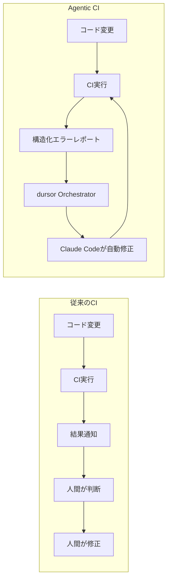

### 設計原則

| 原則 | 説明 |
|------|------|
| **Machine-Readable Output** | エラーは構造化JSONで出力し、AIが解析可能にする |
| **Actionable Feedback** | 何が問題で、どう直すべきかを明示する |
| **Fail-Fast** | 早い段階でエラーを検知し、無駄な実行を避ける |
| **Loop Prevention** | 無限ループを検知・防止するガードレールを設ける |
| **Idempotent** | 同じ入力に対して同じ結果を返す |
| **Observable** | 全ての状態変化を追跡可能にする |

---

## CIアーキテクチャ

### システム全体像

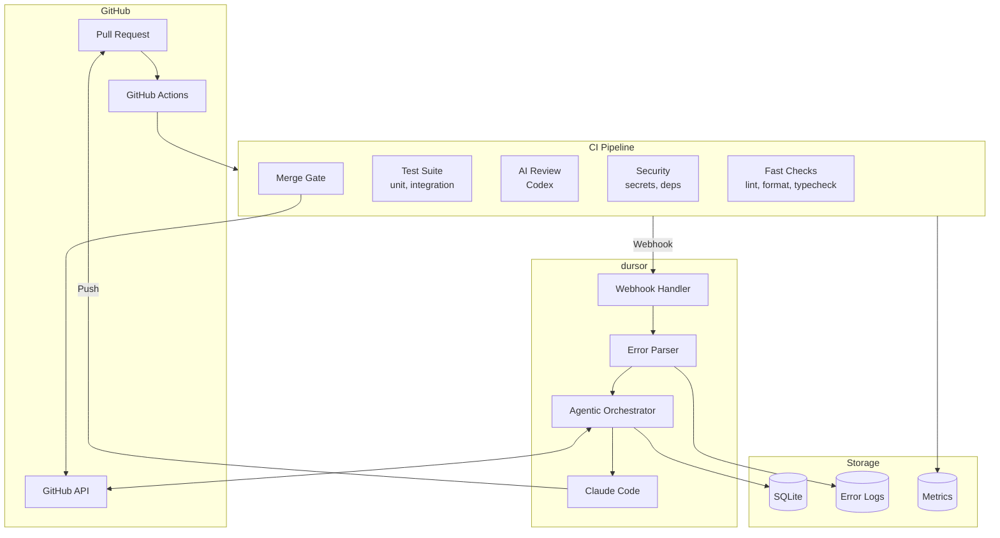

### CI/dursor 責務分離

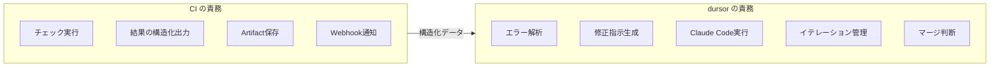

---

## パイプライン設計

### パイプライン構成

CIパイプラインは3つのステージで構成される。

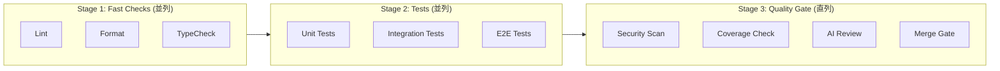

### ジョブ依存関係

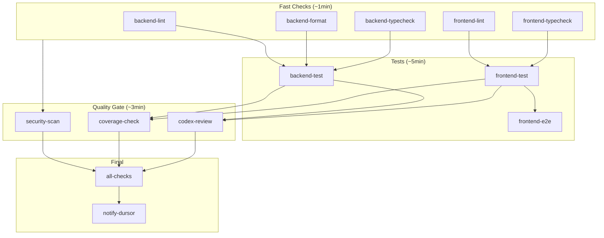

### GitHub Actions Workflow

```yaml
# .github/workflows/agentic-ci.yml
name: Agentic CI

on:
  push:
    branches: [main]
  pull_request:
    branches: [main]

concurrency:
  group: ci-${{ github.ref }}
  cancel-in-progress: true

env:
  PYTHON_VERSION: "3.13"
  NODE_VERSION: "20"

jobs:
  # ============================================
  # Stage 1: Fast Checks (並列実行)
  # ============================================

  backend-lint:
    name: Backend Lint
    runs-on: ubuntu-latest
    defaults:
      run:
        working-directory: apps/api
    outputs:
      result: ${{ steps.lint.outputs.result }}
      errors: ${{ steps.lint.outputs.errors }}
    steps:
      - uses: actions/checkout@v4
      - uses: astral-sh/setup-uv@v4
      - run: uv python install ${{ env.PYTHON_VERSION }}
      - run: uv sync --extra dev

      - name: Run ruff check
        id: lint
        continue-on-error: true
        run: |
          # 構造化出力を生成
          uv run ruff check src/ --output-format=json > lint_result.json 2>&1 || true

          # 結果を判定
          if [ -s lint_result.json ] && [ "$(jq length lint_result.json)" -gt 0 ]; then
            echo "result=failure" >> $GITHUB_OUTPUT
            # エラーをBase64エンコードして出力
            echo "errors=$(base64 -w0 lint_result.json)" >> $GITHUB_OUTPUT
            exit 1
          else
            echo "result=success" >> $GITHUB_OUTPUT
            echo "errors=" >> $GITHUB_OUTPUT
          fi

      - name: Upload lint result
        if: always()
        uses: actions/upload-artifact@v4
        with:
          name: backend-lint-result
          path: apps/api/lint_result.json
          if-no-files-found: ignore

  backend-format:
    name: Backend Format
    runs-on: ubuntu-latest
    defaults:
      run:
        working-directory: apps/api
    outputs:
      result: ${{ steps.format.outputs.result }}
      errors: ${{ steps.format.outputs.errors }}
    steps:
      - uses: actions/checkout@v4
      - uses: astral-sh/setup-uv@v4
      - run: uv python install ${{ env.PYTHON_VERSION }}
      - run: uv sync --extra dev

      - name: Run ruff format check
        id: format
        continue-on-error: true
        run: |
          # フォーマット差分を検出
          uv run ruff format --check --diff src/ > format_diff.txt 2>&1 || true

          if [ -s format_diff.txt ]; then
            echo "result=failure" >> $GITHUB_OUTPUT

            # 構造化エラーを生成
            jq -n --arg diff "$(cat format_diff.txt)" \
              '{type: "format", files: [], diff: $diff}' > format_result.json
            echo "errors=$(base64 -w0 format_result.json)" >> $GITHUB_OUTPUT
            exit 1
          else
            echo "result=success" >> $GITHUB_OUTPUT
            echo "errors=" >> $GITHUB_OUTPUT
          fi

      - name: Upload format result
        if: always()
        uses: actions/upload-artifact@v4
        with:
          name: backend-format-result
          path: apps/api/format_diff.txt
          if-no-files-found: ignore

  backend-typecheck:
    name: Backend TypeCheck
    runs-on: ubuntu-latest
    defaults:
      run:
        working-directory: apps/api
    outputs:
      result: ${{ steps.typecheck.outputs.result }}
      errors: ${{ steps.typecheck.outputs.errors }}
    steps:
      - uses: actions/checkout@v4
      - uses: astral-sh/setup-uv@v4
      - run: uv python install ${{ env.PYTHON_VERSION }}
      - run: uv sync --extra dev

      - name: Run mypy
        id: typecheck
        continue-on-error: true
        run: |
          # JSON出力でmypyを実行
          uv run mypy src/ --output=json > mypy_result.json 2>&1 || true

          if [ -s mypy_result.json ]; then
            # エラー数をカウント
            error_count=$(jq -s 'map(select(.severity == "error")) | length' mypy_result.json)

            if [ "$error_count" -gt 0 ]; then
              echo "result=failure" >> $GITHUB_OUTPUT
              echo "errors=$(base64 -w0 mypy_result.json)" >> $GITHUB_OUTPUT
              exit 1
            fi
          fi

          echo "result=success" >> $GITHUB_OUTPUT
          echo "errors=" >> $GITHUB_OUTPUT

      - name: Upload typecheck result
        if: always()
        uses: actions/upload-artifact@v4
        with:
          name: backend-typecheck-result
          path: apps/api/mypy_result.json
          if-no-files-found: ignore

  frontend-lint:
    name: Frontend Lint
    runs-on: ubuntu-latest
    defaults:
      run:
        working-directory: apps/web
    outputs:
      result: ${{ steps.lint.outputs.result }}
      errors: ${{ steps.lint.outputs.errors }}
    steps:
      - uses: actions/checkout@v4
      - uses: actions/setup-node@v4
        with:
          node-version: ${{ env.NODE_VERSION }}
          cache: npm
          cache-dependency-path: apps/web/package-lock.json
      - run: npm ci

      - name: Run ESLint
        id: lint
        continue-on-error: true
        run: |
          # JSON形式で出力
          npm run lint -- --format json --output-file eslint_result.json || true

          if [ -s eslint_result.json ]; then
            error_count=$(jq '[.[].errorCount] | add // 0' eslint_result.json)

            if [ "$error_count" -gt 0 ]; then
              echo "result=failure" >> $GITHUB_OUTPUT
              echo "errors=$(base64 -w0 eslint_result.json)" >> $GITHUB_OUTPUT
              exit 1
            fi
          fi

          echo "result=success" >> $GITHUB_OUTPUT
          echo "errors=" >> $GITHUB_OUTPUT

      - name: Upload lint result
        if: always()
        uses: actions/upload-artifact@v4
        with:
          name: frontend-lint-result
          path: apps/web/eslint_result.json
          if-no-files-found: ignore

  frontend-typecheck:
    name: Frontend TypeCheck
    runs-on: ubuntu-latest
    defaults:
      run:
        working-directory: apps/web
    outputs:
      result: ${{ steps.typecheck.outputs.result }}
      errors: ${{ steps.typecheck.outputs.errors }}
    steps:
      - uses: actions/checkout@v4
      - uses: actions/setup-node@v4
        with:
          node-version: ${{ env.NODE_VERSION }}
          cache: npm
          cache-dependency-path: apps/web/package-lock.json
      - run: npm ci

      - name: Run TypeScript Check
        id: typecheck
        continue-on-error: true
        run: |
          # tscでビルドチェック
          npx tsc --noEmit 2>&1 | tee tsc_output.txt || true

          if grep -q "error TS" tsc_output.txt; then
            echo "result=failure" >> $GITHUB_OUTPUT

            # 構造化エラーに変換
            python3 << 'EOF' > tsc_result.json
import json
import re
import sys

errors = []
with open('tsc_output.txt') as f:
    for line in f:
        match = re.match(r'(.+)\((\d+),(\d+)\): error (TS\d+): (.+)', line)
        if match:
            errors.append({
                'file': match.group(1),
                'line': int(match.group(2)),
                'column': int(match.group(3)),
                'code': match.group(4),
                'message': match.group(5)
            })

print(json.dumps(errors))
EOF
            echo "errors=$(base64 -w0 tsc_result.json)" >> $GITHUB_OUTPUT
            exit 1
          fi

          echo "result=success" >> $GITHUB_OUTPUT
          echo "errors=" >> $GITHUB_OUTPUT

  # ============================================
  # Stage 2: Tests
  # ============================================

  backend-test:
    name: Backend Tests
    runs-on: ubuntu-latest
    needs: [backend-lint, backend-format, backend-typecheck]
    if: |
      always() &&
      (needs.backend-lint.result == 'success' || needs.backend-lint.result == 'skipped') &&
      (needs.backend-format.result == 'success' || needs.backend-format.result == 'skipped') &&
      (needs.backend-typecheck.result == 'success' || needs.backend-typecheck.result == 'skipped')
    defaults:
      run:
        working-directory: apps/api
    outputs:
      result: ${{ steps.test.outputs.result }}
      errors: ${{ steps.test.outputs.errors }}
      coverage: ${{ steps.test.outputs.coverage }}
    steps:
      - uses: actions/checkout@v4
      - uses: astral-sh/setup-uv@v4
      - run: uv python install ${{ env.PYTHON_VERSION }}
      - run: uv sync --extra dev

      - name: Run pytest
        id: test
        continue-on-error: true
        run: |
          # JSON形式でテスト結果を出力
          uv run pytest \
            --json-report \
            --json-report-file=pytest_result.json \
            --cov=src \
            --cov-report=json:coverage.json \
            --cov-fail-under=0 \
            -v 2>&1 | tee pytest_output.txt || true

          # 結果を解析
          if [ -f pytest_result.json ]; then
            failed=$(jq '.summary.failed // 0' pytest_result.json)
            error=$(jq '.summary.error // 0' pytest_result.json)

            if [ "$failed" -gt 0 ] || [ "$error" -gt 0 ]; then
              echo "result=failure" >> $GITHUB_OUTPUT
              echo "errors=$(base64 -w0 pytest_result.json)" >> $GITHUB_OUTPUT
            else
              echo "result=success" >> $GITHUB_OUTPUT
              echo "errors=" >> $GITHUB_OUTPUT
            fi
          else
            echo "result=failure" >> $GITHUB_OUTPUT
            echo "errors=" >> $GITHUB_OUTPUT
          fi

          # カバレッジを出力
          if [ -f coverage.json ]; then
            coverage=$(jq '.totals.percent_covered // 0' coverage.json)
            echo "coverage=$coverage" >> $GITHUB_OUTPUT
          fi

      - name: Upload test results
        if: always()
        uses: actions/upload-artifact@v4
        with:
          name: backend-test-result
          path: |
            apps/api/pytest_result.json
            apps/api/coverage.json
          if-no-files-found: ignore

  frontend-test:
    name: Frontend Tests
    runs-on: ubuntu-latest
    needs: [frontend-lint, frontend-typecheck]
    if: |
      always() &&
      (needs.frontend-lint.result == 'success' || needs.frontend-lint.result == 'skipped') &&
      (needs.frontend-typecheck.result == 'success' || needs.frontend-typecheck.result == 'skipped')
    defaults:
      run:
        working-directory: apps/web
    outputs:
      result: ${{ steps.test.outputs.result }}
      errors: ${{ steps.test.outputs.errors }}
    steps:
      - uses: actions/checkout@v4
      - uses: actions/setup-node@v4
        with:
          node-version: ${{ env.NODE_VERSION }}
          cache: npm
          cache-dependency-path: apps/web/package-lock.json
      - run: npm ci

      - name: Run tests
        id: test
        continue-on-error: true
        run: |
          npm run test -- --json --outputFile=jest_result.json || true

          if [ -f jest_result.json ]; then
            success=$(jq '.success' jest_result.json)

            if [ "$success" != "true" ]; then
              echo "result=failure" >> $GITHUB_OUTPUT
              echo "errors=$(base64 -w0 jest_result.json)" >> $GITHUB_OUTPUT
            else
              echo "result=success" >> $GITHUB_OUTPUT
              echo "errors=" >> $GITHUB_OUTPUT
            fi
          else
            echo "result=success" >> $GITHUB_OUTPUT
            echo "errors=" >> $GITHUB_OUTPUT
          fi

  frontend-build:
    name: Frontend Build
    runs-on: ubuntu-latest
    needs: [frontend-test]
    if: always() && needs.frontend-test.result == 'success'
    defaults:
      run:
        working-directory: apps/web
    outputs:
      result: ${{ steps.build.outputs.result }}
      errors: ${{ steps.build.outputs.errors }}
    steps:
      - uses: actions/checkout@v4
      - uses: actions/setup-node@v4
        with:
          node-version: ${{ env.NODE_VERSION }}
          cache: npm
          cache-dependency-path: apps/web/package-lock.json
      - run: npm ci

      - name: Build
        id: build
        continue-on-error: true
        run: |
          npm run build 2>&1 | tee build_output.txt || true

          if [ ${PIPESTATUS[0]} -ne 0 ]; then
            echo "result=failure" >> $GITHUB_OUTPUT

            # ビルドエラーを構造化
            jq -n --arg output "$(cat build_output.txt)" \
              '{type: "build", output: $output}' > build_result.json
            echo "errors=$(base64 -w0 build_result.json)" >> $GITHUB_OUTPUT
            exit 1
          fi

          echo "result=success" >> $GITHUB_OUTPUT
          echo "errors=" >> $GITHUB_OUTPUT

  # ============================================
  # Stage 3: Quality Gate
  # ============================================

  security-scan:
    name: Security Scan
    runs-on: ubuntu-latest
    needs: [backend-lint, frontend-lint]
    if: always()
    outputs:
      result: ${{ steps.scan.outputs.result }}
      errors: ${{ steps.scan.outputs.errors }}
    steps:
      - uses: actions/checkout@v4

      - name: Install detect-secrets
        run: pip install detect-secrets

      - name: Scan for secrets
        id: scan
        continue-on-error: true
        run: |
          detect-secrets scan \
            --all-files \
            --exclude-files '\.git/.*' \
            --exclude-files 'node_modules/.*' \
            --exclude-files '\.venv/.*' \
            > secrets_result.json 2>&1 || true

          if [ -f secrets_result.json ]; then
            count=$(jq '.results | to_entries | map(.value | length) | add // 0' secrets_result.json)

            if [ "$count" -gt 0 ]; then
              echo "result=failure" >> $GITHUB_OUTPUT
              echo "errors=$(base64 -w0 secrets_result.json)" >> $GITHUB_OUTPUT
              exit 1
            fi
          fi

          echo "result=success" >> $GITHUB_OUTPUT
          echo "errors=" >> $GITHUB_OUTPUT

      - name: Upload security result
        if: always()
        uses: actions/upload-artifact@v4
        with:
          name: security-scan-result
          path: secrets_result.json
          if-no-files-found: ignore

  coverage-check:
    name: Coverage Check
    runs-on: ubuntu-latest
    needs: [backend-test]
    if: always() && needs.backend-test.result == 'success'
    outputs:
      result: ${{ steps.coverage.outputs.result }}
      errors: ${{ steps.coverage.outputs.errors }}
    env:
      COVERAGE_THRESHOLD: 80
    steps:
      - uses: actions/download-artifact@v4
        with:
          name: backend-test-result
          path: .

      - name: Check coverage threshold
        id: coverage
        run: |
          if [ -f coverage.json ]; then
            coverage=$(jq '.totals.percent_covered // 0' coverage.json)
            threshold=${{ env.COVERAGE_THRESHOLD }}

            echo "Coverage: $coverage%"
            echo "Threshold: $threshold%"

            # 小数点比較
            if (( $(echo "$coverage < $threshold" | bc -l) )); then
              echo "result=failure" >> $GITHUB_OUTPUT

              # カバレッジ不足ファイルを特定
              jq --argjson threshold "$threshold" '
                .files | to_entries | map(
                  select(.value.summary.percent_covered < $threshold)
                ) | map({
                  file: .key,
                  coverage: .value.summary.percent_covered,
                  missing_lines: .value.missing_lines
                })
              ' coverage.json > coverage_errors.json

              echo "errors=$(base64 -w0 coverage_errors.json)" >> $GITHUB_OUTPUT
              exit 1
            fi
          fi

          echo "result=success" >> $GITHUB_OUTPUT
          echo "errors=" >> $GITHUB_OUTPUT

  codex-review:
    name: Codex Review
    runs-on: ubuntu-latest
    needs: [backend-test, frontend-build, security-scan]
    if: |
      always() &&
      github.event_name == 'pull_request' &&
      needs.backend-test.result == 'success' &&
      needs.frontend-build.result == 'success' &&
      needs.security-scan.result == 'success'
    outputs:
      result: ${{ steps.review.outputs.result }}
      errors: ${{ steps.review.outputs.errors }}
      score: ${{ steps.review.outputs.score }}
    env:
      MIN_REVIEW_SCORE: 0.75
    steps:
      - uses: actions/checkout@v4
        with:
          fetch-depth: 0

      - name: Get PR diff
        run: |
          git diff origin/${{ github.base_ref }}...HEAD > changes.diff

      - name: Run Codex Review
        id: review
        continue-on-error: true
        env:
          OPENAI_API_KEY: ${{ secrets.OPENAI_API_KEY }}
        run: |
          # Codex CLI でレビュー実行
          # 注: 実際のCLIコマンドは実装に依存
          codex review \
            --diff changes.diff \
            --output-format json \
            --include-suggestions \
            > review_result.json 2>&1 || true

          if [ -f review_result.json ]; then
            score=$(jq '.score // 0' review_result.json)
            approved=$(jq '.approved // false' review_result.json)

            echo "score=$score" >> $GITHUB_OUTPUT

            if [ "$approved" != "true" ]; then
              echo "result=failure" >> $GITHUB_OUTPUT
              echo "errors=$(base64 -w0 review_result.json)" >> $GITHUB_OUTPUT
              exit 1
            fi
          fi

          echo "result=success" >> $GITHUB_OUTPUT
          echo "errors=" >> $GITHUB_OUTPUT

      - name: Upload review result
        if: always()
        uses: actions/upload-artifact@v4
        with:
          name: codex-review-result
          path: review_result.json
          if-no-files-found: ignore

  # ============================================
  # Final: Aggregate & Notify
  # ============================================

  all-checks:
    name: All Checks
    runs-on: ubuntu-latest
    needs:
      - backend-lint
      - backend-format
      - backend-typecheck
      - backend-test
      - frontend-lint
      - frontend-typecheck
      - frontend-test
      - frontend-build
      - security-scan
      - coverage-check
      - codex-review
    if: always()
    outputs:
      conclusion: ${{ steps.aggregate.outputs.conclusion }}
      summary: ${{ steps.aggregate.outputs.summary }}
    steps:
      - name: Aggregate results
        id: aggregate
        run: |
          # 各ジョブの結果を収集
          declare -A results
          results[backend_lint]="${{ needs.backend-lint.result }}"
          results[backend_format]="${{ needs.backend-format.result }}"
          results[backend_typecheck]="${{ needs.backend-typecheck.result }}"
          results[backend_test]="${{ needs.backend-test.result }}"
          results[frontend_lint]="${{ needs.frontend-lint.result }}"
          results[frontend_typecheck]="${{ needs.frontend-typecheck.result }}"
          results[frontend_test]="${{ needs.frontend-test.result }}"
          results[frontend_build]="${{ needs.frontend-build.result }}"
          results[security_scan]="${{ needs.security-scan.result }}"
          results[coverage_check]="${{ needs.coverage-check.result }}"
          results[codex_review]="${{ needs.codex-review.result }}"

          # 失敗したジョブを特定
          failed_jobs=""
          for job in "${!results[@]}"; do
            if [[ "${results[$job]}" == "failure" ]]; then
              failed_jobs="$failed_jobs $job"
            fi
          done

          if [ -z "$failed_jobs" ]; then
            echo "conclusion=success" >> $GITHUB_OUTPUT
            echo "summary=All checks passed" >> $GITHUB_OUTPUT
          else
            echo "conclusion=failure" >> $GITHUB_OUTPUT
            echo "summary=Failed jobs:$failed_jobs" >> $GITHUB_OUTPUT
          fi

  notify-dursor:
    name: Notify dursor
    runs-on: ubuntu-latest
    needs:
      - all-checks
      - backend-lint
      - backend-format
      - backend-typecheck
      - backend-test
      - frontend-lint
      - frontend-typecheck
      - frontend-test
      - frontend-build
      - security-scan
      - coverage-check
      - codex-review
    if: always()
    steps:
      - name: Build webhook payload
        id: payload
        run: |
          # 構造化ペイロードを構築
          cat > payload.json << 'EOF'
          {
            "event": "ci_completed",
            "repository": "${{ github.repository }}",
            "ref": "${{ github.ref }}",
            "sha": "${{ github.sha }}",
            "pr_number": ${{ github.event.pull_request.number || 'null' }},
            "workflow_run_id": ${{ github.run_id }},
            "conclusion": "${{ needs.all-checks.outputs.conclusion }}",
            "timestamp": "${{ github.event.head_commit.timestamp || github.event.pull_request.updated_at }}",
            "iteration_marker": "${{ github.sha }}-${{ github.run_attempt }}",
            "jobs": {
              "backend_lint": {
                "result": "${{ needs.backend-lint.result }}",
                "errors_b64": "${{ needs.backend-lint.outputs.errors || '' }}"
              },
              "backend_format": {
                "result": "${{ needs.backend-format.result }}",
                "errors_b64": "${{ needs.backend-format.outputs.errors || '' }}"
              },
              "backend_typecheck": {
                "result": "${{ needs.backend-typecheck.result }}",
                "errors_b64": "${{ needs.backend-typecheck.outputs.errors || '' }}"
              },
              "backend_test": {
                "result": "${{ needs.backend-test.result }}",
                "errors_b64": "${{ needs.backend-test.outputs.errors || '' }}",
                "coverage": "${{ needs.backend-test.outputs.coverage || '0' }}"
              },
              "frontend_lint": {
                "result": "${{ needs.frontend-lint.result }}",
                "errors_b64": "${{ needs.frontend-lint.outputs.errors || '' }}"
              },
              "frontend_typecheck": {
                "result": "${{ needs.frontend-typecheck.result }}",
                "errors_b64": "${{ needs.frontend-typecheck.outputs.errors || '' }}"
              },
              "frontend_test": {
                "result": "${{ needs.frontend-test.result }}",
                "errors_b64": "${{ needs.frontend-test.outputs.errors || '' }}"
              },
              "frontend_build": {
                "result": "${{ needs.frontend-build.result }}",
                "errors_b64": "${{ needs.frontend-build.outputs.errors || '' }}"
              },
              "security_scan": {
                "result": "${{ needs.security-scan.result }}",
                "errors_b64": "${{ needs.security-scan.outputs.errors || '' }}"
              },
              "coverage_check": {
                "result": "${{ needs.coverage-check.result }}",
                "errors_b64": "${{ needs.coverage-check.outputs.errors || '' }}"
              },
              "codex_review": {
                "result": "${{ needs.codex-review.result }}",
                "errors_b64": "${{ needs.codex-review.outputs.errors || '' }}",
                "score": "${{ needs.codex-review.outputs.score || '0' }}"
              }
            }
          }
          EOF

      - name: Send webhook
        env:
          DURSOR_WEBHOOK_URL: ${{ secrets.DURSOR_WEBHOOK_URL }}
          DURSOR_WEBHOOK_SECRET: ${{ secrets.DURSOR_WEBHOOK_SECRET }}
        run: |
          # HMAC署名を計算
          SIGNATURE=$(cat payload.json | openssl dgst -sha256 -hmac "$DURSOR_WEBHOOK_SECRET" | awk '{print $2}')

          # Webhookを送信
          curl -X POST "$DURSOR_WEBHOOK_URL/v1/webhooks/ci" \
            -H "Content-Type: application/json" \
            -H "X-Hub-Signature-256: sha256=$SIGNATURE" \
            -H "X-GitHub-Event: workflow_run" \
            -H "X-GitHub-Delivery: ${{ github.run_id }}" \
            -d @payload.json \
            --retry 3 \
            --retry-delay 2 \
            --max-time 30
```

---

## エラーレポート形式

### 構造化エラーフォーマット

AIエージェントが効率的に修正を行うため、全てのエラーは以下の標準フォーマットに従う。

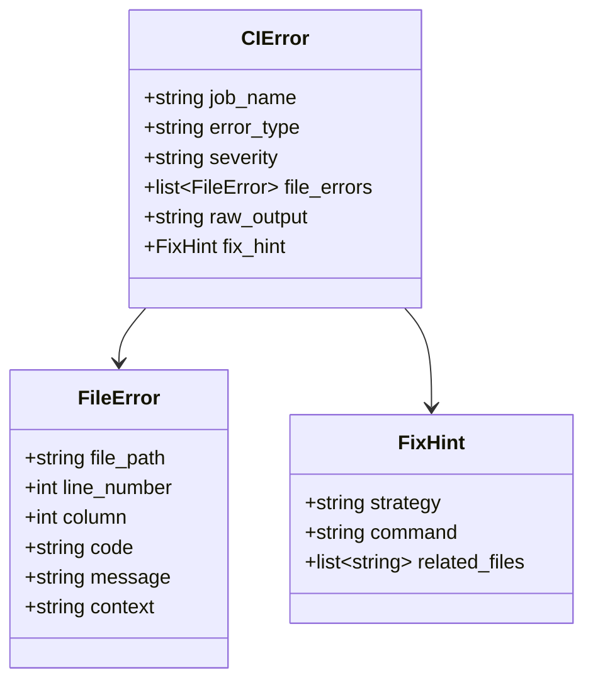

### エラータイプ別フォーマット

#### Lint Error (ruff / ESLint)

```json
{
  "job_name": "backend_lint",
  "error_type": "lint",
  "severity": "error",
  "file_errors": [
    {
      "file_path": "apps/api/src/dursor_api/services/run_service.py",
      "line_number": 42,
      "column": 5,
      "code": "F841",
      "message": "Local variable 'result' is assigned to but never used",
      "context": "        result = await self.execute(run)"
    }
  ],
  "fix_hint": {
    "strategy": "auto_fix",
    "command": "uv run ruff check --fix src/",
    "related_files": []
  }
}
```

#### Type Error (mypy / TypeScript)

```json
{
  "job_name": "backend_typecheck",
  "error_type": "type",
  "severity": "error",
  "file_errors": [
    {
      "file_path": "apps/api/src/dursor_api/services/pr_service.py",
      "line_number": 87,
      "column": 12,
      "code": "return-value",
      "message": "Incompatible return value type (got \"PR | None\", expected \"PR\")",
      "context": "        return self.pr_dao.get(pr_id)"
    }
  ],
  "fix_hint": {
    "strategy": "add_null_check",
    "command": null,
    "related_files": ["apps/api/src/dursor_api/storage/dao.py"]
  }
}
```

#### Test Failure (pytest / Jest)

```json
{
  "job_name": "backend_test",
  "error_type": "test",
  "severity": "error",
  "file_errors": [
    {
      "file_path": "apps/api/tests/test_run_service.py",
      "line_number": 156,
      "column": 0,
      "code": "AssertionError",
      "message": "Expected status 'completed' but got 'failed'",
      "context": "def test_run_completion():\n    ...\n    assert run.status == 'completed'"
    }
  ],
  "test_details": {
    "test_name": "test_run_service.py::test_run_completion",
    "duration": 0.234,
    "stdout": "Starting run execution...",
    "stderr": "Error: Connection timeout"
  },
  "fix_hint": {
    "strategy": "investigate",
    "command": "uv run pytest tests/test_run_service.py::test_run_completion -v",
    "related_files": ["apps/api/src/dursor_api/services/run_service.py"]
  }
}
```

#### Security Issue

```json
{
  "job_name": "security_scan",
  "error_type": "security",
  "severity": "critical",
  "file_errors": [
    {
      "file_path": "apps/api/src/dursor_api/config.py",
      "line_number": 23,
      "column": 0,
      "code": "HardcodedSecret",
      "message": "Potential hardcoded secret detected",
      "context": "API_KEY = \"sk-xxxxx...\""
    }
  ],
  "fix_hint": {
    "strategy": "use_env_var",
    "command": null,
    "related_files": [".env.example"]
  }
}
```

#### Coverage Failure

```json
{
  "job_name": "coverage_check",
  "error_type": "coverage",
  "severity": "warning",
  "file_errors": [
    {
      "file_path": "apps/api/src/dursor_api/services/pr_service.py",
      "line_number": null,
      "column": null,
      "code": "coverage",
      "message": "File coverage 65.2% is below threshold 80%",
      "context": null
    }
  ],
  "coverage_details": {
    "current": 65.2,
    "threshold": 80,
    "missing_lines": [45, 46, 47, 89, 90, 102, 103, 104]
  },
  "fix_hint": {
    "strategy": "add_tests",
    "command": null,
    "related_files": ["apps/api/tests/test_pr_service.py"]
  }
}
```

#### Review Rejection

```json
{
  "job_name": "codex_review",
  "error_type": "review",
  "severity": "error",
  "score": 0.62,
  "threshold": 0.75,
  "blocking_issues": [
    {
      "category": "security",
      "severity": "high",
      "file_path": "apps/api/src/dursor_api/routes/webhooks.py",
      "line_number": 34,
      "message": "SQL injection vulnerability: user input is directly concatenated into query",
      "suggested_fix": "Use parameterized queries instead of string concatenation"
    }
  ],
  "suggestions": [
    {
      "category": "performance",
      "priority": "medium",
      "message": "Consider using async batch operations for multiple database inserts"
    }
  ],
  "fix_hint": {
    "strategy": "address_blocking_first",
    "command": null,
    "related_files": []
  }
}
```

---

## フィードバックループ設計

### ループ全体フロー

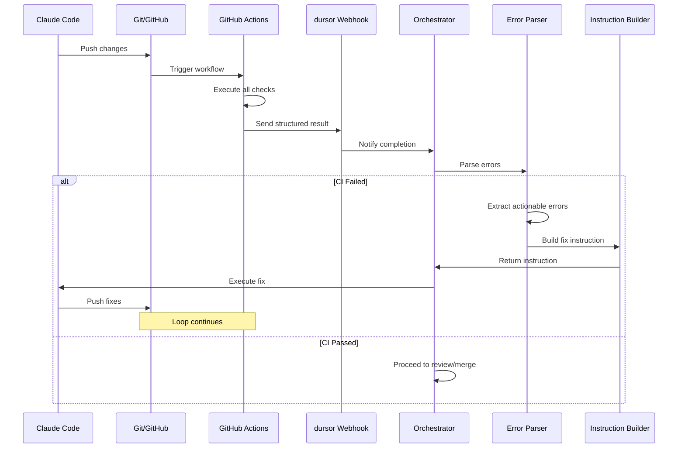

### Error Parser実装

```python
# apps/api/src/dursor_api/services/ci_error_parser.py

from dataclasses import dataclass
from enum import Enum
import json
import base64


class ErrorType(str, Enum):
    LINT = "lint"
    FORMAT = "format"
    TYPE = "type"
    TEST = "test"
    BUILD = "build"
    SECURITY = "security"
    COVERAGE = "coverage"
    REVIEW = "review"


class Severity(str, Enum):
    CRITICAL = "critical"
    ERROR = "error"
    WARNING = "warning"
    INFO = "info"


@dataclass
class FileError:
    file_path: str
    line_number: int | None
    column: int | None
    code: str
    message: str
    context: str | None = None


@dataclass
class FixHint:
    strategy: str
    command: str | None = None
    related_files: list[str] | None = None


@dataclass
class CIError:
    job_name: str
    error_type: ErrorType
    severity: Severity
    file_errors: list[FileError]
    raw_output: str | None = None
    fix_hint: FixHint | None = None


class CIErrorParser:
    """
    Parse structured CI errors and generate actionable fix instructions.
    """

    def parse_webhook_payload(self, payload: dict) -> list[CIError]:
        """
        Parse webhook payload and extract all errors.
        """
        errors = []

        for job_name, job_data in payload.get("jobs", {}).items():
            if job_data.get("result") != "failure":
                continue

            errors_b64 = job_data.get("errors_b64")
            if not errors_b64:
                continue

            # Base64デコード
            try:
                raw_errors = json.loads(base64.b64decode(errors_b64))
            except Exception:
                continue

            # ジョブタイプに応じてパース
            parsed = self._parse_job_errors(job_name, raw_errors)
            if parsed:
                errors.append(parsed)

        return errors

    def _parse_job_errors(self, job_name: str, raw_errors: dict | list) -> CIError | None:
        """
        Parse errors based on job type.
        """
        parser_map = {
            "backend_lint": self._parse_ruff_errors,
            "backend_format": self._parse_format_errors,
            "backend_typecheck": self._parse_mypy_errors,
            "backend_test": self._parse_pytest_errors,
            "frontend_lint": self._parse_eslint_errors,
            "frontend_typecheck": self._parse_tsc_errors,
            "frontend_test": self._parse_jest_errors,
            "frontend_build": self._parse_build_errors,
            "security_scan": self._parse_security_errors,
            "coverage_check": self._parse_coverage_errors,
            "codex_review": self._parse_review_errors,
        }

        parser = parser_map.get(job_name)
        if parser:
            return parser(job_name, raw_errors)
        return None

    def _parse_ruff_errors(self, job_name: str, errors: list) -> CIError:
        """Parse ruff JSON output."""
        file_errors = []
        for err in errors:
            file_errors.append(FileError(
                file_path=err.get("filename", ""),
                line_number=err.get("location", {}).get("row"),
                column=err.get("location", {}).get("column"),
                code=err.get("code", ""),
                message=err.get("message", ""),
                context=err.get("fix", {}).get("applicability"),
            ))

        return CIError(
            job_name=job_name,
            error_type=ErrorType.LINT,
            severity=Severity.ERROR,
            file_errors=file_errors,
            fix_hint=FixHint(
                strategy="auto_fix",
                command="cd apps/api && uv run ruff check --fix src/",
            ),
        )

    def _parse_mypy_errors(self, job_name: str, errors: list) -> CIError:
        """Parse mypy JSON output."""
        file_errors = []
        for err in errors:
            if err.get("severity") != "error":
                continue
            file_errors.append(FileError(
                file_path=err.get("file", ""),
                line_number=err.get("line"),
                column=err.get("column"),
                code=err.get("code", ""),
                message=err.get("message", ""),
            ))

        return CIError(
            job_name=job_name,
            error_type=ErrorType.TYPE,
            severity=Severity.ERROR,
            file_errors=file_errors,
            fix_hint=FixHint(
                strategy="add_type_annotations",
                command="cd apps/api && uv run mypy src/",
            ),
        )

    def _parse_pytest_errors(self, job_name: str, result: dict) -> CIError:
        """Parse pytest-json-report output."""
        file_errors = []

        for test in result.get("tests", []):
            if test.get("outcome") not in ("failed", "error"):
                continue

            # テストファイルとライン番号を抽出
            nodeid = test.get("nodeid", "")
            parts = nodeid.split("::")

            file_errors.append(FileError(
                file_path=parts[0] if parts else "",
                line_number=test.get("lineno"),
                column=None,
                code=test.get("outcome", "failed"),
                message=test.get("call", {}).get("longrepr", ""),
                context=test.get("call", {}).get("stdout"),
            ))

        return CIError(
            job_name=job_name,
            error_type=ErrorType.TEST,
            severity=Severity.ERROR,
            file_errors=file_errors,
            fix_hint=FixHint(
                strategy="investigate_and_fix",
                command="cd apps/api && uv run pytest -v --tb=short",
            ),
        )

    # ... 他のパーサーも同様に実装
```

### Instruction Builder実装

```python
# apps/api/src/dursor_api/services/fix_instruction_builder.py

from dataclasses import dataclass


@dataclass
class FixInstruction:
    summary: str
    detailed_errors: str
    fix_commands: list[str]
    priorities: list[str]
    constraints: list[str]


class FixInstructionBuilder:
    """
    Build actionable fix instructions from CI errors for Claude Code.
    """

    def build(self, errors: list[CIError], iteration: int) -> FixInstruction:
        """
        Build comprehensive fix instruction from all errors.
        """
        # エラーを優先度でソート
        sorted_errors = self._prioritize_errors(errors)

        # サマリーを構築
        summary = self._build_summary(sorted_errors)

        # 詳細エラー説明を構築
        detailed = self._build_detailed_errors(sorted_errors)

        # 修正コマンドを収集
        commands = self._collect_fix_commands(sorted_errors)

        # 優先順位を決定
        priorities = self._determine_priorities(sorted_errors)

        # 制約を追加
        constraints = self._build_constraints(iteration)

        return FixInstruction(
            summary=summary,
            detailed_errors=detailed,
            fix_commands=commands,
            priorities=priorities,
            constraints=constraints,
        )

    def _prioritize_errors(self, errors: list[CIError]) -> list[CIError]:
        """
        Sort errors by priority for fixing.

        Priority order:
        1. Security (critical)
        2. Type errors (block other fixes)
        3. Lint errors (often auto-fixable)
        4. Test failures
        5. Coverage
        6. Review feedback
        """
        priority_map = {
            ErrorType.SECURITY: 0,
            ErrorType.TYPE: 1,
            ErrorType.LINT: 2,
            ErrorType.FORMAT: 3,
            ErrorType.TEST: 4,
            ErrorType.BUILD: 5,
            ErrorType.COVERAGE: 6,
            ErrorType.REVIEW: 7,
        }

        return sorted(errors, key=lambda e: priority_map.get(e.error_type, 99))

    def _build_summary(self, errors: list[CIError]) -> str:
        """Build error summary."""
        type_counts = {}
        for err in errors:
            type_counts[err.error_type.value] = type_counts.get(err.error_type.value, 0) + 1

        parts = ["Fix the following CI failures:"]
        for err_type, count in type_counts.items():
            parts.append(f"- {err_type}: {count} error(s)")

        return "\n".join(parts)

    def _build_detailed_errors(self, errors: list[CIError]) -> str:
        """Build detailed error descriptions."""
        parts = []

        for err in errors:
            parts.append(f"\n## {err.job_name} ({err.error_type.value})\n")

            for file_err in err.file_errors:
                location = f"{file_err.file_path}"
                if file_err.line_number:
                    location += f":{file_err.line_number}"
                if file_err.column:
                    location += f":{file_err.column}"

                parts.append(f"### {location}")
                parts.append(f"**Code**: {file_err.code}")
                parts.append(f"**Message**: {file_err.message}")

                if file_err.context:
                    parts.append(f"```\n{file_err.context}\n```")

                parts.append("")

            if err.fix_hint:
                parts.append(f"**Fix strategy**: {err.fix_hint.strategy}")
                if err.fix_hint.command:
                    parts.append(f"**Command**: `{err.fix_hint.command}`")

        return "\n".join(parts)

    def _collect_fix_commands(self, errors: list[CIError]) -> list[str]:
        """Collect all suggested fix commands."""
        commands = []
        for err in errors:
            if err.fix_hint and err.fix_hint.command:
                commands.append(err.fix_hint.command)
        return commands

    def _determine_priorities(self, errors: list[CIError]) -> list[str]:
        """Determine fixing priorities."""
        priorities = []

        # セキュリティ問題は最優先
        if any(e.error_type == ErrorType.SECURITY for e in errors):
            priorities.append("CRITICAL: Fix security issues first - they are blocking")

        # 型エラーは他の問題に影響
        if any(e.error_type == ErrorType.TYPE for e in errors):
            priorities.append("Fix type errors before addressing test failures")

        # Lintは自動修正可能なことが多い
        if any(e.error_type == ErrorType.LINT for e in errors):
            priorities.append("Run auto-fix commands for lint errors where applicable")

        return priorities

    def _build_constraints(self, iteration: int) -> list[str]:
        """Build constraints based on iteration count."""
        constraints = [
            "Do NOT introduce new security vulnerabilities",
            "Maintain backward compatibility",
            "Run relevant checks locally before committing",
        ]

        if iteration > 3:
            constraints.append(
                "This is iteration {iteration}. Focus on the root cause, "
                "not just the symptoms. Consider if the original approach is correct."
            )

        if iteration > 5:
            constraints.append(
                "Multiple fix attempts have failed. Consider asking for human intervention "
                "if the issue cannot be resolved."
            )

        return constraints

    def to_prompt(self, instruction: FixInstruction) -> str:
        """Convert instruction to Claude Code prompt."""
        parts = [
            instruction.summary,
            "",
            "---",
            "",
            "## Detailed Errors",
            instruction.detailed_errors,
            "",
            "---",
            "",
            "## Priorities",
        ]

        for i, priority in enumerate(instruction.priorities, 1):
            parts.append(f"{i}. {priority}")

        parts.extend([
            "",
            "## Suggested Commands",
        ])

        for cmd in instruction.fix_commands:
            parts.append(f"- `{cmd}`")

        parts.extend([
            "",
            "## Constraints",
        ])

        for constraint in instruction.constraints:
            parts.append(f"- {constraint}")

        parts.extend([
            "",
            "---",
            "",
            "Please fix all errors and commit the changes.",
        ])

        return "\n".join(parts)
```

---

## 無限ループ防止

### ループ検知メカニズム

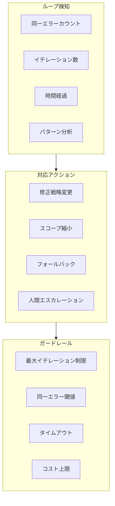

### Loop Guard実装

```python
# apps/api/src/dursor_api/services/loop_guard.py

from dataclasses import dataclass, field
from datetime import datetime, timedelta
from enum import Enum
import hashlib
from collections import defaultdict


class LoopAction(str, Enum):
    CONTINUE = "continue"
    CHANGE_STRATEGY = "change_strategy"
    REDUCE_SCOPE = "reduce_scope"
    FALLBACK = "fallback"
    ESCALATE = "escalate"
    ABORT = "abort"


@dataclass
class LoopState:
    task_id: str
    total_iterations: int = 0
    ci_iterations: int = 0
    review_iterations: int = 0
    error_history: list[str] = field(default_factory=list)
    error_counts: dict[str, int] = field(default_factory=lambda: defaultdict(int))
    started_at: datetime = field(default_factory=datetime.utcnow)
    last_error_hash: str | None = None
    consecutive_same_error: int = 0
    strategies_tried: list[str] = field(default_factory=list)


@dataclass
class LoopGuardConfig:
    max_total_iterations: int = 10
    max_ci_iterations: int = 5
    max_review_iterations: int = 3
    max_same_error_count: int = 3
    timeout_minutes: int = 60
    max_cost_usd: float = 50.0


class LoopGuard:
    """
    Prevents infinite loops in the agentic CI cycle.
    """

    def __init__(self, config: LoopGuardConfig):
        self.config = config
        self._states: dict[str, LoopState] = {}

    def check(
        self,
        task_id: str,
        errors: list[CIError],
        phase: str,
    ) -> LoopAction:
        """
        Check if the loop should continue, change strategy, or abort.
        """
        state = self._get_or_create_state(task_id)

        # 1. 絶対的な制限をチェック
        hard_limit = self._check_hard_limits(state)
        if hard_limit:
            return hard_limit

        # 2. エラーパターンを分析
        pattern_action = self._analyze_error_pattern(state, errors)
        if pattern_action != LoopAction.CONTINUE:
            return pattern_action

        # 3. 進捗をチェック
        progress_action = self._check_progress(state, errors)
        if progress_action != LoopAction.CONTINUE:
            return progress_action

        # 4. 状態を更新
        self._update_state(state, errors, phase)

        return LoopAction.CONTINUE

    def _get_or_create_state(self, task_id: str) -> LoopState:
        """Get or create loop state for a task."""
        if task_id not in self._states:
            self._states[task_id] = LoopState(task_id=task_id)
        return self._states[task_id]

    def _check_hard_limits(self, state: LoopState) -> LoopAction | None:
        """Check hard limits that trigger immediate abort."""
        # イテレーション上限
        if state.total_iterations >= self.config.max_total_iterations:
            return LoopAction.ABORT

        if state.ci_iterations >= self.config.max_ci_iterations:
            return LoopAction.ESCALATE

        if state.review_iterations >= self.config.max_review_iterations:
            return LoopAction.ESCALATE

        # タイムアウト
        elapsed = datetime.utcnow() - state.started_at
        if elapsed > timedelta(minutes=self.config.timeout_minutes):
            return LoopAction.ABORT

        return None

    def _analyze_error_pattern(
        self,
        state: LoopState,
        errors: list[CIError],
    ) -> LoopAction:
        """Analyze error patterns to detect loops."""
        # エラーのハッシュを計算
        error_hash = self._compute_error_hash(errors)

        # 同一エラーの連続回数をチェック
        if error_hash == state.last_error_hash:
            state.consecutive_same_error += 1

            if state.consecutive_same_error >= self.config.max_same_error_count:
                # 同じエラーが繰り返されている
                if "alternate_strategy" not in state.strategies_tried:
                    state.strategies_tried.append("alternate_strategy")
                    return LoopAction.CHANGE_STRATEGY
                elif "reduce_scope" not in state.strategies_tried:
                    state.strategies_tried.append("reduce_scope")
                    return LoopAction.REDUCE_SCOPE
                else:
                    return LoopAction.ESCALATE
        else:
            state.consecutive_same_error = 0

        state.last_error_hash = error_hash

        # エラーの増減をチェック
        current_error_count = sum(len(e.file_errors) for e in errors)
        if len(state.error_history) >= 3:
            # 直近3回でエラーが増加傾向
            recent = state.error_history[-3:]
            if all(
                state.error_counts.get(h, 0) <= current_error_count
                for h in recent
            ):
                return LoopAction.CHANGE_STRATEGY

        return LoopAction.CONTINUE

    def _check_progress(
        self,
        state: LoopState,
        errors: list[CIError],
    ) -> LoopAction:
        """Check if progress is being made."""
        current_types = {e.error_type for e in errors}

        # 新しいタイプのエラーが出現した場合
        if len(state.error_history) >= 2:
            prev_hash = state.error_history[-1]
            prev_count = state.error_counts.get(prev_hash, 0)
            current_count = sum(len(e.file_errors) for e in errors)

            # エラー数が大幅に増加
            if current_count > prev_count * 1.5:
                return LoopAction.FALLBACK

        return LoopAction.CONTINUE

    def _update_state(
        self,
        state: LoopState,
        errors: list[CIError],
        phase: str,
    ):
        """Update loop state after check."""
        state.total_iterations += 1

        if phase == "ci_fix":
            state.ci_iterations += 1
        elif phase == "review_fix":
            state.review_iterations += 1

        error_hash = self._compute_error_hash(errors)
        state.error_history.append(error_hash)
        state.error_counts[error_hash] = sum(len(e.file_errors) for e in errors)

    def _compute_error_hash(self, errors: list[CIError]) -> str:
        """Compute hash of errors for comparison."""
        # エラーの本質的な部分のみをハッシュ化
        error_str = ""
        for err in sorted(errors, key=lambda e: e.job_name):
            for file_err in sorted(err.file_errors, key=lambda f: f.file_path):
                error_str += f"{file_err.file_path}:{file_err.code}:{file_err.message}"

        return hashlib.sha256(error_str.encode()).hexdigest()[:16]

    def get_strategy_hint(self, action: LoopAction, state: LoopState) -> str:
        """Get strategy hint based on loop action."""
        hints = {
            LoopAction.CHANGE_STRATEGY: (
                f"Same error occurred {state.consecutive_same_error} times. "
                "Try a different approach:\n"
                "- Review the original requirement\n"
                "- Consider if the current approach is fundamentally flawed\n"
                "- Look for similar patterns in the codebase"
            ),
            LoopAction.REDUCE_SCOPE: (
                "Multiple strategies failed. Reduce scope:\n"
                "- Fix only the most critical error\n"
                "- Skip optional improvements\n"
                "- Focus on making tests pass, not perfect code"
            ),
            LoopAction.FALLBACK: (
                "Error count is increasing. Consider reverting:\n"
                "- Revert recent changes with `git checkout`\n"
                "- Start with a simpler approach\n"
                "- Address one file at a time"
            ),
            LoopAction.ESCALATE: (
                "Maximum fix attempts reached. Human intervention required:\n"
                "- This task cannot be completed automatically\n"
                "- Please review the error logs and provide guidance"
            ),
            LoopAction.ABORT: (
                "Hard limit reached. Task aborted:\n"
                "- Maximum iterations or timeout exceeded\n"
                "- Manual resolution required"
            ),
        }

        return hints.get(action, "")
```

### ループ防止フロー

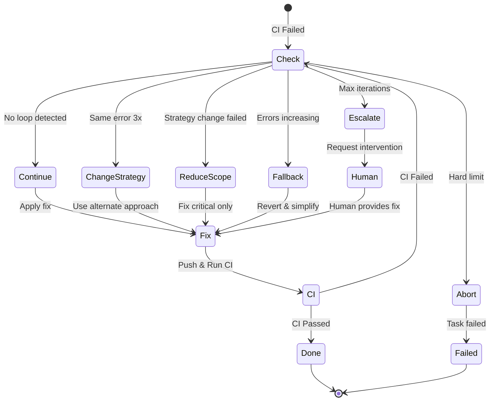

---

## セキュリティ設計

### Webhook認証

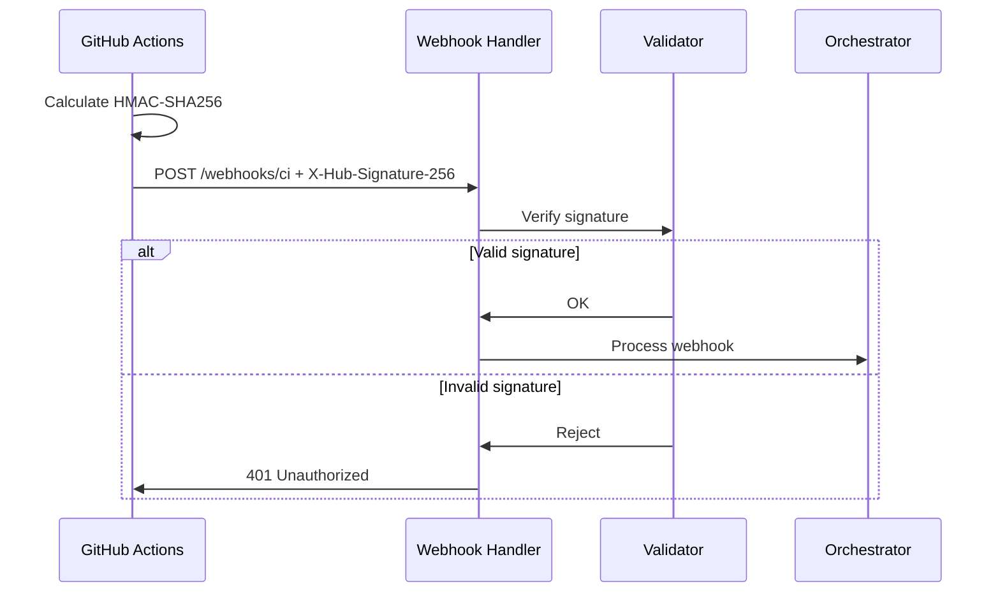

### レート制限

```python
@dataclass
class RateLimitConfig:
    # Webhook受信
    webhook_per_minute: int = 60
    webhook_per_pr: int = 100  # PR単位での上限

    # Agent実行
    agent_concurrent_tasks: int = 5
    agent_iterations_per_hour: int = 100

    # GitHub API
    github_api_per_minute: int = 60

    # コスト
    max_cost_per_task_usd: float = 50.0
    max_cost_per_day_usd: float = 500.0
```

### 禁止操作

```python
FORBIDDEN_OPERATIONS = {
    # Git操作
    "git_commands": [
        "git push --force",
        "git push -f",
        "git reset --hard",
        "git clean -fd",
        "git branch -D main",
        "git branch -D master",
    ],

    # ファイル操作
    "file_patterns": [
        r"\.env$",
        r"\.env\..*",
        r".*\.key$",
        r".*\.pem$",
        r".*\.secret$",
        r"credentials\.json$",
        r".*_rsa$",
    ],

    # シークレットパターン
    "secret_patterns": [
        r"sk-[a-zA-Z0-9]{48}",          # OpenAI
        r"ghp_[a-zA-Z0-9]{36}",          # GitHub PAT
        r"gho_[a-zA-Z0-9]{36}",          # GitHub OAuth
        r"AKIA[0-9A-Z]{16}",             # AWS
        r"-----BEGIN (RSA |EC |DSA )?PRIVATE KEY-----",
    ],

    # Shell操作
    "shell_commands": [
        "rm -rf /",
        "chmod 777",
        "curl .* | sh",
        "wget .* | sh",
    ],
}
```

### 監査ログ

```sql
CREATE TABLE ci_audit_log (
    id TEXT PRIMARY KEY,
    timestamp DATETIME NOT NULL DEFAULT CURRENT_TIMESTAMP,

    -- イベント情報
    event_type TEXT NOT NULL,  -- "webhook_received", "fix_triggered", "merge_executed"
    task_id TEXT,
    pr_number INTEGER,
    workflow_run_id INTEGER,

    -- 詳細
    payload_hash TEXT,         -- リクエストボディのハッシュ
    source_ip TEXT,
    user_agent TEXT,

    -- 結果
    action_taken TEXT,
    result TEXT,               -- "success", "rejected", "error"
    error_message TEXT,

    -- トレーサビリティ
    correlation_id TEXT,       -- リクエストを追跡するID
    iteration_marker TEXT,     -- ループ検知用マーカー

    INDEX idx_ci_audit_task (task_id),
    INDEX idx_ci_audit_pr (pr_number),
    INDEX idx_ci_audit_timestamp (timestamp)
);
```

---

## 監視・オブザーバビリティ

### メトリクス定義

```python
from prometheus_client import Counter, Histogram, Gauge

# CI実行
ci_runs_total = Counter(
    "dursor_ci_runs_total",
    "Total CI runs",
    ["conclusion"]  # success, failure, cancelled
)

ci_duration_seconds = Histogram(
    "dursor_ci_duration_seconds",
    "CI run duration",
    buckets=[60, 120, 300, 600, 900, 1200]
)

# 自動修正
auto_fix_attempts_total = Counter(
    "dursor_auto_fix_attempts_total",
    "Total auto-fix attempts",
    ["error_type", "result"]
)

auto_fix_iterations = Histogram(
    "dursor_auto_fix_iterations",
    "Iterations until fix",
    buckets=[1, 2, 3, 5, 7, 10]
)

# ループ検知
loop_detected_total = Counter(
    "dursor_loop_detected_total",
    "Total loop detections",
    ["action"]  # change_strategy, reduce_scope, escalate, abort
)

# アクティブタスク
active_agentic_tasks = Gauge(
    "dursor_active_agentic_tasks",
    "Currently active agentic tasks"
)

# レビュースコア
review_scores = Histogram(
    "dursor_review_scores",
    "Code review scores",
    buckets=[0.5, 0.6, 0.7, 0.75, 0.8, 0.9, 1.0]
)
```

### ダッシュボード構成

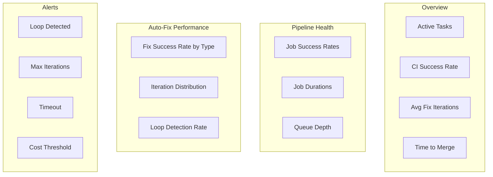

### アラート設定

```yaml
# alerting-rules.yml
groups:
  - name: agentic-ci-alerts
    rules:
      # ループ検知
      - alert: AgenticLoopDetected
        expr: increase(dursor_loop_detected_total[5m]) > 0
        for: 0m
        labels:
          severity: warning
        annotations:
          summary: "Agentic loop detected for task {{ $labels.task_id }}"

      # 最大イテレーション到達
      - alert: AgenticMaxIterations
        expr: dursor_auto_fix_iterations_bucket{le="10"} == dursor_auto_fix_iterations_count
        for: 0m
        labels:
          severity: critical
        annotations:
          summary: "Task reached maximum iterations"

      # CI成功率低下
      - alert: CISuccessRateLow
        expr: rate(dursor_ci_runs_total{conclusion="success"}[1h]) / rate(dursor_ci_runs_total[1h]) < 0.5
        for: 15m
        labels:
          severity: warning
        annotations:
          summary: "CI success rate dropped below 50%"

      # コスト上限接近
      - alert: AgenticCostHigh
        expr: dursor_agentic_cost_usd > 40
        for: 0m
        labels:
          severity: warning
        annotations:
          summary: "Agentic task cost approaching limit"
```

---

## 設定・カスタマイズ

### 環境変数

```bash
# ===========================================
# CI Webhook Settings
# ===========================================
DURSOR_WEBHOOK_SECRET=your-webhook-secret
DURSOR_WEBHOOK_TIMEOUT_SECONDS=30

# ===========================================
# Loop Prevention
# ===========================================
DURSOR_MAX_TOTAL_ITERATIONS=10
DURSOR_MAX_CI_ITERATIONS=5
DURSOR_MAX_REVIEW_ITERATIONS=3
DURSOR_MAX_SAME_ERROR_COUNT=3
DURSOR_AGENTIC_TIMEOUT_MINUTES=60

# ===========================================
# Quality Thresholds
# ===========================================
DURSOR_MIN_REVIEW_SCORE=0.75
DURSOR_COVERAGE_THRESHOLD=80
DURSOR_LINT_SEVERITY_THRESHOLD=error  # error, warning, info

# ===========================================
# Rate Limiting
# ===========================================
DURSOR_WEBHOOK_RATE_LIMIT_PER_MINUTE=60
DURSOR_AGENT_CONCURRENT_TASKS=5
DURSOR_MAX_COST_PER_TASK_USD=50

# ===========================================
# Auto-Fix Settings
# ===========================================
DURSOR_AUTO_FIX_ENABLED=true
DURSOR_AUTO_FIX_LINT=true
DURSOR_AUTO_FIX_FORMAT=true
DURSOR_AUTO_FIX_TYPE=true
DURSOR_AUTO_FIX_TEST=true
DURSOR_AUTO_FIX_SECURITY=false  # Requires manual review

# ===========================================
# Merge Settings
# ===========================================
DURSOR_AUTO_MERGE_ENABLED=true
DURSOR_MERGE_METHOD=squash  # merge, squash, rebase
DURSOR_DELETE_BRANCH_ON_MERGE=true
```

### プロジェクト設定ファイル

```yaml
# .dursor/ci-config.yml
version: "1.0"

agentic:
  enabled: true
  auto_merge: true

limits:
  max_total_iterations: 10
  max_ci_iterations: 5
  max_review_iterations: 3
  timeout_minutes: 60

quality:
  min_review_score: 0.75
  coverage_threshold: 80

auto_fix:
  lint:
    enabled: true
    auto_apply: true  # Run --fix automatically
  format:
    enabled: true
    auto_apply: true
  type:
    enabled: true
    auto_apply: false  # Requires agent reasoning
  test:
    enabled: true
    auto_apply: false
  security:
    enabled: false  # Disable auto-fix for security issues

excluded_paths:
  - "vendor/"
  - "node_modules/"
  - "*.generated.*"

reviewers:
  primary: "codex"
  fallback: "claude"

merge:
  method: "squash"
  delete_branch: true
  required_approvals: 0  # AI-only mode
```

---

## 実装ロードマップ


---

## 関連ドキュメント

- [Agentic Dursor](./agentic-dursor.md) - 自律的開発フロー設計
- [Architecture](./architecture.md) - システムアーキテクチャ
- [Agent System](./agents.md) - エージェント設計
- [Git Operation Design](./git_operation_design.md) - Git操作設計
