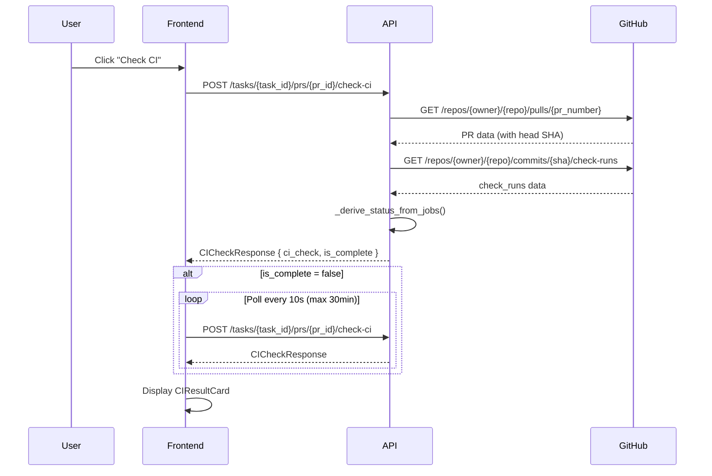
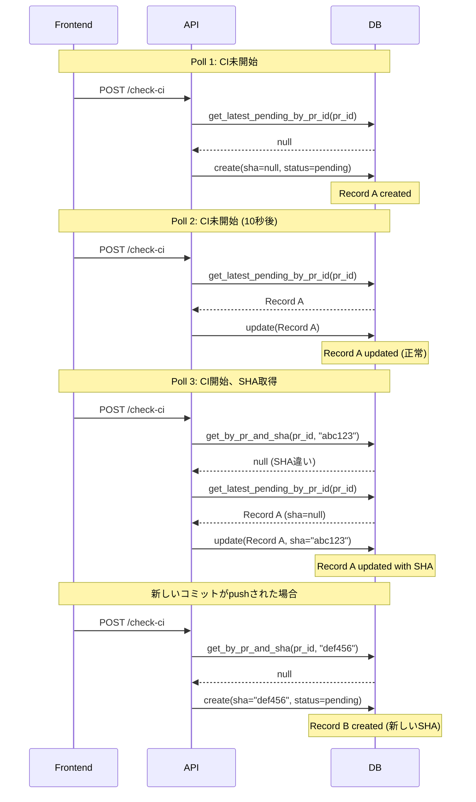

# CI Check 機能

## 概要

PRが作成済みの場合に「Check CI」ボタンを表示し、CIの状態を確認・ポーリングして結果をTask Chatに表示する機能。

## 現在の実装状況

### アーキテクチャ



### コンポーネント構成

| コンポーネント | ファイル | 説明 |
|--------------|---------|------|
| `CICheckService` | `apps/api/src/zloth_api/services/ci_check_service.py` | CI状態チェックのビジネスロジック |
| `CICheckDAO` | `apps/api/src/zloth_api/storage/dao.py` | CI Checkレコードのデータアクセス |
| `ciChecksApi` | `apps/web/src/lib/api.ts` | フロントエンドAPIクライアント |
| `CIResultCard` | `apps/web/src/components/CIResultCard.tsx` | CI結果表示コンポーネント |
| `ChatCodeView` | `apps/web/src/components/ChatCodeView.tsx` | Check CIボタンとポーリング処理 |

## ステータス判定ロジック

### バックエンド: `_derive_status_from_jobs()`

**ファイル**: `apps/api/src/zloth_api/services/ci_check_service.py:207-248`

```python
def _derive_status_from_jobs(self, jobs: dict[str, str]) -> str:
    if not jobs:
        # ジョブが空 → 常に "pending"
        return "pending"

    pending_states = {"in_progress", "queued", "pending"}
    failure_states = {"failure", "cancelled", "timed_out"}
    success_states = {"success", "skipped", "neutral"}

    # 優先度: failure > pending > success
    if has_failure:
        return "failure"
    if has_pending:
        return "pending"
    if has_success:
        return "success"

    return "pending"  # フォールバック
```

### 完了判定: `is_complete`

**ファイル**: `apps/api/src/zloth_api/services/ci_check_service.py:187`

```python
is_complete = status in ("success", "failure", "error")
```

| status | is_complete | ポーリング継続 |
|--------|-------------|--------------|
| `pending` | `false` | **継続** |
| `success` | `true` | 停止 |
| `failure` | `true` | 停止 |
| `error` | `true` | 停止 |

### フロントエンド表示

**ファイル**: `apps/web/src/components/CIResultCard.tsx:206-222`

| 条件 | 表示 |
|------|------|
| `status === 'pending'` かつ `jobs.length === 0` | 「Waiting for CI to start...」 |
| `status === 'pending'` かつ `jobs.length > 0` | ジョブ一覧 + Pending バッジ |
| `status === 'error'` かつ `jobs.length === 0` | 「Failed to check CI status」 |
| `status === 'success'` | ジョブ一覧 + Success バッジ |
| `status === 'failure'` | ジョブ一覧 + 失敗ジョブ詳細 + Failure バッジ |

## 既知の問題

### 問題: CIが完了しても「Pending」「Waiting for CI to start...」のまま

**症状**:
- PRのCIが実際には完了しているにも関わらず、UIは「Pending」「Waiting for CI to start...」のままになる

**原因**:

1. **GitHub Appに `checks:read` 権限がない**
   - `check-runs` APIが403エラーを返す
   - フォールバックの `statuses` APIでもジョブが見つからない場合、`jobs` は空のまま

2. **CIワークフローが設定されていない**
   - リポジトリにGitHub Actionsや外部CIが設定されていない場合、`check_runs` は空

3. **CIがトリガーされていない**
   - ワークフローはあるが、当該コミット/ブランチに対してトリガー条件を満たしていない

4. **ステータス判定ロジックの挙動**
   - `jobs` が空の場合、`_derive_status_from_jobs()` は常に `"pending"` を返す
   - `status = "pending"` → `is_complete = false` → ポーリングが永遠に継続

**該当コード**:

```python
# ci_check_service.py:216-218
if not jobs:
    # No jobs found - could be CI hasn't started yet
    return "pending"
```

**影響**:
- ポーリングがタイムアウト（30分）まで継続
- ユーザーはCIが完了したことを認識できない

### 改善案

1. **タイムアウト後に `error` ステータスを返す**
   - 一定時間（例: 5分）ジョブが見つからない場合、「No CI configured」として `is_complete = true` を返す

2. **CI設定の有無をチェック**
   - リポジトリのワークフロー一覧を取得し、CIが設定されていない場合は即座に通知

3. **権限エラーの明示的なハンドリング**
   - `checks:read` 権限がない場合、ユーザーに明確なエラーメッセージを表示

---

### 問題: MetricsのPending CI数が実際のタスク数より大幅に多い

**症状**:
- タスク数は10程度なのに、MetricsページのPending CI数が数十〜数千になる
- データベースに大量の重複したCI Checkレコードが蓄積される

**原因**:

1. **ポーリングごとに新しいレコードが作成される**
   - `check_ci()` が呼ばれるたびに、新しいCI Checkレコードが作成される可能性がある
   - フロントエンドは10秒ごとにポーリング、タイムアウトは30分
   - 1つのPRで最大180回のポーリング → 大量の重複レコード

2. **SHA未取得時のレコード重複**
   - CIがまだ開始していない場合、`sha=None` でレコードが作成される
   - 次のポーリングでも `sha=None` → 既存レコードの検索がスキップされ、新規レコードが作成
   - SHAが取得できるようになると、また新しいレコードが作成される

3. **Metricsクエリが単純なCOUNT**
   - `SELECT COUNT(*) FROM ci_checks WHERE status = 'pending'`
   - PR/タスクごとの重複排除をしていない

**該当コード**:

```python
# ci_check_service.py:146-157 (問題のあるロジック)
existing = None
if sha:
    existing = await self.ci_check_dao.get_by_pr_and_sha(pr_id, sha)
    # sha=None の既存レコードは検索されない
else:
    # sha が None の場合、既存レコードを探さずに新規作成
    existing = await self.ci_check_dao.get_latest_pending_by_pr_id(pr_id)

# dao.py:2561-2567 (Metricsクエリ)
SELECT COUNT(*) as count
FROM ci_checks
WHERE status = 'pending'
# → 重複を含む全レコードをカウント
```

**重複レコード生成の流れ**:



**影響**:
- データベース肥大化
- Metricsの数値が実態と乖離
- API応答の遅延（大量レコードの取得）

### 改善案

1. **Metricsクエリの修正**
   - PRごとにユニークなCI Checkのみをカウント
   ```sql
   SELECT COUNT(DISTINCT pr_id) as count
   FROM ci_checks
   WHERE status = 'pending'
   ```

2. **定期的なクリーンアップ**
   - 古いpendingレコードを自動削除
   - `scripts/reset_pending.py` を定期実行

3. **レコード重複防止の強化**
   - 詳細は `docs/ci_check_duplicate_fix.md` を参照

**関連ドキュメント**: [CI Check Duplicate Fix](./ci_check_duplicate_fix.md)

---

## API仕様

### エンドポイント

#### POST `/tasks/{task_id}/prs/{pr_id}/check-ci`

CI状態をチェックし、結果を返す。

**レスポンス**:
```json
{
  "ci_check": {
    "id": "uuid",
    "task_id": "uuid",
    "pr_id": "uuid",
    "status": "pending" | "success" | "failure" | "error",
    "workflow_run_id": null | number,
    "sha": "abc1234...",
    "jobs": {
      "lint": "success",
      "test": "in_progress",
      "build": "queued"
    },
    "failed_jobs": [
      {
        "job_name": "test",
        "result": "failure",
        "error_log": "Error message..."
      }
    ],
    "created_at": "2024-01-15T10:30:45Z",
    "updated_at": "2024-01-15T10:30:45Z"
  },
  "is_complete": false
}
```

#### GET `/tasks/{task_id}/ci-checks`

タスクの全CI Checkレコードを取得。

### クールダウン機構

**ファイル**: `apps/api/src/zloth_api/services/ci_check_service.py:51-74`

- 同一PR+SHAに対するAPIコールを30秒間抑制
- メモリ内キャッシュ（5分で自動クリーンアップ）
- `force=True` でクールダウンをバイパス可能

## ポーリング仕様

| 項目 | 値 | ファイル |
|------|-----|---------|
| ポーリング間隔 | 10秒 | `api.ts:407` |
| タイムアウト | 30分 | `api.ts:408` |
| バックエンドクールダウン | 30秒/PR+SHA | `ci_check_service.py:19` |

### フロントエンドポーリング

**ファイル**: `apps/web/src/lib/api.ts:398-425`

```typescript
checkWithPolling: async (taskId, prId, options) => {
  const pollInterval = options?.pollInterval ?? 10000; // 10秒
  const maxWaitTime = options?.maxWaitTime ?? 1800000; // 30分

  while (Date.now() - startTime < maxWaitTime) {
    const response = await ciChecksApi.check(taskId, prId);
    options?.onProgress?.(response.ci_check);

    if (response.is_complete) {
      return response.ci_check;
    }

    await new Promise(resolve => setTimeout(resolve, pollInterval));
  }

  throw new ApiError(504, 'CI check timed out');
}
```

## データモデル

### CICheck

```python
class CICheck(BaseModel):
    id: str
    task_id: str
    pr_id: str
    status: str  # "pending" | "success" | "failure" | "error"
    workflow_run_id: int | None
    sha: str | None
    jobs: dict[str, str]  # job_name -> result
    failed_jobs: list[CIJobResult]
    created_at: datetime
    updated_at: datetime
```

### CIJobResult

```python
class CIJobResult(BaseModel):
    job_name: str
    result: str  # "success" | "failure" | "skipped" | "cancelled" | etc.
    error_log: str | None
```

### Job ステータス一覧

| カテゴリ | ステータス |
|---------|----------|
| Pending | `in_progress`, `queued`, `pending` |
| Failure | `failure`, `cancelled`, `timed_out` |
| Success | `success`, `skipped`, `neutral` |

## GitHub App 権限

CI Check機能には以下の権限が必要:

| 権限 | レベル | 用途 |
|------|-------|------|
| **Checks** | Read | `check-runs` APIでジョブ状態を取得 |
| **Pull requests** | Read | PR情報（head SHA）を取得 |

権限がない場合、`statuses` APIにフォールバックするが、情報が限定的になる可能性がある。

## UI デザイン

### Pending 状態（ジョブあり）

```
┌─────────────────────────────────────────────────────────────┐
│  🕐 CI Check                                    ⏳ Pending   │
│─────────────────────────────────────────────────────────────│
│                                                             │
│  ✓ 2 passed  🕐 1 running                                  │
│                                                             │
│  Jobs                                                       │
│  ├─ ✓ lint          success                                │
│  ├─ ✓ test          success                                │
│  └─ 🕐 build        in_progress                            │
│                                                             │
│  Checked at: 2024-01-15 10:30:45                           │
└─────────────────────────────────────────────────────────────┘
```

### Pending 状態（ジョブなし）

```
┌─────────────────────────────────────────────────────────────┐
│  🕐 CI Check                                    ⏳ Pending   │
│─────────────────────────────────────────────────────────────│
│                                                             │
│                    🕐                                       │
│           Waiting for CI to start...                        │
│                                                             │
│  Checked at: 2024-01-15 10:30:45                           │
└─────────────────────────────────────────────────────────────┘
```

### Success 状態

```
┌─────────────────────────────────────────────────────────────┐
│  ✓ CI Check                                    ✓ Success    │
│─────────────────────────────────────────────────────────────│
│                                                             │
│  ✓ 3 passed  ○ 1 skipped                                   │
│                                                             │
│  Jobs                                                       │
│  ├─ ✓ lint          success                                │
│  ├─ ✓ test          success                                │
│  ├─ ✓ build         success                                │
│  └─ ○ deploy        skipped                                │
│                                                             │
│  Checked at: 2024-01-15 10:30:45                           │
└─────────────────────────────────────────────────────────────┘
```

### Failure 状態

```
┌─────────────────────────────────────────────────────────────┐
│  ✗ CI Check                                    ✗ Failure    │
│─────────────────────────────────────────────────────────────│
│                                                             │
│  ✓ 1 passed  ✗ 1 failed  ○ 1 skipped                       │
│                                                             │
│  Jobs                                                       │
│  ├─ ✓ lint          success                                │
│  ├─ ✗ test          failure                                │
│  └─ ○ build         skipped                                │
│                                                             │
│  ▼ Failed Jobs (1)                                          │
│  ┌─────────────────────────────────────────────────────────┐
│  │  test                                        failure    │
│  │  ───────────────────────────────────────────────────── │
│  │  Error: FAIL src/utils.test.ts                         │
│  │    ● should validate email format                       │
│  │      Expected: true                                     │
│  │      Received: false                                    │
│  └─────────────────────────────────────────────────────────┘
│                                                             │
│  Checked at: 2024-01-15 10:30:45                           │
└─────────────────────────────────────────────────────────────┘
```

## トラブルシューティング

### Q: 「Waiting for CI to start...」が長時間表示される

**考えられる原因**:
1. リポジトリにCIが設定されていない
2. GitHub Appに `checks:read` 権限がない
3. CIワークフローのトリガー条件を満たしていない

**対処法**:
1. リポジトリのActionsタブでワークフローを確認
2. GitHub App設定で権限を確認
3. ワークフローファイル（`.github/workflows/*.yml`）のトリガー条件を確認

### Q: CI結果が更新されない

**考えられる原因**:
1. 30秒のクールダウン期間中
2. ネットワークエラー

**対処法**:
1. 30秒待ってから再度チェック
2. ブラウザのネットワークタブでAPIエラーを確認
