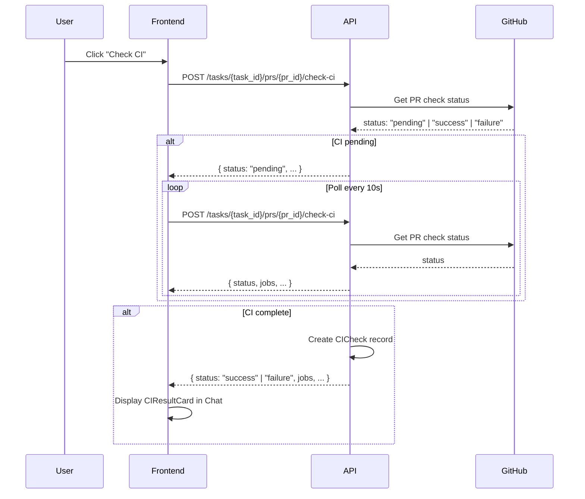

# Check CI 機能 実装計画

## 概要

PRが作成済みの場合に「Check CI」ボタンを表示し、CIの状態を確認・ポーリングして結果をTask Chatに表示する機能を追加する。

## 現状分析

### 既存インフラ（活用可能）

| コンポーネント | ファイル | 説明 |
|--------------|---------|------|
| `CIPollingService` | `apps/api/src/zloth_api/services/ci_polling_service.py` | GitHubからCI状態をポーリング |
| `github_service.get_pr_check_status()` | `apps/api/src/zloth_api/services/github_service.py:435` | PR のCI状態を取得 |
| `CIResult`, `CIJobResult` | `apps/api/src/zloth_api/domain/models.py:952-989` | CI結果のデータモデル |
| Timeline アーキテクチャ | `apps/web/src/components/ChatCodeView.tsx:388` | メッセージ・Run・Review の時系列表示 |
| `RunResultCard` | `apps/web/src/components/RunResultCard.tsx` | Implementation 表示コンポーネント |
| `ReviewResultCard` | `apps/web/src/components/ReviewResultCard.tsx` | Code Review 表示コンポーネント |

### 不足している部分

1. **フロントエンド**
   - Check CI ボタン
   - CI 結果表示用コンポーネント (`CIResultCard`)
   - ポーリング処理とUI状態管理

2. **バックエンド**
   - CI状態を確認するAPIエンドポイント
   - CIチェック記録用のデータモデル・DAO

## アーキテクチャ設計



## データモデル

### Backend: CICheck モデル

```python
# apps/api/src/zloth_api/domain/models.py

class CICheck(BaseModel):
    """CI check result record for a PR."""
    id: str
    task_id: str
    pr_id: str
    status: str  # "pending" | "success" | "failure" | "error"
    workflow_run_id: int | None = None
    sha: str | None = None
    jobs: dict[str, str] = Field(default_factory=dict)  # job_name -> result
    failed_jobs: list[CIJobResult] = Field(default_factory=list)
    created_at: datetime
    updated_at: datetime
```

### Backend: CICheckResponse モデル

```python
# apps/api/src/zloth_api/domain/models.py

class CICheckResponse(BaseModel):
    """Response for CI check API."""
    ci_check: CICheck
    is_complete: bool  # True if CI is finished (success/failure/error)
```
```

### Frontend: CICheck 型

```typescript
// apps/web/src/types.ts

export interface CIJobResult {
  job_name: string;
  result: string;  // "success" | "failure" | "skipped" | "cancelled"
  error_log: string | null;
}

export interface CICheck {
  id: string;
  task_id: string;
  pr_id: string;
  status: string;  // "pending" | "success" | "failure" | "error"
  workflow_run_id: number | null;
  sha: string | null;
  jobs: Record<string, string>;
  failed_jobs: CIJobResult[];
  created_at: string;
  updated_at: string;
}

export interface CICheckResponse {
  ci_check: CICheck;
  is_complete: boolean;
}
```

## 実装タスク

### Phase 1: Backend API

#### 1.1 データベーススキーマ追加

**ファイル**: `apps/api/src/zloth_api/storage/schema.sql`

```sql
CREATE TABLE IF NOT EXISTS ci_checks (
    id TEXT PRIMARY KEY,
    task_id TEXT NOT NULL,
    pr_id TEXT NOT NULL,
    status TEXT NOT NULL,
    workflow_run_id INTEGER,
    sha TEXT,
    jobs TEXT,  -- JSON
    failed_jobs TEXT,  -- JSON
    created_at TEXT NOT NULL,
    updated_at TEXT NOT NULL,
    FOREIGN KEY (task_id) REFERENCES tasks(id),
    FOREIGN KEY (pr_id) REFERENCES prs(id)
);

CREATE INDEX IF NOT EXISTS idx_ci_checks_task_id ON ci_checks(task_id);
CREATE INDEX IF NOT EXISTS idx_ci_checks_pr_id ON ci_checks(pr_id);
```

#### 1.2 DAO 追加

**ファイル**: `apps/api/src/zloth_api/storage/dao.py`

- `CICheckDAO` クラス追加
  - `create()`: CICheck レコード作成
  - `get()`: ID で取得
  - `get_by_pr_id()`: PR ID で最新を取得
  - `update()`: 更新
  - `list_by_task_id()`: Task の全 CICheck を取得

#### 1.3 サービス追加

**ファイル**: `apps/api/src/zloth_api/services/ci_check_service.py` (新規)

```python
class CICheckService:
    """Service for checking CI status of PRs."""

    async def check_ci(self, task_id: str, pr_id: str) -> CICheckResponse:
        """
        Check CI status for a PR.

        - Fetches current CI status from GitHub
        - Creates or updates CICheck record
        - Returns response with completion status
        """

    async def get_ci_checks(self, task_id: str) -> list[CICheck]:
        """Get all CI checks for a task."""
```

#### 1.4 API エンドポイント追加

**ファイル**: `apps/api/src/zloth_api/routes/prs.py`

```python
@router.post("/tasks/{task_id}/prs/{pr_id}/check-ci")
async def check_ci(
    task_id: str,
    pr_id: str,
    ci_check_service: Annotated[CICheckService, Depends(get_ci_check_service)],
) -> CICheckResponse:
    """Check CI status for a PR."""
    return await ci_check_service.check_ci(task_id, pr_id)

@router.get("/tasks/{task_id}/ci-checks")
async def list_ci_checks(
    task_id: str,
    ci_check_service: Annotated[CICheckService, Depends(get_ci_check_service)],
) -> list[CICheck]:
    """List all CI checks for a task."""
    return await ci_check_service.get_ci_checks(task_id)
```

### Phase 2: Frontend UI

#### 2.1 API クライアント追加

**ファイル**: `apps/web/src/lib/api.ts`

```typescript
export const ciChecksApi = {
  check: (taskId: string, prId: string): Promise<CICheckResponse> =>
    fetchApi(`/tasks/${taskId}/prs/${prId}/check-ci`, { method: 'POST' }),

  list: (taskId: string): Promise<CICheck[]> =>
    fetchApi(`/tasks/${taskId}/ci-checks`),
};
```

#### 2.2 CIResultCard コンポーネント作成

**ファイル**: `apps/web/src/components/CIResultCard.tsx` (新規)

- `RunResultCard` と `ReviewResultCard` を参考に同様の体裁で作成
- 表示内容:
  - ヘッダー: "CI Check" ラベル + ステータスバッジ
  - ジョブ一覧: 各ジョブの名前と結果
  - 失敗ジョブ: エラーログ表示（展開可能）
  - タイムスタンプ

```typescript
interface CIResultCardProps {
  ciCheck: CICheck;
  expanded?: boolean;
  onToggleExpand?: () => void;
}

export function CIResultCard({ ciCheck, expanded, onToggleExpand }: CIResultCardProps) {
  // Status badge color
  const statusColor = {
    success: 'bg-green-500',
    failure: 'bg-red-500',
    pending: 'bg-yellow-500',
    error: 'bg-red-500',
  }[ciCheck.status] || 'bg-gray-500';

  return (
    <div className="bg-zinc-900 rounded-lg border border-zinc-700 overflow-hidden">
      {/* Header with "CI Check" label and status */}
      {/* Jobs list */}
      {/* Failed jobs with error logs */}
    </div>
  );
}
```

#### 2.3 Check CI ボタン追加

**ファイル**: `apps/web/src/components/SessionHeader.tsx` または関連コンポーネント

- PRが存在する場合に「Check CI」ボタンを表示
- ボタンクリックでポーリング開始

```typescript
// Check CI ボタンの条件付き表示
{pr && (
  <Button
    onClick={handleCheckCI}
    disabled={isCheckingCI}
    variant="outline"
  >
    {isCheckingCI ? (
      <>
        <Spinner className="mr-2" />
        Checking CI...
      </>
    ) : (
      'Check CI'
    )}
  </Button>
)}
```

#### 2.4 ポーリングロジック実装

**ファイル**: `apps/web/src/components/ChatCodeView.tsx` または新規フック

```typescript
// useCheckCI hook
function useCheckCI(taskId: string, prId: string) {
  const [isChecking, setIsChecking] = useState(false);
  const [ciCheck, setCICheck] = useState<CICheck | null>(null);

  const checkCI = useCallback(async () => {
    setIsChecking(true);

    const poll = async () => {
      const response = await ciChecksApi.check(taskId, prId);
      setCICheck(response.ci_check);

      if (!response.is_complete) {
        // Continue polling every 10 seconds
        await new Promise(resolve => setTimeout(resolve, 10000));
        await poll();
      } else {
        setIsChecking(false);
      }
    };

    await poll();
  }, [taskId, prId]);

  return { isChecking, ciCheck, checkCI };
}
```

#### 2.5 Timeline への統合

**ファイル**: `apps/web/src/components/ChatCodeView.tsx`

```typescript
// TimelineItem 型に ci-check を追加
type TimelineItem =
  | { type: 'message-run'; message: Message; run: Run; createdAt: string }
  | { type: 'review'; review: Review; createdAt: string }
  | { type: 'ci-check'; ciCheck: CICheck; createdAt: string };

// Timeline の構築に CICheck を追加
const timeline = useMemo(() => {
  const items: TimelineItem[] = [];

  // ... existing message-run and review items ...

  // Add CI checks
  ciChecks.forEach((ciCheck) => {
    items.push({
      type: 'ci-check',
      ciCheck,
      createdAt: ciCheck.created_at,
    });
  });

  return items.sort((a, b) =>
    new Date(a.createdAt).getTime() - new Date(b.createdAt).getTime()
  );
}, [messages, runs, reviews, ciChecks]);

// Timeline のレンダリングに CIResultCard を追加
{item.type === 'ci-check' && (
  <div key={item.ciCheck.id} className="space-y-3">
    <CIResultCard ciCheck={item.ciCheck} />
  </div>
)}
```

## ファイル変更一覧

### 新規作成

| ファイル | 説明 |
|---------|------|
| `apps/api/src/zloth_api/services/ci_check_service.py` | CIチェックサービス |
| `apps/web/src/components/CIResultCard.tsx` | CI結果表示コンポーネント |

### 変更

| ファイル | 変更内容 |
|---------|---------|
| `apps/api/src/zloth_api/storage/schema.sql` | `ci_checks` テーブル追加 |
| `apps/api/src/zloth_api/storage/dao.py` | `CICheckDAO` クラス追加 |
| `apps/api/src/zloth_api/domain/models.py` | `CICheck`, `CICheckResponse` モデル追加 |
| `apps/api/src/zloth_api/routes/prs.py` | CI チェックエンドポイント追加 |
| `apps/api/src/zloth_api/dependencies.py` | `CICheckService` の DI 設定 |
| `apps/web/src/types.ts` | `CICheck`, `CICheckResponse` 型追加 |
| `apps/web/src/lib/api.ts` | `ciChecksApi` 追加 |
| `apps/web/src/components/ChatCodeView.tsx` | Timeline に CICheck を統合 |
| `apps/web/src/components/SessionHeader.tsx` (または関連) | Check CI ボタン追加 |

## UI デザイン

### Check CI ボタン配置

```
┌─────────────────────────────────────────────────────────────┐
│  Task: Fix authentication bug                               │
│                                                             │
│  [Create PR ▾]  [Update PR ▾]  [Check CI]                  │
│                                   ↑                         │
│                            PRが存在する場合に表示            │
└─────────────────────────────────────────────────────────────┘
```

### CIResultCard デザイン

```
┌─────────────────────────────────────────────────────────────┐
│  🔵 CI Check                                    ✓ Success   │
│─────────────────────────────────────────────────────────────│
│                                                             │
│  Jobs                                                       │
│  ├─ ✓ lint          success                                │
│  ├─ ✓ test          success                                │
│  ├─ ✓ build         success                                │
│  └─ ○ deploy        skipped                                │
│                                                             │
│  Checked at: 2024-01-15 10:30:45                           │
└─────────────────────────────────────────────────────────────┘
```

### 失敗時の CIResultCard

```
┌─────────────────────────────────────────────────────────────┐
│  🔵 CI Check                                    ✗ Failure   │
│─────────────────────────────────────────────────────────────│
│                                                             │
│  Jobs                                                       │
│  ├─ ✓ lint          success                                │
│  ├─ ✗ test          failure                                │
│  └─ ○ build         skipped                                │
│                                                             │
│  ▼ Failed Jobs                                              │
│  ┌─────────────────────────────────────────────────────────┐
│  │  test                                                   │
│  │  Error: FAIL src/utils.test.ts                         │
│  │    ● should validate email format                       │
│  │      Expected: true                                     │
│  │      Received: false                                    │
│  └─────────────────────────────────────────────────────────┘
│                                                             │
│  Checked at: 2024-01-15 10:30:45                           │
└─────────────────────────────────────────────────────────────┘
```

## ポーリング仕様

| 項目 | 値 |
|------|-----|
| ポーリング間隔 | 10秒 |
| タイムアウト | 30分 |
| 最大リトライ | なし（タイムアウトまで継続） |

### ステータス判定

| GitHub Status | CICheck status | is_complete |
|---------------|----------------|-------------|
| `pending` | `pending` | `false` |
| `success` | `success` | `true` |
| `failure` | `failure` | `true` |
| `error` | `error` | `true` |

## テスト計画

### Backend テスト

1. **CICheckDAO テスト**
   - CRUD 操作の確認
   - `get_by_pr_id` の最新取得確認

2. **CICheckService テスト**
   - GitHub API モックを使用
   - 各ステータス（pending/success/failure）の処理確認
   - CICheck レコードの作成・更新確認

3. **API エンドポイントテスト**
   - 正常系: CI チェック実行
   - 異常系: 存在しない PR

### Frontend テスト

1. **CIResultCard テスト**
   - 各ステータスの表示確認
   - 失敗ジョブのエラーログ表示確認

2. **ポーリングテスト**
   - ポーリング開始・停止の確認
   - 完了時のポーリング停止確認

## 注意事項

1. **既存の `CIPollingService`**: バックグラウンドポーリング用に設計されているため、今回は `github_service.get_pr_check_status()` を直接使用する方がシンプル

2. **レート制限**: GitHub API のレート制限に注意。ポーリング間隔を10秒以上に設定

3. **エラーハンドリング**: GitHub App の権限不足やネットワークエラーを適切にハンドリング

4. **型安全性**: mypy strict mode に準拠した型定義を使用
