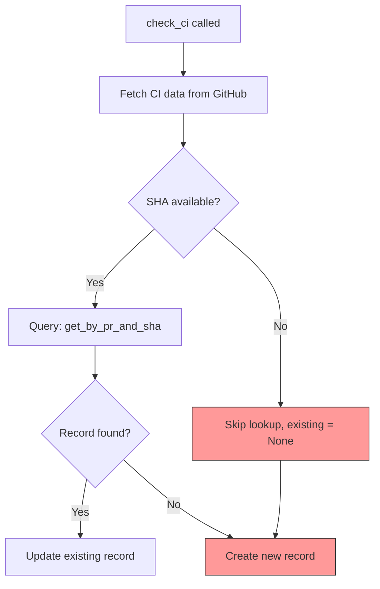
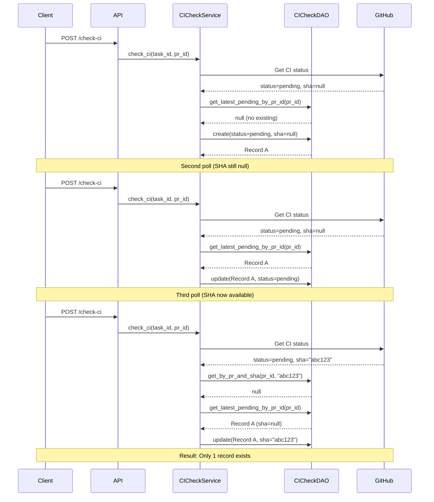

# CI Check Duplicate Posts Investigation and Fix Plan

## Problem Statement

### Current Behavior
- PR is created
- CI Check is triggered with status "Pending"
- Multiple CI Check cards appear in the Task timeline (duplicate posts)

### Expected Behavior
- PR is created
- CI Check is triggered with status "Pending"
- If a CI Check for the same SHA already exists, update it instead of creating a new record
- Only one CI Check card per SHA appears in the Task timeline

## Root Cause Analysis

### Investigation Summary

The issue is in `apps/api/src/zloth_api/services/ci_check_service.py` at line 146:

```python
existing = await self.ci_check_dao.get_by_pr_and_sha(pr_id, sha) if sha else None
```

#### Problem 1: SHA-less CI Check Records

When CI hasn't started yet (no check runs available from GitHub), `sha` is `None`. In this case:
1. The lookup for existing records is skipped (`if sha else None`)
2. A NEW CICheck record is created with `sha=None`
3. On subsequent polls, if SHA is still `None`, another new record is created
4. This creates duplicate "pending" CI checks with `sha=None`

#### Problem 2: Race Condition with SHA Changes

When CI starts and SHA becomes available:
1. First poll: `sha=None` -> creates record A
2. Second poll: `sha="abc123"` -> lookup finds nothing (different from None), creates record B
3. Third poll: `sha="abc123"` -> lookup finds record B, updates it
4. Result: Record A (sha=None) and Record B (sha=abc123) both exist

### Code Flow Analysis



The highlighted nodes show where duplicate records are created.

### Frontend Mitigation (Partial)

The frontend (`ChatCodeView.tsx:489-503`) already has deduplication logic:

```typescript
// Deduplicate by SHA - keep only the latest check for each SHA
const bysha = new Map<string, CICheck>();
for (const check of checksForPR) {
  const sha = check.sha || check.id; // Use id as fallback if no SHA
  // ...
}
```

However, this only hides the problem in the UI; the database still contains duplicate records.

## Solution Plan

### Option A: Backend-Only Fix (Recommended)

Modify the `check_ci` method to handle SHA-less lookups properly.

#### Implementation Steps

1. **Add new DAO method**: `get_latest_pending_by_pr_id`
   - Query: Get the most recent "pending" CICheck for a PR, regardless of SHA
   - This allows updating existing pending records when SHA is not yet available

2. **Modify `check_ci` logic**:
   ```python
   # Look for existing check to update
   existing = None
   if sha:
       # If we have SHA, find by PR+SHA
       existing = await self.ci_check_dao.get_by_pr_and_sha(pr_id, sha)
   else:
       # If no SHA yet, find any pending check for this PR
       existing = await self.ci_check_dao.get_latest_pending_by_pr_id(pr_id)
   ```

3. **Handle SHA update scenario**:
   - When updating a record with `sha=None` to have a SHA, the record should be updated with the new SHA

#### File Changes

| File | Change |
|------|--------|
| `apps/api/src/zloth_api/storage/dao.py` | Add `get_latest_pending_by_pr_id` method to `CICheckDAO` |
| `apps/api/src/zloth_api/services/ci_check_service.py` | Modify `check_ci` to use new lookup logic |

#### New DAO Method

```python
async def get_latest_pending_by_pr_id(self, pr_id: str) -> CICheck | None:
    """Get the latest pending CI check for a PR (regardless of SHA).

    This is used when SHA is not yet available to avoid creating duplicate
    pending records.
    """
    cursor = await self.db.connection.execute(
        """
        SELECT * FROM ci_checks
        WHERE pr_id = ? AND status = 'pending'
        ORDER BY created_at DESC LIMIT 1
        """,
        (pr_id,),
    )
    row = await cursor.fetchone()
    if not row:
        return None
    return self._row_to_model(row)
```

#### Modified `check_ci` Logic

```python
# Create or update CICheck record
# Look for existing check with the same SHA to avoid duplicate records
existing = None
if sha:
    # If we have SHA, look for existing record with this SHA
    existing = await self.ci_check_dao.get_by_pr_and_sha(pr_id, sha)
    if not existing:
        # Also check if there's a pending record without SHA that we should update
        pending_without_sha = await self.ci_check_dao.get_latest_pending_by_pr_id(pr_id)
        if pending_without_sha and pending_without_sha.sha is None:
            existing = pending_without_sha
else:
    # No SHA available - look for any existing pending record for this PR
    existing = await self.ci_check_dao.get_latest_pending_by_pr_id(pr_id)

if existing:
    # Update existing check
    ci_check = await self.ci_check_dao.update(
        id=existing.id,
        status=status,
        workflow_run_id=ci_data.get("workflow_run_id"),
        sha=sha,
        jobs=ci_data.get("jobs"),
        failed_jobs=ci_data.get("failed_jobs"),
    )
else:
    # Create new check record
    ci_check = await self.ci_check_dao.create(...)
```

### Option B: Database-Level Unique Constraint

Add a unique constraint on `(pr_id, sha)` with special handling for NULL SHAs.

**Pros**: Prevents duplicates at the database level
**Cons**: SQLite treats NULL as unique, so multiple `sha=NULL` records would still be allowed

### Option C: Frontend-Only Fix (Not Recommended)

Enhance frontend deduplication to also merge SHA-less records.

**Pros**: No backend changes
**Cons**: Database still contains duplicates; wastes storage and API bandwidth

## Recommended Approach

**Option A** is recommended because:
1. Fixes the root cause at the source
2. Prevents database bloat from duplicate records
3. Reduces API response size
4. Frontend deduplication can remain as a safety net

## Implementation Checklist

- [ ] Add `get_latest_pending_by_pr_id` method to `CICheckDAO`
- [ ] Modify `check_ci` in `CICheckService` to use new lookup logic
- [ ] Add unit tests for new DAO method
- [ ] Add unit tests for updated `check_ci` logic
- [ ] Run existing tests to ensure no regressions
- [ ] Manual testing:
  - [ ] Create PR -> verify single pending CI check created
  - [ ] Wait for CI to start -> verify record updated (not duplicated)
  - [ ] Wait for CI to complete -> verify final status

## Test Scenarios

### Scenario 1: CI Not Started Yet
1. Create PR
2. Trigger CI check (SHA not available yet)
3. Trigger CI check again (SHA still not available)
4. **Expected**: Only 1 pending CI check record exists

### Scenario 2: CI Starts During Polling
1. Create PR
2. Trigger CI check (SHA not available) -> Record A created
3. CI starts on GitHub
4. Trigger CI check (SHA now available) -> Record A updated with SHA
5. **Expected**: Only 1 CI check record exists with SHA

### Scenario 3: New Commit Pushed
1. PR exists with CI check for SHA "abc123"
2. New commit pushed (SHA "def456")
3. Trigger CI check
4. **Expected**: New CI check record created for "def456"

### Scenario 4: Normal Flow
1. Create PR
2. CI starts immediately (SHA available)
3. Multiple polls while CI is running
4. CI completes
5. **Expected**: Only 1 CI check record exists

## Sequence Diagram (After Fix)



## Related Files

| File | Description |
|------|-------------|
| `apps/api/src/zloth_api/services/ci_check_service.py` | CI check service (main fix location) |
| `apps/api/src/zloth_api/storage/dao.py` | CICheckDAO (add new method) |
| `apps/api/src/zloth_api/routes/prs.py` | API endpoints (no change needed) |
| `apps/web/src/components/ChatCodeView.tsx` | Frontend timeline (has partial mitigation) |
| `apps/web/src/components/CIResultCard.tsx` | CI result display component |
