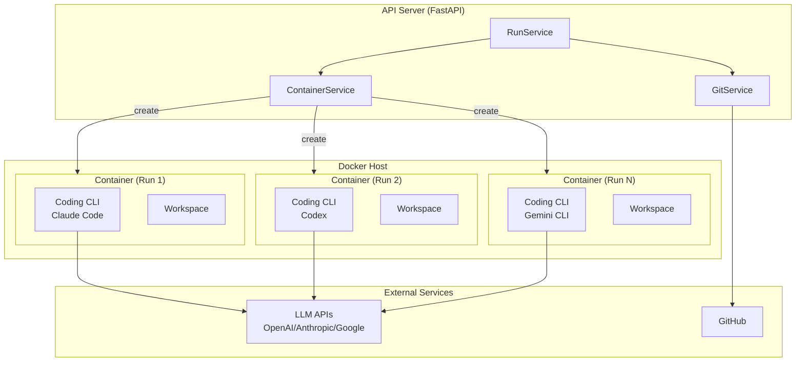
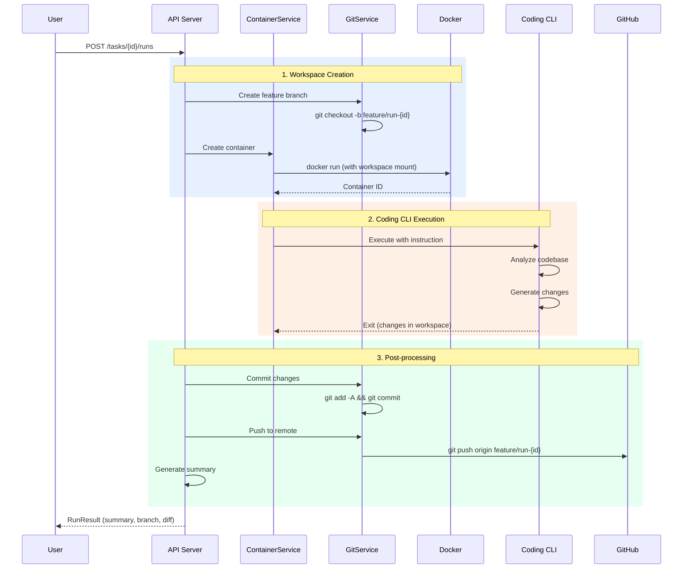
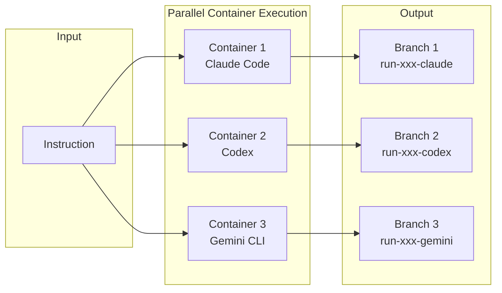
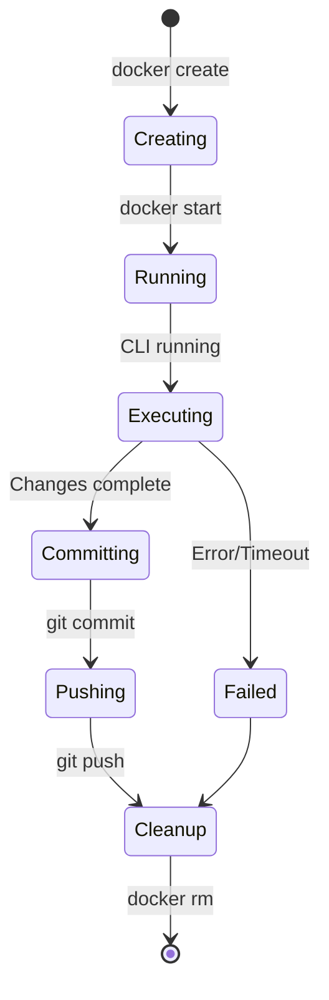
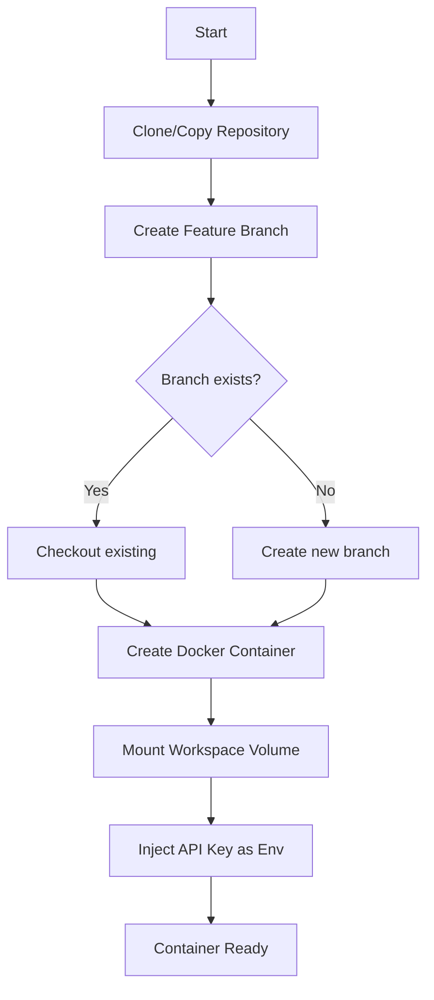
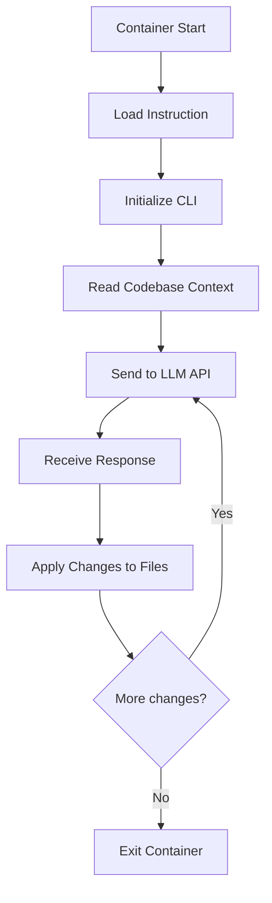
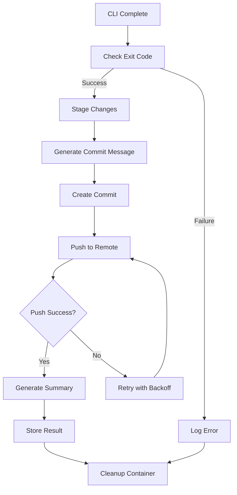
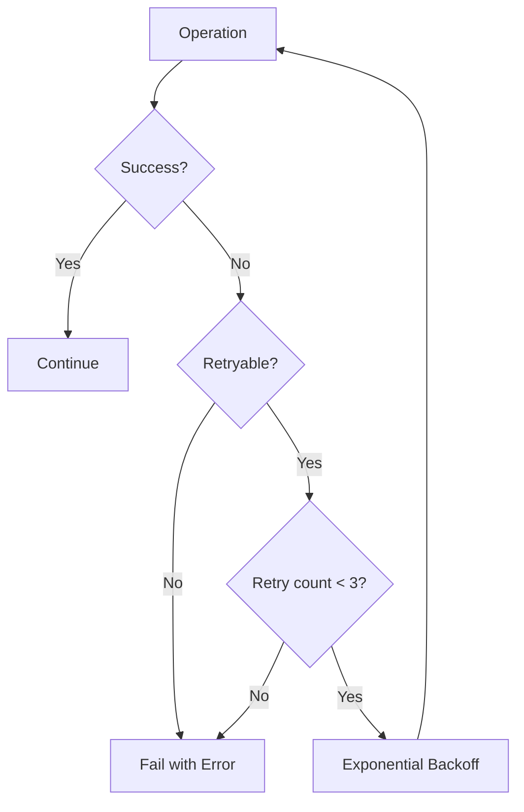
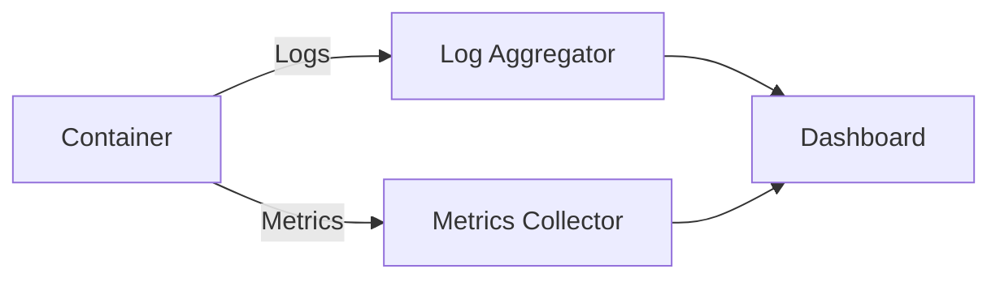

# Coding CLI Integration

## Overview

dursor delegates actual code generation to external coding CLIs (Codex, Claude Code, Gemini CLI) running inside Docker containers. This architecture provides:

- **Isolation**: Each run executes in a dedicated container
- **Security**: Sandboxed environment prevents malicious code execution
- **Flexibility**: Support for multiple coding CLIs with unified interface
- **Reproducibility**: Consistent execution environment

## System Architecture



## Execution Flow

### Complete Lifecycle



### Parallel Execution



## Supported Coding CLIs

| CLI | Provider | Model | Environment Variable |
|-----|----------|-------|---------------------|
| Claude Code | Anthropic | Claude 3.5/4 | `ANTHROPIC_API_KEY` |
| Codex | OpenAI | GPT-4 / Codex | `OPENAI_API_KEY` |
| Gemini CLI | Google | Gemini Pro | `GOOGLE_API_KEY` |

## Container Configuration

### Base Image

```dockerfile
# Dockerfile.coding-cli
FROM ubuntu:22.04

# Install common dependencies
RUN apt-get update && apt-get install -y \
    git \
    curl \
    nodejs \
    npm \
    python3 \
    python3-pip \
    && rm -rf /var/lib/apt/lists/*

# Install coding CLIs
RUN npm install -g @anthropic-ai/claude-code \
    && npm install -g @openai/codex \
    && pip3 install gemini-cli

# Set up workspace
WORKDIR /workspace

# Entry point script
COPY entrypoint.sh /entrypoint.sh
RUN chmod +x /entrypoint.sh

ENTRYPOINT ["/entrypoint.sh"]
```

### Container Lifecycle



## Service Interfaces

### ContainerService

```python
class ContainerService:
    """Manages Docker containers for coding CLI execution"""

    async def create_container(
        self,
        run_id: str,
        cli_type: CodingCLI,
        workspace_path: str,
        api_key: str,
    ) -> ContainerInfo:
        """Create a new container for code generation"""
        pass

    async def execute(
        self,
        container_id: str,
        instruction: str,
        timeout: int = 600,
    ) -> ExecutionResult:
        """Execute coding CLI with instruction"""
        pass

    async def cleanup(self, container_id: str) -> None:
        """Remove container and temporary resources"""
        pass
```

### GitService

```python
class GitService:
    """Manages Git operations for workspaces"""

    async def create_branch(
        self,
        workspace_path: str,
        branch_name: str,
        base_ref: str = "main",
    ) -> None:
        """Create a new feature branch"""
        pass

    async def commit_changes(
        self,
        workspace_path: str,
        message: str,
    ) -> str:
        """Stage and commit all changes, returns commit SHA"""
        pass

    async def push_branch(
        self,
        workspace_path: str,
        branch_name: str,
    ) -> None:
        """Push branch to remote origin"""
        pass

    async def get_diff(
        self,
        workspace_path: str,
        base_ref: str,
    ) -> str:
        """Get unified diff from base ref"""
        pass
```

## Execution Details

### 1. Workspace Creation



### Branch Naming Convention

```
feature/run-{run_id}-{cli_type}

Examples:
- feature/run-abc123-claude
- feature/run-abc123-codex
- feature/run-abc123-gemini
```

### 2. Coding CLI Execution



### CLI Invocation Commands

```bash
# Claude Code
claude-code --instruction "$INSTRUCTION" --workspace /workspace --non-interactive

# Codex
codex --prompt "$INSTRUCTION" --dir /workspace --auto-apply

# Gemini CLI
gemini-cli code --task "$INSTRUCTION" --path /workspace --apply
```

### Timeout and Resource Limits

```yaml
container:
  timeout: 600        # 10 minutes max
  memory: 4g          # 4GB RAM limit
  cpu: 2              # 2 CPU cores
  network: limited    # Only LLM API access
```

### 3. Post-processing



### Commit Message Format

```
[dursor] {summary}

Run ID: {run_id}
CLI: {cli_type}
Instruction: {instruction_truncated}

Generated by dursor coding agent
```

### Summary Generation

```python
class SummaryGenerator:
    """Generate human-readable summary of changes"""

    def generate(
        self,
        diff: str,
        instruction: str,
        cli_type: str,
    ) -> RunSummary:
        return RunSummary(
            files_changed=self._count_files(diff),
            lines_added=self._count_additions(diff),
            lines_removed=self._count_deletions(diff),
            description=self._summarize_changes(diff),
            branch=f"feature/run-{run_id}-{cli_type}",
            commit_sha=commit_sha,
        )
```

## Error Handling

### Retry Strategy



### Error Categories

| Error Type | Retryable | Action |
|------------|-----------|--------|
| Container creation failed | Yes | Retry with backoff |
| CLI timeout | No | Report timeout error |
| Git push rejected | Yes | Pull & retry |
| API rate limit | Yes | Wait & retry |
| Invalid instruction | No | Return validation error |

## Security Considerations

### Container Isolation

```mermaid
flowchart TB
    subgraph Host["Host System"]
        API[API Server]
        Vol[Volume Mount<br/>Read-Write]
    end

    subgraph Container["Docker Container"]
        CLI[Coding CLI]
        WS[/workspace]
        Net[Network<br/>Limited]
    end

    API -.->|Control| Container
    Vol <-->|Files| WS
    Net -->|HTTPS only| LLM[LLM APIs]
```

### Security Measures

1. **Network Isolation**: Containers only access whitelisted LLM API endpoints
2. **Volume Mounts**: Limited to workspace directory only
3. **No Privileged Mode**: Containers run as non-root user
4. **Resource Limits**: CPU, memory, and time constraints
5. **API Key Injection**: Keys passed as environment variables, not stored in container

### Forbidden Operations

```python
BLOCKED_COMMANDS = [
    "rm -rf /",
    "curl | bash",
    "wget | sh",
    "sudo",
    "chmod 777",
]

FORBIDDEN_PATHS = [
    ".git/config",
    ".env",
    "*.pem",
    "*.key",
    "credentials.*",
]
```

## Configuration

### Environment Variables

| Variable | Description | Default |
|----------|-------------|---------|
| `DURSOR_DOCKER_HOST` | Docker daemon socket | `unix:///var/run/docker.sock` |
| `DURSOR_CONTAINER_IMAGE` | Base image for CLI containers | `dursor/coding-cli:latest` |
| `DURSOR_CONTAINER_TIMEOUT` | Max execution time (seconds) | `600` |
| `DURSOR_CONTAINER_MEMORY` | Memory limit | `4g` |
| `DURSOR_CONTAINER_CPU` | CPU limit | `2` |

### Docker Compose Extension

```yaml
# docker-compose.override.yml
services:
  api:
    volumes:
      - /var/run/docker.sock:/var/run/docker.sock
    environment:
      - DURSOR_DOCKER_HOST=unix:///var/run/docker.sock

  coding-cli:
    build:
      context: ./docker/coding-cli
      dockerfile: Dockerfile
    image: dursor/coding-cli:latest
```

## Monitoring and Logging

### Container Logs

```python
async def stream_logs(container_id: str) -> AsyncIterator[str]:
    """Stream container logs in real-time"""
    async for line in docker.logs(container_id, stream=True):
        yield line.decode()
```

### Metrics



| Metric | Description |
|--------|-------------|
| `container_execution_time` | Time spent in container |
| `container_memory_usage` | Peak memory usage |
| `cli_success_rate` | Success rate by CLI type |
| `git_push_retries` | Number of push retries |

## Roadmap

### Current (v0.2)

- [x] Basic Docker container support
- [x] Claude Code integration
- [ ] Codex integration
- [ ] Gemini CLI integration
- [ ] Container pooling for faster startup

### Future (v0.3+)

- [ ] Custom container images per repository
- [ ] Persistent container sessions
- [ ] Real-time log streaming to UI
- [ ] Container resource autoscaling
