# Coding Mode 設計ドキュメント

## 概要

zlothに3つの実装モードを搭載し、プロジェクトの性質やチームの運用方針に応じて最適な開発フローを選択可能にする。

### 3つのモード

| モード | 日本語名 | 概要 |
|--------|----------|------|
| **Interactive** | 対話型コーディング | ユーザーがAIと会話しながら実装・レビュー |
| **Semi Auto** | 半自動コーディング | AIが実装〜CI〜レビュー解決まで自走、人間が最終確認してMerge |
| **Full Auto** | 完全自動コーディング | AIが実装〜CI〜レビュー解決〜Mergeまで完全自動 |

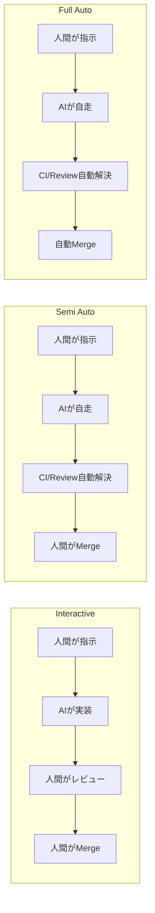

---

## 各モードの詳細

### 1. Interactive Coding（対話型コーディング）

#### 特徴

- **Human-in-the-loop**: 各ステップで人間が確認・指示
- **細かい制御**: 実装方針をリアルタイムで調整可能
- **学習効果**: AIとの対話から開発者が学べる

#### ユースケース

- 新機能の設計段階での検討
- 複雑なビジネスロジックの実装
- チームメンバーのオンボーディング
- AIの出力品質を確認したい場合

#### フロー図

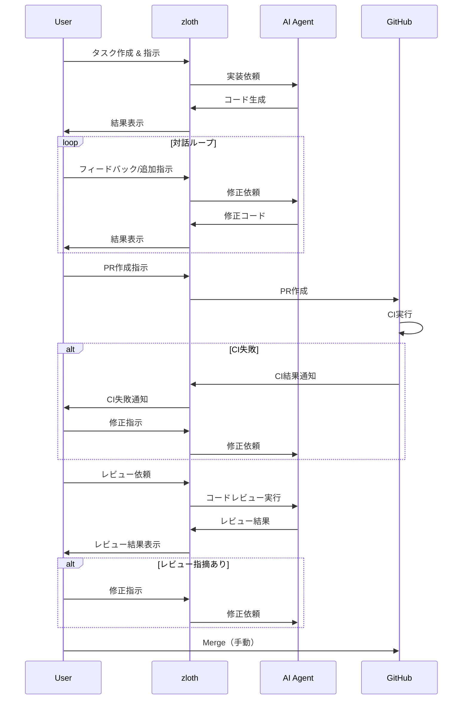

#### 状態遷移図

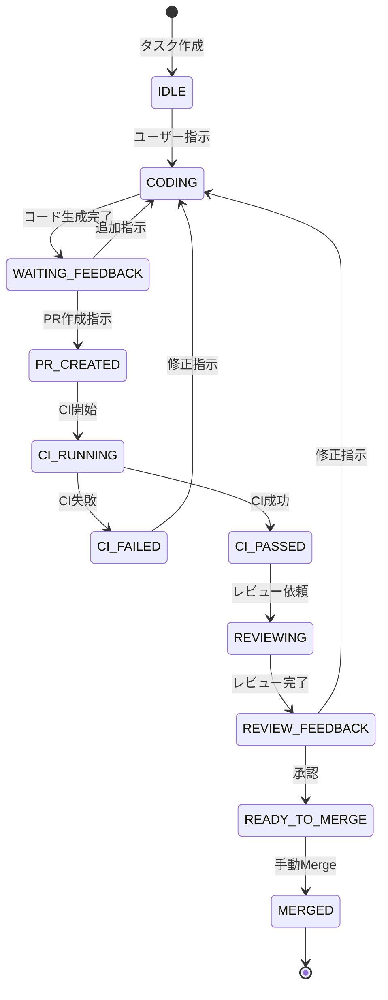

---

### 2. Semi Auto Coding（半自動コーディング）

#### 特徴

- **CI自動修正**: CI失敗時にAIが自動で修正
- **レビュー自動対応**: レビュー指摘をAIが自動で解決
- **最終確認は人間**: Mergeの判断は人間が行う
- **イテレーション上限**: 無限ループ防止のため回数制限あり

#### ユースケース

- 定型的な機能追加・バグ修正
- CIが整備されたプロジェクト
- 開発者の時間を節約したいが、最終チェックは必要な場合
- チーム開発での品質保証

#### フロー図

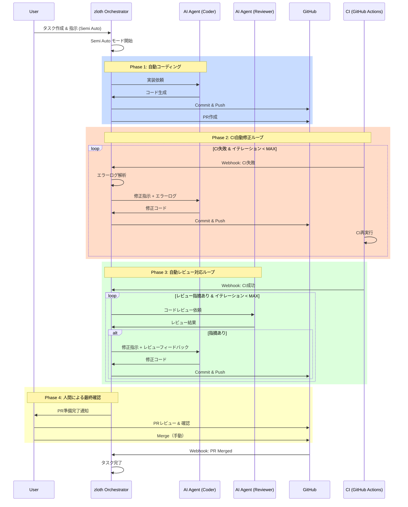

#### 状態遷移図

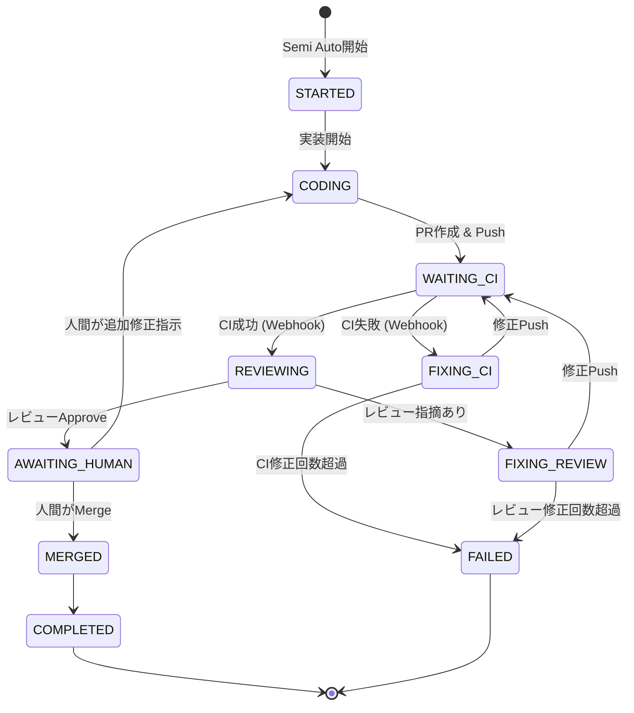

#### イテレーション管理

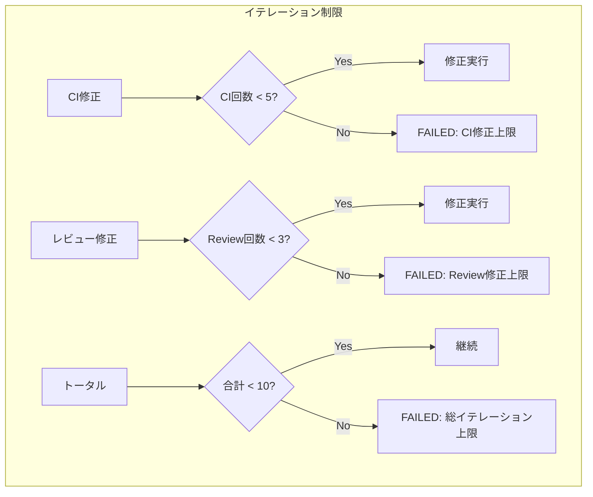

---

### 3. Full Auto Coding（完全自動コーディング）

#### 特徴

- **Human-out-of-the-loop**: 人間の介入なしで完全自動化
- **厳格なマージ条件**: 品質を担保するためのGate
- **自動ロールバック**: 問題発生時の自動対処
- **監査ログ**: すべての操作を記録

#### ユースケース

- 依存ライブラリの自動アップデート
- 定型的なリファクタリング
- ボイラープレートコードの生成
- 高信頼性のCIが整備されたプロジェクト
- 夜間/週末の自動開発

#### フロー図

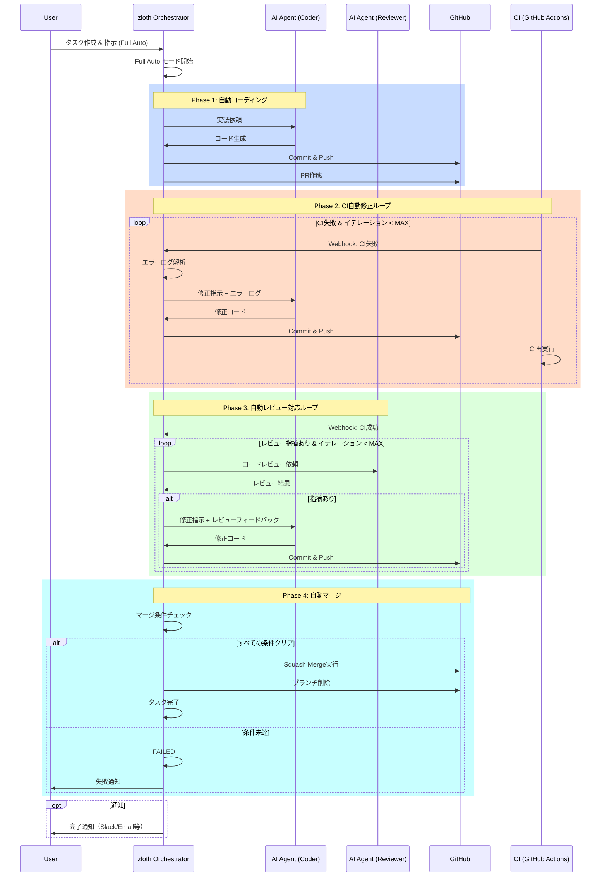

#### マージ条件 (Merge Gates)

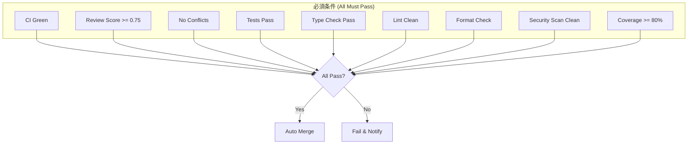

#### 状態遷移図

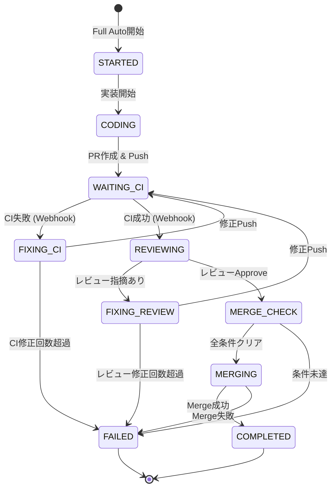

---

## アーキテクチャ

### AI Role Layer

各コーディングモードは、共通の **AI Role** インターフェースを使用して実装・レビューを実行する。
AI Role の詳細は [AI Role リファクタリング計画](./refactoring-ai-role.md) を参照。

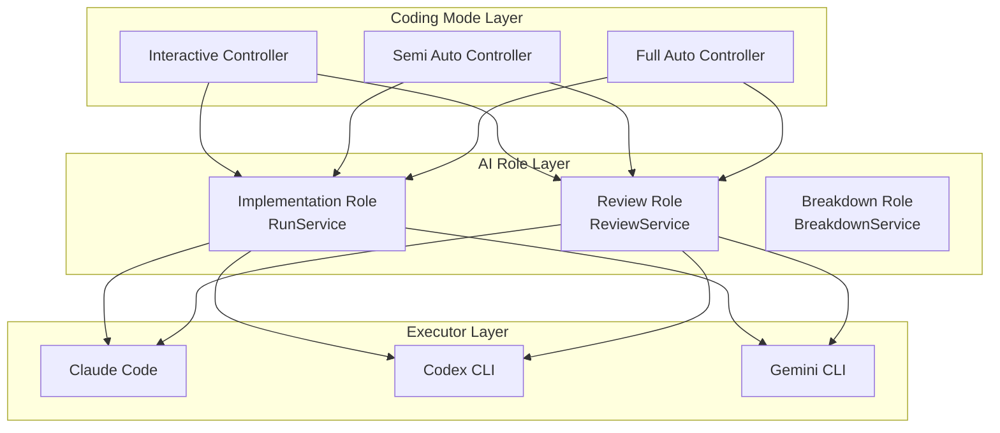

#### 各モードで使用するAI Role

| モード | Implementation Role | Review Role |
|--------|---------------------|-------------|
| Interactive | ユーザー指示で実行 | ユーザーがReviewボタンで実行 |
| Semi Auto | 自動実行 | CI成功後に自動実行 |
| Full Auto | 自動実行 | CI成功後に自動実行 |

### システム全体像

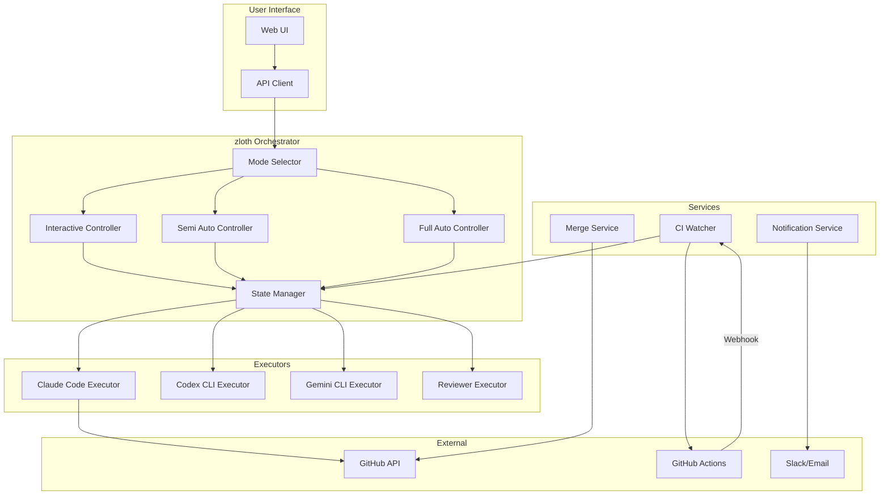

### モード別コントローラー

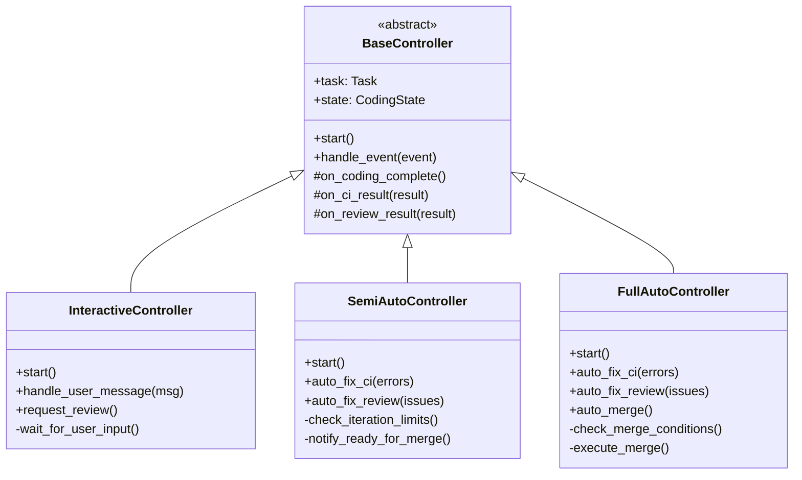

---

## データモデル

### CodingMode Enum

```python
class CodingMode(str, Enum):
    """コーディングモード"""
    INTERACTIVE = "interactive"
    SEMI_AUTO = "semi_auto"
    FULL_AUTO = "full_auto"
```

### CodingState

```python
class CodingPhase(str, Enum):
    """コーディングフェーズ"""
    IDLE = "idle"
    CODING = "coding"
    WAITING_CI = "waiting_ci"
    FIXING_CI = "fixing_ci"
    REVIEWING = "reviewing"
    FIXING_REVIEW = "fixing_review"
    AWAITING_HUMAN = "awaiting_human"  # Semi Auto only
    MERGE_CHECK = "merge_check"        # Full Auto only
    MERGING = "merging"
    COMPLETED = "completed"
    FAILED = "failed"


@dataclass
class CodingState:
    """コーディング状態"""
    task_id: str
    mode: CodingMode
    phase: CodingPhase
    iteration: int = 0
    ci_iterations: int = 0
    review_iterations: int = 0
    pr_number: int | None = None
    current_sha: str | None = None
    last_ci_result: CIResult | None = None
    last_review_result: ReviewResult | None = None
    error: str | None = None
    started_at: datetime
    last_activity: datetime
```

### Task拡張

```python
class TaskCreate(BaseModel):
    repo_id: str
    title: str | None = None
    coding_mode: CodingMode = CodingMode.INTERACTIVE  # 新規追加
```

### イテレーション制限

```python
@dataclass
class IterationLimits:
    """モード別イテレーション制限"""
    # Interactive: 制限なし（人間が制御）

    # Semi Auto / Full Auto
    max_ci_iterations: int = 5
    max_review_iterations: int = 3
    max_total_iterations: int = 10

    # Full Auto only
    min_review_score: float = 0.75
    coverage_threshold: float = 80.0

    # Timeouts
    timeout_minutes: int = 60
    ci_wait_timeout_minutes: int = 15
```

---

## API設計

### エンドポイント

```yaml
# タスク作成（モード指定）
POST /v1/tasks:
  request:
    repo_id: string
    title: string?
    coding_mode: "interactive" | "semi_auto" | "full_auto"
  response:
    task: Task

# 自動実行開始（Semi Auto / Full Auto）
POST /v1/tasks/{task_id}/auto-start:
  request:
    instruction: string
    executor_types: ExecutorType[]
  response:
    status: "started"
    state: CodingState

# 状態取得
GET /v1/tasks/{task_id}/coding-state:
  response:
    state: CodingState

# 自動実行キャンセル
POST /v1/tasks/{task_id}/auto-cancel:
  response:
    cancelled: boolean

# イベント通知（Webhook）
POST /v1/webhooks/ci:
  request:
    event: "ci_completed"
    pr_number: int
    conclusion: "success" | "failure"
    jobs: dict

# 人間によるMerge承認（Semi Auto）
POST /v1/tasks/{task_id}/approve-merge:
  response:
    merged: boolean
```

### WebSocket（リアルタイム更新）

```yaml
# 状態変更の購読
WS /v1/tasks/{task_id}/subscribe:
  events:
    - type: "phase_changed"
      data: { phase: CodingPhase, iteration: int }
    - type: "ci_result"
      data: { success: boolean, details: object }
    - type: "review_result"
      data: { approved: boolean, score: float, issues: array }
    - type: "completed"
      data: { merged: boolean, pr_url: string }
    - type: "failed"
      data: { error: string, phase: CodingPhase }
```

---

## モード比較表

| 項目 | Interactive | Semi Auto | Full Auto |
|------|-------------|-----------|-----------|
| **人間の介入** | 各ステップ | 最終Mergeのみ | なし |
| **CI失敗時** | 人間が判断 | AI自動修正 | AI自動修正 |
| **レビュー指摘** | 人間が判断 | AI自動対応 | AI自動対応 |
| **Merge** | 手動 | 手動 | 自動 |
| **イテレーション制限** | なし | あり | あり |
| **マージ条件** | なし | なし | 厳格 |
| **適用シナリオ** | 設計検討、複雑実装 | 定型作業、時間節約 | 定型作業、夜間実行 |
| **リスク** | 低 | 中 | 高 |
| **効率** | 低〜中 | 中〜高 | 高 |

---

## UI設計

### モード選択UI

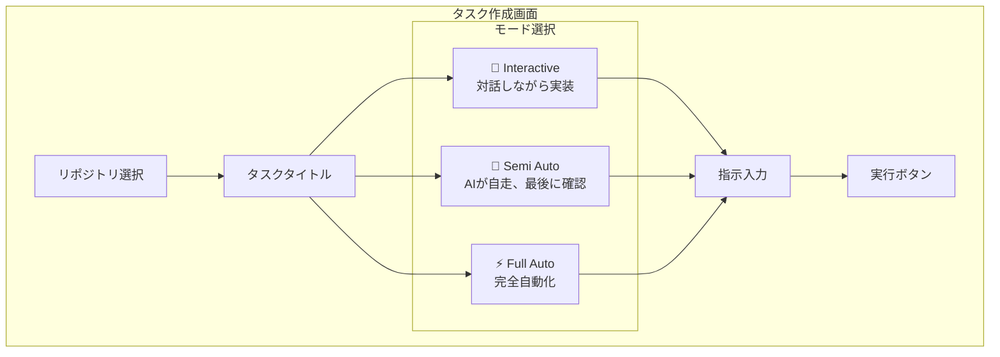

### 実行状態表示

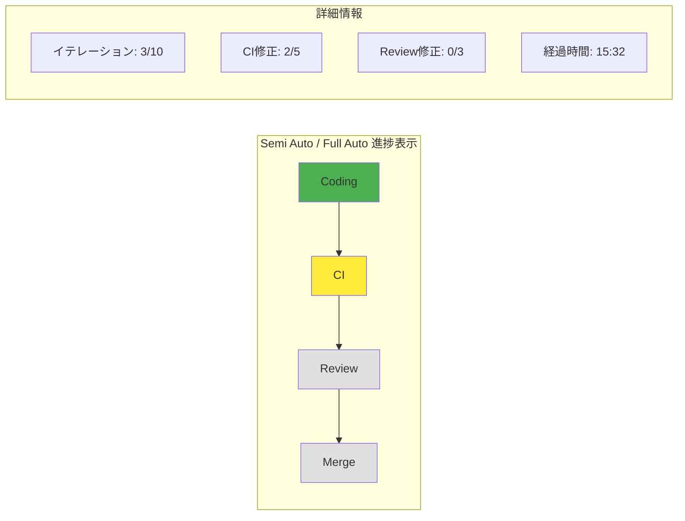

---

## セキュリティ考慮事項

### Full Auto モード固有のリスク

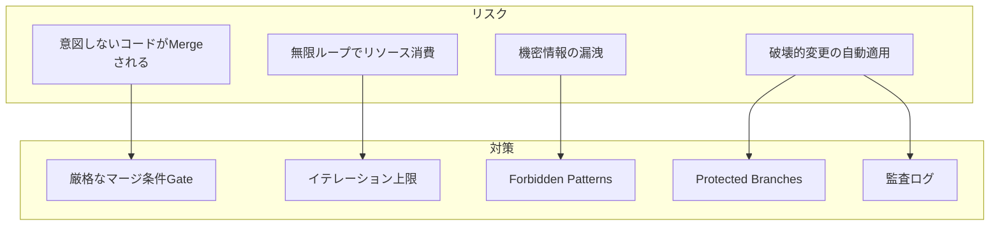

### 禁止パターン

```python
FORBIDDEN_PATTERNS = [
    # 機密情報
    r"(?i)(api[_-]?key|secret|password|token)\s*=\s*['\"][^'\"]+['\"]",
    r"sk-[a-zA-Z0-9]{48}",  # OpenAI
    r"ghp_[a-zA-Z0-9]{36}",  # GitHub PAT
    r"AKIA[0-9A-Z]{16}",    # AWS Access Key

    # 破壊的操作
    r"git push --force",
    r"git reset --hard",
    r"DROP DATABASE",
    r"rm -rf /",
]
```

### モード別権限

| 操作 | Interactive | Semi Auto | Full Auto |
|------|-------------|-----------|-----------|
| ファイル編集 | ✅ | ✅ | ✅ |
| Git commit | ✅ | ✅ | ✅ |
| Git push | ✅ | ✅ | ✅ |
| PR作成 | ✅ | ✅ | ✅ |
| Auto Merge | ❌ | ❌ | ✅（条件付き）|
| Force Push | ❌ | ❌ | ❌ |
| Protected Branch変更 | ❌ | ❌ | ❌ |

---

## 通知設計

### 通知タイミング

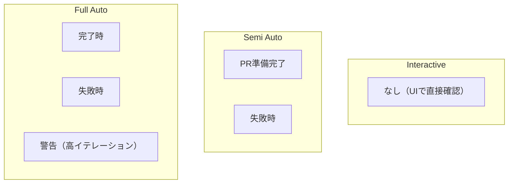

### 通知チャネル

- Slack Webhook
- Email
- GitHub Notification
- Discord Webhook（将来）

---

## 設定

### 環境変数

```bash
# モード設定
ZLOTH_DEFAULT_CODING_MODE=interactive  # デフォルトモード

# イテレーション制限
ZLOTH_MAX_CI_ITERATIONS=5
ZLOTH_MAX_REVIEW_ITERATIONS=3
ZLOTH_MAX_TOTAL_ITERATIONS=10

# Full Auto専用
ZLOTH_AUTO_MERGE_ENABLED=true
ZLOTH_MIN_REVIEW_SCORE=0.75
ZLOTH_COVERAGE_THRESHOLD=80

# 通知
ZLOTH_SLACK_WEBHOOK_URL=https://hooks.slack.com/...
ZLOTH_NOTIFY_ON_COMPLETE=true
ZLOTH_NOTIFY_ON_FAILURE=true

# タイムアウト
ZLOTH_TIMEOUT_MINUTES=60
ZLOTH_CI_WAIT_TIMEOUT_MINUTES=15
```

### プロジェクト設定（.zloth.yml）

```yaml
coding:
  default_mode: semi_auto

  interactive:
    # 特別な設定なし

  semi_auto:
    max_ci_iterations: 5
    max_review_iterations: 3
    notify_ready: true

  full_auto:
    enabled: true  # false で無効化
    max_ci_iterations: 5
    max_review_iterations: 3
    min_review_score: 0.8
    coverage_threshold: 85
    merge_method: squash
    delete_branch_after_merge: true

notifications:
  slack:
    webhook_url: ${SLACK_WEBHOOK_URL}
    channels:
      on_complete: "#dev-notifications"
      on_failure: "#dev-alerts"
```

---

## 実装ロードマップ

### Phase 1: 基盤構築

- [ ] `CodingMode` enum 追加
- [ ] `CodingState` モデル追加
- [ ] `BaseController` 抽象クラス実装
- [ ] Task テーブルに `coding_mode` カラム追加

### Phase 2: Interactive Mode（既存機能整理）

- [ ] `InteractiveController` 実装
- [ ] 既存フローのリファクタリング
- [ ] UI でのモード表示

### Phase 3: Semi Auto Mode

- [ ] `SemiAutoController` 実装
- [ ] CI Webhook ハンドラー実装
- [ ] レビュー自動実行
- [ ] 「Merge待ち」通知機能
- [ ] UI 進捗表示

### Phase 4: Full Auto Mode

- [ ] `FullAutoController` 実装
- [ ] マージ条件チェッカー
- [ ] Auto Merge 実行
- [ ] 監査ログ
- [ ] 完了/失敗通知

### Phase 5: 拡張機能

- [ ] WebSocket リアルタイム更新
- [ ] Slack/Discord 通知連携
- [ ] プロジェクト設定ファイルサポート
- [ ] ダッシュボード（統計表示）

---

## 関連ドキュメント

- [Agentic Zloth](./agentic-zloth.md) - Semi Auto / Full Auto の詳細実装
- [Code Review Feature](./review.md) - ReviewService の詳細仕様
- [AI Role Refactoring](./refactoring-ai-role.md) - AI Role 共通インターフェース
- [Architecture](./architecture.md)
- [Multi AI Coding Tool](./ai-coding-tool-multiple.md)
- [Git Operation Design](./git_operation_design.md)
