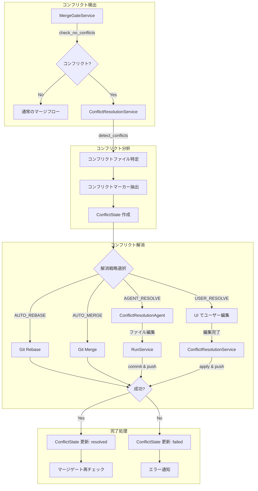
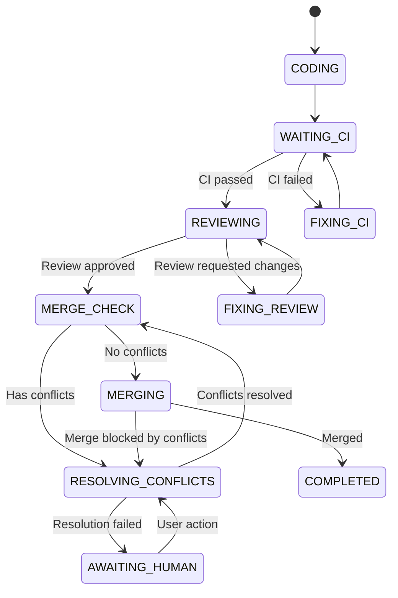

# Conflict Resolution Mode Design

## Overview

コンフリクト解消モードは、PRがターゲットブランチとコンフリクトを起こした際に、自動または手動でコンフリクトを解決する機能です。dursor のオーケストレーター管理パターンに従い、Git 操作は dursor が一元管理し、AI エージェントはファイル編集のみを担当します。

## Architecture

### Flow Diagram



## Data Models

### New Enums

```python
# apps/api/src/dursor_api/domain/enums.py

class ConflictResolutionStrategy(str, Enum):
    """コンフリクト解消戦略"""
    AUTO_REBASE = "auto_rebase"      # ベースブランチに rebase
    AUTO_MERGE = "auto_merge"        # ベースブランチをマージ
    AGENT_RESOLVE = "agent_resolve"  # AI エージェントで解消
    USER_RESOLVE = "user_resolve"    # ユーザーが手動で解消


class ConflictStatus(str, Enum):
    """コンフリクト状態"""
    DETECTED = "detected"            # 検出済み
    RESOLVING = "resolving"          # 解消中
    RESOLVED = "resolved"            # 解消完了
    FAILED = "failed"                # 解消失敗


class ConflictType(str, Enum):
    """コンフリクトの種類"""
    CONTENT = "content"              # 内容のコンフリクト（マーカー付き）
    DELETE_MODIFY = "delete_modify"  # 片方が削除、片方が変更
    ADD_ADD = "add_add"              # 両方が同名ファイルを追加
    RENAME = "rename"                # リネームのコンフリクト
```

### New Models

```python
# apps/api/src/dursor_api/domain/models.py

class ConflictFile(BaseModel):
    """コンフリクトが発生したファイル"""
    path: str
    conflict_type: ConflictType
    ours_content: str | None = None      # PR ブランチ側の内容
    theirs_content: str | None = None    # ベースブランチ側の内容
    conflict_markers: str | None = None  # マーカー付きの内容（<<<< ==== >>>>）
    resolved_content: str | None = None  # 解消後の内容
    resolved_by: Literal["agent", "user", "auto"] | None = None


class ConflictState(BaseModel):
    """コンフリクト状態"""
    id: str
    pr_id: str
    task_id: str
    status: ConflictStatus
    strategy: ConflictResolutionStrategy | None = None
    conflict_files: list[ConflictFile]
    resolution_run_id: str | None = None  # エージェント解消時の Run ID
    base_commit: str                       # コンフリクト検出時のベースコミット
    head_commit: str                       # コンフリクト検出時の HEAD コミット
    created_at: datetime
    resolved_at: datetime | None = None
    error: str | None = None


class ConflictResolutionRequest(BaseModel):
    """コンフリクト解消リクエスト"""
    strategy: ConflictResolutionStrategy
    user_resolutions: dict[str, str] | None = None  # USER_RESOLVE 時のファイル別解消内容


class ConflictResolutionResult(BaseModel):
    """コンフリクト解消結果"""
    success: bool
    conflict_state: ConflictState
    new_commit_sha: str | None = None
    error: str | None = None
```

### AgenticPhase Extension

```python
class AgenticPhase(str, Enum):
    # ... existing phases ...
    CODING = "coding"
    WAITING_CI = "waiting_ci"
    REVIEWING = "reviewing"
    FIXING_CI = "fixing_ci"
    FIXING_REVIEW = "fixing_review"
    AWAITING_HUMAN = "awaiting_human"
    MERGE_CHECK = "merge_check"
    RESOLVING_CONFLICTS = "resolving_conflicts"  # NEW: コンフリクト解消中
    MERGING = "merging"
    COMPLETED = "completed"
```

## Database Schema

```sql
-- apps/api/src/dursor_api/storage/schema.sql

CREATE TABLE conflict_states (
    id TEXT PRIMARY KEY,
    pr_id TEXT NOT NULL REFERENCES prs(id) ON DELETE CASCADE,
    task_id TEXT NOT NULL REFERENCES tasks(id) ON DELETE CASCADE,
    status TEXT NOT NULL DEFAULT 'detected',
    strategy TEXT,
    conflict_files_json TEXT NOT NULL,  -- JSON array of ConflictFile
    resolution_run_id TEXT REFERENCES runs(id),
    base_commit TEXT NOT NULL,
    head_commit TEXT NOT NULL,
    created_at TEXT NOT NULL DEFAULT (datetime('now')),
    resolved_at TEXT,
    error TEXT
);

CREATE INDEX idx_conflict_states_pr_id ON conflict_states(pr_id);
CREATE INDEX idx_conflict_states_task_id ON conflict_states(task_id);
CREATE INDEX idx_conflict_states_status ON conflict_states(status);
```

## API Endpoints

### Routes

```python
# apps/api/src/dursor_api/routes/conflicts.py

# コンフリクト検出
POST /v1/tasks/{task_id}/prs/{pr_id}/detect-conflicts
Response: ConflictState

# コンフリクト状態取得
GET /v1/tasks/{task_id}/prs/{pr_id}/conflicts
Response: list[ConflictState]

# 最新のコンフリクト状態取得
GET /v1/tasks/{task_id}/prs/{pr_id}/conflicts/latest
Response: ConflictState | null

# コンフリクト解消実行
POST /v1/tasks/{task_id}/prs/{pr_id}/resolve-conflicts
Body: ConflictResolutionRequest
Response: ConflictResolutionResult

# ユーザー解消内容の適用（USER_RESOLVE 戦略時）
POST /v1/tasks/{task_id}/prs/{pr_id}/conflicts/{conflict_id}/apply-user-resolution
Body: { "resolutions": { "file_path": "resolved_content", ... } }
Response: ConflictResolutionResult

# コンフリクト解消のキャンセル
POST /v1/tasks/{task_id}/prs/{pr_id}/conflicts/{conflict_id}/cancel
Response: ConflictState
```

### Request/Response Examples

```json
// POST /v1/tasks/{task_id}/prs/{pr_id}/detect-conflicts
// Response
{
  "id": "conflict_abc123",
  "pr_id": "pr_xyz",
  "task_id": "task_123",
  "status": "detected",
  "strategy": null,
  "conflict_files": [
    {
      "path": "src/utils/helper.py",
      "conflict_type": "content",
      "ours_content": "def helper():\n    return 'our change'\n",
      "theirs_content": "def helper():\n    return 'their change'\n",
      "conflict_markers": "<<<<<<< HEAD\ndef helper():\n    return 'our change'\n=======\ndef helper():\n    return 'their change'\n>>>>>>> main",
      "resolved_content": null,
      "resolved_by": null
    }
  ],
  "base_commit": "abc123",
  "head_commit": "def456",
  "created_at": "2024-01-15T10:00:00Z",
  "resolved_at": null,
  "error": null
}
```

```json
// POST /v1/tasks/{task_id}/prs/{pr_id}/resolve-conflicts
// Request
{
  "strategy": "agent_resolve"
}

// Response
{
  "success": true,
  "conflict_state": {
    "id": "conflict_abc123",
    "status": "resolved",
    "strategy": "agent_resolve",
    "resolution_run_id": "run_789",
    "resolved_at": "2024-01-15T10:05:00Z"
  },
  "new_commit_sha": "new123",
  "error": null
}
```

## Service Layer

### ConflictResolutionService

```python
# apps/api/src/dursor_api/services/conflict_resolution_service.py

class ConflictResolutionService:
    """コンフリクト解消サービス"""

    def __init__(
        self,
        conflict_dao: ConflictStateDAO,
        git_service: GitService,
        github_service: GitHubService,
        run_service: RunService,
        pr_dao: PRDAO,
    ):
        self.conflict_dao = conflict_dao
        self.git = git_service
        self.github = github_service
        self.run_service = run_service
        self.pr_dao = pr_dao

    async def detect_conflicts(
        self, task_id: str, pr_id: str
    ) -> ConflictState:
        """
        PR のコンフリクトを検出し、ConflictState を作成する

        1. GitHub API で mergeable_state を確認
        2. コンフリクトがある場合、worktree でマージを試行
        3. コンフリクトファイルとマーカーを抽出
        4. ConflictState を作成して返す
        """
        pass

    async def resolve_conflicts(
        self,
        task_id: str,
        pr_id: str,
        conflict_id: str,
        request: ConflictResolutionRequest,
    ) -> ConflictResolutionResult:
        """
        指定された戦略でコンフリクトを解消する
        """
        strategy_handlers = {
            ConflictResolutionStrategy.AUTO_REBASE: self._resolve_by_rebase,
            ConflictResolutionStrategy.AUTO_MERGE: self._resolve_by_merge,
            ConflictResolutionStrategy.AGENT_RESOLVE: self._resolve_by_agent,
            ConflictResolutionStrategy.USER_RESOLVE: self._resolve_by_user,
        }
        handler = strategy_handlers[request.strategy]
        return await handler(task_id, pr_id, conflict_id, request)

    async def _resolve_by_rebase(
        self, task_id: str, pr_id: str, conflict_id: str, request: ConflictResolutionRequest
    ) -> ConflictResolutionResult:
        """
        AUTO_REBASE 戦略: ベースブランチに rebase

        1. worktree で git fetch origin
        2. git rebase origin/{base_branch}
        3. コンフリクトなしで成功すれば push --force-with-lease
        4. コンフリクトが発生した場合は失敗として返す
        """
        pass

    async def _resolve_by_merge(
        self, task_id: str, pr_id: str, conflict_id: str, request: ConflictResolutionRequest
    ) -> ConflictResolutionResult:
        """
        AUTO_MERGE 戦略: ベースブランチをマージ

        1. worktree で git fetch origin
        2. git merge origin/{base_branch}
        3. コンフリクトなしで成功すれば push
        4. コンフリクトが発生した場合は失敗として返す
        """
        pass

    async def _resolve_by_agent(
        self, task_id: str, pr_id: str, conflict_id: str, request: ConflictResolutionRequest
    ) -> ConflictResolutionResult:
        """
        AGENT_RESOLVE 戦略: AI エージェントでコンフリクト解消

        1. コンフリクトマーカー付きの状態で worktree を準備
        2. ConflictResolutionAgent を実行
        3. エージェントがマーカーを解消してファイル編集
        4. RunService が commit & push
        5. 結果を ConflictState に反映
        """
        pass

    async def _resolve_by_user(
        self, task_id: str, pr_id: str, conflict_id: str, request: ConflictResolutionRequest
    ) -> ConflictResolutionResult:
        """
        USER_RESOLVE 戦略: ユーザーが手動で解消

        1. request.user_resolutions からファイル別の解消内容を取得
        2. worktree に解消内容を適用
        3. commit & push
        4. 結果を ConflictState に反映
        """
        pass

    async def _extract_conflict_files(
        self, worktree_path: str
    ) -> list[ConflictFile]:
        """
        worktree からコンフリクトファイルを抽出する

        git diff --name-only --diff-filter=U でコンフリクトファイル一覧取得
        各ファイルのマーカー内容を読み取り
        """
        pass
```

### GitService Extensions

```python
# apps/api/src/dursor_api/services/git_service.py

class GitService:
    # ... existing methods ...

    async def attempt_merge(
        self,
        worktree_path: str,
        target_ref: str,
    ) -> MergeAttemptResult:
        """
        マージを試行し、コンフリクト情報を返す

        Returns:
            MergeAttemptResult with:
            - success: bool
            - has_conflicts: bool
            - conflict_files: list[str]
        """
        pass

    async def get_conflict_markers(
        self,
        worktree_path: str,
        file_path: str,
    ) -> str:
        """指定ファイルのコンフリクトマーカー付き内容を取得"""
        pass

    async def get_ours_theirs_content(
        self,
        worktree_path: str,
        file_path: str,
    ) -> tuple[str | None, str | None]:
        """
        コンフリクトファイルの両側の内容を取得

        git show :2:{file} -> ours (current branch)
        git show :3:{file} -> theirs (merging branch)
        """
        pass

    async def abort_merge(self, worktree_path: str) -> None:
        """進行中のマージを中断"""
        pass

    async def resolve_and_commit(
        self,
        worktree_path: str,
        resolved_files: dict[str, str],
        message: str,
    ) -> str:
        """
        解消内容を適用してコミット

        Returns: commit SHA
        """
        pass
```

## Agent Implementation

### ConflictResolutionAgent

```python
# apps/api/src/dursor_api/agents/conflict_resolution_agent.py

class ConflictResolutionAgent(BaseAgent):
    """
    コンフリクト解消専用エージェント

    コンフリクトマーカー（<<<< ==== >>>>）を含むファイルを編集し、
    両方の変更を適切に統合した内容に置き換える。
    """

    async def run(self, request: AgentRequest) -> AgentResult:
        """
        コンフリクト解消を実行

        request.context には以下を含む:
        - conflict_files: list[ConflictFile]
        - original_task_instruction: str（元のタスク目的）
        - pr_description: str（PR の説明）

        エージェントは:
        1. 各コンフリクトファイルを読み取り
        2. 両側の意図を理解
        3. マーカーを削除し、適切に統合
        4. 編集後のファイルを保存
        """
        pass

    def _build_system_prompt(self) -> str:
        return """You are a conflict resolution specialist. Your task is to resolve
merge conflicts in source code files.

When resolving conflicts:
1. Understand the intent of BOTH sides of the conflict
2. Preserve all meaningful functionality from both branches
3. Remove ALL conflict markers (<<<<<<< ======= >>>>>>>)
4. Ensure the resulting code is syntactically correct
5. Maintain code style consistency

IMPORTANT:
- Do NOT simply choose one side - integrate both changes when possible
- If changes are mutually exclusive, prefer the changes that align with the task goal
- Preserve all imports, type annotations, and documentation from both sides
- Test that the resolved code would compile/run correctly
"""

    def _build_resolution_prompt(
        self,
        conflict_file: ConflictFile,
        task_context: str,
    ) -> str:
        return f"""Resolve the following merge conflict:

File: {conflict_file.path}

Conflict content:
```
{conflict_file.conflict_markers}
```

Original task context:
{task_context}

Instructions:
1. Analyze what each side is trying to accomplish
2. Create a resolution that preserves both intentions
3. Output ONLY the resolved file content without any conflict markers
"""
```

### Agent Constraints for Conflict Resolution

```python
# apps/api/src/dursor_api/agents/base.py

class ConflictResolutionConstraints(AgentConstraints):
    """コンフリクト解消時の特別な制約"""

    def __init__(self, conflict_files: list[str]):
        super().__init__(
            forbidden_paths=[".git", ".env", ".env.*"],
            # コンフリクトファイルのみ編集可能
            allowed_paths=conflict_files,
            forbidden_commands=["*"],  # すべてのコマンド禁止
            read_only=False,
        )
```

## Frontend Components

### ConflictResolutionPanel

```tsx
// apps/web/src/components/ConflictResolutionPanel.tsx

interface ConflictResolutionPanelProps {
  taskId: string;
  prId: string;
  conflictState: ConflictState;
  onResolved: () => void;
}

export function ConflictResolutionPanel({
  taskId,
  prId,
  conflictState,
  onResolved,
}: ConflictResolutionPanelProps) {
  const [strategy, setStrategy] = useState<ConflictResolutionStrategy | null>(null);
  const [isResolving, setIsResolving] = useState(false);
  const [userResolutions, setUserResolutions] = useState<Record<string, string>>({});

  // 戦略選択 UI
  // コンフリクトファイル一覧表示
  // 各戦略に応じたアクション
  // USER_RESOLVE 時はインラインエディタ表示
}
```

### UI Wireframe

```
┌─────────────────────────────────────────────────────────────────┐
│ Conflict Resolution                                    [Close X] │
├─────────────────────────────────────────────────────────────────┤
│                                                                  │
│  ⚠️ This PR has merge conflicts with the base branch            │
│                                                                  │
│  ┌─────────────────────────────────────────────────────────────┐ │
│  │ Conflicted Files (3)                                        │ │
│  ├─────────────────────────────────────────────────────────────┤ │
│  │ 📄 src/utils/helper.py         [content conflict]           │ │
│  │ 📄 src/services/api.py         [content conflict]           │ │
│  │ 📄 tests/test_helper.py        [delete/modify]              │ │
│  └─────────────────────────────────────────────────────────────┘ │
│                                                                  │
│  Resolution Strategy:                                            │
│  ┌─────────────────────────────────────────────────────────────┐ │
│  │ ○ Auto Rebase (Recommended)                                 │ │
│  │   Rebase PR branch onto latest base branch                  │ │
│  │                                                              │ │
│  │ ○ Auto Merge                                                │ │
│  │   Merge base branch into PR branch                          │ │
│  │                                                              │ │
│  │ ○ AI Agent Resolve                                          │ │
│  │   Let AI analyze and resolve conflicts                      │ │
│  │                                                              │ │
│  │ ○ Manual Resolution                                         │ │
│  │   Edit each file manually in the editor below               │ │
│  └─────────────────────────────────────────────────────────────┘ │
│                                                                  │
│  [Manual Resolution 選択時のみ表示]                              │
│  ┌─────────────────────────────────────────────────────────────┐ │
│  │ src/utils/helper.py                              [Resolved] │ │
│  ├─────────────────────────────────────────────────────────────┤ │
│  │  1 │ <<<<<<< HEAD                                           │ │
│  │  2 │ def helper():                                          │ │
│  │  3 │     return 'our change'                                │ │
│  │  4 │ =======                                                │ │
│  │  5 │ def helper():                                          │ │
│  │  6 │     return 'their change'                              │ │
│  │  7 │ >>>>>>> main                                           │ │
│  │                                                              │ │
│  │ [Edit Resolution]                                            │ │
│  └─────────────────────────────────────────────────────────────┘ │
│                                                                  │
│                              [Cancel]  [Resolve Conflicts]       │
│                                                                  │
└─────────────────────────────────────────────────────────────────┘
```

### API Client Extension

```typescript
// apps/web/src/lib/api.ts

export const conflictsApi = {
  detect: async (taskId: string, prId: string): Promise<ConflictState> => {
    return post(`/v1/tasks/${taskId}/prs/${prId}/detect-conflicts`);
  },

  getLatest: async (taskId: string, prId: string): Promise<ConflictState | null> => {
    return get(`/v1/tasks/${taskId}/prs/${prId}/conflicts/latest`);
  },

  resolve: async (
    taskId: string,
    prId: string,
    request: ConflictResolutionRequest
  ): Promise<ConflictResolutionResult> => {
    return post(`/v1/tasks/${taskId}/prs/${prId}/resolve-conflicts`, request);
  },

  applyUserResolution: async (
    taskId: string,
    prId: string,
    conflictId: string,
    resolutions: Record<string, string>
  ): Promise<ConflictResolutionResult> => {
    return post(
      `/v1/tasks/${taskId}/prs/${prId}/conflicts/${conflictId}/apply-user-resolution`,
      { resolutions }
    );
  },
};
```

## Integration Points

### MergeGateService Integration

```python
# apps/api/src/dursor_api/services/merge_gate_service.py

class MergeGateService:
    async def check_merge_readiness(
        self, pr_id: str, task_id: str
    ) -> list[MergeCondition]:
        conditions = []

        # ... existing checks ...

        # コンフリクトチェック（拡張）
        conflict_condition = await self._check_conflicts_with_resolution(
            pr_id, task_id
        )
        conditions.append(conflict_condition)

        return conditions

    async def _check_conflicts_with_resolution(
        self, pr_id: str, task_id: str
    ) -> MergeCondition:
        """
        コンフリクトの有無と解消状態をチェック

        - コンフリクトなし → passed
        - コンフリクトあり、未解消 → failed, action="resolve_conflicts"
        - コンフリクトあり、解消済み → passed
        - 解消中 → pending
        """
        pass
```

### AgenticPhase State Machine



## Security Considerations

### Agent Constraints

1. **編集可能ファイルの制限**: コンフリクトが検出されたファイルのみ編集可能
2. **コマンド実行禁止**: Git 操作はすべて dursor が実行
3. **マーカー検証**: 解消後にコンフリクトマーカーが残っていないことを検証

### Git Operation Safety

1. **force-with-lease**: rebase 後の push は `--force-with-lease` を使用
2. **backup branch**: 解消前に backup ブランチを作成
3. **rollback**: 失敗時は backup から復元可能

```python
async def _safe_rebase_push(
    self,
    worktree_path: str,
    branch: str,
    target_ref: str,
) -> RebaseResult:
    # バックアップブランチ作成
    backup_branch = f"{branch}-backup-{int(time.time())}"
    await self.git.create_branch(worktree_path, backup_branch)

    try:
        # rebase 実行
        result = await self.git.rebase(worktree_path, target_ref)
        if not result.success:
            return result

        # force-with-lease で push
        await self.git.push(
            worktree_path,
            branch,
            force_with_lease=True,
        )

        # バックアップ削除
        await self.git.delete_branch(worktree_path, backup_branch)
        return result

    except Exception as e:
        # rollback
        await self.git.reset_to_branch(worktree_path, backup_branch)
        raise
```

## Error Handling

### Error Types

```python
class ConflictResolutionError(Exception):
    """コンフリクト解消エラーの基底クラス"""
    pass

class ConflictDetectionError(ConflictResolutionError):
    """コンフリクト検出時のエラー"""
    pass

class RebaseConflictError(ConflictResolutionError):
    """rebase 中に新たなコンフリクトが発生"""
    conflict_files: list[str]

class MergeConflictError(ConflictResolutionError):
    """merge 中に解消不能なコンフリクトが発生"""
    conflict_files: list[str]

class AgentResolutionError(ConflictResolutionError):
    """エージェントによる解消が失敗"""
    remaining_markers: list[str]

class UserResolutionValidationError(ConflictResolutionError):
    """ユーザー解消内容の検証エラー"""
    invalid_files: list[str]
```

### Recovery Strategies

| Error Type | Recovery Strategy |
|------------|-------------------|
| RebaseConflictError | AGENT_RESOLVE または USER_RESOLVE にフォールバック |
| MergeConflictError | AGENT_RESOLVE または USER_RESOLVE にフォールバック |
| AgentResolutionError | USER_RESOLVE にフォールバック |
| UserResolutionValidationError | エラー詳細を表示し再編集を促す |

## Implementation Phases

### Phase 1: Core Detection & Manual Resolution

- [ ] ConflictState モデルと DAO 実装
- [ ] ConflictResolutionService の検出機能
- [ ] USER_RESOLVE 戦略の実装
- [ ] 基本的な UI コンポーネント
- [ ] API エンドポイント

### Phase 2: Automated Resolution

- [ ] AUTO_REBASE 戦略の実装
- [ ] AUTO_MERGE 戦略の実装
- [ ] backup/rollback 機構
- [ ] MergeGateService 統合

### Phase 3: AI Agent Resolution

- [ ] ConflictResolutionAgent 実装
- [ ] AGENT_RESOLVE 戦略の実装
- [ ] エージェント制約の実装
- [ ] 解消品質の検証機構

### Phase 4: Polish & Integration

- [ ] AgenticPhase への統合
- [ ] 自動コンフリクト検出（PR 更新時）
- [ ] 通知機能
- [ ] UI/UX 改善

## Testing Strategy

### Unit Tests

```python
# tests/services/test_conflict_resolution_service.py

class TestConflictResolutionService:
    async def test_detect_conflicts_with_content_conflict(self):
        """内容コンフリクトの検出"""
        pass

    async def test_detect_conflicts_with_delete_modify(self):
        """削除/変更コンフリクトの検出"""
        pass

    async def test_resolve_by_rebase_success(self):
        """rebase による解消成功"""
        pass

    async def test_resolve_by_rebase_with_new_conflicts(self):
        """rebase 中に新規コンフリクト発生"""
        pass

    async def test_resolve_by_agent(self):
        """エージェントによる解消"""
        pass

    async def test_resolve_by_user(self):
        """ユーザーによる解消"""
        pass

    async def test_validate_no_remaining_markers(self):
        """解消後のマーカー残留チェック"""
        pass
```

### Integration Tests

```python
# tests/integration/test_conflict_resolution_flow.py

class TestConflictResolutionFlow:
    async def test_full_flow_auto_rebase(self):
        """
        1. PR 作成
        2. ベースブランチ更新でコンフリクト発生
        3. 検出
        4. AUTO_REBASE で解消
        5. マージ成功
        """
        pass

    async def test_full_flow_agent_resolve(self):
        """
        1. PR 作成
        2. コンフリクト発生
        3. AUTO_REBASE 失敗
        4. AGENT_RESOLVE にフォールバック
        5. マージ成功
        """
        pass
```
