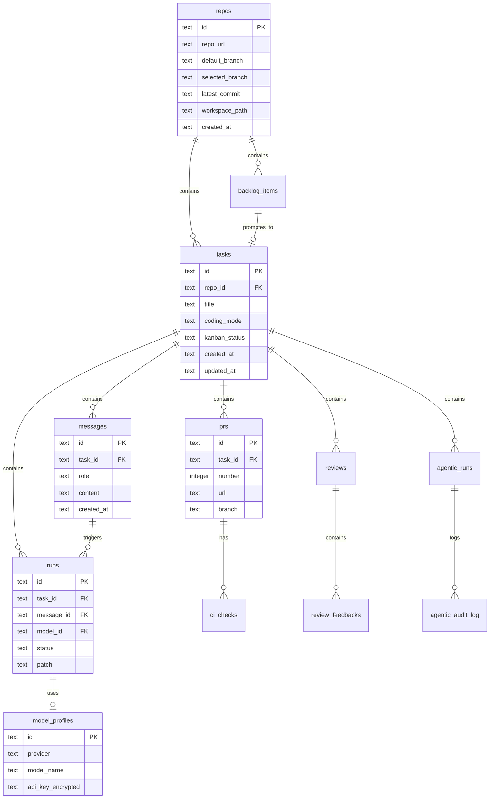

# Database Schema Reference

This document describes the SQLite database schema used by dursor.

## Overview

dursor uses SQLite for data persistence. The database file is located at `data/dursor.db` by default and is created automatically on first startup.

## Entity Relationship Diagram



## Tables

### model_profiles

Stores LLM provider configurations with encrypted API keys.

| Column | Type | Constraints | Description |
|--------|------|-------------|-------------|
| `id` | TEXT | PRIMARY KEY | Unique identifier (UUID) |
| `provider` | TEXT | NOT NULL | Provider name: `openai`, `anthropic`, `google` |
| `model_name` | TEXT | NOT NULL | Model identifier (e.g., `gpt-4o`, `claude-3-opus`) |
| `display_name` | TEXT | | User-friendly display name |
| `api_key_encrypted` | TEXT | NOT NULL | Fernet-encrypted API key |
| `created_at` | TEXT | NOT NULL | ISO 8601 timestamp |

**Indexes:**
- `idx_model_profiles_provider` on `provider`

### repos

Stores information about cloned Git repositories.

| Column | Type | Constraints | Description |
|--------|------|-------------|-------------|
| `id` | TEXT | PRIMARY KEY | Unique identifier (UUID) |
| `repo_url` | TEXT | NOT NULL | Git repository URL |
| `default_branch` | TEXT | NOT NULL | Default branch (e.g., `main`) |
| `selected_branch` | TEXT | | User-selected base branch |
| `latest_commit` | TEXT | NOT NULL | SHA of latest commit |
| `workspace_path` | TEXT | NOT NULL | Filesystem path to clone |
| `created_at` | TEXT | NOT NULL | ISO 8601 timestamp |

**Indexes:**
- `idx_repos_url` on `repo_url`

### tasks

Conversation units representing a single coding goal.

| Column | Type | Constraints | Description |
|--------|------|-------------|-------------|
| `id` | TEXT | PRIMARY KEY | Unique identifier (UUID) |
| `repo_id` | TEXT | NOT NULL, FK | Reference to `repos.id` |
| `title` | TEXT | | Task title |
| `coding_mode` | TEXT | NOT NULL | Mode: `interactive`, `semi_auto`, `full_auto` |
| `kanban_status` | TEXT | NOT NULL | Status: `backlog`, `todo`, `in_progress`, `in_review`, `done`, `archived` |
| `created_at` | TEXT | NOT NULL | ISO 8601 timestamp |
| `updated_at` | TEXT | NOT NULL | ISO 8601 timestamp |

**Indexes:**
- `idx_tasks_repo` on `repo_id`

**Default values:**
- `coding_mode`: `interactive`
- `kanban_status`: `backlog`

### messages

Chat messages within a task conversation.

| Column | Type | Constraints | Description |
|--------|------|-------------|-------------|
| `id` | TEXT | PRIMARY KEY | Unique identifier (UUID) |
| `task_id` | TEXT | NOT NULL, FK | Reference to `tasks.id` |
| `role` | TEXT | NOT NULL | Message role: `user`, `assistant`, `system` |
| `content` | TEXT | NOT NULL | Message content |
| `created_at` | TEXT | NOT NULL | ISO 8601 timestamp |

**Indexes:**
- `idx_messages_task` on `task_id`

### runs

Execution units for LLM-generated code patches.

| Column | Type | Constraints | Description |
|--------|------|-------------|-------------|
| `id` | TEXT | PRIMARY KEY | Unique identifier (UUID) |
| `task_id` | TEXT | NOT NULL, FK | Reference to `tasks.id` |
| `message_id` | TEXT | FK | Reference to triggering `messages.id` |
| `model_id` | TEXT | | Reference to `model_profiles.id` (optional for CLI executors) |
| `model_name` | TEXT | | Denormalized model name |
| `provider` | TEXT | | Denormalized provider name |
| `executor_type` | TEXT | NOT NULL | Executor: `patch_agent`, `claude_code`, `codex`, `gemini` |
| `working_branch` | TEXT | | Git branch for worktree |
| `worktree_path` | TEXT | | Filesystem path to worktree |
| `session_id` | TEXT | | CLI session ID for conversation persistence |
| `instruction` | TEXT | NOT NULL | User instruction |
| `base_ref` | TEXT | | Base Git reference |
| `commit_sha` | TEXT | | Latest commit SHA |
| `status` | TEXT | NOT NULL | Status: `queued`, `running`, `succeeded`, `failed`, `canceled` |
| `summary` | TEXT | | Human-readable summary |
| `patch` | TEXT | | Unified diff output |
| `files_changed` | TEXT | | JSON array of `FileDiff` objects |
| `logs` | TEXT | | JSON array of log strings |
| `warnings` | TEXT | | JSON array of warning strings |
| `error` | TEXT | | Error message if failed |
| `created_at` | TEXT | NOT NULL | ISO 8601 timestamp |
| `started_at` | TEXT | | ISO 8601 timestamp |
| `completed_at` | TEXT | | ISO 8601 timestamp |

**Indexes:**
- `idx_runs_task` on `task_id`
- `idx_runs_message` on `message_id`
- `idx_runs_model` on `model_id`
- `idx_runs_status` on `status`

**Default values:**
- `executor_type`: `patch_agent`
- `status`: `queued`

### prs

Pull requests created from runs.

| Column | Type | Constraints | Description |
|--------|------|-------------|-------------|
| `id` | TEXT | PRIMARY KEY | Unique identifier (UUID) |
| `task_id` | TEXT | NOT NULL, FK | Reference to `tasks.id` |
| `number` | INTEGER | NOT NULL | GitHub PR number |
| `url` | TEXT | NOT NULL | GitHub PR URL |
| `branch` | TEXT | NOT NULL | Source branch name |
| `title` | TEXT | NOT NULL | PR title |
| `body` | TEXT | | PR description |
| `latest_commit` | TEXT | NOT NULL | SHA of latest commit |
| `status` | TEXT | NOT NULL | Status: `open`, `closed`, `merged` |
| `created_at` | TEXT | NOT NULL | ISO 8601 timestamp |
| `updated_at` | TEXT | NOT NULL | ISO 8601 timestamp |

**Indexes:**
- `idx_prs_task` on `task_id`

**Default values:**
- `status`: `open`

### github_app_config

Singleton table storing GitHub App configuration.

| Column | Type | Constraints | Description |
|--------|------|-------------|-------------|
| `id` | INTEGER | PRIMARY KEY, CHECK (id = 1) | Singleton constraint |
| `app_id` | TEXT | NOT NULL | GitHub App ID |
| `private_key` | TEXT | NOT NULL | Base64-encoded private key |
| `installation_id` | TEXT | NOT NULL | Installation ID |
| `created_at` | TEXT | NOT NULL | ISO 8601 timestamp |
| `updated_at` | TEXT | NOT NULL | ISO 8601 timestamp |

### user_preferences

Singleton table for default user settings.

| Column | Type | Constraints | Description |
|--------|------|-------------|-------------|
| `id` | INTEGER | PRIMARY KEY, CHECK (id = 1) | Singleton constraint |
| `default_repo_owner` | TEXT | | Default repository owner |
| `default_repo_name` | TEXT | | Default repository name |
| `default_branch` | TEXT | | Default branch |
| `default_branch_prefix` | TEXT | | Branch prefix (e.g., `dursor`) |
| `default_pr_creation_mode` | TEXT | | PR mode: `create` or `link` |
| `default_coding_mode` | TEXT | | Coding mode: `interactive`, `semi_auto`, `full_auto` |
| `auto_generate_pr_description` | INTEGER | | Auto-generate PR description: 0=no, 1=yes |
| `update_pr_title_on_regenerate` | INTEGER | | Update PR title on regenerate: 0=no, 1=yes |
| `worktrees_dir` | TEXT | | Custom worktrees directory |
| `created_at` | TEXT | NOT NULL | ISO 8601 timestamp |
| `updated_at` | TEXT | NOT NULL | ISO 8601 timestamp |

**Default values:**
- `auto_generate_pr_description`: 0
- `update_pr_title_on_regenerate`: 1

### backlog_items

Feature-level task items from task breakdown.

| Column | Type | Constraints | Description |
|--------|------|-------------|-------------|
| `id` | TEXT | PRIMARY KEY | Unique identifier (UUID) |
| `repo_id` | TEXT | NOT NULL, FK | Reference to `repos.id` |
| `title` | TEXT | NOT NULL | Item title |
| `description` | TEXT | NOT NULL | Item description |
| `type` | TEXT | NOT NULL | Type: `feature`, `bug_fix`, `refactoring`, `docs`, `test` |
| `estimated_size` | TEXT | NOT NULL | Size: `small`, `medium`, `large` |
| `target_files` | TEXT | NOT NULL | JSON array of target files |
| `implementation_hint` | TEXT | | Implementation guidance |
| `tags` | TEXT | NOT NULL | JSON array of tags |
| `subtasks` | TEXT | NOT NULL | JSON array of subtasks |
| `task_id` | TEXT | FK | Reference to `tasks.id` if promoted |
| `created_at` | TEXT | NOT NULL | ISO 8601 timestamp |
| `updated_at` | TEXT | NOT NULL | ISO 8601 timestamp |

**Indexes:**
- `idx_backlog_items_repo_id` on `repo_id`

**Default values:**
- `description`: `''`
- `type`: `feature`
- `estimated_size`: `medium`
- `target_files`, `tags`, `subtasks`: `'[]'`

### reviews

Code review records.

| Column | Type | Constraints | Description |
|--------|------|-------------|-------------|
| `id` | TEXT | PRIMARY KEY | Unique identifier (UUID) |
| `task_id` | TEXT | NOT NULL, FK | Reference to `tasks.id` |
| `target_run_ids` | TEXT | NOT NULL | JSON array of run IDs being reviewed |
| `executor_type` | TEXT | NOT NULL | Executor used for review |
| `model_id` | TEXT | | Model ID if using LLM |
| `model_name` | TEXT | | Model name |
| `status` | TEXT | NOT NULL | Status: `queued`, `running`, `succeeded`, `failed` |
| `overall_summary` | TEXT | | Summary of review findings |
| `overall_score` | REAL | | Numeric review score |
| `logs` | TEXT | | JSON array of log entries |
| `error` | TEXT | | Error message if failed |
| `created_at` | TEXT | NOT NULL | ISO 8601 timestamp |
| `started_at` | TEXT | | ISO 8601 timestamp |
| `completed_at` | TEXT | | ISO 8601 timestamp |

**Indexes:**
- `idx_reviews_task` on `task_id`
- `idx_reviews_status` on `status`

**Default values:**
- `status`: `queued`

### review_feedbacks

Individual feedback items from reviews.

| Column | Type | Constraints | Description |
|--------|------|-------------|-------------|
| `id` | TEXT | PRIMARY KEY | Unique identifier (UUID) |
| `review_id` | TEXT | NOT NULL, FK | Reference to `reviews.id` |
| `file_path` | TEXT | NOT NULL | File being reviewed |
| `line_start` | INTEGER | | Starting line number |
| `line_end` | INTEGER | | Ending line number |
| `severity` | TEXT | NOT NULL | Severity: `info`, `warning`, `error`, `critical` |
| `category` | TEXT | NOT NULL | Category: `bug`, `security`, `performance`, `style`, `maintainability` |
| `title` | TEXT | NOT NULL | Feedback title |
| `description` | TEXT | NOT NULL | Detailed description |
| `suggestion` | TEXT | | Suggested fix |
| `code_snippet` | TEXT | | Relevant code snippet |

**Indexes:**
- `idx_feedbacks_review` on `review_id`
- `idx_feedbacks_severity` on `severity`

### agentic_runs

Agentic execution tracking for automated workflows.

| Column | Type | Constraints | Description |
|--------|------|-------------|-------------|
| `id` | TEXT | PRIMARY KEY | Unique identifier (UUID) |
| `task_id` | TEXT | NOT NULL, FK | Reference to `tasks.id` |
| `mode` | TEXT | NOT NULL | Mode: `interactive`, `semi_auto`, `full_auto` |
| `phase` | TEXT | NOT NULL | Phase: `coding`, `waiting_ci`, `reviewing`, etc. |
| `iteration` | INTEGER | NOT NULL | Total iteration count |
| `ci_iterations` | INTEGER | NOT NULL | CI fix iteration count |
| `review_iterations` | INTEGER | NOT NULL | Review fix iteration count |
| `started_at` | TEXT | NOT NULL | ISO 8601 timestamp |
| `last_activity` | TEXT | NOT NULL | ISO 8601 timestamp |
| `pr_number` | INTEGER | | Associated PR number |
| `current_sha` | TEXT | | Current commit SHA |
| `last_ci_result` | TEXT | | JSON CI result |
| `last_review_score` | REAL | | Last review score |
| `error` | TEXT | | Error message |
| `human_approved` | INTEGER | NOT NULL | Approval flag: 0=false, 1=true |

**Indexes:**
- `idx_agentic_runs_task` on `task_id`
- `idx_agentic_runs_phase` on `phase`

**Default values:**
- `iteration`, `ci_iterations`, `review_iterations`: 0
- `human_approved`: 0

### agentic_audit_log

Audit log for agentic execution (compliance and debugging).

| Column | Type | Constraints | Description |
|--------|------|-------------|-------------|
| `id` | TEXT | PRIMARY KEY | Unique identifier (UUID) |
| `task_id` | TEXT | NOT NULL, FK | Reference to `tasks.id` |
| `agentic_run_id` | TEXT | NOT NULL, FK | Reference to `agentic_runs.id` |
| `timestamp` | TEXT | NOT NULL | ISO 8601 timestamp |
| `phase` | TEXT | NOT NULL | Execution phase |
| `action` | TEXT | NOT NULL | Action performed |
| `agent` | TEXT | | Agent: `claude_code`, `codex`, `system` |
| `input_summary` | TEXT | | Summary of input |
| `output_summary` | TEXT | | Summary of output |
| `duration_ms` | INTEGER | | Execution duration in milliseconds |
| `success` | INTEGER | | Success flag: 0=false, 1=true |
| `error` | TEXT | | Error message |

**Indexes:**
- `idx_agentic_audit_task` on `task_id`
- `idx_agentic_audit_run` on `agentic_run_id`
- `idx_agentic_audit_timestamp` on `timestamp`

### ci_checks

CI/CD status check records.

| Column | Type | Constraints | Description |
|--------|------|-------------|-------------|
| `id` | TEXT | PRIMARY KEY | Unique identifier (UUID) |
| `task_id` | TEXT | NOT NULL, FK | Reference to `tasks.id` |
| `pr_id` | TEXT | NOT NULL, FK | Reference to `prs.id` |
| `status` | TEXT | NOT NULL | Status: `pending`, `success`, `failure`, `error` |
| `workflow_run_id` | INTEGER | | GitHub workflow run ID |
| `sha` | TEXT | | Commit SHA |
| `jobs` | TEXT | | JSON: job_name -> result |
| `failed_jobs` | TEXT | | JSON: list of failed job results |
| `created_at` | TEXT | NOT NULL | ISO 8601 timestamp |
| `updated_at` | TEXT | NOT NULL | ISO 8601 timestamp |

**Indexes:**
- `idx_ci_checks_task_id` on `task_id`
- `idx_ci_checks_pr_id` on `pr_id`

## Data Types

### JSON Fields

Several columns store JSON-encoded data:

- `files_changed`: Array of `FileDiff` objects
- `logs`, `warnings`: Arrays of strings
- `target_files`, `tags`, `subtasks`: Arrays
- `jobs`, `failed_jobs`: CI job results

### Timestamps

All timestamps are stored as TEXT in ISO 8601 format (SQLite `datetime('now')`).

### Boolean Values

SQLite doesn't have a native boolean type. Use INTEGER with 0=false, 1=true.

## Schema Migrations

The schema is defined in `apps/api/src/dursor_api/storage/schema.sql` and is applied automatically on startup.

For schema changes:
1. Update `schema.sql` with new tables/columns
2. Add migration logic in `db.py` if needed
3. Existing data may need manual migration

## Direct Database Access

For debugging or maintenance:
```bash
sqlite3 data/dursor.db

# Common queries
.tables                           -- List all tables
.schema runs                      -- Show table schema
SELECT * FROM tasks LIMIT 10;    -- Query data
.quit                            -- Exit
```
