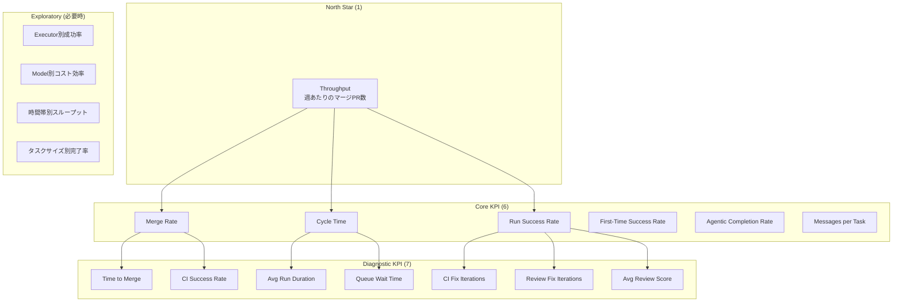

# Development Metrics Specification

開発体験・開発生産性を向上させるためのメトリクス機能の設計仕様書。

## Overview

tazunaにおけるAIエージェント活用の効果測定と開発プロセスの可視化を目的としたメトリクス機能を提供する。

### Goals

1. **効果測定**: AIエージェントの活用効果を定量的に把握
2. **ボトルネック発見**: 開発プロセスの課題を可視化
3. **改善サイクル**: データに基づく継続的改善を支援

## Metrics Hierarchy

メトリクスを4階層に分類し、目的に応じた適切な活用を促進する。

| レイヤ | KPI数の目安 | 役割 |
|--------|------------|------|
| **North Star** | 1 | 価値の定義 |
| **Core KPI** | 5〜8 | 改善の意思決定 |
| **Diagnostic KPI** | 5〜10 | 原因分析 |
| **Exploratory** | 必要時 | 仮説検証 |



### North Star（最重要）- 1指標

プロダクト全体の成功を定義する最も重要な指標。

| Metric | Definition | Target | Why |
|--------|------------|--------|-----|
| **Throughput** | 週あたりにMergeされたPR数 | 継続的な向上 | AIエージェント活用の最終的な成果を表す |

> **選定理由**: tazunaの価値は「AIエージェントによる開発生産性向上」であり、実際にMergeされたPR数がその成果を最も直接的に表す。品質を伴わないスループットは意味がないため、Merge Rate や Review Score と併せて監視する。

### Core KPI（常時監視）- 6指標

日常的に監視し、改善施策の意思決定に使用する指標。

| # | Metric | Definition | Good Direction | UI表示位置 |
|---|--------|------------|----------------|-----------|
| 1 | **Merge Rate** | PRがMergeに至る割合 | ↑ Higher | ダッシュボード上部 |
| 2 | **Cycle Time** | Task作成からPRマージまでの時間 | ↓ Lower | ダッシュボード上部 |
| 3 | **Run Success Rate** | AIエージェント実行の成功率 | ↑ Higher | ダッシュボード上部 |
| 4 | **First-Time Success Rate** | 1回のRunで成功したTaskの割合 | ↑ Higher | Productivity |
| 5 | **Agentic Completion Rate** | Full/Semi Auto モードの完了率 | ↑ Higher | Agentic |
| 6 | **Messages per Task** | Task毎の平均メッセージ数 | ↓ Lower | Conversation |

**アラート閾値（推奨）**:

| Metric | Warning | Critical |
|--------|---------|----------|
| Merge Rate | < 60% | < 40% |
| Run Success Rate | < 75% | < 50% |
| Cycle Time | > 12h | > 24h |
| First-Time Success | < 30% | < 15% |

### Diagnostic KPI（原因分析）- 7指標

Core KPIの変動原因を特定するための補助指標。異常検知時にドリルダウンして確認する。

| # | Metric | 関連Core KPI | 分析用途 |
|---|--------|-------------|---------|
| 1 | **Time to Merge** | Merge Rate, Cycle Time | マージまでの時間ボトルネック特定 |
| 2 | **CI Success Rate** | Run Success Rate | CI起因の失敗割合の把握 |
| 3 | **Avg Run Duration** | Cycle Time | 実行時間のボトルネック特定 |
| 4 | **CI Fix Iterations** | Run Success Rate | CI修正の手戻り回数 |
| 5 | **Review Fix Iterations** | Run Success Rate | レビュー指摘による手戻り回数 |
| 6 | **Avg Review Score** | Merge Rate | コード品質の傾向把握 |
| 7 | **Queue Wait Time** | Cycle Time | キュー待ちによる遅延の把握 |

**ドリルダウン例**:

```
問題: Run Success Rate が 70% → 55% に低下

調査フロー:
1. CI Success Rate 確認 → 60% に低下（CI起因の可能性）
2. CI Fix Iterations 確認 → 平均 3.2 回（通常 1.5 回）
3. 失敗CI詳細確認 → 特定のテストスイートが頻繁に失敗
4. 原因特定: 新しく追加されたE2Eテストが不安定

アクション: E2Eテストの安定化対応
```

### Exploratory（一時的調査）- 必要時

特定の仮説検証や一時的な調査に使用する指標。常時監視はせず、必要時にオンデマンドで取得・分析する。

| Metric | 調査目的 | 取得タイミング |
|--------|---------|--------------|
| **Executor別成功率** | どのExecutorが最も効果的か | Executor選定・比較時 |
| **Model別コスト効率** | コスト対効果の比較 | モデル選定・コスト最適化時 |
| **時間帯別スループット** | 最適な実行タイミング | 運用最適化時 |
| **タスクサイズ別完了率** | タスク粒度の最適化 | プロセス改善時 |
| **ファイル変更数別成功率** | 適切な変更範囲の特定 | 品質改善時 |
| **Critical Issue発生率** | セキュリティ/品質リスク | 品質監査時 |
| **リポジトリ別傾向** | リポジトリ特性の把握 | 新規リポジトリ導入時 |

### Hierarchy Summary

```
┌─────────────────────────────────────────────────────────────────┐
│                    North Star (価値の定義)                       │
│                         Throughput                               │
│                    "週あたりのマージPR数"                        │
├─────────────────────────────────────────────────────────────────┤
│                   Core KPI (改善の意思決定)                      │
│  ┌──────────┐ ┌──────────┐ ┌──────────┐ ┌──────────────────┐   │
│  │Merge Rate│ │Cycle Time│ │Run Success│ │First-Time Success│   │
│  └──────────┘ └──────────┘ └──────────┘ └──────────────────┘   │
│  ┌────────────────────┐ ┌──────────────────┐                    │
│  │Agentic Completion  │ │Messages per Task │                    │
│  └────────────────────┘ └──────────────────┘                    │
├─────────────────────────────────────────────────────────────────┤
│                  Diagnostic KPI (原因分析)                       │
│  Time to Merge │ CI Success Rate │ Avg Run Duration              │
│  CI Fix Iters  │ Review Fix Iters │ Avg Review Score             │
│  Queue Wait Time                                                 │
├─────────────────────────────────────────────────────────────────┤
│                   Exploratory (仮説検証)                         │
│  Executor別成功率 │ Model別コスト効率 │ 時間帯別スループット     │
│  タスクサイズ別完了率 │ ファイル変更数別成功率 │ etc.            │
└─────────────────────────────────────────────────────────────────┘
```

## Metrics Categories

### 1. PR Metrics（PRメトリクス）

PRのライフサイクルに関するメトリクス。

| Metric | Description | Calculation |
|--------|-------------|-------------|
| **Merge Rate** | PRがMergeに至る割合 | `merged_prs / total_prs * 100` |
| **Time to Merge** | PR作成からMergeまでの時間 | `pr.updated_at(status=merged) - pr.created_at` |
| **Time to First Commit** | Task作成から最初のコミットまでの時間 | `first_run.completed_at - task.created_at` |
| **PR Status Distribution** | Open/Merged/Closedの分布 | Status別のPR数 |
| **PRs per Task** | Task毎のPR数 | `total_prs / total_tasks` |


### 2. Conversation Metrics（会話メトリクス）

ユーザーとAIエージェント間のインタラクションに関するメトリクス。

| Metric | Description | Calculation |
|--------|-------------|-------------|
| **Messages per Task** | Task毎の平均メッセージ数 | `total_messages / total_tasks` |
| **User Messages per Task** | ユーザーメッセージ数 | role=userのメッセージ数 |
| **Iterations to Success** | 成功までの修正回数 | Run作成回数（同一Task内） |
| **Conversation Depth** | 会話の深さ（ラウンドトリップ数） | `user_messages + assistant_messages / 2` |

### 3. Run Metrics（実行メトリクス）

AIエージェントの実行に関するメトリクス。

| Metric | Description | Calculation |
|--------|-------------|-------------|
| **Run Success Rate** | 実行成功率 | `succeeded_runs / total_runs * 100` |
| **Average Run Duration** | 平均実行時間 | `avg(completed_at - started_at)` |
| **Runs per Task** | Task毎の平均Run数 | `total_runs / total_tasks` |
| **Executor Distribution** | Executor別の使用分布 | executor_type別のRun数 |
| **Model Distribution** | Model別の使用分布 | model_name別のRun数 |
| **Queue Wait Time** | キュー待ち時間 | `started_at - created_at` |


### 4. CI/CD Metrics（CI/CDメトリクス）

CIチェックに関するメトリクス。

| Metric | Description | Calculation |
|--------|-------------|-------------|
| **CI Success Rate** | CI成功率 | `success_checks / total_checks * 100` |
| **Average CI Duration** | CI平均時間 | `avg(updated_at - created_at)` |
| **CI Failure Distribution** | 失敗原因の分布 | failed_jobs別のカウント |
| **CI Fix Iterations** | CI修正に必要な反復数 | `agentic_runs.ci_iterations` |

### 5. Review Metrics（レビューメトリクス）

コードレビューに関するメトリクス。

| Metric | Description | Calculation |
|--------|-------------|-------------|
| **Average Review Score** | 平均レビュースコア | `avg(overall_score)` |
| **Review Issue Distribution** | 重大度別の指摘分布 | severity別のfeedback数 |
| **Category Distribution** | カテゴリ別の指摘分布 | category別のfeedback数 |
| **Review Fix Iterations** | レビュー修正反復数 | `agentic_runs.review_iterations` |
| **Time to Review** | レビュー完了時間 | `review.completed_at - review.started_at` |

### 6. Agentic Execution Metrics（Agentic実行メトリクス）

Full Auto / Semi Auto モードの実行に関するメトリクス。

| Metric | Description | Calculation |
|--------|-------------|-------------|
| **Auto Completion Rate** | 自動完了率 | `completed_agentic / total_agentic * 100` |
| **Average Total Iterations** | 平均総反復数 | `avg(iteration)` |
| **Phase Duration** | フェーズ毎の滞在時間 | audit_log集計 |
| **Human Intervention Rate** | 人間介入率 | Semi Autoでの介入割合 |
| **Escalation Rate** | エスカレーション発生率 | 警告発生の割合 |


### 7. Productivity Metrics（生産性メトリクス）

全体的な生産性に関する統合メトリクス。

| Metric | Description | Calculation |
|--------|-------------|-------------|
| **Cycle Time** | Task作成からPRマージまでの時間 | `merged_at - task.created_at` |
| **Lead Time** | Backlogからマージまでの時間 | `merged_at - backlog.created_at` |
| **Throughput** | 期間あたりのマージPR数 | `merged_prs / period` |
| **Active Task Ratio** | アクティブタスクの割合 | `in_progress_tasks / total_tasks` |
| **Automation Efficiency** | 自動化効率 | `auto_runs / total_runs` |
| **First Time Success Rate** | 一発成功率 | `tasks_with_1_run / total_tasks` |

### 8. Repository Metrics（リポジトリメトリクス）

リポジトリ別のメトリクス。

| Metric | Description | Calculation |
|--------|-------------|-------------|
| **Tasks per Repo** | リポジトリ毎のタスク数 | repo_id別のTask数 |
| **Active Repos** | アクティブリポジトリ数 | 直近N日以内にRunがあるrepo数 |
| **Files Changed per PR** | PR毎の変更ファイル数 | `avg(files_changed.length)` |
| **Lines Changed per PR** | PR毎の変更行数 | `avg(added_lines + removed_lines)` |

## Data Model

### MetricsSnapshot

定期的に集計されるメトリクスのスナップショット。

```python
class MetricsSnapshot(BaseModel):
    """Point-in-time metrics snapshot."""

    id: str
    period_start: datetime
    period_end: datetime

    # PR Metrics
    total_prs: int
    merged_prs: int
    closed_prs: int
    merge_rate: float
    avg_time_to_merge_hours: float | None

    # Conversation Metrics
    total_messages: int
    avg_messages_per_task: float
    avg_user_messages_per_task: float

    # Run Metrics
    total_runs: int
    succeeded_runs: int
    failed_runs: int
    run_success_rate: float
    avg_run_duration_seconds: float | None

    # CI Metrics
    total_ci_checks: int
    ci_success_rate: float
    avg_ci_fix_iterations: float

    # Review Metrics
    total_reviews: int
    avg_review_score: float | None

    # Agentic Metrics
    total_agentic_runs: int
    agentic_completion_rate: float
    avg_total_iterations: float

    # Productivity Metrics
    avg_cycle_time_hours: float | None
    throughput_per_week: float
    first_time_success_rate: float

    created_at: datetime
```

### MetricsTrend

時系列でのトレンド分析用データ。

```python
class MetricsTrend(BaseModel):
    """Metrics trend over time."""

    metric_name: str
    data_points: list[MetricsDataPoint]
    trend: str  # "up", "down", "stable"
    change_percentage: float

class MetricsDataPoint(BaseModel):
    """Single data point in a trend."""

    timestamp: datetime
    value: float
```

## API Design

### Endpoints

```
# メトリクス概要
GET /v1/metrics/summary
    Query params:
      - repo_id: str | None (filter by repo)
      - period: str = "7d" (1d, 7d, 30d, 90d, all)
    Response: MetricsSummary

# PR メトリクス
GET /v1/metrics/prs
    Query params:
      - repo_id: str | None
      - period: str = "30d"
    Response: PRMetrics

# Run メトリクス
GET /v1/metrics/runs
    Query params:
      - repo_id: str | None
      - executor_type: str | None
      - period: str = "30d"
    Response: RunMetrics

# トレンド分析
GET /v1/metrics/trends
    Query params:
      - metrics: list[str] (metric names to include)
      - period: str = "30d"
      - granularity: str = "day" (hour, day, week)
    Response: list[MetricsTrend]

# リアルタイム統計
GET /v1/metrics/realtime
    Response: RealtimeMetrics (current state)

# リポジトリ別メトリクス
GET /v1/metrics/repos/{repo_id}
    Query params:
      - period: str = "30d"
    Response: RepoMetrics

# エクスポート
GET /v1/metrics/export
    Query params:
      - format: str = "json" (json, csv)
      - period: str = "30d"
    Response: file download
```

### Response Models

```python
class MetricsSummary(BaseModel):
    """Aggregated metrics summary."""

    period: str
    period_start: datetime
    period_end: datetime

    # Headline metrics
    merge_rate: float
    avg_cycle_time_hours: float | None
    throughput: float
    run_success_rate: float

    # Counts
    total_tasks: int
    total_prs: int
    total_runs: int
    total_messages: int

    # Comparisons (vs previous period)
    merge_rate_change: float | None
    cycle_time_change: float | None
    throughput_change: float | None

class RealtimeMetrics(BaseModel):
    """Current system state metrics."""

    active_tasks: int
    running_runs: int
    pending_ci_checks: int
    open_prs: int

    # Today's stats
    tasks_created_today: int
    runs_completed_today: int
    prs_merged_today: int
```

## UI Components

### Metrics Dashboard

```
┌─────────────────────────────────────────────────────────────────┐
│ Development Metrics                              Period: [30d ▼]│
├─────────────────────────────────────────────────────────────────┤
│                                                                 │
│  ┌─────────────┐  ┌─────────────┐  ┌─────────────┐  ┌─────────┐│
│  │ Merge Rate  │  │ Cycle Time  │  │ Throughput  │  │ Success ││
│  │    75%      │  │   4.2h      │  │  12 PRs/wk  │  │   82%   ││
│  │   ▲ +5%     │  │   ▼ -1.5h   │  │   ▲ +3      │  │  ▲ +2%  ││
│  └─────────────┘  └─────────────┘  └─────────────┘  └─────────┘│
│                                                                 │
│  ┌─────────────────────────────────────────────────────────────┐│
│  │ Merge Rate Trend                                            ││
│  │ 100%┤                                                       ││
│  │  75%┤    ╭─────╮         ╭──────╮                          ││
│  │  50%┤────╯     ╰─────────╯      ╰──────────                ││
│  │  25%┤                                                       ││
│  │   0%├─────┬─────┬─────┬─────┬─────┬─────┬─────┐            ││
│  │     Mon   Tue   Wed   Thu   Fri   Sat   Sun                ││
│  └─────────────────────────────────────────────────────────────┘│
│                                                                 │
│  ┌──────────────────────────┐ ┌────────────────────────────────┐│
│  │ Run Status Distribution  │ │ Messages per Task              ││
│  │ ██████████░░ 82% Success │ │ ████████░░░░ 4.2 avg           ││
│  │ ██░░░░░░░░░░ 12% Failed  │ │ Min: 1  Max: 15  Median: 3     ││
│  │ █░░░░░░░░░░░  6% Other   │ │                                ││
│  └──────────────────────────┘ └────────────────────────────────┘│
│                                                                 │
└─────────────────────────────────────────────────────────────────┘
```

### Widget Components

```typescript
// Headline metric card
interface MetricCard {
  title: string;
  value: string | number;
  unit?: string;
  change?: number;  // vs previous period
  trend?: "up" | "down" | "stable";
  sparkline?: number[];  // mini trend line
}

// Distribution chart
interface DistributionChart {
  type: "pie" | "bar" | "horizontal-bar";
  data: { label: string; value: number; color?: string }[];
}

// Time series chart
interface TimeSeriesChart {
  type: "line" | "area" | "bar";
  series: {
    name: string;
    data: { x: Date; y: number }[];
  }[];
  granularity: "hour" | "day" | "week";
}
```

## Database Schema Changes

### New Tables

```sql
-- Metrics snapshots (periodic aggregation)
CREATE TABLE IF NOT EXISTS metrics_snapshots (
    id TEXT PRIMARY KEY,
    period_start TEXT NOT NULL,
    period_end TEXT NOT NULL,
    repo_id TEXT,  -- NULL for global metrics

    -- PR metrics
    total_prs INTEGER NOT NULL DEFAULT 0,
    merged_prs INTEGER NOT NULL DEFAULT 0,
    closed_prs INTEGER NOT NULL DEFAULT 0,
    avg_time_to_merge_seconds INTEGER,

    -- Run metrics
    total_runs INTEGER NOT NULL DEFAULT 0,
    succeeded_runs INTEGER NOT NULL DEFAULT 0,
    failed_runs INTEGER NOT NULL DEFAULT 0,
    avg_run_duration_seconds INTEGER,

    -- Message metrics
    total_messages INTEGER NOT NULL DEFAULT 0,
    user_messages INTEGER NOT NULL DEFAULT 0,

    -- CI metrics
    total_ci_checks INTEGER NOT NULL DEFAULT 0,
    passed_ci_checks INTEGER NOT NULL DEFAULT 0,

    -- Review metrics
    total_reviews INTEGER NOT NULL DEFAULT 0,
    avg_review_score REAL,

    -- Agentic metrics
    total_agentic_runs INTEGER NOT NULL DEFAULT 0,
    completed_agentic_runs INTEGER NOT NULL DEFAULT 0,
    avg_iterations REAL,

    created_at TEXT NOT NULL DEFAULT (datetime('now')),

    FOREIGN KEY (repo_id) REFERENCES repos(id)
);

CREATE INDEX IF NOT EXISTS idx_metrics_snapshots_period
    ON metrics_snapshots(period_start, period_end);
CREATE INDEX IF NOT EXISTS idx_metrics_snapshots_repo
    ON metrics_snapshots(repo_id);
```

### Existing Tables Updates

PRテーブルに`merged_at`カラムを追加することを推奨：

```sql
-- Migration: Add merged_at to prs table
ALTER TABLE prs ADD COLUMN merged_at TEXT;
```

## Implementation Plan

### Phase 1: Data Collection Infrastructure

1. **Existing Data Utilization**
   - 既存テーブル（tasks, runs, prs, messages, reviews, agentic_runs）からの集計
   - created_at, started_at, completed_at, updated_at を活用

2. **MetricsService Implementation**
   - Real-time metrics calculation
   - Periodic snapshot generation (hourly/daily)

### Phase 2: API Implementation

1. **MetricsRouter**
   - `/v1/metrics/*` エンドポイント実装
   - クエリパラメータによるフィルタリング

2. **MetricsDAO**
   - スナップショットの保存・取得
   - 集計クエリの実装

### Phase 3: Frontend Dashboard

1. **MetricsDashboard Component**
   - 主要メトリクスカード
   - トレンドチャート

2. **Chart Integration**
   - Recharts or Chart.js integration
   - Interactive tooltips and drill-down

### Phase 4: Advanced Features

1. **Alerts & Notifications**
   - メトリクス閾値アラート
   - 異常検知

2. **Export & Reporting**
   - CSV/JSON エクスポート
   - 定期レポート生成

## Performance Considerations

### Aggregation Strategy

- **Real-time**: 小規模データセット（<1000レコード）は都度計算
- **Cached**: 中規模データセット（1000-10000）は短期キャッシュ（5分）
- **Snapshot**: 大規模データセットは定期スナップショット（hourly/daily）

### Query Optimization

```sql
-- Efficient metrics query example
SELECT
    COUNT(*) as total_prs,
    SUM(CASE WHEN status = 'merged' THEN 1 ELSE 0 END) as merged_prs,
    AVG(
        CASE WHEN status = 'merged'
        THEN (julianday(updated_at) - julianday(created_at)) * 24 * 60
        END
    ) as avg_time_to_merge_minutes
FROM prs
WHERE created_at >= datetime('now', '-30 days');
```

## Security & Privacy

- メトリクスデータはプロジェクト内部での利用のみ
- ユーザー識別情報は集計データには含めない
- APIキーやトークンはメトリクスに含めない

## Future Enhancements

1. **Comparative Analysis**
   - モデル間のパフォーマンス比較
   - Executor間の比較

2. **Predictive Metrics**
   - 完了時間の予測
   - 成功確率の予測

3. **Custom Metrics**
   - ユーザー定義メトリクス
   - カスタムダッシュボード

4. **Team Metrics**（Multi-user版）
   - ユーザー別生産性
   - チーム全体のトレンド

5. **Cost Metrics**
   - API呼び出しコスト
   - トークン使用量
   - コスト効率（cost per merged PR）

## Appendix

### Metric Definitions Glossary

| Term | Definition |
|------|------------|
| Cycle Time | Task作成からPRがMergeされるまでの経過時間 |
| Lead Time | Backlogに追加されてからMergeされるまでの経過時間 |
| Throughput | 単位時間あたりにMergeされたPR数 |
| First Time Success Rate | 1回のRun実行で成功したTaskの割合 |
| Merge Rate | 作成されたPRのうちMergeに至った割合 |
| Automation Efficiency | 全Run中、Full Auto/Semi Autoで実行された割合 |

### Related Documents

- [Architecture](./architecture.md)
- [API Reference](./api.md)
- [Kanban Design](./kanban.md)
- [Agentic Execution](./agentic-dursor.md)
