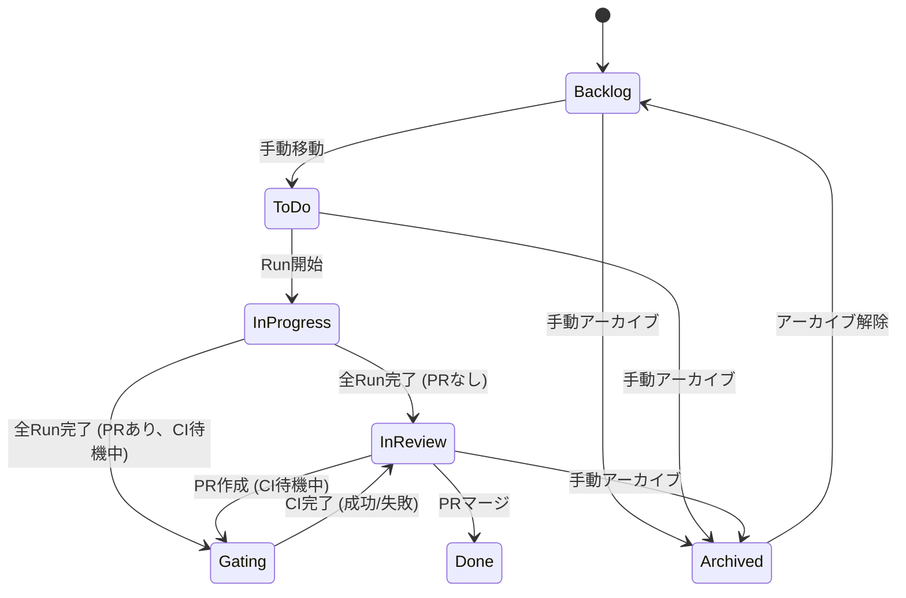

# Gating ステータス設計

## 概要

「Gating」ステータスは、PR作成/更新後にCI完了を待機しているタスクを表す新しいKanbanステータスです。このステータスにより、CIパイプラインでブロックされているタスクを追跡できます。

## ステータスフロー



**注意**: Gating → Done への直接遷移はありません。CI完了後は必ず InReview に戻り、そこからマージして Done になります。

## 具体的なシナリオ

### シナリオ1: PRなしでAI実行完了

```
InProgress → InReview
```

PRが開いていない状態でAIが実行完了した場合、タスクは InReview に移動します。

### シナリオ2: PR作成後、AI実行完了

```
InProgress → Gating (CI待機中) → InReview
```

PRが既に開いている状態でAIが実行完了すると：
1. 全Runが完了
2. PRがオープンでCIがpending → **Gating** に移動
3. 「Check CI」でCI完了を確認 → **InReview** に移動

### シナリオ3: AI実行完了後、PR作成

```
InProgress → InReview → Gating (CI待機中) → InReview
```

PRがない状態でAIが実行完了し、その後PRを作成：
1. 全Runが完了 → **InReview** に移動
2. PR作成（CIが開始） → **Gating** に移動
3. 「Check CI」でCI完了を確認 → **InReview** に移動

### シナリオ4: PR更新（追加コミット後）

```
InReview → InProgress → Gating (CI待機中) → InReview
```

既存PRに対して追加のAI実行を行った場合：
1. InReview状態から新しいRunを開始 → **InProgress** に移動
2. 全Runが完了、PRがオープンでCIがpending → **Gating** に移動
3. 「Check CI」でCI完了を確認 → **InReview** に移動

## ステータス計算の優先順位

Kanbanステータスは以下の優先順位で動的に計算されます：

1. **Archived** (最高) - ユーザーが明示的にアーカイブしたタスク
2. **Done** - PRがマージ済み
3. **In Progress** - 実行中のRunがある
4. **Gating** - 全Run完了 かつ PRがオープン かつ CIがpending/null かつ `enable_gating_status` が有効
5. **In Review** - 全てのRunが完了
6. **Base Status** (最低) - DB保存のステータス (Backlog/ToDo)

## 設定

### Gatingステータスの有効化

Gatingステータスは**デフォルトで無効**です。以下から有効化できます：

**Settings > Defaults > Enable Gating status**

有効時：
- オープンなPRとpending状態のCIを持つタスクが「Gating」列に表示される
- 「Check CI」でCIステータスを確認し、タスクの状態を更新

無効時：
- Gating列はKanbanボードに表示されない
- タスクはCI状態に関係なく InReview に留まる

## データベーススキーマ

### user_preferences テーブル

```sql
enable_gating_status INTEGER DEFAULT 0  -- 0=無効, 1=有効
```

## バックエンド実装

### 変更ファイル

| ファイル | 変更内容 |
|---------|---------|
| `domain/enums.py` | `TaskKanbanStatus` に `GATING = "gating"` を追加 |
| `domain/models.py` | `UserPreferences` に `enable_gating_status: bool` を追加 |
| `storage/schema.sql` | `enable_gating_status` カラムを追加 |
| `storage/dao.py` | `TaskDAO.list_with_aggregates` でCIステータスを含める |
| `storage/dao.py` | `UserPreferencesDAO` で新フィールドを処理 |
| `services/kanban_service.py` | `_compute_kanban_status` にgatingロジックを追加 |
| `routes/preferences.py` | DAOに `enable_gating_status` を渡す |
| `dependencies.py` | `KanbanService` に `UserPreferencesDAO` を渡す |

### Kanbanステータス計算

```python
def _compute_kanban_status(
    self,
    base_status: str,
    run_count: int,
    running_count: int,
    completed_count: int,
    latest_pr_status: str | None,
    latest_ci_status: str | None = None,
    enable_gating_status: bool = False,
) -> TaskKanbanStatus:
    # ... 優先順位チェック (Archived, Done, InProgress) ...

    # 全Run完了時の判定
    if run_count > 0 and completed_count == run_count:
        # Gating: 全Run完了 + PRがオープン + CIがpending
        if enable_gating_status and latest_pr_status == "open":
            if latest_ci_status in ("pending", None):
                return TaskKanbanStatus.GATING
        # InReview: 全Run完了
        return TaskKanbanStatus.IN_REVIEW
```

### CIステータス取得のSQLクエリ

`list_with_aggregates` クエリに以下を追加：

```sql
LEFT JOIN (
    SELECT
        pr_id,
        status as latest_ci_status
    FROM ci_checks c1
    WHERE c1.created_at = (
        SELECT MAX(c2.created_at)
        FROM ci_checks c2
        WHERE c2.pr_id = c1.pr_id
    )
) ci ON p.latest_pr_id = ci.pr_id
```

## フロントエンド実装

### 変更ファイル

| ファイル | 変更内容 |
|---------|---------|
| `types.ts` | `TaskKanbanStatus` 型に `'gating'` を追加 |
| `types.ts` | `UserPreferences` に `enable_gating_status` を追加 |
| `KanbanBoard.tsx` | `COLUMN_ORDER` に `'gating'` を追加 |
| `KanbanColumn.tsx` | gating列の設定を追加 |
| `SettingsModal.tsx` | `enable_gating_status` のトグルを追加 |
| `ChatCodeView.tsx` | pending状態のCIチェック時の自動ポーリング機能を追加 |

### Gating列の設定

```typescript
gating: {
  label: 'Gating',
  color: 'text-orange-400',
  bgColor: 'bg-orange-900/20',
  icon: ClockIcon,
  description: 'Waiting for CI completion',
}
```

## CIステータス値

CIチェックのステータス：

| ステータス | 説明 | Gating対象? |
|-----------|------|-------------|
| `pending` | CI実行中 | はい |
| `null` | 未チェック | はい |
| `success` | CI成功 | いいえ |
| `failure` | CI失敗 | いいえ |
| `error` | CIエラー | いいえ |

## ユーザーワークフロー

### 基本フロー

1. Settings > Defaults で「Enable Gating status」を有効化
2. タスクを作成し、AIエグゼキュータで実行
3. 完了したRunからPRを作成
4. **自動的にCIチェックが開始され**、タスクは「Gating」列に移動
5. CI完了時、タスクは「In Review」に移動
6. PRをマージすると「Done」に移動

### PR更新フロー

1. InReview状態のタスクで追加の指示を送信
2. AIが実行中 → InProgress
3. 実行完了、PRにコミットがプッシュされる
4. **自動的にCIチェックが開始され**、CIが再実行 → Gating
5. CI完了 → InReview

### 自動CIチェック

`enable_gating_status`が有効な場合、以下の操作時に自動的にCIチェックが開始されます：

- PR作成 (`POST /tasks/{task_id}/prs`)
- PR自動作成 (`POST /tasks/{task_id}/prs/auto`)
- PR更新 (`POST /tasks/{task_id}/prs/{pr_id}/update`)
- 手動PR同期 (`POST /tasks/{task_id}/prs/sync`)

これにより、ユーザーが手動で「Check CI」を呼び出す必要なく、タスクが自動的にGating状態に移行します。

### フロントエンドの自動ポーリング

バックエンドで自動CIチェックが開始されると、フロントエンドは以下のメカニズムでCIステータスの更新を取得します：

1. **PR作成/同期後のリフレッシュ**: PR作成または同期が完了した後、フロントエンドは1秒後にCIチェックリストを自動的にリフレッシュし、バックエンドで作成されたCIチェックレコードを取得します。

2. **Pending状態の自動ポーリング**: `enable_gating_status`が有効で、現在のPRにpending状態のCIチェックがある場合、フロントエンドは5秒間隔で自動的にCIチェックリストをポーリングします。CI完了（success/failure/error）になるとポーリングは停止します。

これにより、ユーザーが手動で「Check CI」ボタンを押さなくても、CIステータスの更新がチャット画面に自動的に反映されます。

## APIエンドポイント

### GET /preferences

`enable_gating_status` フィールドを返す。

### POST /preferences

`enable_gating_status` フィールドで設定を更新。

### POST /tasks/{task_id}/prs/{pr_id}/check-ci

PRのCIステータスをチェック。CIチェックレコードを更新し、計算されるKanbanステータスに影響する。
