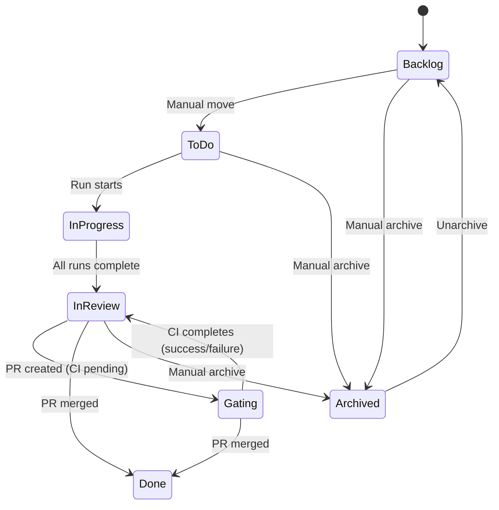

# Gating Status Design

## Overview

The "Gating" status is a new Task Kanban status that represents tasks waiting for CI completion after PR creation. This status helps users track which tasks are blocked on CI pipelines.

## Status Flow



## Status Computation Priority

The kanban status is computed dynamically with the following priority:

1. **Archived** (highest) - User explicitly archived the task
2. **Done** - PR is merged
3. **Gating** - PR is open AND CI is pending/null AND `enable_gating_status` is true
4. **In Progress** - Any run is currently running
5. **In Review** - All runs are completed
6. **Base Status** (lowest) - Stored DB status (Backlog/ToDo)

## Configuration

### Enable Gating Status

The Gating status is **disabled by default**. Users can enable it via:

**Settings > Defaults > Enable Gating status**

When enabled:
- Tasks with open PRs and pending CI will appear in the "Gating" column
- Use "Check CI" to verify CI status and update the task state

When disabled:
- The Gating column will not appear on the Kanban board
- Tasks go directly from In Review to Done when PR is merged

## Database Schema

### user_preferences table

```sql
enable_gating_status INTEGER DEFAULT 0  -- 0=disabled, 1=enabled
```

## Backend Implementation

### Files Modified

| File | Changes |
|------|---------|
| `domain/enums.py` | Added `GATING = "gating"` to `TaskKanbanStatus` |
| `domain/models.py` | Added `enable_gating_status: bool` to `UserPreferences` |
| `storage/schema.sql` | Added `enable_gating_status` column |
| `storage/dao.py` | Updated `TaskDAO.list_with_aggregates` to include CI status |
| `storage/dao.py` | Updated `UserPreferencesDAO` to handle new field |
| `services/kanban_service.py` | Added gating logic to `_compute_kanban_status` |
| `routes/preferences.py` | Pass `enable_gating_status` to DAO |
| `dependencies.py` | Pass `UserPreferencesDAO` to `KanbanService` |

### Kanban Status Computation

```python
def _compute_kanban_status(
    self,
    base_status: str,
    run_count: int,
    running_count: int,
    completed_count: int,
    latest_pr_status: str | None,
    latest_ci_status: str | None = None,
    enable_gating_status: bool = False,
) -> TaskKanbanStatus:
    # ... priority checks ...

    # Gating: PR is open and CI is pending
    if enable_gating_status and latest_pr_status == "open":
        if latest_ci_status in ("pending", None):
            return TaskKanbanStatus.GATING
```

### SQL Query for CI Status

The `list_with_aggregates` query now includes:

```sql
LEFT JOIN (
    SELECT
        pr_id,
        status as latest_ci_status
    FROM ci_checks c1
    WHERE c1.created_at = (
        SELECT MAX(c2.created_at)
        FROM ci_checks c2
        WHERE c2.pr_id = c1.pr_id
    )
) ci ON p.latest_pr_id = ci.pr_id
```

## Frontend Implementation

### Files Modified

| File | Changes |
|------|---------|
| `types.ts` | Added `'gating'` to `TaskKanbanStatus` type |
| `types.ts` | Added `enable_gating_status` to `UserPreferences` |
| `KanbanBoard.tsx` | Added `'gating'` to `COLUMN_ORDER` |
| `KanbanColumn.tsx` | Added gating column configuration |
| `SettingsModal.tsx` | Added toggle for `enable_gating_status` |

### Gating Column Configuration

```typescript
gating: {
  label: 'Gating',
  color: 'text-orange-400',
  bgColor: 'bg-orange-900/20',
  icon: ClockIcon,
  description: 'Waiting for CI completion',
}
```

## CI Status Values

The CI check status can be:

| Status | Description | Gating? |
|--------|-------------|---------|
| `pending` | CI is running | Yes |
| `null` | CI not checked yet | Yes |
| `success` | CI passed | No |
| `failure` | CI failed | No |
| `error` | CI error | No |

## User Workflow

1. Enable "Gating status" in Settings > Defaults
2. Create a task and run it with an AI executor
3. Create a PR for the completed run
4. Task automatically moves to "Gating" column
5. Use "Check CI" button to poll CI status
6. When CI completes, task moves to "In Review" (or "Done" if merged)

## API Endpoints

### GET /preferences

Returns `enable_gating_status` field.

### POST /preferences

Accepts `enable_gating_status` field to update the setting.

### POST /tasks/{task_id}/prs/{pr_id}/check-ci

Checks CI status for a PR. Updates the CI check record which affects the computed kanban status.
