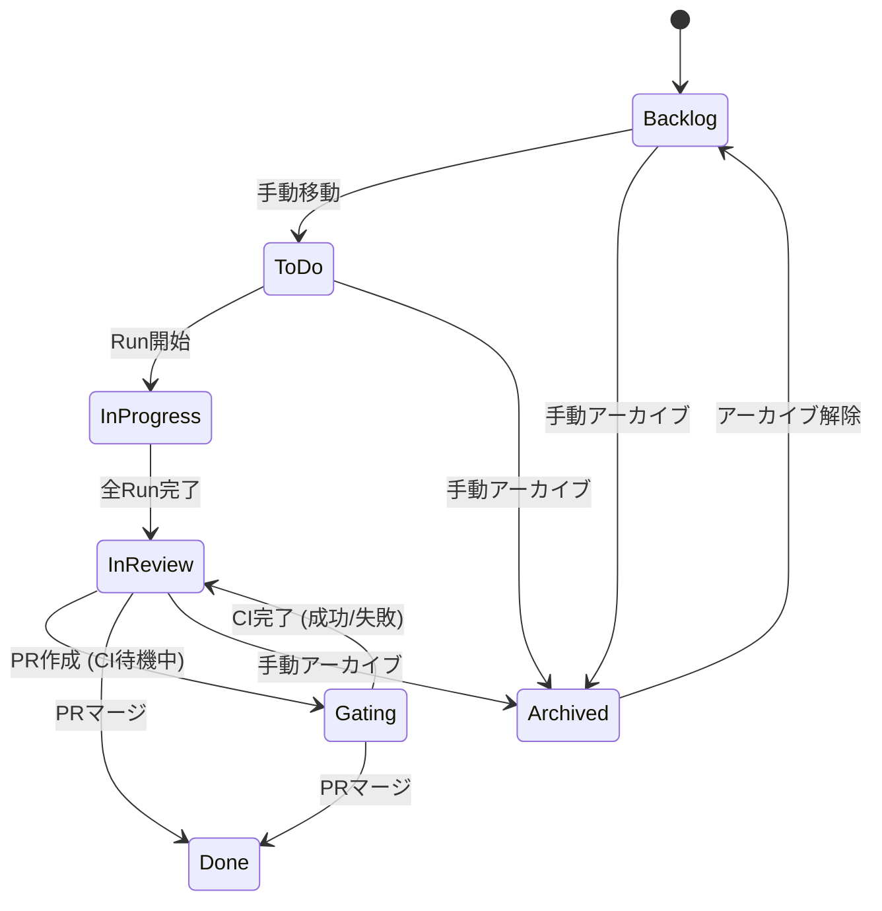

# Gating ステータス設計

## 概要

「Gating」ステータスは、PR作成後にCI完了を待機しているタスクを表す新しいKanbanステータスです。このステータスにより、CIパイプラインでブロックされているタスクを追跡できます。

## ステータスフロー



## ステータス計算の優先順位

Kanbanステータスは以下の優先順位で動的に計算されます：

1. **Archived** (最高) - ユーザーが明示的にアーカイブしたタスク
2. **Done** - PRがマージ済み
3. **Gating** - PRがオープン かつ CIがpending/null かつ `enable_gating_status` が有効
4. **In Progress** - 実行中のRunがある
5. **In Review** - 全てのRunが完了
6. **Base Status** (最低) - DB保存のステータス (Backlog/ToDo)

## 設定

### Gatingステータスの有効化

Gatingステータスは**デフォルトで無効**です。以下から有効化できます：

**Settings > Defaults > Enable Gating status**

有効時：
- オープンなPRとpending状態のCIを持つタスクが「Gating」列に表示される
- 「Check CI」でCIステータスを確認し、タスクの状態を更新

無効時：
- Gating列はKanbanボードに表示されない
- タスクはPRマージ時にIn ReviewからDoneに直接移動

## データベーススキーマ

### user_preferences テーブル

```sql
enable_gating_status INTEGER DEFAULT 0  -- 0=無効, 1=有効
```

## バックエンド実装

### 変更ファイル

| ファイル | 変更内容 |
|---------|---------|
| `domain/enums.py` | `TaskKanbanStatus` に `GATING = "gating"` を追加 |
| `domain/models.py` | `UserPreferences` に `enable_gating_status: bool` を追加 |
| `storage/schema.sql` | `enable_gating_status` カラムを追加 |
| `storage/dao.py` | `TaskDAO.list_with_aggregates` でCIステータスを含める |
| `storage/dao.py` | `UserPreferencesDAO` で新フィールドを処理 |
| `services/kanban_service.py` | `_compute_kanban_status` にgatingロジックを追加 |
| `routes/preferences.py` | DAOに `enable_gating_status` を渡す |
| `dependencies.py` | `KanbanService` に `UserPreferencesDAO` を渡す |

### Kanbanステータス計算

```python
def _compute_kanban_status(
    self,
    base_status: str,
    run_count: int,
    running_count: int,
    completed_count: int,
    latest_pr_status: str | None,
    latest_ci_status: str | None = None,
    enable_gating_status: bool = False,
) -> TaskKanbanStatus:
    # ... 優先順位チェック ...

    # Gating: PRがオープンでCIがpending
    if enable_gating_status and latest_pr_status == "open":
        if latest_ci_status in ("pending", None):
            return TaskKanbanStatus.GATING
```

### CIステータス取得のSQLクエリ

`list_with_aggregates` クエリに以下を追加：

```sql
LEFT JOIN (
    SELECT
        pr_id,
        status as latest_ci_status
    FROM ci_checks c1
    WHERE c1.created_at = (
        SELECT MAX(c2.created_at)
        FROM ci_checks c2
        WHERE c2.pr_id = c1.pr_id
    )
) ci ON p.latest_pr_id = ci.pr_id
```

## フロントエンド実装

### 変更ファイル

| ファイル | 変更内容 |
|---------|---------|
| `types.ts` | `TaskKanbanStatus` 型に `'gating'` を追加 |
| `types.ts` | `UserPreferences` に `enable_gating_status` を追加 |
| `KanbanBoard.tsx` | `COLUMN_ORDER` に `'gating'` を追加 |
| `KanbanColumn.tsx` | gating列の設定を追加 |
| `SettingsModal.tsx` | `enable_gating_status` のトグルを追加 |

### Gating列の設定

```typescript
gating: {
  label: 'Gating',
  color: 'text-orange-400',
  bgColor: 'bg-orange-900/20',
  icon: ClockIcon,
  description: 'Waiting for CI completion',
}
```

## CIステータス値

CIチェックのステータス：

| ステータス | 説明 | Gating対象? |
|-----------|------|-------------|
| `pending` | CI実行中 | はい |
| `null` | 未チェック | はい |
| `success` | CI成功 | いいえ |
| `failure` | CI失敗 | いいえ |
| `error` | CIエラー | いいえ |

## ユーザーワークフロー

1. Settings > Defaults で「Enable Gating status」を有効化
2. タスクを作成し、AIエグゼキュータで実行
3. 完了したRunからPRを作成
4. タスクは自動的に「Gating」列に移動
5. 「Check CI」ボタンでCIステータスをポーリング
6. CI完了時、タスクは「In Review」に移動（マージ済みなら「Done」）

## APIエンドポイント

### GET /preferences

`enable_gating_status` フィールドを返す。

### POST /preferences

`enable_gating_status` フィールドで設定を更新。

### POST /tasks/{task_id}/prs/{pr_id}/check-ci

PRのCIステータスをチェック。CIチェックレコードを更新し、計算されるKanbanステータスに影響する。
