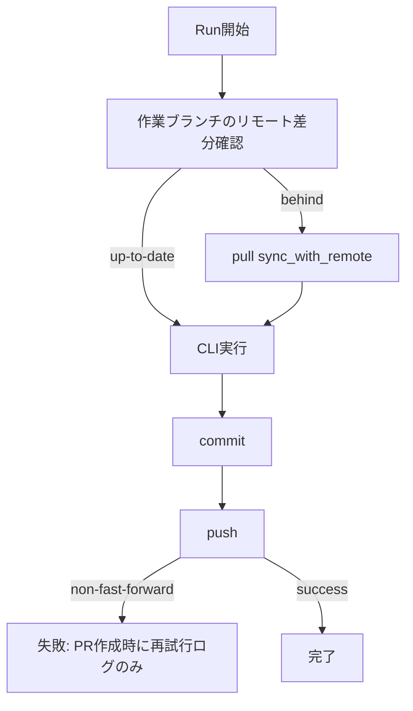
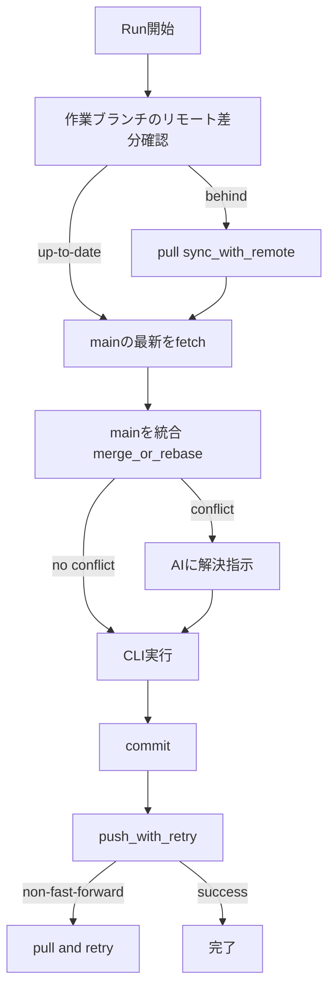

# Git 操作の課題整理と改善設計

本ドキュメントは、現在の Git 操作フローにおける課題と改善設計を整理したものです。
特に以下の点を対象とします。

- **作業中のリモートブランチ更新が適切に取り込めない**
- **作業ブランチと main のコンフリクトを解消できない**
  - 作業ブランチが古い main の状態しか見えていない挙動
- **両ブランチの機能を維持したい要件**  
  例: main では Code Scanner が削除済みだが、作業ブランチでは Code Scanner を維持したい。

---

## 1. 現状の課題整理

### 1.1 リモートブランチ更新の取り込み失敗

CLI 実行時の `RunService` は、**実行開始時にリモート更新を確認して pull します**が、
**実行中にリモートが更新された場合**は push 時に non-fast-forward となり失敗します。
その際、clone-based workspace では `push_with_retry` が使われていないため、
「PR 作成時に再試行」というログだけで終了し、**push が完了しない**状態になります。

- Run開始時: `is_behind_remote` → `sync_with_remote` による pull
- 実行完了後: `WorkspaceService.push` のみ → non-fast-forward で失敗 → その場で復旧できない

### 1.2 main とのコンフリクト解消ができない

現状、**作業ブランチの同期対象は “自分の作業ブランチ” のみ**であり、main との統合が
明示的に行われていません。そのため以下の状態が発生します。

- 作業ブランチが古い main の状態から派生している
- main 側の変更が入っても作業ブランチに統合されない
- その結果、main とのコンフリクトを事前に解消できない

さらに clone-based workspace では push の retry がないため、**リモート側の更新が入ったときも
pull して統合する機会が不足**しています。

---

## 2. 現状フロー（mermaid）

---

## 3. あるべき設計

### 3.1 目的

- **作業中のリモート更新を確実に取り込み、push 失敗を自動回復する**
- **main とのコンフリクトを事前に解消し、作業ブランチでの機能を維持する**

### 3.2 設計方針

1. **clone-based workspace でも `push_with_retry` 相当の挙動を行う**
   - push 失敗時に fetch/pull を行い、再 push する
   - Worktree の `GitService.push_with_retry` と同様の挙動を clone でも実現

2. **main との整合性を保つための “明示的な統合ステップ” を追加**
   - Run 開始時に、
     - 作業ブランチの remote 取り込み
     - main (base_ref) 側の最新を fetch して merge/rebase
   - **コンフリクトが発生した場合は AI に解決指示を渡す**

3. **機能維持のためのコンフリクト解消指針**
   - main で削除された Code Scanner でも、作業ブランチでは機能維持が必要な場合は
     **“両方を残す” 形でマージ**するポリシーを設ける
   - 例: 「main の削除」を盲目的に適用せず、作業ブランチ側で保持する

---

## 4. あるべきフロー（mermaid）

---

## 5. 実装指針（破壊的変更なし）

1. **CloneWorkspaceAdapter に retry push を導入**
   - 既存の `WorkspaceService.push` ではなく、`GitService.push_with_retry` と同等の
     ロジックを利用する
   - これにより既存の PR 作成フローは維持しつつ、Run 実行時点で push 成功率を高める

2. **Run 開始時に main 統合ステップを追加**
   - 作業ブランチの更新取り込みに加え、base_ref (main) を fetch して
     merge/rebase を行う
   - コンフリクト時は AI に解決を依頼する

3. **コンフリクト解消のガイドラインを明文化**
   - Code Scanner のように main 側で削除された機能を維持する場合、
     **“削除を受け入れない” 方針**を AI に明示する
   - これにより作業ブランチ側の要件を担保する

---

## 6. 期待される改善

- リモート更新が反映されない問題が解消
- main とのコンフリクトが発生しても AI により早期解消できる
- main と作業ブランチ双方の機能を維持したまま安全に統合可能
