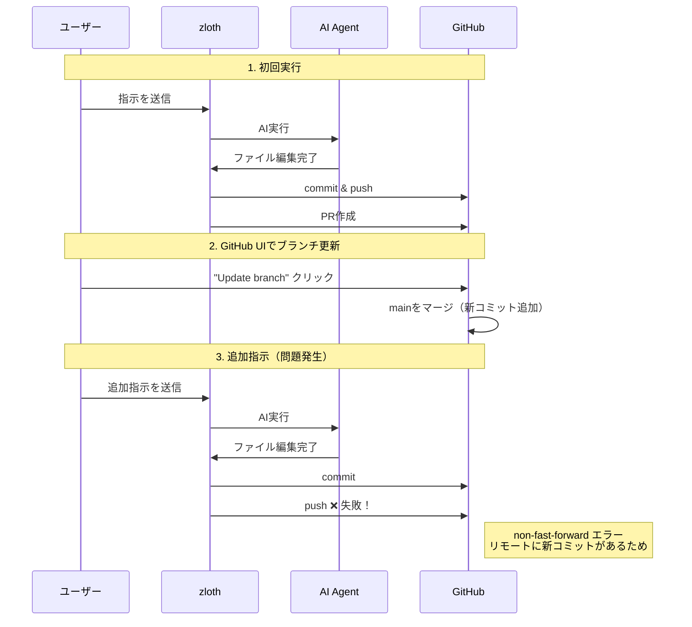
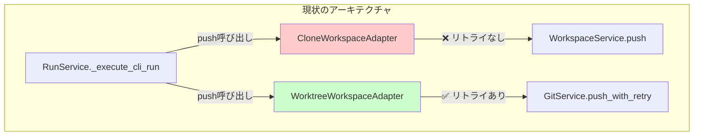
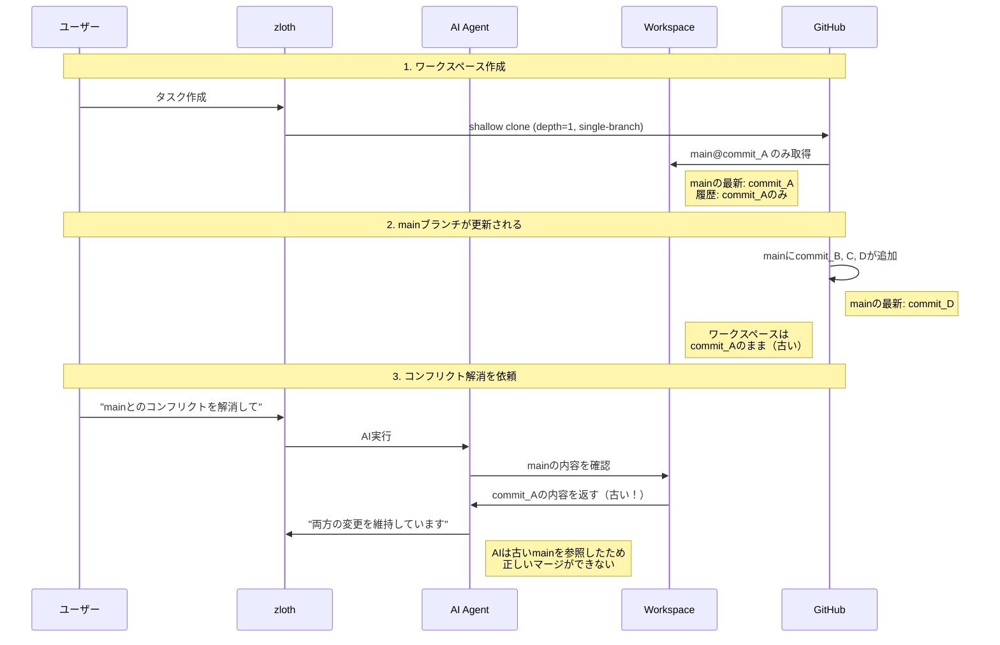
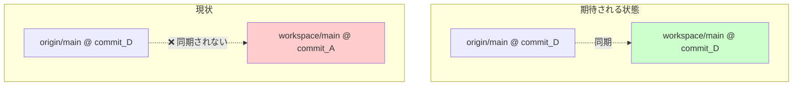
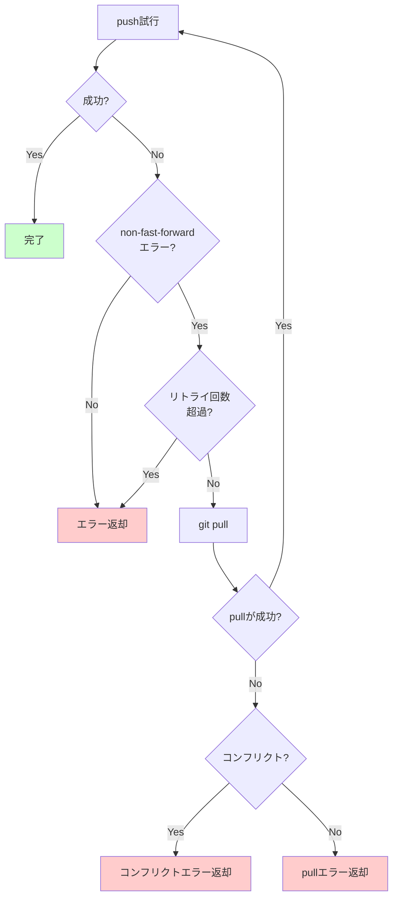
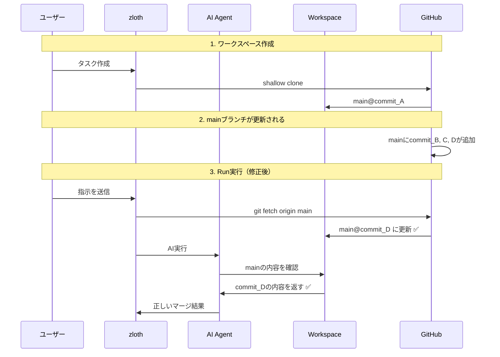
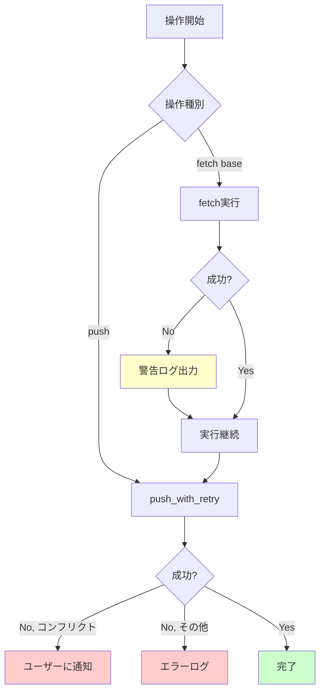

# Git操作における課題と解決設計

## 概要

本ドキュメントは、zlothにおけるGit操作に関する2つの主要な課題を分析し、解決策を提示します。

### 対象課題

| # | 課題 | 発生シナリオ |
|---|------|-------------|
| 1 | リモートブランチ更新後のPush失敗 | GitHub UIで「Update branch」後に追加指示を送信 |
| 2 | mainブランチの古いバージョンしか見えない | コンフリクト解消時にAIが古いmainを参照 |

---

## 課題1: リモートブランチ更新後のPush失敗

### 発生シナリオ



### エラーメッセージ例

```
Push failed (will retry on PR creation): Cmd('git') failed due to: exit code(1)
  stderr: 'To https://github.com/...
 ! [rejected]        feat/yuya/ffbeea60 -> feat/yuya/ffbeea60 (non-fast-forward)
error: failed to push some refs to '...'
hint: Updates were rejected because the tip of your current branch is behind
hint: its remote counterpart.
```

### 原因分析



| Adapter | `push()` の実装 | non-fast-forward対応 |
|---------|----------------|---------------------|
| **WorktreeWorkspaceAdapter** | `git_service.push_with_retry()` を使用 | ✅ 自動で pull→push リトライ |
| **CloneWorkspaceAdapter** | `workspace_service.push()` を直接呼び出し | ❌ リトライなし、即失敗 |

### 関連コード

**CloneWorkspaceAdapter** (`workspace_adapters.py:198-205`):
```python
async def push(self, path, *, branch, auth_url=None) -> PushAttemptResult:
    try:
        await self._ws.push(path, branch=branch, auth_url=auth_url)
        return PushAttemptResult(success=True, required_pull=False)
    except Exception as e:
        # ❌ リトライせずに即失敗
        return PushAttemptResult(success=False, required_pull=False, error=str(e))
```

**WorktreeWorkspaceAdapter** (`workspace_adapters.py:296-304`):
```python
async def push(self, path, *, branch, auth_url=None) -> PushAttemptResult:
    # ✅ push_with_retryでリトライあり
    res = await self._git.push_with_retry(path, branch=branch, auth_url=auth_url)
    return PushAttemptResult(
        success=res.success,
        required_pull=res.required_pull,
        error=res.error,
    )
```

---

## 課題2: mainブランチの古いバージョンしか見えない

### 発生シナリオ



### 問題の本質



### 原因分析

**ワークスペース作成時のclone設定** (`workspace_service.py:152-161`):
```python
# Shallow clone with single branch
repo = git.Repo.clone_from(
    clone_url,
    workspace_path,
    depth=1,              # ← 履歴を1コミットだけ取得
    single_branch=True,   # ← base_branchのみ取得
    branch=base_branch,
)
```

| 設定 | 値 | 影響 |
|------|-----|------|
| `depth=1` | 浅いクローン | 履歴が限定的、`git merge-base`が正確に動作しない可能性 |
| `single_branch=True` | 単一ブランチ | 作業ブランチ以外の情報が取得されない |

### 同期が行われるタイミング（現状）

| タイミング | 対象 | 操作 |
|-----------|------|------|
| ワークスペース作成時 | base_branch | 最新を取得 |
| Run実行前 | 作業ブランチのみ | `is_behind_remote` → `sync_with_remote` |
| Push時 | 作業ブランチのみ | `push_with_retry`でpull→push |

**問題点**: mainブランチの最新状態は一度も取得されない

---

## 現状フロー（問題あり）

```mermaid
flowchart TD
    subgraph 初期化["ワークスペース初期化"]
        A[Task作成] --> B[shallow clone<br/>depth=1, single-branch]
        B --> C[base_branch@作成時点]
    end

    subgraph 実行["Run実行"]
        D[Run作成] --> E{作業ブランチが<br/>リモートより遅れてる?}
        E -->|Yes| F[作業ブランチをpull]
        E -->|No| G[そのまま実行]
        F --> G
        G --> H[AI実行]
        H --> I[commit]
        I --> J[push]
        J --> K{成功?}
        K -->|No, non-ff| L{CloneAdapter?}
        L -->|Yes| M[❌ 失敗終了]
        L -->|No| N[pull → push リトライ]
        N --> K
        K -->|Yes| O[完了]
    end

    subgraph 問題点["❌ 問題点"]
        P[mainブランチは<br/>一度も更新されない]
        Q[CloneAdapterは<br/>pushリトライなし]
    end

    C --> D
    M -.->|原因| Q
    H -.->|古いmain参照| P

    style M fill:#ffcccc
    style P fill:#ffcccc
    style Q fill:#ffcccc
```

---

## あるべきフロー（解決後）

```mermaid
flowchart TD
    subgraph 初期化["ワークスペース初期化"]
        A[Task作成] --> B[shallow clone]
        B --> C[base_branch@作成時点]
    end

    subgraph 実行["Run実行"]
        D[Run作成] --> E[✅ リモートから最新を取得]
        E --> F[git fetch origin main]
        F --> G[git fetch origin 作業ブランチ]
        G --> H{作業ブランチが<br/>リモートより遅れてる?}
        H -->|Yes| I[作業ブランチをpull]
        H -->|No| J[そのまま実行]
        I --> J
        J --> K[AI実行<br/>✅ 最新のmainが見える]
        K --> L[commit]
        L --> M[push_with_retry]
        M --> N{成功?}
        N -->|No, non-ff| O[✅ pull → push リトライ]
        O --> M
        N -->|Yes| P[完了]
    end

    C --> D

    style E fill:#ccffcc
    style F fill:#ccffcc
    style K fill:#ccffcc
    style O fill:#ccffcc
```

---

## 解決策の設計

### 課題1の解決: CloneWorkspaceAdapterにpush_with_retry追加

#### 方針

`WorkspaceService`に`push_with_retry()`メソッドを追加し、`CloneWorkspaceAdapter`から使用する。

#### 変更箇所

**1. WorkspaceService に push_with_retry() を追加**

```python
# workspace_service.py

async def push_with_retry(
    self,
    workspace_path: Path,
    branch: str,
    auth_url: str | None = None,
    max_retries: int = 2,
) -> PushResult:
    """non-fast-forwardエラー時に自動リトライするpush

    Args:
        workspace_path: ワークスペースのパス
        branch: プッシュするブランチ名
        auth_url: 認証用URL
        max_retries: 最大リトライ回数

    Returns:
        PushResult: 成功/失敗の結果
    """
    required_pull = False

    for attempt in range(max_retries + 1):
        try:
            await self.push(workspace_path, branch=branch, auth_url=auth_url)
            return PushResult(success=True, required_pull=required_pull)
        except Exception as e:
            error_str = str(e).lower()

            # non-fast-forwardエラーの検出
            is_non_ff = any(
                pattern in error_str
                for pattern in [
                    "non-fast-forward",
                    "[rejected]",
                    "failed to push some refs",
                    "updates were rejected",
                    "fetch first",
                ]
            )

            if not is_non_ff or attempt >= max_retries:
                return PushResult(success=False, error=str(e), required_pull=required_pull)

            # pull してリトライ
            logger.info(
                f"Push rejected (non-fast-forward), pulling and retrying "
                f"(attempt {attempt + 1}/{max_retries})"
            )

            sync_result = await self.sync_with_remote(
                workspace_path, branch=branch, auth_url=auth_url
            )
            required_pull = True

            if not sync_result.success:
                if sync_result.has_conflicts:
                    return PushResult(
                        success=False,
                        error=f"Merge conflicts in: {', '.join(sync_result.conflict_files)}",
                        required_pull=True,
                    )
                return PushResult(
                    success=False,
                    error=f"Pull failed: {sync_result.error}",
                    required_pull=True,
                )

    return PushResult(success=False, error="Max retries exceeded", required_pull=required_pull)
```

**2. CloneWorkspaceAdapter.push() を修正**

```python
# workspace_adapters.py

# 修正前
async def push(self, path, *, branch, auth_url=None) -> PushAttemptResult:
    try:
        await self._ws.push(path, branch=branch, auth_url=auth_url)
        return PushAttemptResult(success=True, required_pull=False)
    except Exception as e:
        return PushAttemptResult(success=False, required_pull=False, error=str(e))

# 修正後
async def push(self, path, *, branch, auth_url=None) -> PushAttemptResult:
    res = await self._ws.push_with_retry(path, branch=branch, auth_url=auth_url)
    return PushAttemptResult(
        success=res.success,
        required_pull=res.required_pull,
        error=res.error,
    )
```

#### フロー図（修正後）



---

### 課題2の解決: mainブランチの最新取得

#### 方針

Run実行前にmainブランチ（base_ref）の最新状態をfetchする。

#### 変更箇所

**1. WorkspaceService に fetch_base_branch() を追加**

```python
# workspace_service.py

async def fetch_base_branch(
    self,
    workspace_path: Path,
    base_branch: str,
    auth_url: str | None = None,
) -> None:
    """ベースブランチの最新状態をfetchする

    shallow cloneで作成されたワークスペースでも
    ベースブランチの最新コミットを取得できるようにする。

    Args:
        workspace_path: ワークスペースのパス
        base_branch: ベースブランチ名（通常はmain）
        auth_url: 認証用URL
    """
    def _fetch() -> None:
        repo = git.Repo(workspace_path)

        original_url: str | None = None
        if auth_url:
            try:
                original_url = repo.remotes.origin.url
                repo.remotes.origin.set_url(auth_url)
            except Exception:
                pass

        try:
            # ベースブランチの最新を取得
            # --depth を指定しないことで、unshallow的な動作になる
            repo.remotes.origin.fetch(base_branch)
            logger.info(f"Fetched latest {base_branch}")
        finally:
            if original_url:
                repo.remotes.origin.set_url(original_url)

    loop = asyncio.get_event_loop()
    await loop.run_in_executor(None, _fetch)
```

**2. WorkspaceAdapter に fetch_base_branch() を追加**

```python
# workspace_adapters.py

class WorkspaceAdapter(ABC):
    @abstractmethod
    async def fetch_base_branch(
        self, path: Path, *, base_branch: str, auth_url: str | None = None
    ) -> None:
        """Fetch the latest state of the base branch."""
        ...

class CloneWorkspaceAdapter(WorkspaceAdapter):
    async def fetch_base_branch(
        self, path: Path, *, base_branch: str, auth_url: str | None = None
    ) -> None:
        await self._ws.fetch_base_branch(path, base_branch=base_branch, auth_url=auth_url)
```

**3. RunService._execute_cli_run() でfetchを呼び出す**

```python
# run_service.py

async def _execute_cli_run(self, run, worktree_info, executor_type, resume_session_id):
    logs: list[str] = []

    # ... 既存の同期処理 ...

    # ★追加: ベースブランチの最新を取得
    if self.github_service and repo:
        try:
            auth_url = await self.github_service.get_auth_url(owner, repo_name)
            await self.workspace_adapter.fetch_base_branch(
                worktree_info.path,
                base_branch=run.base_ref,
                auth_url=auth_url,
            )
            logs.append(f"Fetched latest {run.base_ref}")
        except Exception as e:
            # fetchの失敗は警告のみ（実行は継続）
            logger.warning(f"Failed to fetch base branch: {e}")
            logs.append(f"Warning: Could not fetch latest {run.base_ref}")

    # ... 以降の実行処理 ...
```

#### フロー図（修正後）



---

## 実装上の考慮事項

### 既存機能への影響

| 機能 | 影響 | 対応 |
|------|------|------|
| WorktreeWorkspaceAdapter | なし | 既にpush_with_retry使用 |
| PRService._ensure_branch_pushed() | なし | git_serviceを直接使用 |
| RunService._execute_cli_run() | 改善 | Clone使用時もリトライが動作 |
| WorkspaceService.push() | なし | 既存メソッドは維持 |

### テストシナリオ

| # | シナリオ | 期待結果 |
|---|---------|---------|
| 1 | リモートに変更がない | 通常push成功 |
| 2 | リモートに変更あり（マージ可能） | pull後にpush成功 |
| 3 | リモートに変更あり（コンフリクト） | コンフリクトエラー返却 |
| 4 | ベースブランチfetch失敗 | 警告のみ、実行は継続 |
| 5 | ベースブランチfetch成功後のマージ | AIが最新mainを参照できる |

### エラーハンドリング



---

## まとめ

### 修正対象ファイル

| ファイル | 修正内容 |
|---------|---------|
| `workspace_service.py` | `push_with_retry()`, `fetch_base_branch()` 追加 |
| `workspace_adapters.py` | `CloneWorkspaceAdapter.push()` 修正、`fetch_base_branch()` 追加 |
| `run_service.py` | 実行前に `fetch_base_branch()` 呼び出し追加 |

### 解決される問題

| 課題 | 解決策 | 効果 |
|------|--------|------|
| Push失敗（non-fast-forward） | push_with_retry追加 | リモート更新後も自動リトライで成功 |
| 古いmain参照 | fetch_base_branch追加 | AIが最新のmainを参照可能 |

### 今後の検討事項

1. **深いクローンへの移行**: `depth=1`の制限を緩和する可能性
2. **定期的な同期**: バックグラウンドでのfetch処理
3. **コンフリクト自動解消**: AIによるコンフリクト解消支援機能
