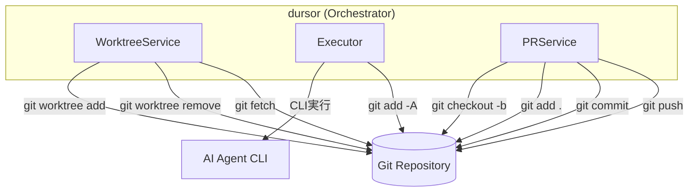
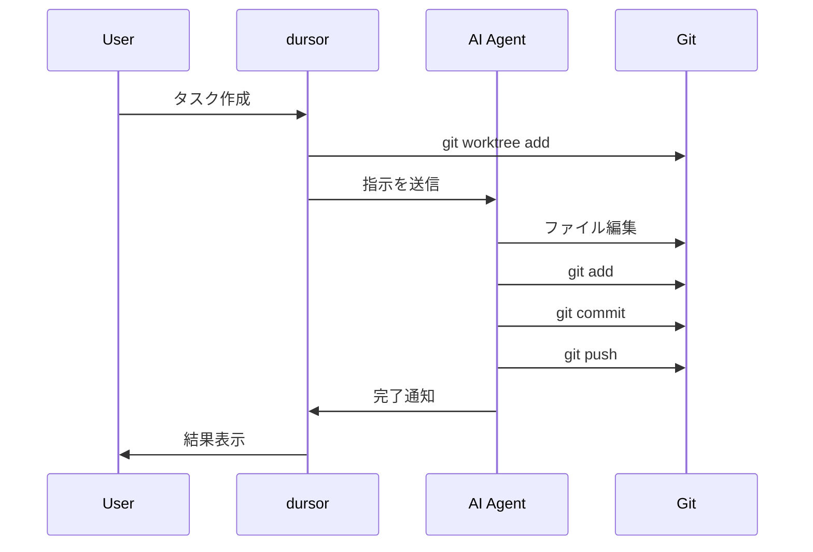
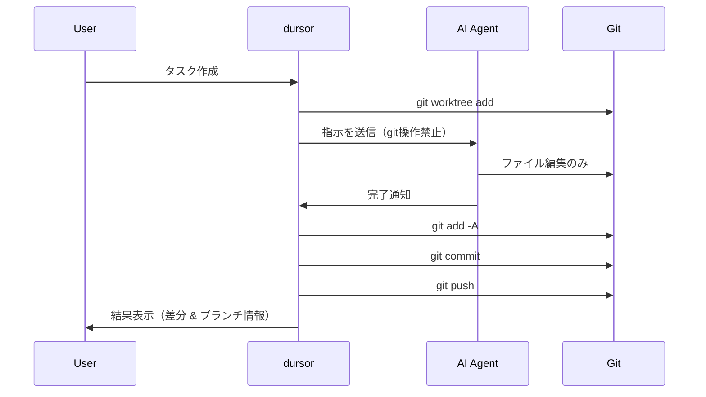
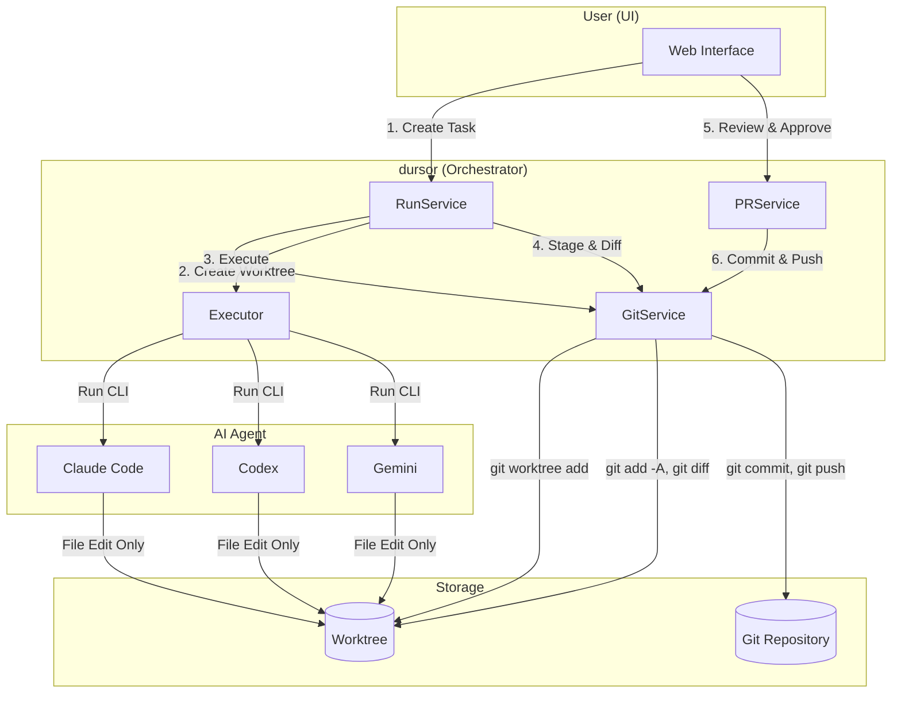
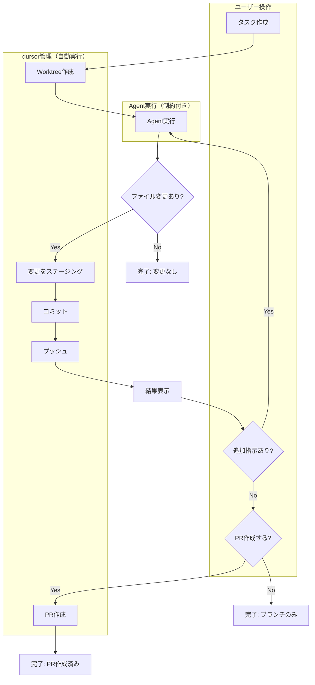
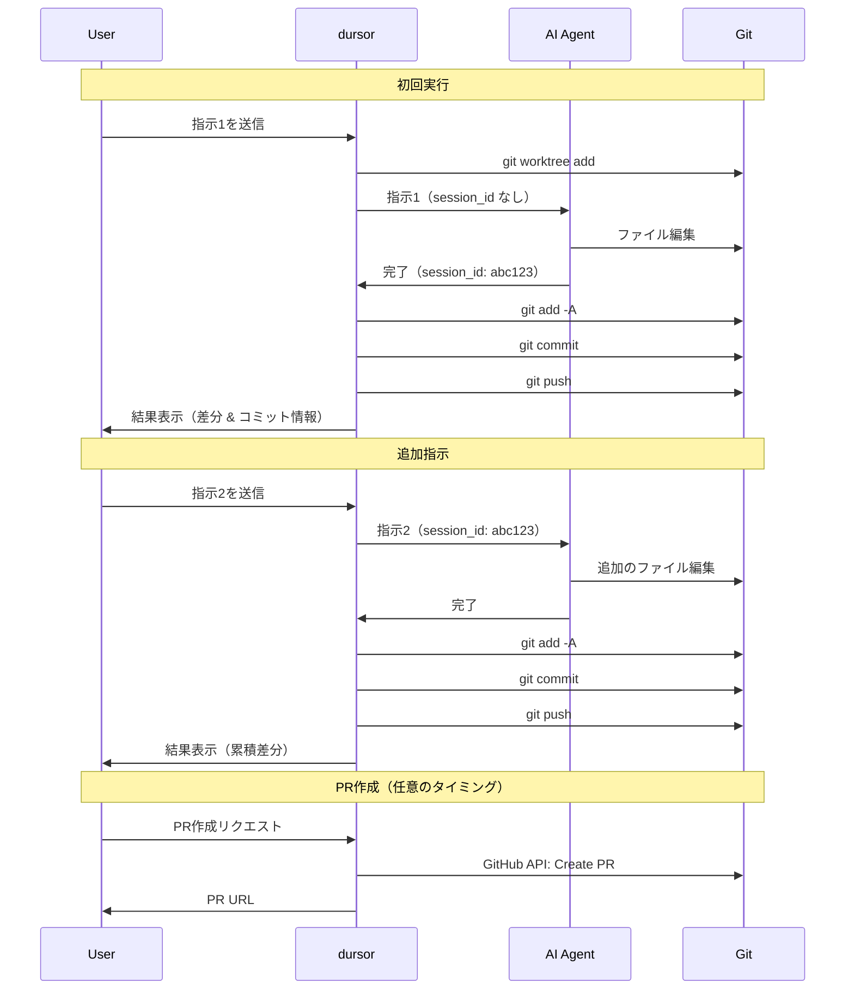
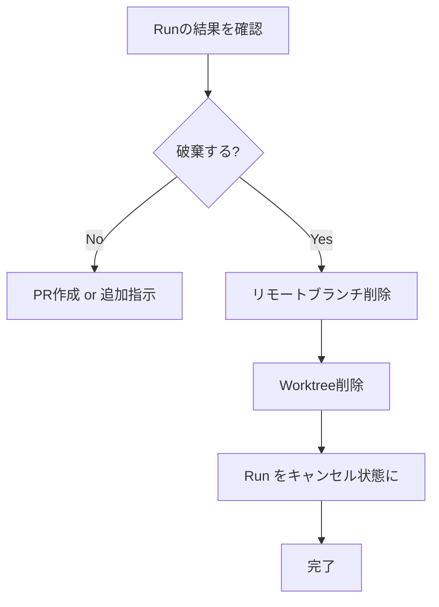

# Git操作の配置戦略設計

## 概要

本ドキュメントでは、dursor における git 操作（worktree, add, commit, push 等）の責任配置について設計方針を定義します。

## 現状の設計



現在、git 操作は以下のコンポーネントに分散しています：

| コンポーネント | 担当する git 操作 |
|--------------|-----------------|
| `WorktreeService` | `git worktree add/remove`, `git fetch` |
| 各 `Executor` | `git add -A`（diff取得用） |
| `PRService` | `git checkout -b`, `git add`, `git commit`, `git push` |

---

## 設計アプローチの比較

### A: Agent に git 操作を任せる

AI Agent（Claude Code, Codex, Gemini）が直接 git commit/push を実行する方式。



**メリット:**
- Agent の自律性を活かせる
- Agent が最適なタイミングでコミットできる

**デメリット:**
- Agent 毎に挙動が異なる可能性
- 予期しない commit/push のリスク
- 問題発生時の切り分けが困難
- Agent がコミットすると変更を戻しづらい
- マルチモデル比較が複雑

### B: Orchestrator が git 操作を管理（推奨）

dursor 側で git 操作を統一的に管理し、AI Agent には**ファイル編集のみ**を許可する方式。



**メリット:**
- 統一された git 操作フロー
- 各フェーズが明確に分離されデバッグしやすい
- 統一形式でマルチモデル比較が容易
- 自動化されたワークフローで迅速なフィードバック

**デメリット:**
- ワークフローに制約がある
- Agent の自律性が制限される

---

## 比較表

| 観点 | A: Agent任せ | B: Orchestrator管理 |
|------|-------------|---------------------|
| **一貫性** | ❌ Agent毎に挙動が異なる可能性 | ✅ 統一されたgit操作フロー |
| **制御性** | ❌ 予期しないタイミングでcommit/push | ✅ 決まったタイミングでcommit/push |
| **デバッグ** | ❌ 問題発生時の切り分けが困難 | ✅ 各フェーズが明確に分離 |
| **マルチモデル対応** | ❌ 各モデルの差分比較が複雑 | ✅ 統一形式で比較しやすい |
| **自動化** | △ Agent依存で挙動が不安定 | ✅ 安定した自動ワークフロー |
| **柔軟性** | ✅ Agentの自律性を活かせる | △ ワークフローに制約がある |

---

## 推奨設計: Orchestrator 管理パターン

### アーキテクチャ概要



### ワークフロー詳細



---

## 実装設計

### 1. GitService の新設

現在 `WorktreeService` と `PRService` に分散している git 操作を統一します。

```python
# apps/api/src/dursor_api/services/git_service.py

class GitService:
    """Git操作を統一管理するサービス"""

    # === Worktree管理 ===
    async def create_worktree(
        self, repo: Repo, base_branch: str, run_id: str
    ) -> WorktreeInfo:
        """Worktreeを作成"""
        pass

    async def cleanup_worktree(
        self, worktree_path: Path, delete_branch: bool = False
    ) -> None:
        """Worktreeを削除"""
        pass

    async def list_worktrees(self, repo: Repo) -> list[WorktreeInfo]:
        """Worktree一覧を取得"""
        pass

    # === 変更管理 ===
    async def get_status(self, worktree_path: Path) -> GitStatus:
        """作業ディレクトリの状態を取得"""
        pass

    async def stage_all(self, worktree_path: Path) -> None:
        """全変更をステージング"""
        pass

    async def unstage_all(self, worktree_path: Path) -> None:
        """ステージングを解除"""
        pass

    async def get_diff(
        self, worktree_path: Path, staged: bool = True
    ) -> str:
        """差分を取得"""
        pass

    async def get_diff_from_base(
        self, worktree_path: Path, base_ref: str
    ) -> str:
        """ベースブランチからの累積差分を取得"""
        pass

    async def reset_changes(
        self, worktree_path: Path, hard: bool = False
    ) -> None:
        """変更をリセット"""
        pass

    # === コミット管理 ===
    async def commit(
        self, worktree_path: Path, message: str
    ) -> str:
        """コミットを作成（SHA を返す）"""
        pass

    async def amend(
        self, worktree_path: Path, message: str | None = None
    ) -> str:
        """直前のコミットを修正"""
        pass

    # === ブランチ管理 ===
    async def create_branch(
        self, repo_path: Path, branch_name: str, base: str
    ) -> None:
        """ブランチを作成"""
        pass

    async def checkout(self, repo_path: Path, branch_name: str) -> None:
        """ブランチをチェックアウト"""
        pass

    async def delete_branch(
        self, repo_path: Path, branch_name: str, force: bool = False
    ) -> None:
        """ブランチを削除"""
        pass

    # === リモート操作 ===
    async def push(
        self,
        repo_path: Path,
        branch: str,
        auth_url: str | None = None,
        force: bool = False,
    ) -> None:
        """リモートにプッシュ"""
        pass

    async def fetch(
        self, repo_path: Path, remote: str = "origin"
    ) -> None:
        """リモートからフェッチ"""
        pass

    async def delete_remote_branch(
        self,
        repo_path: Path,
        branch: str,
        auth_url: str | None = None,
    ) -> None:
        """リモートブランチを削除"""
        pass

    # === リセット操作 ===
    async def reset_to_previous(
        self,
        repo_path: Path,
        soft: bool = False,
    ) -> None:
        """直前のコミットに戻す（soft: 変更は保持）"""
        pass
```

### 2. Agent 制約の定義

```python
# apps/api/src/dursor_api/domain/models.py

@dataclass
class AgentConstraints:
    """Agent実行時の制約"""

    forbidden_paths: list[str] = field(default_factory=lambda: [
        ".git",
        ".env",
        ".env.*",
        "*.key",
        "*.pem",
    ])

    forbidden_commands: list[str] = field(default_factory=lambda: [
        "git commit",
        "git push",
        "git checkout",
        "git reset --hard",
        "git rebase",
        "git merge",
    ])

    allowed_git_commands: list[str] = field(default_factory=lambda: [
        "git status",
        "git diff",
        "git log",
        "git show",
        "git branch",  # 読み取りのみ
    ])

    def to_prompt(self) -> str:
        """制約をプロンプト形式に変換"""
        return f"""
## 重要な制約

### 禁止されている操作
- 以下の git コマンドは使用禁止です: {', '.join(self.forbidden_commands)}
- ファイルの編集のみを行い、コミットやプッシュは行わないでください
- 編集後の変更は自動的に検出されます

### 禁止されているパス
以下のパスへのアクセスは禁止されています:
{chr(10).join(f'- {p}' for p in self.forbidden_paths)}

### 許可されている git コマンド（読み取り専用）
{chr(10).join(f'- {c}' for c in self.allowed_git_commands)}
"""
```

### 3. BaseExecutor の定義

```python
# apps/api/src/dursor_api/executors/base_executor.py

from abc import ABC, abstractmethod
from pathlib import Path
from collections.abc import Awaitable, Callable

from dursor_api.domain.models import AgentConstraints


class BaseExecutor(ABC):
    """全Executorの基底クラス"""

    @abstractmethod
    async def execute(
        self,
        worktree_path: Path,
        instruction: str,
        constraints: AgentConstraints | None = None,
        on_output: Callable[[str], Awaitable[None]] | None = None,
        resume_session_id: str | None = None,
    ) -> ExecutorResult:
        """CLIを実行

        Args:
            worktree_path: 作業ディレクトリ
            instruction: 自然言語での指示
            constraints: Agent制約（git操作禁止等）
            on_output: 出力ストリーミング用コールバック
            resume_session_id: セッション継続用ID

        Returns:
            実行結果
        """
        pass

    def _build_instruction_with_constraints(
        self,
        instruction: str,
        constraints: AgentConstraints | None,
    ) -> str:
        """制約を含めた指示を構築"""
        if constraints is None:
            return instruction

        return f"{constraints.to_prompt()}\n\n## タスク\n{instruction}"
```

### 4. RunService のワークフロー

```python
# apps/api/src/dursor_api/services/run_service.py

class RunService:
    def __init__(
        self,
        run_dao: RunDAO,
        task_dao: TaskDAO,
        git_service: GitService,
        github_service: GitHubService,
        # ...
    ):
        self.git_service = git_service
        self.github_service = github_service

    async def _execute_cli_run(
        self,
        run: Run,
        worktree_info: WorktreeInfo,
        executor_type: ExecutorType,
        resume_session_id: str | None = None,
    ) -> None:
        """CLI実行ワークフロー（実行後に自動commit/push）"""
        logs: list[str] = []

        try:
            await self.run_dao.update_status(run.id, RunStatus.RUNNING)

            # 1. 実行前の状態を記録
            pre_status = await self.git_service.get_status(worktree_info.path)
            logs.append(f"Pre-execution status: {pre_status}")

            # 2. CLI実行（ファイル編集のみ）
            executor = self._get_executor(executor_type)
            result = await executor.execute(
                worktree_path=worktree_info.path,
                instruction=run.instruction,
                constraints=AgentConstraints(),  # 制約を渡す
                on_output=lambda line: self._log_output(run.id, line),
                resume_session_id=resume_session_id,
            )

            if not result.success:
                await self.run_dao.update_status(
                    run.id,
                    RunStatus.FAILED,
                    error=result.error,
                    logs=logs + result.logs,
                )
                return

            # 3. 変更をステージング
            await self.git_service.stage_all(worktree_info.path)

            # 4. パッチを取得
            patch = await self.git_service.get_diff(
                worktree_info.path, staged=True
            )

            # 変更がない場合はスキップ
            if not patch.strip():
                logs.append("No changes detected, skipping commit/push")
                await self.run_dao.update_status(
                    run.id,
                    RunStatus.SUCCEEDED,
                    summary="No changes made",
                    patch="",
                    files_changed=[],
                    logs=logs + result.logs,
                    session_id=result.session_id,
                )
                return

            # 5. コミット（自動）
            commit_message = self._generate_commit_message(run.instruction, result.summary)
            commit_sha = await self.git_service.commit(
                worktree_info.path,
                message=commit_message,
            )
            logs.append(f"Committed: {commit_sha}")

            # 6. プッシュ（自動）
            task = await self.task_dao.get(run.task_id)
            repo = await self.repo_service.get(task.repo_id)
            owner, repo_name = self._parse_github_url(repo.repo_url)
            auth_url = await self.github_service.get_auth_url(owner, repo_name)
            
            await self.git_service.push(
                worktree_info.path,
                branch=worktree_info.branch_name,
                auth_url=auth_url,
            )
            logs.append(f"Pushed to branch: {worktree_info.branch_name}")

            # 7. 結果を保存
            files_changed = self._parse_diff(patch)
            await self.run_dao.update_status(
                run.id,
                RunStatus.SUCCEEDED,
                summary=result.summary,
                patch=patch,
                files_changed=files_changed,
                logs=logs + result.logs,
                session_id=result.session_id,
                commit_sha=commit_sha,
            )

        except Exception as e:
            await self.run_dao.update_status(
                run.id,
                RunStatus.FAILED,
                error=str(e),
                logs=logs + [f"Execution failed: {e}"],
            )

    def _generate_commit_message(
        self, instruction: str, summary: str
    ) -> str:
        """コミットメッセージを生成"""
        # 指示の最初の行を使用（長すぎる場合は切り詰め）
        first_line = instruction.split('\n')[0][:72]
        if summary:
            return f"{first_line}\n\n{summary}"
        return first_line
```

### 5. PRService の簡素化

Run 実行時に既に commit/push されているため、PRService は PR 作成のみを担当します。

```python
# apps/api/src/dursor_api/services/pr_service.py

class PRService:
    def __init__(
        self,
        pr_dao: PRDAO,
        task_dao: TaskDAO,
        run_dao: RunDAO,
        github_service: GitHubService,
    ):
        self.github_service = github_service

    async def create_from_run(
        self,
        task_id: str,
        run_id: str,
        pr_data: PRCreate,
    ) -> PR:
        """Runのブランチから PR を作成（既にpush済み）"""
        run = await self.run_dao.get(run_id)
        if not run or not run.working_branch:
            raise ValueError(f"Run not found or no branch: {run_id}")

        if not run.commit_sha:
            raise ValueError(f"Run has no commits: {run_id}")

        task = await self.task_dao.get(task_id)
        repo = await self.repo_service.get(task.repo_id)
        owner, repo_name = self._parse_github_url(repo.repo_url)

        # PR作成（ブランチは既にpush済み）
        pr_response = await self.github_service.create_pull_request(
            owner=owner,
            repo=repo_name,
            title=pr_data.title,
            head=run.working_branch,
            base=repo.default_branch,
            body=pr_data.body or f"Generated by dursor\n\n{run.summary}",
        )

        # DB保存
        return await self.pr_dao.create(
            task_id=task_id,
            number=pr_response["number"],
            url=pr_response["html_url"],
            branch=run.working_branch,
            title=pr_data.title,
            body=pr_data.body,
            latest_commit=run.commit_sha,
        )
```

---

## 会話継続時のワークフロー

複数回の会話で PR を育てていく場合のフロー:



### 実装例

```python
class RunService:
    async def continue_run(
        self,
        run_id: str,
        additional_instruction: str,
    ) -> Run:
        """既存Runに追加の指示を送信（自動commit/push）"""
        existing_run = await self.run_dao.get(run_id)
        if not existing_run:
            raise ValueError(f"Run not found: {run_id}")

        # 同じworktreeを再利用
        worktree_path = Path(existing_run.worktree_path)
        logs: list[str] = []

        # 追加の指示でCLI実行
        executor = self._get_executor(existing_run.executor_type)
        result = await executor.execute(
            worktree_path=worktree_path,
            instruction=additional_instruction,
            constraints=AgentConstraints(),
            resume_session_id=existing_run.session_id,
        )

        if not result.success:
            await self.run_dao.update_status(
                existing_run.id,
                RunStatus.FAILED,
                error=result.error,
                logs=logs + result.logs,
            )
            return await self.run_dao.get(existing_run.id)

        # 変更をステージング
        await self.git_service.stage_all(worktree_path)

        # 差分を取得
        patch = await self.git_service.get_diff(worktree_path, staged=True)

        if patch.strip():
            # コミット
            commit_message = self._generate_commit_message(
                additional_instruction, result.summary
            )
            commit_sha = await self.git_service.commit(
                worktree_path,
                message=commit_message,
            )
            logs.append(f"Committed: {commit_sha}")

            # プッシュ
            task = await self.task_dao.get(existing_run.task_id)
            repo = await self.repo_service.get(task.repo_id)
            owner, repo_name = self._parse_github_url(repo.repo_url)
            auth_url = await self.github_service.get_auth_url(owner, repo_name)

            await self.git_service.push(
                worktree_path,
                branch=existing_run.working_branch,
                auth_url=auth_url,
            )
            logs.append(f"Pushed to branch: {existing_run.working_branch}")

        # 累積の変更を取得（ベースブランチからの差分）
        cumulative_patch = await self.git_service.get_diff_from_base(
            worktree_path=worktree_path,
            base_ref=existing_run.base_ref,
        )

        # 結果を更新
        await self.run_dao.update_status(
            existing_run.id,
            RunStatus.SUCCEEDED,
            patch=cumulative_patch,
            logs=logs + result.logs,
            session_id=result.session_id or existing_run.session_id,
            commit_sha=commit_sha if patch.strip() else existing_run.commit_sha,
        )

        return await self.run_dao.get(existing_run.id)
```

---

## Run の破棄機能

実行済みの Run を破棄する場合のフロー（既に commit/push 済みのため、ブランチごと削除）:



### 実装例

```python
class RunService:
    async def discard_run(self, run_id: str) -> None:
        """Runを完全に破棄（ブランチも削除）"""
        run = await self.run_dao.get(run_id)
        if not run:
            return

        # リモートブランチを削除（push済みの場合）
        if run.working_branch and run.commit_sha:
            try:
                task = await self.task_dao.get(run.task_id)
                repo = await self.repo_service.get(task.repo_id)
                owner, repo_name = self._parse_github_url(repo.repo_url)
                auth_url = await self.github_service.get_auth_url(owner, repo_name)

                await self.git_service.delete_remote_branch(
                    repo_path=Path(repo.workspace_path),
                    branch=run.working_branch,
                    auth_url=auth_url,
                )
            except Exception as e:
                # リモート削除に失敗しても続行
                pass

        # Worktreeを削除（ローカルブランチも削除）
        if run.worktree_path:
            await self.git_service.cleanup_worktree(
                Path(run.worktree_path),
                delete_branch=True,
            )

        # ステータスを更新
        await self.run_dao.update_status(run.id, RunStatus.CANCELED)

    async def revert_last_commit(self, run_id: str) -> Run:
        """直前のコミットを取り消して再実行可能な状態に戻す"""
        run = await self.run_dao.get(run_id)
        if not run or not run.worktree_path:
            raise ValueError(f"Run not found: {run_id}")

        worktree_path = Path(run.worktree_path)

        # git reset --soft HEAD~1 で直前のコミットを取り消し
        await self.git_service.reset_to_previous(worktree_path, soft=True)

        # force push でリモートも更新
        task = await self.task_dao.get(run.task_id)
        repo = await self.repo_service.get(task.repo_id)
        owner, repo_name = self._parse_github_url(repo.repo_url)
        auth_url = await self.github_service.get_auth_url(owner, repo_name)

        await self.git_service.push(
            worktree_path,
            branch=run.working_branch,
            auth_url=auth_url,
            force=True,
        )

        return await self.run_dao.get(run_id)
```

---

## まとめ

### 推奨設計の要点

1. **責任の分離**: AI Agent はファイル編集のみ、git 操作は dursor が統一管理
2. **自動化されたワークフロー**: Agent 実行後に自動で commit/push、迅速なフィードバック
3. **一貫性**: どの Agent を使っても同じ git ワークフロー
4. **会話継続**: 同じブランチ上で複数回の指示を重ねて PR を育てる
5. **デバッグ容易性**: 「ファイル編集」と「git操作」を分離して問題調査可能

### ワークフローのポイント

| フェーズ | 操作 | 実行者 |
|---------|------|--------|
| 準備 | git worktree add | dursor |
| 実行 | ファイル編集 | AI Agent |
| 保存 | git add, commit, push | dursor（自動） |
| PR作成 | GitHub API | dursor（ユーザー指示時） |
| 破棄 | ブランチ削除 | dursor（ユーザー指示時） |

### 今後の拡張

- PR コメントからの再実行トリガー
- 複数 Run のマージ機能
- コンフリクト解決支援
- ブランチ戦略のカスタマイズ（squash, rebase 等）
- コミットメッセージのカスタマイズオプション
