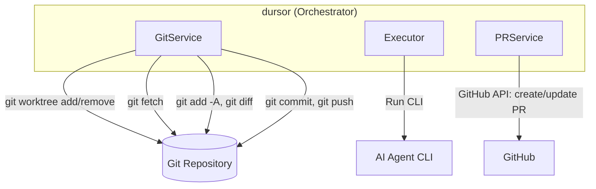
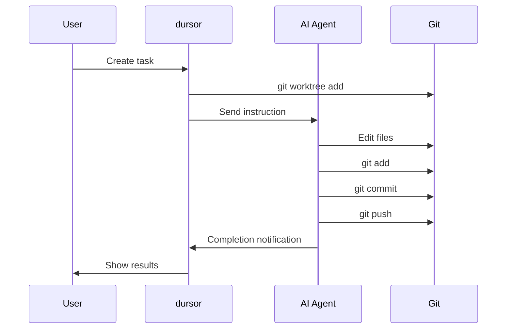
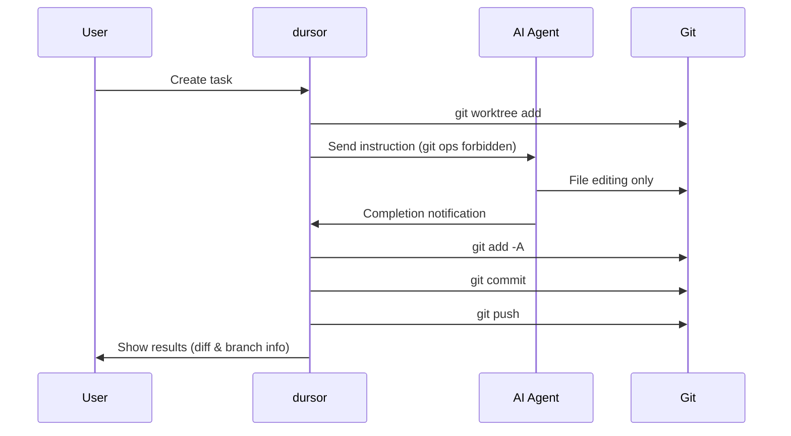
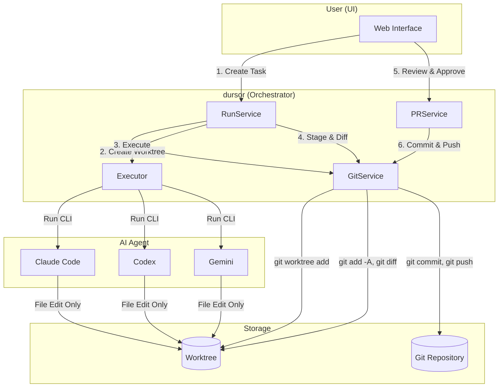
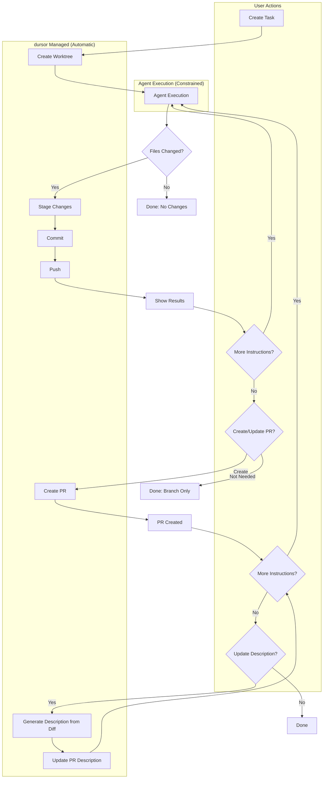
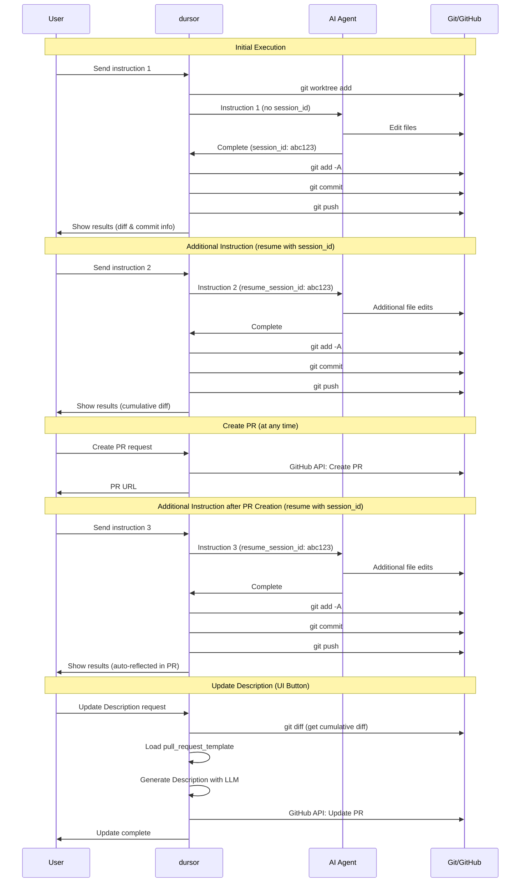
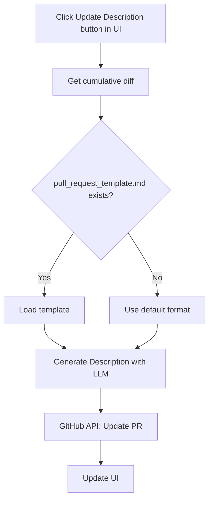
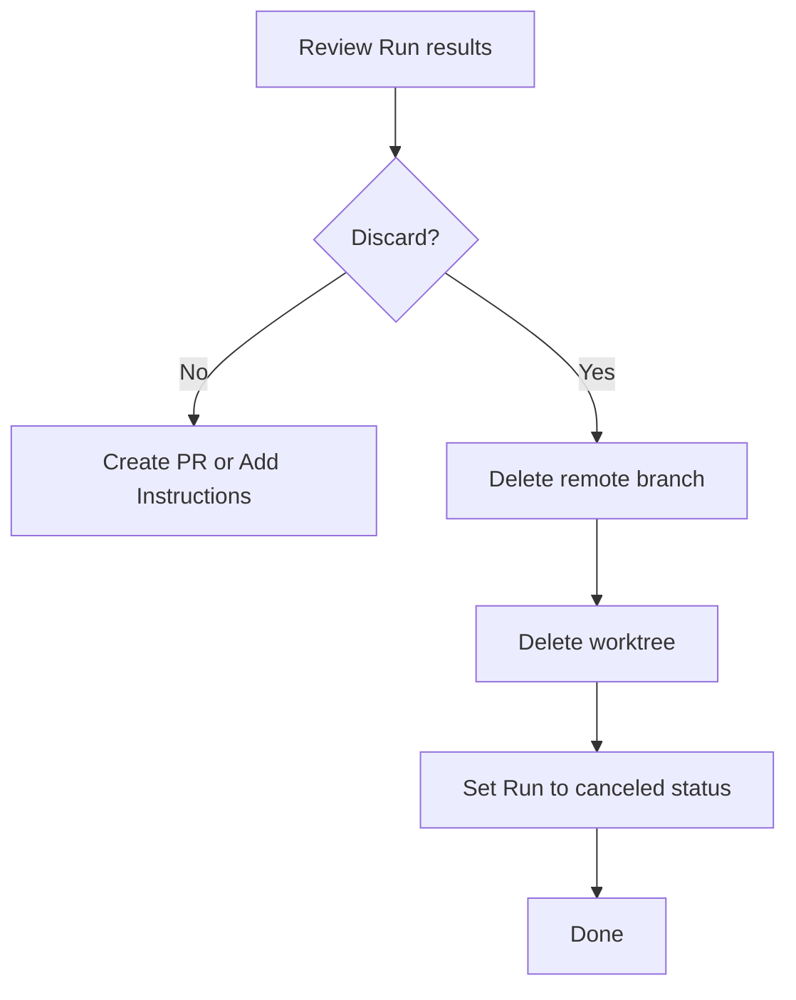
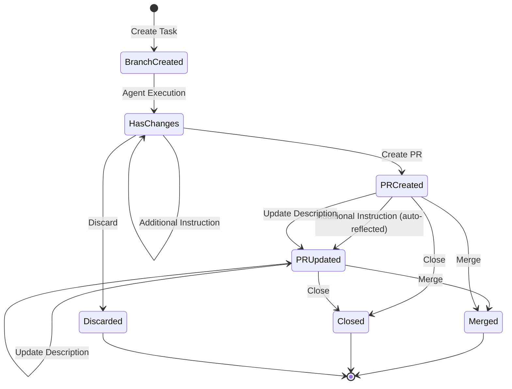

# Git Operation Placement Strategy Design

## Overview

This document defines the design policy for placing git operations (worktree, add, commit, push, etc.) in dursor.

## Current Design (as implemented)



Currently, git operations are centralized in `GitService` and invoked by orchestrator services.
Executors run agent CLIs and do **not** perform git operations (no staging/commit/push).

| Component | Git Operations |
|-----------|---------------|
| `GitService` | `git worktree add/remove`, `git fetch`, `git add -A`, `git diff`, `git commit`, `git push` |
| Each `Executor` | (none) |
| `RunService` | Calls `GitService` after CLI completes (stage/diff/commit/push) |
| `PRService` | GitHub API operations (create/update PR). May retry push at PR creation time if needed |

---

## Design Approach Comparison

### A: Delegate Git Operations to Agent

A method where AI Agents (Claude Code, Codex, Gemini) directly execute git commit/push.



**Pros:**
- Leverages Agent autonomy
- Agent can commit at optimal timing

**Cons:**
- Behavior may differ between Agents
- Risk of unexpected commit/push
- Difficult to isolate issues
- Hard to revert once Agent commits
- Complex multi-model comparison

### B: Orchestrator Manages Git Operations (Recommended)

A method where dursor centrally manages git operations, allowing AI Agents to **only edit files**.



**Pros:**
- Unified git operation flow
- Clear separation of phases for easier debugging
- Unified format for multi-model comparison
- Automated workflow with rapid feedback

**Cons:**
- Workflow constraints
- Agent autonomy is limited

---

## Comparison Table

| Aspect | A: Agent Managed | B: Orchestrator Managed |
|--------|-----------------|------------------------|
| **Consistency** | ❌ Behavior may vary by Agent | ✅ Unified git operation flow |
| **Control** | ❌ Unexpected timing for commit/push | ✅ Fixed timing for commit/push |
| **Debugging** | ❌ Difficult to isolate issues | ✅ Clear phase separation |
| **Multi-model Support** | ❌ Complex diff comparison | ✅ Easy comparison in unified format |
| **Automation** | △ Unstable, Agent-dependent | ✅ Stable automated workflow |
| **Flexibility** | ✅ Leverages Agent autonomy | △ Workflow constraints |

---

## Recommended Design: Orchestrator Management Pattern

### Architecture Overview



### Workflow Details



---

## Implementation Design

### 1. GitService (Centralized)

Unify git operations in `GitService` (worktree/stage/diff/commit/push). Executors should not run git commands.

```python
# apps/api/src/dursor_api/services/git_service.py

class GitService:
    """Service for centralized git operation management"""

    # === Worktree Management ===
    async def create_worktree(
        self, repo: Repo, base_branch: str, run_id: str
    ) -> WorktreeInfo:
        """Create a worktree"""
        pass

    async def cleanup_worktree(
        self, worktree_path: Path, delete_branch: bool = False
    ) -> None:
        """Delete a worktree"""
        pass

    async def list_worktrees(self, repo: Repo) -> list[WorktreeInfo]:
        """List worktrees"""
        pass

    # === Change Management ===
    async def get_status(self, worktree_path: Path) -> GitStatus:
        """Get working directory status"""
        pass

    async def stage_all(self, worktree_path: Path) -> None:
        """Stage all changes"""
        pass

    async def unstage_all(self, worktree_path: Path) -> None:
        """Unstage all changes"""
        pass

    async def get_diff(
        self, worktree_path: Path, staged: bool = True
    ) -> str:
        """Get diff"""
        pass

    async def get_diff_from_base(
        self, worktree_path: Path, base_ref: str
    ) -> str:
        """Get cumulative diff from base branch"""
        pass

    async def reset_changes(
        self, worktree_path: Path, hard: bool = False
    ) -> None:
        """Reset changes"""
        pass

    # === Commit Management ===
    async def commit(
        self, worktree_path: Path, message: str
    ) -> str:
        """Create a commit (returns SHA)"""
        pass

    async def amend(
        self, worktree_path: Path, message: str | None = None
    ) -> str:
        """Amend the last commit"""
        pass

    # === Branch Management ===
    async def create_branch(
        self, repo_path: Path, branch_name: str, base: str
    ) -> None:
        """Create a branch"""
        pass

    async def checkout(self, repo_path: Path, branch_name: str) -> None:
        """Checkout a branch"""
        pass

    async def delete_branch(
        self, repo_path: Path, branch_name: str, force: bool = False
    ) -> None:
        """Delete a branch"""
        pass

    # === Remote Operations ===
    async def push(
        self,
        repo_path: Path,
        branch: str,
        auth_url: str | None = None,
        force: bool = False,
    ) -> None:
        """Push to remote"""
        pass

    async def fetch(
        self, repo_path: Path, remote: str = "origin"
    ) -> None:
        """Fetch from remote"""
        pass

    async def delete_remote_branch(
        self,
        repo_path: Path,
        branch: str,
        auth_url: str | None = None,
    ) -> None:
        """Delete remote branch"""
        pass

    # === Reset Operations ===
    async def reset_to_previous(
        self,
        repo_path: Path,
        soft: bool = False,
    ) -> None:
        """Reset to previous commit (soft: keep changes)"""
        pass
```

### 2. Agent Constraints Definition

```python
# apps/api/src/dursor_api/domain/models.py

@dataclass
class AgentConstraints:
    """Constraints for Agent execution"""

    forbidden_paths: list[str] = field(default_factory=lambda: [
        ".git",
        ".env",
        ".env.*",
        "*.key",
        "*.pem",
    ])

    forbidden_commands: list[str] = field(default_factory=lambda: [
        "git commit",
        "git push",
        "git checkout",
        "git reset --hard",
        "git rebase",
        "git merge",
    ])

    allowed_git_commands: list[str] = field(default_factory=lambda: [
        "git status",
        "git diff",
        "git log",
        "git show",
        "git branch",  # read-only
    ])

    def to_prompt(self) -> str:
        """Convert constraints to prompt format"""
        return f"""
## Important Constraints

### Forbidden Operations
- The following git commands are forbidden: {', '.join(self.forbidden_commands)}
- Only edit files, do not commit or push
- Changes will be automatically detected after editing

### Forbidden Paths
Access to the following paths is forbidden:
{chr(10).join(f'- {p}' for p in self.forbidden_paths)}

### Allowed Git Commands (Read-only)
{chr(10).join(f'- {c}' for c in self.allowed_git_commands)}
"""
```

### 3. BaseExecutor Definition

```python
# apps/api/src/dursor_api/executors/base_executor.py

from abc import ABC, abstractmethod
from pathlib import Path
from collections.abc import Awaitable, Callable

from dursor_api.domain.models import AgentConstraints


class BaseExecutor(ABC):
    """Base class for all Executors"""

    @abstractmethod
    async def execute(
        self,
        worktree_path: Path,
        instruction: str,
        constraints: AgentConstraints | None = None,
        on_output: Callable[[str], Awaitable[None]] | None = None,
        resume_session_id: str | None = None,
    ) -> ExecutorResult:
        """Execute CLI

        Args:
            worktree_path: Working directory
            instruction: Natural language instruction
            constraints: Agent constraints (git ops forbidden, etc.)
            on_output: Callback for output streaming
            resume_session_id: Session ID for continuation

        Returns:
            Execution result
        """
        pass

    def _build_instruction_with_constraints(
        self,
        instruction: str,
        constraints: AgentConstraints | None,
    ) -> str:
        """Build instruction with constraints"""
        if constraints is None:
            return instruction

        return f"{constraints.to_prompt()}\n\n## Task\n{instruction}"
```

### 4. RunService Workflow

```python
# apps/api/src/dursor_api/services/run_service.py

class RunService:
    def __init__(
        self,
        run_dao: RunDAO,
        task_dao: TaskDAO,
        git_service: GitService,
        github_service: GitHubService,
        # ...
    ):
        self.git_service = git_service
        self.github_service = github_service

    async def _execute_cli_run(
        self,
        run: Run,
        worktree_info: WorktreeInfo,
        executor_type: ExecutorType,
        resume_session_id: str | None = None,
    ) -> None:
        """CLI execution workflow (auto commit/push after execution)"""
        logs: list[str] = []

        try:
            await self.run_dao.update_status(run.id, RunStatus.RUNNING)

            # 1. Record pre-execution status
            pre_status = await self.git_service.get_status(worktree_info.path)
            logs.append(f"Pre-execution status: {pre_status}")

            # 2. Execute CLI (file editing only)
            executor = self._get_executor(executor_type)
            result = await executor.execute(
                worktree_path=worktree_info.path,
                instruction=run.instruction,
                constraints=AgentConstraints(),  # Pass constraints
                on_output=lambda line: self._log_output(run.id, line),
                resume_session_id=resume_session_id,
            )

            if not result.success:
                await self.run_dao.update_status(
                    run.id,
                    RunStatus.FAILED,
                    error=result.error,
                    logs=logs + result.logs,
                )
                return

            # 3. Stage changes
            await self.git_service.stage_all(worktree_info.path)

            # 4. Get patch
            patch = await self.git_service.get_diff(
                worktree_info.path, staged=True
            )

            # Skip if no changes
            if not patch.strip():
                logs.append("No changes detected, skipping commit/push")
                await self.run_dao.update_status(
                    run.id,
                    RunStatus.SUCCEEDED,
                    summary="No changes made",
                    patch="",
                    files_changed=[],
                    logs=logs + result.logs,
                    session_id=result.session_id,
                )
                return

            # 5. Commit (automatic)
            commit_message = self._generate_commit_message(run.instruction, result.summary)
            commit_sha = await self.git_service.commit(
                worktree_info.path,
                message=commit_message,
            )
            logs.append(f"Committed: {commit_sha}")

            # 6. Push (automatic)
            task = await self.task_dao.get(run.task_id)
            repo = await self.repo_service.get(task.repo_id)
            owner, repo_name = self._parse_github_url(repo.repo_url)
            auth_url = await self.github_service.get_auth_url(owner, repo_name)
            
            await self.git_service.push(
                worktree_info.path,
                branch=worktree_info.branch_name,
                auth_url=auth_url,
            )
            logs.append(f"Pushed to branch: {worktree_info.branch_name}")

            # 7. Save results
            files_changed = self._parse_diff(patch)
            await self.run_dao.update_status(
                run.id,
                RunStatus.SUCCEEDED,
                summary=result.summary,
                patch=patch,
                files_changed=files_changed,
                logs=logs + result.logs,
                session_id=result.session_id,
                commit_sha=commit_sha,
            )

        except Exception as e:
            await self.run_dao.update_status(
                run.id,
                RunStatus.FAILED,
                error=str(e),
                logs=logs + [f"Execution failed: {e}"],
            )

    def _generate_commit_message(
        self, instruction: str, summary: str
    ) -> str:
        """Generate commit message"""
        # Use first line of instruction (truncate if too long)
        first_line = instruction.split('\n')[0][:72]
        if summary:
            return f"{first_line}\n\n{summary}"
        return first_line
```

### 5. PRService Implementation

Since commit/push is already done during Run execution, PRService handles PR creation and updates.

```python
# apps/api/src/dursor_api/services/pr_service.py

class PRService:
    def __init__(
        self,
        pr_dao: PRDAO,
        task_dao: TaskDAO,
        run_dao: RunDAO,
        repo_service: RepoService,
        git_service: GitService,
        github_service: GitHubService,
        llm_router: LLMRouter,
    ):
        self.github_service = github_service
        self.git_service = git_service
        self.llm_router = llm_router

    async def create_from_run(
        self,
        task_id: str,
        run_id: str,
        pr_data: PRCreate,
    ) -> PR:
        """Create PR from Run's branch (already pushed)"""
        run = await self.run_dao.get(run_id)
        if not run or not run.working_branch:
            raise ValueError(f"Run not found or no branch: {run_id}")

        if not run.commit_sha:
            raise ValueError(f"Run has no commits: {run_id}")

        task = await self.task_dao.get(task_id)
        repo = await self.repo_service.get(task.repo_id)
        owner, repo_name = self._parse_github_url(repo.repo_url)

        # Create PR (branch is already pushed)
        pr_response = await self.github_service.create_pull_request(
            owner=owner,
            repo=repo_name,
            title=pr_data.title,
            head=run.working_branch,
            base=repo.default_branch,
            body=pr_data.body or f"Generated by dursor\n\n{run.summary}",
        )

        # Save to DB
        return await self.pr_dao.create(
            task_id=task_id,
            number=pr_response["number"],
            url=pr_response["html_url"],
            branch=run.working_branch,
            title=pr_data.title,
            body=pr_data.body,
            latest_commit=run.commit_sha,
        )

    async def regenerate_description(
        self,
        task_id: str,
        pr_id: str,
    ) -> PR:
        """Regenerate Description from current Diff and update PR"""
        pr = await self.pr_dao.get(pr_id)
        if not pr or pr.task_id != task_id:
            raise ValueError(f"PR not found: {pr_id}")

        task = await self.task_dao.get(task_id)
        repo = await self.repo_service.get(task.repo_id)
        owner, repo_name = self._parse_github_url(repo.repo_url)

        # Get cumulative diff
        run = await self._get_latest_run_for_pr(pr)
        worktree_path = Path(run.worktree_path)
        
        cumulative_diff = await self.git_service.get_diff_from_base(
            worktree_path=worktree_path,
            base_ref=run.base_ref,
        )

        # Load pull_request_template
        template = await self._load_pr_template(repo)

        # Generate Description with LLM
        new_description = await self._generate_description(
            diff=cumulative_diff,
            template=template,
            task=task,
            pr=pr,
        )

        # Update PR via GitHub API
        await self.github_service.update_pull_request(
            owner=owner,
            repo=repo_name,
            pr_number=pr.number,
            body=new_description,
        )

        # Update DB
        await self.pr_dao.update_body(pr_id, new_description)

        return await self.pr_dao.get(pr_id)

    async def _load_pr_template(self, repo: Repo) -> str | None:
        """Load repository's pull_request_template"""
        workspace_path = Path(repo.workspace_path)
        
        # Template candidate paths (in priority order)
        template_paths = [
            workspace_path / ".github" / "pull_request_template.md",
            workspace_path / ".github" / "PULL_REQUEST_TEMPLATE.md",
            workspace_path / "pull_request_template.md",
            workspace_path / "PULL_REQUEST_TEMPLATE.md",
            workspace_path / ".github" / "PULL_REQUEST_TEMPLATE" / "default.md",
        ]

        for path in template_paths:
            if path.exists():
                return path.read_text()

        return None

    async def _generate_description(
        self,
        diff: str,
        template: str | None,
        task: Task,
        pr: PR,
    ) -> str:
        """Generate PR Description using LLM"""
        
        prompt = self._build_description_prompt(diff, template, task, pr)
        
        # Generate with LLM (using system-configured model)
        response = await self.llm_router.generate(
            prompt=prompt,
            system_prompt="You are a helpful assistant that generates clear and concise PR descriptions.",
        )

        return response

    def _build_description_prompt(
        self,
        diff: str,
        template: str | None,
        task: Task,
        pr: PR,
    ) -> str:
        """Build prompt for Description generation"""
        
        prompt_parts = [
            "Generate a Pull Request Description based on the following information.",
            "",
            "## Task Description",
            task.description or "(None)",
            "",
            "## PR Title",
            pr.title,
            "",
            "## Diff",
            "```diff",
            diff[:10000] if len(diff) > 10000 else diff,  # Truncate if too long
            "```",
        ]

        if template:
            prompt_parts.extend([
                "",
                "## Template",
                "Create the Description following this template format:",
                "",
                template,
            ])
        else:
            prompt_parts.extend([
                "",
                "## Output Format",
                "Create the Description in the following format:",
                "",
                "## Summary",
                "(Overview of changes in 1-3 sentences)",
                "",
                "## Changes",
                "(Main changes as bullet points)",
                "",
                "## Test Plan",
                "(Testing methods and verification items)",
            ])

        return "\n".join(prompt_parts)
```

---

## Conversation Continuation Workflow

Flow for growing a PR through multiple conversations:



### Implementation Example

```python
class RunService:
    async def continue_run(
        self,
        run_id: str,
        additional_instruction: str,
    ) -> Run:
        """Send additional instruction to existing Run (auto commit/push)"""
        existing_run = await self.run_dao.get(run_id)
        if not existing_run:
            raise ValueError(f"Run not found: {run_id}")

        # Reuse same worktree
        worktree_path = Path(existing_run.worktree_path)
        logs: list[str] = []

        # Execute CLI with additional instruction (proactively resume conversation).
        # If the CLI rejects the session (expired/in-use), retry once without it.
        executor = self._get_executor(existing_run.executor_type)
        result = await executor.execute(
            worktree_path=worktree_path,
            instruction=additional_instruction,
            constraints=AgentConstraints(),
            resume_session_id=existing_run.session_id,
        )

        if not result.success:
            await self.run_dao.update_status(
                existing_run.id,
                RunStatus.FAILED,
                error=result.error,
                logs=logs + result.logs,
            )
            return await self.run_dao.get(existing_run.id)

        # Stage changes
        await self.git_service.stage_all(worktree_path)

        # Get diff
        patch = await self.git_service.get_diff(worktree_path, staged=True)

        if patch.strip():
            # Commit
            commit_message = self._generate_commit_message(
                additional_instruction, result.summary
            )
            commit_sha = await self.git_service.commit(
                worktree_path,
                message=commit_message,
            )
            logs.append(f"Committed: {commit_sha}")

            # Push
            task = await self.task_dao.get(existing_run.task_id)
            repo = await self.repo_service.get(task.repo_id)
            owner, repo_name = self._parse_github_url(repo.repo_url)
            auth_url = await self.github_service.get_auth_url(owner, repo_name)

            await self.git_service.push(
                worktree_path,
                branch=existing_run.working_branch,
                auth_url=auth_url,
            )
            logs.append(f"Pushed to branch: {existing_run.working_branch}")

        # Get cumulative diff (diff from base branch)
        cumulative_patch = await self.git_service.get_diff_from_base(
            worktree_path=worktree_path,
            base_ref=existing_run.base_ref,
        )

        # Update results
        await self.run_dao.update_status(
            existing_run.id,
            RunStatus.SUCCEEDED,
            patch=cumulative_patch,
            logs=logs + result.logs,
            session_id=result.session_id or existing_run.session_id,
            commit_sha=commit_sha if patch.strip() else existing_run.commit_sha,
        )

        return await self.run_dao.get(existing_run.id)
```

---

## PR Description Auto-Generation Feature

### Overview

After PR creation, users can auto-generate and update the Description from the current cumulative diff using the "Update Description" button in the UI.

### Flow



### API Endpoint

```
POST /v1/tasks/{task_id}/prs/{pr_id}/regenerate-description
```

**Response:**
```json
{
  "id": "pr_xxx",
  "number": 123,
  "url": "https://github.com/owner/repo/pull/123",
  "title": "Add new feature",
  "body": "(generated description)",
  "branch": "dursor/abc12345",
  "latest_commit": "abc123..."
}
```

### UI Component

```tsx
// apps/web/src/components/PRDetailPanel.tsx

interface PRDetailPanelProps {
  taskId: string;
  pr: PR;
  onUpdate: (pr: PR) => void;
}

export function PRDetailPanel({ taskId, pr, onUpdate }: PRDetailPanelProps) {
  const [isRegenerating, setIsRegenerating] = useState(false);

  const handleRegenerateDescription = async () => {
    setIsRegenerating(true);
    try {
      const updatedPR = await api.regeneratePRDescription(taskId, pr.id);
      onUpdate(updatedPR);
      toast.success('Description updated');
    } catch (error) {
      toast.error('Failed to update Description');
    } finally {
      setIsRegenerating(false);
    }
  };

  return (
    <div className="pr-detail-panel">
      <div className="pr-header">
        <h2>{pr.title}</h2>
        <a href={pr.url} target="_blank" rel="noopener noreferrer">
          #{pr.number}
        </a>
      </div>

      <div className="pr-actions">
        <Button
          onClick={handleRegenerateDescription}
          disabled={isRegenerating}
          variant="secondary"
        >
          {isRegenerating ? (
            <>
              <Spinner size="sm" />
              Generating...
            </>
          ) : (
            <>
              <RefreshIcon />
              Update Description
            </>
          )}
        </Button>
      </div>

      <div className="pr-description">
        <h3>Description</h3>
        <div className="markdown-body">
          <ReactMarkdown>{pr.body}</ReactMarkdown>
        </div>
      </div>
    </div>
  );
}
```

### pull_request_template Search Paths

Templates are searched in the following order:

1. `.github/pull_request_template.md`
2. `.github/PULL_REQUEST_TEMPLATE.md`
3. `pull_request_template.md`
4. `PULL_REQUEST_TEMPLATE.md`
5. `.github/PULL_REQUEST_TEMPLATE/default.md`

---

## Run Discard Feature

Flow for discarding an executed Run (delete branch since already committed/pushed):



### Implementation Example

```python
class RunService:
    async def discard_run(self, run_id: str) -> None:
        """Completely discard Run (delete branch as well)"""
        run = await self.run_dao.get(run_id)
        if not run:
            return

        # Delete remote branch (if pushed)
        if run.working_branch and run.commit_sha:
            try:
                task = await self.task_dao.get(run.task_id)
                repo = await self.repo_service.get(task.repo_id)
                owner, repo_name = self._parse_github_url(repo.repo_url)
                auth_url = await self.github_service.get_auth_url(owner, repo_name)

                await self.git_service.delete_remote_branch(
                    repo_path=Path(repo.workspace_path),
                    branch=run.working_branch,
                    auth_url=auth_url,
                )
            except Exception as e:
                # Continue even if remote deletion fails
                pass

        # Delete worktree (also delete local branch)
        if run.worktree_path:
            await self.git_service.cleanup_worktree(
                Path(run.worktree_path),
                delete_branch=True,
            )

        # Update status
        await self.run_dao.update_status(run.id, RunStatus.CANCELED)

    async def revert_last_commit(self, run_id: str) -> Run:
        """Revert last commit and return to re-executable state"""
        run = await self.run_dao.get(run_id)
        if not run or not run.worktree_path:
            raise ValueError(f"Run not found: {run_id}")

        worktree_path = Path(run.worktree_path)

        # Undo last commit with git reset --soft HEAD~1
        await self.git_service.reset_to_previous(worktree_path, soft=True)

        # Update remote with force push
        task = await self.task_dao.get(run.task_id)
        repo = await self.repo_service.get(task.repo_id)
        owner, repo_name = self._parse_github_url(repo.repo_url)
        auth_url = await self.github_service.get_auth_url(owner, repo_name)

        await self.git_service.push(
            worktree_path,
            branch=run.working_branch,
            auth_url=auth_url,
            force=True,
        )

        return await self.run_dao.get(run_id)
```

---

## Summary

### Key Points of Recommended Design

1. **Separation of Responsibilities**: AI Agent only edits files, dursor centrally manages git operations
2. **Automated Workflow**: Auto commit/push after Agent execution, rapid feedback
3. **Consistency**: Same git workflow regardless of which Agent is used
4. **Conversation Continuation**: Layer multiple instructions on the same branch to grow PR (continues after PR creation)
5. **Description Auto-Generation**: Generate Description with LLM following pull_request_template
6. **Debugging Ease**: Separate "file editing" and "git operations" for easier issue investigation

### Workflow Key Points

| Phase | Operation | Executor |
|-------|-----------|----------|
| Preparation | git worktree add | dursor |
| Execution | File editing | AI Agent |
| Save | git add, commit, push | dursor (automatic) |
| Create PR | GitHub API: Create PR | dursor (on user request) |
| Update PR | Additional instruction → commit/push (auto-reflected) | dursor |
| Update Description | Diff + template → LLM generation → GitHub API | dursor (UI button) |
| Discard | Delete branch | dursor (on user request) |

### PR Lifecycle



### Future Extensions

- Re-execution trigger from PR comments
- Multiple Run merge feature
- Conflict resolution support
- Branch strategy customization (squash, rebase, etc.)
- Commit message customization options
- Description template customization
