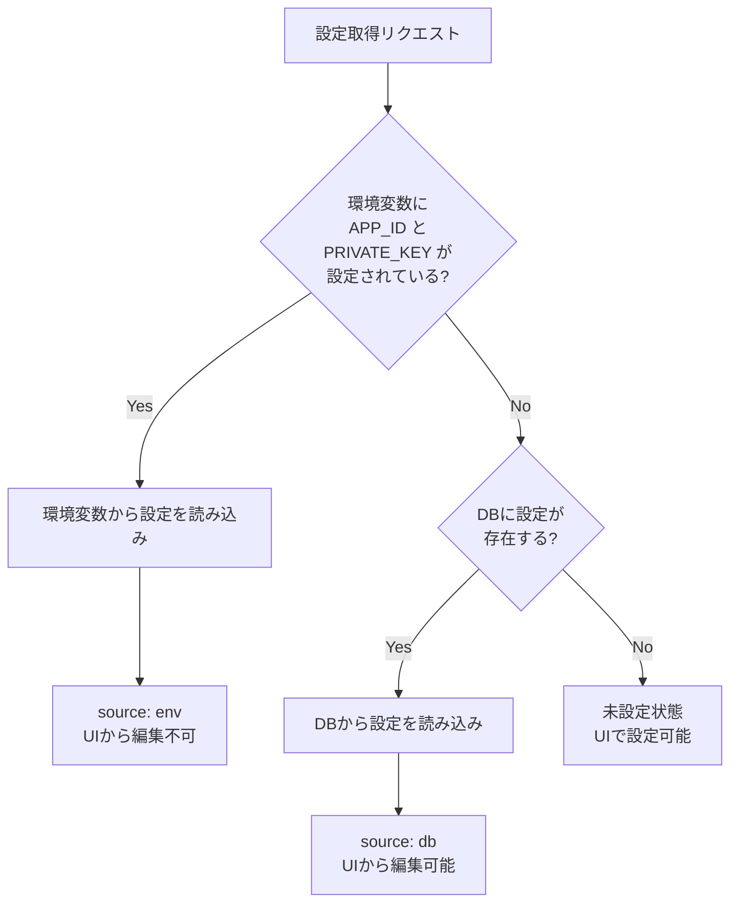
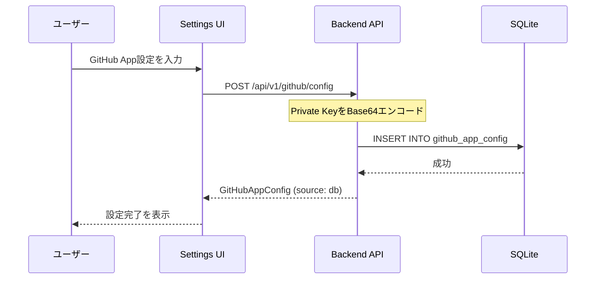
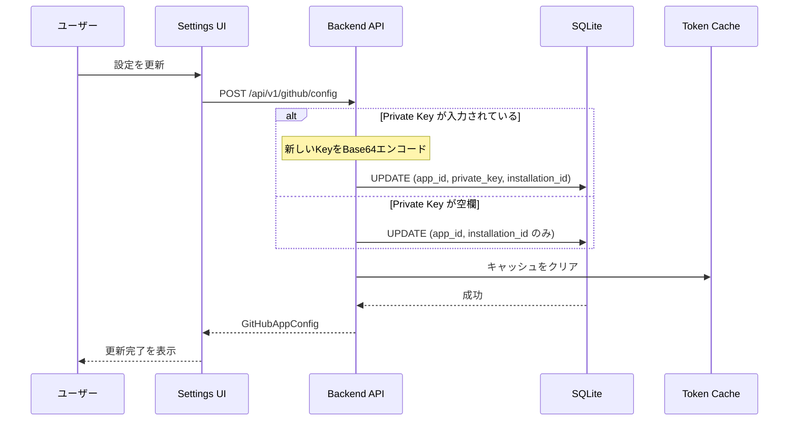
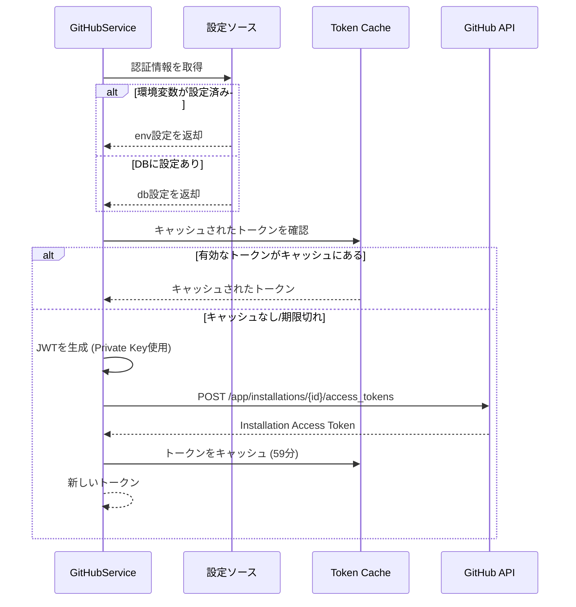
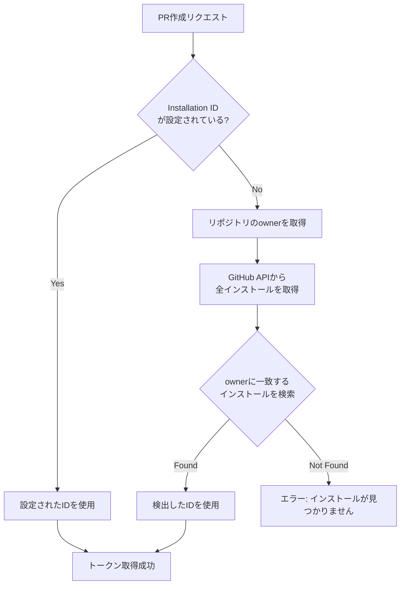

# GitHub App 設定ガイド

GitHub Appは、zlothがPull Requestの作成やリポジトリへのプッシュを行うために必要です。

## 設定方法

GitHub Appの設定は**2つの方法**で行えます：

1. **環境変数 (.env)** - 本番環境・セキュアなデプロイ向け
2. **Settings UI** - 開発環境・小規模デプロイ向け

### 優先順位

環境変数が設定されている場合、環境変数の設定が**常に優先**されます。



## 環境変数での設定

`.env`ファイルに以下の変数を設定します：

```bash
# 必須
ZLOTH_GITHUB_APP_ID=123456
ZLOTH_GITHUB_APP_PRIVATE_KEY=LS0tLS1CRUdJTi...  # Base64エンコード

# オプション（設定しない場合は自動検出）
ZLOTH_GITHUB_APP_INSTALLATION_ID=12345678
```

### Private Keyのエンコード

GitHub Appからダウンロードした`.pem`ファイルをBase64エンコードします：

```bash
# macOS/Linux
base64 -w 0 < your-app.private-key.pem

# または
cat your-app.private-key.pem | base64 -w 0
```

### 環境変数設定時のUI表示

環境変数で設定されている場合、Settings UIには以下のように表示されます：

- 設定値は**読み取り専用**で表示
- App IDはマスク表示（例: `123***`）
- Private Keyは「Configured」と表示
- 「設定を変更するには.envを編集してアプリケーションを再起動してください」というメッセージが表示

## Settings UIでの設定

環境変数が設定されていない場合、Settings画面から設定できます。

### 設定手順

1. 画面右上の歯車アイコンをクリック
2. 「GitHub App」タブを選択
3. 以下の情報を入力：
   - **App ID**: GitHub Appの数値ID
   - **Private Key**: `.pem`ファイルの内容（Base64エンコード不要、そのまま貼り付け）
   - **Installation ID**: （オプション）特定のインストールを指定する場合

4. 「Save」をクリック

### 設定の更新

既存の設定を更新する場合：

- **App ID**: 新しい値を入力
- **Private Key**: 変更する場合のみ入力（空欄の場合は既存のキーを保持）
- **Installation ID**: 変更する場合は新しい値を入力

## 設定フロー詳細

### 初回設定（UI経由）



### 設定更新（UI経由）



### 認証トークン取得フロー



## Installation ID の自動検出

Installation IDを指定しない場合、zlothは自動的に適切なインストールを検出します。



## トークンキャッシュ

GitHub App Installation Access Tokenは効率的にキャッシュされます：

| 項目 | 値 |
|------|-----|
| キャッシュキー | `{app_id}:{installation_id}` |
| トークン有効期限 | 1時間 (GitHub制限) |
| リフレッシュバッファ | 1分 |
| キャッシュクリア条件 | 設定保存時、アプリ再起動時 |

## 設定状態の確認

### API経由

```bash
curl http://localhost:8000/api/v1/github/config
```

レスポンス例：

```json
{
  "app_id": "123456",
  "app_id_masked": "123***",
  "installation_id": "12345678",
  "has_private_key": true,
  "is_configured": true,
  "source": "env"
}
```

### 設定ソースの意味

| source | 意味 | UIでの編集 |
|--------|------|-----------|
| `env` | 環境変数から読み込み | 不可（読み取り専用） |
| `db` | データベースから読み込み | 可能 |
| なし | 未設定 | 新規設定可能 |

## データベーススキーマ

```sql
CREATE TABLE IF NOT EXISTS github_app_config (
    id INTEGER PRIMARY KEY CHECK (id = 1),  -- シングルトン制約
    app_id TEXT NOT NULL,
    private_key TEXT NOT NULL,              -- Base64エンコード済み
    installation_id TEXT,                   -- NULLの場合は自動検出
    created_at TEXT NOT NULL DEFAULT (datetime('now')),
    updated_at TEXT NOT NULL DEFAULT (datetime('now'))
);
```

**ポイント**:
- `id = 1` の制約により、設定は常に1レコードのみ
- `private_key` はBase64エンコードして保存
- `installation_id` はオプション（NULLの場合は自動検出）

## セキュリティ考慮事項

### Private Keyの保護

- **環境変数**: `.env`ファイルはリポジトリにコミットしない
- **データベース**: Private KeyはBase64エンコードして保存（暗号化ではない）
- **API**: Private Keyの値はAPIレスポンスに含まれない（`has_private_key: true/false`のみ）

### 推奨設定方法

| 環境 | 推奨設定方法 |
|------|-------------|
| 本番環境 | 環境変数 |
| ステージング | 環境変数 |
| 開発環境 | Settings UI または 環境変数 |
| ローカル開発 | Settings UI |

## トラブルシューティング

### よくある問題

**Q: UIで設定を変更できない**
A: 環境変数が設定されている場合、UIからの変更はできません。`.env`ファイルを編集してアプリケーションを再起動してください。

**Q: PR作成時に「Installation not found」エラー**
A:
1. GitHub Appが対象リポジトリにインストールされているか確認
2. Installation IDを明示的に設定してみる
3. GitHub Appに必要な権限（Contents, Pull requests）があるか確認

**Q: 「Private key is required」エラー**
A: 初回設定時はPrivate Keyが必須です。既存設定の更新時のみ空欄にできます。

**Q: トークン取得に失敗する**
A:
1. Private Keyの形式を確認（PEMフォーマット）
2. App IDが正しいか確認
3. GitHub Appが有効か確認

## 関連ファイル

| ファイル | 説明 |
|---------|------|
| `apps/api/src/zloth_api/config.py` | 環境変数の定義 |
| `apps/api/src/zloth_api/services/github_service.py` | GitHub App認証ロジック |
| `apps/api/src/zloth_api/routes/github.py` | APIエンドポイント |
| `apps/api/src/zloth_api/storage/schema.sql` | DBスキーマ定義 |
| `apps/web/src/components/SettingsModal.tsx` | Settings UI実装 |
