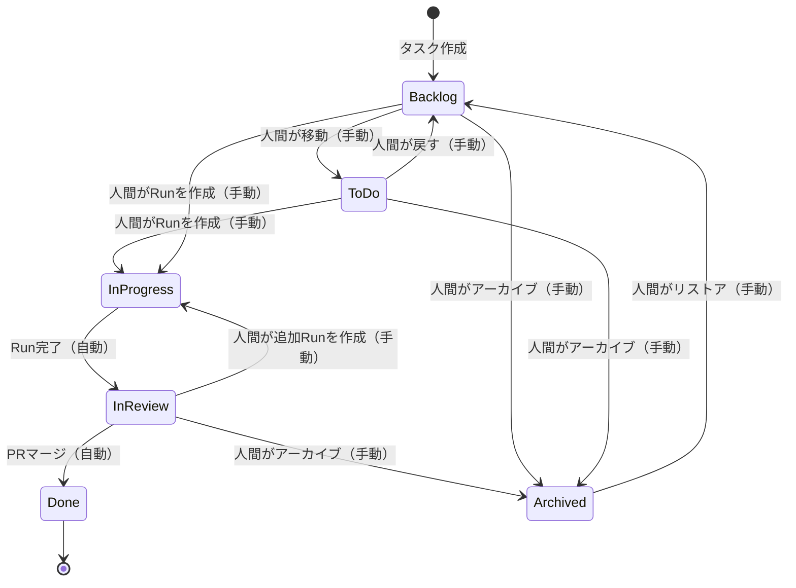

# 看板（Kanban）機能 実装計画

## 概要

dursor に看板ページを追加し、タスクの進捗を視覚的に管理できるようにする。

## ステータス定義

| ステータス | 説明 | 判定条件 | 遷移方法 |
|-----------|------|----------|----------|
| **Backlog** | タスク作成済み、アイデア段階 | デフォルト状態 | 初期状態 |
| **ToDo** | 実装予定、準備完了 | 人間が明示的に移動 | **手動**（Backlog→ToDo） |
| **InProgress** | AIが実装中 | 1つ以上のRunがrunning | **手動でRun作成**→自動遷移 |
| **InReview** | 人間のレビュー待ち | すべてのRunが完了かつPRがない or PRがopen | Run完了時に**自動遷移** |
| **Done** | 完了 | PRがマージされた | マージ検出で**自動遷移** |
| **Archived** | アーカイブ済み | 明示的にアーカイブ | **手動** |

## ステータス遷移図



## 遷移ルールの詳細

### 手動遷移（人間の操作が必要）
1. **Backlog → ToDo**: ドラッグ＆ドロップまたはボタンクリック
2. **ToDo → Backlog**: ドラッグ＆ドロップまたはボタンクリック（戻す）
3. **ToDo → InProgress**: タスク詳細画面でRunを作成（AIに依頼）
4. **InReview → InProgress**: タスク詳細画面で追加Runを作成
5. **任意 → Archived**: アーカイブボタン
6. **Archived → Backlog**: リストアボタン

### 自動遷移（システムが検出）
1. **→ InProgress**: Runのstatusがrunningになった時点
2. **InProgress → InReview**: すべてのRunが完了（succeeded/failed/canceled）した時点
3. **InReview → Done**: PRがマージされた時点（GitHub API経由で検出）

## 現状分析

### 既存のデータモデル

#### Task（`apps/api/src/dursor_api/domain/models.py`）
```python
class Task(BaseModel):
    id: str
    repo_id: str
    title: str | None
    created_at: datetime
    updated_at: datetime
    # ステータスフィールドなし
```

#### Run
```python
class RunStatus(str, Enum):
    QUEUED = "queued"
    RUNNING = "running"
    SUCCEEDED = "succeeded"
    FAILED = "failed"
    CANCELED = "canceled"
```

#### PR
```python
class PR(BaseModel):
    id: str
    task_id: str
    number: int
    url: str
    branch: str
    title: str
    body: str | None
    latest_commit: str
    status: str  # 現状は "open" のみ
    created_at: datetime
    updated_at: datetime
```

### 課題
1. **Taskにステータスフィールドがない** - Backlog/ToDoの区別は人間が手動で行うため、明示的なステータス保存が必要
2. **PRのマージ状態が追跡されていない** - GitHub APIからマージ状態を取得・更新する必要がある
3. **アーカイブ機能がない** - ステータスとして管理する

### 設計方針
- **ハイブリッドアプローチ**: 基本ステータス（backlog/todo/archived）はDBに保存し、実行中ステータス（in_progress/in_review/done）はRun/PRの状態から動的に計算
- 動的計算が保存ステータスより優先される

---

## 実装計画

### フェーズ1: バックエンド拡張

#### 1.1 データベーススキーマ変更

```sql
-- apps/api/src/dursor_api/storage/schema.sql

-- tasks テーブルに kanban_status カラムを追加
-- 保存されるのは 'backlog', 'todo', 'archived' のみ
-- 'in_progress', 'in_review', 'done' は Run/PR から動的に計算
ALTER TABLE tasks ADD COLUMN kanban_status TEXT NOT NULL DEFAULT 'backlog';

-- prs テーブルの status カラムを拡張（open, merged, closed）
-- 既存データの status は "open" のまま
```

#### 1.2 ドメインモデル拡張

```python
# apps/api/src/dursor_api/domain/enums.py

class TaskKanbanStatus(str, Enum):
    """Task kanban status.
    
    - backlog, todo, archived: DBに保存（人間が手動で設定）
    - in_progress, in_review, done: Run/PRから動的に計算（DBより優先）
    """
    BACKLOG = "backlog"
    TODO = "todo"
    IN_PROGRESS = "in_progress"
    IN_REVIEW = "in_review"
    DONE = "done"
    ARCHIVED = "archived"


class TaskBaseKanbanStatus(str, Enum):
    """Task base kanban status (stored in DB, manually set by human)."""
    BACKLOG = "backlog"
    TODO = "todo"
    ARCHIVED = "archived"


class PRStatus(str, Enum):
    """PR status on GitHub."""
    OPEN = "open"
    MERGED = "merged"
    CLOSED = "closed"
```

```python
# apps/api/src/dursor_api/domain/models.py

class Task(BaseModel):
    id: str
    repo_id: str
    title: str | None
    kanban_status: str = "backlog"  # 追加: 基本ステータス（backlog/todo/archived）
    created_at: datetime
    updated_at: datetime


class TaskWithKanbanStatus(Task):
    """Task with computed kanban status."""
    computed_status: TaskKanbanStatus  # 最終的な看板ステータス（動的計算含む）
    run_count: int = 0
    running_count: int = 0  # running状態のRun数
    completed_count: int = 0  # 完了したRun数
    pr_count: int = 0
    latest_pr_status: str | None = None


class KanbanColumn(BaseModel):
    """Kanban column with tasks."""
    status: TaskKanbanStatus
    tasks: list[TaskWithKanbanStatus]
    count: int


class KanbanBoard(BaseModel):
    """Full kanban board response."""
    columns: list[KanbanColumn]
    total_tasks: int
```

#### 1.3 DAO拡張

```python
# apps/api/src/dursor_api/storage/dao.py

class TaskDAO:
    async def update_kanban_status(
        self, task_id: str, status: TaskBaseKanbanStatus
    ) -> None:
        """Update task kanban status (backlog/todo/archived only)."""
        ...

    async def list_with_aggregates(self, repo_id: str | None = None) -> list[dict]:
        """List tasks with run/PR aggregation for kanban status calculation.
        
        Returns tasks with:
        - run_count: total runs
        - running_count: runs with status='running'
        - completed_count: runs with status in (succeeded, failed, canceled)
        - pr_count: total PRs
        - latest_pr_status: most recent PR status
        """
        # JOIN query to get run counts, PR statuses, etc.
        query = """
            SELECT 
                t.*,
                COALESCE(r.run_count, 0) as run_count,
                COALESCE(r.running_count, 0) as running_count,
                COALESCE(r.completed_count, 0) as completed_count,
                COALESCE(p.pr_count, 0) as pr_count,
                p.latest_pr_status
            FROM tasks t
            LEFT JOIN (
                SELECT 
                    task_id,
                    COUNT(*) as run_count,
                    SUM(CASE WHEN status = 'running' THEN 1 ELSE 0 END) as running_count,
                    SUM(CASE WHEN status IN ('succeeded', 'failed', 'canceled') THEN 1 ELSE 0 END) as completed_count
                FROM runs
                GROUP BY task_id
            ) r ON t.id = r.task_id
            LEFT JOIN (
                SELECT 
                    task_id,
                    COUNT(*) as pr_count,
                    (SELECT status FROM prs WHERE task_id = p2.task_id ORDER BY created_at DESC LIMIT 1) as latest_pr_status
                FROM prs p2
                GROUP BY task_id
            ) p ON t.id = p.task_id
            WHERE (:repo_id IS NULL OR t.repo_id = :repo_id)
            ORDER BY t.updated_at DESC
        """
        ...


class PRDAO:
    async def update_status(self, pr_id: str, status: str) -> None:
        """Update PR status (open/merged/closed)."""
        ...
```

#### 1.4 看板サービス

```python
# apps/api/src/dursor_api/services/kanban_service.py

class KanbanService:
    """看板ステータス管理サービス.
    
    ステータス計算の優先順位:
    1. PRがマージ済み → Done（最優先）
    2. Runがrunning → InProgress
    3. Runがすべて完了 → InReview
    4. DBに保存された基本ステータス（backlog/todo/archived）
    """

    def __init__(
        self,
        task_dao: TaskDAO,
        run_dao: RunDAO,
        pr_dao: PRDAO,
        github_service: GitHubService,
    ):
        ...

    def _compute_kanban_status(
        self,
        base_status: str,  # DBに保存されたステータス（backlog/todo/archived）
        run_count: int,
        running_count: int,
        completed_count: int,
        latest_pr_status: str | None,
    ) -> TaskKanbanStatus:
        """Compute final kanban status.
        
        動的計算が基本ステータスより優先される。
        """
        # 1. PRがマージ済み → Done（最優先）
        if latest_pr_status == "merged":
            return TaskKanbanStatus.DONE

        # 2. Runがrunning → InProgress
        if running_count > 0:
            return TaskKanbanStatus.IN_PROGRESS

        # 3. Runがあり、すべて完了 → InReview
        if run_count > 0 and completed_count == run_count:
            return TaskKanbanStatus.IN_REVIEW

        # 4. 基本ステータスを使用（backlog/todo/archived）
        # Runがqueuedの場合もここに来る（まだ開始していない）
        return TaskKanbanStatus(base_status)

    async def get_board(self, repo_id: str | None = None) -> KanbanBoard:
        """Get full kanban board."""
        tasks_with_aggregates = await self.task_dao.list_with_aggregates(repo_id)
        
        # Group tasks by computed status
        columns: dict[TaskKanbanStatus, list[TaskWithKanbanStatus]] = {
            status: [] for status in TaskKanbanStatus
        }
        
        for task_data in tasks_with_aggregates:
            computed_status = self._compute_kanban_status(
                base_status=task_data["kanban_status"],
                run_count=task_data["run_count"],
                running_count=task_data["running_count"],
                completed_count=task_data["completed_count"],
                latest_pr_status=task_data["latest_pr_status"],
            )
            
            task_with_status = TaskWithKanbanStatus(
                **task_data,
                computed_status=computed_status,
            )
            columns[computed_status].append(task_with_status)
        
        return KanbanBoard(
            columns=[
                KanbanColumn(status=status, tasks=tasks, count=len(tasks))
                for status, tasks in columns.items()
            ],
            total_tasks=sum(len(tasks) for tasks in columns.values()),
        )

    async def move_to_todo(self, task_id: str) -> Task:
        """Move task from Backlog to ToDo (manual)."""
        task = await self.task_dao.get(task_id)
        if not task:
            raise ValueError(f"Task not found: {task_id}")
        
        # Only allow moving from backlog
        if task.kanban_status != "backlog":
            raise ValueError(f"Can only move from backlog to todo, current: {task.kanban_status}")
        
        await self.task_dao.update_kanban_status(task_id, TaskBaseKanbanStatus.TODO)
        return await self.task_dao.get(task_id)

    async def move_to_backlog(self, task_id: str) -> Task:
        """Move task back to Backlog (manual)."""
        task = await self.task_dao.get(task_id)
        if not task:
            raise ValueError(f"Task not found: {task_id}")
        
        # Only allow moving from todo or archived
        if task.kanban_status not in ("todo", "archived"):
            raise ValueError(f"Can only move to backlog from todo/archived, current: {task.kanban_status}")
        
        await self.task_dao.update_kanban_status(task_id, TaskBaseKanbanStatus.BACKLOG)
        return await self.task_dao.get(task_id)

    async def archive_task(self, task_id: str) -> Task:
        """Archive a task (manual)."""
        await self.task_dao.update_kanban_status(task_id, TaskBaseKanbanStatus.ARCHIVED)
        return await self.task_dao.get(task_id)

    async def unarchive_task(self, task_id: str) -> Task:
        """Unarchive a task (restore to backlog)."""
        await self.task_dao.update_kanban_status(task_id, TaskBaseKanbanStatus.BACKLOG)
        return await self.task_dao.get(task_id)

    async def sync_pr_status(self, task_id: str, pr_id: str) -> PR:
        """Sync PR status from GitHub."""
        # Call GitHub API to get PR state (open/merged/closed)
        ...
```

#### 1.5 APIエンドポイント

```python
# apps/api/src/dursor_api/routes/kanban.py

router = APIRouter(prefix="/kanban", tags=["kanban"])


@router.get("", response_model=KanbanBoard)
async def get_kanban_board(
    repo_id: str | None = None,
    kanban_service: KanbanService = Depends(get_kanban_service),
) -> KanbanBoard:
    """Get kanban board with all columns."""
    return await kanban_service.get_board(repo_id)


@router.post("/tasks/{task_id}/move-to-todo", response_model=Task)
async def move_to_todo(
    task_id: str,
    kanban_service: KanbanService = Depends(get_kanban_service),
) -> Task:
    """Move task from Backlog to ToDo (manual transition)."""
    return await kanban_service.move_to_todo(task_id)


@router.post("/tasks/{task_id}/move-to-backlog", response_model=Task)
async def move_to_backlog(
    task_id: str,
    kanban_service: KanbanService = Depends(get_kanban_service),
) -> Task:
    """Move task back to Backlog (manual transition)."""
    return await kanban_service.move_to_backlog(task_id)


@router.post("/tasks/{task_id}/archive", response_model=Task)
async def archive_task(
    task_id: str,
    kanban_service: KanbanService = Depends(get_kanban_service),
) -> Task:
    """Archive a task (manual transition)."""
    return await kanban_service.archive_task(task_id)


@router.post("/tasks/{task_id}/unarchive", response_model=Task)
async def unarchive_task(
    task_id: str,
    kanban_service: KanbanService = Depends(get_kanban_service),
) -> Task:
    """Unarchive a task (restore to backlog)."""
    return await kanban_service.unarchive_task(task_id)


@router.post("/tasks/{task_id}/prs/{pr_id}/sync-status", response_model=PR)
async def sync_pr_status(
    task_id: str,
    pr_id: str,
    kanban_service: KanbanService = Depends(get_kanban_service),
) -> PR:
    """Sync PR status from GitHub (check if merged/closed)."""
    return await kanban_service.sync_pr_status(task_id, pr_id)
```

#### 1.6 GitHub Service拡張

```python
# apps/api/src/dursor_api/services/github_service.py

class GitHubService:
    async def get_pull_request_status(
        self,
        owner: str,
        repo: str,
        pr_number: int,
    ) -> dict:
        """Get PR status from GitHub API.
        
        Returns:
            {
                "state": "open" | "closed",
                "merged": bool,
                "merged_at": str | None,
            }
        """
        # GET /repos/{owner}/{repo}/pulls/{pr_number}
        ...
```

---

### フェーズ2: フロントエンド実装

#### 2.1 型定義追加

```typescript
// apps/web/src/types.ts

export type TaskKanbanStatus = 
  | 'backlog'
  | 'todo'
  | 'in_progress'
  | 'in_review'
  | 'done'
  | 'archived';

export interface TaskWithKanbanStatus extends Task {
  kanban_status: TaskKanbanStatus;
  run_count: number;
  pr_count: number;
  latest_pr_status: string | null;
}

export interface KanbanColumn {
  status: TaskKanbanStatus;
  tasks: TaskWithKanbanStatus[];
  count: number;
}

export interface KanbanBoard {
  columns: KanbanColumn[];
  total_tasks: number;
}
```

#### 2.2 APIクライアント追加

```typescript
// apps/web/src/lib/api.ts

export const kanbanApi = {
  getBoard: (repoId?: string) => {
    const params = repoId ? `?repo_id=${repoId}` : '';
    return fetchApi<KanbanBoard>(`/kanban${params}`);
  },

  moveToTodo: (taskId: string) =>
    fetchApi<Task>(`/kanban/tasks/${taskId}/move-to-todo`, { method: 'POST' }),

  moveToBacklog: (taskId: string) =>
    fetchApi<Task>(`/kanban/tasks/${taskId}/move-to-backlog`, { method: 'POST' }),

  archiveTask: (taskId: string) =>
    fetchApi<Task>(`/kanban/tasks/${taskId}/archive`, { method: 'POST' }),

  unarchiveTask: (taskId: string) =>
    fetchApi<Task>(`/kanban/tasks/${taskId}/unarchive`, { method: 'POST' }),

  syncPRStatus: (taskId: string, prId: string) =>
    fetchApi<PR>(`/kanban/tasks/${taskId}/prs/${prId}/sync-status`, {
      method: 'POST',
    }),
};
```

#### 2.3 看板ページ

```
apps/web/src/app/kanban/
├── page.tsx          # 看板メインページ
└── components/
    ├── KanbanBoard.tsx    # 看板ボード全体
    ├── KanbanColumn.tsx   # 各カラム
    ├── KanbanCard.tsx     # タスクカード
    └── KanbanFilters.tsx  # フィルター・検索
```

##### ページ構造

```tsx
// apps/web/src/app/kanban/page.tsx
'use client';

import { useState } from 'react';
import useSWR from 'swr';
import { kanbanApi } from '@/lib/api';
import { KanbanBoard } from './components/KanbanBoard';
import { KanbanFilters } from './components/KanbanFilters';

export default function KanbanPage() {
  const [selectedRepo, setSelectedRepo] = useState<string | null>(null);
  
  const { data: board, isLoading, mutate } = useSWR(
    ['kanban', selectedRepo],
    () => kanbanApi.getBoard(selectedRepo ?? undefined),
    { refreshInterval: 5000 }
  );

  return (
    <div className="h-screen flex flex-col">
      <header className="p-4 border-b border-gray-800">
        <h1 className="text-xl font-bold">Kanban Board</h1>
        <KanbanFilters
          selectedRepo={selectedRepo}
          onRepoChange={setSelectedRepo}
        />
      </header>
      
      <main className="flex-1 overflow-x-auto p-4">
        {isLoading ? (
          <KanbanSkeleton />
        ) : board ? (
          <KanbanBoard board={board} onUpdate={mutate} />
        ) : (
          <EmptyState />
        )}
      </main>
    </div>
  );
}
```

##### カラムコンポーネント

```tsx
// apps/web/src/app/kanban/components/KanbanColumn.tsx

interface KanbanColumnProps {
  column: KanbanColumn;
  onMoveToTodo: (taskId: string) => void;
  onMoveToBacklog: (taskId: string) => void;
  onArchive: (taskId: string) => void;
  onUnarchive: (taskId: string) => void;
}

const COLUMN_CONFIG: Record<TaskKanbanStatus, {
  label: string;
  color: string;
  icon: React.ComponentType;
  description: string;
}> = {
  backlog: { 
    label: 'Backlog', 
    color: 'gray', 
    icon: InboxIcon,
    description: 'アイデア・未整理のタスク',
  },
  todo: { 
    label: 'ToDo', 
    color: 'blue', 
    icon: ClipboardIcon,
    description: '実装準備完了、AIへの依頼待ち',
  },
  in_progress: { 
    label: 'In Progress', 
    color: 'yellow', 
    icon: CogIcon,
    description: 'AIが実装中',
  },
  in_review: { 
    label: 'In Review', 
    color: 'purple', 
    icon: EyeIcon,
    description: '人間のレビュー待ち',
  },
  done: { 
    label: 'Done', 
    color: 'green', 
    icon: CheckCircleIcon,
    description: 'PRマージ済み',
  },
  archived: { 
    label: 'Archived', 
    color: 'gray', 
    icon: ArchiveBoxIcon,
    description: 'アーカイブ済み',
  },
};

export function KanbanColumn({ 
  column, 
  onMoveToTodo,
  onMoveToBacklog,
  onArchive, 
  onUnarchive,
}: KanbanColumnProps) {
  const config = COLUMN_CONFIG[column.status];
  
  return (
    <div className="flex-shrink-0 w-80 bg-gray-900 rounded-lg">
      <div className="p-3 border-b border-gray-800">
        <div className="flex items-center gap-2">
          <config.icon className="w-5 h-5" />
          <span className="font-medium">{config.label}</span>
          <span className="ml-auto text-sm text-gray-500">{column.count}</span>
        </div>
        <p className="text-xs text-gray-500 mt-1">{config.description}</p>
      </div>
      
      <div className="p-2 space-y-2 max-h-[calc(100vh-200px)] overflow-y-auto">
        {column.tasks.map((task) => (
          <KanbanCard
            key={task.id}
            task={task}
            columnStatus={column.status}
            onMoveToTodo={onMoveToTodo}
            onMoveToBacklog={onMoveToBacklog}
            onArchive={onArchive}
            onUnarchive={onUnarchive}
          />
        ))}
      </div>
    </div>
  );
}
```

##### タスクカード

```tsx
// apps/web/src/app/kanban/components/KanbanCard.tsx

interface KanbanCardProps {
  task: TaskWithKanbanStatus;
  columnStatus: TaskKanbanStatus;
  onMoveToTodo: (taskId: string) => void;
  onMoveToBacklog: (taskId: string) => void;
  onArchive: (taskId: string) => void;
  onUnarchive: (taskId: string) => void;
}

export function KanbanCard({ 
  task, 
  columnStatus,
  onMoveToTodo,
  onMoveToBacklog,
  onArchive, 
  onUnarchive,
}: KanbanCardProps) {
  // カードのアクションボタンを決定
  const renderActions = () => {
    switch (columnStatus) {
      case 'backlog':
        return (
          <div className="flex gap-2">
            <button
              onClick={(e) => {
                e.preventDefault();
                onMoveToTodo(task.id);
              }}
              className="text-xs text-blue-400 hover:text-blue-300"
            >
              → ToDo
            </button>
            <button
              onClick={(e) => {
                e.preventDefault();
                onArchive(task.id);
              }}
              className="text-xs text-gray-400 hover:text-gray-300"
            >
              Archive
            </button>
          </div>
        );
      
      case 'todo':
        return (
          <div className="flex gap-2">
            <Link
              href={`/tasks/${task.id}`}
              className="text-xs text-green-400 hover:text-green-300"
              onClick={(e) => e.stopPropagation()}
            >
              AIに依頼 →
            </Link>
            <button
              onClick={(e) => {
                e.preventDefault();
                onMoveToBacklog(task.id);
              }}
              className="text-xs text-gray-400 hover:text-gray-300"
            >
              ← Backlog
            </button>
          </div>
        );
      
      case 'in_progress':
        return (
          <span className="text-xs text-yellow-400 flex items-center gap-1">
            <SpinnerIcon className="w-3 h-3 animate-spin" />
            実行中...
          </span>
        );
      
      case 'in_review':
        return (
          <div className="flex gap-2">
            <Link
              href={`/tasks/${task.id}`}
              className="text-xs text-purple-400 hover:text-purple-300"
              onClick={(e) => e.stopPropagation()}
            >
              レビュー
            </Link>
            <button
              onClick={(e) => {
                e.preventDefault();
                onArchive(task.id);
              }}
              className="text-xs text-gray-400 hover:text-gray-300"
            >
              Archive
            </button>
          </div>
        );
      
      case 'done':
        return (
          <span className="text-xs text-green-400 flex items-center gap-1">
            <CheckIcon className="w-3 h-3" />
            Merged
          </span>
        );
      
      case 'archived':
        return (
          <button
            onClick={(e) => {
              e.preventDefault();
              onUnarchive(task.id);
            }}
            className="text-xs text-blue-400 hover:text-blue-300"
          >
            Restore
          </button>
        );
      
      default:
        return null;
    }
  };

  return (
    <Link
      href={`/tasks/${task.id}`}
      className="block p-3 bg-gray-800 rounded-lg hover:bg-gray-750 transition-colors"
    >
      <div className="font-medium text-sm truncate">
        {task.title || 'Untitled Task'}
      </div>
      
      <div className="mt-2 flex items-center gap-2 text-xs text-gray-500">
        {task.run_count > 0 && (
          <span className="flex items-center gap-1">
            <PlayIcon className="w-3 h-3" />
            {task.run_count} runs
          </span>
        )}
        {task.running_count > 0 && (
          <span className="flex items-center gap-1 text-yellow-500">
            <SpinnerIcon className="w-3 h-3 animate-spin" />
            {task.running_count} running
          </span>
        )}
        {task.pr_count > 0 && (
          <span className="flex items-center gap-1">
            <CodeBracketIcon className="w-3 h-3" />
            {task.pr_count} PRs
          </span>
        )}
      </div>
      
      <div className="mt-2 flex items-center justify-between">
        <span className="text-xs text-gray-600">
          {formatRelativeTime(task.updated_at)}
        </span>
        
        {renderActions()}
      </div>
    </Link>
  );
}
```

#### 2.4 ナビゲーション追加

```tsx
// apps/web/src/components/Sidebar.tsx に追加

<Link
  href="/kanban"
  className={cn(
    'flex items-center gap-2 w-full py-2.5 px-3',
    'bg-gray-800 hover:bg-gray-700 rounded-lg',
    'text-sm font-medium transition-colors'
  )}
>
  <ViewColumnsIcon className="w-4 h-4" />
  Kanban Board
</Link>
```

---

### フェーズ3: 追加機能（将来）

#### 3.1 ドラッグ＆ドロップ

- `@dnd-kit/core` を使用（軽量でアクセシビリティ対応）

**許可される遷移**（ドラッグ＆ドロップまたはボタン）:
| From | To | 操作 |
|------|------|------|
| Backlog | ToDo | ✅ 手動 |
| ToDo | Backlog | ✅ 手動 |
| Backlog | Archived | ✅ 手動 |
| ToDo | Archived | ✅ 手動 |
| InReview | Archived | ✅ 手動 |
| Archived | Backlog | ✅ 手動（リストア） |

**禁止される遷移**（自動計算されるため）:
| From | To | 理由 |
|------|------|------|
| ToDo | InProgress | Run作成で自動遷移 |
| InProgress | InReview | Run完了で自動遷移 |
| InReview | Done | PRマージで自動遷移 |
| InProgress | 任意 | Runが実行中のため |
| Done | 任意 | 完了済みのため |

#### 3.2 PRマージ検出の自動化

- WebhookまたはPollingでPRのマージ状態を自動検出
- バックグラウンドジョブでPR状態を定期的に同期
- 看板ページ表示時に「Sync」ボタンで手動同期も可能

#### 3.3 フィルター・ソート機能

- リポジトリでフィルタリング
- 作成日/更新日でソート
- タイトル検索
- ステータスでフィルタリング（特定カラムのみ表示）

---

## ファイル変更一覧

### バックエンド
| ファイル | 変更内容 |
|---------|----------|
| `storage/schema.sql` | tasks.kanban_status追加 |
| `domain/enums.py` | TaskKanbanStatus, TaskBaseKanbanStatus, PRStatus追加 |
| `domain/models.py` | Task.kanban_status追加、TaskWithKanbanStatus, KanbanBoard追加 |
| `storage/dao.py` | TaskDAO.update_kanban_status, list_with_aggregates追加 |
| `services/kanban_service.py` | **新規作成** |
| `services/github_service.py` | get_pull_request_status追加 |
| `routes/kanban.py` | **新規作成** |
| `main.py` | kanban router登録 |
| `dependencies.py` | get_kanban_service追加 |

### フロントエンド
| ファイル | 変更内容 |
|---------|----------|
| `types.ts` | TaskKanbanStatus, TaskWithKanbanStatus, KanbanBoard等追加 |
| `lib/api.ts` | kanbanApi追加（moveToTodo, moveToBacklog等） |
| `app/kanban/page.tsx` | **新規作成** |
| `app/kanban/components/KanbanBoard.tsx` | **新規作成** |
| `app/kanban/components/KanbanColumn.tsx` | **新規作成** |
| `app/kanban/components/KanbanCard.tsx` | **新規作成** |
| `app/kanban/components/KanbanFilters.tsx` | **新規作成** |
| `components/Sidebar.tsx` | Kanbanリンク追加 |

---

## 実装優先順位

1. **Phase 1-1**: DBスキーマ変更（kanban_status追加）
2. **Phase 1-2**: ドメインモデル・enum追加
3. **Phase 1-3**: DAO拡張（update_kanban_status, list_with_aggregates）
4. **Phase 1-4**: KanbanService実装（ステータス計算ロジック）
5. **Phase 1-5**: APIエンドポイント実装（/kanban routes）
6. **Phase 1-6**: GitHub Service拡張（PR状態取得）
7. **Phase 2-1**: フロントエンド型定義
8. **Phase 2-2**: APIクライアント（kanbanApi）
9. **Phase 2-3**: 看板ページ・コンポーネント
10. **Phase 2-4**: Sidebar ナビゲーション追加
11. **Phase 3** (将来): ドラッグ＆ドロップ、PRマージ自動検出

---

## テスト計画

### バックエンド
- [ ] `test_kanban_service.py`: ステータス計算ロジックのユニットテスト
  - [ ] 基本ステータス（backlog/todo/archived）の保存と取得
  - [ ] 動的ステータス計算（running → in_progress、completed → in_review）
  - [ ] PRマージ検出（merged → done）
  - [ ] 動的ステータスが基本ステータスより優先されることの確認
- [ ] `test_kanban_routes.py`: APIエンドポイントのE2Eテスト
  - [ ] GET /kanban: ボード取得
  - [ ] POST /kanban/tasks/{id}/move-to-todo: Backlog→ToDo遷移
  - [ ] POST /kanban/tasks/{id}/move-to-backlog: ToDo→Backlog遷移
  - [ ] POST /kanban/tasks/{id}/archive: アーカイブ
  - [ ] POST /kanban/tasks/{id}/unarchive: リストア
  - [ ] 不正な遷移のエラーハンドリング

### フロントエンド
- [ ] 看板ページの表示テスト（6カラム表示）
- [ ] 手動遷移操作テスト（Backlog ↔ ToDo）
- [ ] アーカイブ/リストア操作テスト
- [ ] 禁止された遷移の視覚フィードバックテスト
- [ ] ポーリング更新テスト（Run完了時の自動遷移反映）
- [ ] フィルタリング・検索機能テスト

---

## 考慮事項

### パフォーマンス
- タスク数が増えた場合のクエリ最適化（JOINによる一括取得）
- フロントエンドでの仮想スクロール導入を検討（タスク数 > 100の場合）
- 看板データは5秒間隔でポーリング更新

### UX

#### 手動遷移と自動遷移の混在
- **手動遷移可能**: Backlog ↔ ToDo、任意 → Archived、Archived → Backlog
- **自動遷移のみ**: ToDo → InProgress（Run作成）、InProgress → InReview（Run完了）、InReview → Done（PRマージ）
- 自動遷移が発生するカラム（InProgress, InReview, Done）へのドラッグは禁止
- UIで禁止された遷移は視覚的にフィードバック（ドロップ不可表示）

#### ワークフローの明示
- 各カラムに説明文を表示して、次のアクションを明確化
- ToDoカラムのカードには「AIに依頼」リンクを表示
- InReviewカラムのカードには「レビュー」リンクを表示

#### フィードバック
- ステータス変更時はトースト通知
- 自動遷移発生時もリアルタイムで看板を更新

### セキュリティ
- 既存の認可パターンに従う（v0.2で認証追加予定）

### データ整合性
- 基本ステータス（backlog/todo/archived）はDBに永続化
- 動的ステータス（in_progress/in_review/done）は毎回計算
- DBの基本ステータスと動的計算結果が矛盾する場合、動的計算結果を優先
