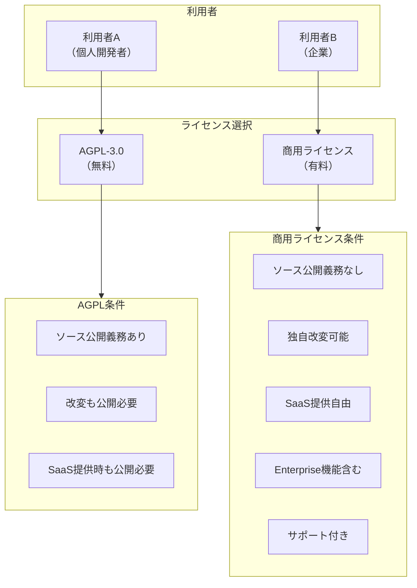

# ライセンス戦略

## 現在のライセンス

dursor は現在 **MIT License** を採用しています。

## ライセンス選択肢の比較

| ライセンス | Community | Enterprise | 採用例 | メリット | デメリット |
|------------|-----------|------------|--------|----------|------------|
| MIT + 独自 | MIT | プロプライエタリ | Supabase | 採用障壁が低い | フォークされやすい |
| AGPL + 商用 | AGPL-3.0 | 商用ライセンス | GitLab | フォーク抑止 | 企業が敬遠することも |
| BSL | 制限付き | 商用ライセンス | HashiCorp | フォーク完全抑止 | 「真のOSS」論争 |
| SSPL | 制限付き | 商用ライセンス | MongoDB | クラウド競合対策 | OSSと認められない |

## 各ライセンスの詳細

### MIT License（現状）

```
特徴:
- 最も寛容なライセンス
- 商用利用、改変、再配布が自由
- 著作権表示のみ必要

メリット:
✓ 採用障壁が最も低い
✓ 企業も安心して利用できる
✓ コントリビューションを得やすい

デメリット:
✗ 競合がフォークして商用化可能
✗ SaaSとして提供されても対抗手段なし
```

### AGPL-3.0（推奨オプション）

```
特徴:
- コピーレフトライセンス
- ソフトウェアを改変して配布する場合、ソース公開義務
- ネットワーク経由でサービス提供する場合もソース公開義務（SaaS条項）

メリット:
✓ 競合のSaaS化を抑止
✓ 個人・OSS利用は完全に自由
✓ 商用利用したい企業は別ライセンス購入

デメリット:
✗ 一部企業がAGPLを敬遠
✗ ライセンス変更には全コントリビューターの同意が必要
```

### BSL (Business Source License)

```
特徴:
- 一定期間後にOSSに変換（通常4年）
- 商用利用には制限あり
- HashiCorpが採用

メリット:
✓ フォークによる商用競合を完全に防止
✓ 時間経過でOSS化

デメリット:
✗ OSI認定のOSSではない
✗ コミュニティから批判を受けることがある
```

## 推奨: デュアルライセンス（AGPL + 商用）

将来的なオープンコアモデルへの移行を見据え、**デュアルライセンス**を推奨します。



### デュアルライセンスのメリット

1. **競合のSaaS化を抑止**: AGPLにより、競合がdursorをフォークしてSaaSとして提供する場合、ソースコードの公開が必要
2. **個人・OSS利用は自由**: 個人開発者やOSSプロジェクトは無料で自由に利用可能
3. **収益化の道筋**: 企業が商用利用したい場合は有料ライセンスを購入
4. **GitLab方式の実績**: GitLabがこのモデルで成功している

## ライセンス移行のタイミング

### Phase 1（現在〜6ヶ月）: MIT維持

```
理由:
- まずはコミュニティ構築を優先
- MITの方が初期採用の障壁が低い
- コントリビューターを集めやすい
```

### Phase 2（6-12ヶ月）: 移行判断

```
判断基準:
- 一定のユーザー数・Starsを獲得
- 商用利用の問い合わせがある
- フォークによる競合リスクが顕在化

移行時の注意点:
- 移行の告知期間を設ける
```

### Phase 3（12ヶ月以降）: AGPL + 商用ライセンス

```
実施内容:
- LICENSE ファイルをAGPL-3.0に変更
- 商用ライセンスの条件を整備
- Enterprise Editionの開発開始
```

## 依存関係のライセンス確認

現在の主要依存関係はすべてMIT互換です：

### Backend (Python)
| パッケージ | ライセンス | 互換性 |
|------------|------------|--------|
| FastAPI | MIT | ✓ |
| Pydantic | MIT | ✓ |
| uvicorn | BSD | ✓ |
| httpx | BSD | ✓ |
| openai | MIT | ✓ |
| anthropic | MIT | ✓ |
| cryptography | Apache 2.0 / BSD | ✓ |

### Frontend (TypeScript)
| パッケージ | ライセンス | 互換性 |
|------------|------------|--------|
| Next.js | MIT | ✓ |
| React | MIT | ✓ |
| Tailwind CSS | MIT | ✓ |
| SWR | MIT | ✓ |

## まとめ

| フェーズ | ライセンス | 理由 |
|----------|------------|------|
| 現在〜6ヶ月 | MIT | 採用障壁を下げ、コミュニティ構築を優先 |
| 6-12ヶ月 | MIT | 継続的なコミュニティ構築 |
| 12ヶ月以降 | AGPL + 商用（条件付き） | 商用需要が確認できた場合のみ |

## 関連ドキュメント

- [ビジネス戦略](./business-strategy.md)
- [オープンコアモデル詳細](./open-core-model.md)
- [ロードマップ](./roadmap.md)
