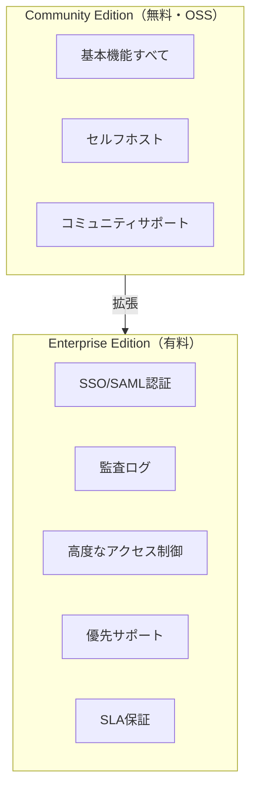
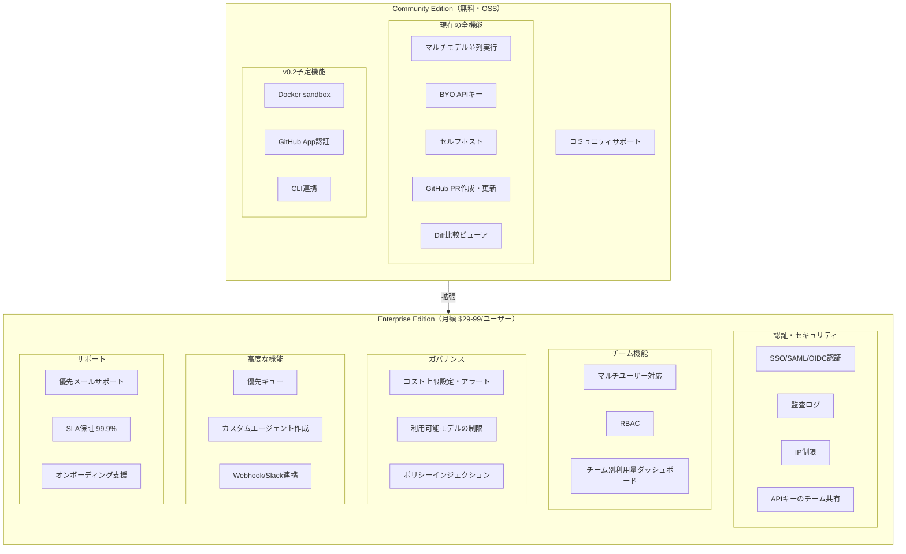

# オープンコアモデル詳細

## オープンコアとは

**オープンコア（Open Core）** は、ソフトウェアのコア機能をOSSとして無料公開し、追加のエンタープライズ機能を有料で提供するビジネスモデルです。

## 成功事例

| 企業 | OSS製品 | 有料機能 | 年間収益 |
|------|---------|----------|----------|
| GitLab | GitLab CE | SAML, 監査ログ, セキュリティスキャン | ~$500M |
| Elastic | Elasticsearch | Machine Learning, セキュリティ | ~$1B |
| HashiCorp | Terraform, Vault | エンタープライズ機能, サポート | ~$500M |
| Grafana Labs | Grafana | エンタープライズプラグイン, クラウド | ~$300M |
| Supabase | Supabase | クラウドホスティング, サポート | ~$100M |
| n8n | n8n | クラウド版, SSO, 監査ログ | ~$50M |

## dursor への適用案

### 機能分割設計

### 価格設定案

| プラン | 対象 | 価格 | 含まれる機能 |
|--------|------|------|--------------|
| Community | 個人開発者 | 無料 | コア機能すべて |
| Team | 小規模チーム | $29/ユーザー/月 | マルチユーザー, RBAC |
| Business | 中規模企業 | $59/ユーザー/月 | SSO, 監査ログ, サポート |
| Enterprise | 大企業 | $99/ユーザー/月 | 全機能, SLA, 専任サポート |

## 収益シミュレーション

オープンコア移行後の保守的な想定：

| 指標 | Year 1 | Year 2 | Year 3 |
|------|--------|--------|--------|
| GitHub Stars | 1,000 | 5,000 | 15,000 |
| 月間アクティブユーザー | 100 | 500 | 2,000 |
| 有料転換率 | 2% | 3% | 4% |
| 有料顧客数 | 2 | 15 | 80 |
| ARPU（月額） | $50 | $60 | $70 |
| 月間収益 | $100 | $900 | $5,600 |
| 年間収益 | $1,200 | $10,800 | $67,200 |

※開発者ツール市場の平均転換率は1-5%

## リスクと対策

| リスク | 影響度 | 対策 |
|--------|--------|------|
| フォークされる | 中 | AGPL採用で商用フォーク抑止 |
| 競合の急成長 | 高 | ニッチ（BYOキー、セルフホスト）に集中 |
| メンテ負担増 | 中 | 明確なスコープ定義、コントリビューター育成 |
| 有料需要なし | 中 | Phase 2でしっかり検証してから投資 |
| LLM API変更 | 高 | 複数プロバイダー対応を維持 |

## オープンコアの本質

1. **OSSで信頼を獲得** → コミュニティがマーケティングになる
2. **エンタープライズ需要を満たす** → 企業は「サポート」「セキュリティ」「ガバナンス」に課金する
3. **段階的に投資** → 需要が確認できてから本格投資

dursor の場合、**BYO APIキー + セルフホスト**という特徴は、既存SaaS（Cursor等）との差別化になります。この特徴を活かしつつ、チーム利用のペインポイント（コスト管理、アクセス制御）を解決するEnterprise機能で収益化するのが現実的な戦略です。

## 関連ドキュメント

- [ビジネス戦略](./business-strategy.md)
- [ライセンス戦略](./licensing-strategy.md)
- [ロードマップ](./roadmap.md)
