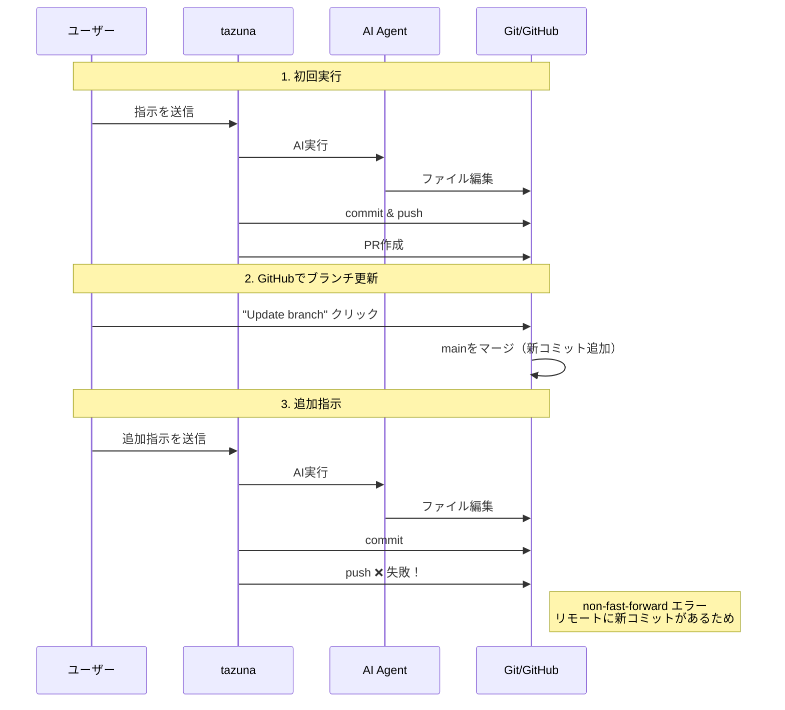
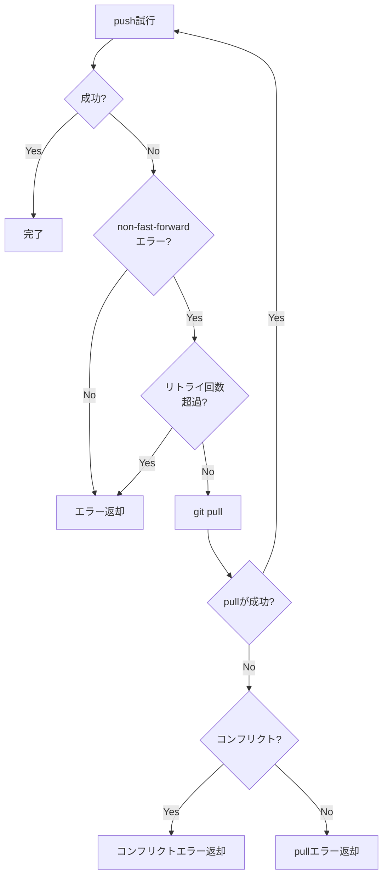
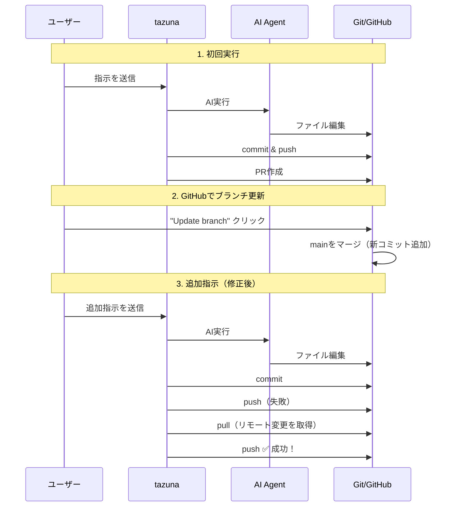
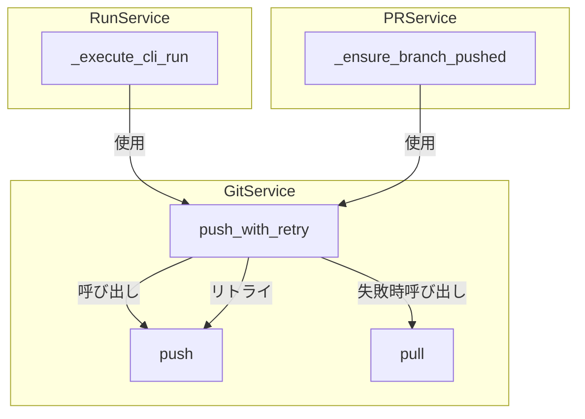
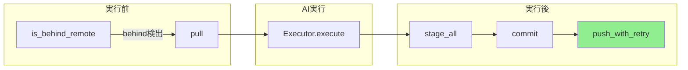

# Push リトライ機能

## 概要

GitHubのUIで「Update branch」ボタンをクリックしてリモートブランチを更新した後、AIが追加実装した際にpushが失敗する問題を解決する機能です。

## 問題の背景

### 発生シナリオ



### エラーメッセージ

```
Push failed (will retry on PR creation): Cmd('git') failed due to: exit code(1)
cmdline: git push -u origin tazuna/dcffe73f
stderr: 'To https://github.com/...
```

## 解決策

### push_with_retry() メソッド

non-fast-forwardエラーを検出し、自動的にpull→push をリトライする機能を追加しました。



### 処理フロー（修正後）



## 実装詳細

### 変更ファイル

| ファイル | 変更内容 |
|---------|---------|
| `git_service.py` | `PushResult` dataclass追加、`push_with_retry()` メソッド追加 |
| `run_service.py` | push処理を `push_with_retry()` に変更 |
| `pr_service.py` | `_ensure_branch_pushed()` を `push_with_retry()` に変更 |

### PushResult

pushの結果を表すデータクラスです。

```python
@dataclass
class PushResult:
    """git push操作の結果"""

    success: bool                    # 成功したかどうか
    error: str | None = None         # エラーメッセージ
    required_pull: bool = False      # pullが必要だったかどうか
```

### push_with_retry()

```python
async def push_with_retry(
    self,
    repo_path: Path,
    branch: str,
    auth_url: str | None = None,
    max_retries: int = 2,
) -> PushResult:
    """non-fast-forwardエラー時に自動リトライするpush

    Args:
        repo_path: リポジトリのパス
        branch: プッシュするブランチ名
        auth_url: 認証用URL
        max_retries: 最大リトライ回数（デフォルト: 2）

    Returns:
        PushResult: 成功/失敗の結果
    """
```

### non-fast-forwardエラーの検出パターン

以下のパターンでnon-fast-forwardエラーを検出します：

- `non-fast-forward`
- `[rejected]`
- `failed to push some refs`
- `updates were rejected`
- `fetch first`

## アーキテクチャ

### コンポーネント関係図



### 既存機能との関係



緑色の`push_with_retry`が今回追加された機能です。実行前の`is_behind_remote` + `pull`と組み合わせて、リモートブランチの更新に対応します。

## エラーハンドリング

### コンフリクト発生時

pullでコンフリクトが発生した場合、`PushResult`にコンフリクトファイルの情報を含めてエラーを返します。

```python
PushResult(
    success=False,
    error="Merge conflicts in: file1.py, file2.py",
    required_pull=True,
)
```

### その他のエラー

権限エラー（403）などの場合は、元のエラーをそのまま返します。

## ログ出力

### 正常時（リトライなし）

```
Pushed to branch: tazuna/abc12345
```

### 正常時（リトライあり）

```
Pulled remote changes and pushed to branch: tazuna/abc12345
```

### 失敗時

```
Push failed (will retry on PR creation): <エラーメッセージ>
```

## テスト

### 手動テスト手順

1. tazunaでタスクを作成し、AIに実装させる
2. PRを作成する
3. GitHubのPRページで「Update branch」をクリック
4. tazunaで追加指示を送信
5. pushが成功することを確認

### 期待される動作

- リモートブランチが更新されていても、AIの変更が正しくpushされる
- ログに「Pulled remote changes and pushed」と表示される

## 制限事項

- コンフリクトが発生した場合は自動解決されません（AIに解決を依頼する必要があります）
- 最大リトライ回数（デフォルト: 2回）を超えると失敗します
- force pushは行いません（履歴を保持するため）
