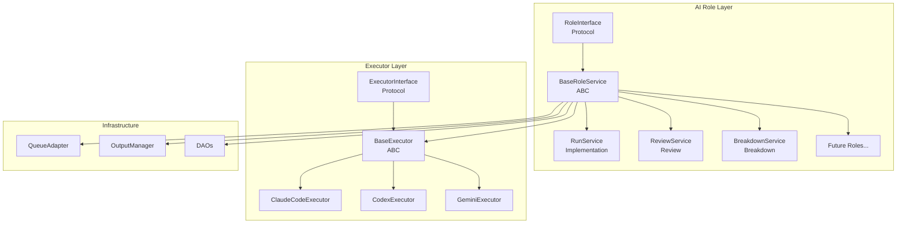

# AI Role リファクタリング計画

## 概要

本ドキュメントでは、現在の「実装（Run）」と「レビュー（Review）」サービスの共通パターンを抽出し、今後新しいAI Roleを追加しやすくするためのリファクタリング計画を定義する。

### 目標

1. **共通インターフェースの確立**: すべてのAI Roleが従うべき共通インターフェースを定義
2. **重複コードの削減**: 各サービスで重複しているロジックを基底クラスに集約
3. **拡張性の向上**: 新しいRoleを最小限のコードで追加可能にする
4. **フロントエンドの統一**: チャット内での表示コンポーネントを共通化

---

## AI Role 共通仕様

すべてのAI Roleは、Taskのチャット欄に表示され、以下の共通の入力・出力・表示仕様に従う。

### 入力（Input）

| 入力形式 | 説明 | 例 |
|----------|------|-----|
| **テキスト指示** | ユーザーがチャット欄に入力する自然言語の指示 | 「認証機能を追加して」 |
| **ボタン入力** | UIボタンによるアクション発火 | 「Review Code」ボタン |
| **コンテキスト** | 対象Run、対象ファイル、ブランチなどの追加情報 | `target_run_ids`, `base_ref` |

```typescript
// 共通の入力インターフェース
interface RoleInput {
  instruction: string;          // テキスト指示（必須）
  executor_type: ExecutorType;  // 実行するExecutor
  context?: {                   // Role固有のコンテキスト（オプション）
    target_run_ids?: string[];  // Review: レビュー対象のRun
    base_ref?: string;          // Implementation: ベースブランチ
    // ... Role固有の追加フィールド
  };
}
```

### 出力（Output）

すべてのAI Roleは以下の出力を生成する。

| 出力項目 | 必須 | 説明 |
|----------|------|------|
| **Diff（パッチ）** | ❌ | Gitに反映するファイル変更（Unified diff形式）。Roleによっては出力しない（例: Review） |
| **ログ** | ✅ | 実行中のストリーミングログ。すべてのRoleで必須 |
| **サマリー** | ✅ | 実行結果の要約テキスト |
| **Role固有データ** | ❌ | Review: feedbacks, score / Breakdown: tasks など |

```python
# 共通の出力インターフェース
class RoleOutput(BaseModel):
    """すべてのAI Roleが出力する共通データ。"""

    # 必須フィールド
    success: bool                    # 実行成功/失敗
    summary: str | None              # 実行結果のサマリー
    logs: list[str]                  # 実行ログ（ストリーミング対応）

    # オプションフィールド（あれば）
    patch: str | None = None         # Gitに反映するDiff
    files_changed: list[FileDiff] = []  # 変更ファイル一覧
    warnings: list[str] = []         # 警告メッセージ
    error: str | None = None         # エラーメッセージ（失敗時）
```

### 表示（Display）

TaskのチャットUIにおいて、すべてのAI Roleは以下の表示構成を持つ。

```
┌─────────────────────────────────────────────────────┐
│ [Role Icon] Role Name           [Status Badge] [▼] │  ← ヘッダー（展開/折りたたみ）
├─────────────────────────────────────────────────────┤
│ ┌─────────┬─────────┬─────────┐                     │
│ │ Summary │  Diff   │  Logs   │  ← タブ（Role固有のタブ追加可）
│ └─────────┴─────────┴─────────┘                     │
│                                                     │
│  [タブコンテンツ]                                    │
│  - Summary: 実行結果のサマリー表示                    │
│  - Diff: ファイル変更のDiff表示（あれば）             │
│  - Logs: ストリーミングログ表示                       │
│                                                     │
└─────────────────────────────────────────────────────┘
```

#### 共通タブ

| タブ | 必須 | 内容 |
|------|------|------|
| **Summary** | ✅ | 実行結果のサマリー。成功/失敗状態、主要な結果を表示 |
| **Logs** | ✅ | 実行ログ。実行中はストリーミング表示（リアルタイム更新） |
| **Diff** | ❌ | ファイル変更がある場合のみ表示。Unified diff形式 |

#### Role固有タブ（例）

| Role | 追加タブ | 内容 |
|------|----------|------|
| Review | Results | フィードバック一覧（severity別グループ化） |
| Breakdown | Tasks | 分解されたタスク一覧 |

#### ステータス表示

| ステータス | 表示 | Logsタブの挙動 |
|------------|------|----------------|
| `queued` | 待機中バッジ | 「Waiting...」表示 |
| `running` | 実行中バッジ（アニメーション） | **ストリーミング表示**（自動スクロール） |
| `succeeded` | 成功バッジ（緑） | 完了ログ表示 |
| `failed` | 失敗バッジ（赤） | エラーログ表示 |

### Role別の入出力マッピング

| Role | 入力 | Diff出力 | 固有出力 |
|------|------|----------|----------|
| **Implementation** | テキスト指示 | ✅ あり | `session_id`, `files_changed` |
| **Review** | ボタン + target_run_ids | ❌ なし | `feedbacks`, `overall_score` |
| **Breakdown** | テキスト指示 | ❌ なし | `tasks`, `codebase_analysis` |
| **（将来）Fix** | Review feedback選択 | ✅ あり | `applied_feedbacks` |

---

## 現状分析

### 既存のAI Role サービス

| サービス | 役割 | ファイル |
|----------|------|----------|
| **RunService** | コード生成（実装） | `services/run_service.py` |
| **ReviewService** | コードレビュー | `services/review_service.py` |
| **BreakdownService** | タスク分解 | `services/breakdown_service.py` |

### 共通パターン

調査の結果、各サービスで以下の共通パターンが確認された：

#### バックエンド

1. **Executor管理**: 3つのCLI Executor（Claude Code、Codex、Gemini CLI）をインスタンス化
2. **キューベースの非同期実行**: `QueueAdapter` を使用した非同期タスク管理
3. **ステータス管理**: QUEUED → RUNNING → SUCCEEDED/FAILED のライフサイクル
4. **ログストリーミング**: `OutputManager` を使用したリアルタイムログ配信
5. **結果のパースと保存**: Executor出力からの構造化データ抽出

```python
# 各サービスで繰り返されるパターン
class XxxService:
    def __init__(self, ...):
        # 1. Executorのインスタンス化
        self._claude_executor = ClaudeCodeExecutor(...)
        self._codex_executor = CodexExecutor(...)
        self._gemini_executor = GeminiExecutor(...)

    async def create_xxx(self, ...):
        # 2. レコード作成
        record = await self.xxx_dao.create(...)
        # 3. キューにエンキュー
        await self.queue.enqueue(record.id, lambda: self._execute(record))
        return record

    async def _execute(self, record):
        # 4. ステータス更新
        await self.xxx_dao.update_status(record.id, Status.RUNNING)
        # 5. Executor実行
        result = await self._get_executor(executor_type).execute(...)
        # 6. 結果保存
        await self.xxx_dao.update_status(record.id, Status.SUCCEEDED, ...)
```

#### フロントエンド

1. **ステータスベースのレンダリング**: status に応じたUI切り替え
2. **展開可能なカード**: Collapsible header + content パターン
3. **ログストリーミング**: ポーリングによるリアルタイムログ表示
4. **エラーハンドリング**: 失敗時のエラーメッセージ表示
5. **Executor Type フィルタリング**: 選択中のExecutor Typeでフィルタ

### 重複箇所の特定

| 項目 | RunService | ReviewService | BreakdownService |
|------|------------|---------------|------------------|
| Executor インスタンス化 | ✅ | ✅ | ✅ |
| QueueAdapter 使用 | ✅ | ✅ (ReviewQueueAdapter) | ❌ (asyncio直接) |
| OutputManager 使用 | ✅ | ✅ | ✅ |
| ステータス Enum | RunStatus | ReviewStatus | BreakdownStatus |
| DAOパターン | RunDAO | ReviewDAO | (in-memory) |
| ログストリーミング API | ✅ (`streamLogs`) | ✅ (`streamLogs`) | ❌ |

### 現在の実装詳細（2026年1月更新）

#### ReviewService のストリーミングログ実装

ReviewService は現在、RunService と同様のパターンでストリーミングログを実装済み：

```python
# apps/api/src/dursor_api/services/review_service.py

class ReviewService:
    def __init__(self, ..., output_manager: OutputManager | None = None):
        self.output_manager = output_manager
        # ...

    async def _log_output(self, review_id: str, line: str, logs: list[str]) -> None:
        """Log output from CLI execution."""
        logger.info(f"[review-{review_id[:8]}] {line}")
        logs.append(line)
        if self.output_manager:
            await self.output_manager.publish_async(f"review-{review_id}", line)
```

#### ReviewResultCard のタブUI

フロントエンドでは、ReviewResultCard が RunResultCard と同様のタブ構造を持つ：

```typescript
// apps/web/src/components/ReviewResultCard.tsx

type ReviewTab = 'results' | 'logs';

// タブ切り替えとストリーミングログ対応
const [activeTab, setActiveTab] = useState<ReviewTab>('results');
const [streamActive, setStreamActive] = useState(false);

// ストリーミングログの取得
useEffect(() => {
  if (review.status !== 'queued' && review.status !== 'running') {
    setStreamActive(false);
    return;
  }
  const cleanup = reviewsApi.streamLogs(review.id, { /* ... */ });
  return cleanup;
}, [review.id, review.status]);
```

この実装により、Run と Review は以下の共通UIパターンを持つ：

| パターン | RunResultCard | ReviewResultCard |
|----------|---------------|------------------|
| タブUI | Summary / Diff / Logs | Results / Logs |
| ストリーミングログ | ✅ `streamLogs` | ✅ `streamLogs` |
| 自動スクロール | ✅ | ✅ |
| ステータス別表示切替 | ✅ | ✅ |
| 展開/折りたたみ | ✅ | ✅ |

---

## リファクタリング設計

### アーキテクチャ概要



### Phase 1: 基盤整備

#### 1.1 共通ステータスの統一

各Roleで異なるステータスEnumを使用しているが、ライフサイクルは同一。共通Enumを定義する。

```python
# apps/api/src/dursor_api/domain/enums.py

class RoleExecutionStatus(str, Enum):
    """AI Role実行のステータス。すべてのRoleで共通。"""
    QUEUED = "queued"      # キュー待ち
    RUNNING = "running"    # 実行中
    SUCCEEDED = "succeeded"  # 成功
    FAILED = "failed"      # 失敗
    CANCELED = "canceled"  # キャンセル

# 後方互換性のためエイリアスを維持
RunStatus = RoleExecutionStatus
ReviewStatus = RoleExecutionStatus
BreakdownStatus = RoleExecutionStatus
```

#### 1.2 共通結果モデルの定義

```python
# apps/api/src/dursor_api/domain/models.py

class RoleExecutionResult(BaseModel):
    """AI Role実行結果の共通インターフェース。"""
    success: bool
    summary: str | None = None
    logs: list[str] = []
    warnings: list[str] = []
    error: str | None = None

class ImplementationResult(RoleExecutionResult):
    """実装Role特有の結果。"""
    patch: str | None = None
    files_changed: list[FileDiff] = []
    session_id: str | None = None

class ReviewResult(RoleExecutionResult):
    """レビューRole特有の結果。"""
    overall_score: float | None = None
    feedbacks: list[ReviewFeedbackItem] = []

class BreakdownResult(RoleExecutionResult):
    """タスク分解Role特有の結果。"""
    tasks: list[BrokenDownTask] = []
    codebase_analysis: CodebaseAnalysis | None = None
```

### Phase 2: BaseRoleService の実装

#### 2.1 RoleExecutor Protocol

```python
# apps/api/src/dursor_api/roles/protocol.py

from typing import Protocol, TypeVar, Generic
from abc import ABC, abstractmethod

TResult = TypeVar("TResult", bound=RoleExecutionResult)
TRecord = TypeVar("TRecord")

class RoleExecutor(Protocol[TResult]):
    """AI Role実行のプロトコル。"""

    async def execute(
        self,
        workspace_path: Path,
        instruction: str,
        constraints: AgentConstraints | None = None,
        on_output: Callable[[str], Awaitable[None]] | None = None,
        **kwargs: Any,
    ) -> TResult:
        """Role固有の処理を実行する。"""
        ...
```

#### 2.2 BaseRoleService 抽象基底クラス

```python
# apps/api/src/dursor_api/roles/base_service.py

from abc import ABC, abstractmethod
from typing import Generic, TypeVar

TRecord = TypeVar("TRecord")
TCreate = TypeVar("TCreate")
TResult = TypeVar("TResult", bound=RoleExecutionResult)

class BaseRoleService(ABC, Generic[TRecord, TCreate, TResult]):
    """すべてのAI Roleサービスの基底クラス。"""

    def __init__(
        self,
        output_manager: OutputManager,
        claude_executor: ClaudeCodeExecutor | None = None,
        codex_executor: CodexExecutor | None = None,
        gemini_executor: GeminiExecutor | None = None,
    ):
        self.output_manager = output_manager
        self._executors: dict[ExecutorType, BaseExecutor] = {}

        if claude_executor:
            self._executors[ExecutorType.CLAUDE_CODE] = claude_executor
        if codex_executor:
            self._executors[ExecutorType.CODEX_CLI] = codex_executor
        if gemini_executor:
            self._executors[ExecutorType.GEMINI_CLI] = gemini_executor

        # キュー管理
        self._queue = QueueAdapter()

    # ==========================================
    # 共通メソッド（継承先で使用）
    # ==========================================

    def get_executor(self, executor_type: ExecutorType) -> BaseExecutor:
        """指定されたExecutorを取得する。"""
        executor = self._executors.get(executor_type)
        if not executor:
            raise ValueError(f"Executor not available: {executor_type}")
        return executor

    async def enqueue_execution(
        self,
        record_id: str,
        coro_factory: Callable[[], Coroutine[Any, Any, None]],
    ) -> None:
        """実行をキューに追加する。"""
        await self._queue.enqueue(record_id, coro_factory)

    async def publish_log(self, record_id: str, message: str) -> None:
        """ログをストリーミング出力する。"""
        await self.output_manager.publish_async(record_id, message)

    async def mark_complete(self, record_id: str) -> None:
        """ログストリーミングを完了としてマークする。"""
        await self.output_manager.mark_complete(record_id)

    async def get_logs(
        self,
        record_id: str,
        from_line: int = 0,
    ) -> tuple[list[OutputLine], bool]:
        """ログ履歴を取得する。"""
        history = await self.output_manager.get_history(record_id, from_line)
        is_complete = await self.output_manager.is_complete(record_id)
        return history, is_complete

    # ==========================================
    # 抽象メソッド（継承先で実装必須）
    # ==========================================

    @abstractmethod
    async def create(self, task_id: str, data: TCreate) -> TRecord:
        """レコードを作成し実行をキューに追加する。"""
        ...

    @abstractmethod
    async def get(self, record_id: str) -> TRecord | None:
        """レコードを取得する。"""
        ...

    @abstractmethod
    async def list_by_task(self, task_id: str) -> list[TRecord]:
        """タスクに紐づくレコード一覧を取得する。"""
        ...

    @abstractmethod
    async def _execute(self, record: TRecord) -> TResult:
        """Role固有の実行ロジック。"""
        ...

    @abstractmethod
    async def _update_status(
        self,
        record_id: str,
        status: RoleExecutionStatus,
        result: TResult | None = None,
    ) -> None:
        """ステータスと結果を更新する。"""
        ...

    # ==========================================
    # テンプレートメソッド（実行フロー）
    # ==========================================

    async def _execute_with_lifecycle(self, record: TRecord) -> None:
        """共通の実行ライフサイクル。"""
        record_id = self._get_record_id(record)

        try:
            # ステータスをRUNNINGに更新
            await self._update_status(record_id, RoleExecutionStatus.RUNNING)
            await self.publish_log(record_id, "Execution started...")

            # Role固有の実行
            result = await self._execute(record)

            # 結果に応じてステータス更新
            if result.success:
                await self._update_status(
                    record_id, RoleExecutionStatus.SUCCEEDED, result
                )
                await self.publish_log(record_id, "Execution completed successfully.")
            else:
                await self._update_status(
                    record_id, RoleExecutionStatus.FAILED, result
                )
                await self.publish_log(record_id, f"Execution failed: {result.error}")

        except Exception as e:
            error_result = self._create_error_result(str(e))
            await self._update_status(
                record_id, RoleExecutionStatus.FAILED, error_result
            )
            await self.publish_log(record_id, f"Execution error: {e}")
            raise

        finally:
            await self.mark_complete(record_id)

    @abstractmethod
    def _get_record_id(self, record: TRecord) -> str:
        """レコードからIDを取得する。"""
        ...

    @abstractmethod
    def _create_error_result(self, error: str) -> TResult:
        """エラー結果を作成する。"""
        ...
```

### Phase 3: 各Roleサービスのリファクタリング

#### 3.1 RunService（実装Role）

```python
# apps/api/src/dursor_api/services/run_service.py

class RunService(BaseRoleService[Run, RunCreate, ImplementationResult]):
    """コード生成（実装）を担当するRoleサービス。"""

    def __init__(
        self,
        run_dao: RunDAO,
        task_dao: TaskDAO,
        # ... 他の依存関係
        **kwargs,
    ):
        super().__init__(**kwargs)
        self.run_dao = run_dao
        self.task_dao = task_dao
        # ...

    async def create(self, task_id: str, data: RunCreate) -> Run:
        # 検証
        task = await self.task_dao.get(task_id)
        if not task:
            raise ValueError(f"Task not found: {task_id}")

        # レコード作成
        run = Run(
            id=generate_id(),
            task_id=task_id,
            executor_type=data.executor_type,
            status=RoleExecutionStatus.QUEUED,
            # ...
        )
        await self.run_dao.create(run)

        # キューにエンキュー
        await self.enqueue_execution(
            run.id,
            lambda r=run: self._execute_with_lifecycle(r),
        )

        return run

    async def _execute(self, run: Run) -> ImplementationResult:
        """実装Role固有の実行ロジック。"""
        executor = self.get_executor(run.executor_type)

        result = await executor.execute(
            worktree_path=Path(run.worktree_path),
            instruction=run.instruction,
            on_output=lambda msg: self.publish_log(run.id, msg),
        )

        return ImplementationResult(
            success=result.success,
            summary=result.summary,
            patch=result.patch,
            files_changed=result.files_changed,
            logs=result.logs,
            warnings=result.warnings,
            error=result.error,
            session_id=result.session_id,
        )

    # ... 他の抽象メソッド実装
```

#### 3.2 ReviewService（レビューRole）

```python
# apps/api/src/dursor_api/services/review_service.py

class ReviewService(BaseRoleService[Review, ReviewCreate, ReviewResult]):
    """コードレビューを担当するRoleサービス。"""

    async def _execute(self, review: Review) -> ReviewResult:
        """レビューRole固有の実行ロジック。"""
        # パッチを収集
        combined_patch = await self._combine_patches(review.target_run_ids)

        # レビュー実行
        executor = self.get_executor(review.executor_type)
        result = await executor.execute(
            worktree_path=self._get_workspace_path(review),
            instruction=self._build_review_prompt(combined_patch),
            on_output=lambda msg: self.publish_log(review.id, msg),
        )

        # 結果のパース
        feedbacks = self._parse_review_feedbacks(result.logs)

        return ReviewResult(
            success=result.success,
            summary=result.summary,
            overall_score=self._calculate_score(feedbacks),
            feedbacks=feedbacks,
            logs=result.logs,
            error=result.error,
        )

    # ... 他の抽象メソッド実装
```

### Phase 4: Role Registry パターン

新しいRoleを動的に登録できる仕組みを導入。

```python
# apps/api/src/dursor_api/roles/registry.py

from typing import Type

class RoleRegistry:
    """AI Roleの登録・取得を管理するレジストリ。"""

    _roles: dict[str, Type[BaseRoleService]] = {}

    @classmethod
    def register(cls, name: str):
        """Roleを登録するデコレータ。"""
        def decorator(role_cls: Type[BaseRoleService]):
            cls._roles[name] = role_cls
            return role_cls
        return decorator

    @classmethod
    def get(cls, name: str) -> Type[BaseRoleService]:
        """登録されたRoleクラスを取得する。"""
        if name not in cls._roles:
            raise ValueError(f"Unknown role: {name}")
        return cls._roles[name]

    @classmethod
    def list_roles(cls) -> list[str]:
        """登録されたRole名一覧を取得する。"""
        return list(cls._roles.keys())


# 使用例
@RoleRegistry.register("implementation")
class RunService(BaseRoleService[Run, RunCreate, ImplementationResult]):
    ...

@RoleRegistry.register("review")
class ReviewService(BaseRoleService[Review, ReviewCreate, ReviewResult]):
    ...

@RoleRegistry.register("breakdown")
class BreakdownService(BaseRoleService[Breakdown, BreakdownCreate, BreakdownResult]):
    ...
```

### Phase 5: フロントエンド共通化

> **注記**: 2026年1月の更新により、RunResultCard と ReviewResultCard は既にタブUI、ストリーミングログ、ステータス別表示などの共通パターンを実装済み。本フェーズでは、これらの共通パターンを抽出して再利用可能なコンポーネントに統合する。

#### 5.1 共通TypeScript型

```typescript
// apps/web/src/types/role.ts

export type RoleExecutionStatus = 'queued' | 'running' | 'succeeded' | 'failed' | 'canceled';

export interface RoleExecutionBase {
  id: string;
  task_id: string;
  executor_type: ExecutorType;
  status: RoleExecutionStatus;
  logs: string[];
  error: string | null;
  created_at: string;
  started_at: string | null;
  completed_at: string | null;
}

export interface RoleResultBase {
  success: boolean;
  summary: string | null;
  logs: string[];
  warnings: string[];
  error: string | null;
}

// 各Role固有の型はこれを拡張
export interface Run extends RoleExecutionBase {
  patch: string | null;
  files_changed: FileDiff[];
  session_id: string | null;
}

export interface Review extends RoleExecutionBase {
  target_run_ids: string[];
  overall_score: number | null;
  feedbacks: ReviewFeedbackItem[];
}
```

#### 5.2 共通コンポーネント

```typescript
// apps/web/src/components/role/RoleStatusBadge.tsx

interface RoleStatusBadgeProps {
  status: RoleExecutionStatus;
  size?: 'sm' | 'md' | 'lg';
}

export function RoleStatusBadge({ status, size = 'md' }: RoleStatusBadgeProps) {
  const statusConfig = {
    queued: { color: 'gray', icon: ClockIcon, label: 'Queued' },
    running: { color: 'yellow', icon: ArrowPathIcon, label: 'Running' },
    succeeded: { color: 'green', icon: CheckCircleIcon, label: 'Succeeded' },
    failed: { color: 'red', icon: ExclamationCircleIcon, label: 'Failed' },
    canceled: { color: 'gray', icon: XCircleIcon, label: 'Canceled' },
  };

  const config = statusConfig[status];
  // ... レンダリング
}
```

```typescript
// apps/web/src/components/role/RoleResultCard.tsx

interface RoleResultCardProps<T extends RoleExecutionBase> {
  record: T;
  title: string;
  renderContent: (record: T) => React.ReactNode;
  renderSummary?: (record: T) => React.ReactNode;
  onExpand?: () => void;
}

export function RoleResultCard<T extends RoleExecutionBase>({
  record,
  title,
  renderContent,
  renderSummary,
  onExpand,
}: RoleResultCardProps<T>) {
  const [isExpanded, setIsExpanded] = useState(false);

  return (
    <div className="border rounded-lg bg-gray-800">
      {/* ヘッダー（共通） */}
      <div className="flex items-center justify-between p-4 cursor-pointer"
           onClick={() => setIsExpanded(!isExpanded)}>
        <div className="flex items-center gap-3">
          <ExecutorIcon type={record.executor_type} />
          <span className="font-medium">{title}</span>
        </div>
        <div className="flex items-center gap-2">
          <RoleStatusBadge status={record.status} />
          <ChevronIcon direction={isExpanded ? 'up' : 'down'} />
        </div>
      </div>

      {/* コンテンツ（Role固有） */}
      {isExpanded && (
        <div className="p-4 border-t border-gray-700">
          {record.status === 'running' ? (
            <StreamingLogs recordId={record.id} />
          ) : record.status === 'succeeded' ? (
            renderContent(record)
          ) : record.status === 'failed' ? (
            <ErrorDisplay error={record.error} logs={record.logs} />
          ) : null}
        </div>
      )}
    </div>
  );
}
```

#### 5.3 各Role用コンポーネント

リファクタリング後のコンポーネント構造。現在の実装では、RunResultCard と ReviewResultCard は独立してタブUIを実装しているが、共通の `RoleResultCard` を使用することで統一する。

```typescript
// apps/web/src/components/RunResultCard.tsx（リファクタリング後）

export function RunResultCard({ run }: { run: Run }) {
  return (
    <RoleResultCard
      record={run}
      title="Implementation"
      tabs={[
        { id: 'summary', label: 'Summary', icon: DocumentTextIcon },
        { id: 'diff', label: 'Diff', icon: CodeBracketIcon },
        { id: 'logs', label: 'Logs', icon: CommandLineIcon },
      ]}
      renderTabContent={(r, tab) => {
        switch (tab) {
          case 'summary':
            return <SummaryView summary={r.summary} filesChanged={r.files_changed} />;
          case 'diff':
            return <DiffViewer patch={r.patch} />;
          case 'logs':
            return <LogViewer logs={r.logs} />;
        }
      }}
    />
  );
}

// apps/web/src/components/ReviewResultCard.tsx（リファクタリング後）

export function ReviewResultCard({ review }: { review: Review }) {
  return (
    <RoleResultCard
      record={review}
      title="Code Review"
      tabs={[
        { id: 'results', label: 'Results', icon: DocumentTextIcon },
        { id: 'logs', label: 'Logs', icon: CommandLineIcon },
      ]}
      renderTabContent={(r, tab) => {
        switch (tab) {
          case 'results':
            return (
              <>
                <ScoreDisplay score={r.overall_score} />
                <SeverityFilter feedbacks={r.feedbacks} />
                <FeedbackList feedbacks={r.feedbacks} />
              </>
            );
          case 'logs':
            return <LogViewer logs={r.logs} />;
        }
      }}
    />
  );
}
```

---

## 実装計画

### Phase 1: 基盤整備（Week 1）

| タスク | 詳細 | 優先度 |
|--------|------|--------|
| 共通Enum定義 | `RoleExecutionStatus` の追加、既存Enumのエイリアス化 | High |
| 共通モデル定義 | `RoleExecutionResult` とその派生クラスの追加 | High |
| Protocol定義 | `RoleExecutor` Protocol の追加 | High |
| テスト | 新規型のユニットテスト | Medium |

### Phase 2: BaseRoleService（Week 2）

| タスク | 詳細 | 優先度 |
|--------|------|--------|
| BaseRoleService実装 | 抽象基底クラスの実装 | High |
| RunServiceリファクタ | BaseRoleServiceを継承するよう改修 | High |
| ReviewServiceリファクタ | BaseRoleServiceを継承するよう改修 | High |
| BreakdownServiceリファクタ | BaseRoleServiceを継承するよう改修 | Medium |
| 統合テスト | リファクタ後の動作検証 | High |

### Phase 3: Role Registry（Week 3）

| タスク | 詳細 | 優先度 |
|--------|------|--------|
| RoleRegistry実装 | デコレータベースのレジストリ | Medium |
| 依存性注入の更新 | dependencies.py の更新 | Medium |
| ドキュメント | 新規Role追加ガイドの作成 | Low |

### Phase 4: フロントエンド共通化（Week 4）

| タスク | 詳細 | 優先度 |
|--------|------|--------|
| 共通型定義 | `role.ts` の追加 | High |
| RoleStatusBadge | 共通ステータスバッジ | High |
| RoleResultCard | 共通結果カード | High |
| RunResultCard更新 | 共通コンポーネント使用に更新 | High |
| ReviewResultCard更新 | 共通コンポーネント使用に更新 | High |
| E2Eテスト | UI動作検証 | Medium |

---

## 新規Role追加ガイド（リファクタ後）

リファクタリング完了後、新しいAI Roleを追加する手順：

### 1. ドメインモデル定義

```python
# apps/api/src/dursor_api/domain/models.py

class MyNewRoleResult(RoleExecutionResult):
    """新規Role特有の結果。"""
    custom_field: str | None = None

class MyNewRoleCreate(BaseModel):
    """新規Role作成リクエスト。"""
    instruction: str
    executor_type: ExecutorType
```

### 2. DAOの実装

```python
# apps/api/src/dursor_api/storage/dao.py

class MyNewRoleDAO:
    async def create(self, record: MyNewRole) -> MyNewRole: ...
    async def get(self, id: str) -> MyNewRole | None: ...
    async def list_by_task(self, task_id: str) -> list[MyNewRole]: ...
    async def update_status(self, id: str, status: RoleExecutionStatus, ...) -> None: ...
```

### 3. サービスの実装

```python
# apps/api/src/dursor_api/services/my_new_role_service.py

@RoleRegistry.register("my_new_role")
class MyNewRoleService(BaseRoleService[MyNewRole, MyNewRoleCreate, MyNewRoleResult]):
    """新規Roleサービス。"""

    async def _execute(self, record: MyNewRole) -> MyNewRoleResult:
        # Role固有のロジック
        ...

    # 他の抽象メソッド実装
```

### 4. APIエンドポイント追加

```python
# apps/api/src/dursor_api/routes/my_new_role.py

router = APIRouter(prefix="/v1", tags=["my_new_role"])

@router.post("/tasks/{task_id}/my_new_role")
async def create_my_new_role(...):
    ...
```

### 5. フロントエンド対応

```typescript
// apps/web/src/components/MyNewRoleResultCard.tsx

export function MyNewRoleResultCard({ record }: { record: MyNewRole }) {
  return (
    <RoleResultCard
      record={record}
      title="My New Role"
      renderContent={(r) => <MyNewRoleContent record={r} />}
    />
  );
}
```

---

## 考慮事項

### 後方互換性

- 既存の API エンドポイントは変更しない
- 既存の Enum（`RunStatus`, `ReviewStatus`）はエイリアスとして維持
- フロントエンドの既存コンポーネントは段階的に移行

### パフォーマンス

- 共通基底クラスによるオーバーヘッドは最小限
- キュー管理は既存の仕組みを継続使用
- ログストリーミングの効率性を維持

### テスト戦略

- 基底クラスのユニットテスト
- 各Roleサービスの統合テスト
- E2Eテストでのフロー確認

---

## 関連ドキュメント

- [Architecture](./architecture.md)
- [Agentic Dursor](./agentic-dursor.md)
- [Code Review Feature](./review.md)
- [Multi AI Coding Tool](./ai-coding-tool-multiple.md)
