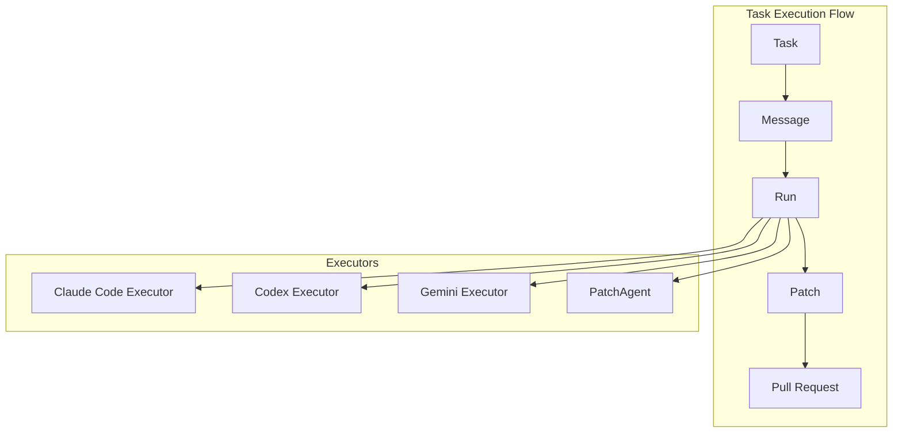
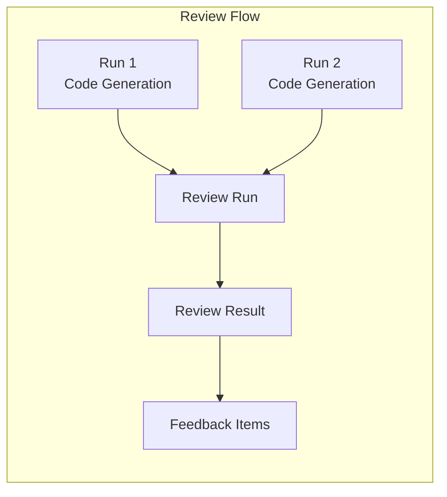
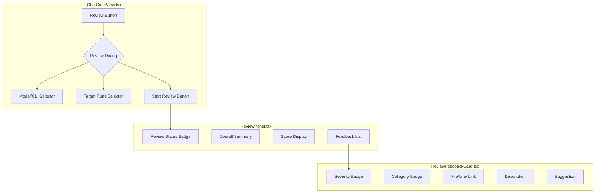
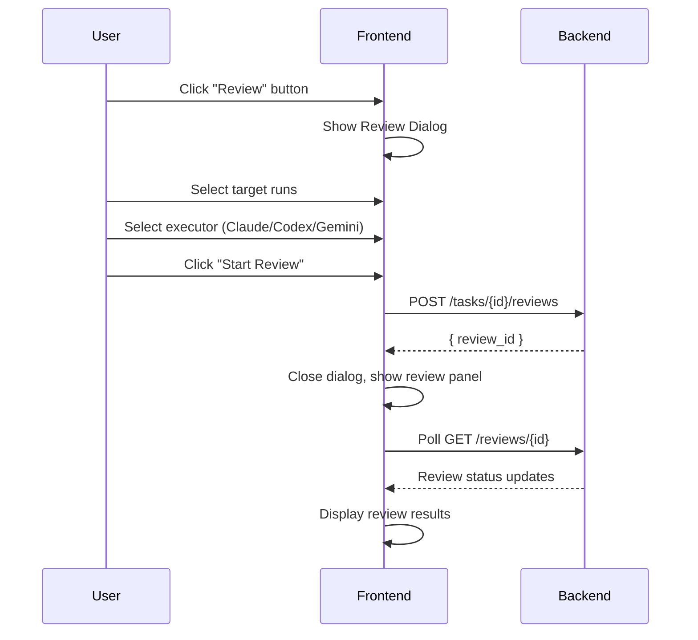
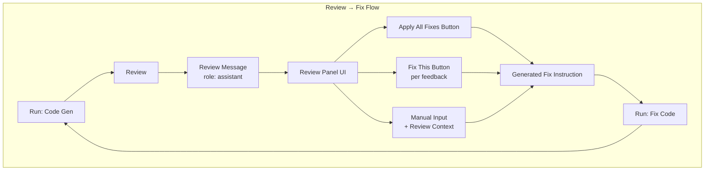
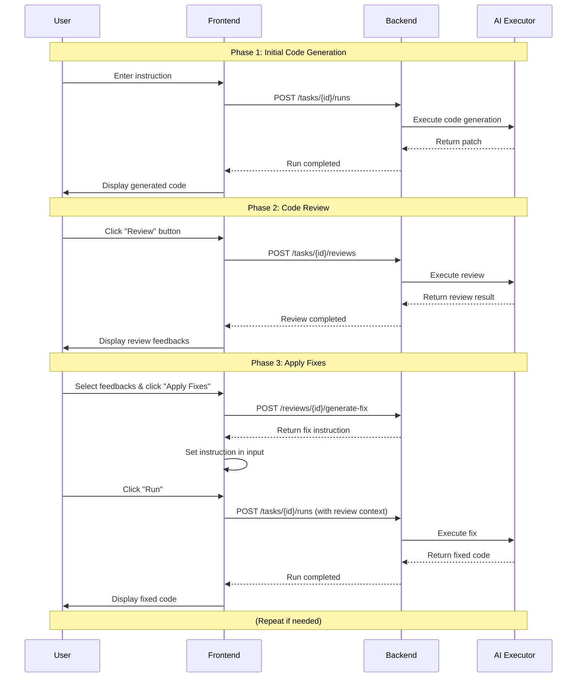

# コードレビュー機能 設計ドキュメント

## 概要

Task 実行内でAI（Claude Code, Codex, Gemini CLI）によるコードレビュー機能を追加する。ユーザーがモデルを選択して「Review」ボタンを押すと、そのセッションで生成されたコードをAIがレビューし、重要度レベル（Critical, High, Medium, Low）を付与してファイルと行に対するフィードバックを提供する。

### 期待される動作

1. ユーザーがTaskページで「Review」ボタンを押す
2. レビューに使用するモデル/CLIを選択
3. 選択したモデルがTask内のRun結果（patch）をレビュー
4. レビュー結果が重要度別に分類されて表示される
5. 各フィードバックは対象ファイルと行番号に紐付けられる
6. **ユーザーがレビュー結果をもとに修正指示を出す**
7. **AIがレビュー指摘を反映した新しいコードを生成**

### 会話フロー例

```
[User] 「ユーザー認証機能を追加してください」
    ↓
[AI Run] コード生成 → patch出力
    ↓
[User] 「Review」ボタンを押す
    ↓
[AI Review] レビュー結果表示
  - [Critical] SQL Injection vulnerability in login.py:42
  - [High] Missing password hashing in auth.py:28
  - [Medium] Consider using constant-time comparison
    ↓
[User] 「CriticalとHighの指摘を修正して」または「Apply Fixes」ボタン
    ↓
[AI Run] レビュー指摘を反映した修正コード生成
    ↓
(必要に応じて繰り返し)
```

---

## 現状分析

### 既存アーキテクチャ



### 関連ファイル

| カテゴリ | ファイル | 役割 |
|----------|----------|------|
| **Domain** | `apps/api/src/tazuna_api/domain/models.py` | Pydanticモデル定義 |
| **Domain** | `apps/api/src/tazuna_api/domain/enums.py` | Enum定義 |
| **Executor** | `apps/api/src/tazuna_api/executors/base_executor.py` | エグゼキューター基底クラス |
| **Executor** | `apps/api/src/tazuna_api/executors/claude_code_executor.py` | Claude Code CLI実行 |
| **Service** | `apps/api/src/tazuna_api/services/run_service.py` | Run作成・実行サービス |
| **Routes** | `apps/api/src/tazuna_api/routes/runs.py` | RunのAPIエンドポイント |
| **Frontend** | `apps/web/src/components/ChatCodeView.tsx` | Task UIメインコンポーネント |
| **Frontend** | `apps/web/src/components/RunDetailPanel.tsx` | Run詳細表示 |
| **Frontend** | `apps/web/src/lib/api.ts` | APIクライアント |
| **Frontend** | `apps/web/src/types.ts` | TypeScript型定義 |

### 既存のRun実行フロー

1. `POST /v1/tasks/{task_id}/runs` でRun作成
2. `RunService.create_runs()` でRunレコード作成＆キューへエンキュー
3. エグゼキューター（CLI or PatchAgent）が実行
4. 結果（patch, files_changed, summary）をDBに保存
5. フロントエンドがポーリングで結果を取得・表示

---

## 設計案

### アプローチ比較

| アプローチ | 概要 | メリット | デメリット |
|------------|------|----------|------------|
| **A: 新規Review Run** | Reviewを専用のRun種別として実装 | 既存フローと統合、結果の永続化 | RunモデルがReview用フィールドで肥大化 |
| **B: 独立Review Entity** | Review専用のエンティティを新設 | 関心の分離、柔軟な設計 | 新規テーブル・API・コンポーネント多数 |
| **C: Review as Special Run** | Runの派生として実装、別テーブルで結果保存 | バランスの取れた設計 | やや複雑 |

### 推奨: アプローチC（Review as Special Run）

Runの仕組みを活用しつつ、Review結果は専用テーブルで管理する方式を推奨。



---

## データモデル

### 新規Enum

```python
# apps/api/src/tazuna_api/domain/enums.py

class ReviewSeverity(str, Enum):
    """Review feedback severity level."""
    CRITICAL = "critical"  # 重大な問題（セキュリティ、データ損失リスク）
    HIGH = "high"          # 高優先度（バグ、パフォーマンス問題）
    MEDIUM = "medium"      # 中優先度（コード品質、保守性）
    LOW = "low"            # 低優先度（スタイル、提案）


class ReviewCategory(str, Enum):
    """Review feedback category."""
    SECURITY = "security"           # セキュリティ問題
    BUG = "bug"                     # バグ・ロジックエラー
    PERFORMANCE = "performance"     # パフォーマンス問題
    MAINTAINABILITY = "maintainability"  # 保守性・可読性
    BEST_PRACTICE = "best_practice" # ベストプラクティス
    STYLE = "style"                 # コードスタイル
    DOCUMENTATION = "documentation" # ドキュメント
    TEST = "test"                   # テスト関連


class ReviewStatus(str, Enum):
    """Review execution status."""
    QUEUED = "queued"
    RUNNING = "running"
    SUCCEEDED = "succeeded"
    FAILED = "failed"
```

### 新規Pydanticモデル

```python
# apps/api/src/tazuna_api/domain/models.py

class ReviewFeedbackItem(BaseModel):
    """Single feedback item in a review."""

    id: str
    file_path: str = Field(..., description="対象ファイルパス")
    line_start: int | None = Field(None, description="開始行番号")
    line_end: int | None = Field(None, description="終了行番号")
    severity: ReviewSeverity
    category: ReviewCategory
    title: str = Field(..., description="フィードバックタイトル (1行)")
    description: str = Field(..., description="詳細な説明")
    suggestion: str | None = Field(None, description="修正案")
    code_snippet: str | None = Field(None, description="問題のコードスニペット")


class ReviewCreate(BaseModel):
    """Request for creating a Review."""

    target_run_ids: list[str] = Field(..., description="レビュー対象のRun IDリスト")
    executor_type: ExecutorType = Field(
        default=ExecutorType.CLAUDE_CODE,
        description="レビューに使用するエグゼキューター"
    )
    model_id: str | None = Field(None, description="PATCHエージェント用モデルID")
    focus_areas: list[ReviewCategory] | None = Field(
        None, description="重点的にレビューする領域"
    )


class ReviewSummary(BaseModel):
    """Summary of a Review."""

    id: str
    task_id: str
    status: ReviewStatus
    executor_type: ExecutorType
    feedback_count: int
    critical_count: int
    high_count: int
    medium_count: int
    low_count: int
    created_at: datetime


class Review(BaseModel):
    """Complete Review information."""

    id: str
    task_id: str
    target_run_ids: list[str]
    executor_type: ExecutorType
    model_id: str | None
    model_name: str | None
    status: ReviewStatus
    overall_summary: str | None = Field(None, description="レビュー全体のサマリー")
    overall_score: float | None = Field(None, description="総合スコア (0.0-1.0)")
    feedbacks: list[ReviewFeedbackItem] = []
    logs: list[str] = []
    error: str | None = None
    created_at: datetime
    started_at: datetime | None = None
    completed_at: datetime | None = None

    class Config:
        from_attributes = True


class ReviewCreated(BaseModel):
    """Response for review creation."""

    review_id: str
```

### DBスキーマ

```sql
-- apps/api/src/tazuna_api/storage/schema.sql

-- Reviews table
CREATE TABLE IF NOT EXISTS reviews (
    id TEXT PRIMARY KEY,
    task_id TEXT NOT NULL,
    target_run_ids TEXT NOT NULL,  -- JSON array
    executor_type TEXT NOT NULL,
    model_id TEXT,
    model_name TEXT,
    status TEXT NOT NULL DEFAULT 'queued',
    overall_summary TEXT,
    overall_score REAL,
    logs TEXT,  -- JSON array
    error TEXT,
    created_at DATETIME NOT NULL DEFAULT CURRENT_TIMESTAMP,
    started_at DATETIME,
    completed_at DATETIME,

    FOREIGN KEY (task_id) REFERENCES tasks(id) ON DELETE CASCADE
);

-- Review feedbacks table
CREATE TABLE IF NOT EXISTS review_feedbacks (
    id TEXT PRIMARY KEY,
    review_id TEXT NOT NULL,
    file_path TEXT NOT NULL,
    line_start INTEGER,
    line_end INTEGER,
    severity TEXT NOT NULL,
    category TEXT NOT NULL,
    title TEXT NOT NULL,
    description TEXT NOT NULL,
    suggestion TEXT,
    code_snippet TEXT,

    FOREIGN KEY (review_id) REFERENCES reviews(id) ON DELETE CASCADE
);

CREATE INDEX IF NOT EXISTS idx_reviews_task ON reviews(task_id);
CREATE INDEX IF NOT EXISTS idx_reviews_status ON reviews(status);
CREATE INDEX IF NOT EXISTS idx_feedbacks_review ON review_feedbacks(review_id);
CREATE INDEX IF NOT EXISTS idx_feedbacks_severity ON review_feedbacks(severity);
```

---

## バックエンド実装

### 1. ReviewDAO

```python
# apps/api/src/tazuna_api/storage/dao.py

class ReviewDAO:
    """Data Access Object for Reviews."""

    def __init__(self, db: Database) -> None:
        self.db = db

    async def create(self, review: Review) -> Review:
        """Create a new review."""
        # ...

    async def get(self, review_id: str) -> Review | None:
        """Get a review by ID."""
        # ...

    async def list_by_task(self, task_id: str) -> list[ReviewSummary]:
        """List reviews for a task."""
        # ...

    async def update_status(
        self,
        review_id: str,
        status: ReviewStatus,
        summary: str | None = None,
        score: float | None = None,
        feedbacks: list[ReviewFeedbackItem] | None = None,
        logs: list[str] | None = None,
        error: str | None = None,
    ) -> None:
        """Update review status and results."""
        # ...
```

### 2. ReviewService

```python
# apps/api/src/tazuna_api/services/review_service.py

class ReviewService:
    """Service for managing code reviews."""

    def __init__(
        self,
        review_dao: ReviewDAO,
        run_dao: RunDAO,
        task_dao: TaskDAO,
        repo_dao: RepoDAO,
        model_service: ModelService,
        claude_executor: ClaudeCodeExecutor,
        codex_executor: CodexExecutor,
        gemini_executor: GeminiExecutor,
        llm_router: LLMRouter,
        queue: QueueAdapter,
    ) -> None:
        self.review_dao = review_dao
        self.run_dao = run_dao
        self.task_dao = task_dao
        self.repo_dao = repo_dao
        self.model_service = model_service
        self.claude_executor = claude_executor
        self.codex_executor = codex_executor
        self.gemini_executor = gemini_executor
        self.llm_router = llm_router
        self.queue = queue

    async def create_review(
        self,
        task_id: str,
        data: ReviewCreate,
    ) -> Review:
        """Create and start a review."""
        # 1. タスクの存在確認
        task = await self.task_dao.get(task_id)
        if not task:
            raise ValueError(f"Task not found: {task_id}")

        # 2. 対象Runの取得と検証
        runs = []
        for run_id in data.target_run_ids:
            run = await self.run_dao.get(run_id)
            if not run:
                raise ValueError(f"Run not found: {run_id}")
            if run.status != RunStatus.SUCCEEDED:
                raise ValueError(f"Run {run_id} is not succeeded")
            runs.append(run)

        # 3. Reviewレコード作成
        review = Review(
            id=generate_id(),
            task_id=task_id,
            target_run_ids=data.target_run_ids,
            executor_type=data.executor_type,
            model_id=data.model_id,
            model_name=None,
            status=ReviewStatus.QUEUED,
            feedbacks=[],
            logs=[],
            created_at=datetime.utcnow(),
        )
        await self.review_dao.create(review)

        # 4. 実行をキューに追加
        await self.queue.enqueue(
            review.id,
            lambda: self._execute_review(review, runs),
        )

        return review

    async def _execute_review(
        self,
        review: Review,
        runs: list[Run],
    ) -> None:
        """Execute review using selected executor."""
        try:
            # ステータス更新
            await self.review_dao.update_status(
                review.id,
                ReviewStatus.RUNNING,
            )

            # パッチを収集
            combined_patch = self._combine_patches(runs)

            # レビュー実行
            if review.executor_type == ExecutorType.PATCH_AGENT:
                result = await self._execute_llm_review(review, combined_patch)
            else:
                result = await self._execute_cli_review(review, combined_patch)

            # 結果保存
            await self.review_dao.update_status(
                review.id,
                ReviewStatus.SUCCEEDED,
                summary=result.summary,
                score=result.score,
                feedbacks=result.feedbacks,
                logs=result.logs,
            )

        except Exception as e:
            await self.review_dao.update_status(
                review.id,
                ReviewStatus.FAILED,
                error=str(e),
            )
            raise

    def _combine_patches(self, runs: list[Run]) -> str:
        """Combine patches from multiple runs."""
        patches = []
        for run in runs:
            if run.patch:
                patches.append(f"# Changes from Run {run.id}\n{run.patch}")
        return "\n\n".join(patches)

    async def _execute_llm_review(
        self,
        review: Review,
        patch: str,
    ) -> ReviewResult:
        """Execute review using LLM (PatchAgent style)."""
        # LLMを使用してレビューを実行
        # ...

    async def _execute_cli_review(
        self,
        review: Review,
        patch: str,
    ) -> ReviewResult:
        """Execute review using CLI executor."""
        # CLIを使用してレビューを実行
        # ...
```

### 3. レビュープロンプト設計

```python
REVIEW_SYSTEM_PROMPT = """You are an expert code reviewer. Analyze the provided code changes and provide detailed feedback.

For each issue found, provide:
1. **Severity**: critical, high, medium, or low
   - critical: Security vulnerabilities, data loss risks, critical bugs
   - high: Significant bugs, performance issues
   - medium: Code quality, maintainability concerns
   - low: Style suggestions, minor improvements

2. **Category**: security, bug, performance, maintainability, best_practice, style, documentation, test

3. **Location**: File path and line numbers

4. **Description**: Clear explanation of the issue

5. **Suggestion**: Recommended fix (if applicable)

Output your review in the following JSON format:
```json
{
  "overall_summary": "Brief summary of the review",
  "overall_score": 0.85,
  "feedbacks": [
    {
      "file_path": "src/example.py",
      "line_start": 42,
      "line_end": 45,
      "severity": "high",
      "category": "bug",
      "title": "Potential null pointer exception",
      "description": "The variable 'user' may be None...",
      "suggestion": "Add null check before accessing...",
      "code_snippet": "user.name"
    }
  ]
}
```

Focus on:
- Security vulnerabilities
- Logic errors and bugs
- Performance issues
- Code maintainability
- Best practices adherence
"""

REVIEW_USER_PROMPT_TEMPLATE = """Please review the following code changes:

{patch}

Provide your detailed review with severity levels and actionable feedback.
"""
```

### 4. APIエンドポイント

```python
# apps/api/src/tazuna_api/routes/reviews.py

from fastapi import APIRouter, Depends, HTTPException

router = APIRouter(prefix="/v1", tags=["reviews"])


@router.post("/tasks/{task_id}/reviews")
async def create_review(
    task_id: str,
    data: ReviewCreate,
    review_service: ReviewService = Depends(get_review_service),
) -> ReviewCreated:
    """Create a new review for runs in a task."""
    try:
        review = await review_service.create_review(task_id, data)
        return ReviewCreated(review_id=review.id)
    except ValueError as e:
        raise HTTPException(status_code=400, detail=str(e))


@router.get("/tasks/{task_id}/reviews")
async def list_reviews(
    task_id: str,
    review_service: ReviewService = Depends(get_review_service),
) -> list[ReviewSummary]:
    """List reviews for a task."""
    return await review_service.list_reviews(task_id)


@router.get("/reviews/{review_id}")
async def get_review(
    review_id: str,
    review_service: ReviewService = Depends(get_review_service),
) -> Review:
    """Get review details."""
    review = await review_service.get_review(review_id)
    if not review:
        raise HTTPException(status_code=404, detail="Review not found")
    return review


@router.get("/reviews/{review_id}/logs")
async def get_review_logs(
    review_id: str,
    from_line: int = 0,
    review_service: ReviewService = Depends(get_review_service),
) -> dict:
    """Get review execution logs."""
    return await review_service.get_logs(review_id, from_line)
```

---

## フロントエンド実装

### 1. TypeScript型定義

```typescript
// apps/web/src/types.ts

export type ReviewSeverity = 'critical' | 'high' | 'medium' | 'low';
export type ReviewCategory =
  | 'security'
  | 'bug'
  | 'performance'
  | 'maintainability'
  | 'best_practice'
  | 'style'
  | 'documentation'
  | 'test';
export type ReviewStatus = 'queued' | 'running' | 'succeeded' | 'failed';

export interface ReviewFeedbackItem {
  id: string;
  file_path: string;
  line_start: number | null;
  line_end: number | null;
  severity: ReviewSeverity;
  category: ReviewCategory;
  title: string;
  description: string;
  suggestion: string | null;
  code_snippet: string | null;
}

export interface ReviewSummary {
  id: string;
  task_id: string;
  status: ReviewStatus;
  executor_type: ExecutorType;
  feedback_count: number;
  critical_count: number;
  high_count: number;
  medium_count: number;
  low_count: number;
  created_at: string;
}

export interface Review {
  id: string;
  task_id: string;
  target_run_ids: string[];
  executor_type: ExecutorType;
  model_id: string | null;
  model_name: string | null;
  status: ReviewStatus;
  overall_summary: string | null;
  overall_score: number | null;
  feedbacks: ReviewFeedbackItem[];
  logs: string[];
  error: string | null;
  created_at: string;
  started_at: string | null;
  completed_at: string | null;
}

export interface ReviewCreate {
  target_run_ids: string[];
  executor_type?: ExecutorType;
  model_id?: string;
  focus_areas?: ReviewCategory[];
}
```

### 2. APIクライアント

```typescript
// apps/web/src/lib/api.ts

export const reviewsApi = {
  create: async (taskId: string, data: ReviewCreate) => {
    return fetchApi<{ review_id: string }>(
      `/v1/tasks/${taskId}/reviews`,
      { method: 'POST', body: JSON.stringify(data) }
    );
  },

  list: async (taskId: string) => {
    return fetchApi<ReviewSummary[]>(`/v1/tasks/${taskId}/reviews`);
  },

  get: async (reviewId: string) => {
    return fetchApi<Review>(`/v1/reviews/${reviewId}`);
  },

  getLogs: async (reviewId: string, fromLine: number = 0) => {
    return fetchApi<{ logs: string[]; is_complete: boolean }>(
      `/v1/reviews/${reviewId}/logs?from_line=${fromLine}`
    );
  },
};
```

### 3. UIコンポーネント設計



### 4. ReviewButton コンポーネント

```tsx
// apps/web/src/components/ReviewButton.tsx

interface ReviewButtonProps {
  taskId: string;
  runs: Run[];
  models: ModelProfile[];
  onReviewCreated: (reviewId: string) => void;
}

export function ReviewButton({
  taskId,
  runs,
  models,
  onReviewCreated,
}: ReviewButtonProps) {
  const [isOpen, setIsOpen] = useState(false);
  const [selectedRunIds, setSelectedRunIds] = useState<string[]>([]);
  const [executorType, setExecutorType] = useState<ExecutorType>('claude_code');
  const [selectedModelId, setSelectedModelId] = useState<string | null>(null);
  const [isLoading, setIsLoading] = useState(false);

  const successfulRuns = runs.filter(r => r.status === 'succeeded');

  const handleStartReview = async () => {
    if (selectedRunIds.length === 0) return;

    setIsLoading(true);
    try {
      const result = await reviewsApi.create(taskId, {
        target_run_ids: selectedRunIds,
        executor_type: executorType,
        model_id: executorType === 'patch_agent' ? selectedModelId : undefined,
      });
      onReviewCreated(result.review_id);
      setIsOpen(false);
    } catch (error) {
      console.error('Failed to create review:', error);
    } finally {
      setIsLoading(false);
    }
  };

  return (
    <>
      <Button
        variant="secondary"
        onClick={() => setIsOpen(true)}
        disabled={successfulRuns.length === 0}
      >
        <CodeBracketIcon className="w-4 h-4 mr-2" />
        Review
      </Button>

      <Dialog open={isOpen} onClose={() => setIsOpen(false)}>
        {/* Dialog content */}
      </Dialog>
    </>
  );
}
```

### 5. ReviewPanel コンポーネント

```tsx
// apps/web/src/components/ReviewPanel.tsx

interface ReviewPanelProps {
  review: Review;
}

export function ReviewPanel({ review }: ReviewPanelProps) {
  const [filter, setFilter] = useState<ReviewSeverity | 'all'>('all');

  const filteredFeedbacks = review.feedbacks.filter(
    fb => filter === 'all' || fb.severity === filter
  );

  const severityCounts = {
    critical: review.feedbacks.filter(f => f.severity === 'critical').length,
    high: review.feedbacks.filter(f => f.severity === 'high').length,
    medium: review.feedbacks.filter(f => f.severity === 'medium').length,
    low: review.feedbacks.filter(f => f.severity === 'low').length,
  };

  return (
    <div className="space-y-4">
      {/* Header */}
      <div className="flex items-center justify-between">
        <h3 className="text-lg font-semibold">Code Review</h3>
        <ReviewStatusBadge status={review.status} />
      </div>

      {/* Overall Summary */}
      {review.overall_summary && (
        <div className="p-4 bg-gray-800 rounded-lg">
          <p className="text-gray-300">{review.overall_summary}</p>
          {review.overall_score !== null && (
            <div className="mt-2">
              <ScoreBar score={review.overall_score} />
            </div>
          )}
        </div>
      )}

      {/* Severity Filter */}
      <div className="flex gap-2">
        <FilterButton
          active={filter === 'all'}
          onClick={() => setFilter('all')}
          count={review.feedbacks.length}
        >
          All
        </FilterButton>
        <FilterButton
          active={filter === 'critical'}
          onClick={() => setFilter('critical')}
          count={severityCounts.critical}
          color="red"
        >
          Critical
        </FilterButton>
        <FilterButton
          active={filter === 'high'}
          onClick={() => setFilter('high')}
          count={severityCounts.high}
          color="orange"
        >
          High
        </FilterButton>
        <FilterButton
          active={filter === 'medium'}
          onClick={() => setFilter('medium')}
          count={severityCounts.medium}
          color="yellow"
        >
          Medium
        </FilterButton>
        <FilterButton
          active={filter === 'low'}
          onClick={() => setFilter('low')}
          count={severityCounts.low}
          color="blue"
        >
          Low
        </FilterButton>
      </div>

      {/* Feedback List */}
      <div className="space-y-3">
        {filteredFeedbacks.map(feedback => (
          <ReviewFeedbackCard key={feedback.id} feedback={feedback} />
        ))}
      </div>
    </div>
  );
}
```

### 6. ReviewFeedbackCard コンポーネント

```tsx
// apps/web/src/components/ReviewFeedbackCard.tsx

interface ReviewFeedbackCardProps {
  feedback: ReviewFeedbackItem;
}

export function ReviewFeedbackCard({ feedback }: ReviewFeedbackCardProps) {
  const [isExpanded, setIsExpanded] = useState(false);

  const severityColors: Record<ReviewSeverity, string> = {
    critical: 'bg-red-500',
    high: 'bg-orange-500',
    medium: 'bg-yellow-500',
    low: 'bg-blue-500',
  };

  const categoryLabels: Record<ReviewCategory, string> = {
    security: 'Security',
    bug: 'Bug',
    performance: 'Performance',
    maintainability: 'Maintainability',
    best_practice: 'Best Practice',
    style: 'Style',
    documentation: 'Docs',
    test: 'Test',
  };

  return (
    <div className="p-4 bg-gray-800 rounded-lg border border-gray-700">
      {/* Header */}
      <div className="flex items-start gap-3">
        <span
          className={`px-2 py-1 text-xs font-medium rounded ${severityColors[feedback.severity]} text-white`}
        >
          {feedback.severity.toUpperCase()}
        </span>
        <span className="px-2 py-1 text-xs bg-gray-700 rounded text-gray-300">
          {categoryLabels[feedback.category]}
        </span>
      </div>

      {/* Title */}
      <h4 className="mt-2 font-medium text-white">{feedback.title}</h4>

      {/* Location */}
      <p className="mt-1 text-sm text-gray-400">
        <code>{feedback.file_path}</code>
        {feedback.line_start && (
          <span>
            :{feedback.line_start}
            {feedback.line_end && feedback.line_end !== feedback.line_start && (
              <>-{feedback.line_end}</>
            )}
          </span>
        )}
      </p>

      {/* Description */}
      <p className="mt-2 text-gray-300">{feedback.description}</p>

      {/* Expandable content */}
      {(feedback.suggestion || feedback.code_snippet) && (
        <button
          onClick={() => setIsExpanded(!isExpanded)}
          className="mt-2 text-sm text-blue-400 hover:text-blue-300"
        >
          {isExpanded ? 'Show less' : 'Show more'}
        </button>
      )}

      {isExpanded && (
        <div className="mt-3 space-y-3">
          {feedback.code_snippet && (
            <div className="p-3 bg-gray-900 rounded font-mono text-sm">
              <pre className="text-red-400">{feedback.code_snippet}</pre>
            </div>
          )}
          {feedback.suggestion && (
            <div className="p-3 bg-green-900/30 border border-green-800 rounded">
              <p className="text-sm font-medium text-green-400">Suggestion:</p>
              <p className="mt-1 text-gray-300">{feedback.suggestion}</p>
            </div>
          )}
        </div>
      )}
    </div>
  );
}
```

---

## UI/UXフロー

### 1. レビュー開始フロー



### 2. ChatCodeViewへの統合

```tsx
// ChatCodeView.tsx への変更

// State追加
const [activeReview, setActiveReview] = useState<Review | null>(null);
const { data: reviews } = useSWR(
  `reviews-${taskId}`,
  () => reviewsApi.list(taskId),
  { refreshInterval: 2000 }
);

// JSX追加
<div className="flex gap-2">
  {/* 既存のRunボタン */}
  <Button onClick={handleCreateRun}>Run</Button>

  {/* 新規Reviewボタン */}
  <ReviewButton
    taskId={taskId}
    runs={runs}
    models={models}
    onReviewCreated={(reviewId) => {
      // レビュー作成後の処理
      mutate(`reviews-${taskId}`);
    }}
  />
</div>

{/* レビュー結果表示 */}
{activeReview && (
  <ReviewPanel review={activeReview} />
)}
```

---

## 実装順序

### Phase 1: バックエンド基盤 (Week 1)

1. **Enum追加**: `ReviewSeverity`, `ReviewCategory`, `ReviewStatus`
2. **Pydanticモデル追加**: `ReviewFeedbackItem`, `Review`, `ReviewCreate` など
3. **DBスキーマ追加**: `reviews`, `review_feedbacks` テーブル
4. **ReviewDAO実装**: CRUD操作
5. **テスト**: DAO単体テスト

### Phase 2: バックエンドサービス (Week 2)

1. **ReviewService実装**: レビュー作成・実行ロジック
2. **レビュープロンプト設計**: LLM用プロンプトテンプレート
3. **CLI統合**: Claude Code等でのレビュー実行
4. **APIエンドポイント実装**: routes/reviews.py
5. **テスト**: サービス統合テスト

### Phase 3: フロントエンド (Week 3)

1. **型定義追加**: types.ts
2. **APIクライアント追加**: api.ts
3. **ReviewButtonコンポーネント**: ダイアログ含む
4. **ReviewPanelコンポーネント**: 結果表示
5. **ReviewFeedbackCardコンポーネント**: 個別フィードバック
6. **ChatCodeView統合**: 既存UIへの組み込み

### Phase 4: 品質向上 (Week 4)

1. **UIポリッシュ**: アニメーション、レスポンシブ対応
2. **エラーハンドリング**: エッジケース対応
3. **パフォーマンス最適化**: ポーリング頻度調整
4. **ドキュメント**: API仕様書、ユーザーガイド
5. **E2Eテスト**: フル統合テスト

---

## テスト計画

### バックエンド

| テスト項目 | 説明 |
|------------|------|
| ReviewDAO CRUD | レビューの作成・取得・更新・削除 |
| ReviewService.create_review | レビュー作成と実行キュー追加 |
| レビュー実行 (LLM) | PatchAgentでのレビュー実行 |
| レビュー実行 (CLI) | Claude Code等でのレビュー実行 |
| JSON解析 | LLMレスポンスのパースと検証 |
| エラーハンドリング | 対象Run不存在、実行失敗時の処理 |

### フロントエンド

| テスト項目 | 説明 |
|------------|------|
| ReviewButton表示 | 成功Runがある場合のみ有効化 |
| ダイアログ操作 | モデル選択、Run選択、開始 |
| ステータスポーリング | 実行中→完了の状態遷移 |
| フィードバック表示 | 重要度フィルタリング |
| エラー表示 | 失敗時のエラーメッセージ |

---

## リスクと対策

| リスク | 影響 | 対策 |
|--------|------|------|
| LLMレスポンス形式不安定 | JSON解析失敗 | Fallback処理、再試行ロジック |
| 大規模patch | タイムアウト、トークン超過 | patch分割、要約処理 |
| レビュー品質のばらつき | 有用性低下 | プロンプト改善、Few-shot例追加 |
| CLI実行時間 | UX低下 | ストリーミング表示、進捗インジケータ |
| 同時レビュー過多 | リソース圧迫 | 同時実行数制限 |

---

## レビュー結果からの修正フロー

### 設計方針

レビュー結果を次のRun実行にシームレスに連携させるため、以下の仕組みを実装する：

1. **レビュー結果の会話統合**: Review完了時に結果をassistantメッセージとして会話に追加
2. **修正指示の生成支援**: レビューフィードバックから修正指示を自動生成
3. **コンテキスト継承**: 次のRunにレビューコンテキストを渡す

### アーキテクチャ



### データモデル拡張

#### RunCreate への review_id 追加

```python
# apps/api/src/tazuna_api/domain/models.py

class RunCreate(BaseModel):
    """Request for creating Runs."""

    instruction: str = Field(..., description="Natural language instruction")
    model_ids: list[str] | None = Field(None)
    base_ref: str | None = Field(None)
    executor_type: ExecutorType = Field(default=ExecutorType.PATCH_AGENT)
    message_id: str | None = Field(None)

    # 新規追加: レビューコンテキスト
    review_id: str | None = Field(
        None,
        description="Review ID to use as context for fixing"
    )
    selected_feedback_ids: list[str] | None = Field(
        None,
        description="Specific feedback IDs to address (if None, address all)"
    )
```

#### 修正指示生成用モデル

```python
class FixInstructionRequest(BaseModel):
    """Request for generating fix instruction from review."""

    review_id: str
    feedback_ids: list[str] | None = Field(
        None,
        description="Specific feedbacks to fix (None = all)"
    )
    severity_filter: list[ReviewSeverity] | None = Field(
        None,
        description="Filter by severity (None = all)"
    )
    additional_instruction: str | None = Field(
        None,
        description="Additional user instruction"
    )


class FixInstructionResponse(BaseModel):
    """Generated fix instruction."""

    instruction: str
    target_feedbacks: list[ReviewFeedbackItem]
    estimated_changes: int
```

### バックエンド実装

#### ReviewService への修正指示生成メソッド追加

```python
# apps/api/src/tazuna_api/services/review_service.py

class ReviewService:
    # ... 既存メソッド ...

    async def generate_fix_instruction(
        self,
        data: FixInstructionRequest,
    ) -> FixInstructionResponse:
        """Generate fix instruction from review feedbacks."""

        review = await self.review_dao.get(data.review_id)
        if not review:
            raise ValueError(f"Review not found: {data.review_id}")

        # フィードバックのフィルタリング
        feedbacks = review.feedbacks

        if data.feedback_ids:
            feedbacks = [f for f in feedbacks if f.id in data.feedback_ids]

        if data.severity_filter:
            feedbacks = [f for f in feedbacks if f.severity in data.severity_filter]

        if not feedbacks:
            raise ValueError("No feedbacks match the filter criteria")

        # 修正指示の生成
        instruction = self._build_fix_instruction(feedbacks, data.additional_instruction)

        return FixInstructionResponse(
            instruction=instruction,
            target_feedbacks=feedbacks,
            estimated_changes=len(set(f.file_path for f in feedbacks)),
        )

    def _build_fix_instruction(
        self,
        feedbacks: list[ReviewFeedbackItem],
        additional: str | None,
    ) -> str:
        """Build fix instruction from feedbacks."""

        parts = ["Please fix the following issues identified in the code review:\n"]

        # 重要度順にソート
        severity_order = {"critical": 0, "high": 1, "medium": 2, "low": 3}
        sorted_feedbacks = sorted(feedbacks, key=lambda f: severity_order[f.severity])

        for i, fb in enumerate(sorted_feedbacks, 1):
            parts.append(f"\n## Issue {i}: [{fb.severity.upper()}] {fb.title}")
            parts.append(f"**File**: `{fb.file_path}`")
            if fb.line_start:
                line_info = f"Line {fb.line_start}"
                if fb.line_end and fb.line_end != fb.line_start:
                    line_info += f"-{fb.line_end}"
                parts.append(f"**Location**: {line_info}")
            parts.append(f"**Category**: {fb.category}")
            parts.append(f"\n{fb.description}")
            if fb.suggestion:
                parts.append(f"\n**Suggested fix**: {fb.suggestion}")

        if additional:
            parts.append(f"\n---\n**Additional instructions**: {additional}")

        parts.append("\n---\nPlease address all the issues above and ensure the code is correct and secure.")

        return "\n".join(parts)


    async def add_review_to_conversation(
        self,
        review_id: str,
    ) -> Message:
        """Add completed review as a message in the conversation."""

        review = await self.review_dao.get(review_id)
        if not review:
            raise ValueError(f"Review not found: {review_id}")

        if review.status != ReviewStatus.SUCCEEDED:
            raise ValueError(f"Review not completed: {review.status}")

        # レビュー結果をMarkdown形式でフォーマット
        content = self._format_review_as_message(review)

        # Messageとして保存
        message = Message(
            id=generate_id(),
            task_id=review.task_id,
            role=MessageRole.ASSISTANT,
            content=content,
            created_at=datetime.utcnow(),
        )
        await self.message_dao.create(message)

        return message

    def _format_review_as_message(self, review: Review) -> str:
        """Format review result as conversation message."""

        parts = ["## Code Review Results\n"]

        if review.overall_summary:
            parts.append(f"{review.overall_summary}\n")

        if review.overall_score is not None:
            score_pct = int(review.overall_score * 100)
            parts.append(f"**Overall Score**: {score_pct}%\n")

        # サマリー統計
        severity_counts = {
            "critical": len([f for f in review.feedbacks if f.severity == "critical"]),
            "high": len([f for f in review.feedbacks if f.severity == "high"]),
            "medium": len([f for f in review.feedbacks if f.severity == "medium"]),
            "low": len([f for f in review.feedbacks if f.severity == "low"]),
        }
        parts.append(f"**Issues Found**: {len(review.feedbacks)} total")
        parts.append(f"  - Critical: {severity_counts['critical']}")
        parts.append(f"  - High: {severity_counts['high']}")
        parts.append(f"  - Medium: {severity_counts['medium']}")
        parts.append(f"  - Low: {severity_counts['low']}\n")

        # 各フィードバック
        if review.feedbacks:
            parts.append("### Issues\n")
            for fb in review.feedbacks:
                parts.append(f"- **[{fb.severity.upper()}]** {fb.title}")
                parts.append(f"  - File: `{fb.file_path}`")
                if fb.line_start:
                    parts.append(f"  - Line: {fb.line_start}")

        return "\n".join(parts)
```

#### 新規APIエンドポイント

```python
# apps/api/src/tazuna_api/routes/reviews.py

@router.post("/reviews/{review_id}/generate-fix")
async def generate_fix_instruction(
    review_id: str,
    data: FixInstructionRequest,
    review_service: ReviewService = Depends(get_review_service),
) -> FixInstructionResponse:
    """Generate fix instruction from review feedbacks."""
    data.review_id = review_id  # URLパスからセット
    return await review_service.generate_fix_instruction(data)


@router.post("/reviews/{review_id}/to-message")
async def add_review_to_conversation(
    review_id: str,
    review_service: ReviewService = Depends(get_review_service),
) -> Message:
    """Add completed review as a conversation message."""
    return await review_service.add_review_to_conversation(review_id)
```

### フロントエンド実装

#### API クライアント拡張

```typescript
// apps/web/src/lib/api.ts

export const reviewsApi = {
  // ... 既存メソッド ...

  generateFixInstruction: async (
    reviewId: string,
    data: {
      feedback_ids?: string[];
      severity_filter?: ReviewSeverity[];
      additional_instruction?: string;
    }
  ) => {
    return fetchApi<{
      instruction: string;
      target_feedbacks: ReviewFeedbackItem[];
      estimated_changes: number;
    }>(`/v1/reviews/${reviewId}/generate-fix`, {
      method: 'POST',
      body: JSON.stringify(data),
    });
  },

  addToConversation: async (reviewId: string) => {
    return fetchApi<Message>(`/v1/reviews/${reviewId}/to-message`, {
      method: 'POST',
    });
  },
};
```

#### ReviewPanel への修正アクション追加

```tsx
// apps/web/src/components/ReviewPanel.tsx

interface ReviewPanelProps {
  review: Review;
  onApplyFixes: (instruction: string, feedbackIds: string[]) => void;
}

export function ReviewPanel({ review, onApplyFixes }: ReviewPanelProps) {
  const [selectedFeedbacks, setSelectedFeedbacks] = useState<Set<string>>(new Set());
  const [isGenerating, setIsGenerating] = useState(false);

  // 全選択/解除
  const toggleSelectAll = () => {
    if (selectedFeedbacks.size === review.feedbacks.length) {
      setSelectedFeedbacks(new Set());
    } else {
      setSelectedFeedbacks(new Set(review.feedbacks.map(f => f.id)));
    }
  };

  // 重要度でフィルタ選択
  const selectBySeverity = (severities: ReviewSeverity[]) => {
    const ids = review.feedbacks
      .filter(f => severities.includes(f.severity))
      .map(f => f.id);
    setSelectedFeedbacks(new Set(ids));
  };

  // 修正適用
  const handleApplyFixes = async () => {
    setIsGenerating(true);
    try {
      const feedbackIds = selectedFeedbacks.size > 0
        ? Array.from(selectedFeedbacks)
        : undefined;

      const result = await reviewsApi.generateFixInstruction(review.id, {
        feedback_ids: feedbackIds,
      });

      onApplyFixes(result.instruction, result.target_feedbacks.map(f => f.id));
    } catch (error) {
      console.error('Failed to generate fix instruction:', error);
    } finally {
      setIsGenerating(false);
    }
  };

  return (
    <div className="space-y-4">
      {/* ... 既存の表示部分 ... */}

      {/* 修正アクション */}
      {review.status === 'succeeded' && review.feedbacks.length > 0 && (
        <div className="p-4 bg-gray-800 rounded-lg border border-gray-700">
          <h4 className="font-medium text-white mb-3">Apply Fixes</h4>

          {/* 選択オプション */}
          <div className="flex gap-2 mb-3">
            <Button size="sm" variant="secondary" onClick={toggleSelectAll}>
              {selectedFeedbacks.size === review.feedbacks.length ? 'Deselect All' : 'Select All'}
            </Button>
            <Button
              size="sm"
              variant="secondary"
              onClick={() => selectBySeverity(['critical', 'high'])}
            >
              Select Critical + High
            </Button>
          </div>

          {/* 選択状態 */}
          <p className="text-sm text-gray-400 mb-3">
            {selectedFeedbacks.size > 0
              ? `${selectedFeedbacks.size} issue(s) selected`
              : 'All issues will be addressed'}
          </p>

          {/* 適用ボタン */}
          <Button
            variant="primary"
            onClick={handleApplyFixes}
            isLoading={isGenerating}
            disabled={isGenerating}
          >
            <WrenchScrewdriverIcon className="w-4 h-4 mr-2" />
            Apply Fixes
          </Button>
        </div>
      )}

      {/* フィードバックリスト（チェックボックス付き） */}
      <div className="space-y-3">
        {filteredFeedbacks.map(feedback => (
          <ReviewFeedbackCard
            key={feedback.id}
            feedback={feedback}
            isSelected={selectedFeedbacks.has(feedback.id)}
            onToggleSelect={() => {
              const newSet = new Set(selectedFeedbacks);
              if (newSet.has(feedback.id)) {
                newSet.delete(feedback.id);
              } else {
                newSet.add(feedback.id);
              }
              setSelectedFeedbacks(newSet);
            }}
            onFixThis={() => {
              // 単一フィードバックの修正
              reviewsApi.generateFixInstruction(review.id, {
                feedback_ids: [feedback.id],
              }).then(result => {
                onApplyFixes(result.instruction, [feedback.id]);
              });
            }}
          />
        ))}
      </div>
    </div>
  );
}
```

#### ReviewFeedbackCard への個別修正ボタン追加

```tsx
// apps/web/src/components/ReviewFeedbackCard.tsx

interface ReviewFeedbackCardProps {
  feedback: ReviewFeedbackItem;
  isSelected?: boolean;
  onToggleSelect?: () => void;
  onFixThis?: () => void;
}

export function ReviewFeedbackCard({
  feedback,
  isSelected,
  onToggleSelect,
  onFixThis,
}: ReviewFeedbackCardProps) {
  // ... 既存のコード ...

  return (
    <div className="p-4 bg-gray-800 rounded-lg border border-gray-700">
      {/* チェックボックス */}
      {onToggleSelect && (
        <div className="flex items-center mb-2">
          <input
            type="checkbox"
            checked={isSelected}
            onChange={onToggleSelect}
            className="w-4 h-4 rounded border-gray-600 bg-gray-700"
          />
        </div>
      )}

      {/* ... 既存の表示部分 ... */}

      {/* 個別修正ボタン */}
      {onFixThis && (
        <button
          onClick={onFixThis}
          className="mt-3 px-3 py-1 text-sm bg-blue-600 hover:bg-blue-700 text-white rounded"
        >
          Fix This Issue
        </button>
      )}
    </div>
  );
}
```

#### ChatCodeView への統合

```tsx
// apps/web/src/components/ChatCodeView.tsx

export function ChatCodeView({ taskId, ... }: ChatCodeViewProps) {
  // ... 既存のstate ...

  // レビュー結果から修正を適用
  const handleApplyFixes = async (instruction: string, feedbackIds: string[]) => {
    // 修正指示を入力欄にセット
    setInput(instruction);

    // または直接Runを作成
    // await handleCreateRun(instruction, { review_context: true });

    // レビューパネルを閉じる（オプション）
    setActiveReview(null);

    // 入力欄にフォーカス
    inputRef.current?.focus();
  };

  return (
    <div>
      {/* 会話エリア */}
      <div className="conversation-area">
        {messages.map(msg => (
          <MessageBubble key={msg.id} message={msg} />
        ))}

        {runs.map(run => (
          <RunResultCard key={run.id} run={run} />
        ))}

        {/* レビュー結果も会話に表示 */}
        {reviews?.map(review => (
          <ReviewResultCard
            key={review.id}
            review={review}
            onExpand={() => setActiveReview(review)}
          />
        ))}
      </div>

      {/* レビュー詳細パネル */}
      {activeReview && (
        <ReviewPanel
          review={activeReview}
          onApplyFixes={handleApplyFixes}
          onClose={() => setActiveReview(null)}
        />
      )}

      {/* 入力エリア */}
      <div className="input-area">
        <ReviewButton
          taskId={taskId}
          runs={runs}
          onReviewCreated={handleReviewCreated}
        />
        {/* ... */}
      </div>
    </div>
  );
}
```

### シーケンス図: レビュー→修正フロー



---

## 将来の拡張

### v1.1

- [ ] PR作成時の自動レビュー
- [ ] レビュー指摘に基づく自動修正（ワンクリック）
- [ ] カスタムレビュールールの設定

### v1.2

- [ ] レビュー履歴の比較
- [ ] チーム共有レビューテンプレート
- [ ] GitHub PR コメントとの連携

---

## 参考ドキュメント

- [Architecture](./architecture.md)
- [Agentic Tazuna](./agentic-tazuna.md) - レビューフェーズの概念
- [Multi AI Coding Tool](./ai-coding-tool-multiple.md) - 並列実行パターン
- [Git Operation Design](./git_operation_design.md)
