# 段階的ロードマップ

本ドキュメントでは、dursor プロジェクトの段階的な実行計画を定義します。

## 全体タイムライン

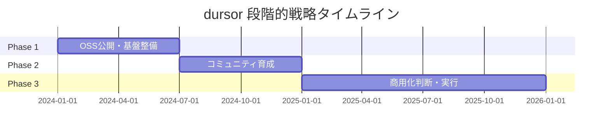

## Phase 1: OSS公開（0-6ヶ月）

### 目標

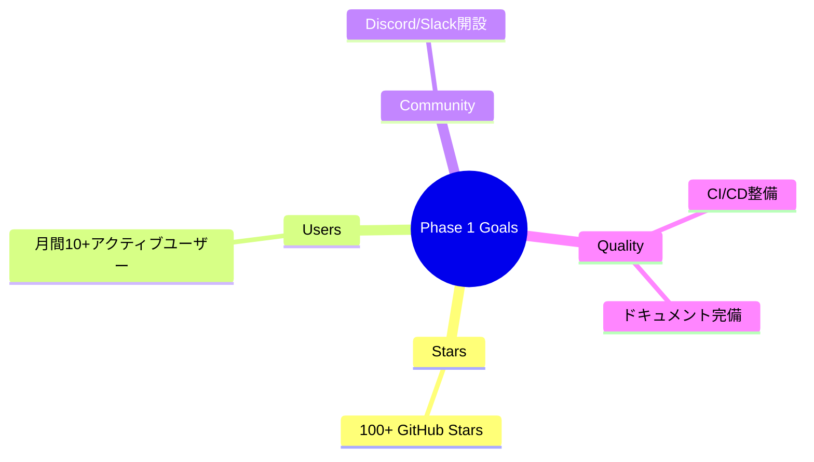

### タスク一覧

| タスク | 優先度 | 工数 | 状態 |
|--------|--------|------|------|
| CONTRIBUTING.md 作成 | 高 | 2h | 完了 |
| GitHub Actions CI 設定 | 高 | 4h | 完了 |
| Issue/PR テンプレート作成 | 中 | 1h | 完了 |
| Discord/Slack サーバー開設 | 中 | 1h | 未着手 |
| GitHub Sponsors 有効化 | 低 | 30m | 未着手 |
| CHANGELOG.md 作成 | 中 | 1h | 未着手 |
| SECURITY.md 作成 | 高 | 1h | 未着手 |
| README バッジ追加 | 低 | 30m | 未着手 |
| デモ動画/スクリーンショット追加 | 中 | 2h | 未着手 |
| v0.1.0 タグ作成 | 高 | 30m | 未着手 |

### 公開前チェックリスト

- [ ] README.md にバッジ追加（CI, License, Stars）
- [ ] .env.example の機密情報確認
- [ ] ハードコードされた機密情報がないか確認
- [ ] リポジトリURL を実際のものに更新
- [ ] デモ動画/スクリーンショット追加
- [ ] 初回リリース（v0.1.0 タグ）作成

### v0.2 機能開発

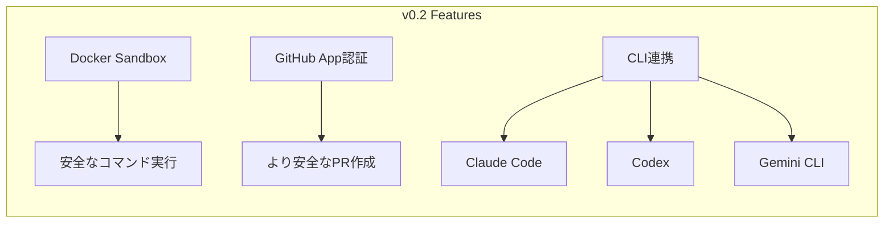

## Phase 2: コミュニティ育成（6-12ヶ月）

### 目標

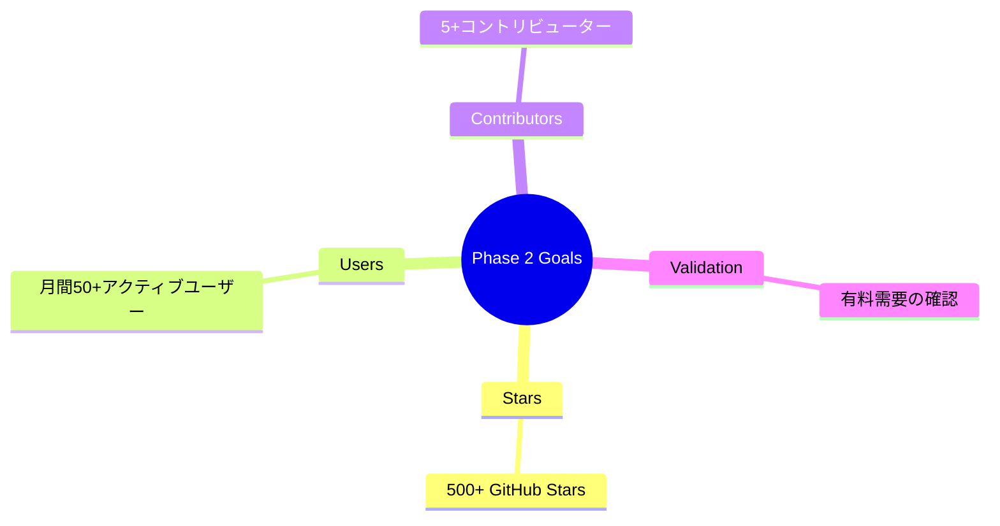

### 活動内容

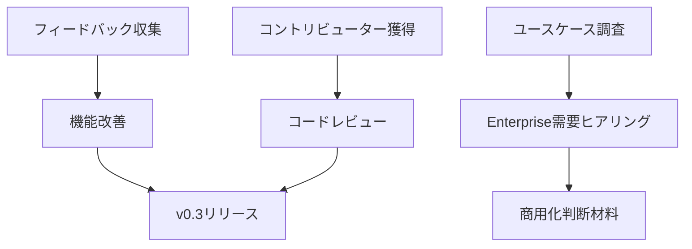

### v0.3 機能開発

| 機能 | 説明 | 優先度 |
|------|------|--------|
| マルチユーザー対応 | 複数ユーザーでの利用 | 高 |
| コスト管理 | 利用量の追跡・制限 | 高 |
| ポリシーインジェクション | コーディング規約の強制 | 中 |
| Review/Meta Agent | 生成コードのレビュー | 中 |

## Phase 3: 商用化判断（12ヶ月以降）

### 判断フロー

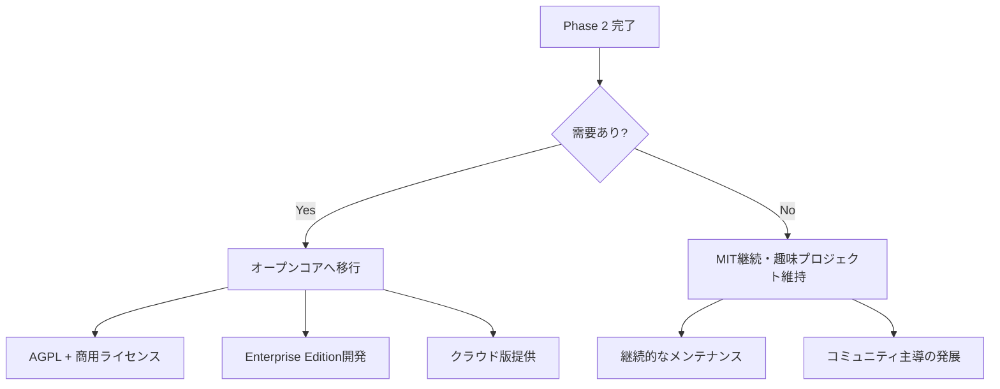

### 需要ありと判断する条件

- GitHub Stars 500+
- 月間アクティブユーザー 50+
- 企業からの商用利用問い合わせ 3件以上
- 「有料でも使いたい」というフィードバック

### オープンコア移行時のタスク

| タスク | 工数 | 依存関係 |
|--------|------|----------|
| ライセンス変更（AGPL） | 1d | - |
| 商用ライセンス条件整備 | 3d | 法務確認 |
| Enterprise機能開発 | 2-4w | 需要確認 |
| 決済システム構築 | 1w | - |
| 価格設定 | 1d | 市場調査 |

## KPI トラッキング

### 主要指標

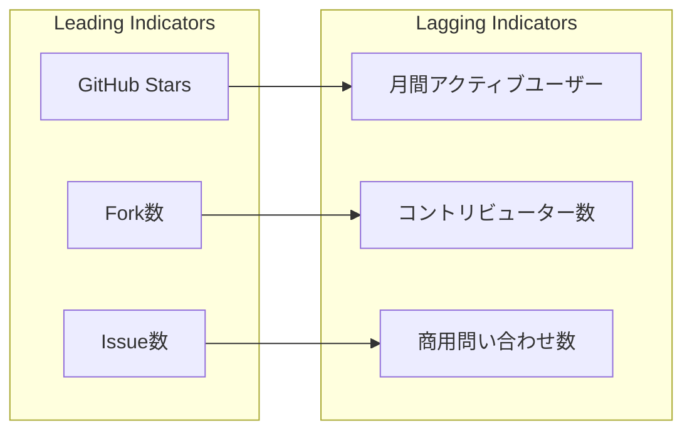

### 目標値

| 指標 | Phase 1 | Phase 2 | Phase 3 |
|------|---------|---------|---------|
| GitHub Stars | 100 | 500 | 2,000 |
| 月間アクティブユーザー | 10 | 50 | 200 |
| コントリビューター | 1 | 5 | 20 |
| 商用問い合わせ | - | 3 | 10 |

## リスク管理

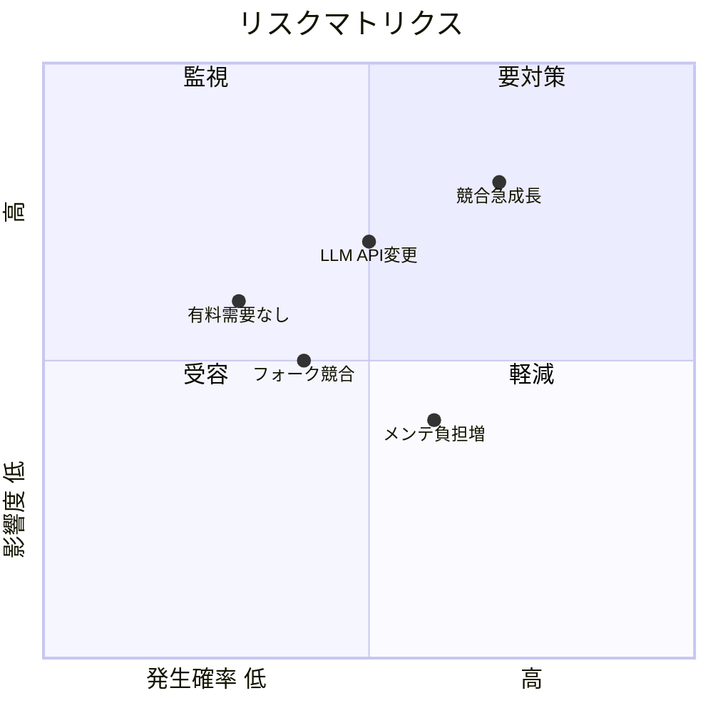

### リスク対策

| リスク | 発生確率 | 影響度 | 対策 |
|--------|----------|--------|------|
| 競合の急成長 | 高 | 高 | ニッチ（BYOキー、セルフホスト）に集中 |
| LLM API変更 | 中 | 高 | 複数プロバイダー対応を維持 |
| フォーク競合 | 中 | 中 | AGPL採用で商用フォーク抑止 |
| メンテ負担増 | 高 | 中 | 明確なスコープ定義、コントリビューター育成 |
| 有料需要なし | 低 | 高 | Phase 2でしっかり検証してから投資 |

## 成功の定義

### Phase 1 成功

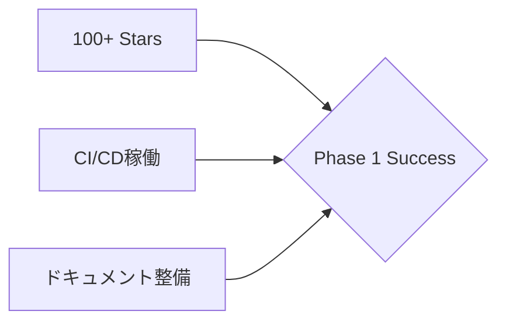

### Phase 2 成功

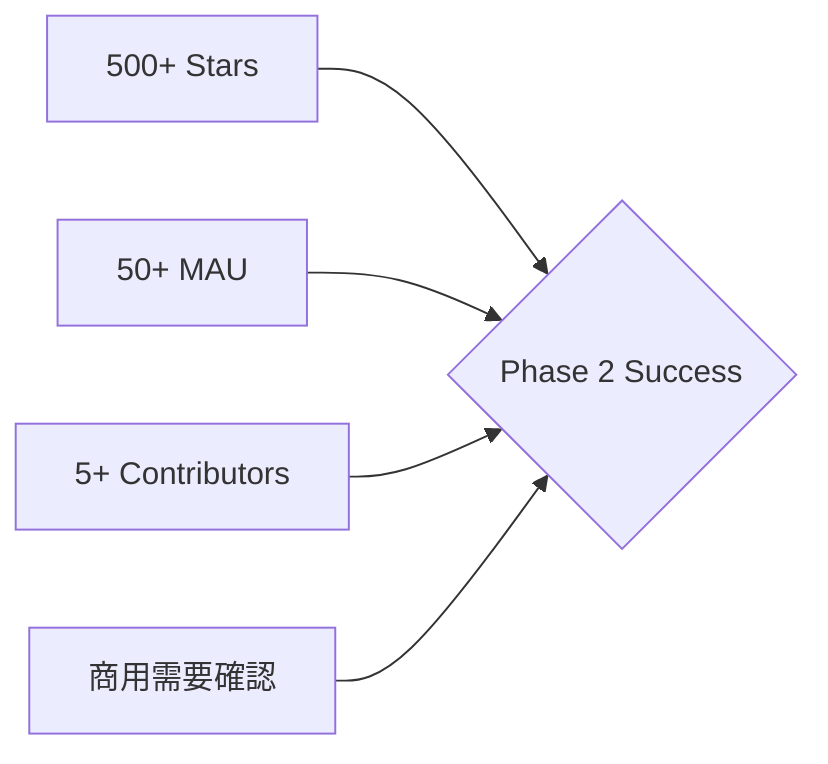

### Phase 3 成功

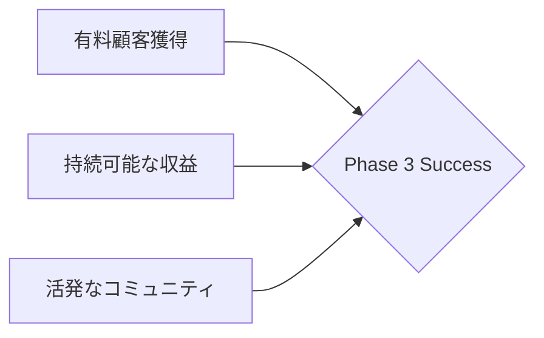

## 関連ドキュメント

- [ビジネス戦略](./business-strategy.md)
- [オープンコアモデル詳細](./open-core-model.md)
- [ライセンス戦略](./licensing-strategy.md)
