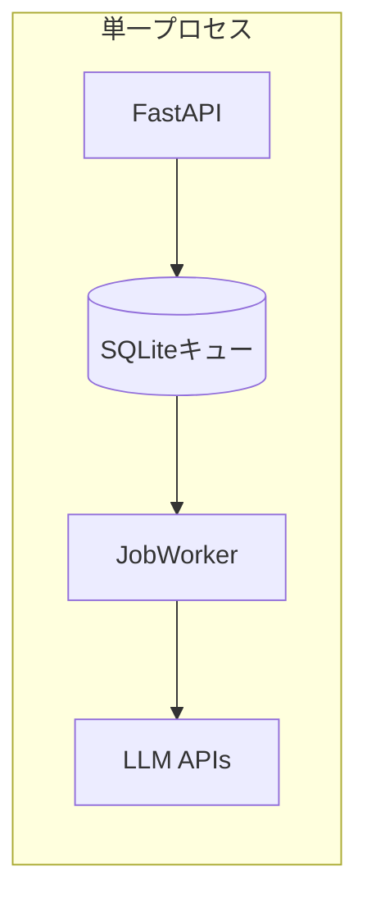
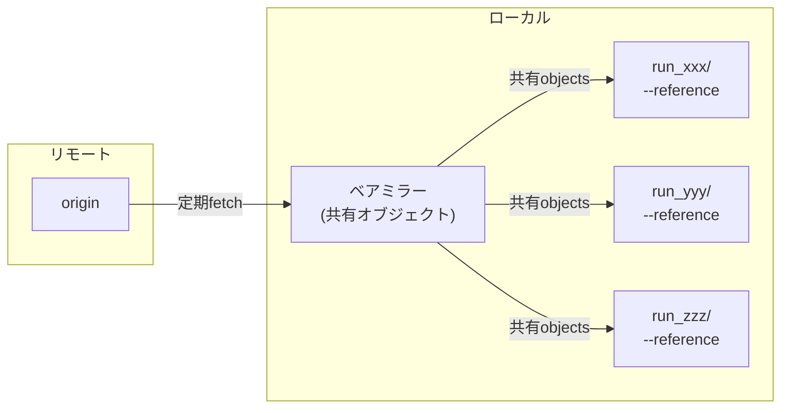
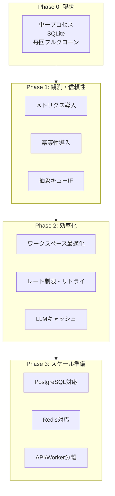

# スケーラビリティ問題点と解決策

## 概要

本ドキュメントでは、zlothアーキテクチャにおけるスケーラビリティの問題点を洗い出し、解決のためのアクションアイテムを優先度付きで整理する。

**前提**: 単一サーバー・ローカルホストでの複数タスク同時実行を主眼とする。

**主要ボトルネック**:
- 単一ノード・単一ライタ前提のSQLite
- SQLiteバックドのポーリング型ジョブキュー
- CIステータスのポーリング（30秒間隔）
- Runごとの完全クローン（`git clone --depth=1`）
- CLIサブプロセス多用によるオーバーヘッド
- 外部APIのレート制限・リトライ戦略の不足

---

## 問題点一覧

### 1. データベース: SQLiteの制限

**問題**
- SQLiteはシングルライター制限があり、同時書き込みでロック競合が発生
- WALモードでも書き込みスループットに上限がある
- 接続プールの概念がなく、高負荷時にパフォーマンス劣化
- HA/フェイルオーバーが困難

**影響**
- 複数タスク同時実行でのスループット低下
- 同時Run実行数の実質的な上限が発生
- ジョブキューの`claim_next()`でロック待ちが発生

**現状コード** (`storage/db.py`)
```python
# 単一コネクション、プールなし
self._connection: aiosqlite.Connection | None = None
```

---

### 2. ジョブキュー: SQLiteベースのポーリング型キュー

**問題**
- `JobWorker`が単一プロセス内で動作
- SQLite + ポーリング + `asyncio.Semaphore`はプロセス/ノードを跨ぐ協調が不可能
- 取りこぼし/重複/スループット限界/無駄ポーリングの懸念
- 可視性タイムアウト、再配信、優先度、遅延実行の機能が不足

**影響**
- 水平スケールが不可能
- APIサーバーとワーカーがリソースを奪い合う
- LLM API呼び出しの並列度がサーバー1台の性能に制限

**現状コード** (`services/job_worker.py`)
```python
# セマフォベースの同時実行制御（単一プロセス内）
self._semaphore = asyncio.Semaphore(max_concurrent)
```

**アーキテクチャ図（現状）**


---

### 3. ワークスペース: Runごとの完全クローン

**問題**
- 各Runで`git clone --depth=1`を実行（ネットワーク帯域・ストレージIO負荷）
- 差分再利用がない
- 大規模リポジトリでクローン時間が増大
- ディスク容量消費が大きい

**影響**
- ディスクI/Oがボトルネック
- 同時Run数増加でネットワーク帯域を圧迫
- Run開始までの待ち時間が増大

**現状コード** (`services/workspace_service.py`)
```python
# 毎回フルクローン
async def create_worktree(self, ...) -> str:
    workspace_path = self._workspaces_dir / f"run_{run_id}"
    await self._git_service.clone_shallow(repo_url, workspace_path)
```

---

### 4. シングルインスタンス構成

**問題**
- APIサーバーとJobWorkerが同一プロセスで起動
- 起動時に`JobWorker.start()`が呼ばれ、同一イベントループで動作
- リソース分離ができない

**影響**
- APIレスポンス遅延時にジョブ処理も遅延
- メモリ使用量が単一プロセスに集中
- 障害時に全機能が停止

**現状コード** (`main.py`)
```python
@app.on_event("startup")
async def startup():
    await job_worker.start()  # 同一プロセスで起動
```

---

### 5. CLIサブプロセス実行のオーバーヘッド

**問題**
- エグゼキューター（Claude Code/Codex/Gemini CLI）がサブプロセスとして起動
- プロセス生成のオーバーヘッド
- CPU/メモリ/IOの資源隔離が不足
- 大量並列時に競合が発生

**影響**
- 同時実行数増加でシステム全体が不安定化
- メモリ枯渇リスク
- プロセス数上限に到達

---

### 6. CIステータスのポーリング

**問題**
- 30秒間隔のポーリングで GitHub Actions のステータスを取得
- 規模増大でAPI呼び出しが線形増加
- レート制限に抵触するリスク

**影響**
- CI完了検知の遅延（最大30秒）
- GitHub APIレート制限への抵触
- 無駄なAPI呼び出しによるリソース消費

**現状設定** (`config.py`)
```python
ci_polling_interval: int = 30  # 秒
```

---

### 7. 外部API呼び出しのレート制限対策不足

**問題**
- LLM API（OpenAI/Anthropic/Google）呼び出しのレート制限対策が不十分
- プロバイダー別の同時実行上限が未設定
- リトライ戦略（Exponential backoff + ジッター）が明示的でない
- サーキットブレーカーパターン未実装
- LLM出力キャッシュ（プロンプト正規化 + TTL）がない

**影響**
- 高負荷時にAPI制限でジョブ失敗率上昇
- 429エラー時のリトライが非効率
- 障害時のカスケード障害リスク
- 同一プロンプトへの重複課金

---

### 8. 冪等性と重複制御の欠如

**問題**
- `create_runs()`等への冪等キーが未整備
- 同一リクエストの二重投入を検知・拒否する仕組みがない
- ネットワーク障害時のリトライで重複Runが発生する可能性

**影響**
- 負荷増幅の温床
- 同一タスクの重複実行によるリソース浪費
- 不整合な状態の発生リスク

---

### 9. 観測可能性の不足

**問題**
- キュー滞留/実行時間/失敗率などのKPI計測が不足
- 構造化ログが未整備
- OpenTelemetryトレースがない
- メトリクスエンドポイントがない

**影響**
- ボトルネックの特定が困難
- 障害の根本原因分析が困難
- パフォーマンスチューニングの指標がない

---

### 10. リアルタイム配信の設計

**問題**
- `StreamingLogs`はあるがSSE/WSの方式・スケールパスが不明確
- `OutputManager`がインメモリでログを保持
- WebSocket/SSE接続がプロセスローカル

**影響**
- プロセス再起動でSSE接続が切断
- 水平スケール時にログ配信が不整合

**現状コード** (`services/output_manager.py`)
```python
# インメモリキュー
self._queues: dict[str, asyncio.Queue] = {}
```

---

## 解決策（優先度順）

### 優先度マトリクス

| 優先度 | 項目 | 工数 | 効果 | 単一サーバー重要度 |
|--------|------|------|------|-------------------|
| **P0** | 抽象キューIF + Redis実装 | 中 | 高 | 高 |
| **P0** | PostgreSQL対応 | 中 | 高 | 中 |
| **P0** | 冪等性の導入 | 低 | 高 | 高 |
| **P0** | 観測可能性の整備 | 中 | 高 | 高 |
| **P1** | ワークスペース最適化（ベアミラー） | 中 | 高 | 高 |
| **P1** | APIとWorkerの分離 | 低 | 中 | 中 |
| **P1** | 外部APIレート制限・リトライ | 低 | 中 | 高 |
| **P1** | LLM出力キャッシュ | 中 | 中 | 中 |
| **P2** | 実行環境のコンテナ隔離 | 高 | 中 | 低 |
| **P2** | リアルタイム配信の方式確定 | 中 | 中 | 低 |
| **P2** | バックプレッシャ/サーキットブレーカ | 中 | 中 | 中 |
| **P3** | CIをWebhook駆動へ | 高 | 中 | 低 |
| **P3** | 多テナント/クォータ | 高 | 低 | 低 |

---

### P0: 抽象キューIF + Redis実装

**目的**: キューの拡張性確保、将来の分散対応準備

**実装方針**
1. 抽象キューインターフェース（`QueueBackend`）を導入
2. SQLite実装を開発用フォールバックに限定
3. Redis実装を追加（可視性タイムアウト、再配信、優先度、遅延、メトリクス）
4. `sqlite://` / `redis://` で切り替え可能に

**インターフェース設計**
```python
from abc import ABC, abstractmethod

class QueueBackend(ABC):
    @abstractmethod
    async def enqueue(self, job: Job, delay: float = 0, priority: int = 0) -> str:
        """ジョブをキューに追加"""
        pass

    @abstractmethod
    async def dequeue(self, visibility_timeout: float = 300) -> Job | None:
        """ジョブを取得（可視性タイムアウト付き）"""
        pass

    @abstractmethod
    async def complete(self, job_id: str) -> None:
        """ジョブを完了としてマーク"""
        pass

    @abstractmethod
    async def fail(self, job_id: str, error: str, retry: bool = True) -> None:
        """ジョブを失敗としてマーク（リトライ可否指定）"""
        pass

    @abstractmethod
    async def get_stats(self) -> QueueStats:
        """キュー統計を取得"""
        pass
```

**変更対象ファイル**
- `services/queue_backend.py` (新規) - 抽象IF定義
- `services/sqlite_queue.py` (新規) - SQLite実装
- `services/redis_queue.py` (新規) - Redis実装
- `services/job_worker.py` - QueueBackendを使用するよう変更
- `config.py` - `ZLOTH_QUEUE_URL`設定追加

---

### P0: PostgreSQL対応

**目的**: 同時書き込み性能の向上、接続プール対応

**実装方針**
1. `asyncpg`ライブラリの導入
2. 既存スキーマのPostgreSQL互換化
3. 環境変数で切り替え可能に（`ZLOTH_DATABASE_URL`）
4. Alembicによるマイグレーション管理
5. `FOR UPDATE SKIP LOCKED`相当のロック戦略

**段階移行順序**
1. Job/Run/Message（高書き込み頻度）
2. Task/PR/Review
3. ModelProfile/Repo/Backlog

**変更対象ファイル**
- `storage/db.py` - 接続管理、プール対応
- `storage/dao.py` - クエリ調整（プレースホルダー`?`→`$1`）
- `storage/schema.sql` - PostgreSQL構文対応
- `config.py` - DATABASE_URL設定追加
- `alembic/` (新規) - マイグレーション

**スキーマ変更例**
```sql
-- SQLite
created_at TEXT DEFAULT (datetime('now'))

-- PostgreSQL
created_at TIMESTAMPTZ DEFAULT NOW()
```

---

### P0: 冪等性の導入

**目的**: 重複投入の防止、信頼性向上

**実装方針**
1. `task_id` + 入力ハッシュで冪等キーを生成
2. 重複投入は`409 Conflict`で拒否
3. 冪等キーをDBに保存（TTL付き）

**コード例**
```python
import hashlib

def generate_idempotency_key(task_id: str, instruction: str, model_ids: list[str]) -> str:
    """冪等キーを生成"""
    content = f"{task_id}:{instruction}:{sorted(model_ids)}"
    return hashlib.sha256(content.encode()).hexdigest()[:32]

async def create_runs(self, task_id: str, data: RunCreate) -> list[Run]:
    idempotency_key = generate_idempotency_key(task_id, data.instruction, data.model_ids)

    # 重複チェック
    existing = await self._idempotency_dao.get(idempotency_key)
    if existing:
        raise DuplicateRequestError(f"Duplicate request: {idempotency_key}")

    # 冪等キーを保存（TTL: 24時間）
    await self._idempotency_dao.create(idempotency_key, ttl=86400)

    # Run作成処理...
```

**変更対象ファイル**
- `services/run_service.py` - 冪等キー生成・チェック
- `storage/idempotency_dao.py` (新規) - 冪等キー管理
- `routes/runs.py` - 409レスポンス追加

---

### P0: 観測可能性の整備

**目的**: ボトルネック特定、パフォーマンス計測

**実装方針**
1. Prometheus互換メトリクスエンドポイント（`/metrics`）
2. `prometheus-client`ライブラリの導入
3. 構造化ログ（`structlog`）
4. OpenTelemetryトレース（オプション）

**計測対象メトリクス**
```python
from prometheus_client import Counter, Histogram, Gauge

# キュー関連
queue_size = Gauge('zloth_queue_size', 'Current queue size', ['kind'])
queue_latency = Histogram('zloth_queue_latency_seconds', 'Time in queue before processing')

# ジョブ関連
job_duration = Histogram('zloth_job_duration_seconds', 'Job execution duration', ['kind', 'status'])
job_total = Counter('zloth_jobs_total', 'Total jobs processed', ['kind', 'status'])

# 外部API関連
llm_requests = Counter('zloth_llm_requests_total', 'LLM API requests', ['provider', 'status'])
llm_latency = Histogram('zloth_llm_latency_seconds', 'LLM API latency', ['provider'])
llm_tokens = Counter('zloth_llm_tokens_total', 'LLM tokens used', ['provider', 'direction'])

# Git関連
git_clone_duration = Histogram('zloth_git_clone_seconds', 'Git clone duration')
git_clone_size = Histogram('zloth_git_clone_bytes', 'Git clone size in bytes')
```

**変更対象ファイル**
- `routes/metrics.py` (新規) - `/metrics`エンドポイント
- `services/metrics.py` (新規) - メトリクス定義
- `main.py` - ルート追加
- 各サービス - メトリクス計測コード追加

---

### P1: ワークスペース最適化

**目的**: クローン時間・ディスク使用量の大幅削減

**実装方針**
1. リポジトリごとの中央ベアミラー（`--mirror`）を維持
2. `git clone --reference`または`git alternates`で共有オブジェクト
3. `partial clone`（`--filter=blob:none`）で遅延フェッチ
4. `sparse-checkout`で必要ファイルのみ取得

**アーキテクチャ**


**コード例**
```python
async def create_workspace_optimized(self, repo_url: str, run_id: str) -> str:
    """最適化されたワークスペース作成"""
    mirror_path = self._mirrors_dir / self._url_to_dirname(repo_url)
    workspace_path = self._workspaces_dir / f"run_{run_id}"

    # ベアミラーがなければ作成、あれば更新
    if not mirror_path.exists():
        await self._git_service.clone_mirror(repo_url, mirror_path)
    else:
        await self._git_service.fetch_mirror(mirror_path)

    # --referenceで共有オブジェクトを使用
    await self._git_service.clone_with_reference(
        repo_url,
        workspace_path,
        reference=mirror_path,
        depth=1,
        sparse_checkout=True,
    )

    return str(workspace_path)
```

**期待効果**
- クローン時間: 50%以上削減
- ディスク使用量: 60%以上削減

**変更対象ファイル**
- `services/workspace_service.py` - 最適化実装
- `services/git_service.py` - ミラー/参照クローン対応
- `config.py` - `ZLOTH_MIRRORS_DIR`設定追加

---

### P1: APIとWorkerの分離

**目的**: リソース分離、独立デプロイ

**実装方針**
1. `main.py`からJobWorker起動を分離
2. `worker.py`エントリポイントを新設
3. Docker Composeで別サービスとして定義
4. APIはステートレス化、Workerはキューのみ監視

**Dockerfile変更**
```dockerfile
# API用
CMD ["uvicorn", "zloth_api.main:app", "--host", "0.0.0.0"]

# Worker用
CMD ["python", "-m", "zloth_api.worker"]
```

**docker-compose.yml追加**
```yaml
services:
  api:
    build: ./apps/api
    command: uvicorn zloth_api.main:app --host 0.0.0.0
    environment:
      - ZLOTH_WORKER_ENABLED=false

  worker:
    build: ./apps/api
    command: python -m zloth_api.worker
    environment:
      - ZLOTH_WORKER_ENABLED=true
    deploy:
      replicas: 2  # 単一サーバーでも複数ワーカー可能
```

---

### P1: 外部APIレート制限・リトライ

**目的**: 外部API呼び出しの安定化

**実装方針**
1. `tenacity`ライブラリでExponential backoff + ジッター
2. プロバイダー別の同時実行上限（セマフォ）
3. トークンバケットによるレート制限
4. サーキットブレーカーパターン

**コード例**
```python
import asyncio
from tenacity import retry, wait_exponential_jitter, stop_after_attempt, retry_if_exception_type

class LLMRateLimiter:
    """プロバイダー別レート制限"""

    def __init__(self) -> None:
        self._semaphores = {
            Provider.OPENAI: asyncio.Semaphore(10),      # 同時10リクエスト
            Provider.ANTHROPIC: asyncio.Semaphore(5),   # 同時5リクエスト
            Provider.GOOGLE: asyncio.Semaphore(10),     # 同時10リクエスト
        }

    @retry(
        wait=wait_exponential_jitter(initial=1, max=60, jitter=5),
        stop=stop_after_attempt(5),
        retry=retry_if_exception_type((RateLimitError, TimeoutError)),
    )
    async def call_with_rate_limit(
        self,
        provider: Provider,
        func: Callable[..., Awaitable[T]],
        *args,
        **kwargs,
    ) -> T:
        async with self._semaphores[provider]:
            return await func(*args, **kwargs)
```

**変更対象ファイル**
- `agents/llm_router.py` - レート制限適用
- `services/rate_limiter.py` (新規) - レート制限実装
- `executors/base.py` - リトライ戦略追加

---

### P1: LLM出力キャッシュ

**目的**: 同一プロンプトへの重複課金防止、レスポンス高速化

**実装方針**
1. プロンプト正規化（空白・改行の正規化）
2. プロンプトハッシュをキーとしてキャッシュ
3. TTL付きキャッシュ（デフォルト: 1時間）
4. Redis または ローカルファイルキャッシュ

**コード例**
```python
import hashlib
from typing import Any

class LLMCache:
    """LLM出力キャッシュ"""

    def __init__(self, backend: CacheBackend, default_ttl: int = 3600) -> None:
        self._backend = backend
        self._default_ttl = default_ttl

    def _normalize_prompt(self, prompt: str) -> str:
        """プロンプトを正規化"""
        return " ".join(prompt.split())

    def _generate_key(self, provider: str, model: str, prompt: str, **params: Any) -> str:
        """キャッシュキーを生成"""
        normalized = self._normalize_prompt(prompt)
        content = f"{provider}:{model}:{normalized}:{sorted(params.items())}"
        return f"llm_cache:{hashlib.sha256(content.encode()).hexdigest()}"

    async def get_or_generate(
        self,
        provider: str,
        model: str,
        prompt: str,
        generator: Callable[[], Awaitable[str]],
        ttl: int | None = None,
        **params: Any,
    ) -> tuple[str, bool]:
        """キャッシュから取得、なければ生成"""
        key = self._generate_key(provider, model, prompt, **params)

        cached = await self._backend.get(key)
        if cached is not None:
            return cached, True  # (result, from_cache)

        result = await generator()
        await self._backend.set(key, result, ttl=ttl or self._default_ttl)
        return result, False
```

---

### P2: 実行環境のコンテナ隔離

**目的**: リソース隔離、安定性向上

**実装方針**
1. エグゼキューターを軽量コンテナ（Docker）で実行
2. cgroupによるCPU/メモリ/IO制御
3. スロット管理（同時実行コンテナ数制限）

**単一サーバーでの考慮事項**
- Docker-in-Dockerの複雑性
- オーバーヘッド（コンテナ起動時間）
- ディスク使用量増加

---

### P2: リアルタイム配信の方式確定

**目的**: スケーラブルなログ配信

**実装方針**
1. SSEに統一（WebSocketより実装シンプル）
2. Redis Pub/Subを中継に使用
3. 単一サーバーではインメモリでも可

---

### P2: バックプレッシャ/サーキットブレーカ

**目的**: 下流障害時の安定性確保

**実装方針**
1. キュー長上限の設定
2. 上限到達時は新規ジョブを拒否（503 Service Unavailable）
3. サーキットブレーカーで障害検知・自動復旧

```python
from circuitbreaker import circuit

@circuit(failure_threshold=5, recovery_timeout=60)
async def call_llm_api(self, ...):
    ...
```

---

### P3: CIをWebhook駆動へ

**目的**: ポーリングの削減、レスポンス高速化

**実装方針**
1. GitHub Webhook エンドポイントを追加
2. `check_run` / `check_suite` イベントを受信
3. ポーリングは障害時フォールバック + 指数バックオフ

**注意**: 複雑性が増すため優先度は低め

---

### P3: 多テナント/クォータ

**目的**: リソースの公平な配分

**実装方針**
1. ユーザー/リポジトリ単位の同時実行上限
2. 優先度キュー
3. 課金/予算連動

---

## 計測目標

| 指標 | 現状推定 | 目標 |
|------|----------|------|
| キュー滞留 p95 | 不明 | < 5秒 |
| ジョブ開始まで p95 | 不明 | < 10秒 |
| 外部APIレート制限エラー | 不明 | < 1% |
| 外部API 5xx率 | 不明 | < 0.1% |
| git clone 平均時間 | 不明 | 50%以上削減 |
| Runあたりディスク使用量 | 不明 | 60%以上削減 |
| 安定同時実行数 | 不明 | 現状比 4× |

---

## すぐに着手できる実装タスク

### 最優先（P0）
1. [ ] 抽象キューIF追加 + SQLite実装の分離
2. [ ] `prometheus-client`導入、`/metrics`エンドポイント追加
3. [ ] `RunService.create_runs()`に冪等キー導入（重複は`409`）
4. [ ] キュー滞留・処理時間のメトリクス計測開始

### 次優先（P1）
5. [ ] LLM呼び出しのセマフォをプロバイダー別に分離
6. [ ] `tenacity`によるリトライ戦略追加
7. [ ] gitベアミラー + `--reference`クローンの実装
8. [ ] `sparse-checkout`の既定化

### その後（P2）
9. [ ] Alembic初期化、PostgreSQLマイグレーション作成
10. [ ] `docker-compose.yml`に`postgres`/`redis`追加
11. [ ] API/Worker分離用の`worker.py`エントリポイント作成

---

## 推奨移行パス（単一サーバー重視）



---

## まとめ

| フェーズ | 主要タスク | 期待効果 |
|---------|-----------|---------|
| **Phase 1** | メトリクス + 冪等性 + キュー抽象化 | 可視性向上、重複防止、拡張準備 |
| **Phase 2** | ワークスペース最適化 + レート制限 | 効率改善、安定性向上 |
| **Phase 3** | PostgreSQL + Redis + 分離 | スケール基盤完成 |

単一サーバー環境では、まず**観測可能性**と**冪等性**を整備し、次に**ワークスペース最適化**と**レート制限**で効率を改善することが最も効果的。DB/キューの分散対応は将来のスケールアウトに備えた準備として段階的に進める。
