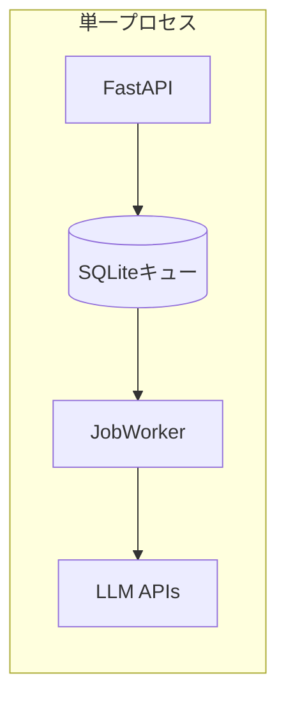
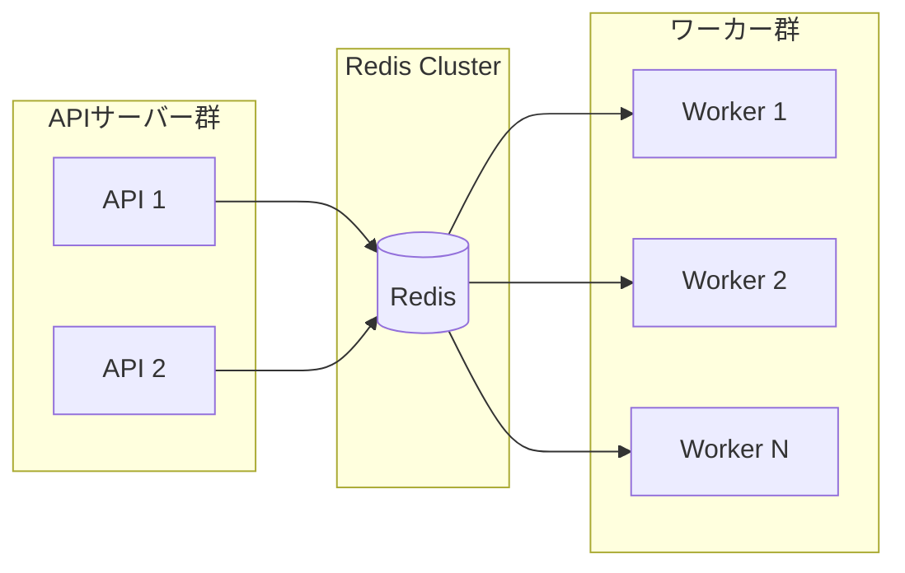
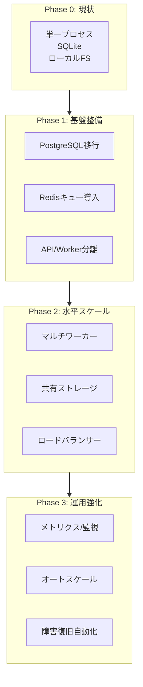

# スケーラビリティ問題点と解決策

## 概要

本ドキュメントでは、zlothアーキテクチャにおけるスケーラビリティの問題点を洗い出し、解決のためのアクションアイテムを優先度付きで整理する。

## 問題点一覧

### 1. データベース: SQLiteの制限

**問題**
- SQLiteはシングルライター制限があり、同時書き込みでロック競合が発生
- WALモードでも書き込みスループットに上限がある
- 接続プールの概念がなく、高負荷時にパフォーマンス劣化

**影響**
- 複数ユーザー・複数ワーカーでのスループット低下
- 同時Run実行数の実質的な上限が発生
- ジョブキューの`claim_next()`でロック待ちが発生

**現状コード** (`storage/db.py`)
```python
# 単一コネクション、プールなし
self._connection: aiosqlite.Connection | None = None
```

---

### 2. ジョブキュー: SQLiteベースの単一ワーカー

**問題**
- `JobWorker`が単一プロセス内で動作
- ジョブはSQLiteに永続化されるが、分散ワーカー非対応
- `claim_next()`のロック機構が単一インスタンス前提

**影響**
- 水平スケールが不可能
- APIサーバーとワーカーがリソースを奪い合う
- LLM API呼び出しの並列度がサーバー1台の性能に制限

**現状コード** (`services/job_worker.py`)
```python
# セマフォベースの同時実行制御（単一プロセス内）
self._semaphore = asyncio.Semaphore(max_concurrent)
```

**アーキテクチャ図（現状）**


---

### 3. ワークスペース: ローカルファイルシステム依存

**問題**
- `workspaces/`がローカルディスクに依存
- 各Runで`git clone --depth=1`を実行（I/O負荷）
- 複数サーバー構成で共有不可

**影響**
- ディスクI/Oがボトルネック
- 大規模リポジトリでクローン時間が増大
- マルチノード構成で状態共有が困難

**現状コード** (`services/workspace_service.py`)
```python
# ローカルパスへのクローン
async def create_worktree(self, ...) -> str:
    workspace_path = self._workspaces_dir / f"run_{run_id}"
    await self._git_service.clone_shallow(repo_url, workspace_path)
```

---

### 4. シングルインスタンス構成

**問題**
- APIサーバーとJobWorkerが同一プロセスで起動
- 起動時に`JobWorker.start()`が呼ばれ、同一イベントループで動作
- リソース分離ができない

**影響**
- APIレスポンス遅延時にジョブ処理も遅延
- メモリ使用量が単一プロセスに集中
- 障害時に全機能が停止

**現状コード** (`main.py`)
```python
@app.on_event("startup")
async def startup():
    await job_worker.start()  # 同一プロセスで起動
```

---

### 5. セッション/状態管理

**問題**
- SSE (Server-Sent Events) がローカル状態に依存
- `OutputManager`がインメモリでログを保持
- WebSocket/SSE接続がプロセスローカル

**影響**
- ロードバランサー導入時にセッションアフィニティが必要
- プロセス再起動でSSE接続が切断
- 水平スケール時にログ配信が不整合

**現状コード** (`services/output_manager.py`)
```python
# インメモリキュー
self._queues: dict[str, asyncio.Queue] = {}
```

---

### 6. 外部API呼び出しのレート制限対策不足

**問題**
- LLM API呼び出しのレート制限対策が不十分
- リトライ戦略（Exponential backoff）が明示的でない
- サーキットブレーカーパターン未実装

**影響**
- 高負荷時にAPI制限でジョブ失敗率上昇
- 429エラー時のリトライが非効率
- 障害時のカスケード障害リスク

---

## 解決策（優先度順）

### 優先度マトリクス

| 優先度 | 項目 | 工数 | 効果 |
|--------|------|------|------|
| **P0** | PostgreSQL対応 | 中 | 高 |
| **P0** | 分散ジョブキュー (Redis) | 中 | 高 |
| **P1** | APIとWorkerの分離 | 低 | 中 |
| **P1** | 共有ストレージ対応 | 中 | 中 |
| **P2** | 接続プール/コネクション管理 | 低 | 中 |
| **P2** | レート制限・リトライ戦略 | 低 | 中 |
| **P3** | ステートレスAPI設計 | 高 | 中 |
| **P3** | メトリクス/監視基盤 | 中 | 低 |

---

### P0: PostgreSQL対応

**目的**: 同時書き込み性能の向上、接続プール対応

**実装方針**
1. `asyncpg`または`databases`ライブラリの導入
2. 既存スキーマのPostgreSQL互換化
3. 環境変数で切り替え可能に（`ZLOTH_DATABASE_URL`）
4. マイグレーションツール（Alembic）の導入

**変更対象ファイル**
- `storage/db.py` - 接続管理
- `storage/dao.py` - クエリ調整（プレースホルダー`?`→`$1`）
- `storage/schema.sql` - PostgreSQL構文対応
- `config.py` - DATABASE_URL設定追加

**スキーマ変更例**
```sql
-- SQLite
created_at TEXT DEFAULT (datetime('now'))

-- PostgreSQL
created_at TIMESTAMPTZ DEFAULT NOW()
```

---

### P0: 分散ジョブキュー (Redis)

**目的**: 複数ワーカーによる水平スケール

**実装方針**
1. Redis (またはRedis互換: Valkey, DragonflyDB) をキューバックエンドに
2. `arq`または`celery`ライブラリの採用
3. ジョブのシリアライズ形式をJSONに統一
4. デッドレター処理の実装

**アーキテクチャ図（目標）**


**変更対象ファイル**
- `services/job_worker.py` → `services/redis_worker.py` (新規)
- `storage/job_dao.py` - Redis対応または廃止
- `dependencies.py` - ワーカー初期化
- `config.py` - REDIS_URL設定追加

---

### P1: APIとWorkerの分離

**目的**: リソース分離、独立デプロイ

**実装方針**
1. `main.py`からJobWorker起動を分離
2. `worker.py`エントリポイントを新設
3. Docker Composeで別サービスとして定義

**Dockerfile変更**
```dockerfile
# API用
CMD ["uvicorn", "zloth_api.main:app", "--host", "0.0.0.0"]

# Worker用
CMD ["python", "-m", "zloth_api.worker"]
```

**docker-compose.yml追加**
```yaml
services:
  api:
    build: ./apps/api
    command: uvicorn zloth_api.main:app --host 0.0.0.0

  worker:
    build: ./apps/api
    command: python -m zloth_api.worker
    deploy:
      replicas: 3
```

---

### P1: 共有ストレージ対応

**目的**: マルチノード構成でのワークスペース共有

**実装方針**
1. NFSマウント対応（シンプル）
2. S3/MinIO対応（オプション、大規模向け）
3. ワークスペースパスを環境変数で設定可能に

**考慮事項**
- NFSのロック問題（`flock`の互換性）
- 大規模リポジトリでのネットワーク遅延
- ローカルキャッシュ戦略

---

### P2: 接続プール/コネクション管理

**目的**: DB接続の効率化

**実装方針**
1. PostgreSQL移行後、`asyncpg`のプール機能を活用
2. `min_size`/`max_size`の設定
3. コネクションヘルスチェック

```python
# asyncpg pool example
pool = await asyncpg.create_pool(
    dsn=DATABASE_URL,
    min_size=5,
    max_size=20,
)
```

---

### P2: レート制限・リトライ戦略

**目的**: 外部API呼び出しの安定化

**実装方針**
1. `tenacity`ライブラリでExponential backoff
2. プロバイダー別のレート制限設定
3. サーキットブレーカーパターン（`circuitbreaker`）

**コード例**
```python
from tenacity import retry, wait_exponential, stop_after_attempt

@retry(
    wait=wait_exponential(multiplier=1, min=4, max=60),
    stop=stop_after_attempt(5),
    retry=retry_if_exception_type(RateLimitError),
)
async def call_llm_api(self, ...):
    ...
```

---

### P3: ステートレスAPI設計

**目的**: 完全な水平スケール対応

**実装方針**
1. SSEログ配信をRedis Pub/Subに移行
2. `OutputManager`のバックエンドをRedisに
3. セッション状態をRedisで共有

**変更対象ファイル**
- `services/output_manager.py` - Redis Pub/Sub対応
- `routes/runs.py` - SSEエンドポイント修正

---

### P3: メトリクス/監視基盤

**目的**: 運用可視化、ボトルネック検出

**実装方針**
1. Prometheus メトリクスエンドポイント（`/metrics`）
2. キュー長、処理時間、エラー率の計測
3. Grafanaダッシュボード

**計測対象**
- `zloth_jobs_queued` - キュー内ジョブ数
- `zloth_job_duration_seconds` - ジョブ処理時間
- `zloth_llm_requests_total` - LLM API呼び出し数
- `zloth_llm_errors_total` - LLM APIエラー数

---

## 推奨移行パス



---

## まとめ

| フェーズ | 主要タスク | 期待効果 |
|---------|-----------|---------|
| **Phase 1** | PostgreSQL + Redis + 分離 | 基本的な水平スケール基盤 |
| **Phase 2** | マルチワーカー + 共有ストレージ | 処理能力の線形スケール |
| **Phase 3** | 監視 + オートスケール | 運用効率化・自動復旧 |

最優先はP0項目（PostgreSQL対応、分散ジョブキュー）であり、これらが完了すれば水平スケールの基盤が整う。
