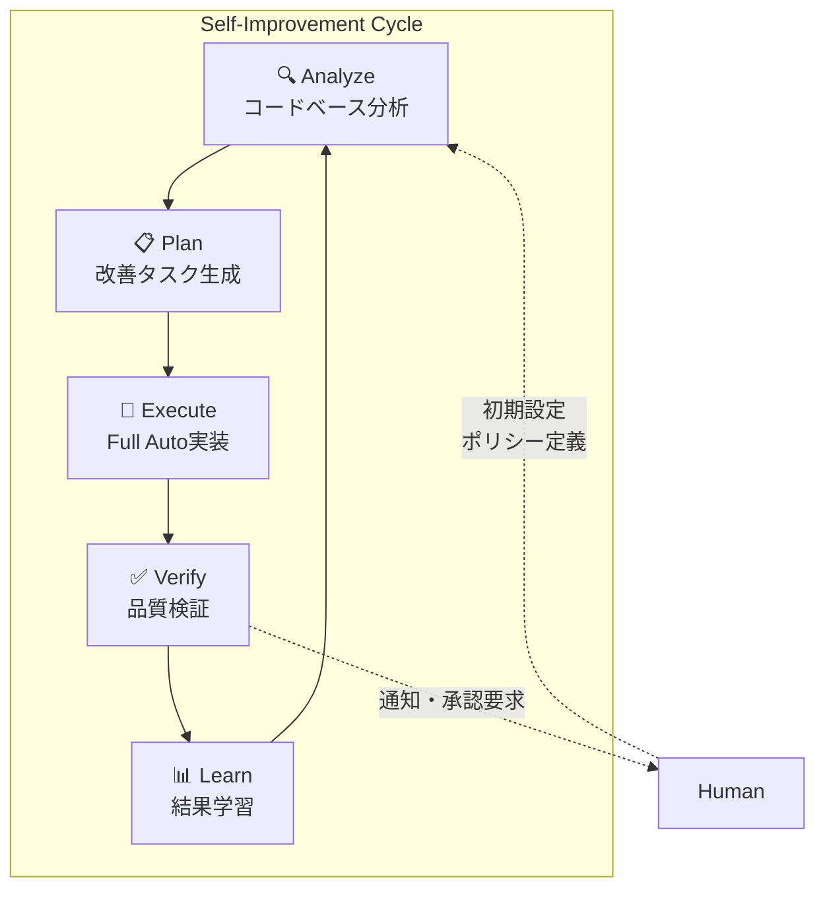
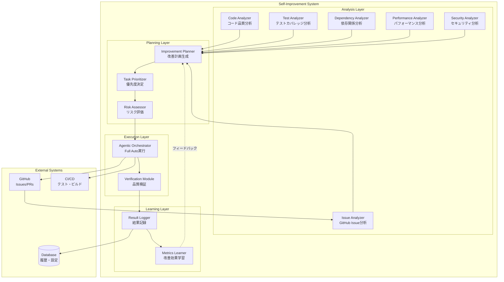
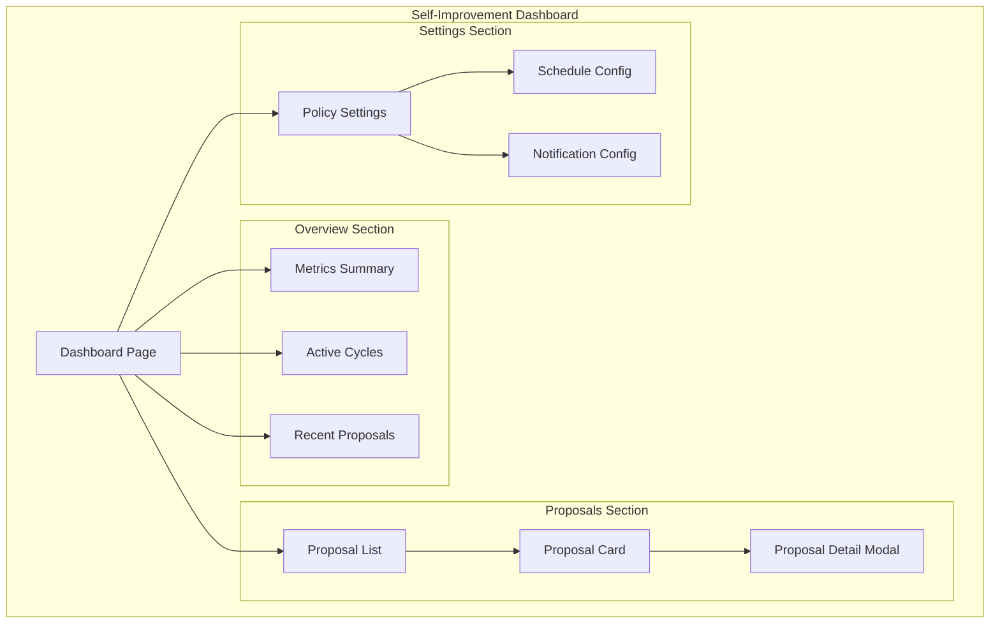

# Self-Improvement 設計ドキュメント

## 概要

dursor を **人間の介入なしにAIが自らプロダクトを改善できる** システムとして設計する。

本機能により、dursorは：
1. 自身のコードベースを分析し、改善点を発見
2. 改善タスクを自動生成
3. Full Autoモードで改善を実装
4. 継続的な改善サイクルを自律的に実行

### ビジョン



### 設計原則

| # | 原則 | 説明 |
|---|------|------|
| 1 | **Safety First** | 破壊的変更は自動適用しない、段階的デプロイ |
| 2 | **Observable** | すべての改善活動を追跡・可視化可能 |
| 3 | **Controllable** | 人間がいつでも介入・停止可能 |
| 4 | **Incremental** | 小さな改善を積み重ねる（Big Bang禁止）|
| 5 | **Reversible** | すべての変更はロールバック可能 |

---

## 関連ドキュメント

- [Agentic Dursor](./agentic-dursor.md) - Full Autoモードの実装詳細
- [Coding Mode](./coding-mode.md) - 3つのコーディングモードの定義
- [Code Review](./review.md) - AIレビュー機能
- [Kanban](./kanban.md) - タスク管理

---

## アーキテクチャ

### システム全体像



### コンポーネント詳細

#### 1. Analysis Layer（分析層）

| Analyzer | 役割 | 入力 | 出力 |
|----------|------|------|------|
| **Code Analyzer** | コード品質・技術的負債の検出 | ソースコード | QualityIssue[] |
| **Test Analyzer** | テストカバレッジ・欠落テストの検出 | テスト結果、カバレッジレポート | TestGap[] |
| **Dependency Analyzer** | 依存パッケージの更新・脆弱性検出 | package.json, pyproject.toml | DependencyUpdate[] |
| **Performance Analyzer** | パフォーマンスボトルネック検出 | プロファイルデータ、メトリクス | PerformanceIssue[] |
| **Security Analyzer** | セキュリティ脆弱性検出 | コード、依存関係 | SecurityVulnerability[] |
| **Issue Analyzer** | GitHub Issueから改善要求を抽出 | GitHub Issues | FeatureRequest[] |

#### 2. Planning Layer（計画層）

| Component | 役割 | 詳細 |
|-----------|------|------|
| **Improvement Planner** | 改善タスクの生成 | 分析結果から具体的なタスクを生成 |
| **Task Prioritizer** | 優先度決定 | ROI、リスク、影響度から優先度を計算 |
| **Risk Assessor** | リスク評価 | 変更の破壊的影響度を評価 |

#### 3. Execution Layer（実行層）

| Component | 役割 | 詳細 |
|-----------|------|------|
| **Agentic Orchestrator** | Full Auto実行 | 既存のAgenticOrchestratorを活用 |
| **Verification Module** | 品質検証 | CI通過、レビュースコア、回帰テスト |

#### 4. Learning Layer（学習層）

| Component | 役割 | 詳細 |
|-----------|------|------|
| **Result Logger** | 結果記録 | 改善の成功/失敗、メトリクス変化 |
| **Metrics Learner** | 効果学習 | 改善効果を分析し、次の計画に反映 |

---

## データモデル

### 改善カテゴリ

```python
# apps/api/src/dursor_api/domain/enums.py

class ImprovementCategory(str, Enum):
    """自己改善のカテゴリ"""
    CODE_QUALITY = "code_quality"           # コード品質向上
    TEST_COVERAGE = "test_coverage"         # テストカバレッジ向上
    DEPENDENCY_UPDATE = "dependency_update" # 依存関係更新
    PERFORMANCE = "performance"             # パフォーマンス改善
    SECURITY = "security"                   # セキュリティ修正
    DOCUMENTATION = "documentation"         # ドキュメント改善
    REFACTORING = "refactoring"             # リファクタリング
    BUG_FIX = "bug_fix"                     # バグ修正
    FEATURE = "feature"                     # 機能追加


class ImprovementPriority(str, Enum):
    """改善の優先度"""
    CRITICAL = "critical"   # 即時対応必須（セキュリティ脆弱性等）
    HIGH = "high"           # 高優先度
    MEDIUM = "medium"       # 中優先度
    LOW = "low"             # 低優先度
    BACKLOG = "backlog"     # いつか対応


class ImprovementRisk(str, Enum):
    """変更のリスクレベル"""
    NONE = "none"           # リスクなし（ドキュメントのみ等）
    LOW = "low"             # 低リスク（テスト追加等）
    MEDIUM = "medium"       # 中リスク（リファクタリング等）
    HIGH = "high"           # 高リスク（API変更等）
    BREAKING = "breaking"   # 破壊的変更（人間承認必須）


class ImprovementStatus(str, Enum):
    """改善タスクのステータス"""
    PROPOSED = "proposed"           # AI提案中
    APPROVED = "approved"           # 承認済み（自動または人間）
    SCHEDULED = "scheduled"         # 実行予定
    IN_PROGRESS = "in_progress"     # 実行中
    VERIFYING = "verifying"         # 検証中
    COMPLETED = "completed"         # 完了
    FAILED = "failed"               # 失敗
    REJECTED = "rejected"           # 却下
    DEFERRED = "deferred"           # 延期
```

### 改善提案モデル

```python
# apps/api/src/dursor_api/domain/models.py

class ImprovementProposal(BaseModel):
    """AIが生成した改善提案"""
    
    id: str
    repo_id: str
    category: ImprovementCategory
    priority: ImprovementPriority
    risk: ImprovementRisk
    status: ImprovementStatus
    
    # 提案内容
    title: str
    description: str
    rationale: str = Field(..., description="改善の根拠・理由")
    expected_benefit: str = Field(..., description="期待される効果")
    
    # 対象
    target_files: list[str] = Field(default_factory=list)
    affected_areas: list[str] = Field(default_factory=list)
    
    # メトリクス
    estimated_effort: str | None = Field(None, description="推定工数")
    impact_score: float = Field(..., ge=0.0, le=1.0, description="影響度スコア")
    confidence_score: float = Field(..., ge=0.0, le=1.0, description="AI確信度")
    
    # 分析ソース
    source_analyzer: str = Field(..., description="検出した分析器")
    source_data: dict | None = Field(None, description="分析の元データ")
    
    # 関連
    related_issues: list[str] = Field(default_factory=list, description="関連GitHub Issue")
    blocking_proposals: list[str] = Field(default_factory=list, description="依存する他の提案")
    
    # タイムスタンプ
    created_at: datetime
    updated_at: datetime
    approved_at: datetime | None = None
    completed_at: datetime | None = None
    
    # 実行結果
    task_id: str | None = Field(None, description="実行時のTask ID")
    pr_number: int | None = Field(None, description="作成されたPR番号")
    result_summary: str | None = None


class ImprovementCycle(BaseModel):
    """改善サイクルの実行記録"""
    
    id: str
    repo_id: str
    started_at: datetime
    completed_at: datetime | None = None
    status: str  # "running", "completed", "failed"
    
    # 分析結果
    analysis_summary: dict = Field(default_factory=dict)
    proposals_generated: int = 0
    proposals_approved: int = 0
    proposals_executed: int = 0
    proposals_completed: int = 0
    
    # 効果測定
    metrics_before: dict | None = None
    metrics_after: dict | None = None
    improvement_delta: dict | None = None


class ImprovementPolicy(BaseModel):
    """改善ポリシー（人間が設定）"""
    
    id: str
    repo_id: str
    
    # 有効/無効設定
    enabled: bool = True
    enabled_categories: list[ImprovementCategory] = Field(
        default_factory=lambda: list(ImprovementCategory)
    )
    
    # 自動実行設定
    auto_approve_risk_levels: list[ImprovementRisk] = Field(
        default_factory=lambda: [ImprovementRisk.NONE, ImprovementRisk.LOW]
    )
    require_human_approval_for: list[ImprovementRisk] = Field(
        default_factory=lambda: [ImprovementRisk.HIGH, ImprovementRisk.BREAKING]
    )
    
    # 制限
    max_concurrent_improvements: int = 3
    max_improvements_per_day: int = 10
    max_risk_score_auto: float = 0.5
    
    # スケジュール
    schedule_cron: str | None = Field(
        "0 2 * * 1",  # 毎週月曜2:00
        description="改善サイクルのcron式"
    )
    
    # 通知
    notify_on_proposal: bool = True
    notify_on_completion: bool = True
    notification_channels: list[str] = Field(default_factory=list)
    
    created_at: datetime
    updated_at: datetime
```

### DBスキーマ

```sql
-- apps/api/src/dursor_api/storage/schema.sql

-- 改善提案テーブル
CREATE TABLE IF NOT EXISTS improvement_proposals (
    id TEXT PRIMARY KEY,
    repo_id TEXT NOT NULL,
    category TEXT NOT NULL,
    priority TEXT NOT NULL,
    risk TEXT NOT NULL,
    status TEXT NOT NULL DEFAULT 'proposed',
    
    title TEXT NOT NULL,
    description TEXT NOT NULL,
    rationale TEXT NOT NULL,
    expected_benefit TEXT NOT NULL,
    
    target_files TEXT,  -- JSON array
    affected_areas TEXT,  -- JSON array
    
    estimated_effort TEXT,
    impact_score REAL NOT NULL,
    confidence_score REAL NOT NULL,
    
    source_analyzer TEXT NOT NULL,
    source_data TEXT,  -- JSON
    
    related_issues TEXT,  -- JSON array
    blocking_proposals TEXT,  -- JSON array
    
    task_id TEXT,
    pr_number INTEGER,
    result_summary TEXT,
    
    created_at DATETIME NOT NULL DEFAULT CURRENT_TIMESTAMP,
    updated_at DATETIME NOT NULL DEFAULT CURRENT_TIMESTAMP,
    approved_at DATETIME,
    completed_at DATETIME,
    
    FOREIGN KEY (repo_id) REFERENCES repos(id) ON DELETE CASCADE,
    FOREIGN KEY (task_id) REFERENCES tasks(id) ON DELETE SET NULL
);

CREATE INDEX idx_proposals_repo ON improvement_proposals(repo_id);
CREATE INDEX idx_proposals_status ON improvement_proposals(status);
CREATE INDEX idx_proposals_priority ON improvement_proposals(priority);
CREATE INDEX idx_proposals_category ON improvement_proposals(category);


-- 改善サイクル記録テーブル
CREATE TABLE IF NOT EXISTS improvement_cycles (
    id TEXT PRIMARY KEY,
    repo_id TEXT NOT NULL,
    started_at DATETIME NOT NULL DEFAULT CURRENT_TIMESTAMP,
    completed_at DATETIME,
    status TEXT NOT NULL DEFAULT 'running',
    
    analysis_summary TEXT,  -- JSON
    proposals_generated INTEGER DEFAULT 0,
    proposals_approved INTEGER DEFAULT 0,
    proposals_executed INTEGER DEFAULT 0,
    proposals_completed INTEGER DEFAULT 0,
    
    metrics_before TEXT,  -- JSON
    metrics_after TEXT,  -- JSON
    improvement_delta TEXT,  -- JSON
    
    FOREIGN KEY (repo_id) REFERENCES repos(id) ON DELETE CASCADE
);

CREATE INDEX idx_cycles_repo ON improvement_cycles(repo_id);
CREATE INDEX idx_cycles_status ON improvement_cycles(status);


-- 改善ポリシーテーブル
CREATE TABLE IF NOT EXISTS improvement_policies (
    id TEXT PRIMARY KEY,
    repo_id TEXT NOT NULL UNIQUE,
    
    enabled INTEGER NOT NULL DEFAULT 1,
    enabled_categories TEXT,  -- JSON array
    
    auto_approve_risk_levels TEXT,  -- JSON array
    require_human_approval_for TEXT,  -- JSON array
    
    max_concurrent_improvements INTEGER DEFAULT 3,
    max_improvements_per_day INTEGER DEFAULT 10,
    max_risk_score_auto REAL DEFAULT 0.5,
    
    schedule_cron TEXT DEFAULT '0 2 * * 1',
    
    notify_on_proposal INTEGER DEFAULT 1,
    notify_on_completion INTEGER DEFAULT 1,
    notification_channels TEXT,  -- JSON array
    
    created_at DATETIME NOT NULL DEFAULT CURRENT_TIMESTAMP,
    updated_at DATETIME NOT NULL DEFAULT CURRENT_TIMESTAMP,
    
    FOREIGN KEY (repo_id) REFERENCES repos(id) ON DELETE CASCADE
);
```

---

## 分析システム

### Code Analyzer（コード品質分析）

```python
# apps/api/src/dursor_api/analyzers/code_analyzer.py

from dataclasses import dataclass
from abc import ABC, abstractmethod


@dataclass
class QualityIssue:
    """コード品質の問題"""
    file_path: str
    line_start: int | None
    line_end: int | None
    severity: str  # "critical", "high", "medium", "low"
    category: str  # "complexity", "duplication", "style", "smell"
    title: str
    description: str
    suggestion: str | None


class CodeAnalyzer:
    """コード品質を分析して改善提案を生成"""
    
    def __init__(
        self,
        llm_client: LLMClient,
        ruff_enabled: bool = True,
        mypy_enabled: bool = True,
    ):
        self.llm_client = llm_client
        self.ruff_enabled = ruff_enabled
        self.mypy_enabled = mypy_enabled
    
    async def analyze(self, workspace_path: str) -> list[QualityIssue]:
        """ワークスペースを分析して品質問題を検出"""
        issues: list[QualityIssue] = []
        
        # 1. 静的解析ツールの結果を収集
        if self.ruff_enabled:
            issues.extend(await self._run_ruff_analysis(workspace_path))
        
        if self.mypy_enabled:
            issues.extend(await self._run_mypy_analysis(workspace_path))
        
        # 2. LLMによる高度な分析
        llm_issues = await self._run_llm_analysis(workspace_path)
        issues.extend(llm_issues)
        
        # 3. 重複除去と優先度付け
        issues = self._deduplicate_and_prioritize(issues)
        
        return issues
    
    async def _run_llm_analysis(self, workspace_path: str) -> list[QualityIssue]:
        """LLMによるコード品質分析"""
        
        # 主要ファイルを収集
        files = self._collect_source_files(workspace_path)
        
        prompt = """
        以下のコードベースを分析し、改善すべき点を特定してください。
        
        分析観点:
        1. 循環的複雑度が高い関数
        2. コードの重複
        3. 設計パターン違反
        4. エラーハンドリングの不備
        5. パフォーマンス問題の可能性
        6. テスト容易性の問題
        
        各問題について以下の形式でJSON配列として出力:
        {
            "file_path": "相対パス",
            "line_start": 開始行,
            "line_end": 終了行,
            "severity": "critical|high|medium|low",
            "category": "complexity|duplication|design|error_handling|performance|testability",
            "title": "簡潔なタイトル",
            "description": "詳細な説明",
            "suggestion": "改善案"
        }
        """
        
        response = await self.llm_client.generate(
            messages=[{"role": "user", "content": prompt + "\n\n" + files}],
            system="You are a code quality expert.",
        )
        
        return self._parse_llm_response(response)
```

### Dependency Analyzer（依存関係分析）

```python
# apps/api/src/dursor_api/analyzers/dependency_analyzer.py

@dataclass
class DependencyUpdate:
    """依存パッケージの更新情報"""
    package_name: str
    current_version: str
    latest_version: str
    update_type: str  # "major", "minor", "patch", "security"
    changelog_url: str | None
    breaking_changes: list[str]
    vulnerabilities: list[dict] | None


class DependencyAnalyzer:
    """依存関係を分析して更新提案を生成"""
    
    async def analyze(self, workspace_path: str) -> list[DependencyUpdate]:
        """依存関係を分析"""
        updates: list[DependencyUpdate] = []
        
        # Python (pyproject.toml)
        pyproject_path = Path(workspace_path) / "pyproject.toml"
        if pyproject_path.exists():
            updates.extend(await self._analyze_python_deps(pyproject_path))
        
        # Node.js (package.json)
        package_json_path = Path(workspace_path) / "package.json"
        if package_json_path.exists():
            updates.extend(await self._analyze_node_deps(package_json_path))
        
        # セキュリティ脆弱性チェック
        updates = await self._check_vulnerabilities(updates)
        
        return updates
    
    async def _analyze_python_deps(self, pyproject_path: Path) -> list[DependencyUpdate]:
        """Python依存関係を分析"""
        # pip-audit, safety等を使用
        # PyPI APIで最新バージョンを取得
        ...
    
    async def _check_vulnerabilities(
        self, updates: list[DependencyUpdate]
    ) -> list[DependencyUpdate]:
        """脆弱性データベースをチェック"""
        # GitHub Advisory Database
        # OSV (Open Source Vulnerabilities)
        ...
```

### Issue Analyzer（GitHub Issue分析）

```python
# apps/api/src/dursor_api/analyzers/issue_analyzer.py

@dataclass
class FeatureRequest:
    """GitHub Issueから抽出した機能要求"""
    issue_number: int
    title: str
    description: str
    labels: list[str]
    priority: str
    estimated_complexity: str
    implementation_hints: list[str]


class IssueAnalyzer:
    """GitHub Issueを分析して実装可能なタスクを抽出"""
    
    def __init__(
        self,
        github_service: GitHubService,
        llm_client: LLMClient,
    ):
        self.github = github_service
        self.llm_client = llm_client
    
    async def analyze(self, repo_id: str) -> list[FeatureRequest]:
        """オープンなIssueを分析"""
        
        # 1. オープンなIssueを取得
        issues = await self.github.list_issues(
            repo_id=repo_id,
            state="open",
            labels=["enhancement", "bug", "good first issue"],
        )
        
        # 2. LLMで実装可能性を分析
        analyzable_issues = []
        for issue in issues:
            analysis = await self._analyze_issue(issue)
            if analysis.is_implementable:
                analyzable_issues.append(analysis)
        
        return analyzable_issues
    
    async def _analyze_issue(self, issue: GitHubIssue) -> FeatureRequest:
        """単一Issueを分析"""
        
        prompt = f"""
        以下のGitHub Issueを分析し、AIが自動実装可能か評価してください。
        
        Issue #{issue.number}: {issue.title}
        {issue.body}
        
        Labels: {', '.join(issue.labels)}
        
        以下の形式でJSON出力:
        {{
            "is_implementable": true/false,
            "confidence": 0.0-1.0,
            "complexity": "trivial|simple|medium|complex|very_complex",
            "implementation_hints": ["ヒント1", "ヒント2"],
            "risks": ["リスク1"],
            "dependencies": ["依存するIssue番号"]
        }}
        """
        
        response = await self.llm_client.generate(
            messages=[{"role": "user", "content": prompt}],
            system="You are a software architect analyzing GitHub issues.",
        )
        
        return self._parse_analysis(issue, response)
```

---

## 計画システム

### Improvement Planner（改善計画生成）

```python
# apps/api/src/dursor_api/services/improvement_planner.py

class ImprovementPlanner:
    """分析結果から改善提案を生成"""
    
    def __init__(
        self,
        llm_client: LLMClient,
        proposal_dao: ImprovementProposalDAO,
    ):
        self.llm_client = llm_client
        self.proposal_dao = proposal_dao
    
    async def generate_proposals(
        self,
        repo_id: str,
        analysis_results: AnalysisResults,
    ) -> list[ImprovementProposal]:
        """分析結果から改善提案を生成"""
        
        proposals: list[ImprovementProposal] = []
        
        # 1. コード品質問題から提案生成
        for issue in analysis_results.quality_issues:
            proposal = await self._create_quality_proposal(repo_id, issue)
            proposals.append(proposal)
        
        # 2. 依存関係更新から提案生成
        for update in analysis_results.dependency_updates:
            proposal = await self._create_dependency_proposal(repo_id, update)
            proposals.append(proposal)
        
        # 3. GitHub Issueから提案生成
        for feature in analysis_results.feature_requests:
            proposal = await self._create_feature_proposal(repo_id, feature)
            proposals.append(proposal)
        
        # 4. 重複・類似提案の統合
        proposals = await self._consolidate_proposals(proposals)
        
        # 5. DBに保存
        for proposal in proposals:
            await self.proposal_dao.create(proposal)
        
        return proposals
    
    async def _create_quality_proposal(
        self,
        repo_id: str,
        issue: QualityIssue,
    ) -> ImprovementProposal:
        """品質問題から改善提案を生成"""
        
        # カテゴリとリスクをマッピング
        category_map = {
            "complexity": ImprovementCategory.REFACTORING,
            "duplication": ImprovementCategory.REFACTORING,
            "design": ImprovementCategory.REFACTORING,
            "error_handling": ImprovementCategory.BUG_FIX,
            "performance": ImprovementCategory.PERFORMANCE,
            "testability": ImprovementCategory.TEST_COVERAGE,
        }
        
        risk_map = {
            "critical": ImprovementRisk.HIGH,
            "high": ImprovementRisk.MEDIUM,
            "medium": ImprovementRisk.LOW,
            "low": ImprovementRisk.NONE,
        }
        
        return ImprovementProposal(
            id=generate_id(),
            repo_id=repo_id,
            category=category_map.get(issue.category, ImprovementCategory.CODE_QUALITY),
            priority=self._severity_to_priority(issue.severity),
            risk=risk_map.get(issue.severity, ImprovementRisk.LOW),
            status=ImprovementStatus.PROPOSED,
            title=issue.title,
            description=issue.description,
            rationale=f"静的解析により検出: {issue.category}",
            expected_benefit=issue.suggestion or "コード品質の向上",
            target_files=[issue.file_path],
            source_analyzer="code_analyzer",
            impact_score=self._calculate_impact(issue),
            confidence_score=0.8,  # 静的解析は高信頼度
            created_at=datetime.utcnow(),
            updated_at=datetime.utcnow(),
        )
```

### Task Prioritizer（優先度決定）

```python
# apps/api/src/dursor_api/services/task_prioritizer.py

@dataclass
class PrioritizationCriteria:
    """優先度決定の基準"""
    security_weight: float = 1.0     # セキュリティ問題の重み
    bug_weight: float = 0.9          # バグの重み
    performance_weight: float = 0.7  # パフォーマンスの重み
    quality_weight: float = 0.5      # コード品質の重み
    feature_weight: float = 0.4      # 機能追加の重み
    
    recency_factor: float = 0.1      # 新しいほど優先
    confidence_factor: float = 0.2   # 確信度の影響


class TaskPrioritizer:
    """改善提案の優先度を決定"""
    
    def __init__(self, criteria: PrioritizationCriteria | None = None):
        self.criteria = criteria or PrioritizationCriteria()
    
    def prioritize(
        self,
        proposals: list[ImprovementProposal],
    ) -> list[ImprovementProposal]:
        """提案を優先度順にソート"""
        
        scored_proposals = [
            (proposal, self._calculate_score(proposal))
            for proposal in proposals
        ]
        
        # スコアの高い順にソート
        scored_proposals.sort(key=lambda x: x[1], reverse=True)
        
        # 優先度ラベルを更新
        for i, (proposal, score) in enumerate(scored_proposals):
            if score >= 0.8:
                proposal.priority = ImprovementPriority.CRITICAL
            elif score >= 0.6:
                proposal.priority = ImprovementPriority.HIGH
            elif score >= 0.4:
                proposal.priority = ImprovementPriority.MEDIUM
            elif score >= 0.2:
                proposal.priority = ImprovementPriority.LOW
            else:
                proposal.priority = ImprovementPriority.BACKLOG
        
        return [p for p, _ in scored_proposals]
    
    def _calculate_score(self, proposal: ImprovementProposal) -> float:
        """提案のスコアを計算"""
        
        # カテゴリベーススコア
        category_weights = {
            ImprovementCategory.SECURITY: self.criteria.security_weight,
            ImprovementCategory.BUG_FIX: self.criteria.bug_weight,
            ImprovementCategory.PERFORMANCE: self.criteria.performance_weight,
            ImprovementCategory.CODE_QUALITY: self.criteria.quality_weight,
            ImprovementCategory.REFACTORING: self.criteria.quality_weight,
            ImprovementCategory.FEATURE: self.criteria.feature_weight,
        }
        
        base_score = category_weights.get(proposal.category, 0.5)
        
        # 影響度を考慮
        score = base_score * proposal.impact_score
        
        # 確信度を考慮
        score += proposal.confidence_score * self.criteria.confidence_factor
        
        return min(1.0, score)
```

### Risk Assessor（リスク評価）

```python
# apps/api/src/dursor_api/services/risk_assessor.py

class RiskAssessor:
    """改善提案のリスクを評価"""
    
    async def assess(
        self,
        proposal: ImprovementProposal,
        workspace_path: str,
    ) -> ImprovementRisk:
        """提案のリスクレベルを評価"""
        
        risk_factors = []
        
        # 1. 影響範囲の分析
        affected_files = await self._analyze_affected_files(
            proposal.target_files,
            workspace_path,
        )
        if len(affected_files) > 10:
            risk_factors.append(("wide_impact", 0.3))
        
        # 2. API変更の検出
        if await self._detects_api_changes(proposal):
            risk_factors.append(("api_change", 0.4))
        
        # 3. DB変更の検出
        if await self._detects_db_changes(proposal):
            risk_factors.append(("db_change", 0.5))
        
        # 4. 依存関係の変更
        if proposal.category == ImprovementCategory.DEPENDENCY_UPDATE:
            update_type = proposal.source_data.get("update_type")
            if update_type == "major":
                risk_factors.append(("major_update", 0.4))
        
        # 5. テストカバレッジの確認
        coverage = await self._get_test_coverage(proposal.target_files)
        if coverage < 50:
            risk_factors.append(("low_coverage", 0.2))
        
        # リスクスコアを計算
        total_risk = sum(factor[1] for factor in risk_factors)
        
        if total_risk >= 0.8:
            return ImprovementRisk.BREAKING
        elif total_risk >= 0.5:
            return ImprovementRisk.HIGH
        elif total_risk >= 0.3:
            return ImprovementRisk.MEDIUM
        elif total_risk > 0:
            return ImprovementRisk.LOW
        else:
            return ImprovementRisk.NONE
```

---

## 実行システム

### Self-Improvement Orchestrator

```python
# apps/api/src/dursor_api/services/self_improvement_orchestrator.py

class SelfImprovementOrchestrator:
    """自己改善サイクルを統括"""
    
    def __init__(
        self,
        # Analyzers
        code_analyzer: CodeAnalyzer,
        test_analyzer: TestAnalyzer,
        dependency_analyzer: DependencyAnalyzer,
        security_analyzer: SecurityAnalyzer,
        issue_analyzer: IssueAnalyzer,
        # Planners
        improvement_planner: ImprovementPlanner,
        task_prioritizer: TaskPrioritizer,
        risk_assessor: RiskAssessor,
        # Executors
        agentic_orchestrator: AgenticOrchestrator,
        # DAOs
        proposal_dao: ImprovementProposalDAO,
        cycle_dao: ImprovementCycleDAO,
        policy_dao: ImprovementPolicyDAO,
        task_dao: TaskDAO,
        repo_dao: RepoDAO,
        # Services
        notification_service: NotificationService,
    ):
        self.code_analyzer = code_analyzer
        self.test_analyzer = test_analyzer
        self.dependency_analyzer = dependency_analyzer
        self.security_analyzer = security_analyzer
        self.issue_analyzer = issue_analyzer
        self.improvement_planner = improvement_planner
        self.task_prioritizer = task_prioritizer
        self.risk_assessor = risk_assessor
        self.agentic_orchestrator = agentic_orchestrator
        self.proposal_dao = proposal_dao
        self.cycle_dao = cycle_dao
        self.policy_dao = policy_dao
        self.task_dao = task_dao
        self.repo_dao = repo_dao
        self.notification_service = notification_service
    
    async def run_improvement_cycle(self, repo_id: str) -> ImprovementCycle:
        """改善サイクルを実行"""
        
        # 1. ポリシーを取得
        policy = await self.policy_dao.get_by_repo(repo_id)
        if not policy or not policy.enabled:
            raise ValueError(f"Self-improvement is disabled for repo {repo_id}")
        
        # 2. サイクル記録を作成
        cycle = ImprovementCycle(
            id=generate_id(),
            repo_id=repo_id,
            started_at=datetime.utcnow(),
            status="running",
        )
        await self.cycle_dao.create(cycle)
        
        try:
            # 3. 分析フェーズ
            analysis_results = await self._analyze_phase(repo_id, policy)
            cycle.analysis_summary = analysis_results.to_dict()
            
            # 4. 計画フェーズ
            proposals = await self._planning_phase(repo_id, analysis_results, policy)
            cycle.proposals_generated = len(proposals)
            
            # 5. 承認フェーズ
            approved_proposals = await self._approval_phase(proposals, policy)
            cycle.proposals_approved = len(approved_proposals)
            
            # 6. 実行フェーズ
            executed_count, completed_count = await self._execution_phase(
                approved_proposals, policy
            )
            cycle.proposals_executed = executed_count
            cycle.proposals_completed = completed_count
            
            # 7. 完了
            cycle.status = "completed"
            cycle.completed_at = datetime.utcnow()
            
        except Exception as e:
            cycle.status = "failed"
            cycle.analysis_summary = {"error": str(e)}
            raise
        
        finally:
            await self.cycle_dao.update(cycle)
        
        return cycle
    
    async def _analyze_phase(
        self,
        repo_id: str,
        policy: ImprovementPolicy,
    ) -> AnalysisResults:
        """分析フェーズ"""
        
        repo = await self.repo_dao.get(repo_id)
        workspace_path = repo.workspace_path
        
        results = AnalysisResults()
        
        # 有効なカテゴリのみ分析
        if ImprovementCategory.CODE_QUALITY in policy.enabled_categories:
            results.quality_issues = await self.code_analyzer.analyze(workspace_path)
        
        if ImprovementCategory.TEST_COVERAGE in policy.enabled_categories:
            results.test_gaps = await self.test_analyzer.analyze(workspace_path)
        
        if ImprovementCategory.DEPENDENCY_UPDATE in policy.enabled_categories:
            results.dependency_updates = await self.dependency_analyzer.analyze(workspace_path)
        
        if ImprovementCategory.SECURITY in policy.enabled_categories:
            results.security_issues = await self.security_analyzer.analyze(workspace_path)
        
        if ImprovementCategory.FEATURE in policy.enabled_categories:
            results.feature_requests = await self.issue_analyzer.analyze(repo_id)
        
        return results
    
    async def _planning_phase(
        self,
        repo_id: str,
        analysis_results: AnalysisResults,
        policy: ImprovementPolicy,
    ) -> list[ImprovementProposal]:
        """計画フェーズ"""
        
        # 1. 提案を生成
        proposals = await self.improvement_planner.generate_proposals(
            repo_id, analysis_results
        )
        
        # 2. リスク評価
        repo = await self.repo_dao.get(repo_id)
        for proposal in proposals:
            proposal.risk = await self.risk_assessor.assess(
                proposal, repo.workspace_path
            )
        
        # 3. 優先度付け
        proposals = self.task_prioritizer.prioritize(proposals)
        
        # 4. 制限を適用
        proposals = proposals[:policy.max_improvements_per_day]
        
        return proposals
    
    async def _approval_phase(
        self,
        proposals: list[ImprovementProposal],
        policy: ImprovementPolicy,
    ) -> list[ImprovementProposal]:
        """承認フェーズ"""
        
        approved = []
        needs_human_approval = []
        
        for proposal in proposals:
            # 自動承認可能か判定
            if proposal.risk in policy.auto_approve_risk_levels:
                proposal.status = ImprovementStatus.APPROVED
                proposal.approved_at = datetime.utcnow()
                approved.append(proposal)
            elif proposal.risk in policy.require_human_approval_for:
                needs_human_approval.append(proposal)
            else:
                # リスクスコアで判断
                if proposal.impact_score <= policy.max_risk_score_auto:
                    proposal.status = ImprovementStatus.APPROVED
                    proposal.approved_at = datetime.utcnow()
                    approved.append(proposal)
                else:
                    needs_human_approval.append(proposal)
        
        # 人間承認が必要な提案を通知
        if needs_human_approval and policy.notify_on_proposal:
            await self._notify_proposals_for_review(needs_human_approval, policy)
        
        # DB更新
        for proposal in approved + needs_human_approval:
            await self.proposal_dao.update(proposal)
        
        return approved
    
    async def _execution_phase(
        self,
        proposals: list[ImprovementProposal],
        policy: ImprovementPolicy,
    ) -> tuple[int, int]:
        """実行フェーズ"""
        
        executed = 0
        completed = 0
        
        # 同時実行数を制限
        semaphore = asyncio.Semaphore(policy.max_concurrent_improvements)
        
        async def execute_proposal(proposal: ImprovementProposal):
            nonlocal executed, completed
            
            async with semaphore:
                try:
                    executed += 1
                    proposal.status = ImprovementStatus.IN_PROGRESS
                    await self.proposal_dao.update(proposal)
                    
                    # Taskを作成
                    task = await self._create_task_from_proposal(proposal)
                    proposal.task_id = task.id
                    
                    # Full Autoモードで実行
                    state = await self.agentic_orchestrator.start_task(
                        task=task,
                        instruction=self._build_instruction(proposal),
                        mode=CodingMode.FULL_AUTO,
                    )
                    
                    # 結果を待機
                    final_state = await self._wait_for_completion(state)
                    
                    if final_state.phase == AgenticPhase.COMPLETED:
                        proposal.status = ImprovementStatus.COMPLETED
                        proposal.pr_number = final_state.pr_number
                        proposal.completed_at = datetime.utcnow()
                        completed += 1
                    else:
                        proposal.status = ImprovementStatus.FAILED
                        proposal.result_summary = final_state.error
                    
                except Exception as e:
                    proposal.status = ImprovementStatus.FAILED
                    proposal.result_summary = str(e)
                
                finally:
                    await self.proposal_dao.update(proposal)
        
        # 並列実行
        await asyncio.gather(*[execute_proposal(p) for p in proposals])
        
        return executed, completed
    
    def _build_instruction(self, proposal: ImprovementProposal) -> str:
        """提案から実装指示を生成"""
        
        instruction = f"""
## Task: {proposal.title}

### Description
{proposal.description}

### Rationale
{proposal.rationale}

### Expected Outcome
{proposal.expected_benefit}

### Target Files
{chr(10).join(f'- {f}' for f in proposal.target_files)}

### Guidelines
- Follow existing code style and conventions
- Add/update tests as needed
- Update documentation if applicable
- Keep changes focused and minimal
"""
        return instruction
    
    async def _notify_proposals_for_review(
        self,
        proposals: list[ImprovementProposal],
        policy: ImprovementPolicy,
    ):
        """人間承認が必要な提案を通知"""
        
        await self.notification_service.send(
            NotificationEvent(
                type=NotificationType.IMPROVEMENT_PROPOSALS,
                title=f"{len(proposals)} improvement proposals need review",
                message=self._format_proposals_summary(proposals),
                channels=policy.notification_channels,
            )
        )
```

---

## APIエンドポイント

```python
# apps/api/src/dursor_api/routes/self_improvement.py

from fastapi import APIRouter, Depends, HTTPException, BackgroundTasks

router = APIRouter(prefix="/v1/self-improvement", tags=["self-improvement"])


# ============================================
# Policy Management
# ============================================

@router.get("/repos/{repo_id}/policy")
async def get_policy(
    repo_id: str,
    policy_dao: ImprovementPolicyDAO = Depends(get_policy_dao),
) -> ImprovementPolicy:
    """Get self-improvement policy for a repository."""
    policy = await policy_dao.get_by_repo(repo_id)
    if not policy:
        # デフォルトポリシーを返す
        return ImprovementPolicy(
            id="default",
            repo_id=repo_id,
            enabled=False,
            created_at=datetime.utcnow(),
            updated_at=datetime.utcnow(),
        )
    return policy


@router.put("/repos/{repo_id}/policy")
async def update_policy(
    repo_id: str,
    data: ImprovementPolicyUpdate,
    policy_dao: ImprovementPolicyDAO = Depends(get_policy_dao),
) -> ImprovementPolicy:
    """Update self-improvement policy."""
    policy = await policy_dao.upsert(repo_id, data)
    return policy


# ============================================
# Improvement Cycles
# ============================================

@router.post("/repos/{repo_id}/cycles")
async def start_improvement_cycle(
    repo_id: str,
    background_tasks: BackgroundTasks,
    orchestrator: SelfImprovementOrchestrator = Depends(get_orchestrator),
) -> dict:
    """Start a new self-improvement cycle."""
    # バックグラウンドで実行
    cycle_id = generate_id()
    background_tasks.add_task(
        orchestrator.run_improvement_cycle,
        repo_id,
    )
    return {"cycle_id": cycle_id, "status": "started"}


@router.get("/repos/{repo_id}/cycles")
async def list_cycles(
    repo_id: str,
    limit: int = 10,
    cycle_dao: ImprovementCycleDAO = Depends(get_cycle_dao),
) -> list[ImprovementCycle]:
    """List improvement cycles for a repository."""
    return await cycle_dao.list_by_repo(repo_id, limit=limit)


@router.get("/cycles/{cycle_id}")
async def get_cycle(
    cycle_id: str,
    cycle_dao: ImprovementCycleDAO = Depends(get_cycle_dao),
) -> ImprovementCycle:
    """Get improvement cycle details."""
    cycle = await cycle_dao.get(cycle_id)
    if not cycle:
        raise HTTPException(status_code=404, detail="Cycle not found")
    return cycle


# ============================================
# Proposals
# ============================================

@router.get("/repos/{repo_id}/proposals")
async def list_proposals(
    repo_id: str,
    status: ImprovementStatus | None = None,
    category: ImprovementCategory | None = None,
    priority: ImprovementPriority | None = None,
    limit: int = 50,
    proposal_dao: ImprovementProposalDAO = Depends(get_proposal_dao),
) -> list[ImprovementProposal]:
    """List improvement proposals."""
    return await proposal_dao.list_by_repo(
        repo_id,
        status=status,
        category=category,
        priority=priority,
        limit=limit,
    )


@router.get("/proposals/{proposal_id}")
async def get_proposal(
    proposal_id: str,
    proposal_dao: ImprovementProposalDAO = Depends(get_proposal_dao),
) -> ImprovementProposal:
    """Get proposal details."""
    proposal = await proposal_dao.get(proposal_id)
    if not proposal:
        raise HTTPException(status_code=404, detail="Proposal not found")
    return proposal


@router.post("/proposals/{proposal_id}/approve")
async def approve_proposal(
    proposal_id: str,
    orchestrator: SelfImprovementOrchestrator = Depends(get_orchestrator),
) -> ImprovementProposal:
    """Manually approve a proposal."""
    return await orchestrator.approve_proposal(proposal_id)


@router.post("/proposals/{proposal_id}/reject")
async def reject_proposal(
    proposal_id: str,
    reason: str | None = None,
    proposal_dao: ImprovementProposalDAO = Depends(get_proposal_dao),
) -> ImprovementProposal:
    """Reject a proposal."""
    proposal = await proposal_dao.get(proposal_id)
    if not proposal:
        raise HTTPException(status_code=404, detail="Proposal not found")
    
    proposal.status = ImprovementStatus.REJECTED
    proposal.result_summary = reason
    await proposal_dao.update(proposal)
    return proposal


@router.post("/proposals/{proposal_id}/execute")
async def execute_proposal(
    proposal_id: str,
    background_tasks: BackgroundTasks,
    orchestrator: SelfImprovementOrchestrator = Depends(get_orchestrator),
) -> dict:
    """Manually execute an approved proposal."""
    proposal = await orchestrator.get_proposal(proposal_id)
    if proposal.status != ImprovementStatus.APPROVED:
        raise HTTPException(
            status_code=400,
            detail=f"Proposal must be approved first, current status: {proposal.status}"
        )
    
    background_tasks.add_task(
        orchestrator.execute_single_proposal,
        proposal_id,
    )
    return {"status": "execution_started"}


# ============================================
# Analysis
# ============================================

@router.post("/repos/{repo_id}/analyze")
async def trigger_analysis(
    repo_id: str,
    categories: list[ImprovementCategory] | None = None,
    orchestrator: SelfImprovementOrchestrator = Depends(get_orchestrator),
) -> dict:
    """Trigger analysis without creating proposals."""
    results = await orchestrator.analyze_only(repo_id, categories)
    return {
        "quality_issues": len(results.quality_issues),
        "test_gaps": len(results.test_gaps),
        "dependency_updates": len(results.dependency_updates),
        "security_issues": len(results.security_issues),
        "feature_requests": len(results.feature_requests),
        "details": results.to_dict(),
    }


# ============================================
# Metrics
# ============================================

@router.get("/repos/{repo_id}/metrics")
async def get_metrics(
    repo_id: str,
    orchestrator: SelfImprovementOrchestrator = Depends(get_orchestrator),
) -> dict:
    """Get self-improvement metrics for a repository."""
    return await orchestrator.get_metrics(repo_id)
```

---

## スケジューラー

```python
# apps/api/src/dursor_api/scheduler/improvement_scheduler.py

from apscheduler.schedulers.asyncio import AsyncIOScheduler
from apscheduler.triggers.cron import CronTrigger


class ImprovementScheduler:
    """改善サイクルのスケジューラー"""
    
    def __init__(
        self,
        orchestrator: SelfImprovementOrchestrator,
        policy_dao: ImprovementPolicyDAO,
        repo_dao: RepoDAO,
    ):
        self.orchestrator = orchestrator
        self.policy_dao = policy_dao
        self.repo_dao = repo_dao
        self.scheduler = AsyncIOScheduler()
        self._jobs: dict[str, str] = {}  # repo_id -> job_id
    
    async def start(self):
        """スケジューラーを開始"""
        # 既存のポリシーからジョブを登録
        policies = await self.policy_dao.list_all()
        for policy in policies:
            if policy.enabled and policy.schedule_cron:
                await self.schedule_repo(policy.repo_id, policy.schedule_cron)
        
        self.scheduler.start()
    
    async def schedule_repo(self, repo_id: str, cron_expression: str):
        """リポジトリの改善サイクルをスケジュール"""
        
        # 既存のジョブがあれば削除
        if repo_id in self._jobs:
            self.scheduler.remove_job(self._jobs[repo_id])
        
        # 新しいジョブを登録
        job = self.scheduler.add_job(
            self._run_cycle,
            CronTrigger.from_crontab(cron_expression),
            args=[repo_id],
            id=f"improvement-{repo_id}",
            replace_existing=True,
        )
        
        self._jobs[repo_id] = job.id
    
    async def unschedule_repo(self, repo_id: str):
        """スケジュールを解除"""
        if repo_id in self._jobs:
            self.scheduler.remove_job(self._jobs[repo_id])
            del self._jobs[repo_id]
    
    async def _run_cycle(self, repo_id: str):
        """改善サイクルを実行"""
        try:
            logger.info(f"Starting scheduled improvement cycle for repo {repo_id}")
            await self.orchestrator.run_improvement_cycle(repo_id)
            logger.info(f"Completed improvement cycle for repo {repo_id}")
        except Exception as e:
            logger.error(f"Improvement cycle failed for repo {repo_id}: {e}")
```

---

## UI設計

### 改善ダッシュボード

```
apps/web/src/app/self-improvement/
├── page.tsx              # ダッシュボード
├── [repoId]/
│   ├── page.tsx          # リポジトリ別詳細
│   ├── proposals/        # 提案一覧
│   ├── cycles/           # サイクル履歴
│   └── settings/         # ポリシー設定
└── components/
    ├── ImprovementDashboard.tsx
    ├── ProposalCard.tsx
    ├── ProposalList.tsx
    ├── CycleTimeline.tsx
    ├── MetricsChart.tsx
    └── PolicyForm.tsx
```

### コンポーネント構造



### ダッシュボードUI

```tsx
// apps/web/src/app/self-improvement/page.tsx

export default function SelfImprovementDashboard() {
  const { data: repos } = useSWR('repos', reposApi.list);
  const [selectedRepo, setSelectedRepo] = useState<string | null>(null);
  
  return (
    <div className="min-h-screen bg-gray-950 text-white">
      <header className="border-b border-gray-800 p-4">
        <h1 className="text-2xl font-bold flex items-center gap-2">
          <SparklesIcon className="w-6 h-6 text-purple-400" />
          Self-Improvement
        </h1>
        <p className="text-gray-400 mt-1">
          AIが自動的にコードベースを分析し、改善提案を生成・実行します
        </p>
      </header>
      
      <main className="p-6 space-y-8">
        {/* Repository Selector */}
        <RepoSelector
          repos={repos || []}
          selected={selectedRepo}
          onSelect={setSelectedRepo}
        />
        
        {selectedRepo && (
          <>
            {/* Metrics Overview */}
            <MetricsOverview repoId={selectedRepo} />
            
            {/* Active Improvements */}
            <ActiveImprovements repoId={selectedRepo} />
            
            {/* Pending Proposals */}
            <PendingProposals repoId={selectedRepo} />
            
            {/* Recent Cycles */}
            <RecentCycles repoId={selectedRepo} />
          </>
        )}
      </main>
    </div>
  );
}
```

### 提案カード

```tsx
// apps/web/src/app/self-improvement/components/ProposalCard.tsx

interface ProposalCardProps {
  proposal: ImprovementProposal;
  onApprove: () => void;
  onReject: () => void;
  onExecute: () => void;
}

export function ProposalCard({
  proposal,
  onApprove,
  onReject,
  onExecute,
}: ProposalCardProps) {
  const priorityColors = {
    critical: 'bg-red-500',
    high: 'bg-orange-500',
    medium: 'bg-yellow-500',
    low: 'bg-blue-500',
    backlog: 'bg-gray-500',
  };
  
  const riskColors = {
    none: 'text-green-400',
    low: 'text-blue-400',
    medium: 'text-yellow-400',
    high: 'text-orange-400',
    breaking: 'text-red-400',
  };
  
  return (
    <div className="bg-gray-800 rounded-lg p-4 border border-gray-700">
      {/* Header */}
      <div className="flex items-start justify-between">
        <div className="flex items-center gap-2">
          <span className={`px-2 py-0.5 text-xs rounded ${priorityColors[proposal.priority]}`}>
            {proposal.priority.toUpperCase()}
          </span>
          <span className="text-xs text-gray-400">
            {proposal.category.replace('_', ' ')}
          </span>
        </div>
        <span className={`text-xs ${riskColors[proposal.risk]}`}>
          Risk: {proposal.risk}
        </span>
      </div>
      
      {/* Title & Description */}
      <h3 className="mt-2 font-medium">{proposal.title}</h3>
      <p className="mt-1 text-sm text-gray-400 line-clamp-2">
        {proposal.description}
      </p>
      
      {/* Metrics */}
      <div className="mt-3 flex gap-4 text-xs text-gray-500">
        <span>Impact: {(proposal.impact_score * 100).toFixed(0)}%</span>
        <span>Confidence: {(proposal.confidence_score * 100).toFixed(0)}%</span>
        <span>{proposal.target_files.length} files</span>
      </div>
      
      {/* Actions */}
      {proposal.status === 'proposed' && (
        <div className="mt-4 flex gap-2">
          <Button
            size="sm"
            variant="primary"
            onClick={onApprove}
          >
            Approve
          </Button>
          <Button
            size="sm"
            variant="secondary"
            onClick={onReject}
          >
            Reject
          </Button>
        </div>
      )}
      
      {proposal.status === 'approved' && (
        <div className="mt-4">
          <Button
            size="sm"
            variant="primary"
            onClick={onExecute}
          >
            Execute Now
          </Button>
        </div>
      )}
      
      {proposal.status === 'in_progress' && (
        <div className="mt-4 flex items-center gap-2 text-yellow-400">
          <SpinnerIcon className="w-4 h-4 animate-spin" />
          <span className="text-sm">Executing...</span>
        </div>
      )}
      
      {proposal.status === 'completed' && proposal.pr_number && (
        <div className="mt-4">
          <a
            href={`https://github.com/.../pull/${proposal.pr_number}`}
            className="text-sm text-blue-400 hover:underline"
            target="_blank"
            rel="noopener noreferrer"
          >
            View PR #{proposal.pr_number}
          </a>
        </div>
      )}
    </div>
  );
}
```

---

## 設定

### 環境変数

```bash
# Self-Improvement Settings
DURSOR_SELF_IMPROVEMENT_ENABLED=true

# Default Schedule (cron)
DURSOR_IMPROVEMENT_DEFAULT_SCHEDULE="0 2 * * 1"  # 毎週月曜2:00

# Limits
DURSOR_IMPROVEMENT_MAX_CONCURRENT=3
DURSOR_IMPROVEMENT_MAX_PER_DAY=10

# Auto-approval
DURSOR_IMPROVEMENT_AUTO_APPROVE_RISK="none,low"
DURSOR_IMPROVEMENT_REQUIRE_APPROVAL_RISK="high,breaking"
DURSOR_IMPROVEMENT_AUTO_APPROVE_MAX_SCORE=0.5

# Analysis
DURSOR_IMPROVEMENT_ENABLED_CATEGORIES="code_quality,test_coverage,dependency_update,security"

# Notifications
DURSOR_IMPROVEMENT_SLACK_WEBHOOK_URL=https://hooks.slack.com/...
```

### プロジェクト設定 (.dursor.yml)

```yaml
self_improvement:
  enabled: true
  
  schedule:
    cron: "0 2 * * 1"  # 毎週月曜2:00
    timezone: "Asia/Tokyo"
  
  analysis:
    enabled_categories:
      - code_quality
      - test_coverage
      - dependency_update
      - security
      - documentation
    
    # 除外パターン
    exclude_paths:
      - "vendor/**"
      - "node_modules/**"
      - "*.generated.*"
  
  approval:
    # 自動承認するリスクレベル
    auto_approve_risk:
      - none
      - low
    
    # 人間承認が必要なリスクレベル
    require_human_approval:
      - high
      - breaking
    
    # 自動承認の最大影響スコア
    max_auto_approve_impact: 0.5
  
  execution:
    max_concurrent: 3
    max_per_day: 10
    timeout_minutes: 60
  
  notifications:
    on_proposal: true
    on_completion: true
    on_failure: true
    channels:
      - slack
      - email
```

---

## セキュリティ考慮事項

### リスク軽減策

| リスク | 対策 |
|--------|------|
| 意図しないコード変更 | リスク評価 + 人間承認ゲート |
| 無限ループ | 1日あたりの実行上限 |
| 機密情報漏洩 | Forbidden Patterns + Security Analyzer |
| 破壊的変更の自動適用 | breaking リスクは常に人間承認 |
| リソース過剰消費 | 同時実行数制限 + タイムアウト |

### 禁止パターン

```python
# Self-improvementで変更禁止のパターン
FORBIDDEN_IMPROVEMENT_PATTERNS = [
    # 認証・認可関連
    r"auth[_-]?service\.py",
    r"permission[s]?\.py",
    r"security[_-]?config",
    
    # 機密情報関連
    r"\.env",
    r"credentials",
    r"secrets?\.ya?ml",
    
    # DB関連（スキーマ変更は危険）
    r"schema\.sql",
    r"migrations?/",
    
    # CI/CD設定
    r"\.github/workflows/",
    r"Dockerfile",
    r"docker-compose",
]
```

### 監査ログ

```sql
-- 改善活動の監査ログ
CREATE TABLE IF NOT EXISTS improvement_audit_log (
    id TEXT PRIMARY KEY,
    timestamp DATETIME NOT NULL DEFAULT CURRENT_TIMESTAMP,
    repo_id TEXT NOT NULL,
    proposal_id TEXT,
    action TEXT NOT NULL,  -- "analyze", "propose", "approve", "reject", "execute", "complete", "fail"
    actor TEXT NOT NULL,   -- "system", "human:{user_id}"
    details TEXT,          -- JSON
    
    FOREIGN KEY (repo_id) REFERENCES repos(id) ON DELETE CASCADE
);

CREATE INDEX idx_audit_repo ON improvement_audit_log(repo_id);
CREATE INDEX idx_audit_timestamp ON improvement_audit_log(timestamp);
```

---

## 実装ロードマップ

### Phase 1: 基盤構築 (Week 1-2)

- [ ] データモデル・DBスキーマ追加
- [ ] DAO実装（ImprovementProposalDAO, ImprovementCycleDAO, ImprovementPolicyDAO）
- [ ] 基本的なAnalyzer実装（CodeAnalyzer, DependencyAnalyzer）
- [ ] ImprovementPlanner基本実装

### Phase 2: 計画・承認システム (Week 3)

- [ ] TaskPrioritizer実装
- [ ] RiskAssessor実装
- [ ] 承認フロー実装（自動承認 + 人間承認）
- [ ] APIエンドポイント実装

### Phase 3: 実行システム (Week 4)

- [ ] SelfImprovementOrchestrator実装
- [ ] AgenticOrchestratorとの統合
- [ ] スケジューラー実装
- [ ] 通知システム連携

### Phase 4: UI・UX (Week 5)

- [ ] ダッシュボードUI
- [ ] 提案管理UI
- [ ] ポリシー設定UI
- [ ] メトリクス可視化

### Phase 5: 高度な機能 (Week 6+)

- [ ] 追加Analyzer（TestAnalyzer, PerformanceAnalyzer, IssueAnalyzer）
- [ ] 学習機能（改善効果のフィードバック）
- [ ] メトリクス収集・可視化
- [ ] A/Bテスト機能

---

## 成功指標

| 指標 | 説明 | 目標 |
|------|------|------|
| **自動改善成功率** | 自動実行された改善の成功率 | > 80% |
| **提案採用率** | 生成された提案のうち実行された割合 | > 50% |
| **平均修正時間** | 問題発見から修正完了までの時間 | < 24時間 |
| **コード品質スコア改善** | 改善サイクル前後の品質スコア変化 | +10% / 月 |
| **テストカバレッジ改善** | 改善サイクル前後のカバレッジ変化 | +5% / 月 |
| **脆弱性解消時間** | セキュリティ脆弱性の平均解消時間 | < 48時間 |

---

## FAQ

### Q: Self-improvementはいつ実行されますか？

A: デフォルトでは毎週月曜2:00に実行されます。ポリシー設定でcron式を変更できます。また、手動で即時実行することも可能です。

### Q: 人間の承認なしに自動でコードが変更されますか？

A: リスクレベルが「none」または「low」の改善のみ自動承認されます。「high」や「breaking」リスクの改善は必ず人間の承認が必要です。ポリシー設定で変更可能です。

### Q: どのような改善が提案されますか？

A: コード品質向上、テストカバレッジ改善、依存関係更新、セキュリティ修正、ドキュメント改善、リファクタリングなどが提案されます。有効なカテゴリはポリシーで設定できます。

### Q: 改善が失敗した場合はどうなりますか？

A: 改善は通常のFull Autoモードで実行されるため、CI失敗時は自動修正が試みられます。最終的に失敗した場合は通知され、提案は「failed」ステータスになります。

### Q: 特定のファイルやディレクトリを改善対象から除外できますか？

A: はい。`.dursor.yml`の`exclude_paths`で除外パターンを設定できます。また、セキュリティ上重要なファイルは自動的に除外されます。

---

## 関連ドキュメント

- [Agentic Dursor](./agentic-dursor.md) - Full Autoモードの詳細
- [Coding Mode](./coding-mode.md) - コーディングモードの定義
- [Code Review](./review.md) - AIレビュー機能
- [Architecture](./architecture.md) - システムアーキテクチャ
