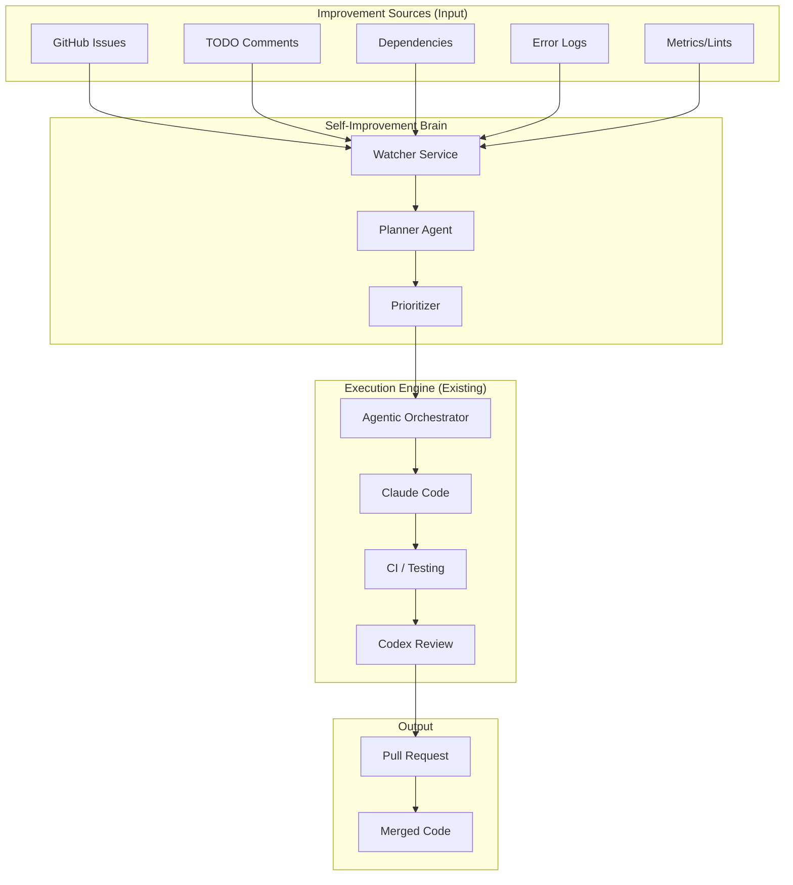

# Self-Improvement Architecture

## 概要

dursorが人間の明示的な指示を待つことなく、自律的に自身のプロダクト改善（機能追加、バグ修正、リファクタリング）を行うためのアーキテクチャ設計です。

この機能は、既存の [Agentic Dursor](./agentic-dursor.md) の自律実行能力（Coding -> CI -> Review -> Merge）の上位レイヤーとして動作し、**「何を改善すべきか」を発見・計画し、実行エンジンに投入する** 役割を担います。

## コンセプト

### Levels of Autonomy

| Level | 名称 | 状態 | Self-Improvementの役割 |
|-------|------|------|------------------------|
| L1 | **Task Runner** | 指示されたタスクを実行 | なし（既存機能） |
| L2 | **Issue Solver** | GitHub Issuesを監視し解決 | Issue → タスク変換 |
| L3 | **Code Janitor** | 技術的負債・ライブラリ更新を処理 | 定期スキャン → タスク生成 |
| L4 | **Product Improver** | ログ・メトリクスから改善案を立案 | ログ分析 → 改善案 → タスク生成 |
| L5 | **Autonomous Evolver** | 自身のコードを書き換えて能力向上 | メタプログラミング（v2以降） |

本設計では主に **L2 (Issue Solver)** と **L3 (Code Janitor)**、および **L4 (Product Improver)** の初期段階を対象とします。

---

## アーキテクチャ



### 1. Improvement Sources (改善の源泉)

dursorが改善タスクを発見するための情報源です。

*   **GitHub Issues Watcher**: 新しいIssueや特定のラベル（e.g., `bug`, `enhancement`）が付いたIssueを監視します。
*   **Tech Debt Scanner**:
    *   `TODO`, `FIXME` コメントの収集。
    *   Linter警告、複雑度（Cyclomatic Complexity）が高い関数の特定。
    *   テストカバレッジが低いモジュールの特定。
*   **Dependency Watcher**: `pyproject.toml` や `package.json` の依存ライブラリの更新をチェックします（Dependabot代替）。
*   **Log Analyzer**: エラーログを集計し、頻発する例外やパフォーマンスボトルネックを特定します。

### 2. Self-Improvement Brain (思考中枢)

収集した情報から「実行可能なタスク」を生成するコアコンポーネントです。

#### Planner Agent
収集された生の情報を、エンジニアリングタスクとして定義します。

*   **入力**: Issueの内容、エラーログ、該当コード周辺。
*   **処理**:
    1.  問題の再現性の確認（思考実験またはテスト作成）。
    2.  解決策の仮説立案。
    3.  タスクの定義（ゴール、修正範囲、成功条件）。
*   **出力**: `AgentRequest` 形式のタスク定義。

#### Prioritizer (優先順位付け)
リソース（APIコスト、計算リソース）は有限であるため、実行するタスクを選定します。

*   **スコアリング基準**:
    *   緊急度（Crash発生、Security Issue）。
    *   インパクト（影響範囲、UX向上度）。
    *   コスト予測（トークン消費量、難易度）。
*   **Budget Management**: 日次/週次の予算（ドル換算）内でタスクをスケジュールします。

### 3. Execution Engine (実行エンジン)

[Agentic Dursor](./agentic-dursor.md) で定義された `AgenticOrchestrator` を利用します。Brainから渡されたタスク定義に基づき、コーディング、テスト、レビュー、マージまでを自律的に行います。

---

## ワークフロー詳細

### A. Issue Driven Improvement (L2)

GitHub Issueが作成されたことをトリガーに動くフローです。

1.  **Trigger**: GitHub Webhook (Issue Opened/Labeled)。
2.  **Triage**: `Planner Agent` がIssueの内容を分析。
    *   情報不足ならコメントで質問する。
    *   実装可能ならタスク化する。
3.  **Plan**: 解決プランを作成し、関連ファイルを特定。
4.  **Execute**: `AgenticOrchestrator` を `CodingMode.FULL_AUTO` (または `SEMI_AUTO`) で起動。
5.  **Verify**: PR作成後、IssueにPRリンクを貼り、解決した旨を通知。

### B. Tech Debt Cleanup (L3)

定期実行（Cron）によるメンテナンスフローです。

1.  **Scan**: 毎週日曜深夜などにコードベース全体をスキャン。
2.  **Identify**:
    *   半年以上放置されている `TODO` コメント。
    *   複雑度が閾値を超えている関数。
    *   DeprecatedなAPIの使用箇所。
3.  **Propose**: `Planner Agent` が「今週のリファクタリング提案」を作成。
4.  **Approve**: （Semi Autoの場合）管理者が提案承認。
5.  **Refactor**: 安全なリファクタリングを実行（テストが通ることを絶対条件とする）。

---

## データモデル拡張

### ImprovementProposal

自動生成された改善提案を管理するモデル。

```python
class ProposalSource(str, Enum):
    GITHUB_ISSUE = "github_issue"
    TODO_COMMENT = "todo_comment"
    STATIC_ANALYSIS = "static_analysis"
    LOG_ANALYSIS = "log_analysis"
    DEPENDENCY = "dependency"

class ImprovementProposal(BaseModel):
    id: str
    title: str
    description: str
    source: ProposalSource
    source_reference: str  # Issue URL, File path, etc.
    priority: int  # 1-5
    status: str  # proposed, approved, in_progress, completed, rejected
    estimated_cost: float
    created_at: datetime
    task_id: str | None  # 紐づく実行タスクID
```

---

## 安全設計 (Safety Rails)

AIが勝手にプロダクトを破壊しないための安全装置です。

1.  **Human in the Loop (Gatekeeper)**:
    *   初期段階では、生成された `ImprovementProposal` はすべて「承認待ち」状態とし、人間が承認ボタンを押さないと実行されないようにする。
    *   信頼度が上がってきたら、低リスクなタスク（ドキュメント修正、ライブラリのパッチ更新など）から `FULL_AUTO` を許可する。

2.  **Budget Guard**:
    *   1日あたりのAPI使用料の上限を設定。
    *   1タスクあたりの最大試行回数（Iteration）制限。

3.  **Sandboxed Execution**:
    *   コード実行はコンテナ内で行い、外部への予期せぬアクセスを遮断する。

4.  **Strict Verification**:
    *   既存テストが1つでも落ちたら絶対にマージしない。
    *   カバレッジを低下させる変更を拒否する。

---

## 実装ロードマップ

### Phase 1: Issue Solver (Issue対応)
*   [ ] GitHub Issue Webhookの受信ハンドラ。
*   [ ] Issue本文から `AgentRequest` を生成するシンプルなPlanner。
*   [ ] `AgenticOrchestrator` との連携。

### Phase 2: Tech Debt Hunter (リファクタリング)
*   [ ] コードベーススキャナーの実装（TODO検索、Ruff/ESLint連携）。
*   [ ] 定期実行スケジューラー。
*   [ ] 提案管理UI（承認画面）。

### Phase 3: Learning & Evolution (学習)
*   [ ] 失敗したタスクの分析と、次回への教訓（Memory）の保存。
*   [ ] 成功パターンの蓄積による精度向上。
