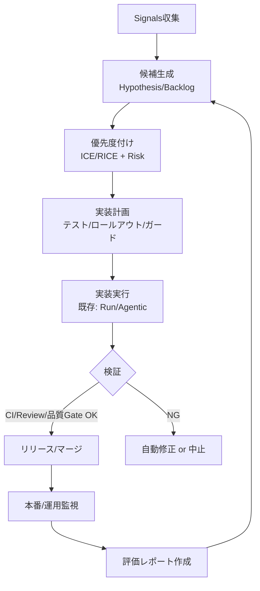
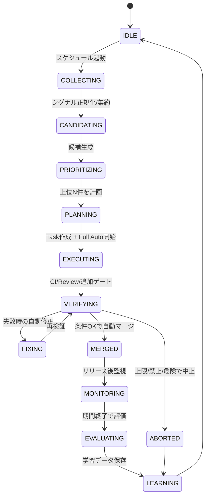

## Self-Improvement（自律改善）設計：dursorが人手ゼロでプロダクト改善する

## 背景と目的

dursor は現在、ユーザーが作成した Task / 指示を起点として、AI が実装・CI 修正・レビュー対応・（Full Auto なら）自動マージまでを自走できる設計を持つ（`docs/agentic-dursor.md`, `docs/coding-mode.md`）。

本ドキュメントでは、**「改善テーマの発見」から「実装・検証・リリース・学習」までを人間の手を介さずに回す**ための追加設計（Self-Improvement）を定義する。

### ゴール

- **自動課題発見**: 利用状況・エラー・パフォーマンス・UX などのシグナルから改善候補を自動生成する
- **自動優先度付け**: 価値（Impact）・確信度（Confidence）・工数（Effort）・リスク（Risk）で並べ替える
- **自動実装〜自動マージ**: 既存の Semi Auto / Full Auto の枠組みを再利用し、改善を PR として継続的に投入する
- **安全な自動化**: 予算上限・リスク制御・段階的リリース・監査ログ・停止スイッチを備える
- **学習ループ**: 「なぜ成功/失敗したか」を記録し、次の提案・実装・テスト計画の精度を上げる

### 非ゴール（初期スコープ外）

- **自律的なプロダクト戦略の大転換**（例: 新規事業方針、UI 全面刷新などの大規模変更）
- **保護ブランチ設定やリポジトリ権限の自動変更**
- **外部環境への破壊的操作**（DB 破壊、強制 push、データ削除など）
- **秘密情報を含むデータの取り扱いの自動拡張**（PII/機密の取り込みは明確に制限する）

---

## 全体像：Self-Improvement Loop

Self-Improvement は「観測 → 候補生成 → 計画 → 実装 → 検証 → リリース → 監視 → 学習」を繰り返す。



### 既存設計との関係

- **実装実行**: `RunService` / `PatchAgent` / CLI Executor を再利用（`docs/agents.md`）
- **自動化フロー**: Semi Auto / Full Auto のコントローラ/オーケストレータを再利用（`docs/agentic-dursor.md`, `docs/coding-mode.md`）
- **Git操作**: Orchestrator が一元管理（`docs/git_operation_design.md`）
- **レビュー**: Review Role（`ReviewService`）を品質ゲートとして組み込む（`docs/review.md`）
- **要件の保持**: Backlog を改善候補の溜め場として使える（`docs/task-split-v2.md` の Backlog 概念と整合）

---

## 追加コンポーネント（論理設計）

Self-Improvement では、既存の「指示→実装」だけでは足りないため、以下の責務を追加する。

### SelfImprovementOrchestrator（新規）

Self-Improvement Cycle の制御中枢。周期的にシグナルを集め、改善候補を生成し、優先度付けし、実行計画を立て、既存の実装フローに投入する。

- **入力**: Signals（ログ/メトリクス/ユーザー行動/サポート情報/CI 結果など）
- **出力**: BacklogItem / Task（+ 自動実行モード）/ PR / EvaluationReport

### Signal Ingestion（新規）

改善候補の材料（Signals）を集め、正規化して保存する。最低限以下を想定する。

- **プロダクト内イベント**: UI クリック、ページ遷移、機能利用率、離脱、滞在時間（匿名化）
- **エラー**: API 500/4xx、フロント JS error、例外スタック、Sentry 的情報（匿名化）
- **性能**: API レイテンシ、DB クエリ時間、フロント LCP/INP、ビルド時間、CI 時間
- **品質**: CI 失敗率、Flaky テスト、lint/mypy 警告、カバレッジ推移
- **運用**: GitHub Issues/PR コメント、リリースノート、依存関係の脆弱性（Dependabot 等）

### Policy Engine（新規）

「何をやってよいか」を厳密に制御する。Self-Improvement は強力なので、**禁止・許可・条件付き許可**を明文化する。

例:
- **許可**: バグ修正、テスト追加、ログ改善、性能改善、アクセシビリティ改善、依存関係更新
- **条件付き**: DB マイグレーション（後方互換を満たす/ロールバック策がある/段階的リリース）
- **禁止**: `.env` や秘密情報に触れる変更、強制 push、破壊的コマンド、権限設定変更

### Budget/Rate Guard（新規）

コスト暴走と無限ループ防止。

- 日次/週次の **LLM コスト上限**
- **同時実行数** と **キュー制限**
- **イテレーション上限**（既存の `IterationLimits` を Self-Improvement にも適用）
- 同一カテゴリの連続失敗時の **クールダウン**

### Evaluator（新規）

「マージしてよいか」「リリース後に成功したか」を判定する。CI/Review に加え、Self-Improvement では以下を扱う。

- **Before/After 指標**（例: エラー率、レイテンシ、離脱率）
- **回帰検知**（例: 重要エンドポイントの P95 悪化）
- **エクスペリメント評価**（A/B、段階的ロールアウト、カナリア）

---

## 自律改善の実行モデル（状態遷移）

Self-Improvement を「いつ・どこまで自動で進めるか」を明確化する。



---

## 候補（Hypothesis）の生成と優先度付け

### 候補の形式（例）

Self-Improvement は「改善テーマ」を **仮説（Hypothesis）** として持つ。

- **What**: 何を変えるか（例: “Tasks一覧が重いのでクエリを最適化する”）
- **Why**: 何が困っているか（例: P95 が 1.8s、離脱率が高い）
- **How**: 方針（例: インデックス追加、ページング、キャッシュ）
- **Success metric**: 成功指標（例: P95 を 900ms 未満）
- **Risk**: 影響範囲/ロールバック
- **Test plan**: 既存 + 追加すべきテスト

### 優先度付け（推奨: ICE + Risk）

Self-Improvement は「自動で上位 N 件だけ」進めるべきで、過剰実装を防ぐ。

- **Impact (I)**: 期待効果（SLO/UX/収益/コスト削減）
- **Confidence (C)**: データ根拠の強さ（シグナル量、再現性、因果の確度）
- **Effort (E)**: 工数・複雑度
- **Risk penalty (R)**: 失敗時のダメージ（回帰/セキュリティ/データ）

例: \( Score = \frac{I \times C}{E} - R \)

### 候補の格納先

既存設計の Backlog を活用し、Self-Improvement の候補は **BacklogItem として蓄積**する。

- `draft`: 自動生成直後（未確証）
- `ready`: データ根拠が揃い、実行可能
- `in_progress`: Task 化され自動実行中
- `done`: 評価まで完了

（Backlog は `docs/task-split-v2.md` と整合）

---

## 実装計画（Planning）で必ず決めること

Self-Improvement は「実装だけ自動」では危険なので、Planning フェーズで以下を構造化して固定する。

### 1) 変更範囲の宣言

- 対象領域（API / Web / DB / Docs）
- 触れてよい/いけないパス（例: `.git`, `.env*` は禁止）
- 大規模変更を避けるための上限（例: 変更ファイル数、LOC、DB マイグレーション禁止など）

### 2) テスト計画の強制

- 既存 CI を通すだけでなく、**改善テーマに対応したテスト追加**を必須化
- 「テストが書けない改善」は原則 `ready` にしない（例外は Policy で明文化）

### 3) ロールアウト戦略

- **内部フラグ**（Feature flag）で段階的に有効化（推奨）
- カナリア・割合リリース（可能なら）
- 監視期間と失敗判定（自動ロールバック条件）

### 4) ロールバック手順

Self-Improvement は失敗したときの自動対処が要る。

- **PR を revert する**のか
- **機能フラグを off**にするのか
- **データ互換**の扱い（前方/後方互換の保証）

---

## 実行（Execution）：既存フローへの落とし込み

### Task/Run/PR へのマッピング

- 1つの Hypothesis（改善テーマ） = 1つの Task（原則）
- Task は `coding_mode = full_auto` を指定し、自動実行を開始する（`docs/coding-mode.md`）
- 実装: Implementation Role（RunService）
- 品質: Review Role（ReviewService）
- マージ: Merge Gates をすべて満たしたら自動マージ（`docs/agentic-dursor.md`）

### Merge Gates（Self-Improvement 版）

既存の Full Auto の Gate をベースに、Self-Improvement 用に追加推奨する。

- **CI Green**
- **Review Score ≥ threshold**（例: 0.75〜0.85）
- **No forbidden patterns**（秘密情報/破壊的操作）
- **差分のサイズ上限**（例: 変更ファイル数、追加行数）
- **テスト追加が含まれる**（対象カテゴリによる）
- **性能/エラー回帰なし**（計測できる場合）

---

## リリース後の監視と評価（Monitoring/Evaluation）

Self-Improvement を「作りっぱなし」にしないため、マージ後の評価を**自動で**行い、次の候補生成に反映する。

### 評価ウィンドウ

- 例: マージ後 30分/6時間/24時間（カテゴリ別に可変）

### 成功/失敗判定の例

- **成功**: API エラー率が X% 改善、P95 が Yms 改善、CI 時間が Z% 短縮、サポート起票が減少
- **失敗**: 重要指標が閾値以上悪化、特定エラーが増加、ユーザー離脱が増加

### 学習データとして保存するもの

- Hypothesis → 実装内容 → 実測指標 → 判定 → 原因分析（推定）→ 次回の改善案
- 「失敗した型」をラベル化（例: “計測不足”, “テスト不足”, “スコープ過大”, “因果誤認”）

---

## セキュリティ/安全装置（必須）

Self-Improvement は「無人でコードをマージする」ため、事故の被害を限定する設計が必須。

### ハードガード（必ず守る）

- **Forbidden paths**: `.git`, `.env*`, `*.key`, `*.pem`, `credentials.*` 等
- **Forbidden operations**: 強制 push、破壊的コマンド、権限変更、秘密情報の埋め込み
- **Protected Branch**: main は GitHub 側で保護し、Auto Merge は条件を満たす場合のみ
- **監査ログ**: すべての意思決定（なぜその候補を選んだか）と操作を永続化

### ソフトガード（運用で調整）

- **予算上限**（LLM コスト・実行数・同時数）
- **カナリア/フラグ**（リリース影響を限定）
- **失敗時の自動停止**（連続失敗、特定カテゴリの事故）

### 停止スイッチ（Kill Switch）

環境変数/設定で **即時停止**できること。

- `DURSOR_SELF_IMPROVEMENT_ENABLED=false` で全停止
- `DURSOR_SELF_IMPROVEMENT_MAX_TASKS_PER_DAY=0` で実質停止
- `DURSOR_AGENTIC_AUTO_MERGE=false` で「自動マージのみ」停止（改善はPRまで）

---

## データモデル（提案）

既存 DB（SQLite）に最小追加で Self-Improvement の監査と再現性を担保する。

### テーブル例（案）

- `signals`: 正規化済みシグナル（集計単位/タグ/メタ情報）
- `improvement_hypotheses`: 候補（Backlog と紐付け可能）
- `improvement_cycles`: 定期実行の単位（いつ何を処理したか）
- `improvement_executions`: Task/PR/Run へのリンク、結果
- `evaluation_reports`: マージ後評価

（詳細スキーマは実装フェーズで `storage/schema.sql` に落とす）

---

## API（提案）

人手ゼロでも、**監査・デバッグ・可視化**のために API を用意する。

```yaml
POST /v1/self-improvement/cycles/run:
  description: 手動/スケジュール起動（内部的に同じ）
  response: { cycle_id: string }

GET /v1/self-improvement/cycles/{cycle_id}:
  description: サイクルの概要（候補数、選定理由、実行結果）

GET /v1/self-improvement/hypotheses:
  description: 候補一覧（Backlogと同等でも可）

POST /v1/self-improvement/kill-switch:
  description: 緊急停止（管理者向け・将来）
```

> v0.1 は無認証のため、本番運用ではネットワーク/リバプロ/認証で保護するか、v0.2+で認証を導入する前提とする。

---

## スケジューリング（提案）

Self-Improvement は「定期的に少量ずつ」が基本。

- **cron/worker**: 例）1時間に1回、または1日2回
- **最大実行数**: 例）1日あたり 1〜3 件
- **静穏時間帯**: 例）深夜に集中実行（CI 負荷も考慮）

---

## 実装ロードマップ（提案）

### Phase 1: 最小安全ループ（提案→PRまで）

- Signals の最小収集（CI 失敗率、エラーログ、性能メトリクスの一部）
- Hypothesis 生成 → Backlog 登録（`draft/ready`）
- Policy/Budget ガード
- **自動実装はするが Auto Merge はしない**（まずは PR まで）

### Phase 2: Full Auto（自動マージ）

- Merge Gates の実装強化（差分上限、テスト追加条件）
- Review 連携の強制
- 監査ログの永続化
- 自動マージ（条件付き）解禁

### Phase 3: リリース後評価と学習

- 評価ウィンドウ・回帰検知
- 自動ロールバック（フラグ or revert）
- 評価データを候補生成/優先度付けに反映

---

## 関連ドキュメント

- `docs/agentic-dursor.md`（Semi Auto / Full Auto の自動実装〜自動マージ）
- `docs/coding-mode.md`（モードと Gate の考え方）
- `docs/review.md`（Review → Fix の連携）
- `docs/git_operation_design.md`（Git操作の集約方針）
- `docs/task-split-v2.md`（Backlog 概念）
- `docs/architecture.md` / `docs/agents.md`

