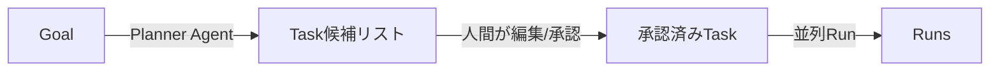
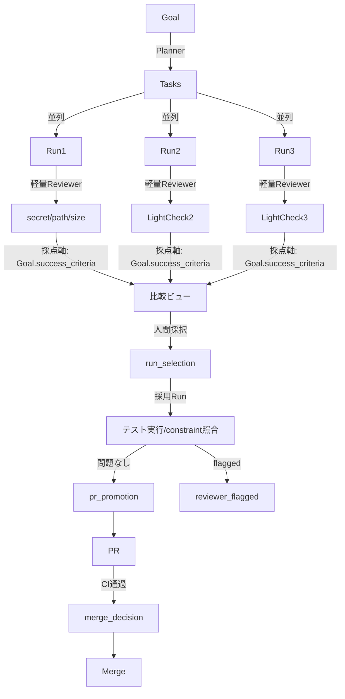

# sumikaの思想を取り入れた拡張設計

本ドキュメントは、別プロジェクト [sumika](https://github.com/) の「Goal駆動の開発OS」思想を、zlothのアーキテクチャにどう取り込むかをまとめたものです。

`zloth_gen2.md` (信頼の生成 / Trust Ladder) と `zloth_gen2_implementation_roadmap.md` (Decision Visibility 実装計画) と**同じ北極星**を共有しつつ、sumikaが先行して具体化している「上流の意図モデル」と「縦のプロセスゲート」を補完的に取り入れることが目的です。

---

## 1. 思想の整理

### 1.1. zloth と sumika の重心軸

| 軸 | zloth | sumika |
|---|---|---|
| 入力 | チャット指示 (Task = 会話単位) | Goal / Vision / Constraints / Success Criteria |
| 中間構造 | なし (Task直下にRun) | Planner: Goal → Milestone → Task (PRサイズ) |
| 並列性 | **モデル横並列** (同タスクを複数LLMで比較) | 単線プラン |
| 品質ゲート | 暗黙 (人間がPRレビュー) | Reviewer Agent (secret/risk/test scan) + Approval Queue |
| 意思決定の可視化 | gen2で構築中 (Decision/Evidence) | Decision Log (構造化済み) |
| 出力 | Patch + AI生成PR | Draft PR handoff Markdown + Reviewer Report |

- **zloth = 横軸 (並列)**: 同タスク × 多モデル → 比較して採択
- **sumika = 縦軸 (プロセス)**: Goal → Plan → Run → Review → Approval

両者は競合せず**直交している**ため合成可能です。

### 1.2. 既存gen2ビジョンとの整合

| gen2 Phase | sumikaが提供する具体メカニズム |
|---|---|
| Phase 1: Decision Visibility | Decision Log (構造化), Reviewer Report (Evidence源泉) |
| Phase 2: Decision Reuse | Approval Queue の蓄積を学習源にできる |
| Phase 3: Delegated Responsibility | Autonomy Level 3 の安全境界 (no auto-merge / no auto-deploy) |
| Phase 4: Autonomous under Governance | Goal + Constraints + Success Criteria が明示的ガバナンス境界になる |

つまり sumika 思想の取り込みは、gen2のフェーズを置き換えるものではなく、**各フェーズに必要な"構造化された容れ物"を提供**します。

---

## 2. 取り込むコンセプト

### 2.1. Goal を Task の上位構造として導入

#### 現状 (zloth)
- `Task` がユーザー意図の最上位エンティティ ([apps/api/src/zloth_api/domain/models.py](apps/api/src/zloth_api/domain/models.py))
- 「何を作るか」「成功条件は何か」「触ってはいけないところは何か」がチャット文中に埋もれる

#### 提案
`Task` の上に `Goal` を置く。Goalは複数のTaskに分解可能だが、最初は **1 Goal = 1 Task の薄い構造**でも価値が出る。

```python
class Goal:
    id: str
    repo_id: str
    title: str                  # 例: "ダッシュボードに月次サマリーカードを追加"
    vision: str                 # なぜやるか / 誰にどう価値を提供するか
    constraints: list[str]      # 触らない領域・守るべき制約
    success_criteria: list[str] # 完了の定義 (機械チェック可能なら尚可)
    created_at: datetime
```

**得られる効果**:
- 並列Runの**採点軸が定義される** (Success Criteria = 評価基準)
- ConstraintsはReviewer Gateの入力になる
- gen2で言うところの「ガバナンス境界」が UI に現れる

### 2.2. Planner: Goal → PR サイズの Task 分解

#### 現状
- ユーザーが自分でTaskを切る
- 大きい仕事は手動でTaskを複数作る運用

#### 提案
GoalからPRサイズ (推奨: 300行以内 / 1コンセプト1PR) の Task 列を提案する Planner Agent を追加する。**自動採用ではなく提案**にとどめ、ユーザーが編集してから承認する。



これは sumika の Planner と同じ責務だが、zloth では**並列モデル比較がそのまま使える**(複数のPlannerに分解させて人間が選ぶ)。

### 2.3. Reviewer / Quality Gate

#### 現状
- `BaseAgent` の出力は `summary / patch / files_changed / logs / warnings` ([apps/api/src/zloth_api/agents/base.py](apps/api/src/zloth_api/agents/base.py))
- 構造化された検査ステップは無い (CI連携はあるがRun単位の自己検査ではない)

#### 提案
Run完了後・PR化前に挟む `ReviewerService` を追加する。検査項目はsumikaの Reviewer Agent を参考に:

| 検査 | 内容 | 失敗時の挙動 |
|---|---|---|
| secret scan | API Key / 秘密鍵 / .env 文字列の混入 | Run = `flagged`, Approval Queue 必須 |
| forbidden path | `.git`, `.env`, `workspaces/`, `data/` の編集 | Run = `rejected` |
| diff size | しきい値超過 (例: 1000行) | warning, Approval Queue推奨 |
| test result | `npm test` / `pytest` の存在と成否 | warning |
| constraint match | Goal.constraints との照合 | warning |

検査結果は **Evidence として Decision に流れ込む** (gen2のEvidence_serviceに統合)。

```python
class ReviewerReport:
    run_id: str
    checks: list[CheckResult]    # 個別検査の結果
    overall: Literal["passed", "warning", "flagged", "rejected"]
    blocking_issues: list[str]
    recommendations: list[str]
```

### 2.4. Approval Queue

#### 現状
- 人間の承認ポイントはPR画面ごとに散在
- Run比較→採用→PR化→マージの各段階の「待ち」が一覧されない

#### 提案
プロジェクト/リポジトリを横断する **Approval Queue** を作る。エントリの種類:

| ApprovalKind | トリガー | 必要アクション |
|---|---|---|
| `run_selection` | 並列Run完了 | どのRunを採用するか |
| `reviewer_flagged` | Reviewer Gateが警告 | 強制続行 or 却下 |
| `pr_promotion` | 採用Run → PR化前 | 除外ファイル/タイトル確認 |
| `merge_decision` | CI通過 | マージ承認 |
| `branch_cleanup` | PR close/merge後 | `zloth/` ブランチ削除可否 |

Queueは sumika と同様 **破壊的操作を自動化しない原則** を持つ。Autonomy Level設定によって `merge_decision` のみ自動化を許す等、段階的に緩めていける。

### 2.5. Agent 出力契約の拡張

#### 現状 ([apps/api/src/zloth_api/agents/base.py](apps/api/src/zloth_api/agents/base.py))
```python
class AgentResult:
    summary: str
    patch: str
    files_changed: list
    logs: list[str]
    warnings: list[str]
```

#### 提案 (sumika の Agent Contract を参考)
```python
class AgentResult:
    summary: str
    patch: str
    files_changed: list
    logs: list[str]
    warnings: list[str]
    # 以下、新規追加
    decisions: list[Decision]           # 実装中に下した判断 (なぜこのライブラリ/設計にしたか)
    risks: list[Risk]                   # 懸念点 (高リスクパス・破壊的変更等)
    tests_run: list[TestResult]         # 実行したテストと結果
    needs_human: bool                   # 人間判断が必要か (Reviewerと連動)
    next_suggested_tasks: list[str]     # フォローアップTask候補
```

`decisions` と `risks` は Reviewer Gate と Decision Service の入力になり、**Run自体が"自分の仕事を説明する"** ようになる。

---

## 3. 設計上の最大の論点: 並列とプロセスの整合

sumika は「1 Plan → 1 Run → 1 PR」前提だが、zloth は「1 Task → N Run」の並列モデル。Approval Queue と Reviewer をどう設計するかで挙動が変わります。

### 3.1. 取りうる方針

| 方針 | 概要 | 長所 | 短所 |
|---|---|---|---|
| A. Run単位ゲート | 各Runごとに Reviewer 実行 → 全部 Queue 入り | 透明性高い | Queueが氾濫する |
| B. 採用後ゲート | 人間がRun選択した後だけReviewer実行 | Queueがすっきり | 採用判断時に検査結果を見れない |
| C. **ハイブリッド (推奨)** | 軽量検査 (secret/forbidden) は全Run。重検査 (test実行) は採用Runのみ | 比較時に最低限の安全情報あり、コスト抑制 | 実装やや複雑 |

### 3.2. 推奨フロー



これは **zloth の横軸 (並列) と sumika の縦軸 (プロセス) を直交合成した形**。

---

## 4. 段階的導入プラン

既存 gen2 ロードマップを止めずに、上に積む形で導入する。

### Stage 1: Reviewer Gate のみ薄く入れる (P0 優先)

**根拠**: 最小工数で最大の安全性向上。並列モデルとも干渉しない。

- 新規: [apps/api/src/zloth_api/services/reviewer_service.py](apps/api/src/zloth_api/services/reviewer_service.py) (secret/forbidden/diff size のみ)
- 変更: `RunService` の Run完了時に Reviewer を呼ぶ
- 変更: `RunStatus` に `flagged` を追加 (現在の `succeeded/failed/cancelled` に並ぶ)
- UI: RunDetailPanel に Reviewer Report セクション追加

gen2 の `evidence_service` (P0-2) と同時に作るとほぼ同じ材料で済む。

### Stage 2: Goal / Constraints の追加

**根拠**: 並列Runの採点軸を定義しないと、gen2のDecision Visibility が「なんとなく良さそう」止まりになる。

- 新規: `Goal` モデル + DAO + `goals_routes.py`
- 変更: `Task` に `goal_id` (nullable, 既存Taskは既定で互換)
- UI: Task作成時に Goal を選択 or 新規作成
- 既存タスクは Goal 無しで動き続ける (互換性維持)

### Stage 3: Approval Queue の統合

**根拠**: Stage 1, 2 で蓄積される判断ポイントを一覧する場所が必要になる。

- 新規: `Approval` モデル + `ApprovalKind` enum
- 既存の散在した承認UI (Run選択 / PR化 / マージ) を Queue に集約
- gen2 の Decision 記録と双方向リンク (Approval完了 → Decision生成)

### Stage 4: Planner と Agent契約拡張 (オプショナル)

**根拠**: 効果は大きいが、既存のチャット駆動UXを壊すリスクがある。Stage 1-3 が定着してから入れる。

- Planner Agent (新規 BaseAgent サブクラス) で Goal → Task列 を提案
- AgentResult に `decisions / risks / tests_run / needs_human / next_suggested_tasks` を追加
- 既存Agentは新フィールドを空で返してOK (段階移行)

---

## 5. やらないこと (Non-goals)

- **sumika をサービスとして組み込む** ことはしない (重複機能になるだけ)
- **Planner を必須化** しない (チャット駆動の体験を壊さない)
- **Goal を全Taskに必須化** しない (互換性維持)
- **Approval Queue で自動承認** しない (Autonomy Level 設定で個別解禁)
- **Reviewer の検査をブロッキングのみで使う** ことはしない (warningレベルで通せる)

---

## 6. 既存ロードマップとのマッピング

| 本ドキュメントのStage | zloth_gen2_implementation_roadmap との対応 |
|---|---|
| Stage 1: Reviewer Gate | P0-2 (Evidence自動収集) と同時実装が効率的 |
| Stage 2: Goal / Constraints | gen2 に未記載。本ドキュメントで追加提案 |
| Stage 3: Approval Queue | P0-3 (判断記録UI) を Queue 形式に拡張 |
| Stage 4: Planner / Agent契約 | gen2 Phase 2 (判断テンプレート) の前段に位置づけ |

---

## 7. 参考

- [zloth_gen2.md](./zloth_gen2.md) - 信頼の生成 / Trust Ladder のビジョン
- [zloth_gen2_implementation_roadmap.md](./zloth_gen2_implementation_roadmap.md) - Decision Visibility 実装計画
- [agents.md](./agents.md) - 現行 Agent システム
- [architecture.md](./architecture.md) - 現行アーキテクチャ
