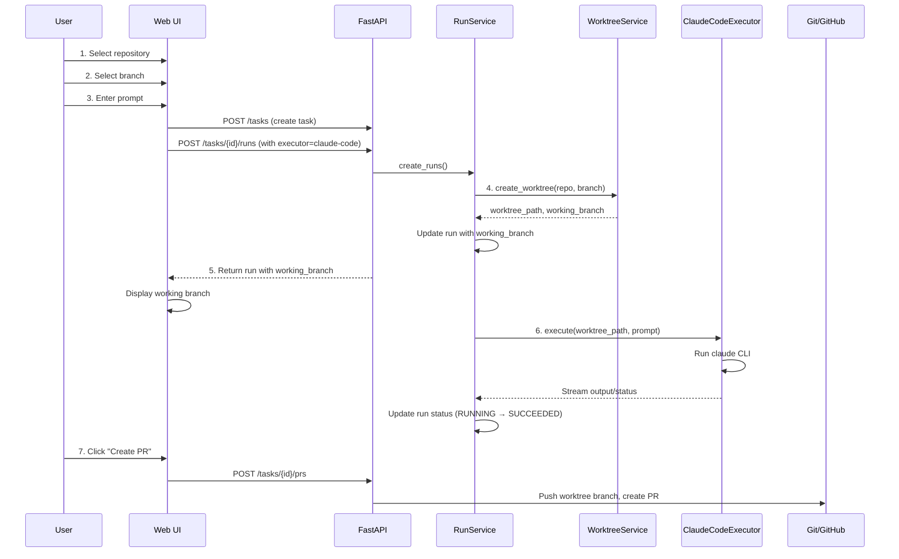
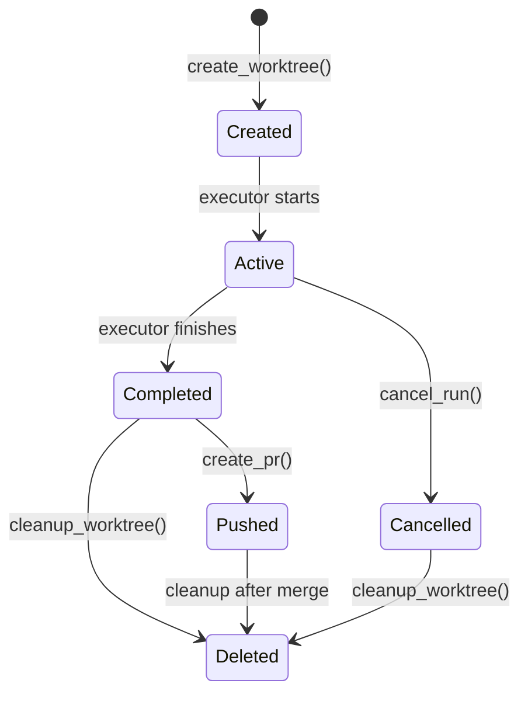

# Claude Code Workflow Integration

## Overview

This document outlines the design and implementation plan for integrating Claude Code as an agent executor in dursor. Unlike the existing `PatchAgent` which generates patches via LLM API calls, the Claude Code workflow executes the Claude Code CLI directly within isolated git worktrees.

## Target Workflow



## Current State Analysis

### Existing Components

| Component | Current Implementation | Reusability |
|-----------|----------------------|-------------|
| **RepoService** | Clones repos, creates working copies (directory copy) | Needs modification for worktree |
| **RunService** | Orchestrates PatchAgent execution | Needs modification for ClaudeCodeExecutor |
| **PatchAgent** | LLM API call → Unified diff | Keep as-is, add new executor |
| **UI (Home)** | Repo/Branch/Model selection | Reusable, add executor type |
| **UI (Task)** | Chat + Runs panels | Reusable, add branch display |
| **UI (RunDetail)** | Summary/Diff/Logs tabs | Reusable, enhance for streaming |

### Key Differences

| Aspect | PatchAgent (Current) | Claude Code (New) |
|--------|---------------------|-------------------|
| Execution | In-process LLM API call | External CLI process |
| Workspace | Directory copy (temporary) | Git worktree (persistent until PR) |
| Output | Unified diff patch | Direct file changes |
| Duration | Seconds | Minutes to hours |
| State | Stateless | Stateful (process lifecycle) |
| Interactivity | None | Potential for streaming output |

## Architecture Design

### New Components

```mermaid
flowchart TB
    subgraph Services["Services Layer"]
        RS[RunService]
        WS[WorktreeService<br/>NEW]
    end

    subgraph Executors["Executor Layer (NEW)"]
        BE[BaseExecutor]
        PE[PatchExecutor<br/>wraps PatchAgent]
        CE[ClaudeCodeExecutor<br/>NEW]
    end

    subgraph External["External"]
        CLI[Claude CLI]
        GIT[Git Worktree]
    end

    RS --> BE
    BE <|-- PE
    BE <|-- CE
    CE --> CLI
    RS --> WS
    WS --> GIT
```

### Domain Model Changes

```python
# New Enum
class ExecutorType(str, Enum):
    PATCH_AGENT = "patch_agent"     # Existing LLM-based
    CLAUDE_CODE = "claude_code"     # New CLI-based

# Extended Run model
class Run(BaseModel):
    id: str
    task_id: str
    model_id: str | None           # Optional for claude_code
    executor_type: ExecutorType    # NEW
    working_branch: str | None     # NEW: worktree branch name
    worktree_path: str | None      # NEW: worktree filesystem path
    instruction: str
    base_ref: str
    status: RunStatus
    # ... existing fields
```

### Database Schema Changes

```sql
-- Add columns to runs table
ALTER TABLE runs ADD COLUMN executor_type TEXT DEFAULT 'patch_agent';
ALTER TABLE runs ADD COLUMN working_branch TEXT;
ALTER TABLE runs ADD COLUMN worktree_path TEXT;
```

## Implementation Plan

### Phase 1: Backend - WorktreeService

**File**: `apps/api/src/dursor_api/services/worktree_service.py`

```python
class WorktreeService:
    """Manages git worktrees for isolated branch development."""

    def __init__(self, workspaces_dir: Path):
        self.workspaces_dir = workspaces_dir

    async def create_worktree(
        self,
        repo: Repo,
        base_branch: str,
        run_id: str,
    ) -> WorktreeInfo:
        """
        Create a new git worktree for the run.

        1. Generate unique branch name: claude/{run_id[:8]}
        2. Create worktree: git worktree add -b <branch> <path> <base>
        3. Return worktree info

        Returns:
            WorktreeInfo(path, branch_name)
        """
        pass

    async def cleanup_worktree(self, worktree_path: Path) -> None:
        """
        Remove worktree after PR creation or run cancellation.

        1. git worktree remove <path>
        2. Optionally delete branch if not pushed
        """
        pass

    async def list_worktrees(self, repo: Repo) -> list[WorktreeInfo]:
        """List all worktrees for a repository."""
        pass
```

**Data class**:
```python
class WorktreeInfo(BaseModel):
    path: Path
    branch_name: str
    base_branch: str
    created_at: datetime
```

### Phase 2: Backend - ClaudeCodeExecutor

**File**: `apps/api/src/dursor_api/executors/claude_code_executor.py`

```python
class ClaudeCodeExecutor:
    """Executes Claude Code CLI in a worktree."""

    async def execute(
        self,
        worktree_path: Path,
        instruction: str,
        on_output: Callable[[str], Awaitable[None]] | None = None,
    ) -> ExecutorResult:
        """
        Execute claude CLI with the given instruction.

        1. Spawn subprocess: claude --print "<instruction>"
        2. Stream stdout/stderr to on_output callback
        3. Wait for completion
        4. Generate diff from git status
        5. Return ExecutorResult

        Returns:
            ExecutorResult(success, summary, patch, logs)
        """
        pass

    async def cancel(self, process: asyncio.subprocess.Process) -> None:
        """Send SIGTERM to running process."""
        pass
```

**Execution options**:
```python
class ClaudeCodeOptions(BaseModel):
    timeout_seconds: int = 3600        # 1 hour default
    max_output_lines: int = 10000
    allow_network: bool = True
    env_vars: dict[str, str] = {}
```

### Phase 3: Backend - RunService Modifications

**File**: `apps/api/src/dursor_api/services/run_service.py`

```python
class RunService:
    def __init__(
        self,
        # ... existing deps
        worktree_service: WorktreeService,  # NEW
        claude_executor: ClaudeCodeExecutor,  # NEW
    ):
        pass

    async def create_runs(
        self,
        task_id: str,
        data: RunCreate,
    ) -> list[Run]:
        """
        Extended to support executor_type.

        If executor_type == CLAUDE_CODE:
          - Create single run (not parallel)
          - Create worktree
          - Set working_branch in run
        """
        pass

    async def _execute_claude_code_run(self, run: Run, repo: Repo) -> None:
        """
        Execute a Claude Code run.

        1. Update status → RUNNING
        2. Execute claude_executor.execute()
        3. Generate patch from worktree changes
        4. Update run with results
        5. Keep worktree for PR creation
        """
        pass
```

### Phase 4: API Route Changes

**File**: `apps/api/src/dursor_api/routes/runs.py`

```python
class RunCreate(BaseModel):
    instruction: str
    model_ids: list[str] | None = None  # Optional for claude_code
    executor_type: ExecutorType = ExecutorType.PATCH_AGENT  # NEW
    base_ref: str | None = None

class RunResponse(BaseModel):
    # ... existing fields
    executor_type: ExecutorType
    working_branch: str | None
    worktree_path: str | None
```

### Phase 5: Frontend - Home Page Changes

**File**: `apps/web/src/app/page.tsx`

```tsx
// Add executor type selection
const [executorType, setExecutorType] = useState<'patch_agent' | 'claude_code'>('patch_agent');

// Conditional UI based on executor type
{executorType === 'claude_code' ? (
  // Single execution, no model selection needed
  <div className="text-sm text-gray-500">
    Claude Code will execute directly in your repository
  </div>
) : (
  // Existing model selection UI
  <ModelSelector ... />
)}
```

### Phase 6: Frontend - Task Page Changes

**File**: `apps/web/src/app/tasks/[taskId]/page.tsx`

```tsx
// Display working branch for Claude Code runs
{selectedRun?.working_branch && (
  <div className="flex items-center gap-2 p-2 bg-blue-900/20 rounded">
    <GitBranchIcon className="h-4 w-4 text-blue-400" />
    <span className="text-sm font-mono text-blue-300">
      {selectedRun.working_branch}
    </span>
    <CopyButton value={selectedRun.working_branch} />
  </div>
)}
```

### Phase 7: Frontend - RunDetailPanel Changes

**File**: `apps/web/src/components/RunDetailPanel.tsx`

```tsx
// Add streaming output support for Claude Code runs
{run.executor_type === 'claude_code' && run.status === 'running' && (
  <StreamingOutput
    runId={run.id}
    onUpdate={(output) => setLogs(prev => [...prev, output])}
  />
)}

// Show PR button for Claude Code runs (always available when succeeded)
{run.executor_type === 'claude_code' && run.status === 'succeeded' && (
  <Button onClick={() => setShowPRForm(true)}>
    <PullRequestIcon className="h-4 w-4 mr-2" />
    Create PR from {run.working_branch}
  </Button>
)}
```

## API Changes Summary

### New/Modified Endpoints

| Method | Endpoint | Changes |
|--------|----------|---------|
| POST | `/v1/tasks/{id}/runs` | Add `executor_type` parameter |
| GET | `/v1/runs/{id}` | Add `working_branch`, `worktree_path` fields |
| GET | `/v1/runs/{id}/output` | **NEW**: Stream Claude Code output (SSE) |
| DELETE | `/v1/runs/{id}/worktree` | **NEW**: Cleanup worktree without PR |

### SSE Output Streaming

```python
@router.get("/runs/{run_id}/output")
async def stream_output(run_id: str):
    """Server-Sent Events for Claude Code output streaming."""
    async def event_generator():
        async for line in run_service.stream_output(run_id):
            yield f"data: {json.dumps({'line': line})}\n\n"
    return StreamingResponse(event_generator(), media_type="text/event-stream")
```

## TypeScript Type Changes

**File**: `apps/web/src/types.ts`

```typescript
type ExecutorType = 'patch_agent' | 'claude_code';

interface Run {
  // ... existing fields
  executor_type: ExecutorType;
  working_branch: string | null;
  worktree_path: string | null;
}

interface RunCreateRequest {
  instruction: string;
  model_ids?: string[];
  executor_type?: ExecutorType;
  base_ref?: string;
}
```

## Git Worktree Lifecycle



### Worktree Naming Convention

```
workspaces/
├── {repo_id}/                    # Main clone
│   ├── .git/
│   │   └── worktrees/
│   │       ├── run_{run_id_1}/   # Worktree git data
│   │       └── run_{run_id_2}/
│   └── ...
└── worktrees/
    ├── run_{run_id_1}/           # Worktree working directory
    │   ├── src/
    │   └── ...
    └── run_{run_id_2}/
```

### Branch Naming Convention

```
claude/{short_run_id}
# Example: claude/a1b2c3d4
```

## Error Handling

### Claude Code Execution Failures

```python
class ClaudeCodeError(Exception):
    """Base exception for Claude Code execution."""
    pass

class ClaudeCodeTimeoutError(ClaudeCodeError):
    """Execution exceeded timeout."""
    pass

class ClaudeCodeProcessError(ClaudeCodeError):
    """CLI process failed."""
    def __init__(self, exit_code: int, stderr: str):
        self.exit_code = exit_code
        self.stderr = stderr
```

### Recovery Strategies

| Error | Strategy |
|-------|----------|
| Timeout | Cancel process, keep worktree, allow retry |
| CLI crash | Mark run as failed, log stderr, keep worktree for debugging |
| Worktree conflict | Generate unique branch name with suffix |
| Disk full | Cleanup old worktrees, fail gracefully |

## Security Considerations

### Claude Code Execution Sandbox

```python
# Environment restrictions for Claude Code
CLAUDE_CODE_ENV = {
    "HOME": worktree_path,
    "CLAUDE_CODE_DISABLE_NETWORK": "0",  # Configurable
    "CLAUDE_CODE_MAX_TOKENS": "100000",
}

# Forbidden operations (via Claude Code configuration)
# - No access outside worktree
# - No sudo/root operations
# - Limited network access (optional)
```

### Worktree Isolation

- Each run gets its own worktree
- Worktrees are read-only to other processes
- Cleanup occurs after PR creation or explicit deletion
- No shared state between runs

## Migration Path

### v0.1 → v0.2 Migration

1. **Database migration**: Add new columns to `runs` table
2. **Backward compatibility**: Existing runs default to `executor_type = 'patch_agent'`
3. **Feature flag**: Enable Claude Code executor via `DURSOR_ENABLE_CLAUDE_CODE=true`

### Rollback Plan

If Claude Code integration causes issues:
1. Disable feature flag
2. Cleanup orphaned worktrees via admin command
3. All existing PatchAgent runs continue to work

## Testing Strategy

### Unit Tests

```python
# tests/test_worktree_service.py
async def test_create_worktree():
    """Test worktree creation with proper branch naming."""
    pass

async def test_cleanup_worktree():
    """Test worktree removal and branch cleanup."""
    pass

# tests/test_claude_code_executor.py
async def test_execute_success():
    """Test successful Claude Code execution."""
    pass

async def test_execute_timeout():
    """Test timeout handling."""
    pass
```

### Integration Tests

```python
# tests/integration/test_claude_code_flow.py
async def test_full_workflow():
    """
    1. Create task
    2. Create Claude Code run
    3. Verify worktree created
    4. Wait for completion
    5. Verify changes captured
    6. Create PR
    7. Verify PR created and worktree cleaned
    """
    pass
```

## Implementation Checklist

### Backend Tasks

- [ ] Create `WorktreeService` class
- [ ] Create `ClaudeCodeExecutor` class
- [ ] Add `ExecutorType` enum to domain models
- [ ] Update `Run` model with new fields
- [ ] Create database migration
- [ ] Modify `RunService` for Claude Code support
- [ ] Add SSE endpoint for output streaming
- [ ] Update PR creation to use worktree branches
- [ ] Add cleanup commands/endpoints
- [ ] Write unit tests
- [ ] Write integration tests

### Frontend Tasks

- [ ] Add executor type selection to Home page
- [ ] Update TypeScript types
- [ ] Display working branch in RunDetailPanel
- [ ] Add streaming output component
- [ ] Update PR creation flow for Claude Code runs
- [ ] Add copy button for branch name
- [ ] Update ChatPanel for Claude Code context
- [ ] Handle long-running run states in UI

### Documentation Tasks

- [ ] Update API documentation
- [ ] Add Claude Code setup guide
- [ ] Document worktree cleanup procedures
- [ ] Add troubleshooting guide

## Configuration

### Environment Variables

```bash
# Enable Claude Code executor
DURSOR_ENABLE_CLAUDE_CODE=true

# Claude Code CLI path (optional, defaults to 'claude')
DURSOR_CLAUDE_CLI_PATH=/usr/local/bin/claude

# Default timeout for Claude Code execution (seconds)
DURSOR_CLAUDE_CODE_TIMEOUT=3600

# Maximum concurrent Claude Code runs
DURSOR_CLAUDE_CODE_MAX_CONCURRENT=5
```

## Open Questions

1. **Parallel Claude Code runs**: Should we allow multiple Claude Code runs per task? (Current design: single run recommended due to resource constraints)

2. **Output persistence**: How much output should we store in the database vs. stream-only?

3. **Resume capability**: Should we support resuming interrupted Claude Code sessions?

4. **Cost tracking**: How to track API usage within Claude Code for billing/budgeting?

5. **Approval workflow**: Should Claude Code runs require user approval for certain operations?

## References

- [Claude Code CLI Documentation](https://docs.anthropic.com/en/docs/claude-code)
- [Git Worktree Documentation](https://git-scm.com/docs/git-worktree)
- [dursor Architecture](./architecture.md)
- [dursor Agents](./agents.md)
