# tazuna Next Generation - 次世代ビジョンと改善計画

## コンセプト

```
人間はAIにできず人間しかできないことだけをする
人間がやることを最小限、一目瞭然にする
ソフトウェアエンジニアリングにおける最高のUI/UX
パソコン、スマホ、どこからでも最高の開発体験
AIの進歩はAI coding toolに任せて開発体験、開発効率の向上に努める
```

---

## 目次

1. [コンセプトの解釈](#コンセプトの解釈)
2. [現状分析](#現状分析)
3. [あるべき姿（ビジョン）](#あるべき姿ビジョン)
4. [ギャップ分析](#ギャップ分析)
5. [優先度付きアクションプラン](#優先度付きアクションプラン)
6. [実装ロードマップ](#実装ロードマップ)

---

## コンセプトの解釈

### 1. 人間はAIにできず人間しかできないことだけをする

| 人間がやるべきこと | AIに任せるべきこと |
|------------------|------------------|
| **意思決定** - 何を作るか、どの方向に進むか | コード生成、リファクタリング |
| **承認** - PRをマージするかの最終判断 | テスト実行、CI修正 |
| **クリエイティブ** - 製品の方向性、UXの判断 | バグ修正、ドキュメント生成 |
| **コンテキスト提供** - ビジネス要件の説明 | コードレビュー、品質チェック |
| **品質保証** - 最終的な品質の確認 | 依存関係更新、セキュリティスキャン |

### 2. 人間がやることを最小限、一目瞭然にする

```
❌ 悪い例: 「設定画面を開いて、モデルを追加して、APIキーを入力して、タスクを作成して...」
✅ 良い例: 「1つの画面で、今やるべきことが明確にわかる」
```

**原則:**
- 次のアクションは常に1つだけ強調表示
- 選択肢は最小限に（デフォルトを賢く）
- 進捗状況は一目でわかる視覚化

### 3. ソフトウェアエンジニアリングにおける最高のUI/UX

- **認知負荷の最小化**: 複雑なワークフローをシンプルに
- **コンテキストスイッチの削減**: 必要な情報がすべて一画面に
- **フィードバックの即時性**: 操作結果が瞬時にわかる
- **エラー予防**: 問題が起きる前に警告

### 4. パソコン、スマホ、どこからでも最高の開発体験

- **フルレスポンシブ**: 画面サイズに応じた最適化
- **モバイルファースト**: 移動中でも承認・確認が可能
- **プログレッシブ**: オフライン対応、PWA化
- **通知連携**: Slack/Discord/メールでの通知

### 5. AIの進歩はAI coding toolに任せて開発体験、開発効率の向上に努める

- **ツール抽象化**: Claude Code, Codex, Gemini CLIを統一インターフェースで
- **自動更新**: 新しいツール・モデルの追加が容易
- **比較機能**: 複数ツールの出力を比較し最適解を選択
- **プラグイン機構**: 新しいAIツールの追加が容易

---

## 現状分析

### 現在のアーキテクチャ

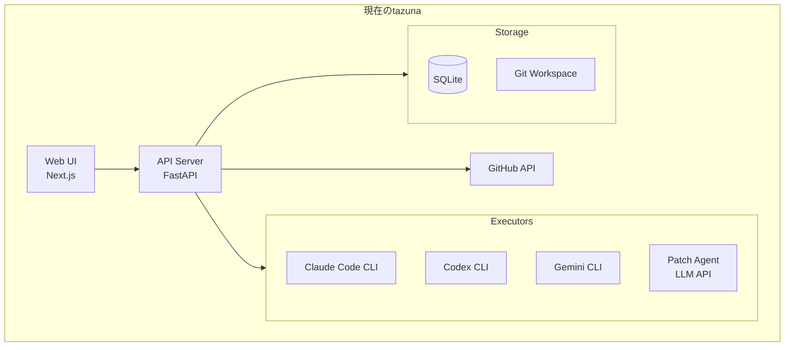

### 現在実装されている機能

| 機能 | 状態 | 説明 |
|------|------|------|
| **マルチモデル並列実行** | ✅ 実装済 | 複数モデルで同時にコード生成 |
| **Diff ビューア** | ✅ 実装済 | 生成コードの差分表示 |
| **PR作成** | ✅ 実装済 | GitHub PR作成（Auto/Link） |
| **CLI統合** | ✅ 実装済 | Claude Code, Codex, Gemini |
| **コードレビュー** | 🔶 設計済 | AIによるコードレビュー |
| **Kanban** | 🔶 設計済 | タスクの視覚的管理 |
| **Backlog** | 🔶 設計済 | 要件の分解と管理 |
| **Semi Auto Mode** | 🔶 設計済 | CI/レビュー自動対応 |
| **Full Auto Mode** | 🔶 設計済 | 完全自動化 |

### 現在のUI/UXの課題

| カテゴリ | 課題 | 影響度 |
|---------|------|--------|
| **オンボーディング** | 初回設定のガイダンス不足 | 高 |
| **モバイル対応** | 固定レイアウト、小画面で使えない | 高 |
| **情報過多** | 一画面に情報が多すぎる | 中 |
| **選択の多さ** | モデル選択、オプション過多 | 中 |
| **フィードバック** | 進捗状況がわかりにくい | 中 |
| **比較体験** | マルチモデルの価値を活かせていない | 高 |

### 現在のユーザーフロー（煩雑）

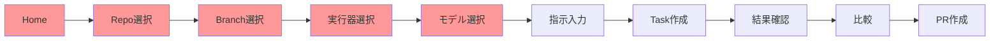

---

## あるべき姿（ビジョン）

### 理想のユーザー体験

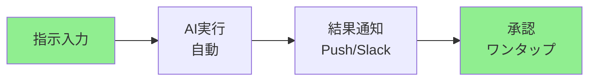

**人間の操作は2つだけ:**
1. **何をしたいか伝える**（指示入力）
2. **結果を承認する**（PRマージ）

### 理想のアーキテクチャ

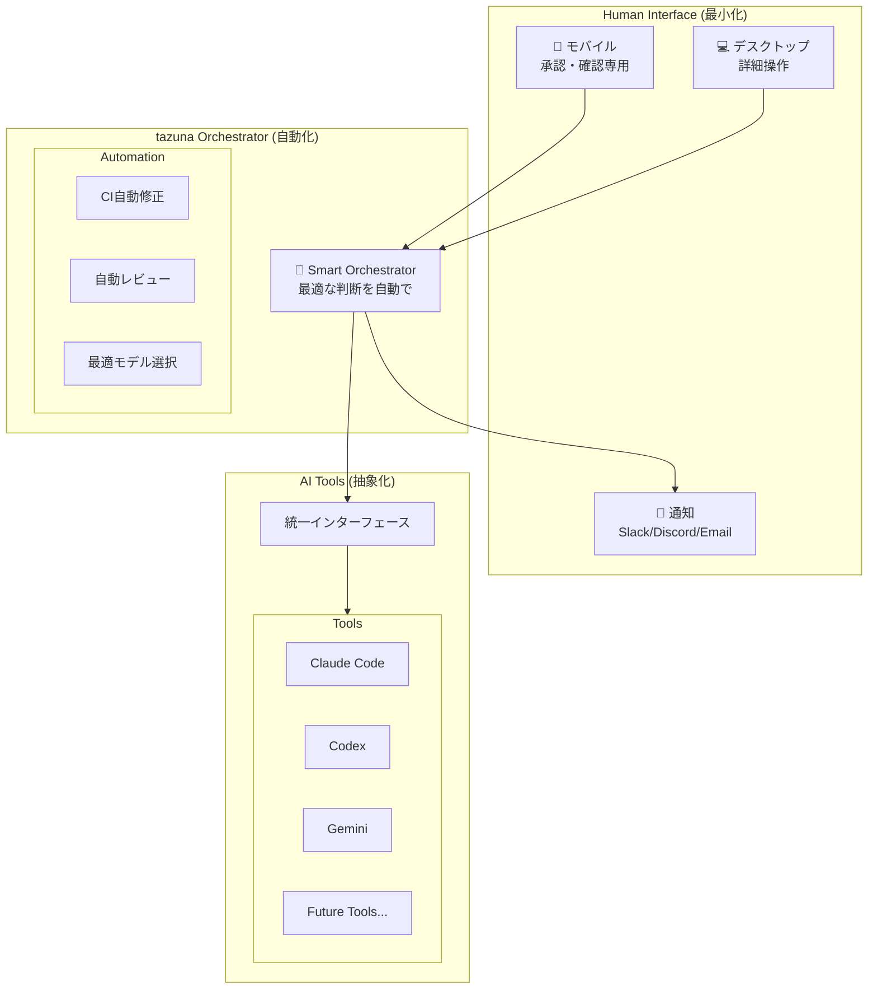

### 理想のUI設計原則

#### 1. One Screen, One Action

```
┌─────────────────────────────────────────────────────────────┐
│  🎯 今やること: PRをレビューしてマージ                       │
│                                                             │
│  ┌─────────────────────────────────────────────────────┐   │
│  │ ✅ Claude Code の実装が完了しました                   │   │
│  │                                                     │   │
│  │ 変更: 5ファイル (+120, -45)                         │   │
│  │ レビュースコア: 92/100                               │   │
│  │                                                     │   │
│  │ [詳細を見る]              [✅ マージ]  [🔄 再実行]   │   │
│  └─────────────────────────────────────────────────────┘   │
│                                                             │
│  💡 ヒント: 問題なければ「マージ」をタップしてください        │
└─────────────────────────────────────────────────────────────┘
```

#### 2. Smart Defaults

| 設定項目 | 現状 | あるべき姿 |
|---------|------|-----------|
| リポジトリ | 毎回選択 | 最後に使ったものを記憶 |
| ブランチ | 毎回選択 | mainからの新規ブランチを自動生成 |
| モデル | 毎回選択 | 過去の成功率から自動選択 |
| 実行器 | 毎回選択 | タスク種別から自動判断 |

#### 3. Progressive Disclosure

```
Level 1: 最小限のUI（モバイル向け）
├── 指示入力
├── 承認ボタン
└── 進捗表示

Level 2: 標準UI（デスクトップ向け）
├── Level 1 +
├── 詳細オプション（折りたたみ）
├── 比較ビュー
└── 履歴

Level 3: パワーユーザーUI
├── Level 2 +
├── カスタムプロンプト
├── 高度な設定
└── API直接アクセス
```

#### 4. Proactive Feedback

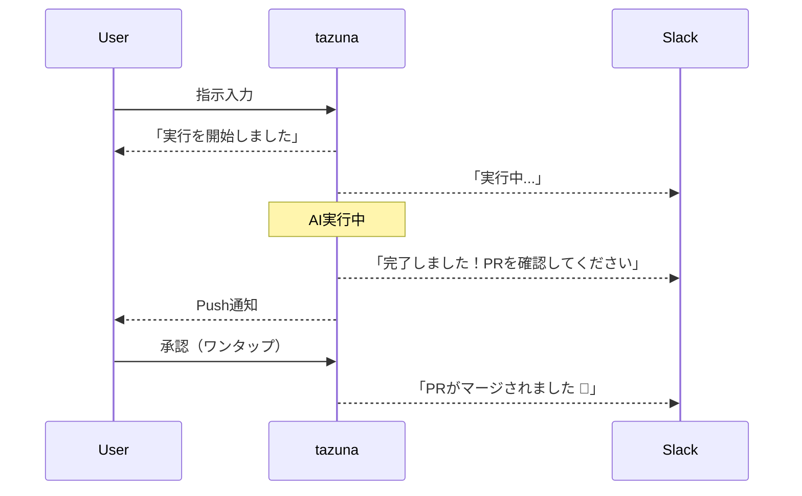

---

## ギャップ分析

### コンセプト vs 現状

| コンセプト | 現状 | ギャップ | 優先度 |
|-----------|------|---------|--------|
| **人間は承認だけ** | 多くの手動操作が必要 | Semi Auto/Full Autoが未実装 | P0 |
| **最小限の操作** | 選択肢が多すぎる | Smart Defaults未実装 | P0 |
| **最高のUI/UX** | 基本的なUI | デザインシステム未整備 | P1 |
| **どこからでも** | デスクトップのみ | モバイル対応不完全 | P1 |
| **AIツール抽象化** | 個別実装 | 統一インターフェース改善余地 | P2 |

### 機能面のギャップ

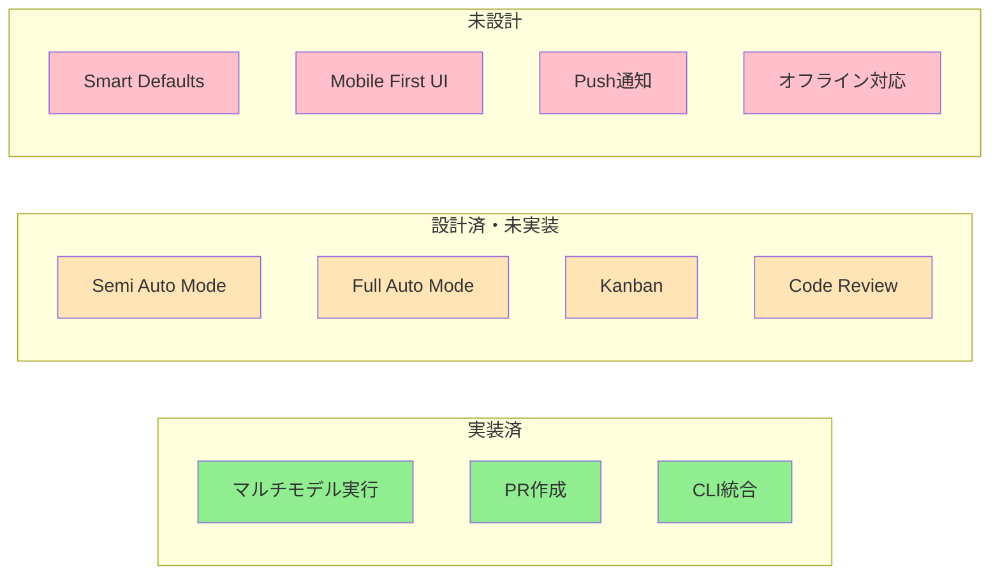

---

## 優先度付きアクションプラン

### P0: コア価値の実現（人間の操作を最小化）

#### 1. Smart Orchestrator の実装

**目的**: 人間の判断を最小化し、AIが最適な選択を行う

```python
class SmartOrchestrator:
    """
    Smart Orchestratorは以下を自動で判断:
    1. どのモデル/実行器を使うか
    2. いつ人間に確認を求めるか
    3. 失敗時にどう対処するか
    """
    
    async def execute_task(self, instruction: str) -> TaskResult:
        # 1. タスク種別を自動判断
        task_type = self.classify_task(instruction)
        
        # 2. 最適なモデルを選択
        best_models = self.select_models(task_type)
        
        # 3. 実行モードを決定
        mode = self.determine_mode(task_type)  # Interactive/Semi/Full Auto
        
        # 4. 実行
        return await self.execute(instruction, best_models, mode)
```

**実装タスク:**
- [ ] タスク種別分類器（feature/bugfix/refactoring/docs）
- [ ] モデル成功率トラッキング
- [ ] 自動モデル選択ロジック
- [ ] モード自動決定ロジック

#### 2. Semi Auto Mode の完成

**目的**: CI失敗/レビュー指摘を自動で修正し、人間は最終承認のみ

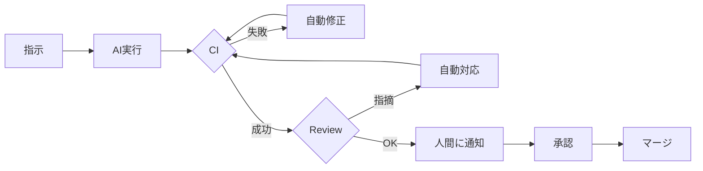

**実装タスク:**
- [ ] CI Webhook統合
- [ ] CI失敗時の自動修正フロー
- [ ] ReviewService実装
- [ ] レビュー指摘の自動対応

#### 3. ワンクリック指示UI

**目的**: 指示入力を最小限に

```
┌─────────────────────────────────────────────────────────────┐
│  💬 何をしますか？                                          │
│                                                             │
│  ┌───────────────────────────────────────────────────────┐ │
│  │ バグ修正: ログイン画面でエラーが表示されない           │ │
│  └───────────────────────────────────────────────────────┘ │
│                                                             │
│  クイックアクション:                                        │
│  [🐛 バグ修正] [✨ 機能追加] [🔧 リファクタ] [📝 ドキュメント] │
│                                                             │
│  最近のリポジトリ:                                          │
│  • hampen2929/tazuna (3時間前)                              │
│  • my-org/frontend (昨日)                                   │
│                                                             │
│                                           [▶️ 実行]         │
└─────────────────────────────────────────────────────────────┘
```

**実装タスク:**
- [ ] クイックアクションボタン
- [ ] 最近使用したリポジトリの記憶
- [ ] デフォルト設定の自動適用
- [ ] 指示テンプレート

### P1: 開発体験の向上

#### 4. モバイルファースト UI

**目的**: どこからでも承認・確認が可能に

```
Mobile View (承認特化)
┌─────────────────────┐
│ 🔔 tazuna           │
├─────────────────────┤
│                     │
│ ✅ 準備完了         │
│                     │
│ バグ修正完了        │
│ レビュースコア: 95  │
│                     │
│ [詳細] [マージ]     │
│                     │
├─────────────────────┤
│ 📋 2件の承認待ち    │
└─────────────────────┘
```

**実装タスク:**
- [ ] レスポンシブブレークポイント設定
- [ ] モバイル専用ビュー（承認特化）
- [ ] タッチ最適化（大きなボタン）
- [ ] スワイプジェスチャー対応

#### 5. プッシュ通知・外部連携

**目的**: 画面を見ていなくても状況がわかる

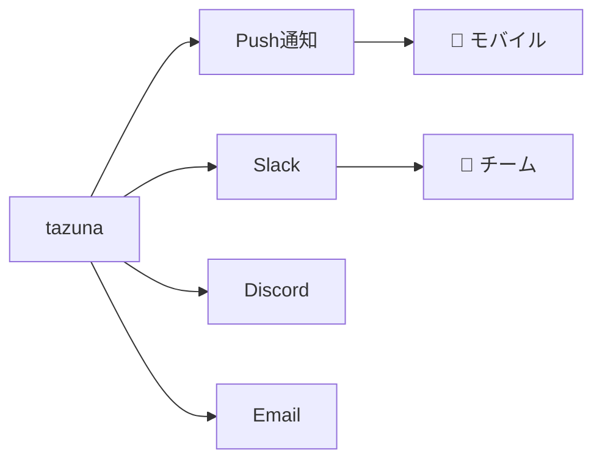

**実装タスク:**
- [ ] Web Push通知
- [ ] Slack Webhook統合
- [ ] Discord Webhook統合
- [ ] メール通知
- [ ] 通知設定画面

#### 6. 比較体験の強化

**目的**: マルチモデルの価値を最大化

```
┌─────────────────────────────────────────────────────────────┐
│  📊 実行結果比較                              [比較モード] │
├─────────────────────────────────────────────────────────────┤
│                                                             │
│  ┌─────────────┬─────────────┬─────────────┐               │
│  │ Claude      │ GPT-4       │ Gemini      │               │
│  ├─────────────┼─────────────┼─────────────┤               │
│  │ ✅ 成功     │ ✅ 成功     │ ⚠️ 警告     │               │
│  │ 5 files     │ 4 files     │ 6 files     │               │
│  │ Score: 95   │ Score: 88   │ Score: 75   │               │
│  │ ⭐ 推奨    │             │             │               │
│  └─────────────┴─────────────┴─────────────┘               │
│                                                             │
│  AIの推奨: Claude の結果が最も品質が高いです                │
│                                                             │
│  [Claude を採用してPR作成]                                  │
└─────────────────────────────────────────────────────────────┘
```

**実装タスク:**
- [ ] 比較ビューコンポーネント
- [ ] 品質スコアリングシステム
- [ ] AI推奨ロジック
- [ ] ワンクリック採用

### P2: 基盤強化

#### 7. デザインシステム整備

**目的**: 一貫した美しいUI

**実装タスク:**
- [ ] デザイントークン（CSS変数）
- [ ] コンポーネントライブラリ整備
- [ ] アイコン統一（Heroicons）
- [ ] アニメーション・トランジション
- [ ] アクセシビリティ（WCAG 2.1 AA）

#### 8. AIツール統一インターフェース

**目的**: 新しいAIツールの追加が容易に

```python
class AIToolInterface(Protocol):
    """統一されたAIツールインターフェース"""
    
    @property
    def name(self) -> str: ...
    
    @property
    def capabilities(self) -> list[Capability]: ...
    
    async def execute(
        self,
        instruction: str,
        workspace: Path,
        context: ExecutionContext,
    ) -> ExecutionResult: ...
    
    async def get_status(self, run_id: str) -> RunStatus: ...
    
    async def cancel(self, run_id: str) -> bool: ...
```

**実装タスク:**
- [ ] 統一Protocol定義
- [ ] 既存Executorのリファクタリング
- [ ] プラグイン機構
- [ ] 新ツール追加ガイド

#### 9. オフライン・PWA対応

**目的**: ネットワーク不安定でも使える

**実装タスク:**
- [ ] Service Worker導入
- [ ] オフラインキャッシュ
- [ ] PWAマニフェスト
- [ ] 同期キュー

### P3: 将来投資

#### 10. 高度な自動化

- [ ] **学習型モデル選択**: 過去の成功/失敗から学習
- [ ] **自動タスク分解**: 大きな要件を自動で分割
- [ ] **予防的エラー検出**: 実行前に問題を予測
- [ ] **コスト最適化**: API使用量を最小化

#### 11. チーム機能

- [ ] **マルチユーザー**: 複数人での利用
- [ ] **権限管理**: 承認者/実行者の分離
- [ ] **監査ログ**: 誰が何をしたかの記録
- [ ] **ダッシュボード**: チーム全体の生産性可視化

---

## 実装ロードマップ

### Phase 1: 最小限のアクション実現

**ゴール**: 指示→承認の2ステップフロー

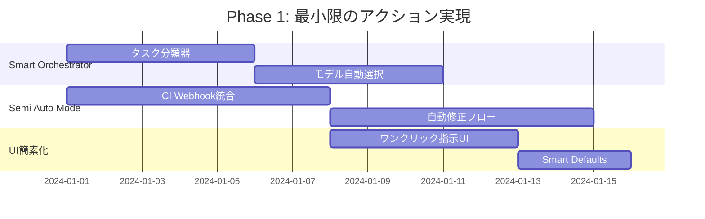

**成果物:**
- 指示入力だけで最適なモデル・設定で実行
- CI失敗時は自動で修正を試みる
- 人間は最終的なPR承認のみ

### Phase 2: どこからでも

**ゴール**: モバイルから承認、通知で状況把握

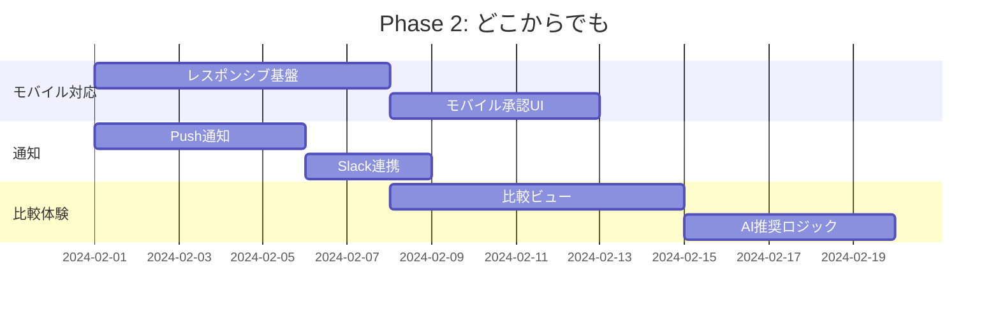

**成果物:**
- スマホから承認可能
- Slackで進捗通知
- 複数モデルの結果をAIが推奨

### Phase 3: 品質向上

**ゴール**: 美しく、アクセシブルなUI

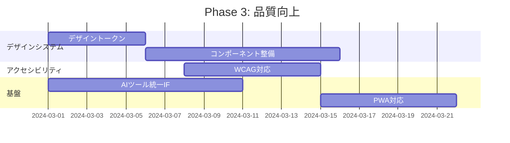

**成果物:**
- 一貫したデザイン
- キーボード操作完全対応
- オフラインでも閲覧可能

### Phase 4: 進化

**ゴール**: 継続的に賢くなるシステム

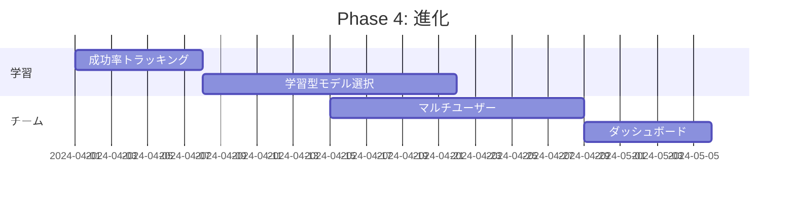

**成果物:**
- 使うほど賢くなる
- チームでの利用

---

## 成功指標（KPI）

### 人間の操作最小化

| 指標 | 現状 | 目標 |
|------|------|------|
| タスク完了までのクリック数 | 10+ | 3以下 |
| 設定画面を開く頻度 | 毎回 | 初回のみ |
| モデル手動選択率 | 100% | 10%以下 |

### UX品質

| 指標 | 現状 | 目標 |
|------|------|------|
| モバイルからの承認率 | 0% | 50%+ |
| 初回タスク完了時間 | 15分+ | 5分以下 |
| Lighthouse UX Score | - | 90+ |

### 自動化率

| 指標 | 現状 | 目標 |
|------|------|------|
| CI失敗の自動修正成功率 | 0% | 70%+ |
| レビュー指摘の自動対応率 | 0% | 60%+ |
| 人間介入なしの完了率 | 0% | 40%+ |

---

## まとめ

### 現状 → あるべき姿

```
現状: 人間が多くの選択と操作を行う「ツール」
  ↓
あるべき姿: 人間は意思決定と承認だけを行う「パートナー」
```

### 優先順位

1. **P0**: Smart Orchestrator + Semi Auto Mode = 人間の操作最小化
2. **P1**: モバイル対応 + 通知 + 比較 = どこからでも使える
3. **P2**: デザインシステム + AIツール統一 = 品質と拡張性
4. **P3**: 学習機能 + チーム = 継続的な進化

### 最終ビジョン

```
「tazunaを使えば、コーディングは指示と承認だけ。
 移動中でも、どこからでも、最高の開発体験を。」
```

---

## 関連ドキュメント

- [Architecture](./architecture.md) - システムアーキテクチャ
- [UI/UX Improvement v2](./ui-ux-improvement-v2.md) - UI改善詳細
- [Agentic Tazuna](./agentic-dursor.md) - 自律的開発フロー
- [Coding Mode](./coding-mode.md) - コーディングモード設計
- [Code Review](./review.md) - レビュー機能設計
- [Kanban](./kanban.md) - 看板機能設計
